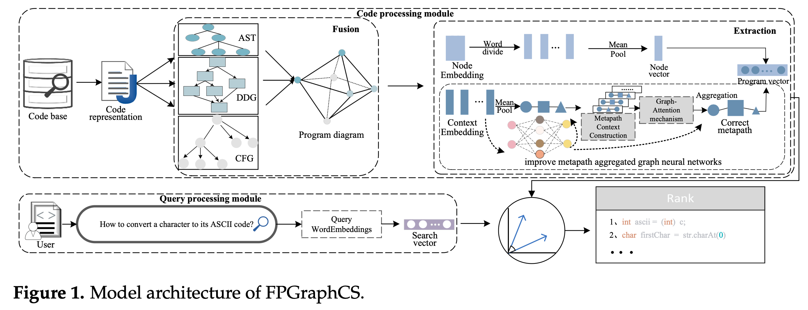
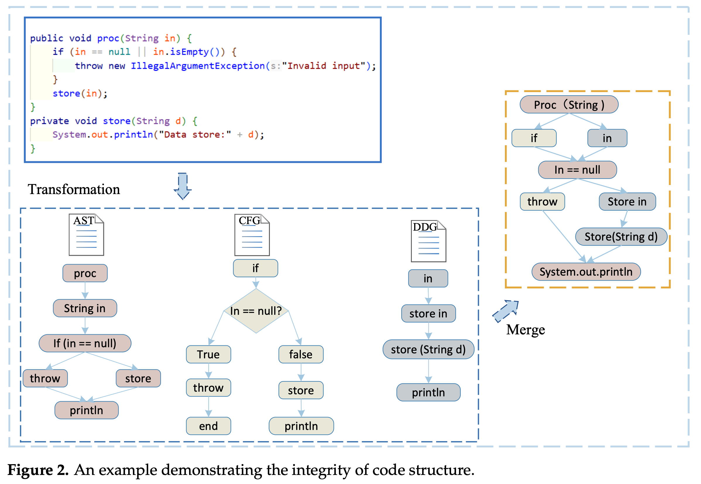
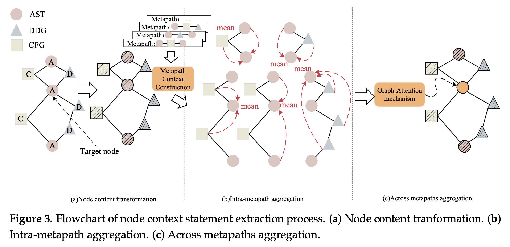
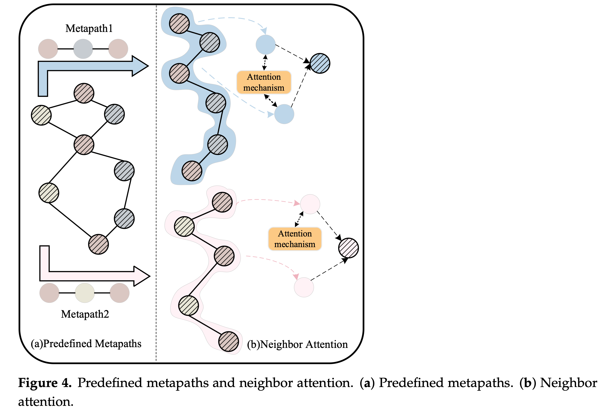
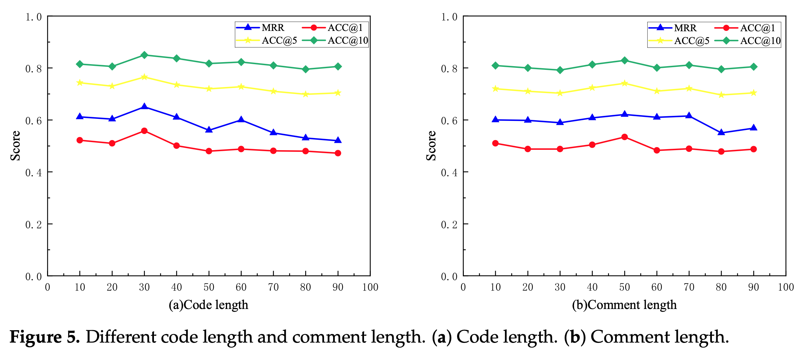
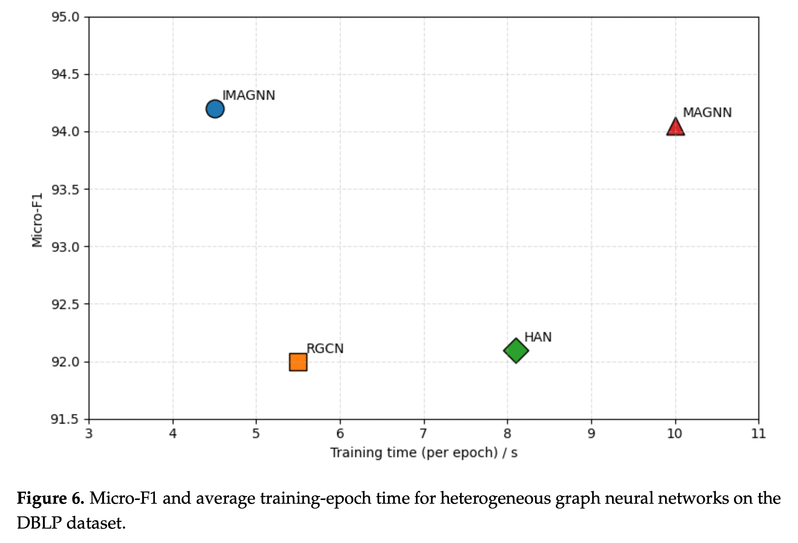

# FPGraphCS
# Early-Stage Graph Fusion with REfined Graph Neural Networks for Semantic Code Search

**Fusi Graf Tahap Awal dengan Jaringan Saraf Graf yang Disempurnakan untuk Pencarian Kode Semantik**

Longhao Ao ¹ dan Rongzhi Qi ¹,²,* 

¹ College of Computer Science and Software Engineering, Hohai University, Nanjing 211100, China; 231307050001@hhu.edu.cn 

² Key Laboratory of Water Big Data Technology of Ministry of Water Resources, Hohai University, Nanjing 211100, China

*Korespondensi: rzqi@hhu.edu.cn

Kata kunci: pencarian kode; mekanisme atensi graf; jaringan saraf graf; graf heterogen

Diterima: 24 Oktober 2025 Direvisi: 5 Desember 2025 Disetujui: 11 Desember 2025 Diterbitkan: 19 Desember 2025

Hak Cipta: © 2025 oleh penulis. Penerima Lisensi MDPI, Basel, Swiss. Artikel ini adalah artikel akses terbuka yang didistribusikan di bawah syarat dan ketentuan lisensi Creative Commons Attribution (CC BY).

https://gemini.google.com/share/d23d484125aa

https://www.mdpi.com/2076-3417/16/1/12

## Abstract

Pencarian kode (*code search*) telah mendapatkan perhatian yang signifikan dalam ranah penelitian ilmu komputer. Tujuan utamanya adalah untuk mengambil cuplikan kode yang paling relevan secara semantik dengan menyelaraskan semantik kueri bahasa alami (*natural language queries*) dengan bahasa pemrograman, sehingga berkontribusi pada peningkatan kualitas dan efisiensi pengembangan perangkat lunak. Seiring dengan skala repositori kode publik yang terus berekspansi dengan cepat, kemampuan untuk memahami secara akurat dan mencocokkan kode yang relevan secara efisien telah menjadi tantangan kritis. Selain itu, meskipun berbagai studi telah menunjukkan efikasi *deep learning* dalam tugas-tugas terkait kode, korelasi pemetaan dan semantik sering kali kurang ditangani dengan memadai, yang menyebabkan terganggunya integritas struktural dan kapasitas representasi yang tidak mencukupi selama pencocokan semantik.

Untuk mengatasi keterbatasan ini, kami mengusulkan [*FPGraphCS*, Ao et al, 2026], sebuah metode pencarian kode baru yang memanfaatkan konstruksi *functional program graphs* dan strategi *early fusion* — penggabungan pada tahap awal. Dengan mengintegrasikan *abstract syntax tree* (AST), *data dependency graph* (DDG), dan *control flow graph* (CFG), metode ini membangun representasi *multigraph* yang komprehensif dan diperkaya dengan informasi kontekstual. Selain itu, kami mengusulkan model [*IMAGNN*, Ao et al, 2026] untuk ekstraksi fitur kode dengan korelasi semantik yang kompleks dari grafik heterogen (*heterogeneous graphs*). Melalui penggunaan *metapath-associated subgraphs* dan seleksi *metapath* dinamis melalui mekanisme *graph attention*, [*FPGraphCS*, Ao et al, 2026] secara signifikan meningkatkan kapabilitas pencariannya. Hasil eksperimen menunjukkan bahwa [*FPGraphCS*, Ao et al, 2026] mengungguli metode *baseline* yang ada, dengan mencapai MRR sebesar 0,65 dan ACC@10 sebesar 0,842, yang menunjukkan peningkatan signifikan dibandingkan pendekatan-pendekatan sebelumnya.
## 1 - Introduction
Dengan pesatnya perkembangan rekayasa perangkat lunak (*software engineering*) dalam beberapa tahun terakhir, volume sumber daya kode yang tersimpan di repositori publik maupun privat telah tumbuh secara eksponensial, mencapai tingkat yang belum pernah terjadi sebelumnya. Selain itu, data penelitian menunjukkan bahwa pengembang biasanya menghabiskan sekitar sepertiga dari waktu pengembangan mereka untuk mencari cuplikan kode (*code snippets*) yang relevan dari basis kode berskala besar [*Mao et al, 2023*]. Hal ini dikarenakan mereka dapat meningkatkan efisiensi dan kualitas pengembangan perangkat lunak dengan menggunakan kembali atau memodifikasi kode yang sudah ada, sehingga secara signifikan mengurangi biaya pengembangan. Meskipun pencarian kode dapat memenuhi sebagian kebutuhan pengembang, tingkat kecerdasannya belum mencapai ekspektasi karena kompleksitas dan keberagaman yang melekat pada kode. Pencarian kode umumnya terdiri dari dua tahap: metode pencarian informasi awal, yang mengandalkan pencocokan teks, dan metode berbasis *deep learning*, di mana kueri dan kode disematkan ke dalam ruang vektor bersama (*shared vector space*). Sebagai contoh, [*Sourcerer*, Lv et al, 2015] membangun mesin pencari kode yang mendukung pencarian berbasis kata kunci maupun struktur dengan memodelkan dan mengindeks struktur semantik kode sumber, sehingga memungkinkan pengambilan entitas dan semantik program. [*QECK*, Nie et al, 2016] secara otomatis memperluas kueri melalui *pseudo-relevance feedback* (PRF), sementara [*QueCos*, Wang et al, 2021] menghasilkan deskripsi bahasa alami yang terkait dengan kueri asli, sehingga memperkaya informasi semantik kueri tersebut. Metode berbasis pencarian informasi ini [*Huang et al, 2021*] terutama bergantung pada pencocokan kueri kata kunci. Namun, metode-metode tersebut gagal mengatasi kesenjangan semantik (*semantic gap*) antara kode dan kueri bahasa alami, yang secara signifikan membatasi akurasi hasil pencarian.

Dalam beberapa tahun terakhir, fokus penelitian telah beralih ke *deep learning* (DL), di mana kueri bahasa alami dan kode sumber disematkan secara bersama-sama ke dalam ruang vektor bersama, dan pencocokan semantiknya dihitung berdasarkan kemiripan dalam ruang dimensi yang sama. Metode ini tidak hanya menghapus kata kunci yang tidak relevan, tetapi juga mempelajari pemetaan semantik antara kueri dan cuplikan kode [*Xie et al, 2023*]. Meskipun jaringan saraf graf (*graph neural networks* atau GNN) telah menunjukkan potensi dalam domain pencarian kode, beberapa tantangan masih tetap ada. Pertama, saat mencocokkan kueri bahasa alami dengan cuplikan kode, muncul masalah heterogenitas. Hubungan kompleks antara berbagai jenis simpul (*nodes*) dan sisi (*edges*) dalam graf heterogen belum ditangani secara efektif, yang menyebabkan pemanfaatan informasi semantik yang kaya menjadi tidak optimal [*Gao et al, 2022*]. Kedua, sebagian besar metode yang ada hanya mengekstrak sebagian informasi fitur dari kode, seperti [*SPT-Code*, Niu et al, 2022] dan [*GGNN*, Gu et al, 2021], yang masing-masing mengodekan *abstract syntax trees* (AST) dan *control flow graph* (CFG). Metode-metode ini mengabaikan dependensi global dan informasi struktural dalam kondisi kueri, yang menyebabkan cuplikan kode terfragmentasi secara semantik dan menyulitkan untuk memastikan niat kueri yang sebenarnya.

Untuk mengatasi tantangan ini, [*FPGraphCS*, Ao et al, 2026] memperkenalkan strategi *early fusion* yang menggabungkan AST, DDG, dan CFG ke dalam sebuah *functional program graph* yang terpadu untuk ekstraksi fitur kode yang lebih baik. Pemilihan AST, DDG, dan CFG untuk fusi graf awal didorong oleh keunggulan komplementer mereka dalam merepresentasikan aspek kritis dari semantik kode. Sementara AST menangkap struktur sintaksis, DDG memodelkan dependensi data, dan CFG merepresentasikan aliran kontrol; bersama-sama mereka memberikan pandangan kode yang lebih komprehensif, memungkinkan penangkapan fitur kode dan informasi semantik yang lebih presisi. Mengingat sifat heterogen dari sisi-sisi dalam *multi-graph* tersebut, sebuah jaringan saraf graf yang ditingkatkan [*MAGNN*, Fu et al, 2020] digunakan untuk memproses berbagai jenis sisi, seperti aliran kontrol, dependensi data, dan hubungan sintaksis, guna meningkatkan kemampuan model dalam memahami struktur semantik kode. Lebih lanjut, dengan mengintegrasikan *metapath-associated subgraphs* dan mekanisme *graph attention*, kami menetapkan bobot secara dinamis ke berbagai simpul, menekankan informasi kunci sambil menangkap dependensi temporal dalam kode, sehingga meningkatkan akurasi representasi kode dan kinerja pencocokan kueri. Untuk memvalidasi efektivitas metode kami, kami melakukan evaluasi kinerja yang ekstensif menggunakan dataset Java dari dataset sumber terbuka [*CodeSearchNet*, Husain et al, 2019].

1. Kami mengusulkan strategi *early fusion* yang mengintegrasikan AST, DDG, dan CFG dari pernyataan kode untuk membangun *functional program graph*, guna meningkatkan representasi fitur kode.


2. Untuk representasi kode, kami merancang [*IMAGNN*, Ao et al, 2026] yang membangun *metapath-associated subgraphs* untuk memitigasi kehilangan informasi dan agregasi berlebih (*redundant aggregation*), sembari mengganti mekanisme atensi dengan *mean pooling* untuk mengurangi beban komputasi tanpa mengorbankan fidelitas representasional pada graf heterogen.


3. Evaluasi empiris ekstensif pada *benchmark CodeSearchNet* yang tersedia secara publik menunjukkan bahwa [*FPGraphCS*, Ao et al, 2026] mencapai peningkatan yang signifikan secara statistik dan konsisten dibandingkan metode *baseline* terkini, sehingga membuktikan presisi semantik dan ketangguhannya yang unggul dalam pencarian kode.


Sisa dari makalah ini disusun sebagai berikut: Bagian 2 memberikan latar belakang mendalam tentang metode yang ada dalam pencarian kode. Bagian 3 menyajikan pendekatan yang diusulkan. Pada Bagian 4, kami menjelaskan pengaturan eksperimen, evaluasi kinerja, dan perbandingan dengan metode *baseline* menggunakan dataset *CodeSearchNet*. Terakhir, Bagian 5 membahas hasil dan menguraikan arah penelitian di masa depan.

## 2 - Related Work

## 2.1 - Text Based Code Representation
Metode representasi kode berbasis teks tradisional [*Survey of Source Code Search*, Sun et al, 2024] sangat bergantung pada informasi atribut kode [*Transfer Learning*, Salza et al, 2023], seperti nama metode dan kata kunci [*Code Search Is All You Need?*, Chen et al, 2024]. Karya seminal [*DeepCS*, Gu et al, 2018] memelopori penerapan *deep learning* pada *code search* dengan mengusulkan model jaringan saraf dalam (*CODEnn*) yang meninggalkan pencocokan kemiripan secara langsung. Sebaliknya, metode ini menyematkan (*jointly embeds*) deskripsi bahasa alami dan kode sumber secara bersamaan ke dalam ruang vektor berdimensi tinggi yang digunakan bersama, sehingga memungkinkan kode dan deskripsi yang terkait secara semantik direpresentasikan oleh vektor-vektor yang berdekatan untuk perhitungan kemiripan. Dibandingkan dengan teknik *information retrieval* konvensional, pendekatan ini menunjukkan kemampuan generalisasi dan akurasi pengambilan (*retrieval accuracy*) yang lebih unggul, serta menandai tonggak sejarah dalam *neural code search*. [*NCS*, Sachdev et al, 2018] selanjutnya memanfaatkan pelatihan *word embedding* tanpa pengawasan (*unsupervised*) pada kode dan komentar, yang dikombinasikan dengan rata-rata berbobot TF-IDF dari *embeddings* tersebut, untuk menghasilkan representasi vektor komposit bagi kode maupun anotasi. Pemeringkatan (*ranking*) kemudian dilakukan berdasarkan skor kemiripan, yang menghasilkan peningkatan efisiensi pencarian.

## 2.2 - Structural Feature-Based Code Representation
Pendekatan berbasis fitur struktural [*Two-Stage Attention-Based Model*, Xu et al, 2021] mengeksploitasi representasi kode terstruktur graf , termasuk *abstract syntax trees* (AST) — pohon sintaksis abstrak , *data flow graphs* (DDG) — graf aliran data , dan *program dependency graphs* (PDG) — graf dependensi program.

[*SPT-code*, Niu et al, 2022] berpendapat bahwa metode berbasis teks yang sederhana kekurangan pemahaman struktural yang mendalam. Mereka memperkenalkan arsitektur *sequence-to-sequence* yang diperluas dengan tugas *pretraining* (pra-pelatihan) yang memprediksi struktur kode-AST, sehingga memfasilitasi akuisisi pola sintaksis yang kompleks oleh model untuk meningkatkan pencocokan semantik [*CSSAM*, Hu et al, 2022]. Secara serupa, [*GraphCodeBERT*, Guo et al, 2020] menekankan pada pemodelan aliran dependensi data di antara variabel dan menyertakan tujuan *pretraining* tambahan , seperti prediksi sisi aliran data dan penyelarasan simpul, untuk memitigasi kompleksitas struktural serta memperkuat *control flow awareness* (kesadaran aliran kontrol). [*Edge Attention*, Zhao et al, 2022] mengidentifikasi keterbatasan dari pemodelan kode berwajah tunggal (*uni-faceted*) dan mengusulkan representasi graf dependensi program yang ditingkatkan yang mempertahankan petunjuk sintaksis sembari memperluas dependensi data dan kontrol , sehingga meningkatkan fleksibilitas dan *robustness* (ketangguhan) dalam menangkap fitur kode struktural dan semantik yang rumit.

[*MMAN*, Wan et al, 2019] melaporkan bahwa fitur modalitas tunggal tidak cukup menangkap kekayaan semantik secara penuh. Mereka menggabungkan *token* kode, AST, dan *control flow graphs* (CFG), masing-masing menggunakan enkoder LSTM, [*Tree-LSTM*, Tai et al, 2015], dan [*CRaDLe*, Gu et al, 2021], serta menerapkan teknik *intermediate fusion* (fusi tingkat menengah) untuk mencapai representasi semantik yang komprehensif. [*Multimodal Representation*, Gu et al, 2021] lebih lanjut membuktikan efikasi fitur multimodal , mengusulkan penyederhanaan AST dengan memangkas simpul redundan dan menyatukan label simpul, diikuti oleh strategi fusi multimodal. [*deGraphCS*, Zeng et al, 2023] menyoroti keterbatasan representasi graf konvensional saat berhadapan dengan data yang kompleks atau tidak terstruktur dan mengusulkan graf aliran berbutir halus yang berpusat pada variabel (*variable-centric fine-grained flow graph*) berdasarkan *LLVM intermediate representation* (IR) , yang memodelkan interaksi variabel yang presisi melalui dependensi data dan kontrol yang terintegrasi. [*GraphSearchNet*, Liu et al, 2023] mengusulkan kerangka kerja pencarian kode yang memanfaatkan *bidirectional gated graph neural networks* (BiGGNN) yang dikombinasikan dengan *multihead attention*, menekankan pada konteks struktural global dan pemahaman semantik yang mendalam.

Meskipun pendekatan-pendekatan ini memajukan representasi kode dari berbagai perspektif, ekspresivitas semantik fungsional yang tidak memadai membatasi kemampuan mereka untuk menangkap struktur sintaksis dan dependensi logis yang kompleks secara komprehensif. Selain itu, mereka umumnya kekurangan mekanisme untuk mengalokasikan bobot representasional secara dinamis di antara fitur-fitur heterogen. Untuk mengatasi kekurangan tersebut, pekerjaan ini mengusulkan kerangka kerja representasi graf program fungsional baru [*FPGraphCS*, Ao et al, 2026] yang bertujuan untuk mengodekan semantik kode secara komprehensif dan dengan demikian meningkatkan akurasi pencocokan.
## 2.3 - Heterogeneus Graph Representation Learning Methods
Evolusi *heterogeneous graph representation learning* — pembelajaran representasi graf heterogen — telah berkembang dari metode dekomposisi graf dangkal (*shallow graph decomposition*) dan metode *non-metapath random walk* [*Simple and Efficient HGN*, Yang et al, 2023] , yang menggunakan *node embeddings* berdimensi rendah yang sederhana dan sesuai untuk graf heterogen skala kecil [*MECCH*, Fu et al, 2024] , menuju metode berbasis *deep learning* tingkat lanjut yang mampu memodelkan graf besar dan kompleks [*Efficient Subgraph-Inferring*, Zhou et al, 2024]. Metode dangkal terbatas dalam kemampuannya untuk menangkap struktur semantik dan logis tingkat tinggi yang inheren dalam graf heterogen berskala besar [*Deep Graph Matching*, Ling et al, 2021].

Munculnya *graph neural networks* (GNN) telah memfasilitasi mekanisme agregasi lingkungan bertingkat (*multilevel neighborhood aggregation*) dan propagasi fitur yang secara signifikan meningkatkan kapasitas untuk mempelajari *node embeddings* yang ekspresif dari struktur graf heterogen. Model-model ini menangkap hubungan logis yang rumit antara simpul dan sisi, serta konteks semantik multiskala, yang menghasilkan peningkatan akurasi dan generalisasi dari representasi simpul.

Paradigma pembelajaran graf heterogen mutakhir saat ini mencakup pendekatan berbasis *relation-subgraph*, berbasis *metapath-subgraph*, dan *non-subgraph*. Metode *relation-subgraph* mendekomposisi graf heterogen berdasarkan tipe sisi menjadi beberapa subgraf spesifik-relasi, di mana masing-masing menekankan relasi semantik tertentu [*Higher-Order HGN*, Li et al, 2023]. Metode-metode ini mengagregasi fitur lingkungan dalam setiap subgraf dan menerapkan *residual connections* untuk menjaga aliran gradien. Secara khusus, *relational graph convolutional networks* (RGCN) [*Relational GCN*, Schlichtkrull et al, 2017] menginstansiasi paradigma ini dengan merancang filter konvolusional spesifik-relasi yang dikaitkan dengan matriks adjasensi dan matriks bobot yang berbeda untuk memodelkan pola konektivitas heterogen. Informasi yang teragregasi dibobot berdasarkan tipe relasi dan ditransformasikan melalui fungsi aktivasi nonlinier di seluruh lapisan [*Heterogeneous Graph Attention Network*, Wang et al, 2021].

Metode *metapath-subgraph* memperkenalkan *metapaths* — jalur meta — untuk mendefinisikan urutan semantik di berbagai tipe simpul heterogen, yang memungkinkan penangkapan kedekatan semantik yang beragam melalui agregasi berbasis jalur. Sebagai contoh, *metapath aggregated graph neural network* (MAGNN) [*MAGNN*, Fu et al, 2020] menggunakan enkoder khusus per *metapath*, yang mengagregasi informasi semantik simpul ujung dan simpul perantara untuk memperkaya *node embeddings* dan memperkuat pemahaman relasional yang komprehensif. Sebaliknya, metode berbasis *non-subgraph* menyematkan graf heterogen dengan memproyeksikan simpul dari berbagai tipe ke dalam ruang semantik bersama melalui transformasi linier, yang diikuti oleh strategi agregasi lingkungan baik yang bersifat *type-agnostic* (tidak peka tipe) maupun *type-aware* (peka tipe).

## 3 - Methodology

## 3.1 - Model Framework

Studi ini memperkenalkan **[*FPGraphCS*, Ao et al, 2026]**, sebuah metode *semantic code-search* (pencarian kode semantik) yang memproyeksikan representasi *functional program graph* dari kode sumber dan kueri bahasa alami yang telah ditokenisasi ke dalam ruang vektor terpadu (*unified vector space*), sehingga memungkinkan pengambilan berbasis kemiripan (*similarity-based retrieval*). Arsitekturnya, yang diilustrasikan dalam Gambar 1, terdiri dari dua modul utama: **modul pemrosesan kode** dan **modul pemrosesan kueri**.

Strategi *early fusion* (fusi awal) diterapkan untuk mengintegrasikan fitur-fitur kode multidimensi, sehingga secara substansial meningkatkan akurasi dan ketangguhan (*robustness*) pengambilan kode [*Two-Stage Paradigm*, Hu et al, 2023]. **[*FPGraphCS*, Ao et al, 2026]** berbeda dari *baseline* representatif seperti [*MAGNN*, Fu et al, 2020], [*GraphCodeBERT*, Guo et al, 2020], dan [*Deep Graph Matching*, Ling et al, 2021]/[*MMAN*, Wan et al, 2019] baik dalam konstruksi graf maupun strategi agregasi pesan heterogennya. Metode ini membangun *functional program graph* yang melakukan fusi awal terhadap *Abstract Syntax Tree* (AST), *Control Flow Graph* (CFG), dan *Data Dependency Graph* (DDG) menjadi sebuah *heterogeneous multigraph* (multigraf heterogen) yang terpadu sebelum pengodean neural , serta mendefinisikan *metapaths* (jalur meta) yang mengikuti hubungan *control-flow*, *data-dependency*, dan sintaksis antar simpul pernyataan daripada pola berbasis skema. Di dalam enkoder **[*IMAGNN*, Ao et al, 2026]**, interaksi lingkungan *intra-metapath* diagregasi melalui *mean pooling*, sementara atensi tingkat semantik di seluruh *metapaths* tetap dipertahankan, menghasilkan arsitektur yang ringan namun ekspresif yang dirancang khusus untuk *semantic code search*.

### Figure 1. Model architecture of FPGraphCS


Di dalam modul pemrosesan kode, representasi multimodal yang komprehensif diekstraksi terlebih dahulu dari repositori kode sumber, mencakup AST, DDG, dan CFG. Modalitas graf heterogen ini selanjutnya disatukan menjadi representasi *functional program graph* yang komprehensif. Ekstraksi fitur bertingkat kemudian dilakukan melalui jaringan saraf graf agregasi *metapath* yang ditingkatkan (*enhanced metapath aggregation graph neural network*). Secara spesifik:

* **Fitur tingkat simpul** dari graf program pertama-tama dikodekan melalui teknik *word embedding* tingkat lanjut.

* **Agregasi fitur kontekstual** dilakukan pada *metapath-associated subgraphs*, menghasilkan representasi semantik yang diperkaya dari simpul pernyataan kode.

* Proses ini berpuncak pada pembuatan *semantic vector embeddings* berdimensi tinggi dari kode sumber [*OCoR*, Zhu et al, 2020].

Pada sisi pemrosesan kueri, kueri pengguna disematkan ke dalam representasi vektor berdimensi tinggi menggunakan metodologi *word embedding* terkini. Dengan memanfaatkan model ekstraksi fitur yang telah dilatih sebelumnya (*pretrained*), **[*FPGraphCS*, Ao et al, 2026]** mengodekan kueri menjadi vektor semantik. Vektor-vektor ini kemudian dibandingkan dengan *embeddings* kode dari repositori melalui metrik kemiripan, memungkinkan sistem untuk memeringkat dan mengembalikan *top-k* cuplikan kode yang paling relevan secara semantik.


## 3.2 - Functional Program Graph
**Definisi:** Diberikan control flow graph — graf aliran kontrol — $C_{FG} = (V_{CF}, E_{CF})$, data dependency graph — graf dependensi data — $G_{DD} = (V_{DD}, E_{DD})$, dan abstract syntax tree — pohon sintaksis abstrak — $G_{AST} = (V_{AST}, E_{AST})$, di mana $V_{CF}$, $V_{DD}$, dan $V_{AST}$ masing-masing merepresentasikan himpunan simpul dalam CFG, DDG, dan AST, serta $E_{CF}$, $E_{DD}$, dan $E_{AST}$ adalah himpunan sisi berarah yang koresponden. Functional program graph $G = (V, E)$ didefinisikan sebagai graf yang dibentuk oleh simpul dan sisi berarah dari graf-graf tersebut:

$V$ adalah himpunan simpul, $V = V_{CF}$, dengan $V_{DD} \subseteq V$ dan $V_{AST} \subseteq V$. Setiap simpul merepresentasikan sebuah pernyataan (statement) dalam kode.

$E$ adalah himpunan sisi berarah, di mana setiap sisi direpresentasikan sebagai $e = (v_i, v_j, r) \in E$, dengan $v_i$ dan $v_j$ adalah simpul arbitrer dalam $V$, dan $r \in R = \{0, 1, 2\}$ menunjukkan tipe sisi.

$r = 0$ menunjukkan tipe sisi adalah hubungan kontrol (control relationship). $r = 1$ menunjukkan tipe sisi adalah dependensi data (data dependency). $r = 2$ menunjukkan tipe sisi adalah struktur sintaksis abstrak (abstract syntax structure).

Jika $(v_i, v_j) \in E_{CF}$, maka $(v_i, v_j, 0) \in E$, di mana sisi tersebut merepresentasikan CFG.

Jika $(v_i, v_j) \in E_{DD}$ dan $(v_i, v_j) \notin E_{CF}$, maka $(v_i, v_j, 1) \in E$, di mana sisi tersebut merepresentasikan DDG.

Jika $(v_i, v_j) \in E_{AST}$, serta $(v_i, v_j) \notin E_{CF}$ dan $(v_i, v_j) \notin E_{DD}$, maka $(v_i, v_j, 2) \in E$, di mana sisi tersebut merepresentasikan AST.

Untuk menyatukan semantik sintaksis, aliran kontrol, dan dependensi data, kami mengonversi AST, CFG, dan DDG menjadi satu functional program graph tunggal [PDG, The Program Dependence Graph and Its Use in Optimization, Ferrante et al, 1987]. Algoritma 1 memformalkan transformasi ini. Dimulai dari graf kosong, Algoritma 1 berjalan dalam tiga tahapan berurutan. Pertama (Baris 1 hingga 5), functional program graph dikonstruksi dan semua sisi aliran kontrol dari $G_{CFG}$ dimasukkan; simpul yang hilang akan dibuat, dan setiap sisi tersebut diberi label 0. Selanjutnya (Baris 6 hingga 12), prosedur melakukan iterasi pada sisi dependensi data dari $G_{DDG}$, menambahkan simpul yang tidak ada dan memasukkan sisi dengan label 1 hanya jika pasangan $(v_i, v_j)$ belum terhubung oleh sisi dalam $G_{CFG}$. Terakhir (Baris 13 hingga 20), sisi struktur sintaksis dari $G_{AST}$ dipertimbangkan; simpul yang hilang ditambahkan sesuai kebutuhan, dan sebuah sisi dimasukkan dengan label 2 hanya jika sisi tersebut tidak ada di $G_{CFG}$ maupun $G_{DDG}$. Urutan ini memastikan bahwa, ketika beberapa tipe relasi dapat menghubungkan pasangan simpul yang sama, relasi yang paling informatif secara semantik akan dipertahankan.

**Kompleksitas Waktu dan Ruang:** Kompleksitas waktu untuk membangun functional program graph (Algoritma 1) adalah 

$O(|E(CFG)| + |E(DDG)| + |E(AST)|)$, 

di mana 

$|E(CFG)|$, $|E(DDG)|$, dan $|E(AST)|$ 

masing-masing adalah jumlah sisi dalam CFG, DDG, dan AST. 

Kompleksitas ruangnya adalah 

$O(|V(CFG)| + |V(DDG)| + |V(AST)| + |E(CFG)| + |E(DDG)| + |E(AST)|)$, 

karena hal ini terutama bergantung pada penyimpanan struktur graf dan fitur simpul.

### Algorithm 1. Building functional program graph

```python
Algorithm 1 Building functional program graph.
Require: CFG G_CFG, DDG G_DDG, AST G_AST
Ensure: Functional program graph G_CF-DD-AST

1:  Initialize G_CF-DD-AST
2:  for each edge (vi, vj) in E(G_CFG) do
3:      if vi not in V(G_CF-DD-AST) then
4:          Add node vi to G_CF-DD-AST
5:      end if
6:      if vj not in V(G_CF-DD-AST) then
7:          Add node vj to G_CF-DD-AST
8:      end if
9:      Add edge (vi, vj, 0) to G_CF-DD-AST
10: end for

11: for each edge (vi, vj) in E(G_DDG) do
12:     if vi not in V(G_CF-DD-AST) then
13:         Add node vi to G_CF-DD-AST
14:     end if
15:     if vj not in V(G_CF-DD-AST) then
16:         Add node vj to G_CF-DD-AST
17:     end if
18:     if (vi, vj) not in E(G_CFG) then
19:         Add edge (vi, vj, 1) to G_CF-DD-AST
20:     end if
21: end for

22: for each edge (vi, vj) in E(G_AST) do
23:     if vi not in V(G_CF-DD-AST) then
24:         Add node vi to G_CF-DD-AST
25:     end if
26:     if vj not in V(G_CF-DD-AST) then
27:         Add node vj to G_CF-DD-AST
28:     end if
29:     if (vi, vj) not in E(G_CFG) AND (vi, vj) not in E(G_DDG) then
30:         Add edge (vi, vj, 2) to G_CF-DD-AST
31:     end if
32: end for

33: return G_CF-DD-AST
```

### Figure 2. An Example demonstrating the integrisy of code structure


## 3.3 - Code Feature Extraction
Menyusul konstruksi functional program graph melalui penggabungan CFG, DDG, dan AST , [FPGraphCS, Ao et al, 2026] menggunakan [IMAGNN, Ao et al, 2026] untuk menghitung latent code embeddings — penyematan kode laten. Pipa kerja (pipeline) ekstraksi ini terdiri dari tiga tahap berurutan: (i) ekstraksi fitur pernyataan simpul (node statement feature extraction), (ii) ekstraksi fitur konteks pernyataan simpul (node statement context feature extraction), dan (iii) fusi fitur (feature fusion).

## 3.3.1 - Node Statement Feature Extraction
Pertama, teknik word embedding (penyematan kata) diterapkan untuk mengekstraksi fitur dari berbagai jenis simpul dalam graf program. Setiap simpul dimodelkan dengan pernyataan kode sebagai fitur dasarnya. Namun, karena pernyataan kode memiliki panjang yang bervariasi, kami terlebih dahulu melakukan tokenisasi pada setiap pernyataan untuk mendapatkan urutan token yang sesuai [Fine-Grained Co-Attentive, Deng et al, 2022]. Setelah itu, teknik word embedding digunakan untuk mengonversi setiap token menjadi sebuah vektor. Vektor-vektor dari urutan token tersebut kemudian dirata-ratakan dan diintegrasikan untuk membentuk vektor fitur bagi setiap pernyataan.

Secara spesifik, asumsikan bahwa pernyataan yang telah ditokenisasi terdiri dari $n$ token, yang direpresentasikan sebagai:

$$S = \langle s_1, s_2, \dots, s_n \rangle \text{ (1)}$$

di mana $n$ adalah panjang urutan tersebut. Setelah word embedding, urutan vektor token adalah sebagai berikut:

$$Z_s = \langle Cs_1, Cs_2, \dots, Cs_n \rangle \text{ (2)}$$

Akhirnya, representasi vektor dari pernyataan simpul diperoleh dengan merata-ratakan vektor-vektor token dalam urutan tersebut:

$$C_{ud} = \frac{1}{n} \sum_{i=1}^n Cs_i \text{ (3)}$$

> Persamaan-persamaan tersebut merinci tahap Node Statement Feature Extraction (Ekstraksi Fitur Pernyataan Simpul) dalam arsitektur [FPGraphCS, Ao et al, 2026], yang bertujuan untuk mengubah pernyataan kode mentah menjadi representasi numerik (vektor).Berikut adalah penjelasan detail untuk setiap persamaannya:1. Persamaan (1): Tokenisasi Pernyataan$S = \langle s_1, s_2, \dots, s_n \rangle$Maksud: Pernyataan kode (misalnya if (x > 0)) tidak dapat diproses langsung oleh model saraf sebagai satu kesatuan teks utuh karena panjangnya yang bervariasi. Oleh karena itu, pernyataan tersebut dipecah menjadi urutan $n$ unit terkecil yang disebut token ($s_i$).Komponen: $S$ merepresentasikan urutan token hasil pemrosesan teks awal (preprocessing).2. Persamaan (2): Penyematan Kata (Word Embedding)$Z_s = \langle Cs_1, Cs_2, \dots, Cs_n \rangle$Maksud: Setiap token tekstual ($s_i$) dari Persamaan (1) dikonversi menjadi bentuk vektor numerik berdimensi tinggi ($Cs_i$) melalui teknik word embedding tingkat lanjut.Komponen: $Z_s$ adalah urutan vektor-vektor yang kini telah memiliki nilai numerik sehingga dapat dipahami oleh mesin, di mana setiap vektor $Cs_i$ menangkap informasi semantik dari token tersebut.3. Persamaan (3): Agregasi (Mean Pooling)$C_{ud} = \frac{1}{n} \sum_{i=1}^n Cs_i$Maksud: Untuk mendapatkan satu representasi vektor tunggal yang mewakili seluruh pernyataan kode dalam simpul graf, model melakukan operasi Mean Pooling (rata-rata).Komponen:$\sum_{i=1}^n Cs_i$: Menjumlahkan semua vektor token yang ada dalam satu pernyataan.$\frac{1}{n}$: Membagi hasil penjumlahan dengan jumlah total token ($n$) untuk mendapatkan nilai rata-ratanya.$C_{ud}$: Hasil akhir berupa vektor representasi simpul pernyataan yang akan digunakan dalam tahap pemrosesan graf selanjutnya.Kesimpulan:
Secara kolektif, ketiga persamaan ini menggambarkan proses transformasi dari kode teks mentah $\rightarrow$ urutan token $\rightarrow$ urutan vektor numerik $\rightarrow$ satu vektor representatif per simpul . Vektor akhir $C_{ud}$ inilah yang nantinya akan diperkaya lebih lanjut dengan informasi hubungan antar-simpul menggunakan model [IMAGNN, Ao et al, 2026].

## 3.3.2 - Node Statement Context Feature Extraction

Ekstraksi fitur konteks (context feature extraction) dari simpul merupakan komponen inti dari keseluruhan model. Tujuan utamanya adalah untuk meningkatkan representasi simpul pernyataan (statement node) dan membangun hubungan kontekstual antar pernyataan di dalam kode secara efektif.

Model dalam makalah ini [FPGraphCS, Ao et al, 2026] memanfaatkan propagasi informasi multi-hop lintas simpul melalui strategi metapath, yang menentukan metode penelusuran (traversal) informasi di dalam graf heterogen (heterogeneous graph), sehingga memungkinkan pemodelan konteks global yang efektif sebagaimana ditunjukkan pada Gambar 3.

Gambar 3a mengilustrasikan transformasi konten simpul yang menggabungkan tiga jenis informasi berbeda untuk merepresentasikan logika eksekusi (execution logic), dependensi data (data dependencies), dan struktur sintaksis kode dengan lebih baik. Dengan memproyeksikan berbagai tipe simpul ke dalam ruang vektor (vector space) yang sama, transformasi linier diterapkan pada setiap tipe simpul:

$$h_{u}^{\prime} = W_A \cdot f_{u}^{A} \text{(4)}$$

di mana $f_{u}^{A} \in \mathbb{R}^{dA}$ adalah vektor fitur asli dan $h_{u}^{\prime} \in \mathbb{R}^d$ merupakan proyeksi dari simpul $u$.

$W_A$ merepresentasikan matriks bobot parameter. Hal ini menjamin bahwa seluruh simpul dalam graf memiliki representasi vektor yang serupa. Metapath, yang dikonstruksi berdasarkan functional program graph, membantu memfasilitasi proses agregasi tahap berikutnya.

### Figure 3. Flowchart of node context statement extraction process


Metapath terdiri dari tipe simpul (node types) dan tipe sisi (edge types). Simpul dapat merepresentasikan pernyataan kode (code statements), pemanggilan fungsi (function calls), dan elemen lainnya, sedangkan tipe sisi mencakup sisi aliran kontrol (control flow edges), sisi dependensi data (data dependency edges), dan sisi struktur sintaksis (syntactic structure edges). Sebuah metapath dapat dideskripsikan sebagai jalur yang mengandung hubungan kompleks, dengan simpul awal $A_1$ dan simpul akhir $A_{k+1}$.

Setelah prapemrosesan fitur, metode ini mengonstruksi konteks lokal berbasis metapath $S_v^P$ untuk setiap metapath $P \in \Phi_X$ dan setiap simpul $v$. Konteks ini didefinisikan secara formal sebagai berikut: diberikan sebuah graf heterogen $G$ dan sebuah metapath $P$, subgraf lokal yang berpusat pada simpul $u$ pada metapath $P$ dinotasikan sebagai $S_u^P = (U_u^P, E_u^P)$, di mana sisi $(u_1, u_2) \in E_u^P$ jika dan hanya jika sisi ini termasuk dalam instansi metapath yang dimulai dari simpul $u$ mengikuti $P$ pada graf asli $G$. Secara spesifik, $S_u^P$ mencakup seluruh simpul yang terhubung ke $u$ melalui metapath $P$ beserta sisi-sisi yang sesuai.

Konteks lokal berbasis metapath $S_v^P$ menangkap hubungan antara simpul target $v$ dan tetangganya sebagaimana diinduksi oleh metapath $P$. Pendekatan ini secara efektif mengatasi hilangnya informasi yang disebabkan oleh tidak adanya simpul perantara dalam metapath pada model [HAN, Wang et al, 2021], sembari secara simultan mengurangi komputasi redundan yang muncul akibat tumpang tindih metapath pada [MAGNN, Fu et al, 2020].

Gambar 3b menggambarkan modul agregasi intra-metapath, di mana jaringan saraf graf agregasi metapath yang disempurnakan menggabungkan pesan yang berasal dari tetangga yang terhubung oleh metapath yang sama. Sebagai kontras yang nyata, arsitektur baseline yang ditunjukkan pada Gambar 4 didasarkan pada metapath yang dibuat secara manual (hand-crafted) dan mekanisme atensi tingkat tetangga (neighbor-level attention). Meskipun mekanisme atensi [Co-Attentive Representation, Shuai et al, 2020] secara rutin diperkenalkan pada tahap ini dalam GNN heterogen sebelumnya, studi ablasi terkontrol pada tolok ukur DBLP dan IMDB—di mana atensi tingkat tetangga dan tingkat semantik dihilangkan dan diganti dengan agregasi rerata (mean aggregation)—menunjukkan bahwa atensi tersebut tidak bersifat esensial.

Sebagaimana dirangkum dalam Tabel 1, penggantian atensi dengan mean pooling menghasilkan skor Micro-F1 yang secara statistik tidak dapat dibedakan, sembari secara mencolok mengurangi rata-rata waktu jam dinding (wall-clock time) per epos pelatihan. Temuan ini mengindikasikan bahwa agregasi rerata merupakan alternatif efisien bagi atensi untuk agregasi intra-metapath, yang memberikan penghematan komputasi substansial tanpa mendegradasi performa prediktif.


### Figure 4. Predefined metapaths and neighbor attention


### Table 1. Classification performance on the DBLP and IMDB datasets

| Model | DBLP (macro-F1) | DBLP (micro-F1) | IMDB (macro-F1) | IMDB (micro-F1) |
| :--- | :---: | :---: | :---: | :---: |
| MAGNN | 93.61 | 94.07 | 60.79 | 60.93 |
| MAGNN * | 93.82 | 94.23 | 61.21 | 61.26 |
| MAGNN † | 93.27 | 93.61 | 60.12 | 60.30 |

*\* means removing neighbor attention, and † means removing semantic attention.*

Secara formal, untuk setiap simpul $u$, [IMAGNN, Ao et al, 2026] mengagregasi fitur-fitur dari tetangga berdasarkan metapaths (jalur meta), yang menghasilkan serangkaian vektor fitur semantik yang direpresentasikan sebagai berikut:

$$n_{u} = \{z_{t}^{p} = \frac{1}{\|S^{p}\|} \sum_{(u,v) \in S^{p}} x_{v} : P \in \Phi_{X} \} \text{ (5)}$$

Di sini, $S^{P}$ menunjukkan himpunan semua instansi metapath yang terkait dengan metapath $P$, dan $p(u, v)$ merepresentasikan sebuah instansi metapath dengan simpul target $u$ dan simpul sumber $v$. Untuk setiap simpul target $u$, [IMAGNN, Ao et al, 2026] memilih struktur metapath tertentu sesuai dengan metapath $P$ yang ditentukan, guna menentukan cara terhubung ke simpul-simpul tetangga melalui berbagai tipe sisi. Fitur-fitur dari simpul tetangga $w$, yang dinotasikan sebagai $h_{w}$, diagregasi dengan bobot sesuai dengan tipe sisi. Agregasi informasi tersebut didefinisikan sebagai:

$$h_{u}^{(t+1)} = \sum_{w \in N(u)} \frac{1}{|N(u)|} Wh_{w}^{(t)} \text{ (6)}$$

di mana $h_{u}^{(t+1)}$ adalah fitur simpul $u$ pada lapisan $t+1$ , $N(u)$ adalah himpunan simpul tetangga dari simpul $u$ , dan $\frac{1}{|N(u)|}$ adalah bobot untuk mean aggregation — agregasi rerata. $W$ adalah matriks bobot yang dikaitkan dengan tipe sisi.

Melalui agregasi berbasis metapath ini, model menyebarkan informasi di berbagai tipe sisi dalam graf heterogen. Pada tahap ini, fitur-fitur dari simpul tetangga dikombinasikan menggunakan parameter-free mean aggregation (agregasi rerata tanpa parameter), sehingga setiap tetangga berkontribusi secara setara tanpa memandang tipe sisi.

Desain ini menggantikan neighbor-level attention (atensi tingkat tetangga) yang umum digunakan dalam Graph Neural Networks (GNN) heterogen dengan operator yang lebih murah secara komputasi namun stabil secara numerik. Hal ini menghasilkan representasi simpul perantara yang selanjutnya disempurnakan oleh mekanisme atensi tingkat semantik (semantic-level attention mechanism).

Gambar 3c mengilustrasikan agregasi metapath tingkat semantik berikutnya, di mana mekanisme graph attention digunakan untuk membobot kontribusi konteks spesifik-metapath yang berbeda secara adaptif untuk setiap simpul, alih-alih untuk tetangga individu. Dalam mekanisme ini, kepentingan sebuah metapath $P$ untuk simpul $u$ dikuantifikasi oleh koefisien atensi berikut:

$$\gamma_{i}^{P} = \frac{1}{|V_{P}|} \sum_{u \in V_{P}} tanh(Wh_{P}^{u} + b_{P}) \text{ (7)}$$

$$e_{uw}^{P} = q_{P}^{T} \cdot \gamma_{i}^{P} \text{ (8)}$$

* $V_{P}$: Merepresentasikan himpunan simpul pada metapath $P$.
* $h_{u}^{i}$: Merepresentasikan vektor fitur dari simpul target $u$ pada lapisan saat ini $i$.
* $b_{P}$: Menunjukkan istilah bias (bias term) yang dikaitkan dengan metapath $P$.
* $q_{P}^{T}$: Merepresentasikan vektor bobot atensi yang dikaitkan dengan metapath $P$.
* $h_{p}(u, w)$: Menunjukkan vektor fitur yang diagregasi dari seluruh instansi metapath.

Proses agregasi ini tidak hanya berfokus pada simpul tetangga tetapi juga mempertimbangkan informasi yang disebarkan melalui seluruh metapath. Mekanisme atensi memastikan bahwa informasi yang lebih relevan diberikan bobot yang lebih tinggi, sehingga memungkinkan pemahaman yang lebih presisi mengenai konteks global dan dependensi lintas simpul yang jauh dalam graf.


## 3.3.3 - Feature Fusion
Setelah menyelesaikan ekstraksi fitur simpul dan pemodelan fitur konteks , model melakukan agregasi fitur untuk menghasilkan representasi akhir bagi setiap simpul. Untuk mencapai hal ini, model menggunakan fungsi Softmax untuk menormalisasi dan memperbarui semua jalur yang dipilih:

$$\beta_{uw}^P = \frac{\exp(e_{uw}^P)}{\sum_{v \in N(u)} \exp(e_{uv}^P)} \text{ (9)}$$

$$h_u^P = \sigma\left( \sum_{w \in N_u^P} \beta_{uw}^P h_P(u, w) \right) \text{ (10)}$$

Dalam formula tersebut, $v \in N(u)$ merepresentasikan seluruh simpul tetangga dari simpul target $u$. Untuk setiap simpul target $u$, model mengumpulkan fitur-fitur dari simpul tetangganya $w$ berdasarkan metapath yang ditentukan, dan melakukan penjumlahan berbobot sesuai dengan tipe sisi. Dalam proses ini, model dapat menetapkan bobot yang berbeda secara dinamis pada fitur-fitur tersebut dan mengagregasi informasi dari berbagai tipe sisi, sehingga menghasilkan representasi fitur akhir untuk setiap simpul. Selanjutnya, model menerapkan operasi average pooling pada fitur setiap simpul untuk meningkatkan fitur dan menghasilkan representasi fitur global dari graf. Misalkan graf program berisi $t$ simpul dan vektor awal untuk setiap simpul dalam graf adalah $h_i^{(y)}$, yang mewakili vektor fitur simpul $u$ setelah proses ekstraksi fitur. Setelah fitur untuk setiap simpul diperoleh melalui langkah-langkah sebelumnya, informasi simpul lokal diagregasi menjadi representasi fitur graf global sebagai berikut:

$$h_{graph} = \frac{1}{t} \sum_{i=1}^t h_i^{(y)} \text{ (11)}$$

## 3.4 - Model Training
Selama fase pelatihan, kami mengadopsi fungsi kerugian berbasis kemiripan — similarity-based loss function — untuk mengoptimalkan model. Berbeda dengan fungsi kerugian berbasis peringkat — ranking-based loss functions — tradisional, fungsi kerugian ini menangani masalah kemiripan simpul (node similarity) dalam struktur graf. Rumus kerugian yang digunakan dalam metode ini untuk minimisasi adalah sebagai berikut:

$$loss = \max(1 - sim(p_{graph}, p_{query}^{+}) + \max_k sim(p_{graph}, p_{query_k}^{-}), 0) \quad (12)$$

Kami menggunakan seluruh representasi kode beserta komentar kode yang bersesuaian, di mana sampel positif $p_{query}^{+}$ merepresentasikan vektor fitur dari komentar yang sesuai dengan kode, dan sampel negatif $p_{query}^{-}$ merupakan vektor fitur komentar yang dipilih secara acak. Metrik kemiripan kosinus — cosine similarity metric — diterapkan untuk menurunkan rumus minimisasi tersebut, dengan tujuan memaksimalkan kemiripan antara vektor fitur kode target dan komentar korespondennya, sekaligus meminimalkan kemiripan antara vektor fitur kode target dan vektor fitur komentar sampel negatif yang paling serupa.

## 4 - Experiments

## 4.1 - Dataset

Dataset yang digunakan dalam eksperimen ini diturunkan dari subset Java dari korpus [*CodeSearchNet*, Husain et al, 2019], yang mencakup data pencarian kode untuk enam bahasa pemrograman: Java, Python, Ruby, JavaScript, PHP, dan Go, sebagaimana dirangkum berdasarkan bahasa pada Tabel 2. Keputusan untuk berfokus secara eksklusif pada dataset Java bersumber dari fakta bahwa, untuk bahasa pemrograman lain, saat ini belum tersedia alat bantu yang efektif untuk membedah (*parsing*) struktur graf yang diperlukan, khususnya *Abstract Syntax Tree* (AST), *Control Flow Graph* (CFG), dan *Data Dependency Graph* (DDG). Lebih lanjut, kode Java dalam dataset lain sering kali telah diproses awal (*preprocessed*) dengan cara yang mengganggu ekstraksi struktur graf esensial tersebut. Akibatnya, studi ini dilakukan semata-mata pada dataset Java dari [*CodeSearchNet*, Husain et al, 2019]. Dataset tersebut mengandung subset cuplikan kode (*code snippets*) yang tidak dapat diparsing karena kesalahan sintaksis atau masalah lainnya. Oleh karena itu, sampel yang tidak terparsing tersebut dieksklusi, dan langkah-langkah prapemrosesan data berikut diimplementasikan:

1. Cuplikan kode yang *Abstract Syntax Tree*, *Control Flow Graph*, atau *Data Dependency Graph*-nya tidak dapat diekstraksi telah dihapus. Kegagalan tersebut biasanya muncul karena kesalahan sintaksis yang menghambat alat pembedah (*parsing tools*).
2. Ekspresi lambda (*lambda expressions*) yang terdapat dalam kode Java dieksklusi karena alat ekstraksi *Progex* tidak mendukung fitur-fitur yang diperkenalkan pada versi Java JDK di atas 1.7.
3. Sampel dengan jumlah simpul (*node counts*) nol atau melebihi 600 dibuang. Jumlah simpul nol mengindikasikan badan fungsi yang kosong, sementara ambang batas atas ditetapkan pada 600 untuk mengoptimalkan kinerja waktu operasional (*runtime*) algoritma.
4. Karakter dan simbol yang berlebihan (*superfluous*) (misalnya, \n, \t, []), serta literal numerik (*numeric literals*) yang tidak memiliki signifikansi semantik di dalam kode, telah dihapus karena keberadaannya berdampak buruk pada akurasi pencocokan.
5. Fungsi yang hanya berisi komentar atau kode yang tidak dapat dieksekusi (*non-executable code*) dieksklusi. Fungsi-fungsi ini, yang sering digunakan sebagai tempat penampung (*placeholders*) atau dokumentasi, tidak berkontribusi pada pengambilan kode yang bermakna dan dapat menurunkan kualitas dataset.
6. Fungsi, variabel, dan pernyataan yang mengikuti konvensi penamaan *camelCase* atau *snake_case* ditokenisasi menjadi unit-unit individu. Segmentasi ini mengurangi ukuran kosakata (*vocabulary*) dan meningkatkan kejelasan semantik, yang memungkinkan model untuk memproses setiap komponen pengidentifikasi (*identifier*) secara lebih efisien.

### Table 2. CodeSearchNet corpus statistics by language
| Language | w/Documentation | All |
| :--- | :--- | :--- |
| Go | 347,789 | 726,768 |
| Java | 542,991 | 1,569,889 |
| JavaScript | 157,988 | 1,857,835 |
| PHP | 717,313 | 977,821 |
| Python | 503,502 | 1,156,085 |
| Ruby | 57,393 | 164,048 |
| **All** | **2,326,976** | **6,452,446** |

Tabel 3 menyajikan ukuran sampel dan proporsi dari dataset yang telah diproses. 

### Table 3. Statistical description of the experimental datasets

| Dataset | Sample Size (Percentage) |
| :--- | :--- |
| Training set | 393,008 (91.64%) |
| Validation set | 12,608 (2.94%) |
| Test set | 23,251 (5.42%) |

Untuk memastikan evaluasi yang ketat terhadap [IMAGNN, Ao et al, 2026] yang diusulkan, kami juga menggunakan dua tolok ukur heterogeneous information network (HIN) — jaringan informasi heterogen — kanonik yang diambil dari domain aplikasi yang berbeda: Internet Movie Database (IMDB) dan bibliografi ilmu komputer dblp (DBLP).

IMDB terdiri dari tiga tipe simpul: film, sutradara, dan aktor, serta sisi relasi yang koresponden. Konten dari setiap simpul film dikodekan sebagai vektor bag-of-words (BoW) yang dikonstruksi dari kata kunci alur (plot keywords) yang terkait.

Dataset yang diekstraksi dari DBLP berisi penulis, makalah, dan tempat publikasi (venues) sebagai tipe simpul yang berbeda. Simpul penulis dilabeli dengan salah satu dari empat bidang penelitian: Basis Data (Database), Penambangan Data (Data Mining), Kecerdasan Buatan (Artificial Intelligence), dan Pencarian Informasi (Information Retrieval). Untuk setiap penulis, vektor fitur BoW diturunkan dari kata kunci makalah yang telah ia tulis.

Statistik utama untuk kedua dataset tersebut dirangkum dalam Tabel 4. Kedua tolok ukur HIN ini lebih lanjut digunakan untuk melakukan eksperimen klasifikasi tambahan, yang bertujuan untuk menilai kapabilitas generalisasi dari model yang diusulkan pada domain yang dicirikan oleh topologi graf dan heterogenitas semantik yang berbeda. Performa klasifikasi yang sesuai pada dataset DBLP dan IMDB dilaporkan dalam Tabel 1.

### Table 4. Statistical description of heterogeneous graph datasets

| Dataset | Nodes | Edges | Node Types |
| :--- | :--- | :--- | :---: |
| DBLP | 26,128 | 119,783 | 4 |
| IMDB | 11,616 | 17,106 | 3 |

## 4.2 - Evaluation Metrics

Untuk mengevaluasi efektivitas metode tersebut, kami menggunakan empat metrik evaluasi kode yang umum digunakan: MRR, ACC@1, ACC@5, dan ACC@10. Pemilihan ambang batas (cut-offs) ini ($k = 1, 5, 10$) didasarkan pada praktik umum pengembang. Pengembang sering kali memeriksa 5 atau 10 hasil teratas dalam pencarian kode, karena mereka tidak hanya mengandalkan hasil pertama, melainkan mengeksplorasi beberapa hasil untuk mengidentifikasi kode yang paling relevan. Oleh karena itu, ACC@5 dan ACC@10 memberikan cerminan yang lebih realistis dari skenario pengambilan (retrieval), di mana pengembang meninjau hasil-hasil awal sebelum mengambil keputusan. Metrik-metrik ini sangat berguna untuk menilai kemampuan model dalam mengambil cuplikan kode yang relevan dalam jumlah hasil teratas yang terbatas, yang selaras dengan alur kerja pengembangan di dunia nyata.

Metrik ini sangat berguna dalam menilai kemampuan model untuk mengambil cuplikan kode yang relevan dalam jumlah hasil teratas yang terbatas, sebagaimana umumnya terjadi dalam alur kerja pengembangan di dunia nyata.

MRR didefinisikan sebagai rata-rata peringkat timbal balik (average reciprocal rank) dari hasil relevan pertama dalam sekumpulan kueri, yang dihitung secara formal sebagai berikut:

$$MRR = \frac{1}{|Q|} \sum_{i=1}^{|Q|} \frac{1}{rank_i} \quad (13)$$

ACC@k mengukur apakah jawaban yang benar muncul dalam posisi $k$ teratas dari hasil yang diperingkat, yang didefinisikan secara formal sebagai:

$$ACC@k = \frac{count}{|Q|} \quad (14)$$

Untuk menilai performa klasifikasi dari [IMAGNN, Ao et al, 2026] yang diusulkan pada jaringan informasi heterogen (heterogeneous information networks), kami melaporkan dua metrik standar, yakni Macro-F1 dan Micro-F1.

Macro-F1 adalah rata-rata aritmetika tidak berbobot dari skor F1 spesifik-kelas; oleh karena itu, metrik ini memberikan tingkat kepentingan yang sama pada setiap kelas, terlepas dari prevalensinya, dan sangat informatif dalam kondisi ketidakseimbangan label (label imbalance). Misalkan $Q$ menunjukkan himpunan label kelas, dan misalkan $Precision_q$ serta $Recall_q$ masing-masing adalah presisi dan perolehan (recall) untuk kelas $q \in Q$. Macro-F1 diberikan oleh:

$$Macro-F1 = \frac{1}{|Q|} \sum_{q \in Q} \frac{2 \cdot Precision_q \cdot Recall_q}{Precision_q + Recall_q} \quad (15)$$

Micro-F1 mengumpulkan hitungan kontingensi (contingency counts) di seluruh kelas sebelum menghitung skor F1, sehingga memberikan bobot pada setiap kelas secara proporsional dengan frekuensinya dan mencerminkan akurasi prediksi model secara keseluruhan. Misalkan $TP, FP,$ dan $FN$ masing-masing menunjukkan jumlah total positif benar (true positives), positif palsu (false positives), dan negatif palsu (false negatives). Micro-F1 didefinisikan sebagai:

$$Micro-F1 = \frac{2 \cdot TP}{2 \cdot TP + FP + FN} \quad (16)$$


## 4.3 - Implementation Details

Untuk melatih model yang diusulkan, dilakukan pengacakan data (data shuffling) pada dataset yang telah diproses di Bagian 4.1. Selama pra-pelatihan (pre-training), kami berfokus pada cuplikan kode dengan panjang maksimum 512 token. Untuk setiap batch, cuplikan kode yang melebihi panjang maksimum dipotong (truncated), sedangkan cuplikan yang lebih pendek dari panjang maksimum diisi (padded) dengan token khusus "__pad" untuk mencapai panjang yang ditentukan. Model dilatih selama 100 epos (epochs) menggunakan pengoptimal Adam dengan laju pembelajaran (learning rate) awal sebesar 0,01. Strategi penghentian dini (early stopping) diimplementasikan, dan model dengan kinerja terbaik dipilih berdasarkan performa validasi.

Kami melatih seluruh model pada server Linux dengan Ubuntu 20.04.5 LTS dan GPU Nvidia GeForce RTX 3090. Model-model tersebut diimplementasikan menggunakan Python 3.8 dengan PyTorch 1.12.0 (CUDA 11.6), dan modul graf heterogen (heterogeneous graph modules) diimplementasikan menggunakan DGL 1.0.0.

## 4.4 - Results and Analysis

## 4.4.1 - Performance Study

Untuk mengevaluasi kinerja [FPGraphCS, Ao et al, 2026], kami melakukan pelatihan pada dataset dan membandingkannya dengan beberapa metode dasar (baseline) tingkat lanjut. Metode-metode dasar tersebut [Deep Hashing, Gu et al, 2022] mencakup model fitur berbasis teks seperti [NCS, Sachdev et al, 2018], [DeepCS, Gu et al, 2018], dan NBoW, serta model fitur berbasis struktur seperti [MMAN, Wan et al, 2019], [DGMS, Ling et al, 2021], dan MRNCS. Seluruh skor yang dilaporkan diperoleh melalui pererataan dari beberapa kali pengujian di bawah konfigurasi yang sama guna mengurangi faktor keacakan dan meningkatkan stabilitas evaluasi.

Tabel 5 menyajikan hasil eksperimen yang menunjukkan bahwa metode kami mencapai kinerja terbaik pada dataset CodeSearchNet. Secara spesifik, nilai MRR dari [FPGraphCS, Ao et al, 2026] melampaui [NCS, Sachdev et al, 2018], [DeepCS, Gu et al, 2018], dan NBoW masing-masing sebesar 28%, 18%, dan 10%. Hal ini membuktikan bahwa informasi kontekstual dari representasi multigraf fungsional dapat secara efektif meningkatkan akurasi pencarian kode. Selain itu, MRR dari [FPGraphCS, Ao et al, 2026] mengungguli [MMAN, Wan et al, 2019], [DGMS, Ling et al, 2021], dan MRNCS masing-masing sebesar 15%, 18%, dan 5%, yang mengindikasikan bahwa informasi struktural yang lebih kaya memperkuat semantik kode.

### Table 5. Performance of different methods on the CodeSearchNet dataset.
| Method | MRR | ACC@1 | ACC@5 | ACC@10 |
| :--- | :---: | :---: | :---: | :---: |
| NCS | 0.367 | 0.288 | 0.454 | 0.455 |
| DeepCS | 0.461 | 0.358 | 0.579 | 0.659 |
| NBoW | 0.544 | 0.447 | 0.660 | 0.725 |
| MMAN | 0.494 | 0.381 | 0.630 | 0.719 |
| DGMS | 0.465 | 0.339 | 0.613 | 0.706 |
| MRNCS | 0.596 | 0.503 | 0.706 | 0.768 |
| **FPGraphCS** | **0.651** | **0.549** | **0.775** | **0.842** |
## 4.4.2 - Baseline Rationale

Studi ini mengevaluasi metode early graph-fusion (fusi graf tahap awal) yang ringan dalam kondisi batasan komputasi (compute-constrained setting). [FPGraphCS, Ao et al, 2026] dilatih pada training split (pembagian pelatihan) standar dari CodeSearchNet-Java dan mengandung parameter yang dapat dilatih (trainable parameters) jauh lebih sedikit dibandingkan enkoder berbasis transformer. Sebaliknya, enkoder pre-trained mutakhir ([CodeBERT, Feng et al, 2020], [GraphCodeBERT, Guo et al, 2020], dan [UniXcoder, Guo et al, 2022]) mengandung sekitar 110 hingga 125 juta parameter dan telah dilatih sebelumnya pada tidak kurang dari dua juta fungsi. Pelatihan ulang (retraining) secara langsung akan mencampuradukkan efek arsitektural dengan perbedaan kapasitas model dan skala data pra-pelatihan (pre-training data scale), sehingga membahayakan aspek keadilan (fairness) maupun reproduksibilitas.

Sejalan dengan praktik yang berlaku, kami melaporkan skor test-set resmi yang dirilis oleh masing-masing pengarang pada pembagian CodeSearchNet-Java yang sama dan menyajikannya dalam Tabel 5 sebagai referensi eksternal. Oleh karena itu, perbandingan utama kami difokuskan pada metode-metode yang dilatih ulang dari awal (retrained from scratch) di bawah batasan data (data budget) yang sama, yaitu BM25, [NCS, Sachdev et al, 2018], [DeepCS, Gu et al, 2018], NBoW, dan [MMAN, Wan et al, 2019].

Meskipun model pre-trained seperti [CodeBERT, Feng et al, 2020], [GraphCodeBERT, Guo et al, 2020], dan [UniXcoder, Guo et al, 2022] sangat efektif untuk code search, melatihnya kembali di bawah kondisi yang identik akan memunculkan faktor pengganggu (confounding factors) akibat perbedaan skala pra-pelatihan dan kapasitas model tersebut. Secara spesifik, [CodeBERT, Feng et al, 2020], [GraphCodeBERT, Guo et al, 2020], dan [UniXcoder, Guo et al, 2022] berbeda dalam hal jumlah data spesifik-kode yang digunakan selama pra-pelatihan, sehingga membuat perbandingan langsung menjadi menantang. Mengingat perbedaan-perbedaan tersebut, kami memilih untuk membandingkan metode-metode yang dilatih ulang dari awal menggunakan batasan data yang sama guna memastikan perbandingan yang adil. Integrasi enkoder pre-trained berskala besar ke dalam [FPGraphCS, Ao et al, 2026] untuk menyelidiki potensi sinergi akan dilakukan pada pekerjaan di masa depan (Bagian 5).

## 4.4.3 - Ablation Study

Untuk mempelajari dampak dari representasi struktural graf yang berbeda terhadap performa pencarian kode, kami membandingkan hasil eksperimen saat hanya menggunakan control flow graph — graf aliran kontrol ([FPGraphCS-CFG, Ao et al, 2026]), hanya data dependency graph — graf dependensi data ([FPGraphCS-DDG, Ao et al, 2026]), hanya Abstract Syntax Tree — pohon sintaksis abstrak ([FPGraphCS-AST, Ao et al, 2026]), serta fusi dari ketiganya ([FPGraphCS, Ao et al, 2026]). Sebagaimana ditunjukkan pada Tabel 6, [FPGraphCS, Ao et al, 2026] mengungguli metode lainnya secara signifikan dalam hal MRR. Meskipun penggunaan struktur graf tunggal dapat meningkatkan representasi kode sampai batas tertentu, data eksperimental menunjukkan bahwa mengandalkan satu jenis informasi struktural saja tidak cukup untuk menangkap sintaksis, urutan eksekusi, dan logika kontrol kode secara utuh. Oleh karena itu, penggabungan ketiga struktur tersebut secara efektif mengintegrasikan karakteristik masing-masing, memberikan informasi kontekstual yang lebih kaya, dan dengan demikian meningkatkan akurasi pencarian kode.

### Table 6. Ablation study on the CodeSearchNet dataset
| Metode | MRR | ACC@1 | ACC@5 | ACC@10 |
| :--- | :--- | :--- | :--- | :--- |
| **FPGraphCS** | **0,642** | **0,539** | **0,767** | **0,834** |
| FPGraphCS–CFG | 0,624 | 0,522 | 0,750 | 0,821 |
| FPGraphCS–AST | 0,629 | 0,521 | 0,575 | 0,789 |
| FPGraphCS–DDG | 0,529 | 0,481 | 0,719 | 0,790 |

## 4.4.4 - Sensitivity Analysis

Untuk menganalisis ketangguhan (robustness) dari metode yang diusulkan, kami memeriksa dua parameter kunci—panjang kode dan panjang komentar—yang dapat memengaruhi efektivitas representasi kode. Gambar 5 mengilustrasikan kinerja FPGraphCS pada berbagai metrik evaluasi di bawah konfigurasi parameter yang berbeda.

Gambar 5 menunjukkan dengan jelas bahwa meskipun terjadi peningkatan signifikan pada panjang komentar maupun panjang kode, FPGraphCS tetap mempertahankan kinerja yang stabil. Hasil ini dapat dikaitkan dengan keunggulan desain graf program fungsional kami. Bahkan ketika ukuran masukan lebih besar, model tetap mampu menangani data secara efektif. Hal ini menunjukkan ketangguhan model dalam memproses basis kode yang lebih besar dan kueri yang lebih panjang, serta menyoroti kemampuannya untuk berskala tanpa mengorbankan akurasi. Selain itu, kami menganalisis karakteristik dataset yang digunakan dalam eksperimen. Secara rata-rata, cuplikan kode mengandung 80 token, sementara komentar terdiri dari 15 token. Distribusi panjang kode dan komentar dalam dataset relatif seragam, dengan sedikit pencilan (outliers) untuk cuplikan kode dan komentar yang panjang. Karakteristik ini diperhitungkan selama prapemrosesan, yang mencakup tokenisasi dan normalisasi, guna memastikan konsistensi dataset dan meningkatkan reproduksibilitas.

### Figure 5. Different code length and comment length


## 4.4.5 - Time Analysis

Untuk menguantifikasi efisiensi komputasi, kami melakukan uji tolok ukur (benchmark) terhadap [IMAGNN, Ao et al, 2026] dibandingkan dengan tiga model graf heterogen mutakhir yakni [HAN, Wang et al, 2021], [RGCN, Schlichtkrull et al, 2017], dan [MAGNN, Fu et al, 2020], dengan hasil yang diringkas pada Gambar 6. Desain ulang kami menghapus modul atensi intra-metapath dan sebaliknya menurunkan graf semantik yang mendekomposisi HIN — Heterogeneous Information Network (jaringan informasi heterogen) — asli menjadi kumpulan subgraf spesifik-metapath. Dekomposisi ini secara substansial mengurangi overhead (beban tambahan) pada message-passing — penyampaian pesan — dan, konsekuensinya, kompleksitas algoritmik secara keseluruhan.

Gambar 6 menunjukkan rata-rata waktu jam dinding (wall-clock time) per epos pelatihan terhadap skor Micro-F1 yang koresponden untuk setiap pendekatan. Model yang diusulkan mencapai biaya pelatihan yang jauh lebih rendah sembari menyamai atau melampaui performa prediktif dari semua baselines (metode pembanding), sehingga menunjukkan efisiensi yang superior tanpa mengorbankan efektivitas.

### Figure 6. Micro-F1 and average training-epoch time for heterogeneous graph neural networks on the DBLP dataset.


## 5 - Conclusions
Dalam makalah ini, kami mengusulkan [*FPGraphCS*, Ao et al, 2026], sebuah metode *code search* (pencarian kode) baru berbasis konstruksi graf, yang menerapkan strategi *optimized early fusion* (fusi awal yang dioptimalkan) untuk mempelajari secara komprehensif informasi struktural, kontrol, dan dependensi data dari kode melalui *heterogeneous graph representation learning* (pembelajaran representasi graf heterogen). Hal ini memungkinkan pembentukan asosiasi semantik yang efektif antara *natural language queries* (kueri bahasa alami) dan kode sumber.

Lebih lanjut, kami memperkenalkan *enhanced metapath aggregation Graph Neural Network* — Jaringan Saraf Graf agregasi *metapath* yang ditingkatkan — yang memanfaatkan *metapath-associated subgraphs* dan *multi-hop path learning* untuk mengeksplorasi secara mendalam hubungan kontekstual antar simpul dalam graf, sehingga meningkatkan kemampuan model dalam menangkap fitur kode yang kompleks. Hasil eksperimen menunjukkan bahwa metode [*FPGraphCS*, Ao et al, 2026] secara signifikan mengungguli metode *baseline* (pembanding) yang ada pada beberapa metrik evaluasi, yang mengonfirmasi akurasi dan *robustness* (ketahanan) superiornya dalam *code search*. Secara spesifik, [*FPGraphCS*, Ao et al, 2026] menunjukkan peningkatan yang nyata pada metrik MRR dan *Top-k Accuracy*, yang mengindikasikan peningkatan kemampuannya dalam menangani tugas-tugas *code search* dengan presisi dan efektivitas tinggi. Metrik evaluasi dari metode yang diusulkan ini melampaui metode *deep learning* tipikal berbasis fitur teks dan struktural dengan selisih lebih dari 5%.

Pekerjaan di masa depan akan difokuskan pada perluasan eksperimen ke dataset dari bahasa pemrograman lain, seperti Python, serta mengoptimalkan *functional program graph* untuk meningkatkan adaptabilitas dan performanya dalam tugas *cross-language code search* (pencarian kode lintas bahasa). Kami juga berencana untuk menyempurnakan konstruksi *functional program graphs* dan kerangka kerja [*FPGraphCS*, Ao et al, 2026] guna mengakomodasi nuansa konstruksi serta peralatan (*tooling*) spesifik bahasa dengan lebih baik , guna memastikan model berkinerja optimal di berbagai lingkungan pemrograman yang beragam. Selain itu, kami akan mengeksplorasi arsitektur hibrida yang mengintegrasikan model kode *pre-trained* skala besar, seperti [*CodeBERT*, Feng et al, 2020], [*GraphCodeBERT*, Guo et al, 2020], dan [*UniXcoder*, Guo et al, 2022], ke dalam kerangka kerja *early graph fusion* kami. Integrasi ini bertujuan untuk lebih meningkatkan efektivitas pengambilan (*retrieval effectiveness*), dengan tetap mempertimbangkan anggaran komputasi dan batasan sumber daya yang realistis.

## References

1. [*Self-Supervised Query Reformulation*, Self-Supervised Query Reformulation for Code Search, Mao et al, 2023] 

2. [*CodeHow*, CodeHow: Effective Code Search Based on API Understanding and Extended Boolean Model, Lv et al, 2015] 

3. [*Query Expansion*, Query Expansion Based on Crowd Knowledge for Code Search, Nie et al, 2016] 

4. [*Reinforcement Learning*, Enriching Query Semantics for Code Search with Reinforcement Learning, Wang et al, 2021] 

5. [*CoSQA*, CoSQA: 20,000+ Web Queries for Code Search and Question Answering, Huang et al, 2021] 

6. [*Survey of Code Search*, Survey of Code Search Based on Deep Learning, Xie et al, 2023] 

7. [*GT-SimNet*, GT-SimNet: Improving Code Automatic Summarization via Multi-Modal Similarity Networks, Gao et al, 2022] 

8. [*SPT-code*, SPT-code: Sequence-to-Sequence Pre-training for Learning Source Code Representations, Niu et al, 2022] 

9. [*CRaDLe*, CRaDLe: Deep Code Retrieval Based on Semantic Dependency Learning, Gu et al, 2021] 

10. [*MAGNN*, MAGNN: Metapath Aggregated Graph Neural Network for Heterogeneous Graph Embedding, Fu et al, 2020] 

11. [*CodeSearchNet*, CodeSearchNet Challenge: Evaluating the State of Semantic Code Search, Husain et al, 2019] 

12. [*Survey of Source Code Search*, A Survey of Source Code Search: A 3-Dimensional Perspective, Sun et al, 2024] 

13. [*Transfer Learning*, On the Effectiveness of Transfer Learning for Code Search, Salza et al, 2023] 

14. [*Code Search Is All You Need?*, Code Search Is All You Need? Improving Code Suggestions with Code Search, Chen et al, 2024] 

15. [*Deep Code Search*, Deep Code Search, Gu et al, 2018] 


16. [*Neural Code Search*, Retrieval on Source Code: A Neural Code Search, Sachdev et al, 2018] 

17. [*Two-Stage Attention-Based Model*, Two-Stage Attention-Based Model for Code Search with Textual and Structural Features, Xu et al, 2021] 

18. [*CSSAM*, Code Search via Attention Matching of Code Semantics and Structures, Hu et al, 2022] 

19. [*GraphCodeBERT*, GraphCodeBERT: Pre-training Code Representations with Data Flow, Guo et al, 2020] 

20. [*Edge Attention*, Utilising Edge Attention in Graph-Based Code Search, Zhao et al, 2022] 

21. [*MMAN*, Multi-Modal Attention Network Learning for Semantic Source Code Retrieval, Wan et al, 2019] 

22. [*Tree-LSTM*, Improved Semantic Representations From Tree-Structured Long Short-Term Memory Networks, Tai et al, 2015] 

23. [*Multimodal Representation*, Multimodal Representation for Neural Code Search, Gu et al, 2021] 

24. [*deGraphCS*, deGraphCS: Embedding Variable-based Flow Graph for Neural Code Search, Zeng et al, 2023] 

25. [*GraphSearchNet*, GraphSearchNet: Enhancing GNNs via Capturing Global Dependencies for Semantic Code Search, Liu et al, 2023] 

26. [*Simple and Efficient HGN*, Simple and Efficient Heterogeneous Graph Neural Network, Yang et al, 2023] 

27. [*MECCH*, MECCH: Metapath Context Convolution-based Heterogeneous Graph Neural Networks, Fu et al, 2024] 

28. [*Subgraph-Inferring Framework*, An Efficient Subgraph-Inferring Framework for Large-Scale Heterogeneous Graphs, Zhou et al, 2024] 

29. [*Deep Graph Matching*, Deep Graph Matching and Searching for Semantic Code Retrieval, Ling et al, 2021] 

30. [*Higher-Order HGN*, Higher-Order Attribute-Enhancing Heterogeneous Graph Neural Networks, Li et al, 2023] 

31. [*Relational GCN*, Modeling Relational Data with Graph Convolutional Networks, Schlichtkrull et al, 2017] 

32. [*Heterogeneous Graph Attention Network*, Heterogeneous Graph Attention Network, Wang et al, 2021] 

33. [*Two-Stage Paradigm*, Revisiting Code Search in a Two-Stage Paradigm, Hu et al, 2023] 

34. [*OCoR*, OCoR: An Overlapping-Aware Code Retriever, Zhu et al, 2020] 

35. [*Program Dependence Graph*, The Program Dependence Graph and Its Use in Optimization, Ferrante et al, 1987] 

36. [*Fine-Grained Co-Attentive*, Fine-Grained Co-Attentive Representation Learning for Semantic Code Search, Deng et al, 2022] 

37. [*Co-Attentive Representation*, Improving Code Search with Co-Attentive Representation Learning, Shuai et al, 2020] 

38. [*Deep Hashing*, Accelerating Code Search with Deep Hashing and Code Classification, Gu et al, 2022] 

39. [*CodeBERT*, CodeBERT: A Pre-Trained Model for Programming and Natural Languages, Feng et al, 2020] 

40. [*UniXcoder*, UniXcoder: Unified Cross-Modal Pre-training for Code Representation, Guo et al, 2022] 