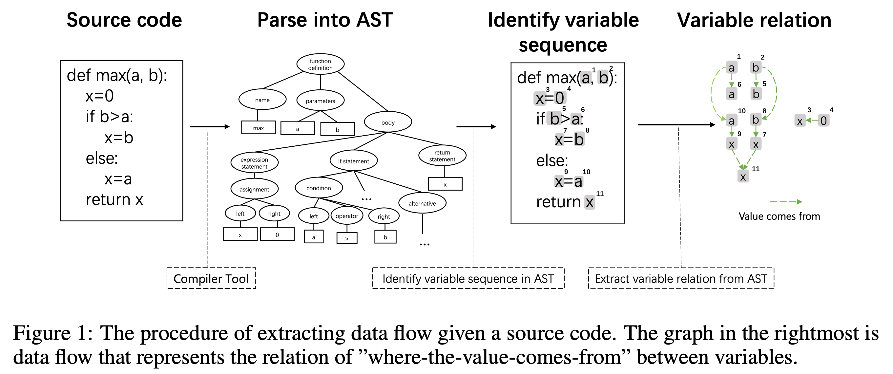
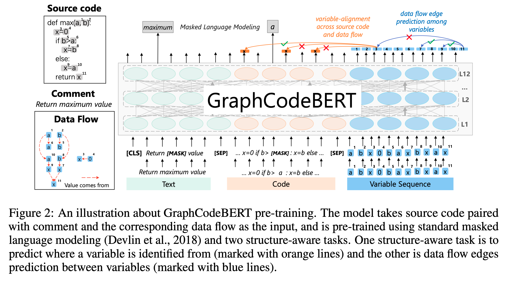

# GraphCodeBERT

## GraphCodeBERT: Pre-training Code Representations with Data Flow

Daya Guo
~Daya_Guo2
, Shuo Ren, Shuai Lu, Zhangyin Feng, Duyu Tang, Shujie LIU, Long Zhou, Nan Duan, Alexey Svyatkovskiy, Shengyu Fu, Michele Tufano, Shao Kun Deng, Colin Clement, Dawn Drain, Neel Sundaresan, Jian Yin, Daxin Jiang, Ming Zhou
Published: 13 Jan 2021, Last Modified: 12 Oct 2025ICLR 2021 PosterReaders:  EveryoneShow BibtexShow Revisions
Keywords: Pre-training, BERT, Code Representations, Code Structure, Data Flow
Abstract: Pre-trained models for programming language have achieved dramatic empirical improvements on a variety of code-related tasks such as code search, code completion, code summarization, etc. However, existing pre-trained models regard a code snippet as a sequence of tokens, while ignoring the inherent structure of code, which provides crucial code semantics and would enhance the code understanding process. We present GraphCodeBERT, a pre-trained model for programming language that considers the inherent structure of code. Instead of taking syntactic-level structure of code like abstract syntax tree (AST), we use data flow in the pre-training stage, which is a semantic-level structure of code that encodes the relation of "where-the-value-comes-from" between variables. Such a semantic-level structure is neat and does not bring an unnecessarily deep hierarchy of AST, the property of which makes the model more efficient. We develop GraphCodeBERT based on Transformer. In addition to using the task of masked language modeling, we introduce two structure-aware pre-training tasks. One is to predict code structure edges, and the other is to align representations between source code and code structure. We implement the model in an efficient way with a graph-guided masked attention function to incorporate the code structure. We evaluate our model on four tasks, including code search, clone detection, code translation, and code refinement. Results show that code structure and newly introduced pre-training tasks can improve GraphCodeBERT and achieves state-of-the-art performance on the four downstream tasks. We further show that the model prefers structure-level attentions over token-level attentions in the task of code search.
Code Of Ethics: I acknowledge that I and all co-authors of this work have read and commit to adhering to the ICLR Code of Ethics
Code: github microsoft/CodeBERT
Data: CodeSearchNet, ManyTypes4TypeScript
Community Implementations: CatalyzeX 6 code implementations

https://openreview.net/forum?id=jLoC4ez43PZ

## Abstract

Model *pre-trained* untuk bahasa pemrograman telah mencapai peningkatan empiris yang drastis pada berbagai tugas terkait kode seperti *code search*, *code completion*, *code summarization*, dsb. Namun, model *pre-trained* yang ada saat ini menganggap potongan kode (*code snippet*) sebagai urutan *tokens*, sembari mengabaikan struktur inheren dari kode, yang menyediakan semantik kode krusial dan dapat meningkatkan proses pemahaman kode. Kami menyajikan [*GraphCodeBERT*, Guo et al, 2020], sebuah model *pre-trained* untuk bahasa pemrograman yang mempertimbangkan struktur inheren dari kode. Alih-alih menggunakan struktur kode tingkat sintaksis seperti *abstract syntax tree* (AST) — representasi struktur hierarkis dari kode sumber, kami menggunakan *data flow* pada tahap *pre-training*, yang merupakan struktur kode tingkat semantik yang mengodekan hubungan "dari-mana-nilai-berasal" (*where-the-value-comes-from*) antar variabel.

Struktur tingkat semantik tersebut tidak terlalu kompleks dan tidak membawa hierarki AST yang dalam secara tidak perlu, di mana karakteristik ini membuat model menjadi lebih efisien. Kami mengembangkan [*GraphCodeBERT*, Guo et al, 2020] berdasarkan *Transformer*. Selain menggunakan tugas *masked language modeling*, kami memperkenalkan dua tugas *pre-training* yang sadar-struktur (*structure-aware*). Salah satunya adalah memprediksi tepi (*edges*) struktur kode, dan yang lainnya adalah menyelaraskan representasi antara kode sumber (*source code*) dan struktur kode. Kami mengimplementasikan model tersebut dengan cara yang efisien menggunakan fungsi *graph-guided masked attention* untuk menggabungkan struktur kode.

Kami mengevaluasi model kami pada empat tugas, termasuk *code search*, *clone detection*, *code translation*, dan *code refinement*. Hasil penelitian menunjukkan bahwa struktur kode dan tugas-tugas *pre-training* yang baru diperkenalkan dapat meningkatkan [*GraphCodeBERT*, Guo et al, 2020] dan mencapai performa *state-of-the-art* pada keempat tugas *downstream* tersebut. Lebih lanjut, kami menunjukkan bahwa model tersebut lebih memilih *structure-level attentions* dibandingkan *token-level attentions* dalam tugas *code search*. Seluruh kode dan data tersedia di [https://github.com/microsoft/CodeBERT](https://github.com/microsoft/CodeBERT).

## 1 - Introduction

Model *pre-trained* seperti [*ELMo*, Peters et al, 2018], [*GPT*, Radford et al, 2018], dan [*BERT*, Devlin et al, 2018] telah menghasilkan peningkatan signifikan pada berbagai tugas *natural language processing* (NLP). Model-model ini terlebih dahulu menjalani tahap *pre-train* pada korpus teks besar tanpa pengawasan (*unsupervised*), kemudian dilakukan *fine-tuning* pada tugas-tugas *downstream*. Keberhasilan model *pre-trained* dalam NLP juga mendorong pengembangan model *pre-trained* untuk bahasa pemrograman. Karya-karya yang ada saat ini [[*CuBERT*, Kanade et al, 2019]; [*BigCode*, Karampatsis & Sutton, 2020]; [*CodeBERT*, Feng et al, 2020]; [*PyMT5*, Svyatkovskiy et al, 2020]; [*C-BERT*, Buratti et al, 2020]] menganggap kode sumber sebagai urutan *tokens* dan melatih model pada kode sumber tersebut untuk mendukung tugas-tugas terkait kode seperti *code search*, *code completion*, *code summarization*, dsb. Namun, karya-karya sebelumnya hanya memanfaatkan kode sumber untuk *pre-training*, sembari mengabaikan struktur inheren dari kode. Struktur kode tersebut menyediakan informasi semantik yang berguna, yang akan menguntungkan proses pemahaman kode. Sebagai contoh ekspresi ,  dihitung dari  dan . Pemrogram tidak selalu mengikuti konvensi penamaan sehingga sulit untuk memahami semantik dari variabel  hanya dari namanya saja. Struktur semantik kode menyediakan cara untuk memahami semantik variabel  dengan memanfaatkan hubungan ketergantungan (*dependency relation*) antar variabel.

Dalam penelitian ini, kami menyajikan [*GraphCodeBERT*, Guo et al, 2020], sebuah model *pre-trained* untuk bahasa pemrograman yang mempertimbangkan struktur inheren dari kode. Alih-alih menggunakan struktur kode tingkat sintaksis seperti *abstract syntax tree* (AST) — representasi struktur hierarkis dari kode sumber, kami memanfaatkan informasi tingkat semantik dari kode, yakni *data flow*, untuk tahap *pre-training*.

*Data flow* merupakan sebuah graf di mana simpul-simpulnya merepresentasikan variabel dan tepi-tepinya (*edges*) merepresentasikan hubungan "dari-mana-nilai-berasal" (*where-the-value-comes-from*) antar variabel. Dibandingkan dengan AST, *data flow* kurang kompleks dan tidak menghasilkan hierarki yang dalam secara tidak perlu, di mana karakteristik ini membuat model menjadi lebih efisien. Untuk mempelajari representasi kode dari kode sumber dan struktur kode, kami memperkenalkan dua tugas *pre-training* baru yang sadar-struktur (*structure-aware*). Pertama adalah prediksi tepi *data flow* untuk mempelajari representasi dari struktur kode, dan yang kedua adalah penyelarasan variabel (*variable-alignment*) di seluruh kode sumber dan *data flow* untuk menyelaraskan representasi antara kode sumber dan struktur kode. [*GraphCodeBERT*, Guo et al, 2020] didasarkan pada arsitektur saraf *Transformer* [*Transformer*, Vaswani et al, 2017] dan kami mengembangkannya dengan memperkenalkan fungsi *graph-guided masked attention* untuk mengintegrasikan struktur kode.

Kami melatih [*GraphCodeBERT*, Guo et al, 2020] pada dataset [*CodeSearchNet*, Husain et al, 2019], yang mencakup 2,3 juta fungsi dari enam bahasa pemrograman yang dipasangkan dengan dokumen bahasa alami. Kami mengevaluasi model pada empat tugas *downstream*: *natural language code search*, *clone detection*, *code translation*, dan *code refinement*. Eksperimen menunjukkan bahwa model kami mencapai performa *state-of-the-art* pada keempat tugas tersebut. Analisis lebih lanjut menunjukkan bahwa struktur kode dan tugas *pre-training* yang baru diperkenalkan dapat meningkatkan [*GraphCodeBERT*, Guo et al, 2020] dan model tersebut memiliki preferensi yang konsisten dalam memperhatikan (*attending*) *data flow*.

Secara ringkas, kontribusi dari makalah ini adalah: (1) [*GraphCodeBERT*, Guo et al, 2020] adalah model *pre-trained* pertama yang memanfaatkan struktur semantik kode untuk mempelajari representasi kode. (2) Kami memperkenalkan dua tugas *pre-training* sadar-struktur baru untuk mempelajari representasi dari kode sumber dan *data flow*. (3) [*GraphCodeBERT*, Guo et al, 2020] memberikan peningkatan signifikan pada empat tugas *downstream*, yaitu *code search*, *clone detection*, *code translation*, dan *code refinement*.

## 2 - Related Works

## 2.1 - Pre-Trained Models for Programming Languages

Terinspirasi oleh kesuksesan besar *pre-training* dalam NLP [[*BERT*, Devlin et al, 2018]; [*XLNet*, Yang et al, 2019]; [*RoBERTa*, Liu et al, 2019]; [*T5*, Raffel et al, 2019]], model-model *pre-trained* untuk bahasa pemrograman juga mendorong pengembangan *code intelligence* (kecerdasan kode) [[*CuBERT*, Kanade et al, 2019]; [*CodeBERT*, Feng et al, 2020]; [*BigCode*, Karampatsis & Sutton, 2020]; [*GPT-C*, Svyatkovskiy et al, 2020]; [*C-BERT*, Buratti et al, 2020]]. [*CuBERT*, Kanade et al, 2019] melakukan *pre-train* pada model BERT menggunakan korpus masif dari kode sumber Python melalui objektif *masked language modeling* dan *next sentence prediction*. [*CodeBERT*, Feng et al, 2020] mengusulkan sebuah model *pre-trained* bimodal untuk bahasa pemrograman dan bahasa alami melalui *masked language modeling* dan *replaced token detection* untuk mendukung tugas-tugas teks-kode seperti *code search*. [*BigCode*, Karampatsis & Sutton, 2020] melakukan *pre-train* pada *contextual embeddings* pada korpus JavaScript menggunakan kerangka kerja ELMo untuk tugas perbaikan program (*program repair*). [*GPT-C*, Svyatkovskiy et al, 2020] mengusulkan varian dari GPT-2 yang dilatih dari awal (*from scratch*) pada data kode sumber untuk mendukung tugas-tugas generatif seperti *code completion*. [*C-BERT*, Buratti et al, 2020] menyajikan model bahasa berbasis *transformer* yang dilakukan *pre-trained* pada kumpulan repositori yang ditulis dalam bahasa C, dan mencapai akurasi tinggi dalam tugas pelabelan *abstract syntax tree* (AST) — pohon yang merepresentasikan struktur sintaksis dari kode sumber. Berbeda dengan karya-karya sebelumnya, [*GraphCodeBERT*, Guo et al, 2020] adalah model *pre-trained* pertama yang memanfaatkan struktur kode untuk mempelajari representasi kode guna meningkatkan pemahaman kode. Kami lebih lanjut memperkenalkan fungsi *graph-guided masked attention* untuk menggabungkan struktur kode ke dalam *Transformer* dan dua tugas *pre-training* baru yang sadar-struktur (*structure-aware*) untuk mempelajari representasi dari kode sumber dan struktur kode.

## 2.2 - Neural Networks with Code Structure
Dalam beberapa tahun terakhir, beberapa jaringan saraf yang memanfaatkan struktur kode seperti AST telah diusulkan dan mencapai performa yang kuat dalam tugas-tugas terkait kode seperti *code completion* [[*Pointer-Sentinel*, Li et al, 2017]; [*code2seq*, Alon et al, 2019]; [*CodeTransformer*, Kim et al, 2020]], *code generation* [[*ASN*, Rabinovich et al, 2017]; [*TranX*, Yin & Neubig, 2017]; [*GNN-Gen*, Brockschmidt et al, 2018]], *code clone detection* [[*CDLH*, Wei & Li, 2017]; [*ASTNN*, Zhang et al, 2019]; [*Flow2Vec*, Wang et al, 2020]], *code summarization* [[*code2vec*, Alon et al, 2018]; [*DeepCom*, Hu et al, 2018]], dan sebagainya [[*AST-LM*, Nguyen & Nguyen, 2015]; [*GNN*, Allamanis et al, 2018]; [*Sandwich*, Hellendoorn et al, 2019]].

[*AST-LM*, Nguyen & Nguyen, 2015] mengusulkan model bahasa berbasis AST untuk mendukung deteksi dan saran templat sintaksis pada lokasi pengeditan saat ini. [*GNN*, Allamanis et al, 2018] menggunakan graf untuk merepresentasikan program dan jaringan saraf graf (*graph neural network*) untuk menalar struktur program. [*Sandwich*, Hellendoorn et al, 2019] mengusulkan dua arsitektur berbeda menggunakan *gated graph neural network* dan *Transformers* untuk menggabungkan informasi lokal dan global guna memanfaatkan representasi kode sumber yang terstruktur kaya. Namun, karya-karya ini memanfaatkan struktur kode untuk melatih model pada tugas-tugas spesifik dari awal (*from scratch*) tanpa menggunakan model *pre-trained*. Dalam karya ini, kami mempelajari cara memanfaatkan struktur kode untuk *pre-training* representasi kode.

## 3 - Data Flow

Dalam bagian ini, kami menguraikan konsep dasar dan ekstraksi data flow. Pada bagian selanjutnya, kami akan menjelaskan bagaimana menggunakan data flow untuk tahap pre-training.

Data flow adalah sebuah graf yang merepresentasikan hubungan ketergantungan antar variabel, di mana simpul-simpul (nodes) merepresentasikan variabel dan tepi-tepinya (edges) merepresentasikan dari mana nilai setiap variabel berasal. Berbeda dengan AST, data flow tetap sama di bawah tata bahasa abstrak yang berbeda untuk kode sumber yang sama. Struktur kode tersebut menyediakan informasi semantik kode yang krusial untuk pemahaman kode. Mengambil $v = max\_value - min\_value$ sebagai contoh, pemrogram tidak selalu mengikuti konvensi penamaan sehingga sulit untuk memahami semantik dari variabel tersebut. Data flow menyediakan cara untuk memahami semantik dari variabel $v$ sampai batas tertentu, yakni nilai dari $v$ berasal dari $max\_value$ dan $min\_value$ dalam data flow. Selain itu, data flow mendukung model untuk mempertimbangkan ketergantungan jarak jauh (long-range dependencies) yang dipicu oleh penggunaan variabel atau fungsi yang sama di lokasi yang berjauhan. Mengambil Gambar 1 sebagai contoh, terdapat empat variabel dengan nama yang sama (yakni $x_3, x_7, x_9$, dan $x_{11}$) namun dengan semantik yang berbeda. Graf dalam gambar tersebut menunjukkan hubungan ketergantungan antara variabel-variabel ini dan mendukung $x_{11}$ untuk memberikan perhatian (attention) lebih kepada $x_7$ dan $x_9$ alih-alih $x_3$.Selanjutnya, kami menguraikan cara mengekstraksi data flow dari sebuah kode sumber.

### Figure 1. The procedure of extracting data flow given a source code

Gambar 1 menunjukkan ekstraksi data flow melalui kode sumber. Diberikan sebuah kode sumber $C = \{c_1, c_2, \dots, c_n\}$, kami pertama-tama melakukan parsing kode tersebut menjadi sebuah abstract syntax tree (AST) menggunakan alat kompilator standar.AST tersebut mencakup informasi sintaksis dari kode, dan terminal (leaves) digunakan untuk mengidentifikasi urutan variabel, yang dinotasikan sebagai $V = \{v_1, v_2, \dots, v_k\}$. Kami mengambil setiap variabel sebagai simpul dari graf, dan sebuah tepi berarah $\epsilon = \langle v_i, v_j \rangle$ dari $v_i$ ke $v_j$ merujuk pada fakta bahwa nilai variabel ke-$j$ berasal dari variabel ke-$i$. Mengambil $x = expr$ sebagai contoh, tepi-tepi dari semua variabel dalam $expr$ ke $x$ ditambahkan ke dalam graf. Kami menotasikan himpunan tepi berarah sebagai $E = \{\epsilon_1, \epsilon_2, \dots, \epsilon_l\}$ dan graf $G(C) = (V, E)$ adalah data flow yang digunakan untuk merepresentasikan hubungan ketergantungan antar variabel dari kode sumber $C$.

## 4 - GraphCodeBERT

### Figure 2. An illustration about GraphCodeBERT pre-training

Dalam bagian ini, kami menguraikan [*GraphCodeBERT*, Guo et al, 2020], sebuah model *pre-trained* berbasis graf yang didasarkan pada *Transformer* untuk bahasa pemrograman. Kami memperkenalkan arsitektur model, *graph-guided masked attention*, dan tugas-tugas *pre-training* yang mencakup *masked language model* standar serta tugas-tugas yang baru diperkenalkan. Detail lebih lanjut mengenai pengaturan *pre-training* model disediakan dalam Lampiran A.

Gambar 2: Ilustrasi mengenai *pre-training* [*GraphCodeBERT*, Guo et al, 2020]. Model tersebut mengambil kode sumber yang dipasangkan dengan komentar dan *data flow* terkait sebagai *input*, serta menjalani proses *pre-training* menggunakan *masked language modeling* standar [*BERT*, Devlin et al, 2018] dan dua tugas sadar-struktur (*structure-aware*). Salah satu tugas sadar-struktur tersebut adalah memprediksi dari mana sebuah variabel diidentifikasi (ditandai dengan garis berwarna oranye) dan tugas lainnya adalah prediksi tepi *data flow* antar variabel (ditandai dengan garis berwarna biru).

## 4.1 - Model Architecture

Gambar 2 menunjukkan arsitektur model dari [GraphCodeBERT, Guo et al, 2020]. Kami mengikuti [BERT, Devlin et al, 2018] dan menggunakan multi-layer bidirectional Transformer [Transformer, Vaswani et al, 2017] sebagai tulang punggung (backbone) model. Alih-alih hanya menggunakan kode sumber, kami juga memanfaatkan komentar yang berpasangan untuk melakukan pre-train pada model guna mendukung lebih banyak tugas terkait kode yang melibatkan bahasa alami, seperti natural language code search [CodeBERT, Feng et al, 2020]. Selanjutnya, kami menyertakan data flow, yang merupakan sebuah graf, sebagai bagian dari masukan (input) ke model.

Diberikan sebuah kode sumber $C = \{c_1, c_2, \dots, c_n\}$ beserta komentarnya $W = \{w_1, w_2, \dots, w_m\}$, kami dapat memperoleh data flow $G(C) = (V, E)$ terkait sebagaimana dibahas pada Bagian 3, di mana $V = \{v_1, v_2, \dots, v_k\}$ adalah himpunan variabel dan $E = \{\epsilon_1, \epsilon_2, \dots, \epsilon_l\}$ adalah himpunan tepi berarah yang merepresentasikan dari mana nilai setiap variabel berasal. Kami merangkaikan (concatenate) komentar, kode sumber, dan himpunan variabel sebagai urutan masukan $X = \{[CLS], W, [SEP], C, [SEP], V\}$, di mana $[CLS]$ adalah token khusus di depan tiga segmen dan $[SEP]$ adalah simbol khusus untuk memisahkan dua jenis tipe data.

[GraphCodeBERT, Guo et al, 2020] menerima urutan $X$ sebagai masukan dan kemudian mengubah urutan tersebut menjadi vektor masukan $H_0$. Untuk setiap token, vektor masukannya dikonstruksi dengan menjumlahkan token embedding dan position embedding yang sesuai. Kami menggunakan position embedding khusus untuk semua variabel guna menunjukkan bahwa variabel-variabel tersebut merupakan simpul (nodes) dari data flow. Model ini menerapkan $N$ lapisan transformer pada vektor masukan untuk menghasilkan representasi kontekstual $H_n = \text{transformer}_n(H_{n-1}), n \in [1, N]$. Setiap lapisan transformer berisi transformer dengan arsitektur identik yang menerapkan operasi multi-headed self-attention [Transformer, Vaswani et al, 2017] yang diikuti oleh lapisan feed forward pada masukan $H_{n-1}$ di lapisan ke-$n$.

$$G^n = \text{LN}(\text{MultiAttn}(H_{n-1}) + H_{n-1}) \quad (1)$$

$$H_n = \text{LN}(\text{FFN}(G^n) + G^n) \quad (2)$$

di mana $\text{MultiAttn}$ adalah mekanisme multi-headed self-attention, $\text{FFN}$ adalah jaringan feed forward dua lapisan, dan $\text{LN}$ merepresentasikan operasi normalisasi lapisan (layer normalization). Untuk lapisan transformer ke-$n$, keluaran $\hat{G}^n$ dari multi-headed self-attention dihitung melalui:

$$Q_i = H_{n-1}W^Q_i, K_i = H_{n-1}W^K_i, V_i = H_{n-1}W^V_i \quad (3)$$

$$\text{head}_i = \text{softmax}\left(\frac{Q_i K_i^T}{\sqrt{d_k}} + M\right)V_i \quad (4)$$

$$\hat{G}^n = [\text{head}_1; \dots; \text{head}_u]W^O_n \quad (5)$$

di mana keluaran lapisan sebelumnya $H_{n-1} \in \mathbb{R}^{|X|\times d_h}$ diproyeksikan secara linier menjadi triplet queries, keys, dan values menggunakan parameter model masing-masing $W^Q_i, W^K_i, W^V_i \in \mathbb{R}^{d_h \times d_k}$. $u$ adalah jumlah heads, $d_k$ adalah dimensi dari satu head, dan $W^O_n \in \mathbb{R}^{d_h \times d_h}$ adalah parameter model. $M \in \mathbb{R}^{|X|\times |X|}$ adalah matriks mask, di mana $M_{ij}$ bernilai $0$ jika token ke-$i$ diizinkan untuk memperhatikan (attend) token ke-$j$, jika tidak, maka bernilai $-\infty$.

## 4.2 - Graph-guided Masked Attention

Untuk mengintegrasikan struktur graf ke dalam Transformer, kami mendefinisikan sebuah fungsi graph-guided masked attention guna menyaring sinyal-sinyal yang tidak relevan. Fungsi attention masking tersebut dapat mencegah key $k_i$ diperhatikan (attended) oleh query $q_j$ dengan menambahkan nilai negatif tak terhingga pada skor attention $q_j^T k_i$, sehingga bobot attention menjadi nol setelah penerapan fungsi softmax.

Untuk merepresentasikan hubungan ketergantungan antar variabel, sebuah node-query $q_{v_i}$ diizinkan untuk memperhatikan node-key $k_{v_j}$ jika terdapat tepi berarah (direct edge) dari simpul $v_j$ ke simpul $v_i$ (yakni $\langle v_j, v_i \rangle \in E$) atau jika keduanya merupakan simpul yang sama (yakni $i = j$). Sebaliknya, attention akan ditutup (masked) dengan menambahkan nilai negatif tak terhingga ke dalam skor attention. Untuk merepresentasikan hubungan antara tokens kode sumber dan simpul-simpul dari data flow, kami terlebih dahulu mendefinisikan sebuah himpunan $E'$, di mana $\langle v_i, c_j \rangle / \langle c_j, v_i \rangle \in E'$ jika variabel $v_i$ diidentifikasi dari token kode sumber $c_j$. Kami kemudian mengizinkan simpul $q_{v_i}$ dan kode $k_{c_j}$ untuk saling memperhatikan satu sama lain jika dan hanya jika $\langle v_i, c_j \rangle / \langle c_j, v_i \rangle \in E'$.

Secara lebih formal, kami menggunakan matriks graph-guided masked attention berikut sebagai matriks mask $M$ dalam Persamaan (4):

$$M_{ij} = \begin{cases} 0 & \text{jika } q_i \in \{[CLS], [SEP]\} \text{ atau } q_i, k_j \in W \cup C \text{ atau } \langle q_i, k_j \rangle \in E \cup E' \\ -\infty & \text{selainnya} \end{cases} \quad (6)$$

## 4.3 - Pre-training Tasks

Kami menguraikan tiga tugas pre-training yang digunakan untuk melatih [GraphCodeBERT, Guo et al, 2020] dalam bagian ini. Tugas pertama adalah masked language modeling [BERT, Devlin et al, 2018] untuk mempelajari representasi dari kode sumber. Tugas kedua adalah prediksi tepi data flow untuk mempelajari representasi dari data flow, di mana kami terlebih dahulu menutupi (masking) beberapa tepi data flow variabel dan kemudian membiarkan [GraphCodeBERT, Guo et al, 2020] memprediksi tepi-tepi tersebut. Tugas terakhir adalah penyelarasan variabel (variable-alignment) di seluruh kode sumber dan data flow untuk menyelaraskan representasi antara keduanya, yang memprediksi dari mana sebuah variabel diidentifikasi.

## Masked Language Modeling

Kami mengikuti [BERT, Devlin et al, 2018] dalam menerapkan tugas pre-training masked language modeling (MLM). Secara khusus, kami mengambil sampel secara acak sebesar 15% dari tokens pada kode sumber dan komentar yang berpasangan. Kami menggantinya dengan token [MASK] sebanyak 80% dari waktu tersebut, dengan token acak sebanyak 10%, dan membiarkannya tidak berubah sebanyak 10%.

Objektif MLM adalah memprediksi tokens asli dari sampel-sampel tersebut, yang telah terbukti efektif dalam karya-karya sebelumnya [[BERT, Devlin et al, 2018]; [RoBERTa, Liu et al, 2019]; [CodeBERT, Feng et al, 2020]]. Secara khusus, model dapat memanfaatkan konteks komentar jika konteks kode sumber tidak memadai untuk menyimpulkan token kode yang ditutupi, sehingga mendorong model untuk menyelaraskan representasi bahasa alami dan bahasa pemrograman.

## Edge Prediction

Untuk mempelajari representasi dari data flow, kami memperkenalkan tugas pre-training prediksi tepi data flow. Motivasinya adalah untuk mendorong model mempelajari representasi sadar-struktur (structure-aware) yang mengodekan hubungan "dari-mana-nilai-berasal" demi pemahaman kode yang lebih baik. Secara khusus, kami secara acak mengambil sampel 20% dari simpul-simpul $V_s$ dalam data flow, menutupi tepi-tepi berarah yang menghubungkan simpul-simpul sampel ini dengan menambahkan nilai negatif tak terhingga dalam matriks mask, dan kemudian memprediksi tepi-tepi yang ditutupi tersebut $E_{mask}$.Mengambil variabel $x_{11}$ pada Gambar 2 sebagai contoh, kami pertama-tama menutupi tepi $\langle x_7, x_{11} \rangle$ dan $\langle x_9, x_{11} \rangle$ dalam graf, kemudian membiarkan model memprediksi tepi-tepi tersebut. Secara formal, objektif pre-training dari tugas ini dihitung sebagaimana Persamaan 7, di mana $E_c = V_s \times V \cup V \times V_s$ adalah himpunan kandidat untuk prediksi tepi, $\delta(e_{ij} \in E)$ bernilai 1 jika $\langle v_i, v_j \rangle \in E$ dan 0 untuk kondisi lainnya, serta probabilitas $p_{e_{ij}}$ dari keberadaan tepi dari simpul ke-$i$ ke simpul ke-$j$ dihitung melalui dot product yang diikuti oleh fungsi sigmoid menggunakan representasi dari dua simpul dari [GraphCodeBERT, Guo et al, 2020]. Untuk menyeimbangkan rasio contoh positif-negatif, kami mengambil sampel negatif dan positif dengan jumlah yang sama untuk $E_c$.

$$\text{loss}_{\text{EdgePred}} = - \sum_{e_{ij} \in E_c} [\delta(e_{ij} \in E_{\text{mask}}) \log p_{e_{ij}} + (1 - \delta(e_{ij} \in E_{\text{mask}})) \log (1 - p_{e_{ij}})] \quad (7)$$

## Node Alignment

## 5 - Experiments

## 5.1 - Natural Language Code Search

## 5.2 - Code Clone Detection

## 5.3 - Code Translation

## 5.4 - Code Refinement

## 5.5 - Model Analysis

## 6 - Conclusion

## Acknowledgements

## References

## A - Pre-training Details

## B - Natural Language Code Search

## C - Code Clone Detection

## D - Code Translation

## E - Code Refinement

## F - Case Study

## F.1 - Natural Language Code Search

## F.2 - Code Clone Detection

## F.3 - Code Translation and Code Refinement

## G - Error Analysis

