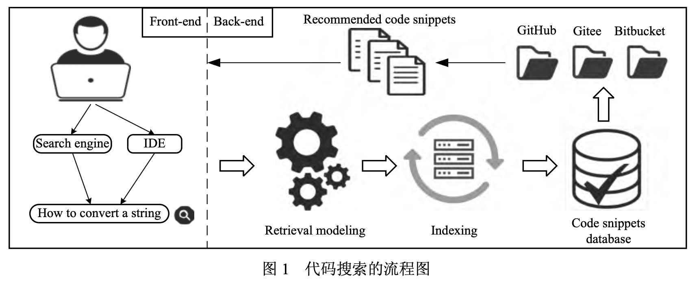
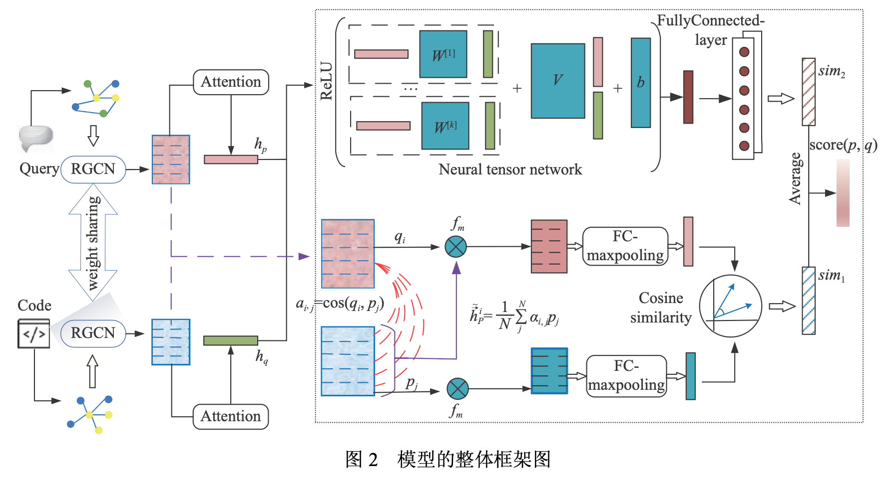
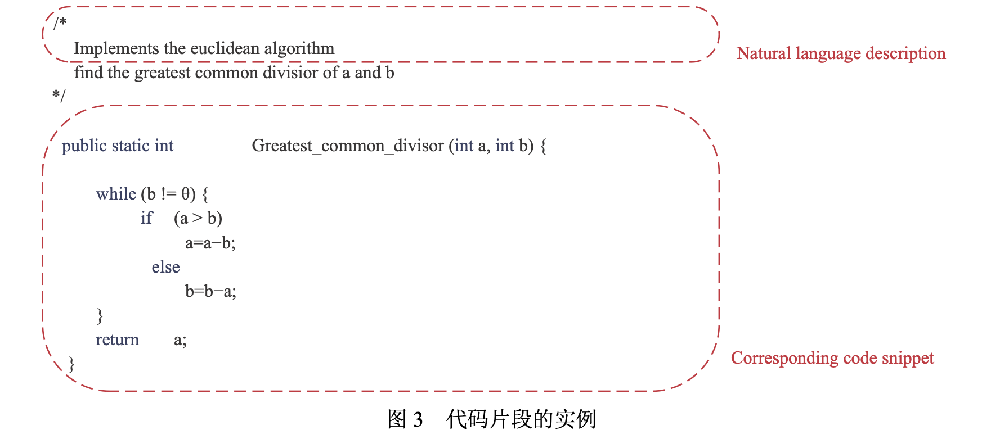
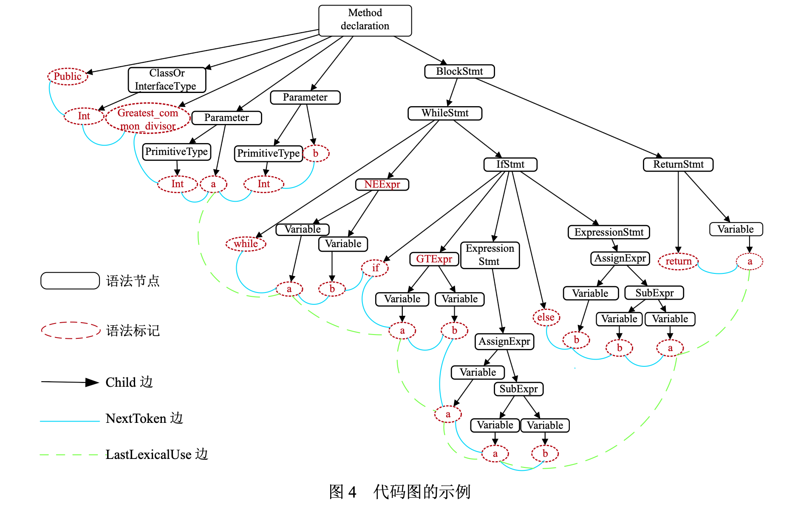
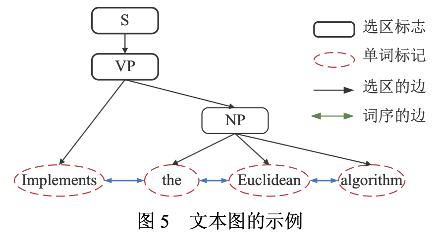

# Code Search Method Based on Relational Graph Convolutional Network

**Journal of Software** ISSN 1000-9825, CODEN RUXUEW E-mail: jos@iscas.ac.cn
Journal of Software, 2024, 35(6): 2863−2879 [doi: 10.13328/j.cnki.jos.006910] [http://www.jos.org.cn](http://www.jos.org.cn)
© Hak Cipta dilindungi oleh Institute of Software, Chinese Academy of Sciences. Tel: +86-10-62562563

---

### **Metode Pencarian Kode Berbasis *Relational Graph Convolutional Network***

**ZHOU Guang-You**, **XIE Qi**, **YU Xiao**
(School of Computer Science, Central China Normal University, Wuhan 430079, China)
(School of Computer Science and Artificial Intelligence, Wuhan University of Technology, Wuhan 430070, China)

**Penulis Korespondensi:** ZHOU Guang-You, E-mail: gyzhou@mail.ccnu.edu.cn

**Nomor Klasifikasi Pustaka China:** TP311

**Format Sitasi Bahasa Mandarin:** 周光有, 谢琦, 余啸. 基于关系图卷积网络的代码搜索方法. 软件学报, 2024, 35(6): 2863–2879. [http://www.jos.org.cn/1000-9825/6910.htm](http://www.jos.org.cn/1000-9825/6910.htm)

**Format Sitasi Bahasa Inggris:** Zhou GY, Xie Q, Yu X. Code Search Method Based on Relational Graph Convolutional Network. Ruan Jian Xue Bao/Journal of Software, 2024, 35(6): 2863–2879 (in Chinese). [http://www.jos.org.cn/1000-9825/6910.htm](http://www.jos.org.cn/1000-9825/6910.htm)

---

**Informasi Artikel:**

* **Proyek Pendanaan:** National Natural Science Foundation of China (61972173); Fundamental Research Funds for the Central Universities (CCNU22QN015); Wuhan Knowledge Innovation Special Basic Research Project (2022010801010278).
* **Waktu Penerimaan:** 2022-03-24; **Waktu Revisi:** 2022-06-14, 2022-11-03; **Waktu Disetujui:** 2023-01-22; **Waktu Publikasi Online JOS:** 2023-07-12
* **Waktu Publikasi Perdana CNKI:** 2023-07-13

## Abstract

Code search (pencarian kode) merupakan topik penelitian penting dalam bidang pemrosesan bahasa alami (Natural Language Processing) dan rekayasa perangkat lunak (Software Engineering). Pengembangan algoritma code search yang efisien dapat secara signifikan meningkatkan penggunaan kembali kode (code reuse) dan efisiensi kerja pengembang perangkat lunak. Tugas code search adalah melakukan temu kembali (retrieve) fragmen kode yang memenuhi persyaratan dari repositori kode masif dengan menggunakan bahasa alami yang mendeskripsikan fungsi fragmen kode tersebut sebagai input. Meskipun metode code search berbasis model sekuensial, yakni [DeepCS, Gu et al, 2018], telah mencapai hasil yang menjanjikan, metode tersebut tidak dapat menangkap semantik mendalam dari kode. [GraphSearchNet, Liu et al, 2023], sebuah metode code search berbasis graph embedding — penanaman graf ke dalam ruang vektor —, dapat memitigasi masalah ini, namun metode tersebut tidak melakukan pencocokan fine-grained (terperinci) pada kode dan teks serta mengabaikan hubungan global antara graf kode dan graf teks.

Untuk mengatasi keterbatasan di atas, studi ini mengusulkan metode code search berbasis Relational Graph Convolutional Network (RGCN), yang menyandikan (encode) graf teks dan graf kode yang dikonstruksi, melakukan pencocokan fine-grained pada kueri teks dan fragmen kode pada tingkat node (simpul), serta menerapkan Neural Tensor Networks (NTN) untuk menangkap hubungan global di antara keduanya.

Hasil eksperimen pada dua dataset publik menunjukkan bahwa metode yang diusulkan mencapai akurasi pencarian yang lebih tinggi dibandingkan model baseline mutakhir, yakni [DeepCS, Gu et al, 2018] dan [GraphSearchNet, Liu et al, 2023].

Kata kunci: code search; Relational Graph Convolutional Network; pencocokan fine-grained

## 0 - Introduction
Beberapa tahun terakhir, proyek *open source* di repositori kode seperti GitHub ([https://www.github.com/](https://www.github.com/)), Gitee ([https://gitee.com/](https://gitee.com/)), dan Bitbucket ([https://www.bitbucket.org/](https://www.bitbucket.org/)) telah mengalami pertumbuhan yang sangat pesat. Jumlah sumber daya kode berkualitas tinggi menjadi sangat masif, sehingga cara untuk mencari kode yang memenuhi kebutuhan pemrogram secara akurat dan efisien dari repositori kode tersebut menjadi salah satu arah penelitian yang hangat di persimpangan bidang rekayasa perangkat lunak dan pemrosesan bahasa alami (*Natural Language Processing*). Berbeda dengan pencarian kode biner yang menggunakan input fragmen kode, tujuan penelitian dalam artikel ini adalah *code search* (pencarian kode) yang berorientasi pada teks bebas. Secara spesifik, dengan input berupa kalimat kueri yang mendeskripsikan fungsi fragmen kode (dalam bahasa alami manusia), tugas *code search* adalah menemukan fragmen kode yang paling cocok dari basis kode yang besar. Alat *code search* tidak hanya dapat membantu pengembang program menemukan contoh kode untuk fungsi program umum, tetapi juga membantu mereka mencari fragmen kode berkualitas tinggi dengan fungsi terpersonalisasi yang ditulis oleh pengembang lain secara cepat, yang mana hal ini sangat meningkatkan efisiensi kerja pengembang program. Selain itu, teknologi *code search* kini telah menjadi dukungan penting bagi teknologi konstruksi program seperti *program synthesis*, rekomendasi dan pelengkapan kode (*code completion*), serta perbaikan gaya kode. Diagram alir ringkas dari *code search* ditunjukkan pada Gambar 1.

### Figure 1

Sebagian besar penelitian awal didasarkan pada teknik temu kembali informasi (*Information Retrieval* - IR) tradisional. Bajracharya et al. [*Sourcerer*, Bajracharya et al, 2014] menggunakan atribut kode dan tingkat popularitasnya sebagai indikator evaluasi, yang dikombinasikan dengan metode statistik *TF-IDF* untuk mengembalikan rekomendasi fragmen kode. Sistem *code search* yang diajukan oleh McMillan et al. [*Portfolio*, McMillan et al, 2011] didasarkan pada pencocokan kata kunci untuk mendapatkan fungsi fungsional yang dibutuhkan pemrogram. Lu et al. [2015] memanfaatkan sinonim bahasa alami yang dihasilkan oleh *WordNet* sebagai kueri perluasan (*expanded query*) dan melakukan pencocokan kata kunci pada tanda tangan metode (*method signature*) dari fragmen kode. Algoritma yang diajukan oleh Lv et al. [*CodeHow*, Lv et al, 2015] mempertimbangkan dampak kesamaan teks dan potensi API terhadap *code search*, serta mencari basis kode berdasarkan kueri perluasan dan model Boolean. Li Xuan et al. [2019] melakukan peningkatan deskripsi pada fragmen kode berdasarkan pemanggilan metode yang diekstraksi dan fitur struktural, serta menggunakan *Lucene* untuk melakukan kueri daring (*online query*).

Metode *code search* berbasis teknik IR tradisional menganggap kalimat kueri dan kode sumber sebagai teks untuk pencocokan kata kunci, yang memiliki dua kelemahan utama: Pertama, bahasa alami memiliki ambiguitas universal, sehingga akurasi pemahaman semantiknya tidak tinggi; Kedua, metode ini mengabaikan fitur struktur mendalam dari fragmen kode. Untuk mengatasi masalah di atas, Gu et al. [*DeepCS*, Gu et al, 2018] untuk pertama kalinya menerapkan teknologi *deep learning* pada *code search*. *DeepCS* merepresentasikan kode sumber dari tiga sudut pandang: nama metode, sekuens pemanggilan API, dan informasi token yang terkandung dalam kode sumber, serta menggunakan jaringan memori jangka pendek-panjang (*Long-Short Term Memory*, LSTM) untuk mengekstraksi fitur yang sesuai, sehingga memperkaya semantik tingkat kode. Kalimat kueri kemudian mendapatkan *embedding* yang sesuai melalui model penyandian (*encoding*) RNN. Dibandingkan dengan [*Sourcerer*, Bajracharya et al, 2014] dan [*CodeHow*, Lv et al, 2015] yang tradisional, *DeepCS* secara signifikan meningkatkan hasil pencarian.

Kehadiran *DeepCS* menginspirasi lebih banyak peneliti rekayasa perangkat lunak untuk menerapkan jaringan saraf dalam (*deep neural networks*) guna menyelesaikan tugas *code search* ini. Yao et al. [*CoaCor*, Yao et al, 2019] mengusulkan alat pembuat anotasi kode berbasis *sequence-to-sequence* (Seq2Seq), yang dapat menghasilkan anotasi yang baik untuk *code search*. Chen et al. [*BVAE*, Chen et al, 2019] mengusulkan kerangka kerja BVAE, yang menggunakan dua *Variational Auto-Encoders*, yaitu C-VAE dan L-VAE, untuk masing-masing merepresentasikan fragmen kode dan deskripsi bahasa alami; metode ini bertujuan untuk mempelajari representasi vektor terdistribusi dari fragmen kode dan deskripsi bahasa alami melalui pelatihan gabungan (*joint training*). Wan et al. [*MMAN*, Wan et al, 2019] mengusulkan jaringan atensi multimodal baru, MMAN, dan menerapkannya pada *code search*. Jaringan ini terdiri dari satu LSTM, satu Tree-LSTM, dan satu *Gated Graph Neural Network*, yang masing-masing digunakan untuk penandaan sekuensial kode, pembuatan pohon sintaksis abstrak (*Abstract Syntax Tree* - AST) kode, dan representasi grafik aliran kendali (*Control Flow Graph*).

Namun, metode berbasis *deep learning* yang disebutkan di atas hanya dapat menangkap informasi dangkal dari fragmen kode. Banyak program sumber mungkin memiliki berbagai fitur dependensi jarak jauh (*long-range dependencies*), misalnya pengidentifikasi (*identifier*) yang sama melakukan operasi kritis di banyak tempat dalam kode sumber. Karena adanya berbagai aliran data (*data flow*) yang kompleks dalam fragmen kode, model penyandian sekuensial seperti LSTM tidak dapat menangkap semantik mendalam dari kode sumber. Untuk menangkap informasi struktur mendalam dari kode, para akademisi mencoba menggunakan data graf untuk merepresentasikan struktur fragmen kode. Ling Chunyang et al. [2021] menggunakan algoritma *LINE* untuk melakukan *embedding* pada graf kode, model *Bag-of-Words* untuk *embedding* kueri bahasa, dan mencocokkan node kueri teks melalui pencarian sub-graf kode. Huang Siyuan et al. [2020] mengekstraksi informasi struktur sub-graf dalam graf ketergantungan program (*Program Dependency Graph*) berdasarkan algoritma pelabelan ulang (*re-labeling*), dan berdasarkan gagasan *Doc2Vec*, menjadikan struktur sub-graf sebagai informasi konteks untuk mendapatkan representasi *embedding* vektor dari graf ketergantungan program yang sesuai dengan fragmen kode.

Model yang diajukan oleh Liu et al. [*GraphSearchNet*, Liu et al, 2021] adalah kerangka kerja *code search* berbasis *Graph Neural Network* (GNN) terbaru. *GraphSearchNet* menyandikan kode sumber dan teks kueri masing-masing menjadi dua graf, menggunakan *Bidirectional Gated Graph Neural Network* untuk menangkap informasi struktur lokal dari fragmen kode dan teks kueri, serta memperoleh informasi konteks global kode atau teks melalui mekanisme atensi multi-kepala (*multi-head attention*). Hasil eksperimen menunjukkan bahwa *GraphSearchNet* mampu secara efektif menggambarkan semantik mendalam dari fragmen kode dan deskripsi bahasa alami. Meskipun model *GraphSearchNet* berbasis GNN telah mencapai hasil terbaik saat ini, masih terdapat kekurangan sebagai berikut.

(1) Fragmen kode dan deskripsi bahasa alami adalah dua jenis data dengan modalitas yang sangat berbeda. Perbedaan aturan tata bahasa dan struktur bahasa menyebabkan kesulitan dalam pemetaan semantik, sehingga pencocokan *fine-grained* (terperinci) sangat penting untuk pencarian data lintas modal. Meskipun *GraphSearchNet* memperoleh representasi *embedding* node graf kode dan teks melalui *Bidirectional Gated GNN*, model ini tidak melakukan operasi pencocokan interaktif apa pun pada node graf kode dan graf teks. Kurangnya data penyelarasan *fine-grained* menyebabkan akurasi model mereka tidak cukup tinggi.

(2) Fitur interaksi tingkat graf sepasang graf dalam perspektif global mungkin merupakan komponen pelengkap yang penting untuk mempelajari kesamaan graf. *GraphSearchNet* menggunakan mekanisme *multi-head attention* untuk mengagregasi informasi semantik sekuensial dari kode dan teks, melengkapi informasi konteks node graf kode dan graf teks yang terabaikan karena dependensi jarak jauh, namun tetap tidak membandingkan dan mencocokkan informasi konteks global kode dan teks lebih lanjut. Model yang mengabaikan pencocokan global mungkin tidak dapat menangkap hubungan global antara kode dan teks karena hilangnya fitur interaksi tingkat graf.

Untuk mengatasi kekurangan di atas, artikel ini mengusulkan metode *code search* berbasis *Relational Graph Convolutional Network*, yaitu model *GraphCS*. Pertama, dibangun graf kode dan graf teks, dan *Relational Graph Convolutional Network* digunakan untuk mempelajari *embedding* node dari graf kode dan graf teks. Berbeda dengan *GraphSearchNet* yang langsung melakukan pengukuran kesamaan setelah mendapatkan *embedding* node, *GraphCS* melakukan penyelarasan pencocokan lintas graf (*cross-graph matching alignment*) pada semua pasangan node dari graf kode dan graf teks berdasarkan fungsi pencocokan multi-perspektif yang diusulkan. *GraphCS* kemudian memperbarui representasi *embedding* node berdasarkan fitur yang telah dicocokkan. Kelebihannya adalah model kami dapat menangkap hubungan pencocokan *fine-grained* antara kode dan teks, yang secara efektif menyelesaikan kekurangan pertama dari *GraphSearchNet* yaitu kurangnya operasi interaksi. Selain itu, model ini memanfaatkan *Neural Tensor Network* untuk melakukan pencocokan interaktif pada graf kode dan graf teks dalam berbagai dimensi, sehingga mampu menangkap hubungan global antara kode dan teks, yang secara efektif menyelesaikan kekurangan kedua dari *GraphSearchNet* yaitu pengabaian hubungan pencocokan global. Eksperimen dilakukan pada dataset publik FB-Java dan CSN-Python. Dibandingkan dengan dua model *baseline* mutakhir, yaitu [*DeepCS*, Gu et al, 2018] dan [*GraphSearchNet*, Liu et al, 2021], *GraphCS* memiliki peningkatan yang cukup besar dalam indikator pencarian umum SuccessRate@1/5/10 serta MRR.

## 1 - Definisi Masalah
Tujuan penelitian artikel ini berorientasi pada pencarian kode dengan input bahasa alami, yaitu proses mendapatkan fragmen kode yang sesuai menggunakan pencarian teks. Artikel ini mendefinisikan tugas pencarian kode dari sudut pandang bahwa data graf dapat merepresentasikan informasi struktur secara efektif. Diberikan sebuah korpus kode sumber $P$, dengan total $|P|$ fragmen kode, tujuan pencarian kode adalah menemukan fragmen kode yang paling cocok $\hat{p}$ dari korpus berdasarkan teks kueri $q$. Definisi tugas pencarian kode dirumuskan sebagai berikut:

$$\hat{p} = \underset{p \in P}{\text{argmax}} score(q, p) = \underset{p \in P}{\text{argmax}} score(G_q, G_p) \quad (1)$$

Inti dari tugas pencarian kode ini adalah menghitung skor kesamaan $score(p, q)$ antara fragmen kode $p$ dan teks kueri $q$. Karena kode dan teks keduanya dapat direpresentasikan sebagai struktur graf berdasarkan metode konstruksi graf yang diusulkan, kami selanjutnya mengubah $score(p, q)$ menjadi $score(G_q, G_p)$. Di mana $G_p$ dan $G_q$ masing-masing adalah representasi graf dari kode dan teks. Dalam artikel ini, $G_p$ dan $G_q$ keduanya dinyatakan sebagai graf multi-relasional berarah dan berlabel, di mana jenis sisi (edge) yang berbeda ditunjukkan oleh sisi berlabel. Secara spesifik, graf teks $G_q$ dinyatakan sebagai $(V_q, E_q, R_q)$, dengan node $q_i \in V_q$, sisi $(q_i, r, q_j) \in E_q$, di mana $r \in R_q$ menunjukkan jenis sisi. Secara serupa, representasi graf kode $G_p$ dinyatakan sebagai $(V_p, E_p, R_p)$. Jumlah node dari $G_p$ dan $G_q$ masing-masing adalah $M$ dan $N$. Untuk kemudahan deskripsi, Tabel 1 menyajikan simbol-simbol utama yang digunakan dalam artikel ini beserta maknanya.

## 2 - Pengantar Model GraphCS

Bagian ini merinci metode yang kami usulkan. Secara spesifik, model GraphCS yang berbasis Relational Graph Convolutional Network terdiri dari 3 tahapan kunci.

* Pertama adalah tahap konstruksi graf dan graph embedding. Kalimat kueri direpresentasikan menjadi graf teks berdasarkan pohon analisis konstituen (constituency parse tree), dan fragmen kode direpresentasikan menjadi graf kode berdasarkan pohon sintaksis abstrak (Abstract Syntax Tree - AST) dengan representasi hubungan yang ditingkatkan. Kemudian, Relational Graph Convolutional Network digunakan untuk menyandikan (encode) graf kode dan graf teks guna mendapatkan representasi embedding node awal mereka.

* Tahap inti adalah tahap pencocokan semantik. Modul pencocokan semantik dibagi menjadi strategi pencocokan tingkat node dan strategi pencocokan tingkat graf. Strategi pencocokan tingkat node didasarkan pada fungsi pencocokan multi-perspektif (multi-view matching function), yang melakukan operasi pencocokan lintas graf (cross-graph matching) pada semua node graf teks dan graf kode untuk interaksi informasi. Embedding node yang diperbarui memiliki semantik yang lebih kaya, menutupi kekurangan model baseline lain yang tidak melakukan operasi pencocokan fine-grained pada teks dan kode. Strategi pencocokan tingkat graf digunakan untuk menangkap hubungan global antara kode dan teks. Pertama-tama strategi ini memperoleh representasi graph embedding yang sadar konteks global (global context-aware) dari graf kode dan graf teks berdasarkan mekanisme atensi, kemudian menggunakan Neural Tensor Network untuk mendapatkan vektor kesamaan perspektif global dari graf kode dan graf teks. Hal ini menyelesaikan masalah pada model baseline lain yang tidak mengeksplorasi lebih lanjut hubungan informasi semantik global antara graf teks dan graf kode.

### Figure 2

* Terakhir adalah tahap pencarian kesamaan. Berdasarkan skor kesamaan yang masing-masing diperoleh dari strategi pencocokan tingkat node berbasis fungsi pencocokan multi-perspektif dan strategi pencocokan tingkat graf berbasis Neural Tensor Network, dihitung skor kesamaan akhir dari sepasang graf kode dan graf teks. Kerangka kerja model keseluruhan dari model GraphCS yang diusulkan dalam artikel ini ditunjukkan pada Gambar 2.

## 2.1 - Modul Konstruksi Graf

Bagian ini merinci bagaimana graf kode dan graf teks dibangun. Seperti ditunjukkan pada Gambar 3, terdapat sebuah fragmen kode yang ditulis dalam bahasa Java, yang fungsi fungsionalnya adalah mengimplementasikan algoritma Euclidean untuk menghitung faktor persekutuan terbesar (greatest common divisor) dari dua bilangan bulat. Ini adalah contoh yang dapat digunakan untuk melatih tugas code search karena mengandung implementasi kode yang standar dan teks komentar yang sesuai dengan fungsi fungsionalnya.

## 2.1.1 - Konstruksi Graf Kode

Program Graph yang diajukan oleh Allamanis et al. [Program Graph, Allamanis et al, 2018] adalah salah satu metode konstruksi graf yang paling populer untuk merepresentasikan semantik struktur kode. Berdasarkan metode ini, artikel ini membangun graf kode. Graf kode terdiri dari node sintaksis, token sintaksis, dan sisi yang sesuai, dengan struktur tulang punggung berupa pohon sintaksis abstrak (Abstract Syntax Tree - AST) dari fragmen kode. AST dari sebuah fragmen kode direpresentasikan oleh tuple $\langle N, T, X, s, \delta, \phi \rangle$, di mana $N$ adalah sekumpulan node non-terminal, $T$ adalah sekumpulan node terminal, $X$ adalah sekumpulan nilai, dan $s \in N$ adalah node akar. Fungsi $\delta : N \rightarrow (N \cup T )^*$ memetakan node non-terminal ke daftar node anak yang sesuai, di mana $*$ menunjukkan operator Kleene, dan $(N \cup T )^*$ adalah himpunan tak hingga yang dihasilkan oleh simbol-simbol dalam tanda kurung. Fungsi $\phi : T \rightarrow X$ memetakan node terminal ke nilai yang terkait dengannya. Selain node akar, setiap node hanya muncul satu kali dalam daftar node anak dari induknya. Node sintaksis berkorespondensi dengan node dalam $N$, dan token sintaksis berkorespondensi dengan nilai node terminal.

### Figure 3

AST melakukan analisis leksikal dan analisis sintaksis pada fragmen kode untuk mendapatkan struktur pohon yang secara efektif mengarakterisasi semantik kode, namun kurang dalam ekspresi hubungan aliran data antar node. Di sini, 3 jenis sisi dinamai untuk meningkatkan representasi AST: Sisi Child digunakan untuk menghubungkan semua node sintaksis dalam AST, yang ditunjukkan dengan panah hitam dalam gambar ; Sisi NextToken digunakan untuk menghubungkan setiap token sintaksis dengan token sintaksis berikutnya, yang mampu mempertahankan informasi urutan sekuensial fragmen program dalam graf, ditunjukkan dengan garis padat biru dalam gambar; Sisi LastLexicalUse digunakan untuk menghubungkan pengidentifikasi variabel dengan penggunaan leksikal terakhirnya dalam kode, ditunjukkan dengan garis putus-putus hijau dalam gambar. Untuk fragmen kode yang mengimplementasikan algoritma Euclidean, Gambar 4 menunjukkan hasil konstruksi graf kode yang sesuai.

### Figure 4

## 2.1.2 - Konstruksi Graf Teks

Urutan spesifik bahasa alami memungkinkan orang untuk menerapkan model penyandian sekuensial untuk mempelajari semantiknya, namun informasi struktur internalnya juga sangat penting. Artikel ini membangun graf teks berdasarkan pohon analisis konstituen (Constituency Parse Tree) [17] dan fitur urutan kata, yang memiliki gagasan serupa dengan konstruksi graf kode berdasarkan pohon sintaksis abstrak. Representasi keduanya sangat hierarkis, di mana lapisan terakhir node terminal merupakan token kode atau kata-kata kalimat yang bermakna, serta memiliki hubungan jenis sisi yang jelas. Struktur graf yang serupa membuat model lebih mudah menangkap hubungan pencocokan antara teks dan fragmen kode.

Analisis konstituen membuat pohon representasi sintaksis berdasarkan tata bahasa bebas konteks (Context-Free Grammar). Secara spesifik, tata bahasa bebas konteks dari bahasa alami direpresentasikan oleh tuple (V,Σ,R,S). V adalah himpunan node non-terminal, dan Σ adalah himpunan node terminal yang tidak beririsan dengan V. R adalah himpunan aturan tata bahasa V→(V∪Σ)∗ , yang memetakan node non-terminal ke node anak, di mana node anak berasal dari himpunan tak hingga (V∪Σ) ∗. S adalah variabel awal, yang digunakan untuk merepresentasikan seluruh kalimat. Selain itu, untuk mengekspresikan semantik teks yang lengkap, kami juga mempertimbangkan informasi urutan kata teks saat konstruksi graf. Praktik spesifiknya adalah menghubungkan kata-kata dalam kalimat (yaitu node terminal dalam pohon konstituen), sehingga informasi konteks maju (forward) dan mundur (backward) dari kalimat dapat ditangkap. Untuk fragmen kode yang mengimplementasikan algoritma Euclidean, dengan teks komentar “Implements the Euclidean algorithm”, hasil konstruksi graf teks yang sesuai ditunjukkan pada Gambar 5 .

### Figure 5

## 2.2 - Modul Graph Embedding

Graph Convolutional Network [GCN, Kipf & Welling, 2017] telah menerima perhatian luas dari para peneliti karena kemampuan pemodelannya yang kuat terhadap data non-Euclidean. Relational Graph Convolutional Network [RGCN, Schlichtkrull et al, 2018] adalah aplikasi Graph Convolutional Network (GCN) dalam pemodelan data multi-relasional, yang secara khusus menunjukkan efektivitas yang baik dalam tugas prediksi tautan (link prediction) dan klasifikasi entitas. Dalam Graph Convolutional Network, representasi lapisan tersembunyi dari setiap node $i$ dalam graf pada lapisan ke-$l + 1$ adalah sebagai berikut:

$$h_i^{l+1} = \sigma \left( \sum_{j \in N_i} \frac{1}{c_i} W^{(l)} h_j^{(l)} \right) \quad (2)$$

Di mana, $c_i$ adalah konstanta normalisasi. Perbedaan utama antara RGCN dan GCN adalah bahwa dalam RGCN, sisi (edge) dapat merepresentasikan hubungan yang berbeda. Dalam GCN, bobot $W^{(l)}$ pada Persamaan (2) dibagi (shared) oleh semua sisi pada lapisan ke-$l$. Sebaliknya, dalam RGCN, jenis sisi yang berbeda menggunakan bobot yang berbeda, dan hanya sisi dengan jenis hubungan yang sama yang diasosiasikan dengan bobot proyeksi $W_r^{(l)}$ yang sama. Oleh karena itu, keadaan tersembunyi (hidden state) dari entitas pada lapisan ke-$l + 1$ dalam RGCN dapat dinyatakan sebagai Persamaan (3):

$$h_i^{l+1} = \sigma \left( W_0^{(l)} h_i^{(l)} + \sum_{r \in R} \sum_{j \in N_i^r} \frac{1}{|N_i^r|} W_r^{(l)} h_j^{(l)} \right) \quad (3)$$

Di mana, $N_i^r$ menunjukkan himpunan indeks tetangga dari node $i$ di bawah hubungan $r \in R$, dan $|N_i^r|$ adalah konstanta normalisasi. Karena graf teks dan graf kode keduanya merupakan graf berarah dan memiliki berbagai jenis hubungan sisi, maka sangat tepat untuk mengadopsi Relational Graph Convolutional Network untuk mempelajari embedding node dari graf teks dan graf kode.  Diberikan graf teks yang dibangun $G_q = (V_q, E_q, R_q)$, Relational Graph Convolutional Network (RGCN) mendefinisikan model propagasi untuk vektor embedding yang diperbarui dari setiap node $q_i \in V_q$ dalam graf sebagai berikut:

$$q_i^{(l+1)} = \text{ReLU} \left( W_\Theta^{(l)} q_i^{(l)} + \sum_{r \in R_q} \sum_{j \in N_i^r} \frac{1}{|N_i^r|} W_r^{(l)} q_j^{(l)} \right) \quad (4)$$

Di mana, $q_i^{(l+1)}$ menunjukkan vektor embedding yang diperbarui dari node $q_i$ graf teks pada lapisan ke-$(l + 1)$, $R_q$ menunjukkan himpunan jenis sisi, $W_\Theta^{(l)}$ dan $W_r^{(l)}$ adalah parameter yang dapat dipelajari dari model RGCN, dan ReLU menunjukkan fungsi aktivasi. Untuk graf kode yang dibangun $G_p$, model RGCN yang sama juga digunakan untuk memperbarui dan mempropagasi informasi lingkungan (neighborhood) setiap node dalam graf, sehingga diperoleh semua embedding node dari graf teks $G_q$, yaitu $H_q = \{q_i\}_{i=1}^M \in \mathbb{R}^{(M,d)}$, dan semua embedding node dari graf kode $G_p$, yaitu $H_p = \{p_j\}_{j=1}^N \in \mathbb{R}^{(N,d)}$, di mana $M$ dan $N$ masing-masing mewakili jumlah node dari graf teks dan graf kode, dan $d$ mewakili dimensi setiap node.

## 2.3 - Strategi Pencocokan Tingkat Node Berbasis Fungsi Pencocokan Multi-perspektif

Kekurangan pertama dari GraphSearchNet adalah ketiadaan operasi pencocokan interaktif antara node graf kode dan graf teks. Untuk memperoleh hubungan pencocokan yang lebih fine-grained (terperinci) antara kedua graf tersebut, GraphCS mengusulkan strategi pencocokan tingkat node berbasis fungsi pencocokan multi-perspektif. Untuk menangkap hubungan pencocokan semantik yang mendalam, diperlukan operasi pencocokan lintas graf (cross-graph matching), yaitu operasi pencocokan multi-perspektif antara sebuah node dalam satu graf dengan representasi embedding keseluruhan dari graf lainnya.

Pertama, artikel ini mendefinisikan sebuah fungsi pencocokan multi-perspektif $f_m$ untuk menghitung vektor kesamaan dari dua vektor input $x_1$ dan $x_2$:

$$h[k] = f_m(x_1, x_2, w_k) = \cos(x_1 \odot w_k, x_2 \odot w_k), \quad k = 1, \dots, d \quad (5)$$

Di mana $\odot$ menunjukkan operasi perkalian element-wise (perkalian tiap elemen yang bersesuaian), $h[k] \in \mathbb{R}$ menunjukkan skor kesamaan output dari perspektif ke-$k$, dan $w_k \in \mathbb{R}^{d'}$ adalah vektor bobot yang dapat dipelajari (learnable weight vector) untuk perspektif ke-$k$. Ketika mempertimbangkan seluruh $d$ perspektif dari fungsi pencocokan tersebut, matriks bobot yang dapat dilatih menjadi $W_m = \{w_k\}_{k=1}^d \in \mathbb{R}^{d' \times d}$. Setelah melalui fungsi $f_m$, vektor input $x_1$ dan $x_2$ menghasilkan vektor berdimensi $d$ ($h \in \mathbb{R}^d$) yang mengukur korelasi antara kedua vektor tersebut. Perlu dicatat bahwa fungsi $f_m$ yang diusulkan pada dasarnya memiliki semangat yang serupa dengan mekanisme Multi-head Attention [Transformer, Vaswani et al, 2017]. Perbedaan signifikannya adalah mekanisme Multi-head Attention menggunakan $d$ matriks bobot yang dapat dilatih, sedangkan $f_m$ menggunakan $d$ vektor bobot sebagai penggantinya (setara dengan satu matriks bobot berdimensi $d$). Metode kami menggunakan parameter pelatihan yang lebih sedikit, yang dapat mereduksi potensi terjadinya overfitting (kondisi model terlalu terpaku pada data latih).

Untuk melakukan operasi pencocokan lintas graf, diperlukan representasi embedding keseluruhan dari graf tersebut. Alih-alih mengagregasi informasi konteks global secara terisolasi dalam satu graf, metode ini menghitung representasi embedding keseluruhan yang diperoleh setelah pencocokan fine-grained antar node dari kedua graf. Sebagai contoh, prosedur untuk mendapatkan representasi embedding keseluruhan dari graf kode adalah sebagai berikut:

Pertama, hitung skor atensi lintas graf antara sembarang node $q_i$ dari graf teks $G_q$ dengan seluruh node dalam graf kode $G_p$:

$$\alpha_{i, j} = \cos(q_i, p_j), \quad \forall j = 1, \dots, N \quad (6)$$

Skor $\alpha_{i, j}$ digunakan sebagai bobot untuk node $p_j$ dalam graf kode. Dengan menghitung rata-rata tertimbang dari seluruh embedding node graf kode, diperoleh vektor representasi keseluruhan graf kode $\bar{h}_i^P$ dari perspektif node graf teks tertentu. Vektor ini merepresentasikan graph embedding yang mengagregasi informasi node graf teks dan informasi internal graf kode itu sendiri. Operasi pencocokan fine-grained ini mentransfer informasi node graf teks ke dalam graf kode, sehingga memperkaya representasi informasi node graf kode.

$$\bar{h}_i^P = \frac{1}{N} \sum_{j} \alpha_{i, j} p_j, \quad p_j \in V_p \quad (7)$$

Setelah representasi keseluruhan graf kode diperoleh, fungsi pencocokan multi-perspektif $f_m$ dapat diterapkan untuk melakukan perbandingan penyelarasan (alignment comparison) antara node $q_i$ dari graf teks dengan vektor $\bar{h}_i^P$. Hasilnya adalah representasi vektor node $q_i$ setelah pencocokan lintas graf, yang disimbolkan sebagai $\hat{q}_i$:

$$\hat{q}_i = f_m(q_i, \bar{h}_i^P, w_m), \quad q_i \in V_q \quad (8)$$

Secara analog, representasi vektor node graf kode setelah pencocokan lintas graf disimbolkan sebagai $\hat{p}_j$. Setelah melakukan operasi pencocokan fine-grained tersebut pada seluruh node graf teks dan graf kode, embedding node yang telah diperbarui masing-masing adalah $\hat{H}_q = \{\hat{q}_i\}_{i=1}^M \in \mathbb{R}^{(M,d)}$ dan $\hat{H}_p = \{\hat{p}_j\}_{j=1}^N \in \mathbb{R}^{(N,d)}$. Di sini, $d$ adalah dimensi node yang telah diperbarui (parameter perspektif dari $f_m$), sedangkan $M$ dan $N$ merepresentasikan jumlah node masing-masing graf. Representasi embedding yang diperbarui ini mengukur informasi penyelarasan antara setiap pasangan node dalam kedua graf, yang bermanfaat bagi kalkulasi skor kesamaan selanjutnya.

## 2.4 - Kalkulasi Skor Kesamaan

Pencarian kode pada graf kode dan graf teks memerlukan perbandingan skor kesamaan keduanya. Berdasarkan embedding node graf yang telah diperbarui di atas, representasi embedding keseluruhan akhir dari graf kode atau graf teks dapat diperoleh. Artikel ini tidak menggunakan operasi average pooling, melainkan metode agregasi lain yang disebut FCMax, yaitu operasi max pooling setelah transformasi lapisan fully connected (FC). Operasi max pooling dipilih karena memudahkan perbandingan untuk menemukan kesamaan atau ketidaksamaan node antara graf teks dan graf kode, sedangkan average pooling akan mengagregasi informasi node secara merata yang berisiko mengabaikan node-node penting.

$$S_q = \text{FCMax}(\hat{H}_q) = \text{maxpooling}(\text{FC}(\{\hat{q}_i\}_{i=1}^M)) \quad (9)$$

$$S_p = \text{FCMax}(\hat{H}_p) = \text{maxpooling}(\text{FC}(\{\hat{p}_j\}_{j=1}^N)) \quad (10)$$

Dengan adanya representasi embedding keseluruhan graf teks $S_q$ dan graf kode $S_p$, skor kesamaan keduanya dapat dihitung dengan mudah menggunakan fungsi kosinus:

$$sim_1 = \cos(S_p, S_q)$$

Nilai $sim_1$ yang diperoleh merupakan skor kesamaan setelah penerapan strategi pencocokan tingkat node berbasis fungsi pencocokan multi-perspektif.

## 2.5 - Strategi Pencocokan Tingkat Graf Berbasis Neural Tensor Network

Kekurangan kedua dari GraphSearchNet adalah meskipun ia menggunakan mekanisme multi-head attention untuk memperoleh informasi global dari kode dan teks, ia tetap tidak melakukan perbandingan dan pencocokan lebih lanjut terhadap informasi global tersebut. Untuk mengatasi kekurangan ini, GraphCS mengusulkan strategi pencocokan tingkat graf berbasis Neural Tensor Network (NTN). Strategi ini memasukkan graf teks dan graf kode ke dalam jaringan tensor saraf untuk mengukur kesamaan pasangan graf, serta melakukan pencocokan interaktif pada graf kode dan graf teks dalam berbagai dimensi, sehingga mampu menangkap hubungan global antara kode dan teks secara efektif.

## 2.5.1 - Representasi Embedding yang Sadar Konteks Global Graf

Berdasarkan model propagasi jaringan saraf graf (Graph Neural Network), informasi yang diagregasi oleh setiap node berasal dari informasi node itu sendiri dan tetangganya, sehingga informasi setiap node dalam graf bersifat lokal. Representasi embedding keseluruhan yang diperoleh setelah operasi pooling dapat merepresentasikan ringkasan informasi dan struktur global dari seluruh node dalam graf dengan baik. Namun, dalam strategi pencocokan tingkat graf ini, operasi pooling standar tidak digunakan untuk memperoleh representasi embedding keseluruhan graf. Sebaliknya, artikel ini mengusulkan metode agregasi berbasis atensi yang lebih efektif. Selain itu, strategi pencocokan tingkat graf menggunakan embedding node awal dari graf teks $H_q = \{q_i\}_{i=1}^M \in \mathbb{R}^{(M,d)}$ dan graf kode $H_p = \{p_j\}_{j=1}^N \in \mathbb{R}^{(N,d)}$. Alasan penggunaan embedding awal ini adalah karena embedding node yang diperbarui dari strategi pencocokan tingkat node sudah mengandung informasi interaksi antar kedua graf; oleh karena itu, representasi embedding node awal harus digunakan di sini agar tidak terganggu oleh lapisan pencocokan node.

Mengambil graf kode sebagai contoh dengan embedding node awal $H_p = \{p_j\}_{j=1}^N \in \mathbb{R}^{(N,d)}$, pertama-tama dihitung transformasi non-linear dari rata-rata sederhana embedding node:

$$C = \tanh\left(\frac{1}{N} \sum_{j=1}^N p_j W\right)$$

Di mana $W \in \mathbb{R}^{d \times d}$ adalah matriks bobot yang dapat dipelajari, dan $C \in \mathbb{R}^d$ merepresentasikan informasi konteks global dari graf. Berdasarkan $C$, bobot atensi $a_j$ dapat dihitung untuk setiap node. Produk titik (inner product) antara embedding node $p_j$ dan vektor konteks global $C$ diambil, kemudian fungsi Sigmoid diterapkan untuk memastikan nilai bobot berada dalam rentang (0, 1). Secara intuitif, embedding node yang lebih mirip dengan vektor konteks global akan mendapatkan bobot yang lebih besar, sehingga representasi embedding keseluruhan graf yang dihasilkan menjadi lebih bermakna. Setelah bobot atensi $a_j$ untuk setiap node diperoleh, representasi embedding keseluruhan graf $h_p \in \mathbb{R}^d$ dapat diperoleh melalui Persamaan (11) dan Persamaan (12):

$$a_j = \text{Sigmoid}(p_j^T \cdot C) \quad (11)$$

$$h_p = \sum_{j=1}^N (a_j \cdot p_j) \quad (12)$$

Dengan menerapkan operasi yang sama pada graf kode dan graf teks, diperoleh representasi embedding keseluruhan yang sadar konteks global, masing-masing $h_p$ dan $h_q$.

## 2.5.2 - Kalkulasi Skor Kesamaan

Dalam strategi pencocokan tingkat graf, kami menerapkan Neural Tensor Network [NTN, Socher et al, 2013] untuk mengeksplorasi hubungan global antara graf teks dan graf kode. Dibandingkan dengan jaringan linear tradisional, keunggulan Neural Tensor Network (NTN) adalah kemampuannya untuk membandingkan hubungan kesamaan antara dua vektor embedding dalam berbagai dimensi. Diberikan dua vektor $h_i$ dan $h_j$, NTN menggunakan tensor bilinear untuk menghitung hubungan multi-dimensi di antara kedua embedding tersebut:

$$NTN(h_i, h_j) = \sigma(h_i^T \cdot W^{[1:k]} \cdot h_j + V \begin{bmatrix} h_i \\ h_j \end{bmatrix} + b) \quad (13)$$

Di mana $\sigma$ adalah fungsi aktivasi non-linear, $W^{[1:k]} \in \mathbb{R}^{d \times d \times k}$ adalah tensor dengan $k$ irisan (slices), sedangkan $V \in \mathbb{R}^{k \times 2d}$ dan $b \in \mathbb{R}^k$ adalah matriks bobot dan bias dari jaringan saraf standar. Vektor $s \in \mathbb{R}^k$ dihitung melalui produk tensor bilinear $h_i^T \cdot W^{[1:k]} \cdot h_j$, di mana setiap irisannya mempelajari pola kesamaan yang berbeda di antara embedding input.

Representasi embedding keseluruhan $h_p$ dan $h_q$ dimasukkan ke dalam satu lapisan Neural Tensor Network, yang menghasilkan vektor kesamaan interaksi global $NTN(h_p, h_q) \in \mathbb{R}^k$. Vektor ini mengukur hubungan kesamaan dari perspektif global kedua graf dalam $k$ dimensi. Untuk mendapatkan skor kesamaan akhir $sim_2$ antara graf kode dan graf teks, $NTN(h_p, h_q)$ dimasukkan ke dalam jaringan saraf fully connected multilayer beserta lapisan fungsi aktivasi yang sesuai. Jaringan saraf fully connected menggunakan perkalian neuron tertimbang untuk memetakan input berdimensi $k$ ke dimensi output yang diinginkan. Dari lapisan terakhir jaringan saraf tersebut, dihasilkan skor skalar $sim_2 \in \mathbb{R}$, yang merupakan skor kesamaan yang mengukur hubungan global antara graf kode dan graf teks.

## 2.6 - Pelatihan Model

Mengintegrasikan hasil skor dari strategi pencocokan tingkat node dan strategi pencocokan tingkat graf, rumus pembobotan berikut diterapkan untuk memperoleh skor kesamaan akhir $score(q, p) \in \mathbb{R}$ antara sepasang graf kode dan graf teks. Di sini, $a_i$ merupakan sebuah parameter bobot.

$$score(q, p) = F(sim_1, sim_2) = \sum_{i=1}^2 a_i \cdot sim_i \quad (14)$$

Dalam proses pencarian, embedding graf untuk seluruh fragmen kode dalam basis kode telah diselesaikan secara luring (offline). Untuk sebuah graf teks $G_q$, perhitungan dapat dilakukan secara paralel dengan seluruh kandidat graf kode $G_p$ dalam basis kode, sehingga skor kesamaan akhir $score(q, p)$ untuk setiap pasangan teks dan kode dapat diperoleh dengan cepat. Kandidat fragmen kode dengan skor kesamaan tinggi akan dikembalikan, menjadikan seluruh proses pencarian berjalan cepat dan efisien. Model ini dilatih secara end-to-end (ujung-ke-ujung) pada korpus besar yang berisi pasangan teks-kode. Secara spesifik, setiap sampel pelatihan dalam korpus $T$ adalah sebuah triplet (tiga serangkai) $\langle q, p, p^- \rangle$. Untuk setiap kueri teks $q$ dan fragmen kode yang sesuai $p$, sebuah fragmen kode sampel negatif $p^-$ dipilih secara acak dari korpus. Tujuan model adalah memprediksi skor $score(q, p)$ agar lebih tinggi daripada skor $score(q, p^-)$.

Artikel ini menggunakan fungsi margin loss (kerugian margin) untuk optimasi model:

$$L(\theta) = \sum_{\langle q, p, p^- \rangle \in T} \max(0, \delta - score(q, p) + score(q, p^-)) \quad (15)$$

Di mana $\theta$ mewakili seluruh parameter model yang akan dilatih, dan $\delta$ mewakili nilai margin dari fungsi kerugian. Ranking loss akan mendorong skor kesamaan antara kueri teks dan fragmen kode sampel positif yang relevan meningkat, sementara skor kesamaan antara kueri teks dan fragmen kode sampel negatif menurun.

## 3 - Bagian Eksperimen

## 3.1 - Pemrosesan Dataset

Artikel ini mengevaluasi model GraphCS yang diusulkan pada dua dataset pencarian kode publik: dataset FB-Java dan dataset CSN-Python. Dataset FB-Java adalah dataset kode proyek Android yang dirilis oleh tim Facebook [FB-Java, Gu et al, 2018] yang dapat digunakan untuk tugas code search. Tim GitHub pada tahun 2019 mengusulkan dataset tolok ukur (benchmark) untuk mengevaluasi tugas pencarian kode, yaitu [CodeSearchNet, Husain et al, 2019]. Dataset masif ini berisi pasangan teks-kode dalam jumlah besar untuk 6 bahasa pemrograman; artikel ini menggunakan modul dataset Python di dalamnya, yaitu CSN-Python. Perlu dijelaskan bahwa alur pemrosesan dataset dan modul konstruksi graf kami mengikuti metode dan data dari [GraphSearchNet, Ling et al, 2021].

Untuk memastikan dataset dapat mengevaluasi tugas code search dengan lebih baik, perlu dilakukan beberapa langkah pemrosesan dan penghapusan yang diperlukan pada setiap fungsi atau metode dalam dataset. Pertama, fragmen kode yang tidak memiliki deskripsi dokumen dan informasi komentar dieliminasi, karena fragmen tersebut tidak cocok untuk melatih model. Fragmen kode dengan jumlah baris kurang dari 3 atau informasi komentar kurang dari 3 kata juga dihapus untuk memudahkan konstruksi graf. Untuk fragmen yang memiliki method overloading (beberapa metode dengan nama sama tetapi parameter berbeda) atau method overriding (metode yang ditulis ulang oleh subkelas), serta fragmen kode dengan informasi duplikat, hanya satu metode kode yang dipertahankan.

Untuk modul konstruksi graf teks, perangkat bantu [Stanford CoreNLP, Manning et al, 2014] diterapkan untuk menghasilkan pohon konstituen (constituency tree) dari teks komentar, dan node terminal dalam pohon tersebut ditautkan. Untuk modul konstruksi graf kode, pohon sintaksis abstrak (AST) dengan representasi yang ditingkatkan dibangun berdasarkan kode sumber terbuka dari literatur [Sistem AST, Wan et al, 2018; Sistem AST, Alon et al, 2019]. Selain itu, pada tahap konstruksi graf, jumlah node maksimum untuk graf teks dan graf kode dibatasi hingga 300; graf yang terlalu masif memerlukan spesifikasi perangkat eksperimen yang lebih tinggi, sehingga pasangan teks-kode dengan jumlah node lebih dari 300 diabaikan. Akhirnya, dari dataset FB-Java, diperoleh 226.259 pasangan graf kode Java dan graf teks, sementara dari dataset CSN-Python, diperoleh 330.404 pasangan graf kode Python dan graf teks. Kemudian, dataset dibagi menjadi set pelatihan/validasi/pengujian, dengan statistik hasil yang ditunjukkan pada Tabel 2.

## 3.2 - Pengaturan Parameter Model

Pada modul graph embedding, jumlah lapisan Relational Graph Convolutional Network (RGCN) ditetapkan sebanyak 1, dengan dimensi node input sebesar 300 dan dimensi node output sebesar 100. Perlu dicatat bahwa model dalam studi ini dilatih berdasarkan [Siamese Network, Bromley et al, 1993], yang berarti jaringan RGCN yang digunakan untuk mempelajari representasi graf teks dan graf kode berbagi parameter (shared parameters). Hal ini tidak hanya mengurangi risiko overfitting pada model, tetapi juga memungkinkan graf teks dan graf kode — yang mungkin memiliki ukuran node berbeda namun memiliki semantik struktur yang serupa — menjadi lebih dekat dalam ruang representasi setelah melalui RGCN.

Setiap node dalam graf teks dan graf kode mengandung satu kata. Perangkat word embedding [GloVe, Pennington et al, 2014] digunakan untuk memperoleh vektor embedding kata terinisialisasi dengan dimensi 300. Untuk kata-kata yang tidak dapat diinisialisasi melalui GloVe, seperti format CamelCase pada graf kode, kata tersebut terlebih dahulu dipecah menjadi sub-token (misalnya, "Camel" dan "Case"), kemudian diinisialisasi menggunakan nilai rata-rata dari embedding sub-token hasil pra-pelatihan GloVe. Pada modul pencocokan tingkat node, parameter $d$ untuk fungsi pencocokan multi-perspektif ditetapkan sebesar 150. Pada modul pencocokan tingkat graf, parameter irisan (slice) $k$ dalam jaringan tensor bilinear NTN ditetapkan sebesar 50.

Pengaturan parameter model adalah sebagai berikut: nilai margin $\delta$ pada fungsi kerugian ditetapkan sebesar 0,5, batch size sebesar 10, dan menggunakan pengoptimasi [Adam, Kingma et al, 2014] dengan learning rate sebesar 0,0001. Untuk meningkatkan kemampuan generalisasi model, parameter dropout ditetapkan sebesar 0,1. Model dibangun menggunakan kerangka kerja deep learning PyTorch dan pustaka jaringan saraf graf PyTorch_Geometric, serta dilatih pada peladen (server) yang dilengkapi dengan dua unit GPU Nvidia RTX A5000. Parameter-parameter ini merupakan hasil terbaik yang diperoleh dari set validasi, dengan nilai parameter kunci yang disajikan pada Tabel 3.

Kompleksitas waktu model GraphCS terutama bergantung pada strategi pencocokan tingkat node, yaitu pada kalkulasi Persamaan (7) dan (8). Diasumsikan $M$ dan $N$ masing-masing mewakili jumlah node dalam graf teks dan graf kode, $d$ mewakili dimensi setiap node, dan $d$ mewakili perspektif dari fungsi pencocokan multi-perspektif, maka kompleksitas waktu keseluruhan dari GraphCS adalah $O(M \cdot N \cdot d \cdot d)$.

## 3.3 - Indikator Evaluasi

Untuk melakukan perbandingan yang adil, studi ini mengikuti konvensi dari penelitian sebelumnya untuk menetapkan ukuran set pengujian sebesar 1.000, batch size sebesar 10, dengan 100 kandidat fragmen kode dalam setiap batch. Untuk setiap pasangan fragmen kode dan deskripsi teks dalam dataset pengujian, deskripsi teks dianggap sebagai kueri asli, dan fragmen kode yang sesuai dijadikan kandidat bersama dengan 99 fragmen kode lainnya yang dipilih secara acak. Studi ini menggunakan dua indikator evaluasi yang umum digunakan dalam temu kembali informasi (Information Retrieval), yaitu Mean Reciprocal Rank (MRR) dan Success Rate pada posisi $k$ (S@k), untuk mengukur kinerja model yang diusulkan dan model baseline. Secara spesifik, MRR adalah nilai rata-rata dari kebalikan peringkat hasil pencarian untuk sekumpulan kueri $Q$. $FRank$ mengacu pada peringkat di mana hasil yang memenuhi syarat pertama kali muncul dalam daftar hasil yang dikembalikan.

$$MRR = \frac{1}{|Q|} \sum_{q=1}^{|Q|} \frac{1}{FRank_q} \quad (16)$$

Di mana $FRank_q$ merujuk pada posisi peringkat dari hasil tepat pertama pada kueri ke-$q$, dan $|Q|$ adalah jumlah kueri dalam $Q$. Selain itu, S@k menunjukkan persentase kueri yang memiliki setidaknya satu hasil benar dalam $k$ hasil peringkat teratas. Nilai $\Gamma$ adalah 1 jika kueri benar, dan 0 jika sebaliknya.

$$S@k = \frac{1}{|Q|} \sum_{q=1}^{|Q|} \epsilon(FRank_q \le k) \quad (17)$$

Untuk kedua indikator ini, nilai yang lebih tinggi menunjukkan hasil pencarian kode yang lebih baik, yang berarti kinerja model lebih unggul dan mampu memenuhi persyaratan kueri dalam skenario pencarian kode praktis.

## 3.4 - Model Baseline

Untuk mengevaluasi efektivitas model yang diusulkan, kami memilih 7 model mutakhir berbasis jaringan saraf dalam sebagai model baseline untuk perbandingan. Ketujuh model baseline tersebut adalah sebagai berikut:

1) NBoW (Neural Bag of Words), BiRNN, 1D-CNN, dan Self-attention adalah empat model baseline yang disediakan dalam literatur [CodeSearchNet, Husain et al, 2019]. NBoW menggunakan model bag-of-words untuk melakukan embedding pada token kode, BiRNN menggunakan Gated Recurrent Unit (GRU) sebagai penyandi sekuens kode, 1D-CNN menggunakan jaringan saraf konvolusi satu dimensi untuk merepresentasikan token kode input, dan self-attention menerapkan mekanisme atensi multi-kepala untuk menghitung representasi token dalam sekuens kode. Untuk menghindari optimasi berlebihan (over-tuning), pengaturan parameter eksperimen asli dari penulis umumnya diikuti.

2) UNIF, yang diajukan oleh tim Facebook [UNIF, Cambronero et al, 2019], melakukan embedding kode dan teks melalui teknologi fastText. UNIF menggunakan embedding yang dapat dipelajari untuk memetakan kode dan kueri. Untuk menghasilkan representasi keduanya, seluruh embedding token fragmen kode diagregasi melalui pembobotan atensi, dan jarak kosinus digunakan sebagai ukuran kesamaan. Dalam eksperimen sebagai model baseline, dimensi word embedding ditetapkan sebesar 100.
3) DeepCS [DeepCS, Gu et al, 2018] menggali informasi semantik kode dari tiga aspek: nama metode, token yang terkandung dalam kode, dan sekuens pemanggilan API. Penulis menggunakan LSTM atau MLP untuk menyandikan ketiga sekuens yang berbeda sebelum dilakukan fusi, sedangkan kueri teks menggunakan embedding RNN. Karena metode ekstraksi sekuens pemanggilan API mereka didasarkan pada metode heuristik khusus bahasa Java yang tidak dapat diterapkan pada bahasa pemrograman lain, maka dalam eksperimen ini hanya nama metode dan token kode yang digunakan sebagai fitur semantik kode sumber.
4) GraphSearchNet [GraphSearchNet, Liu et al, 2021] menggunakan Bidirectional Gated Graph Neural Network (BiGGNN) untuk melatih dua penyandi independen, yaitu penyandi program dan penyandi kueri, serta melengkapi informasi dependensi global kode dan teks melalui mekanisme atensi multi-kepala. Penulis membatasi jumlah node graf pada 200, sementara studi ini membatasi jumlah node graf pada 300, namun eksperimen tetap mengikuti pengaturan asli dari penulis.

## 3.5 - Perbandingan dengan Model Baseline

## 3.5.1 - Eksperimen pada Dataset Pengujian

Untuk membuktikan efektivitas metode yang diusulkan, bagian ini melakukan evaluasi kuantitatif model dengan membandingkan MRR (Mean Reciprocal Rank) dan S@k (Success Rate at k) pada dataset FB-Java dan CSN-Python. Tabel 4 dan Tabel 5 menyajikan perbandingan data eksperimen dengan tujuh metode baseline pada dua dataset publik tersebut. Data dalam cetak tebal menunjukkan hasil terbaik, sedangkan data dengan garis bawah menunjukkan hasil terbaik kedua. Dua baris terakhir, GraphCS (margin loss) dan GraphCS (circle loss), merepresentasikan hasil eksperimen dengan masing-masing fungsi kerugian yang ditetapkan sebagai margin loss dan [Circle Loss, Sun et al, 2020].

Dibandingkan dengan seluruh model baseline, model GraphCS yang diusulkan menunjukkan performa terbaik pada empat indikator evaluasi di kedua dataset. Terlihat bahwa indikator MRR melampaui 85% pada dataset FB-Java dan CSN-Python, yang berarti GraphCS dapat menemukan fragmen kode yang relevan dengan kueri secara mudah. S@k merupakan indikator evaluasi penting dalam tugas code search. Nilai S@k yang lebih tinggi menunjukkan probabilitas yang lebih besar ditemukannya hasil yang benar dalam $k$ hasil pertama yang dikembalikan. GraphCS mencapai nilai S@5 lebih dari 95% pada kedua dataset, yang berarti model memiliki probabilitas 95% untuk mendapatkan fragmen kode yang benar dari 5 hasil peringkat teratas. Model baseline lainnya seperti [DeepCS, Gu et al, 2018] dan [GraphSearchNet, Liu et al, 2021] tidak ada yang melampaui nilai tersebut pada S@5. Selain itu, model GraphCS juga melampaui 80% pada indikator S@1, setidaknya 10% lebih tinggi dibandingkan model lainnya. Ini berarti hasil Top 1 yang ditemukan oleh model GraphCS memiliki probabilitas 80% sebagai fragmen kode yang benar, sementara nilai S@1 model DeepCS adalah 52,2% dan model GraphSearchNet adalah 65,31%. Dengan kata lain, pada model lain, terdapat setidaknya 35% probabilitas bahwa fragmen kode pertama yang dikembalikan tidak memenuhi persyaratan kueri atau memiliki kualitas rendah. Secara keseluruhan, GraphCS memiliki presisi pencarian yang lebih tinggi dalam pencarian akurat, dan fragmen kode pertama yang dikembalikan memiliki relevansi semantik yang lebih kuat dengan kueri. Selain itu, kami juga menemukan bahwa hasil penggunaan margin loss sedikit lebih baik daripada hasil berbasis circle loss.

Di sisi lain, hasil pencarian model baseline sangat bervariasi untuk bahasa pemrograman yang berbeda; performa pada dataset Python umumnya lebih rendah dibandingkan pada dataset Java, sementara model dalam studi ini menunjukkan performa yang stabil. Hal ini kemungkinan disebabkan oleh metode pengodean embedding pada model-model baseline yang lebih cocok untuk bahasa Java, sementara informasi struktur mendalam dari bahasa Python—yang memiliki sintaksis ringkas dan fungsi yang pendek—lebih sulit untuk digali.

## 3.5.2 - Tampilan dan Analisis Sampel Pencarian Kode Riil

Untuk mengevaluasi performa model secara lebih baik, bagian ini mengevaluasi kinerja model GraphSearchNet dan GraphCS pada kueri pengguna yang nyata. Kami menggunakan 99 kueri skenario riil dari [CodeSearchNet, Husain et al, 2019] sebagai input kueri, dengan mengeeliminasi kueri yang panjang teksnya kurang dari 3 kata, sehingga terpilih 50 kueri pertama untuk pengujian eksperimen. Karena kueri berasal dari skenario nyata, fragmen kode yang dikembalikan juga tidak seharusnya berasal dari dataset pengujian kecil, melainkan dari basis kode besar lainnya yang sepenuhnya berbeda dari korpus pelatihan CSN-Python. Dalam hal ini, studi ini menggunakan repositori pencarian kode dari [CodeSearchNet, Husain et al, 2019] yang berisi sekitar 1,15 juta fragmen kode. Perlu dicatat bahwa skala repositori pencarian kode ini jauh lebih besar daripada basis kode yang digunakan untuk melatih model, dan fragmen kode di antara keduanya tidak memiliki irisan (disjoint). Basis kode pelatihan berisi pasangan fragmen kode dan komentar terkait, sedangkan repositori pencarian kode di sini tidak memiliki komentar berpasangan. Dataset semacam ini dapat merefleksikan kemampuan generalisasi model saat menghadapi kueri nyata.

Karena dataset FB-Java tidak berasal dari CodeSearchNet Corpus, kami hanya melakukan evaluasi kueri pengguna nyata pada dataset CSN-Python. Untuk mendemonstrasikan efektivitas pencarian secara intuitif, FRank digunakan sebagai standar evaluasi. Hasil indikator FRank sesuai dengan kriteria penjelajahan informasi manusia dari atas ke bawah; semakin kecil nilainya, semakin kecil beban kerja pencarian untuk menemukan hasil terbaik, yang juga menunjukkan hasil pencarian berada pada posisi yang lebih depan. Oleh karena itu, FRank efektif dalam mengukur hasil pencarian kueri tunggal. Tabel 6 menunjukkan nilai FRank dari 10 hasil teratas yang dikembalikan oleh kedua algoritma, di mana NF (Not Found) menunjukkan tidak ditemukannya satu pun hasil benar yang relevan.

Dari Tabel 6 terlihat bahwa jumlah kueri di mana GraphSearchNet gagal menemukan hasil adalah 11, sedangkan GraphCS hanya 7. Selain itu, jumlah fragmen kode yang memenuhi persyaratan kueri pada posisi Top 1 juga lebih banyak pada metode GraphCS. Secara keseluruhan, sebagian besar hasil pencarian metode GraphCS memiliki nilai FRank yang lebih kecil, yang berarti hasil benar yang relevan berada pada posisi yang lebih depan. Sebagai contoh, untuk kueri nyata "convert decimal to hex", nilai FRank GraphSearchNet adalah 7, sedangkan GraphCS adalah 4. Ini berarti pada daftar hasil yang dikembalikan GraphCS, hasil keempat sudah memenuhi persyaratan kueri, sementara GraphSearchNet baru menemukan hasil yang sesuai pada urutan ketujuh. Singkatnya, nilai FRank pada set pengujian kueri skenario riil menunjukkan bahwa metode dalam penelitian ini memiliki kemajuan tertentu dibandingkan GraphSearchNet dan dapat mencari fragmen kode yang lebih sesuai dengan persyaratan kueri pengguna.

## 3.6 - Pengaruh Operasi Pencocokan Semantik

Untuk mengevaluasi efektivitas strategi pencocokan semantik dari model yang diusulkan, dilakukan studi ablasi guna menilai kinerja dari varian model berikut:

RGCN: Merupakan varian model yang tidak mengadopsi strategi pencocokan semantik apa pun. Setelah penyandian graf, operasi pooling FCMax diterapkan langsung pada embedding node, dan skor kesamaan diukur menggunakan jarak kosinus.

Node-level: Merupakan varian yang menerapkan strategi pencocokan tingkat node secara mandiri, di mana himpunan node yang telah di-embed diperbarui melalui fungsi pencocokan multi-perspektif.

Graph-level: Merupakan varian yang menerapkan strategi pencocokan tingkat graf secara mandiri. Setelah memperoleh representasi embedding keseluruhan yang sadar konteks global graf, Neural Tensor Network (NTN) digunakan untuk mendapatkan vektor kesamaan dari sepasang graf, yang kemudian dimasukkan ke dalam jaringan saraf fully connected multilayer untuk menghasilkan skor kesamaan.

Tabel 7 menyajikan data eksperimen perbandingan untuk varian-varian tersebut.

Berdasarkan Tabel 7, terlihat bahwa model GraphCS yang mengadopsi strategi pencocokan mencapai kinerja pencarian yang lebih baik dibandingkan varian model RGCN. Terlihat pula secara jelas bahwa strategi pencocokan lintas graf tingkat node memberikan skor yang lebih tinggi dibandingkan strategi pencocokan global tingkat graf, yang membuktikan bahwa strategi pembaruan embedding node menggunakan fungsi pencocokan multi-perspektif memberikan kontribusi kinerja yang lebih signifikan dalam model GraphCS. Kami berasumsi bahwa meskipun Neural Tensor Network mampu menangkap pola kesamaan pasangan graf dalam berbagai dimensi, skor yang diperoleh melalui jaringan fully connected multilayer dan fungsi aktivasi mungkin tidak setinggi skor yang dihasilkan oleh fungsi kosinus. Selain itu, model sederhana RGCN yang langsung menggunakan penyandian Graph Convolutional Neural Network tanpa menerapkan operasi pencocokan tetap memiliki kinerja yang lebih kuat dibandingkan sebagian besar model baseline. Hal ini membuktikan bahwa penggunaan data struktur graf dan Relational Graph Convolutional Network efektif bagi teks kueri maupun fragmen kode, karena pembelajaran graf mampu menangkap informasi semantik struktural yang lebih kaya.

## 3.7 - Pengaruh Ukuran Kandidat Fragmen Kode Terhadap Efektivitas Model

Mengikuti konvensi dari penelitian sebelumnya [[FB-Java, Gu et al, 2018], [CodeSearchNet, Husain et al, 2019], [GraphSearchNet, Ling et al, 2021]], ukuran kandidat fragmen kode ditetapkan sebanyak 100, yang terdiri dari satu fragmen yang benar dan 99 fragmen lain yang dipilih secara acak. Untuk memverifikasi lebih lanjut pengaruh ukuran kandidat fragmen kode $C$ terhadap hasil eksperimen, penelitian ini mengeksplorasi berbagai ukuran kandidat ($C = 100, 200, 300, 400, 500$). Hasil evaluasi menggunakan indikator MRR dan S@k ditunjukkan pada Gambar 6.

Dari Gambar 6, terlihat bahwa ketika ukuran kandidat fragmen kode ditetapkan sebesar 100, metode yang diusulkan menunjukkan hasil terbaik pada dataset FB-Java maupun CSN-Python. Saat ukuran kandidat ditingkatkan menjadi 200, 300, 400, atau 500, semua indikator evaluasi MRR dan S@k tidak menunjukkan perubahan yang signifikan. Hal ini mengindikasikan bahwa GraphCS memiliki robustness — ketahanan — yang sangat baik. Secara khusus, nilai S@5 dan S@10 tetap konsisten di kisaran 95%, yang menunjukkan bahwa metode GraphCS tetap mampu memberikan kinerja yang unggul saat menghadapi pencarian dalam skenario dunia nyata dengan ruang pencarian yang lebih luas.

## 4 - Pekerjaan Terkait

Dalam beberapa tahun terakhir, teknologi pembelajaran mendalam (deep learning) telah meraih keberhasilan besar di berbagai bidang. Para peneliti di bidang rekayasa perangkat lunak telah menerapkan metode pemrosesan bahasa alami (Natural Language Processing) untuk meningkatkan kinerja tugas-tugas yang berkaitan dengan kode sumber. Bidang penelitian aktif yang menghubungkan erat tugas kode sumber dengan deep learning meliputi abstraksi kode (code summarization), pembangkitan kode (code generation), dan pencarian kode (code search). Pengembangan tugas-tugas ini saling mempromosikan dan berkaitan satu sama lain; misalnya, model pra-pelatihan [CodeBERT, Feng et al, 2020] mendukung berbagai tugas hilir (downstream tasks) seperti code search bahasa alami dan pembangkitan dokumentasi kode. Chen et al. [BVAE, Chen et al, 2019] mengusulkan BVAE yang merancang dua Variational Auto-Encoders untuk menghasilkan abstraksi kode yang lebih sesuai untuk pencarian kode. Artikel ini berfokus pada tugas code search yang krusial bagi penggunaan kembali kode (code reuse). Berdasarkan lini masa publikasi literatur terkait, code search secara garis besar telah melewati tiga tahap: tahap pengembangan berbasis spesifikasi rekayasa perangkat lunak dan pencocokan karakter sebelum tahun 2000; tahap pertumbuhan berbasis teknik temu kembali informasi (information retrieval - IR) antara tahun 2000–2016; serta tahap berbasis metode pembelajaran mesin klasik dan teknologi deep learning setelah tahun 2016. Bagian ini terutama memperkenalkan teknologi code search yang muncul setelah tahun 2016.

[ROSF, Wang et al, 2016] melakukan pengurutan coarse-grained — tingkat kasar — pada fragmen kode berbasis metode IR BM25, diikuti dengan model regresi logistik polinomial untuk pengurutan ulang fine-grained — terperinci. [Source Forager, McMillan et al, 2011] menggali semua kelas fitur yang memungkinkan dari fragmen kode dan mengadopsi teknik pembelajaran terbimbing Support Vector Machine (SVM) klasifikasi biner untuk menghitung kepentingan relatif dari berbagai kelas fitur tersebut. [SCOR, Nie et al, 2016] menggunakan kombinasi teknologi Word2Vec dan Markov Random Field untuk mempertimbangkan semantik fragmen kode dan urutan token. [CodeMF, Nguyen et al, 2017] merupakan metode fusi fitur yang menambang unggahan Stack Overflow melalui teknik seperti Kernel Principal Component Analysis untuk mencari repositori perangkat lunak berkualitas tinggi. Meskipun penerapan metode pembelajaran mesin klasik telah meningkatkan kredibilitas dan akurasi mesin pencari kode dari berbagai aspek, pemahaman terhadap teks dan kode masih kurang mendalam. [DeepCS, Gu et al, 2018] adalah pekerjaan pertama yang menerapkan jaringan saraf dalam pada tugas code search. Metode ini menggunakan MLP atau RNN untuk mempelajari representasi teks kueri dan fragmen kode, sehingga mengatasi kesulitan teknik pencocokan awal dalam memahami semantik bahasa alami dan fragmen kode. Pekerjaan selanjutnya seperti [UNIF, Cambronero et al, 2019] dan [CodeSearchNet, Husain et al, 2019] memiliki kemiripan dengan DeepCS, yakni menggunakan penyandi sekuens yang berbeda untuk memetakan fragmen kode dan teks kueri ke dalam ruang embedding yang sama, kemudian menghitung kesamaan kosinusnya.

Metode berbasis graph embedding melangkah lebih jauh dengan mempelajari semantik struktural fragmen kode, menutupi kekurangan model penyandian sekuensial. Gu et al. [CodeKernal, Gu et al, 2021] kemudian mengusulkan CodeKernal berbasis metode graph kernel untuk memilih contoh penggunaan API yang sesuai; metode ini merepresentasikan kode sumber sebagai graf penggunaan objek dan mengelompokkan graf ke dalam ruang kontinu melalui metode graph kernel. Model [DeGraphCS, Zeng et al, 2021] mengintegrasikan aliran data dan aliran kendali kode sumber ke dalam graf berbasis variabel, serta memperoleh embedding node graf melalui Gated Graph Neural Network yang dimodifikasi. Perbedaan antara artikel ini dengan pekerjaan-pekerjaan tersebut terletak pada: 1) GraphCS mengubah kode dan teks menjadi graf, di mana struktur graf dapat mengeksplorasi lebih lanjut hubungan interaksi antara fragmen kode dan kueri teks melalui perspektif global setelah dipelajari oleh jaringan saraf graf. 2) GraphCS tidak hanya dapat menangkap informasi semantik dari fragmen kode tunggal atau teks kueri, tetapi juga mengeksplorasi hubungan pencocokan semantik fine-grained di antara keduanya, yang bermanfaat bagi kueri presisi dalam skenario pencarian nyata.

## 5 - Ringkasan dan Prospek

Pencarian kode (code search) adalah kunci untuk merealisasikan penggunaan kembali kode, serta merupakan fondasi bagi pengoperasian berbagai aplikasi pengembangan perangkat lunak cerdas. Metode pencarian kode berbasis teknik IR tradisional hanya dapat menangkap fitur dangkal dari teks dan kode. Sebaliknya, penggunaan jaringan saraf dalam untuk memperoleh representasi vektor dari kode dan bahasa kueri, diikuti dengan optimasi jarak spasial antar vektor, memungkinkan penggalian fitur tingkat yang lebih tinggi, sehingga model dapat mencari hasil yang lebih beragam. Metode pencarian kode berbasis Relational Graph Convolutional Network yang diusulkan dalam artikel ini menggunakan representasi graf yang mampu mempertahankan informasi struktur dan semantik fragmen kode secara utuh. Operasi pencocokan yang diusulkan dapat mengeksplorasi hubungan pencocokan fine-grained serta hubungan global antara graf teks dan graf kode, menunjukkan kemajuan kinerja yang signifikan dibandingkan model baseline.

Dalam repositori kode kandidat, mungkin terdapat beberapa fragmen kode dengan semantik yang sama namun bentuknya berbeda. Hal ini dapat memengaruhi kinerja model dan merupakan masalah sulit yang belum diatasi dalam pekerjaan saat ini seperti [DeepCS, Gu et al, 2018] dan [GraphSearchNet, Liu et al, 2021]. Oleh karena itu, dalam pekerjaan mendatang, kami akan fokus pada cara mengumpulkan dan memberi label pada dataset pencarian kode berkualitas tinggi, serta mengeksplorasi pengaruh fragmen kode yang semantis sama tetapi berbeda bentuk terhadap hasil pencarian. Selain itu, kami akan mempertimbangkan eksperimen pada lebih banyak bahasa pemrograman populer seperti dataset Javascript. Modul penyandian graf dapat mengadopsi jaringan saraf lain yang efektif untuk struktur kode, seperti merancang metapath berdasarkan aliran data kode dan menggunakan algoritma [metapath2vec, Dong et al, 2017] untuk menyandikan struktur graf guna mengoptimalkan lebih lanjut modul embedding node graf. Kami juga akan memberikan perhatian khusus pada masalah keterjelasan (explainability) model pencarian kode agar dapat melakukan analisis yang lebih rasional terhadap efektivitas model.

## References

[ ]

[1] [*Survei Pencarian Cerdas*, Survey on intelligent search and construction methods of program, Liu BB et al, 2018].

[2] [*Sourcerer*, Sourcerer: A search engine for open source code supporting structure-based search, Bajracharya S et al, 2006].

[3] [*Portfolio*, Portfolio: A search engine for finding functions and their usages, McMillan C et al, 2011].

[4] [*Perluasan Kueri*, Query expansion via WordNet for effective code search, Lu ML et al, 2015].

[5] [*WordNet*, WordNet: An Electronic Lexical Database, Fellbaum C, 1998].

[6] [*CodeHow*, CodeHow: Effective code search based on API understanding and extended Boolean model (E), Lv F et al, 2015].

[7] [*Penguatan Deskripsi*, Description reinforcement based code search, Li X et al, 2017].

[8] [*DeepCS*, Deep code search, Gu XD et al, 2018].

[9] [*CoaCor*, CoaCor: Code annotation for code retrieval with reinforcement learning, Yao ZY et al, 2019].

[10] [*BVAE*, A neural framework for retrieval and summarization of source code, Chen QY et al, 2018].

[11] [*MMAN*, Multi-modal attention network learning for semantic source code retrieval, Wan Y et al, 2019].

[12] [*Graph Embedding*, Approach to searching software source code with graph embedding, Ling CY et al, 2019].

[13] [*LINE*, LINE: Large-scale information network embedding, Tang J et al, 2015].

[14] [*Atensi Graf*, Code search combining graph embedding and attention mechanism, Huang SY et al, 2022].

[15] [*GraphSearchNet*, GraphSearchNet: Enhancing GNNs via capturing global dependencies for semantic code search, Liu SQ et al, 2023].

[16] [*Program Graph*, Learning to represent programs with graphs, Allamanis M et al, 2018].

[17] [*NLP*, Speech and Language Processing: An Introduction to Natural Language Processing, Computational Linguistics, and Speech Recognition, Jurafsky D et al, 2009].

[18] [*GCN*, Semi-supervised classification with graph convolutional networks, Kipf TN et al, 2017].

[19] [*RGCN*, Modeling relational data with graph convolutional networks, Schlichtkrull M et al, 2018].

[20] [*Transformer*, Attention is all you need, Vaswani A et al, 2017].

[21] [*NTN*, Reasoning with neural tensor networks for knowledge base completion, Socher R et al, 2013].

[22] [*Dataset NCS*, Neural code search evaluation dataset, Li HY et al, 2019].

[23] [*CodeSearchNet*, CodeSearchNet challenge: Evaluating the state of semantic code search, Husain H et al, 2019].

[24] [*Pencocokan Graf*, Deep graph matching and searching for semantic code retrieval, Ling X et al, 2021].

[25] [*Stanford CoreNLP*, The Stanford CoreNLP natural language processing toolkit, Manning C et al, 2014].

[26] [*Abstraksi Saraf*, Structured neural summarization, Fernandes P et al, 2019].

[27] [*Cache Graf*, Open vocabulary learning on source code with a graph-structured cache, Cvitkovic M et al, 2019].

[28] [*Siamese Network*, Signature verification using a “Siamese” time delay neural network, Bromley J et al, 1993].

[29] [*GloVe*, GloVe: Global vectors for word representation, Pennington J et al, 2014].

[30] [*Adam*, Adam: A method for stochastic optimization, Kingma DP et al, 2015].

[31] [*UNIF*, When deep learning met code search, Cambronero J et al, 2019].

[32] [*Circle Loss*, Circle loss: A unified perspective of pair similarity optimization, Sun YF et al, 2020].

[33] [*EditSum*, EditSum: A retrieve-and-edit framework for source code summarization, Li J et al, 2021].

[34] [*RAG Graf*, Retrieval-augmented generation for code summarization via hybrid GNN, Liu SQ et al, 2021].

[35] [*Abstraksi Berbasis Temu Kembali*, Retrieval-based neural source code summarization, Zhang J et al, 2020].

[36] [*Transformer Abstraksi*, A transformer-based approach for source code summarization, Ahmad WU et al, 2020].

[37] [*Pemodelan Kode Graf*, Generative code modeling with graphs, Brockschmidt M et al, 2019].

[38] [*Semantic Scaffolds*, Semantic scaffolds for pseudocode-to-code generation, Zhong RQ et al, 2020].

[39] [*TreeGen*, TreeGen: A tree-based Transformer architecture for code generation, Sun ZY et al, 2020].

[40] [*CodeBERT*, CodeBERT: A pre-trained model for programming and natural languages, Feng ZY et al, 2020].

[41] [*ROSF*, ROSF: Leveraging information retrieval and supervised learning for recommending code snippets, Jiang H et al, 2019].

[42] [*Source Forager*, Source forager: A search engine for similar source code, Kashyap V et al, 2017].

[43] [*SCOR*, SCOR: Source code retrieval with semantics and order, Akbar S et al, 2019].

[44] [*Penambangan Repositori*, Unsupervised software repositories mining and its application to code search, Hu G et al, 2020].

[45] [*CodeKernel*, CodeKernel: A graph kernel based approach to the selection of API usage examples, Gu XD et al, 2019].

[46] [*DEGRAPHCS*, DEGRAPHCS: Embedding variable-based flow graph for neural code search, Zeng C et al, 2023].

[47] [*Survei Graf Pengetahuan*, Survey on construction of code knowledge graph and intelligent software development, Wang F et al, 2020].

[48] [*Survei Pembangkitan Program*, Program generation and code completion techniques based on deep learning: Literature review, Hu X et al, 2019].

[49] [*Metapath2vec*, Metapath2vec: Scalable representation learning for heterogeneous networks, Dong YX et al, 2017].

### Tabel 1: Simbol dan Maknanya (符号及其含义)

| Simbol | Makna atau Deskripsi |
| :--- | :--- |
| $G_p$ | Graf Kode |
| $G_q$ | Graf Teks |
| $H_p = \{p_j\}_{j=1}^N \in \mathbb{R}^{(N, d)}$ | Representasi embedding node awal graf kode, dimensi embedding adalah $d$ |
| $H_q = \{q_i\}_{i=1}^M \in \mathbb{R}^{(M, d)}$ | Representasi embedding node awal graf teks, dimensi embedding adalah $d$ |
| $f_m$ | Fungsi pencocokan multi-view |
| $\hat{H}_p = \{\hat{p}_j\}_{j=1}^N \in \mathbb{R}^{(N, \tilde{d})}$ | Representasi embedding node terupdate graf kode, dimensi embedding adalah $\tilde{d}$ |
| $\hat{H}_q = \{\hat{q}_i\}_{i=1}^M \in \mathbb{R}^{(M, \tilde{d})}$ | Representasi embedding node terupdate graf teks, dimensi embedding adalah $\tilde{d}$ |
| $h_p \in \mathbb{R}^d$ | Representasi embedding sadar konteks global graf kode |
| $h_q \in \mathbb{R}^d$ | Representasi embedding sadar konteks global graf teks |
| $NTN_{(h_p, h_q)} \in \mathbb{R}^k$ | Vektor kemiripan yang diperoleh melalui Neural Tensor Network |

---

### Tabel 2: Pembagian Kumpulan Data (数据集划分)

| Dataset | Training Set | Validation Set | Test Set |
| :--- | :--- | :--- | :--- |
| FB-Java | 216,259 | 9,000 | 1,000 |
| CSN-Python | 312,189 | 17,215 | 1,000 |

---

### Tabel 3: Pengenalan Parameter (参数介绍)

| Nama Parameter Kunci | Nilai Parameter |
| :--- | :--- |
| Dimensi embedding kata node graf | 300 |
| Dimensi node output RGCN | 100 |
| Parameter fungsi pencocokan multi-view $\tilde{d}$ | 150 |
| Parameter slice Neural Tensor Network $k$ | 50 |
| Batch size | 10 |
| Margin | 0.5 |
| Dropout | 0.1 |

---

### Tabel 4: Hasil Eksperimen pada Dataset FB-Java (%)

| Model | MRR | S@1 | S@5 | S@10 |
| :--- | :---: | :---: | :---: | :---: |
| NBoW | 77.7 | 71.3 | 85.3 | 88.5 |
| BiRNN | 71.7 | 63.0 | 83.2 | 88.6 |
| 1D-CNN | 22.6 | 12.3 | 32.7 | 45.7 |
| Self-attention | 65.3 | 54.4 | 79.1 | 84.2 |
| UNIF | 84.8 | 78.1 | 92.5 | 95.7 |
| DeepCS | 78.9 | 70.6 | 89.6 | 94.2 |
| GraphSearchNet | 71.3 | 64.5 | 88.6 | 89.6 |
| **GraphCS (margin loss)** | **87.1** | **80.1** | **95.2** | **96.6** |
| **GraphCS (circle loss)** | **86.7** | **79.5** | **95.0** | **96.5** |

---

### Tabel 5: Hasil Eksperimen pada Dataset CSN-Python (%)

| Model | MRR | S@1 | S@5 | S@10 |
| :--- | :---: | :---: | :---: | :---: |
| NBoW | 66.0 | 56.2 | 78.3 | 83.2 |
| BiRNN | 62.7 | 52.8 | 73.1 | 81.6 |
| 1D-CNN | 18.4 | 10.5 | 25.1 | 33.6 |
| Self-Attention | 63.9 | 54.5 | 75.3 | 82.1 |
| UNIF | 70.1 | 59.7 | 83.8 | 90.3 |
| DeepCS | 64.4 | 52.2 | 78.2 | 88.3 |
| GraphSearchNet | 73.9 | 65.3 | 84.2 | 89.1 |
| **GraphCS (margin loss)** | **88.3** | **80.6** | **97.7** | **98.8** |
| **GraphCS (circle loss)** | **87.7** | **80.1** | **97.2** | **98.6** |

---

### Tabel 6: Hasil Evaluasi pada FRank (在 FRank 上的评估结果)

| Query | GraphSearchNet | GraphCS |
| :--- | :---: | :---: |
| Convert int to string | 1 | 1 |
| String to date | 3 | 5 |
| Sort string list | 3 | 1 |
| Save list to file | 2 | 1 |
| Set working directory | 2 | 3 |
| Group by count | 5 | 3 |
| Socket recv timeout | 3 | NF |
| Convert decimal to hex | 7 | 4 |
| Export to Excel | 7 | NF |
| Convert JSON to CSV | 3 | 2 |
| Pretty print JSON | 1 | 1 |
| Replace in file | 4 | 3 |
| k means clustering | NF | 4 |
| Connect to SQL | 2 | 1 |
| HTML encode string | NF | 2 |
| Finding time elapsed using a timer | 2 | 6 |
| Parse binary file to custom class | NF | 3 |
| Get current IP address | 5 | 4 |
| Convert int to bool | 2 | 5 |
| Read text file line by line | 1 | 1 |
| Get executable path | 4 | 7 |
| httpclient post JSON | 1 | 1 |
| Get inner HTML | 1 | 1 |
| Convert string to number | 1 | 1 |
| Map to JSON | 1 | 2 |
| Parse JSON file | 2 | 1 |
| Get current observable value | 7 | 4 |
| Get name of enumerated value | NF | NF |
| How to empty array | 2 | 1 |
| How to get current date | 1 | 1 |
| How to make the checkbox checked | 3 | 3 |
| How to reverse a string | NF | 3 |
| Read properties file | NF | 9 |
| Copy to clipboard | 1 | 1 |
| Convert HTML to pdf | 1 | 2 |
| JSON to XML conversion | 10 | 5 |
| How to randomly pick a number | 1 | 1 |
| Nelder mead optimize | NF | NF |
| Hash set for counting distinct elements | NF | NF |
| How to get database table name | 1 | 3 |
| Find int in string | 3 | 2 |
| Get current process id | 2 | 4 |
| Regex case insensitive | NF | 5 |
| Custom HTTP error response | 5 | 3 |
| How to determine a string is a valid word | 1 | 3 |
| HTML entities replace | 2 | NF |
| Set file attrib hidden | NF | 4 |
| Sorting multiple arrays based on another | NF | NF |
| String similarity levenshtein | 8 | 6 |
| How to get HTML of website | 1 | 4 |

*Catatan: NF = Not Found*

---

### Tabel 7: Pengaruh Operasi Pencocokan Semantik (%)

| Model | FB-Java MRR | FB-Java S@1 | FB-Java S@5 | FB-Java S@10 | CSN-Python MRR | CSN-Python S@1 | CSN-Python S@5 | CSN-Python S@10 |
| :--- | :---: | :---: | :---: | :---: | :---: | :---: | :---: | :---: |
| RGCN | 75.5 | 64.3 | 89.6 | 93.8 | 79.2 | 70.7 | 90.5 | 94.8 |
| Node-level | 84.4 | 79.1 | 93.1 | 94.9 | 85.6 | 79.8 | 94.5 | 96.2 |
| Graph-level | 71.2 | 70.5 | 81.9 | 85.1 | 72.9 | 71.8 | 86.8 | 89.3 |
| **GraphCS** | **87.1** | **80.1** | **95.2** | **96.6** | **88.3** | **80.6** | **97.7** | **98.8** |