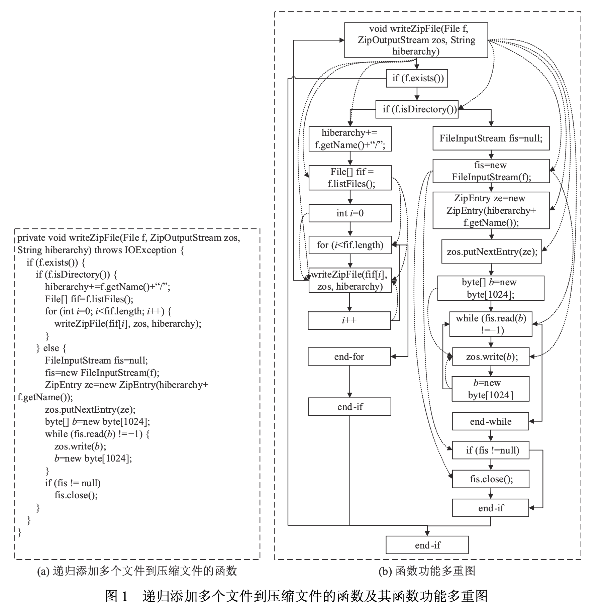
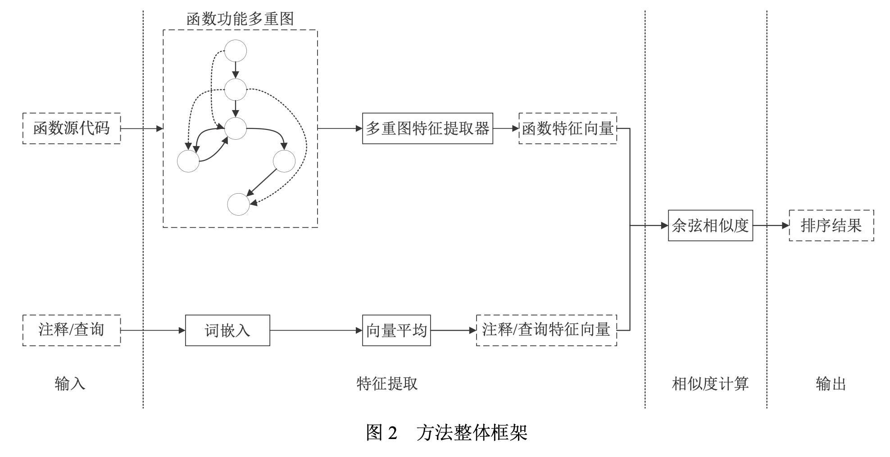
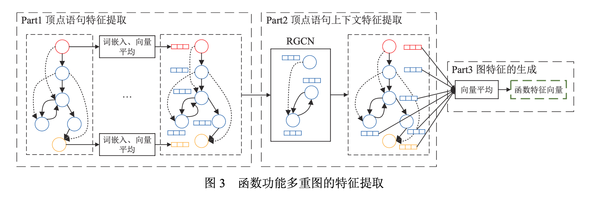

# Code Search Oriented Function Multigraph Embedding
## **Penyematan Multigraf Fungsi Berorientasi Pencarian Kode**

**XU Yang, CHEN Xiao-Jie, TANG De-You, HUANG Han**
(Sekolah Perangkat Lunak, Universitas Teknologi Cina Selatan, Guangzhou 510006, Cina)
**Penulis Korespondensi:** HUANG Han, E-mail: hhan@scut.edu.cn

**Kata Kunci:** *code search*; *control flow graph* (CFG); *data dependence graph* (DDG); *function multigraph*

---

**Klasifikasi Perpustakaan Cina:** TP311
**Format Sitasi Bahasa Mandarin:** 徐杨, 陈晓杰, 汤德佑, 黄翰. 面向代码搜索的函数功能多重图嵌入. 软件学报, 2024, 35(8): 3809–3823. [http://www.jos.org.cn/1000-9825/6940.htm](http://www.jos.org.cn/1000-9825/6940.htm)
**Format Sitasi Bahasa Inggris:** [*Code-search-oriented Function Multigraph Embedding*, Xu Y et al, 2024]. Ruan Jian Xue Bao/Journal of Software, 2024, 35(8): 3809–3823 (in Chinese). [http://www.jos.org.cn/1000-9825/6940.htm](http://www.jos.org.cn/1000-9825/6940.htm)

---

**Proyek Pendanaan:** Proyek Umum Dana Ilmu Pengetahuan Alam Provinsi Guangdong (2020A1515010696, 2022A1515011491); Proyek Umum Yayasan Ilmu Pengetahuan Alam Nasional Cina (61876207, 62276103); Proyek Umum Universitas Pusat (2020ZYGXZR014); Dana Terbuka Laboratorium Utama Data Besar Fiskal dan Pajak Provinsi Guangdong (2019B121203012).

**Riwayat Makalah:**

* Diterima: 09-05-2022
* Revisi: 04-10-2022, 18-12-2022, 16-02-2023
* Disetujui: 27-03-2023
* Publikasi Online (JOS): 26-07-2023
* Publikasi Online (CNKI): 27-07-2023

## Abstract 
Meningkatkan akurasi pencocokan antara input kueri bahasa alami yang heterogen dengan kode sumber bahasa pemrograman yang sangat terstruktur merupakan masalah mendasar dalam *code search* (pencarian kode). Ekstraksi fitur kode yang akurat menjadi salah satu kunci utama untuk meningkatkan akurasi pencocokan tersebut. Semantik yang diekspresikan oleh pernyataan kode tidak hanya berkaitan dengan pernyataan itu sendiri, tetapi juga terkait dengan konteks di mana ia berada. Model struktural kode menyediakan informasi kontekstual yang kaya untuk memahami fungsi kode. Penelitian ini mengusulkan sebuah metode pencarian kode berbasis *function multigraph embedding* (penyematan multigraf fungsi). Dalam metode yang diusulkan, strategi *early fusion* digunakan untuk mengintegrasikan dependensi data dari pernyataan kode ke dalam *control flow graph*—CFG (graf aliran kontrol), guna membangun multigraf fungsi yang merepresentasikan kode. Melalui dependensi data, multigraf ini secara eksplisit mengekspresikan hubungan ketergantungan antar node pendahulu dan penerus tidak langsung yang tidak terdapat dalam *control flow graph*, sehingga memperkuat informasi kontekstual dari node pernyataan. Secara bersamaan, mengingat heterogenitas sisi (*edge*) pada multigraf, metode *relational graph convolutional network*—RGCN digunakan untuk mengekstraksi fitur kode dari multigraf fungsi tersebut. Eksperimen pada dataset publik menunjukkan bahwa dibandingkan dengan metode yang ada yang berbasis teks kode dan model struktural, metode yang diusulkan meningkatkan MRR (*Mean Reciprocal Rank*) lebih dari 5%. Melalui eksperimen ablasi, ditunjukkan pula bahwa *control flow graph* memberikan kontribusi yang lebih besar terhadap akurasi pencarian dibandingkan dengan *data dependence graph*—DDG (graf dependensi data).

## 0 - Introduction

Pencarian kode (*code search*) merupakan aktivitas mencari fragmen kode yang sesuai dengan deskripsi kueri dalam bahasa alami [*Opportunities and Challenges in Code Search Tools*, Liu et al, 2021] , yang menjadi salah satu aktivitas paling frekuen dalam proses pengembangan perangkat lunak modern. Penelitian menunjukkan bahwa lebih dari 90% pengembang melakukan pencarian kode untuk menggunakan kembali kode berkualitas tinggi yang sudah ada, sehingga mengurangi beban pembelajaran serta meningkatkan efisiensi produksi dan kualitas perangkat lunak [*Research Progress of Code Search Methods*, Wei et al, 2021].

Masalah mendasar dalam pencarian kode adalah bagaimana meningkatkan akurasi pencocokan antara input kueri bahasa alami yang heterogen dengan kode sumber bahasa pemrograman yang sangat terstruktur. Dalam hal ini, pemahaman akurat terhadap struktur dan semantik fungsional yang diekspresikan oleh kode sumber, serta ekstraksi fitur kode, menjadi salah satu kunci utama. Dalam kode sumber, semantik fungsional yang diekspresikan oleh setiap pernyataan tidak hanya berkaitan dengan pernyataan itu sendiri, tetapi juga berhubungan dengan konteks di mana ia berada; konteks yang berbeda menyebabkan pernyataan memiliki semantik yang berbeda pula. Sebagai contoh, jika dua pemanggilan fungsi `send` dan `recv` berada dalam struktur perulangan (*loop*), semantik yang diekspresikan mungkin merujuk pada serangan penolakan layanan (*Denial of Service*—DoS) [*A Malicious Behavior Analysis Method Based on Program Semantic*, Li et al, 2008] , sedangkan jika kedua pemanggilan fungsi tersebut muncul dalam struktur berurutan (*sequential*), fungsi yang diekspresikan adalah pengiriman dan penerimaan data secara normal. Oleh karena itu, tugas pencarian kode pada hakikatnya adalah mencari fungsi atau fragmen kode yang mengimplementasikan satu atau beberapa fungsi tertentu, bukan sekadar mencari satu atau dua pernyataan di dalamnya.

Metode pencarian kode yang ada saat ini dapat dibagi menjadi dua kategori: metode berbasis temu kembali informasi (*information retrieval*) dan metode berbasis pembelajaran mendalam (*deep learning*).

Metode tradisional berbasis temu kembali informasi [*Sourcerer*, Linstead et al, 2009] [*CodeExchange*, Martie et al, 2015] [*Expanding Queries for Code Search using Semantically Related API Class-names*, Zhang et al, 2018] menganggap kode sebagai teks murni dan memandang pencarian kode sebagai pencocokan teks antara kode dan kueri. Metode jenis ini memiliki dua masalah utama: pertama, metode ini hanya mengekstraksi fitur semantik dangkal dari teks kode, sehingga jika kueri dan kode menggunakan kosakata yang berbeda untuk mengekspresikan maksud yang sama, pencocokan mungkin gagal [*Opportunities and Challenges in Code Search Tools*, Liu et al, 2021] ; kedua, metode ini menggunakan model *Bag-of-Words* (BoW) untuk merepresentasikan kode tanpa memperhatikan fitur struktural seperti urutan, percabangan, dan perulangan yang umum terdapat dalam kode, padahal fitur struktural tersebut merupakan informasi konteks penting untuk memahami pernyataan kode.

Sementara itu, metode berbasis pembelajaran mendalam mulai memperkenalkan teknik *deep learning* ke dalam riset pencarian kode dan telah menarik perhatian luas dari para peneliti dalam beberapa tahun terakhir. Metode ini mengekstraksi fitur semantik laten dari kode, yang dapat memitigasi masalah pertama pada metode berbasis temu kembali informasi. Berdasarkan representasi kodenya, metode ini dapat dibagi menjadi dua kategori: metode berbasis fitur teks kode [*Deep Code Search*, Gu et al, 2018] [*When Deep Learning Met Code Search*, Cambronero et al, 2019] [*Improving Code Search with Co-attentive Representation Learning*, Shuai et al, 2020] dan metode berbasis fitur struktural [*Multi-modal Attention Network Learning for Semantic Source Code Retrieval*, Wan et al, 2019] [*CRaDLe*, Gu et al, 2021] [*Multimodal Representation for Neural Code Search*, Gu et al, 2021]. Metode berbasis fitur teks tetap memandang kode sebagai teks murni tanpa memperhatikan fitur struktural, sehingga masih menyisakan masalah kedua dari metode temu kembali informasi. Di sisi lain, metode berbasis fitur struktural, selain memperhatikan teks kode, juga mengabstraksi model yang merepresentasikan struktur dan fungsi kode dari detail implementasi tingkat bawah, seperti *Abstract Syntax Tree* (AST), *Control Flow Graph* (CFG) [*Control Flow Analysis*, Allen, 1970] , dan *Program Dependence Graph* (PDG) [*The Program Dependence Graph and its Use in Optimization*, Ferrante et al, 1987] , guna menyediakan lebih banyak informasi semantik untuk ekstraksi fitur kode. Di antaranya, PDG mengekspresikan hubungan ketergantungan kontrol (*control-dependent*) antar pernyataan melalui *Control Dependence Graph* (CDG), namun tidak mendeskripsikan fitur struktural seperti urutan, percabangan, dan perulangan yang merupakan konteks penting untuk memahami semantik fungsional pernyataan. AST hanya merepresentasikan fitur sintaksis kode, sedangkan CFG merepresentasikan fitur struktur urutan, percabangan, dan perulangan, sehingga menyediakan fitur struktur dan fungsi kode sumber yang kaya untuk pencarian kode [*Control Flow Graph Embedding Based on Multi-instance Decomposition for Bug Localization*, Huo et al, 2020]. Namun, berdasarkan hasil eksperimen yang ada, metode yang menggunakan CFG sebagai representasi struktur kode saat ini belum mencapai performa yang ideal.

Hal ini memunculkan pertanyaan yang layak untuk dipertimbangkan: apakah CFG membantu dalam mengekstraksi fitur kode yang lebih akurat? Apakah diperlukan model representasi lain untuk membantu CFG merepresentasikan semantik fungsional kode dengan lebih baik? Jika model bantuan tersebut diperlukan, bagaimana cara menggabungkan berbagai representasi fitur yang berbeda untuk membangun fitur yang mewakili seluruh kode—yang merupakan masalah fusi fitur multimodal? Selain itu, bagaimana cara mengekstraksi fitur yang mengekspresikan semantik fungsional kode secara akurat dari model representasi tersebut juga merupakan masalah penting. Artinya, saat merancang metode ekstraksi fitur, tidak hanya ekstraksi fitur dari pernyataan kode yang harus dipertimbangkan, tetapi juga ekstraksi fitur dari konteks pernyataan tersebut.

Untuk tugas pencarian kode tingkat fungsi, penelitian ini mengusulkan sebuah metode pencarian kode berbasis penyematan multigraf fungsi (*function multigraph embedding*) yang disebut FuncGraphCS. FuncGraphCS menggunakan strategi *early fusion* (fusi awal) [*Deep Multimodal Learning*, Ramachandram et al, 2017] untuk mengintegrasikan tiga jenis informasi modalitas—pernyataan, *Control Flow Graph* (CFG), dan *Data Dependence Graph* (DDG)—ke dalam sebuah multigraf berarah sebagai representasi semantik fungsional dari kode fungsi. Secara bersamaan, karena heterogenitas sisi (*edge heterogeneity*) pada multigraf fungsi tersebut, penelitian ini menggunakan *Relational Graph Convolutional Network* (RGCN) [*Modeling Relational Data with Graph Convolutional Networks*, Schlichtkrull et al, 2018] untuk mengekstraksi fitur graf sebagai fitur kode fungsi, yang kemudian dicocokkan dengan fitur semantik dari kueri untuk menyelesaikan tugas pencarian kode. Eksperimen menunjukkan bahwa dibandingkan dengan metode tipikal yang sudah ada, *Mean Reciprocal Rank* (MRR) dari FuncGraphCS meningkat lebih dari 5%, yang mengindikasikan bahwa informasi konteks yang direpresentasikan oleh multigraf fungsi dapat secara efektif meningkatkan akurasi pencarian kode, di mana informasi konteks ini merupakan informasi penting yang dibutuhkan dalam pencarian kode. Selain itu, melalui eksperimen ablasi, ditunjukkan bahwa dibandingkan dengan *Data Dependence Graph*, *Control Flow Graph* memberikan kontribusi yang lebih besar dalam ekstraksi fitur kode yang akurat, sementara *Data Dependence Graph* dapat membantu *Control Flow Graph* untuk merepresentasikan semantik fungsional dengan lebih baik.

Bagian 1 dari makalah ini membahas pekerjaan terkait dalam pencarian kode. Bagian 2 memperkenalkan representasi multigraf dari fungsi. Bagian 3 menjelaskan metode pencarian kode berbasis penyematan multigraf fungsi yang diusulkan dalam penelitian ini. Bagian 4 memverifikasi efektivitas metode yang diusulkan melalui eksperimen perbandingan, serta memverifikasi kontribusi berbagai jenis fitur terhadap akurasi pencarian melalui eksperimen ablasi. Terakhir, Bagian 5 merangkum keseluruhan isi makalah.

## 1 - Penelitian Terkait

Metode pencarian kode (*code search*) yang ada saat ini secara utama dibagi menjadi dua kategori: metode berbasis **temu kembali informasi** (*Information Retrieval* — IR) dan metode berbasis **pembelajaran mendalam** (*Deep Learning*).

Metode berbasis temu kembali informasi utamanya didasarkan pada algoritma seperti **TF-IDF**, **BM25**, dan sejenisnya. Untuk meningkatkan akurasi pencarian, beberapa metode mengekstraksi informasi atribut kode secara spesifik (seperti nama kelas dan pemanggilan metode) serta hubungan dependensi guna mencapai pencarian dengan granulasi yang lebih halus. Sebagai contoh, [*Sourcerer*, Linstead et al, 2009] menggunakan **TF-IDF** dan *topic model* untuk melakukan ekstraksi fitur kode, sekaligus mengekstraksi entitas serta hubungan antar entitas dalam kode, kemudian menggunakan graf dependensi kode [*Dependency analysis tools: Reusable components for software maintenance*, Wilde et al, 1989] dan algoritma **PageRank** [*The PageRank citation ranking: Bringing order to the Web*, Page et al, 1998] untuk melakukan pemeringkatan lebih lanjut pada hasil pencarian. Secara serupa, [*CodeExchange*, Martie et al, 2015] menyediakan kondisi penyaringan yang lebih mendalam seperti kompleksitas kode, yang secara efektif mempersempit ruang lingkup hasil pencarian. Masalah pada metode jenis ini adalah hanya mengekstraksi fitur semantik dangkal dari teks kode, sehingga memerlukan keberadaan kata-kata dalam kode yang cocok dengan semantik kueri agar pencocokan dapat dilakukan. Oleh karena itu, penelitian telah mengusulkan metode **perluasan kueri** (*query expansion*). Contohnya, [*CodeHow*, Lv et al, 2015] memanfaatkan kemiripan antara kueri pengguna dengan nama API dan deskripsi API untuk menemukan kosakata dari 10 API teratas guna ditambahkan ke dalam kueri. [*Expanding queries for code search using semantically related API class-names*, Zhang et al, 2018] menemukan melalui log pencarian pengguna bahwa penambahan pengidentifikasi (*identifier*, terutama nama kelas) dalam kueri dapat meningkatkan akurasi pencarian secara efektif; penulis menggunakan kemiripan vektor kata untuk mencari 5 nama kelas API yang paling relevan guna memperluas kueri. [*Effective reformulation of query for code search using crowdsourced knowledge and extra-large data analytics*, Rahman et al, 2018] juga berpendapat bahwa nama kelas API dapat meningkatkan akurasi secara efektif melalui integrasi vektor kata, kemiripan teks, dan skor **PageRank** untuk memilih  nama kelas API teratas. [*Query expansion based on crowd knowledge for code search*, Nie et al, 2016] mengusulkan penggunaan pengetahuan berbasis kerumunan (*crowdsourced knowledge*) untuk memperluas kueri dengan mencari  kata teratas dari pasangan tanya-jawab yang telah dibangun sebelumnya. [*QE-integrating framework based on GitHub knowledge and SVM ranking*, Huang et al, 2019] memanfaatkan berbagai sumber informasi seperti *GitHub Knowledge* dan informasi evolusi kode untuk meningkatkan diversitas perluasan kueri. Berbeda dengan metode perluasan kueri yang ada, [*Description reinforcement based code search*, Li et al, 2017] meningkatkan akurasi pencarian melalui penguatan deskripsi kode dengan mengekstraksi fitur pemanggilan metode dan fitur struktur kode dari korpus kode-deskripsi guna memperkuat kode di dalam repositori.

Metode berbasis pembelajaran mendalam dapat dibagi lagi menjadi dua kategori: metode berbasis fitur teks dan metode berbasis fitur struktur.

Metode berbasis fitur teks menggunakan pendekatan pembelajaran mendalam untuk mengekstraksi fitur dari teks kode. [*DeepCS*, Gu et al, 2018] adalah yang pertama kali memperkenalkan metode pembelajaran mendalam ke dalam tugas pencarian kode, menggunakan nama fungsi, urutan pemanggilan API di dalam fungsi, dan teks kode fungsi sebagai fitur. [*NCS*, Sachdev et al, 2018] menggunakan kode dan komentar untuk melatih vektor kata secara tanpa pengawasan (*unsupervised*), sekaligus menggunakan **TF-IDF** untuk melakukan penjumlahan tertimbang pada vektor kata guna mendapatkan vektor komentar dan vektor kode yang kemudian diperingkat berdasarkan kemiripannya. [*UNIF*, Cambronero et al, 2019], yang dibangun berdasarkan **NCS**, menambahkan pelatihan terawasi (*supervised training*) yang secara efektif meningkatkan performa. Model seperti [*CARLCS*, Shuai et al, 2020] dan [*SANCS*, Fang et al, 2021] berpendapat bahwa metode yang ada menggunakan dua model berbeda untuk mengekstraksi fitur kode dan komentar sehingga kurang dalam interaksi fitur; oleh karena itu, mereka menggunakan mekanisme atensi (*attention mechanism*) untuk mencapai interaksi fitur antara kode dan komentar. Namun, metode ini memerlukan perhitungan fitur interaksi secara *real-time*, sehingga fitur kode tidak dapat dihitung secara luring (*offline*), yang sangat menurunkan efisiensi pencarian. Berkat perkembangan model bahasa pramelatih (*pre-trained language models*) berskala besar di bidang pemrosesan bahasa alami, bidang kode juga telah mengembangkan model pramelatih seperti [*CodeBERT*, Feng et al, 2020] dan [*GraphCodeBERT*, Guo et al, 2021]. Metode berbasis fitur teks hanya memperlakukan kode sebagai teks bahasa alami dan mengabaikan fitur struktur kode yang mengekspresikan semantik fungsional dari pernyataan. Selain itu, model pramelatih memerlukan data pelatihan yang sangat besar, memiliki parameter yang banyak, serta membutuhkan sumber daya memori, CPU, dan kartu grafis yang tinggi, dengan waktu pelatihan dan inferensi yang lama.

Metode berbasis fitur struktur utamanya menggunakan model representasi seperti **Abstract Syntax Tree** (AST), **Control Flow Graph** (CFG) , dan **Program Dependence Graph** (PDG) sebagai fitur. [*MMAN*, Wan et al, 2019] berpendapat bahwa penggunaan fitur teks kode saja mengabaikan fitur struktur kode, sehingga mengusulkan penggunaan tiga model representasi (teks kode, AST, dan CFG) sebagai fitur dengan menggunakan **LSTM**, **Tree-LSTM** [*Tree-structured long short-term memory networks*, Tai et al, 2015], dan **GGNN** [*Gated graph sequence neural networks*, Li et al, 2017] untuk masing-masing ekstraksi, yang diakhiri dengan strategi fusi menengah (*intermediate fusion*). [*MRNCS*, Gu et al, 2021] berpendapat bahwa penggunaan fitur multimodal dapat meningkatkan performa model secara efektif; penelitian tersebut juga mengusulkan *Simplified Semantic Tree* (SST) yang menghapus node tidak relevan bagi tugas pencarian kode (seperti node pengubah/*modifier*) dari AST, dan menggunakan strategi fusi menengah [*Early Fusion*, Ramachandram et al, 2017] untuk menggabungkan fitur multimodal guna meningkatkan akurasi pencarian. [*DGMS*, Ling et al, 2021] menganggap metode yang ada mengabaikan fitur struktur dari kode dan teks kueri, sehingga mengusulkan penggunaan *Constituency Parse Tree* untuk kueri dan AST yang diperkuat [*Learning to represent programs with graphs*, Allamanis et al, 2018] untuk kode, kemudian menggunakan **Relational Graph Convolutional Network (RGCN)** [*Modeling relational data with graph convolutional networks*, Schlichtkrull et al, 2018] untuk mengekstraksi fitur dari kedua pohon tersebut. [*Approach to searching software source code with graph embedding*, Ling et al, 2019] merepresentasikan proyek perangkat lunak sebagai graf kode, menggabungkan metode IR dan *graph embedding* untuk mempelajari informasi struktur dalam pada graf kode guna meningkatkan akurasi sekaligus mengurangi waktu respons pencarian. [*CRaDLe*, Gu et al, 2021] berpendapat bahwa jaringan saraf sulit mengekstraksi fitur struktur dari AST, sementara beberapa jalur eksekusi pada CFG mungkin tidak pernah dieksekusi sehingga menyebabkan bias fitur; oleh karena itu, penulis mengusulkan penggunaan **PDG** untuk merepresentasikan fungsi melalui matriks dependensi antar pernyataan, kemudian mengekstraksi fitur dependensi dan menggabungkannya dengan fitur teks melalui fusi menengah. Serupa dengan **CRaDLe**, [*Code search combining graph embedding and attention mechanism*, Huang et al, 2022] juga mempertimbangkan fitur **PDG** namun mengekstraksi fitur graf melalui konstruksi sekuens subgraf node dan algoritma **Skip-Gram**. Berbeda dengan kedua riset tersebut, penelitian ini berpendapat bahwa urutan pernyataan, struktur percabangan, dan perulangan merupakan informasi konteks penting untuk mengekspresikan fungsi; dependensi kontrol dan data mengekspresikan hubungan antar pernyataan namun tidak mendeskripsikan struktur urutan, cabang, dan perulangan tersebut. Dari hasil eksperimen yang dipublikasikan, akurasi metode berbasis fitur struktur saat ini belum tinggi. Sebagaimana analisis sebelumnya, penelitian ini berpendapat bahwa sebagian besar metode saat ini menggunakan AST atau PDG yang kurang dalam mendeskripsikan fitur struktur urutan, percabangan, dan perulangan, sehingga memengaruhi akurasi pencarian kode.

Tabel 1 merangkum karakteristik metode pencarian kode tipikal yang ada dari empat aspek: granulasi pencarian, model representasi data, metode ekstraksi fitur, dan metode fusi fitur; selain itu, penelitian ini juga merangkum ketersediaan kode sumber dari masing-masing metode.

## 2 - Representasi Multigraf Fungsi

Sebagaimana pandangan yang telah dikemukakan sebelumnya dalam makalah ini, semantik yang diekspresikan oleh setiap pernyataan kode tidak hanya berkaitan dengan pernyataan itu sendiri, tetapi juga berhubungan dengan konteks di mana ia berada. Penentuan model representasi yang digunakan untuk mengekspresikan fitur pernyataan beserta konteksnya, khususnya fitur fungsional kode, merupakan masalah utama yang harus diselesaikan dalam tugas pencarian kode.

## 2.1 - Definisi Multigraf Fungsi

Program Dependence Graph (PDG) [PDG, Ferrante et al, 1987] merupakan salah satu model representasi opsional. PDG secara eksplisit mengekspresikan hubungan dependensi kontrol (control dependence) dan dependensi data (data dependence) yang ada di dalam program secara bersamaan. Dependensi kontrol mengekspresikan hubungan ketergantungan kontrol antara satu pernyataan dengan pernyataan lainnya, sementara dependensi data mendeskripsikan ketergantungan suatu pernyataan terhadap nilai pada pernyataan lain. Meskipun dependensi kontrol dan data dapat mendeskripsikan fitur kontekstual dari pernyataan kode, dependensi kontrol dalam PDG hanya mendeskripsikan hubungan dependensi kontrol antar pasangan pernyataan. Sebagai contoh, pada blok kode if, dependensi kontrol PDG mendeskripsikan bahwa setiap pernyataan di dalam blok if serta blok kode yang bersarang di dalamnya memiliki dependensi kontrol terhadap pernyataan if-condition; namun, PDG tidak mendeskripsikan hubungan antar pernyataan yang tidak memiliki hubungan dependensi kontrol tetapi memiliki hubungan urutan logika eksekusi. PDG tidak mendeskripsikan hubungan struktural urutan, percabangan, dan perulangan di dalam blok kode secara lengkap, padahal hubungan-hubungan tersebut merupakan informasi konteks penting untuk memahami fungsi pernyataan.

Sebaliknya, Control Flow Graph (CFG) mencatat alur eksekusi pernyataan dalam kode, di mana sisi (edge) mengekspresikan fitur struktural urutan, percabangan, dan perulangan, sedangkan node merepresentasikan blok kode yang terdiri dari beberapa pernyataan yang sangat terkait. Hal ini menyediakan fitur struktural dan fungsional kode sumber yang kaya untuk pencarian kode [Control Flow Analysis, Allen, 1970], dan PDG sendiri juga diekstraksi berdasarkan Control Flow Graph [PDG, Ferrante et al, 1987].

Fitur kode fungsi dalam makalah ini dikonstruksi melalui fusi fitur dari setiap pernyataan di dalam kode fungsi tersebut. Ekstraksi setiap fitur pernyataan tidak hanya mempertimbangkan fitur teks pernyataan, tetapi juga mempertimbangkan konteksnya, yaitu fitur pernyataan yang memiliki asosiasi dengan pernyataan tersebut. Oleh karena itu, Control Flow Graph dalam makalah ini adalah graf berarah yang menggunakan setiap pernyataan dalam fungsi sebagai node dan menghubungkan node-node tersebut dengan sisi berarah; sisi berarah menunjukkan urutan eksekusi pernyataan, termasuk urutan, percabangan, dan perulangan. Namun, Control Flow Graph tidak dapat merepresentasikan dependensi antar node yang bukan merupakan pendahulu (predecessor) atau penerus (successor) langsung, padahal dependensi semacam ini juga merupakan salah satu informasi konteks untuk memahami fungsi pernyataan kode. Sebagaimana ditunjukkan pada Gambar 1(a), pernyataan fis = new FileInputStream(f) dan fis.close() masing-masing merepresentasikan pembuatan dan penutupan aliran (stream); fungsi dari fis.close() tidak dapat ditentukan jika tidak dikombinasikan dengan pernyataan fis = new FileInputStream(f).

Makalah ini menggunakan Data Dependence Graph (DDG) untuk mengatasi keterbatasan Control Flow Graph dalam merepresentasikan dependensi antar node yang bukan pendahulu dan penerus langsung. Sebagai subgraf dari PDG, DDG adalah graf berarah yang menggunakan setiap pernyataan dalam fungsi sebagai node dan dihubungkan oleh sisi dependensi data. Sisi dependensi data mengekspresikan ketergantungan pernyataan penggunaan variabel terhadap pernyataan deklarasi atau penugasan variabel, yang dapat melengkapi hubungan dependensi antar node yang tidak terkait langsung dalam Control Flow Graph. Misalnya, dengan membangun sisi dependensi data secara eksplisit antara fis = new FileInputStream(f) dan fis.close() pada Gambar 1(a), fungsi yang diekspresikan oleh pernyataan fis.close() sebagai penutupan aliran input berkas dapat diperjelas.

Node dalam Control Flow Graph dan Data Dependence Graph keduanya berbasis unit pernyataan, di mana himpunan node Control Flow Graph mencakup himpunan node Data Dependence Graph. Berdasarkan karakteristik struktural dari kedua graf ini, berbeda dengan metode multimodal yang ada yang menggunakan strategi intermediate fusion (fusi menengah) [CFG-Embedding, Huo et al, 2020], makalah ini mengadopsi strategi early fusion (fusi awal) [CFG-Embedding, Huo et al, 2020] dengan menggabungkannya ke dalam satu multigraf berarah, serta membedakan sisi Control Flow Graph dan sisi dependensi data melalui tipe sisi yang berbeda.

Secara keseluruhan, multigraf fungsi dalam makalah ini adalah graf yang disusun dengan pernyataan di dalam fungsi sebagai node, dan dihubungkan oleh dua tipe sisi berarah yang berbeda, yaitu sisi aliran kontrol dan sisi dependensi data. Secara formal, definisi multigraf fungsi diberikan sebagai berikut:

Definisi 1 (Multigraf Fungsi). Diberikan kode fungsi $C$ beserta Control Flow Graph $G_{CF} = (V_{CF}, E_{CF})$ dan Data Dependence Graph $G_{DD} = (V_{DD}, E_{DD})$. $V_{CF}$ dan $E_{CF}$ masing-masing adalah himpunan node dan himpunan sisi berarah dari Control Flow Graph; $V_{DD}$ dan $E_{DD}$ masing-masing adalah himpunan node dan himpunan sisi berarah dari Data Dependence Graph. $G = (V, E)$ adalah multigraf fungsi dari $C$, di mana:

* $V$ adalah himpunan node, $V = V_{CF}$, dan $V_{DD} \subseteq V$. Setiap node merepresentasikan satu pernyataan dalam $C$.
* $E$ adalah himpunan sisi berarah dalam graf. $e = (v_i, v_j, r) \in E$, di mana $v_i, v_j$ adalah dua node sembarang dalam $V$. $r \in R = \{0, 1\}$ menunjukkan tipe dari sisi $e$. $r = 0$ menunjukkan tipe sisi hubungan aliran kontrol; $r = 1$ menunjukkan tipe sisi hubungan dependensi data.
  * Jika sisi berarah $(v_i, v_j) \in E_{CF}$, maka $(v_i, v_j, 0) \in E$.
  * Jika sisi berarah $(v_i, v_j) \in E_{DD}$ dan $(v_i, v_j) \notin E_{CF}$, maka $(v_i, v_j, 1) \in E$.
  * Jika sisi berarah $(v_i, v_j) \notin E_{CF}$, maka $(v_i, v_j, 0) \notin E$; jika sisi berarah $(v_i, v_j) \notin E_{DD}$, maka $(v_i, v_j, 1) \notin E$.

Gambar 1(b) mengilustrasikan multigraf fungsi yang sesuai dengan fungsi pada Gambar 1(a). Setiap node dalam graf mewakili satu pernyataan, dan antar node dihubungkan oleh sisi aliran kontrol (garis utuh) serta sisi dependensi data (garis putus-putus). Berikut adalah penjelasan mengenai beberapa node khusus:

* Node Deklarasi Fungsi: Node teratas pada Gambar 1(b) adalah node deklarasi fungsi. Deklarasi fungsi yang mencakup nama fungsi dan daftar parameter menyediakan informasi untuk memahami fungsi kode; oleh karena itu, makalah ini menjadikan deklarasi fungsi sebagai titik masuk Control Flow Graph dan membangun sisi aliran kontrol dengan pernyataan pertama eksekusi fungsi serta node lain yang memiliki hubungan aliran kontrol.


* Node Struktur Percabangan: Pernyataan kondisi if(f.isDirectory()) pada Gambar 1(a) dijadikan sebagai node tunggal pada Gambar 1(b) untuk mengekspresikan urutan eksekusi antara kondisi if dengan pernyataan di dalam bloknya. Terdapat beberapa busur pada if(f.isDirectory()) yang dapat merepresentasikan beberapa jalur eksekusi di bawah kondisi penilaian yang berbeda. Secara serupa, titik masuk untuk struktur percabangan lainnya (elseif/else/switch), struktur perulangan (for/for-each/while/do-while), dan blok khusus (synchronized/try/catch/finally) juga dijadikan sebagai node tunggal.


* Node Struktur Perulangan: Setelah eksekusi b = new byte[1024] pada Gambar 1(b), alur kembali ke while(fis.read(b) != -1), yang merepresentasikan struktur perulangan; struktur perulangan lainnya konsisten dengan while. Secara khusus, for(int i = 0; i < fif.length; i++) pada Gambar 1(a) direpresentasikan sebagai tiga node pada Gambar 1(b), yaitu int i = 0, for(i < fif.length), dan i++. int i = 0 adalah node pendahulu dari for(i < fif.length), dan i++ adalah node penerus dari pernyataan terakhir dalam tubuh perulangan writeZipFile(fif[i], zos, hierarchy). Dengan memisahkan for(init_statement; test_statement; alter_statement), urutan eksekusi dari init_statement, test_statement, dan alter_statement dapat diekspresikan, yang merupakan representasi blok pernyataan for dengan granulasi yang lebih halus.


* Node Akhir: Gambar 1(b) juga memiliki node yang diawali dengan "end-", seperti end-if dan end-for. Node ini tidak memiliki pernyataan koresponden dalam kode sumber dan digunakan untuk mengekspresikan akhir dari struktur kontrol dan blok khusus secara eksplisit, termasuk end-if, end-while, end-for, end-try, end-catch, end-finally, end-switch, dan end-synchronized.

Mengenai sisi dependensi data, pada Gambar 1(b) terdapat dependensi data antara byte[] b = new byte[1024] dengan while (fis.read(b) != -1), namun karena kedua node tersebut sudah memiliki sisi aliran kontrol yang mengekspresikan dependensi pendahulu dan penerus langsung, maka sisi dependensi data tidak lagi ditambahkan. Makalah ini tidak menambahkan sisi dependensi data pada node yang sudah terhubung oleh sisi aliran kontrol.

## 2.2 - Konstruksi Multigraf Fungsi

Berdasarkan Definisi 1, konstruksi multigraf fungsi dapat dilakukan dengan berbasis pada Control Flow Graph (CFG) dan Data Dependence Graph (DDG) dari fungsi tersebut. Jika tidak terdapat sisi aliran kontrol di antara dua node pernyataan namun terdapat sisi dependensi data, maka sisi dependensi data tersebut ditambahkan ke dalam CFG untuk menyelesaikan pembentukan multigraf fungsi.

Meskipun CFG dan Program Dependence Graph (PDG/DDG) telah lama menjadi alat yang digunakan secara luas dalam bidang analisis dan optimasi kode, serta terdapat berbagai alat pembangun CFG dan PDG untuk berbagai bahasa pemrograman, alat-alat tersebut saat ini masih belum sempurna akibat faktor-faktor seperti perkembangan bahasa pemrograman yang terus-menerus dan perbedaan tujuan saat pengembangan alat. Sebagai contoh, alat pembangun CFG untuk bahasa seperti Python dan JavaScript masih belum matang, dan terlebih lagi masih kekurangan alat pembangun DDG. Banyak alat pembangun cenderung ditujukan untuk representasi kode antara (intermediate code representation), bukan berorientasi pada level kode sumber (source code level). Dengan mempertimbangkan kebutuhan konstruksi multigraf dan dataset yang digunakan dalam penelitian ini, kami menggunakan alat sumber terbuka Progex (https://github.com/ghaffarian/progex) untuk menghasilkan CFG dan DDG sebagai dasar, kemudian mengintegrasikan sisi dari DDG ke dalam CFG untuk membangun multigraf fungsi. Pemilihan Progex didasarkan pada alasan-alasan berikut: (1) Progex merupakan alat sumber terbuka lintas platform yang dapat mengekstraksi berbagai representasi program seperti CFG, PDG (DDG), dan Abstract Syntax Tree (AST) pada level kode sumber perangkat lunak. Fitur pembangunan CFG dan DDG pada level kode sumber ini sesuai dengan definisi node dalam multigraf fungsi pada penelitian ini yang merupakan pernyataan kode sumber. (2) Progex menerima berkas kode sumber program sebagai input dan dapat mengekspor berbagai representasi program ke dalam format berkas umum, yang secara signifikan mengurangi beban kerja prapemrosesan data.

Mengingat adanya kemungkinan dependensi multi-variabel di antara dua pernyataan, Progex secara standar menghasilkan satu sisi berlabel nama variabel untuk setiap dependensi tersebut saat membangun DDG. Namun, karena sisi dependensi data dalam penelitian ini digunakan untuk mengekspresikan hubungan asosiasi konteks antar pernyataan, maka beberapa hubungan dependensi yang mungkin ada di antara dua pernyataan digabungkan menjadi satu hubungan tunggal, yang direpresentasikan dalam multigraf sebagai satu sisi dependensi data tanpa label. Sebagaimana ditunjukkan pada Gambar 1(b), terdapat dependensi dua variabel antara node deklarasi fungsi void writeZipFile(File f, ZipOutputStream zos, String hierarchy) dengan node ZipEntry ze = new ZipEntry(hierarchy + f.getName()), namun dalam graf hanya digunakan satu sisi untuk merepresentasikan hubungan dependensi data tersebut. Untuk mencapai tujuan ini, kami memodifikasi kode sumber Progex dalam menghasilkan DDG. Secara spesifik, kami menggunakan tabel hash (hash table) untuk menyimpan DDG (daftar adjasensi) yang dihasilkan oleh algoritma Progex guna mencapai penghapusan duplikasi sisi (deduplication), kemudian menggunakan pustaka alat yang ada untuk mengonversinya langsung menjadi output format berkas JSON.

Konstruksi multigraf fungsi ditunjukkan dalam Algoritma 1. Algoritma ini menerima CFG ($G_{CF}$) dan DDG ($G_{DD}$) sebagai input. Baris 3–11 melakukan iterasi pada seluruh sisi CFG dan menambahkan setiap node serta sisi ke dalam multigraf fungsi $G$ . Secara serupa, baris 12–16 melakukan iterasi pada seluruh sisi DDG dan menambahkan sisi tersebut ke dalam $G$ . Algoritma 1 mengiterasi seluruh sisi pada CFG dan DDG, yaitu seluruh sisi pada multigraf fungsi, sehingga kompleksitas waktu algoritma ini adalah $O(|E|)$. Karena $G$ menyimpan seluruh node dan sisi multigraf fungsi, kompleksitas ruangnya adalah $O(|V| + |E|)$.

Input: Control Flow Graph $G_{CF}$, Data Dependence Graph $G_{DD}$
Output: Multigraf Fungsi $G$

```
function buildFunctionMultigraph($G_{CF}$, $G_{DD}$):
    Inisialisasi multigraf fungsi $G$ sebagai daftar adjasensi kosong
    
    // Tahap 1: Memproses Control Flow Graph (Sisi Tipe 0)
    for each edge $(v_i, v_j) \in E_{CF}$ do
        if $v_i \notin V$ then
            Tambahkan node $v_i$ ke dalam $V$
        endif
        
        if $v_j \notin V$ then
            Tambahkan node $v_j$ ke dalam $V$
        endif
        
        Tambahkan sisi $(v_i, v_j, 0)$ ke dalam $E$
    endfor
    
    // Tahap 2: Memproses Data Dependence Graph (Sisi Tipe 1)
    for each edge $(v_i, v_j) \in G_{DD}$ do
        if $(v_i, v_j) \notin E_{CF}$ then
            Tambahkan sisi $(v_i, v_j, 1)$ ke dalam $E$
        endif
    endfor
    
    return $G$
```

## 3 - Pencarian Kode Berbasis Penyematan Multigraf Fungsi

## 3.1 - Kerangka Kerja Metode

Metode pencarian kode FuncGraphCS yang diusulkan dalam penelitian ini, yang berbasis pada function multigraph embedding (penyematan multigraf fungsi), merupakan proses pencocokan satu per satu serta pemeringkatan antara kueri yang dinyatakan dalam bahasa alami dengan kode sumber fungsi. Gambar 2 mendeskripsikan kerangka kerja keseluruhan dari metode FuncGraphCS. Seluruh proses pencarian utamanya mencakup tiga langkah: 1) ekstraksi fitur fungsi; 2) ekstraksi fitur kueri; 3) perhitungan derajat pencocokan serta pemeringkatan antara kueri dan fungsi.

Dalam metode FuncGraphCS, setiap kode fungsi dikonversi menjadi sebuah multigraf. Multigraf tersebut menggabungkan fitur dari tiga modalitas: pernyataan, control flow graph—CFG (graf aliran kontrol), dan dependensi data. Untuk mengekstraksi fitur fungsi dari multigraf, FuncGraphCS merancang sebuah ekstraktor fitur multigraf untuk memperoleh vektor fitur fungsi. Di dalam ekstraktor fitur multigraf tersebut, pertama-tama digunakan teknik word embedding (penyematan kata) untuk mengekstraksi fitur dari setiap node pernyataan dalam multigraf. Kemudian, digunakan relational graph convolutional network (RGCN) untuk mengekstraksi fitur konteks dari node pernyataan guna memperkuat fitur node tersebut. Terakhir, fitur dari seluruh node dalam multigraf difusikan untuk mendapatkan vektor fitur yang merepresentasikan fungsi tersebut. Pada fase pelatihan dan inferensi, metode ekstraksi fitur multigraf yang digunakan adalah konsisten. Vektor fitur dari kode fungsi dalam basis kode dapat dihitung secara luring (offline) dan disimpan untuk meningkatkan kecepatan pencarian waktu nyata (real-time).

FuncGraphCS mengadopsi teknik word embedding dari pemrosesan bahasa alami untuk mengekstraksi fitur kueri pengguna. Mengingat saat ini terdapat kekurangan dataset kueri-kode di bidang riset pencarian kode, pada fase pelatihan, FuncGraphCS menggunakan dokumentasi komentar fungsi sebagai pengganti kueri pengguna. Secara spesifik, FuncGraphCS melakukan segmentasi kata pada komentar dokumen untuk mendapatkan sekuens token, kemudian merata-ratakan vektor kata dari setiap token untuk memperoleh vektor fitur komentar. Selanjutnya, cosine similarity (kemiripan kosinus) digunakan untuk menghitung kemiripan antara vektor fitur komentar dengan vektor fitur kode fungsi, dan fungsi kerugian (loss function) pada Bagian 3.3 digunakan untuk meningkatkan kemiripan kedua vektor tersebut. Pada fase inferensi, FuncGraphCS menggunakan model ekstraksi fitur komentar yang telah dilatih untuk mengekstraksi fitur kueri, lalu menghitung kemiripannya dengan setiap vektor fitur fungsi dalam basis kode, dan mengembalikan hasil kueri berdasarkan urutan kemiripan dari tertinggi ke terendah.

## 3.2 - Ekstraksi Fitur Fungsi

Sebagaimana telah dijelaskan sebelumnya, ekstraksi fitur fungsi tidak hanya harus mempertimbangkan ekstraksi fitur dari setiap pernyataan, tetapi juga ekstraksi fitur konteks pernyataan, serta fusi antara fitur pernyataan dan fitur konteks untuk memperoleh fitur fungsi secara keseluruhan. FuncGraphCS merepresentasikan fungsi sebagai multigraf; model representasi ini mengekspresikan pernyataan di dalam fungsi beserta konteks pernyataannya (struktur kontrol dan hubungan dependensi data yang melingkupinya). Dengan demikian, ekstraksi fitur fungsi ditransformasikan menjadi ekstraksi fitur pada multigraf. Gambar 3 mendeskripsikan alur keseluruhan dari ekstraksi fitur kode. Secara spesifik, ekstraksi fitur multigraf dibagi menjadi tiga langkah: 1) ekstraksi fitur pernyataan node, menggunakan teknik word embedding untuk mengekstraksi fitur dari setiap pernyataan kode; 2) ekstraksi fitur konteks pernyataan node, menggunakan relational graph convolutional network (RGCN) untuk mempelajari konteks dari setiap pernyataan guna memperoleh fitur semantik konteks yang diperkuat; 3) generasi fitur graf, memfusikan fitur yang telah diperkuat dari setiap node untuk mendapatkan fitur graf keseluruhan, yaitu fitur fungsi. Berikut adalah penjelasan detail dari setiap langkah:

1) Ekstraksi Fitur Pernyataan Node

Sebagaimana ditunjukkan pada Bagian 1 Gambar 3, setiap node menggunakan pernyataan sebagai fitur. Karena pernyataan kode memiliki karakteristik panjang yang pendek, penelitian ini langsung melakukan segmentasi kata pada setiap pernyataan untuk mendapatkan sekuens token, mengubah setiap token menjadi vektor melalui teknik word embedding, lalu merata-ratakan vektor dari sekuens token tersebut untuk memperoleh vektor fitur pernyataan. Penelitian ini menggunakan vektor fitur tersebut sebagai nilai awal fitur setiap node; vektor fitur ini hanya berisi fitur dari pernyataan itu sendiri tanpa menyertakan fitur konteksnya. Secara spesifik, jika $T = \langle t_1, t_2, \dots, t_n \rangle$ adalah sekuens token dari pernyataan setelah segmentasi kata, di mana $n$ adalah panjang sekuens, maka sekuens vektor kata yang sesuai dicatat sebagai $E_T = \langle e_{t_1}, e_{t_2}, \dots, e_{t_n} \rangle$. Vektor fitur pernyataan $e_{stmt}$ adalah:

$$e_{stmt} = \frac{1}{n} \sum_{i=1}^{n} e_{t_i}$$

Penelitian ini memelihara sebuah matriks pencarian $M_C$ yang memetakan token dan vektor dalam kode, di mana vektor yang sesuai dengan setiap token ditemukan melalui tabel tersebut, yaitu $e_{t_i} = lookup(t_i, M_C)$. Matriks ini diinisialisasi secara acak pada saat pelatihan dan diperbarui bersama parameter lainnya selama proses pelatihan. Ukuran matriks ini adalah tetap.

2) Ekstraksi Fitur Konteks Pernyataan Node

Graph Neural Network (GNN) dapat memperbarui fitur node saat ini dengan mengagregasi fitur dari node tetangga ketika mengekstraksi fitur titik. Karakteristik agregasi fitur node tetangga ini sangat tepat untuk mengekstraksi fitur konteks dari setiap pernyataan di dalam fungsi yang fungsinya berkaitan dengan konteksnya. Secara spesifik, multigraf fungsi yang digunakan dalam penelitian ini adalah graf heterogen berarah yang berisi dua tipe sisi yang berbeda. Relational Graph Convolutional Network (RGCN) cocok untuk ekstraksi fitur pada graf heterogen berarah dengan berbagai tipe sisi; jaringan ini menetapkan parameter latih yang berbeda untuk tipe sisi berarah yang berbeda guna mengagregasi fitur node tetangga melalui parameter-parameter tersebut. Dengan cara ini, informasi dari node tetangga, tipe sisi, dan arah sisi dapat diintegrasikan untuk mengekstraksi fitur konteks node. Karakteristik RGCN tersebut sangat sesuai untuk multigraf fungsi dalam penelitian ini. Oleh karena itu, penelitian ini memilih RGCN sebagai ekstraktor fitur graf.

Ekstraksi fitur konteks pernyataan node ditunjukkan pada Bagian 2 Gambar 3. Teori terkait relational graph convolutional network dapat merujuk pada [RGCN, Schlichtkrull et al, 2018]. Di sini hanya dijelaskan beberapa pengaturan pada metode penelitian ini; pengaturan yang tidak dijelaskan adalah konsisten dengan [RGCN, Schlichtkrull et al, 2018]. Jika terdapat $m$ node dalam multigraf fungsi, maka vektor fitur awal setiap node dalam graf adalah $e_{stmt_i}, i = 1, 2, \dots, m$, yaitu $h_i^{(0)} = e_{stmt_i}$. Multigraf fungsi berisi sisi aliran kontrol dan sisi dependensi data, yaitu $R = \{0, 1\}$. Oleh karena itu, pada setiap lapisan RGCN, fitur setiap node memfusikan fitur dari node tetangganya melalui kedua hubungan tersebut. Penelitian ini menggunakan 2 lapisan RGCN, yaitu $L = 2$. Jaringan ini diimplementasikan menggunakan RGCNConv yang disediakan oleh kerangka kerja graph deep learning PyTorch Geometric. Setelah langkah ini, vektor fitur setiap node telah mencakup fitur pernyataan beserta konteksnya.

3) Generasi Fitur Graf

Sebagaimana ditunjukkan pada Bagian 3 Gambar 3, setelah memperoleh fitur setiap node $h_i^{(L)}$ melalui Bagian 2, penelitian ini memperoleh vektor fitur seluruh graf $h_{graph}$ dengan merata-ratakan fitur node yang telah diperkuat. Fitur ini merupakan fitur fungsi:

$$h_{graph} = \frac{1}{m} \sum_{i=1}^{m} h_i^{(L)}$$


## 3.3 - Ekstraksi Fitur Komentar dan Kueri serta Fungsi Kerugian

Pada tahap pelatihan, penelitian ini menggunakan dokumentasi komentar dari setiap fungsi untuk melatih model, sementara pada tahap inferensi, model ekstraksi fitur komentar yang telah dilatih digunakan untuk mengekstraksi fitur kueri. Sebagaimana diilustrasikan pada bagian bawah Gambar 2, proses ekstraksi fitur komentar/kueri dimulai dengan mengonversi setiap token dalam komentar atau kueri menjadi vektor kata (word vector), yang kemudian dirata-ratakan untuk menghasilkan vektor fitur.

Secara spesifik, jika sekuens token hasil segmentasi komentar atau kueri dinyatakan sebagai $Q = \langle q_1, q_2, \dots, q_s \rangle$ dengan $s$ sebagai panjang sekuens, maka sekuens vektor kata yang koresponden adalah $E_Q = \langle e_{q_1}, e_{q_2}, \dots, e_{q_s} \rangle$. Vektor fitur komentar atau kueri $h_Q$ diperoleh melalui persamaan (3):

$$h_Q = \frac{1}{s} \sum_{i=1}^{s} e_{q_i}$$

Penelitian ini memelihara sebuah matriks pencarian (lookup matrix) $M_Q$ yang memetakan token dalam komentar ke vektor, di mana setiap vektor token ditemukan melalui operasi $e_{q_i} = \text{lookup}(q_i, M_Q)$. Matriks ini diinisialisasi secara acak pada awal pelatihan dan diperbarui bersama parameter lainnya; ukuran matriks ini bersifat tetap. Untuk kueri, matriks pencarian yang sama digunakan untuk mengonversi token menjadi vektor.

Pada fase pelatihan, fungsi kerugian yang diterapkan ditunjukkan pada persamaan (4), di mana $h_Q^+$ adalah vektor fitur komentar yang sesuai dengan kode (sampel positif), dan $h_Q^-$ adalah daftar vektor fitur komentar yang diambil secara acak sebagai sampel negatif (menggunakan komentar dari kode lain dalam batch yang sama). Fungsi $\text{sim}(\cdot, \cdot)$ adalah fungsi penghitungan kemiripan vektor menggunakan fungsi kosinus (cosine function). Tujuan pelatihan adalah meminimalkan persamaan (4), yang setara dengan memaksimalkan kemiripan antara vektor fitur fungsi dengan vektor fitur komentar korespondennya, serta meminimalkan kemiripan dengan sampel negatif yang paling mirip. Implementasi fungsi kerugian ini mengadopsi cosine_loss dari proyek codesnippetsearch di GitHub.

$$\text{loss} = \max\{1 - \text{sim}(h_{\text{graph}}, h_Q^+) + \max_j \text{sim}(h_{\text{graph}}, h_{Q_j}^-), 0\}$$


## 4 - Analisis Eksperimental

## 4.1 - Data Eksperimental

Data eksperimen bersumber dari dataset [CodeSearchNet, Husain et al, 2020], yang mencakup dataset pencarian kode untuk enam bahasa: Java, Python, Ruby, JavaScript, PHP, dan Go. Mengingat keterbatasan alat pembangkit Control Flow Graph (CFG) dan Data Dependence Graph (DDG) yang hanya tersedia secara memadai untuk Java, serta fakta bahwa dataset Java lainnya seringkali telah dipra-proses sehingga tidak dapat diparsing ulang, penelitian ini membatasi eksperimen pada dataset Java dari CodeSearchNet.

Langkah-langkah prapemrosesan dan aturannya adalah sebagai berikut:

1) Penghapusan sampel non-Inggris: Hanya memproses kueri yang ditulis dalam bahasa Inggris.
2) Filter panjang komentar: Sampel dengan panjang komentar kurang dari 3 kata dihapus karena dianggap tidak cukup untuk mengekspresikan fungsi kode secara akurat.
3) Kegagalan parsing: Sampel yang tidak dapat diparsing menjadi CFG dan DDG dihapus (kemungkinan karena kesalahan sintaksis).
4) Batas jumlah node: Menghapus sampel dengan jumlah node lebih dari 500 untuk efisiensi algoritma.
5) Fungsi kosong: Menghapus sampel dengan jumlah node 0 (tubuh fungsi kosong).
6) Pembersihan kata kunci: Menghapus kata kunci seperti public dan static yang tidak berkontribusi pada diferensiasi fungsional kode.
7) Tokenisasi penamaan: Memecah nama fungsi atau variabel bergaya camelCase dan snake_case menjadi token individual untuk memperkecil ukuran kosakata.
8) Penghapusan simbol dan numerik: Menghapus simbol seperti . atau [] serta angka (integer/float) karena tidak mengandung informasi semantik yang dapat dibandingkan.
9) Pengabaian fitur JDK 1.7+: Mengabaikan fitur baru seperti ekspresi Lambda karena tidak didukung oleh alat Progex.

Distribusi jumlah sampel pada set pelatihan, validasi, dan pengujian mengikuti pembagian asli dari penyedia dataset.

## 4.2 - Indikator Evaluasi dan Model Perbandingan

Mengingat tujuan utama dari pencarian kode adalah untuk memposisikan hasil yang paling relevan dengan intensi pencarian pengguna di bagian teratas daftar hasil, penelitian ini memilih Mean Reciprocal Rank (MRR) sebagai metrik evaluasi utama. Formula perhitungannya adalah sebagai berikut:

$$MRR = \frac{1}{|Q|} \sum_{i=1}^{|Q|} \frac{1}{rank_i}$$

Di mana $|Q|$ merupakan jumlah kueri dalam set pengujian, dan untuk kueri ke-$i$, $rank_i$ adalah posisi hasil yang paling relevan dalam daftar hasil. Semakin tinggi posisi hasil yang relevan, semakin tinggi nilai indikator MRR.

Selain itu, penelitian ini juga menggunakan Akurasi (ACC) sebagai metrik evaluasi. Dalam skenario pencarian, metrik ACC@1, ACC@5, dan ACC@10 digunakan. Makna dari ACC@k adalah jika jawaban yang benar berada dalam $k$ posisi teratas (termasuk posisi $k$) dari daftar hasil, maka pencacah count akan bertambah 1; jika tidak, bertambah 0. Hasil count kemudian dibagi dengan total jumlah kueri $|Q|$ untuk mendapatkan akurasi Top-k ($count \leq |Q|$). Rumus perhitungannya adalah sebagai berikut:

$$ACC@k = \frac{count}{|Q|}$$

Di mana count adalah jumlah kueri yang jawabannya berada dalam $k$ posisi teratas dari daftar hasil. Indikator ini tidak mempertimbangkan posisi spesifik hasil di dalam daftar tersebut.

Karena banyak metode yang tidak menyediakan kode sumber terbuka, penelitian ini secara utama membandingkan FuncGraphCS dengan metode yang kodenya tersedia secara publik. Secara spesifik, FuncGraphCS dibandingkan dengan:

* Model berbasis teks kode: [NCS, Sachdev et al, 2018], [DeepCS, Gu et al, 2018], dan [NBoW, Gu et al, 2021].
* * NCS menggunakan vektor kata yang dilatih tanpa pengawasan dengan algoritma FastText.
* * DeepCS menggunakan nama metode, sekuens pemanggilan API, dan teks kode sebagai fitur.
* * NBoW melakukan tokenisasi pada kode dan komentar, lalu merata-ratakan vektor kata dari semua token untuk mendapatkan vektor fitur.

* Model berbasis struktur:
* * NBoW merupakan metode dengan akurasi tertinggi di antara metode yang hanya menggunakan fitur teks kode.
* * [MRNCS, Gu et al, 2021] memfusikan fitur teks kode dan Simplified Semantic Tree (SST) dengan empat metode serialisasi pohon. Penelitian ini menggunakan varian MM-SBT yang memiliki akurasi tertinggi dalam makalah aslinya.
* * [MMAN, Wan et al, 2019] memfusikan fitur teks kode, Abstract Syntax Tree (AST), dan Control Flow Graph (CFG), di mana setiap node CFG merepresentasikan satu pernyataan. MMAN dan MRNCS menggunakan strategi Intermediate Fusion untuk memfusikan fitur multimodal.
* * [DGMS, Ling et al, 2021] menggunakan Constituency Parse Tree untuk merepresentasikan kueri dan Enhanced AST untuk kode. Fitur diekstraksi menggunakan Relational Graph Convolutional Network (RGCN) dengan mekanisme atensi untuk interaksi fitur antara fungsi dan kueri.

## 4.3 - Metode Eksperimental dan Pengaturan Parameter

Penelitian ini menggunakan set pelatihan yang telah diproses pada Bagian 4.1. Selama proses pelatihan, indikator MRR dihitung pada set validasi untuk setiap iterasi (epoch); model dengan MRR tertinggi disimpan untuk kemudian diuji menggunakan set pengujian. Dalam pengujian, 1.999 sampel fungsi dipilih secara acak dari set pengujian dan ditambahkan dengan satu jawaban benar dari kueri tersebut, membentuk repositori kode berukuran 2.000 untuk evaluasi eksperimental.

Pengaturan parameter pelatihan adalah sebagai berikut:
* Dimensi Vektor: Dimensi vektor kata untuk pernyataan dan komentar adalah 128.
* Ukuran Kosakata: Ukuran kosakata ditetapkan sebesar 10.000, sehingga $M_C \in \mathbb{R}^{10.000 \times 128}$ dan $M_Q \in \mathbb{R}^{10.000 \times 128}$.
* RGCN: Dimensi lapisan tersembunyi pada Relational Graph Convolutional Network adalah 256.
* Optimasi: Menggunakan pengoptimasi [Adam, Kingma et al, 2017] dengan learning rate 0,01 dan jumlah iterasi (epochs) sebanyak 100.
* Konsistensi: Seed angka acak ditetapkan pada 123.456.
* Panjang Sekuens: Panjang maksimum pernyataan kode adalah 15 dan komentar adalah 35. Sekuens yang melebihi batas akan dipotong, sedangkan yang kurang akan diisi dengan token __pad.
* Tokenisasi: Menggunakan algoritma [BPE, Sennrich et al, 2016] untuk membangun kosakata dan melakukan segmentasi pernyataan berdasarkan implementasi [CodeSearchNet, Husain et al, 2020]. Skala kosakata dan algoritma konstruksi disamakan dengan pengaturan pada MRNCS dan NBoW.

Pada fase inferensi, karena vektor fitur untuk setiap pernyataan kode dan komentar diperoleh melalui rata-rata vektor kata, tidak ada batasan ketat untuk panjang maksimum. Namun, untuk konsistensi pengujian dalam batch, pengaturan panjang dari fase pelatihan tetap dipertahankan.

Eksperimen diimplementasikan menggunakan Python 3.7. Model utama dibangun menggunakan PyTorch Geometric 2.0.2 (PyG). Untuk model pembanding: NCS menggunakan PyTorch 1.8.1, DeepCS dan MRNCS menggunakan implementasi asli penulis, DGMS menggunakan PyG 2.0.2, dan MMAN menggunakan DGL 0.7.2. Detail lingkungan eksperimen tercantum pada Tabel 3.

## 4.4 - Hasil Eksperimental dan Analisis
Untuk mengevaluasi efektivitas metode FuncGraphCS, penelitian ini menganalisis tiga pertanyaan penelitian (Research Questions):
* RQ1: Apakah penggunaan Function Multigraph oleh FuncGraphCS menghasilkan akurasi yang lebih tinggi dibandingkan metode deep learning berbasis fitur teks dan struktur yang ada? 

* RQ2: Apakah Control Flow Graph (CFG) membantu ekstraksi fitur kode yang lebih akurat? Apakah Data Dependence Graph (DDG) dapat membantu CFG dalam merepresentasikan semantik fungsional kode dengan lebih baik? 

* RQ3: Bagaimana performa strategi Early Fusion pada FuncGraphCS dibandingkan dengan strategi Intermediate Fusion? 

**Analisis RQ1**
Berdasarkan hasil pada Tabel 4, MRR dari FuncGraphCS mengungguli NCS, DeepCS, dan NBoW masing-masing sebesar 71,8%, 36,8%, dan 15,9%. Perlu dicatat bahwa FuncGraphCS secara substansial merupakan model NBoW yang fitur kodenya diganti dari teks murni menjadi Function Multigraph, yang membuktikan bahwa informasi kontekstual dari multigraf tersebut secara efektif meningkatkan akurasi pencarian.

Selain itu, MRR dari FuncGraphCS juga lebih tinggi dibandingkan MRNCS (MM-SBT), MMAN, dan DGMS masing-masing sebesar 5,7%, 27,5%, dan 35,5%. Hal ini menunjukkan bahwa konteks yang direpresentasikan oleh Function Multigraph lebih krusial bagi pencarian kode dibandingkan representasi struktur lainnya. Kesenjangan performa pada MMAN dan DGMS kemungkinan disebabkan oleh ketidakcocokan antara metode ekstraksi fitur dengan model representasi yang digunakan.

**Analisis RQ2**
Hasil eksperimen pada Tabel 5 menunjukkan bahwa FuncGraphCS-cfg (hanya CFG) memberikan peningkatan MRR yang signifikan dibandingkan metode berbasis AST (MMAN, MRNCS). Ini membuktikan bahwa dengan metode ekstraksi fitur yang tepat, CFG sangat membantu dalam menghasilkan fitur kode yang akurat.

Meskipun FuncGraphCS (CFG + DDG) memiliki MRR yang lebih tinggi daripada FuncGraphCS-cfg, peningkatannya relatif kecil, mengindikasikan bahwa CFG adalah kontributor utama dalam multigraf. Namun, performa FuncGraphCS-dd (hanya DDG) tetap lebih baik daripada mayoritas metode lain (kecuali FuncGraphCS dan MRNCS), yang memvalidasi efektivitas informasi dependensi data. Hal ini selaras dengan prinsip desain multigraf di mana DDG berfungsi sebagai pelengkap untuk hubungan dependensi non-langsung yang tidak terwakili dalam CFG.

**Analisis RQ3**
Perbandingan pada Tabel 6 menunjukkan bahwa strategi Early Fusion pada FuncGraphCS menghasilkan MRR yang lebih tinggi dibandingkan strategi fusi vektor melalui penyambungan (concatenation/FuncGraphCS-concat) dan memiliki perbedaan tipis dengan strategi penjumlahan vektor (FuncGraphCS-sum). Analisis terhadap NBoW menunjukkan bahwa fitur teks pernyataan tetap merupakan komponen paling krusial dalam fitur kode. Fitur struktural yang merepresentasikan konteks meningkatkan akurasi, namun kontribusinya lebih rendah dibandingkan fitur teks. Karena strategi fusi multimodal yang berbeda hanya memengaruhi penggabungan berbagai fitur struktural, dampak keseluruhannya terhadap akurasi pencarian menjadi tidak terlalu signifikan.

## 5 - Kesimpulan

Penelitian ini mengusulkan sebuah metode pencarian kode berbasis penyematan multigraf fungsi (function multigraph embedding). Dalam metode ini, strategi fusi awal (early fusion) digunakan untuk mengintegrasikan hubungan dependensi data dari pernyataan kode ke dalam graf aliran kontrol (control flow graph — CFG), guna membangun multigraf fungsi yang merepresentasikan kode. Melalui hubungan dependensi data, multigraf tersebut secara eksplisit mengekspresikan hubungan ketergantungan antar node pendahulu dan penerus tidak langsung yang tidak terdapat dalam graf aliran kontrol, sehingga memperkuat informasi kontekstual dari node pernyataan. Secara bersamaan, menanggapi karakteristik heterogenitas dari multigraf, penelitian ini mengadopsi relational graph convolutional network (RGCN) untuk mengekstraksi fitur dari kode fungsi.

Hasil eksperimen menunjukkan hal-hal berikut:
* MRR (Mean Reciprocal Rank) dari metode yang diusulkan lebih tinggi 5% dibandingkan metode pembelajaran mendalam tipikal yang berbasis fitur teks dan fitur struktural.
* Informasi kontekstual yang direpresentasikan oleh multigraf fungsi dapat secara efektif meningkatkan akurasi pencarian kode, yang mengindikasikan bahwa informasi konteks tersebut memiliki peran krusial dalam tugas pencarian kode.
* Eksperimen ablasi menunjukkan bahwa graf aliran kontrol berkontribusi secara signifikan dalam ekstraksi fitur kode yang lebih akurat, sementara graf dependensi data (data dependence graph) dapat membantu graf aliran kontrol untuk merepresentasikan semantik fungsional dengan lebih baik.
* Analisis terhadap pengaruh strategi fusi menengah (intermediate fusion) dan fusi awal menunjukkan dampak yang tidak signifikan terhadap akurasi pencarian, dikarenakan fitur teks kode merupakan komponen terpenting, sehingga perbedaan strategi fusi multimodal hanya memengaruhi penggabungan fitur-fitur struktural yang berbeda.

Mengingat saat ini belum tersedia dataset kueri-kode, penelitian ini menggunakan dataset komentar-kode untuk pelatihan. Namun, terdapat perbedaan mendasar antara komentar dan kueri; komentar merupakan penjelasan pengembang mengenai fungsi dan detail terkait yang umumnya ditulis oleh pengembang itu sendiri sehingga dapat mengekspresikan karakteristik fungsi secara akurat, sedangkan kueri pengguna cenderung lebih kasual, samar, dan memiliki ambiguitas yang tinggi. Hal ini mengakibatkan adanya kesenjangan antara model yang dilatih pada data komentar dengan persyaratan skenario aplikasi dunia nyata. Terkait masalah ini, penelitian ini mengusulkan dua pendekatan yang layak:

1) Perusahaan pengelola repositori manajemen versi kode berskala besar (seperti GitHub atau Gitee) dapat menyusun data berdasarkan log kueri mereka dan melakukan anotasi melalui metode crowdsourcing.
2) Menyusun dataset komentar-kueri skala kecil dan menghasilkan dataset dengan ekspresi yang mirip dengan kueri melalui pelatihan model penulisan ulang teks (text rewriting model).

Penyediaan dataset yang sesuai dengan skenario aplikasi nyata merupakan fondasi penting untuk memajukan bidang pencarian kode dan menjadi salah satu masalah utama yang layak untuk diteliti lebih lanjut.


## References
[ ]

[1] [Survey, Opportunities and challenges in code search tools, Liu et al, 2021] 


[2] [Survey, Research progress of code search methods, Wei et al, 2021] 


[3] [Malicious Behavior Analysis, A malicious behavior analysis method based on program semantic, Li et al, 2008] 


[4] [Sourcerer, Sourcerer: Mining and searching internet-scale software repositories, Linstead et al, 2009] 


[5] [CodeExchange, CodeExchange: Supporting reformulation of internet-scale code queries in context (T), Martie et al, 2015] 


[6] [Query Expansion, Expanding queries for code search using semantically related API class-names, Zhang et al, 2018] 


[7] [DeepCS, Deep code search, Gu et al, 2018] 


[8] [UNIF, When deep learning met code search, Cambronero et al, 2019] 


[9] [CARLCS, Improving code search with co-attentive representation learning, Shuai et al, 2020] 


[10] [MMAN, Multi-modal attention network learning for semantic source code retrieval, Wan et al, 2019] 


[11] [CRaDLe, CRaDLe: Deep code retrieval based on semantic dependency learning, Gu et al, 2021] 


[12] [MRNCS, Multimodal representation for neural code search, Gu et al, 2021] 


[13] [CFG, Control flow analysis, Allen, 1970] 


[14] [PDG, The program dependence graph and its use in optimization, Ferrante et al, 1987] 


[15] [CFG-Embedding, Control flow graph embedding based on multi-instance decomposition for bug localization, Huo et al, 2020] 


[16] [Multimodal Learning Survey, Deep multimodal learning: A survey on recent advances and trends, Ramachandram et al, 2017] 


[17] [RGCN, Modeling relational data with graph convolutional networks, Schlichtkrull et al, 2018] 


[18] [Dependency Analysis, Dependency analysis tools: Reusable components for software maintenance, Wilde et al, 1989] 


[19] [PageRank, The PageRank citation ranking: Bringing order to the Web, Page et al, 1998] 


[20] [CodeHow, CodeHow: Effective code search based on api understanding and extended boolean model (E), Lv et al, 2015] 


[21] [Query Reformulation, Effective reformulation of query for code search using crowdsourced knowledge and extra-large data analytics, Rahman et al, 2018] 


[22] [Crowd Knowledge Expansion, Query expansion based on crowd knowledge for code search, Nie et al, 2016] 


[23] [QE-Integrating Framework, QE-integrating framework based on GitHub knowledge and SVM ranking, Huang et al, 2019] 


[24] [Description Reinforcement, Description reinforcement based code search, Li et al, 2017] 


[25] [NCS, Retrieval on source code: A neural code search, Sachdev et al, 2018] 


[26] [SANCS, Self-attention networks for code search, Fang et al, 2021] 


[27] [CodeBERT, CodeBERT: A pre-trained model for programming and natural languages, Feng et al, 2020] 


[28] [GraphCodeBERT, GraphCodeBERT: Pre-training code representations with data flow, Guo et al, 2021] 


[29] [Tree-LSTM, Improved semantic representations from tree-structured long short-term memory networks, Tai et al, 2015] 


[30] [GGNN, Gated graph sequence neural networks, Li et al, 2017] 


[31] [DGMS, Deep graph matching and searching for semantic code retrieval, Ling et al, 2021] 


[32] [Graph Representation, Learning to represent programs with graphs, Allamanis et al, 2018] 


[33] [Graph Embedding Search, Approach to searching software source code with graph embedding, Ling et al, 2019] 


[34] [Graph+Attention Search, Code search combining graph embedding and attention mechanism, Huang et al, 2022] 


[35] [LINE, Line: Large-scale information network embedding, Tang et al, 2015] 


[36] [CodeSearchNet, CodeSearchNet challenge: Evaluating the state of semantic code search, Husain et al, 2020] 


[37] [Adam, Adam: A method for stochastic optimization, Kingma et al, 2017] 


[38] [BPE, Neural machine translation of rare words with subword units, Sennrich et al, 2016]


### Table 1 : Daftar Model Code Search
| Nama Metode | Granularitas Pencarian | Model Representasi Data | Metode Ekstraksi Fitur | Metode Fusi Fitur | Kode Sumber Terbuka |
| :--- | :--- | :--- | :--- | :--- | :--- |
| **Sourcer** | Berkas | Sekuens token pernyataan, Graf Dependensi Kode | TF-IDF, Topic Model | Tidak ada | Tidak |
| **CodeExchange** | Berkas | Sekuens token pernyataan, atribut kode | TF-IDF | Tidak ada | Tidak |
| **CodeHow** | Fungsi | Sekuens token pernyataan | TF-IDF | Tidak ada | Tidak |
| **Zhang et al.** | Fungsi | Sekuens token pernyataan | TF-IDF | Tidak ada | Tidak |
| **Rahman** | Berkas | Sekuens token pernyataan | TF-IDF | Tidak ada | Tidak |
| **Nie et al.** | Berkas | Sekuens token pernyataan | TF-IDF, Topic Model | Tidak ada | Tidak |
| **Huang et al.** | Berkas | Sekuens token pernyataan | TF-IDF | Tidak ada | Tidak |
| **Huang Siyuan et al.** | Fungsi | Sekuens token pernyataan | TF-IDF | Tidak ada | Tidak |
| **Li Xuan et al.** | Fungsi | Sekuens token pernyataan | TF-IDF | Tidak ada | Tidak |
| **DeepCS** | Fungsi | Nama metode, sekuens pemanggilan API, sekuens token pernyataan | LSTM, MLP | Penyambungan Vektor + MLP | Ya |
| **NCS** | Fungsi | Sekuens token pernyataan | FastText | Tidak ada | Tidak |
| **UNIF** | Fungsi | Sekuens token pernyataan | FastText, Attention | Tidak ada | Tidak |
| **CARLCS** | Fungsi | Nama metode, sekuens pemanggilan API, sekuens token pernyataan | CNN, Attention | Attention | Ya |
| **SANCS** | Fungsi | Nama metode, sekuens pemanggilan API, sekuens token pernyataan | Word Embedding, Attention | Tidak ada | Ya |
| **CodeBERT** | Fungsi | Sekuens token pernyataan | Transformer | Tidak ada | Ya |
| **MMAN** | Fungsi | Sekuens token pernyataan, AST, CFG | LSTM, Tree-LSTM, GGNN | Penyambungan Vektor + MLP | Ya |
| **Ling Chunyang et al.** | Berkas | Graf Kode | TF-IDF, LINE | Tidak ada | Tidak |
| **CRaDLe** | Fungsi | Sekuens token pernyataan, matriks dependensi pernyataan | MLP, LSTM | Penyambungan Vektor + LSTM | Ya |
| **DGMS** | Fungsi | AST yang Diperkuat | RGCN | Tidak ada | Ya |
| **MRNCS** | Fungsi | Sekuens token pernyataan, SST | Word Embedding | Penjumlahan Vektor | Ya |

### Tabel 2: Dataset Eksperimen

| Dataset | Jumlah Sampel | Persentase |
| :--- | :--- | :--- |
| **Kumpulan Data Pelatihan (Training Set)** | 393.008 | 91,64% |
| **Kumpulan Data Validasi (Validation Set)** | 12.608 | 2,94% |
| **Kumpulan Data Pengujian (Test Set)** | 23.251 | 5,42% |
| **Total** | **428.867** | **100%** |

### Tabel 3: Daftar Lingkungan Eksperimen
| Komponen | Model / Spesifikasi |
| :--- | :--- |
| **Sistem Operasi** | Ubuntu 16.04 |
| **CPU** | Intel(R) Xeon(R) CPU E5-2620 v4 @ 2.10 GHz |
| **GPU** | 4× GeForce RTX 2080 Ti Rev. A |
| **Memori (RAM)** | 64 GB |

### Tabel 4: Perbandingan dengan Metode Berbasis Teks dan Struktur Kode yang Ada
| Metode | MRR | ACC@1 | ACC@5 | ACC@10 |
| :--- | :---: | :---: | :---: | :---: |
| NCS | 0.3667 | 0.2884 | 0.4543 | 0.4548 |
| DeepCS | 0.4607 | 0.3575 | 0.5793 | 0.6588 |
| NBoW | 0.5436 | 0.4471 | 0.6603 | 0.7245 |
| MMAN | 0.4942 | 0.3811 | 0.6294 | 0.7187 |
| DGMS | 0.4651 | 0.3395 | 0.6129 | 0.7056 |
| MRNCS (MM-SBT) | 0.5960 | 0.5030 | 0.7061 | 0.7678 |
| **FuncGraphCS (Milik Kami)** | **0.6301** | **0.5249** | **0.7580** | **0.8282** |

### Tabel 5: Perbandingan dengan Metode yang Hanya Menggunakan Control Flow Graph (CFG) dan Data Dependency
| Metode | MRR | ACC@1 | ACC@5 | ACC@10 |
| :--- | :---: | :---: | :---: | :---: |
| FuncGraphCS-cfg (Milik Kami) | 0.6236 | 0.5220 | 0.7501 | 0.8210 |
| FuncGraphCS-dd (Milik Kami) | 0.5890 | 0.4806 | 0.7185 | 0.7897 |
| **FuncGraphCS (Milik Kami)** | **0.6301** | **0.5249** | **0.7580** | **0.8282** |

### Tabel 6: Perbandingan Hasil Strategi Fusi Fitur Multimodal yang Berbeda
| Metode | MRR | ACC@1 | ACC@5 | ACC@10 |
| :--- | :---: | :---: | :---: | :---: |
| FuncGraphCS-sum (Milik Kami) | 0.6260 | 0.5158 | 0.7559 | **0.8290** |
| FuncGraphCS-concat (Milik Kami) | 0.6199 | 0.5133 | 0.7532 | 0.8238 |
| **FuncGraphCS (Milik Kami)** | **0.6301** | **0.5249** | **0.7580** | 0.8282 |

### Figure 1


### Figure 2


### Figure 3
