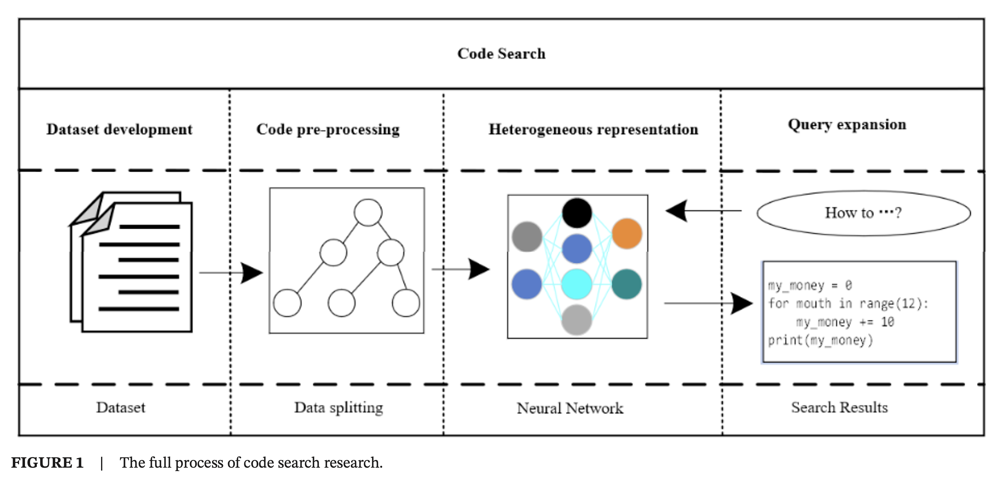
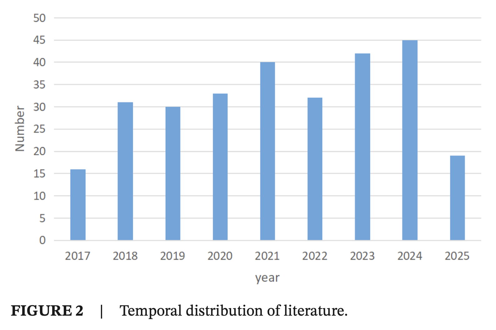
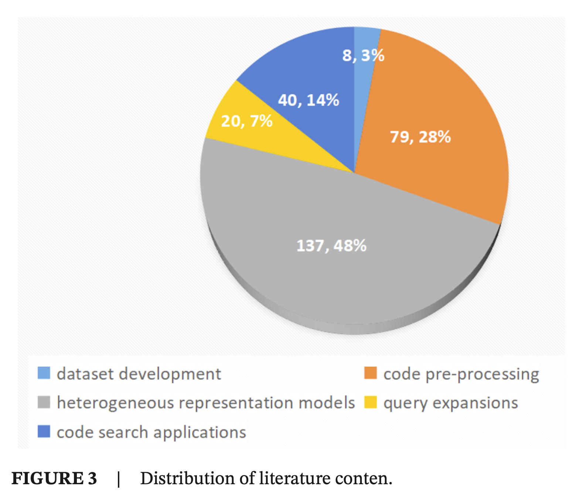
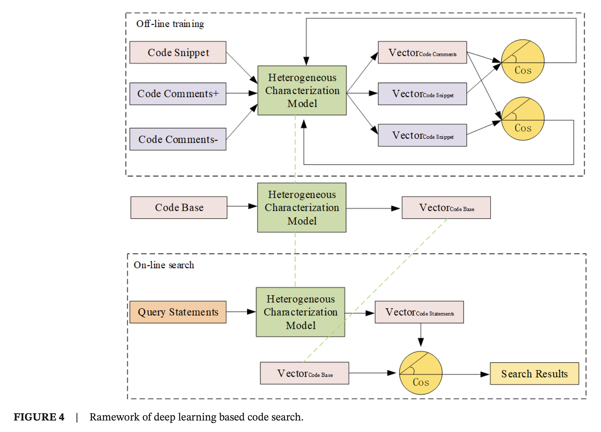
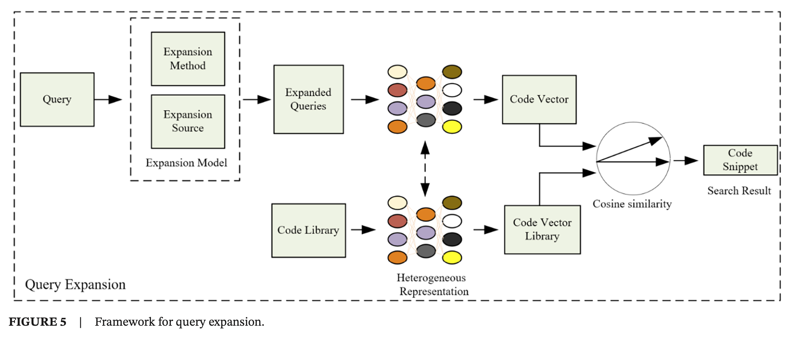
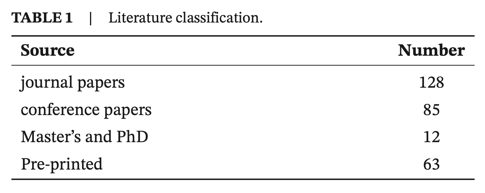

# A Survey of the Full Process of Code Search Based on Deep Learning

> Tinjauan Proses Penuh Pencarian Kode Berbasis Deep Learning

> Mengge Fang, Haize Hu, Feiyu Hu, Jianxun Liu

> Korespondensi: Haize Hu (952259775@qq.com) Diterima: 27 Februari 2025 | Direvisi: 5 Juli 2025 | Disetujui: 16 Agustus 2025

> Pendanaan: Pekerjaan ini didukung oleh Research Capacity Enhancement Program for Young and Middle-Aged Teachers in Guangxi Higher Education Institutions (No. 2025KY0098), National Foundation Cultivation Project at University Level of Guangxi Normal University (No. RZ2400003841), dan Innovation Project of Guangxi Graduate Education (XYCB2025030).

> Kata kunci: pencarian kode, deep learning, ekspansi kueri, model representasi, pengembangan perangkat lunak

## Abstract

Sebagai teknologi krusial untuk meningkatkan efisiensi pengembangan perangkat lunak, penelitian mengenai pencarian kode berbasis deep learning telah muncul sebagai fokus utama saat ini. Tinjauan ini secara sistematis mendekonstruksi seluruh proses pencarian kode menjadi empat tahap inti: konstruksi dataset, pra-pemrosesan kode, konstruksi model representasi heterogen, dan ekspansi kueri, sambil melakukan analisis mendalam tentang status aplikasi dan tantangan teknologi deep learning. Dalam konstruksi dataset, pasangan Q dan A serta pasangan C dan D yang diandalkan oleh model deep learning mengalami kurangnya standardisasi. Sebagai contoh, CodeSearchNet menunjukkan versatilitas lintas bahasa yang tidak memadai, dan CoDesc memiliki penyaringan noise (gangguan) yang tidak lengkap. Selama tahap pra-pemrosesan kode, hambatan seperti pemilihan granularitas AST (Abstract Syntax Tree) dan redundansi informasi urutan membatasi efisiensi ekstraksi fitur. Meskipun pengenalan transformer dan graph neural networks telah mengoptimalkan representasi struktural, mekanisme evaluasi yang terpadu masih belum tersedia. Dalam penelitian model representasi heterogen, sementara LSTM, CNN, dan model pra-pelatihan (seperti CodeBERT) secara efektif mempersempit kesenjangan semantik, akurasi pencarian lintas-domain mereka tidak memadai. Dalam hal ekspansi kueri, metode ekspansi kata kunci dan pelengkapan intensi berbasis deep learning kesulitan untuk menangkap kebutuhan nyata pengguna karena rendahnya akurasi penyelarasan semantik. Tinjauan ini mengusulkan, untuk pertama kalinya, kerangka kerja konstruksi dataset terstandarisasi yang mengintegrasikan data multimodal, mekanisme evaluasi pra-pemrosesan lapisan ganda sintaksis-semantik, model representasi transfer lintas-domain, dan skema ekspansi dinamis intensi yang didorong oleh model bahasa besar (large language model). Kontribusi-kontribusi ini meletakkan landasan teoritis bagi pengembangan sistematis teknologi pencarian kode dan memberikan referensi metodologis lintas-tugas untuk bidang terkait seperti deteksi klon kode.

### Figure 1

### Figure 2

### Figure 3

### Figure 4

### Figure 5

### Table 1

## 1 - Introduction

Pencarian kode (*code search*) telah menjadi aktivitas yang tak terpisahkan dalam pengembangan perangkat lunak. Dengan pesatnya perkembangan Internet, insinyur perangkat lunak berbagi kode sumber di komunitas *open-source*. Hal ini memungkinkan pengembang lain untuk secara efektif menanyakan, mengunduh, mempelajari, dan menggunakan kembali kode tersebut, sehingga memberikan jalan baru bagi penelitian rekayasa perangkat lunak. Menurut temuan [*Code Query Matching*, Hu, 2020], lebih dari 2 miliar baris kode sumber telah terakumulasi di komunitas *open-source* dan repositori kode hingga tahun 2016.

Pencarian kode memungkinkan pengembang untuk memasukkan pernyataan kueri ke mesin pencari (seperti Gambar 1). Mesin pencari mengembalikan kode sumber dari basis data kode yang memenuhi kebutuhan spesifik mereka. Berdasarkan studi oleh [*Intelligent Program Search*, Liu et al, 2018], pengembang menghabiskan sekitar 20% waktu mereka untuk mencari kode. Pencarian kode memfasilitasi pemanfaatan kode sumber yang ada, mengurangi upaya pengembangan, dan meningkatkan efisiensi pengembangan perangkat lunak.

Penelitian awal tentang pencarian kode utamanya memanfaatkan teknik temu kembali informasi (*information retrieval*), yang mencocokkan kode yang ada melalui metode seperti pencocokan kata kunci dan API [*Machine Learning-Based Code Search*, Zhang et al, 2020]. Temu kembali informasi memperlakukan kode sumber hanya sebagai teks, mengabaikan sintaksis kode dan korelasi antar-kata. Untuk mengatasi keterbatasan temu kembali informasi, para peneliti mengusulkan metode pembelajaran mesin (*machine learning*) seperti *support vector machines*, algoritma regresi, dan *random forest* [*Advances in Code Search*, Wei et al, 2021]. Metode-metode ini meningkatkan akurasi pencarian kode, namun penerapannya terbatas pada dataset sampel kecil, dan kurang memiliki kemampuan generalisasi. Oleh karena itu, para peneliti memperkenalkan pembelajaran mendalam (*deep learning*) ke dalam studi pencarian kode, karena jaringan saraf *deep learning* dapat terus belajar dari dataset besar dan mengekstraksi informasi fitur, sehingga memiliki kemampuan generalisasi yang lebih baik.

*Deep learning* menunjukkan keunggulan signifikan ketika diterapkan pada penelitian pencarian kode. Pertama, kode itu sendiri memiliki struktur yang kompleks dan semantik yang kaya, sehingga menyulitkan metode tradisional untuk mengekstraksi fitur inheren secara efektif. Kemampuan ekstraksi fitur yang kuat dari *deep learning* memungkinkannya untuk secara otomatis mempelajari fitur sintaksis dan semantik yang abstrak dan berlapis-lapis dari data kode yang masif, serta menangkap informasi esensial dari kode secara akurat. Kedua, model *deep learning* menunjukkan kemampuan generalisasi yang kuat, beradaptasi dengan kebutuhan pencarian kode di berbagai bahasa pemrograman, gaya pengkodean, dan skenario proyek, serta secara efektif menangani heterogenitas data kode. Selanjutnya, *deep learning* dapat dilatih pada dataset kode skala besar, terus mengoptimalkan parameter model untuk meningkatkan akurasi dan tingkat *recall* pencarian kode, memenuhi kebutuhan praktis pengembang untuk mendapatkan potongan kode (*code snippets*) yang diperlukan dengan cepat dan tepat. Selain itu, karakteristik pembelajaran *end-to-end* dari *deep learning* menyederhanakan proses rekayasa fitur yang kompleks dalam pencarian kode tradisional, mengurangi biaya dan kesulitan desain fitur manual, serta memberikan solusi yang lebih efisien dan cerdas untuk penelitian pencarian kode.

Model *deep learning* saat ini yang digunakan dalam penelitian pencarian kode meliputi *recurrent neural networks* (RNN) dan variannya (seperti *LSTM*, *GRU*, dan *SRU*), *Convolutional neural networks* (CNN), *transformer* (termasuk *CodeBERT*, *CodeGPT*, dll. yang didasarkan padanya), *generative adversarial networks* (GAN), *graph neural networks* (GNN), *BERT*, *GPT*, dll.

1. **Recurrent Neural Networks (RNN) dan Varian:** RNN, melalui koneksi antar neuron lapisan tersembunyi, dapat memproses data kode dengan karakteristik sekuensial, mengingat informasi dari momen sebelumnya untuk memengaruhi perhitungan selanjutnya, menjadikannya sesuai untuk menangani struktur sekuensial kode. Namun, RNN mengalami masalah gradien yang menghilang (*vanishing gradient*) dan meledak (*exploding gradient*), serta kesulitan memproses urutan panjang dengan ketergantungan jarak jauh. Variannya, *long short-term memory* (LSTM) dan *gated recurrent unit* (GRU), secara efektif mengatasi masalah ketergantungan jangka panjang RNN dengan memperkenalkan mekanisme gerbang (*gating mechanisms*).
2. **Convolutional Neural Networks (CNN):** Berdasarkan desain struktural lapisan konvolusi, lapisan *pooling*, dan lapisan yang terhubung penuh (*fully connected layers*), CNN dapat secara otomatis mengekstraksi fitur lokal dari data kode. Melalui operasi penggeseran *kernel* konvolusi pada data kode, CNN menangkap pola sintaksis dan semantik lokal dari kode, diikuti dengan pengurangan dimensi melalui lapisan *pooling* untuk mengurangi komputasi dan mencegah *overfitting*.
3. **Transformer:** Arsitektur *encoder-decoder* dari *Transformer* digunakan dalam pencarian kode untuk memetakan kode dan kueri ke dalam ruang semantik yang sama, mencapai pencocokan semantik antara kode dan kueri. Selain itu, *Transformer* mendukung komputasi paralel, memastikan efisiensi pelatihan yang tinggi, dan menggunakan paradigma pra-pelatihan dan penyesuaian halus (*pretraining-fine-tuning*).
4. **Generative Adversarial Networks (GAN):** GAN terdiri dari generator dan diskriminator, yang melatih secara berlawanan (*adversarial*) dan kolaboratif. Dalam skenario pencarian kode, generator mencoba menghasilkan potongan kode yang terkait dengan kueri, sementara diskriminator menilai kesamaan antara potongan yang dihasilkan dan kode nyata. Melalui pelatihan *adversarial* ini, generator terus mengoptimalkan kualitas kode yang dihasilkan untuk memenuhi kebutuhan praktis dengan lebih baik, membantu proses pencarian kode.
5. **Graph Neural Networks (GNN):** Kode dapat diabstraksikan menjadi struktur graf seperti graf aliran kontrol (*control flow graphs*) dan graf aliran data (*data flow graphs*), yang dapat diproses oleh GNN. GNN memperbarui fitur simpul (*node*) mereka sendiri dengan mengagregasi informasi dari simpul tetangga melalui mekanisme penyampaian pesan (*message-passing*), sehingga mempelajari informasi struktural dan semantik dalam graf kode.
6. **Bidirectional Encoder Representations from Transformers (BERT):** BERT adalah model bahasa pra-pelatihan berbasis *transformer*, yang secara unik mengadopsi *encoder transformer* dua arah (*bidirectional*) untuk mempertimbangkan konteks maju dan mundur dari urutan input, memungkinkan pemahaman semantik yang lebih komprehensif dan mendalam dibandingkan dengan model satu arah (*unidirectional*).
7. **Generative Pretrained Transformer (GPT):** GPT juga dibangun di atas arsitektur *transformer*, menggunakan *encoder transformer* satu arah. Melalui pra-pelatihan pada data teks skala besar, model ini mempelajari pengetahuan dan pola linguistik yang kaya.

Sintesis penelitian yang ada tentang penerapan *deep learning* pada pencarian kode mengungkapkan bahwa empat area studi utama terlibat dalam penelitian pencarian kode, sebagaimana diilustrasikan pada Gambar 1. Area-area ini adalah konstruksi dataset, pra-pemrosesan data, representasi heterogen, dan ekspansi kueri. Pertama, pengembangan dataset adalah persyaratan mendasar untuk penelitian model pencarian kode, karena model *deep learning* bergantung pada dataset besar untuk mempelajari parameter jaringan saraf [*Neural Code Search Dataset*, Li et al, 2019]. Konsekuensinya, konstruksi dataset sangat penting bagi keberhasilan penelitian pencarian kode. Kedua, pra-pemrosesan kode diperlukan karena kompleksitas bahasa kode, yang berbeda dari bahasa alami dan mencakup fitur logika yang rumit seperti struktur perulangan, struktur penilaian, dan struktur panggilan. Fitur-fitur ini tidak dapat direpresentasikan sepenuhnya menggunakan metode traversal tradisional, dan pemisahan data diperlukan untuk mengekstraksi fitur gramatikal secara akurat selama pembelajaran jaringan saraf.

Pendekatan ini memungkinkan karakterisasi fitur bahasa kode yang tepat, yang pada gilirannya meningkatkan akurasi pembelajaran jaringan saraf dan hasil pencarian kode selanjutnya. Ketiga, karakterisasi heterogen adalah fokus signifikan dari penelitian pencarian kode karena sifat tingkat tinggi dari bahasa kode dan sifat tingkat rendah dari bahasa alami, yang menghasilkan kesenjangan semantik yang signifikan. Mengatasi kesenjangan ini dan menormalkan kedua jenis informasi heterogen tersebut sangat penting bagi keberhasilan penelitian pencarian kode. Terakhir, ekstensi kueri (*query expansion*) diperlukan untuk meningkatkan akurasi hasil pencarian kode. Selama fase pelatihan penelitian model pencarian kode, deskripsi kode dan fragmen kode digunakan untuk pelatihan gabungan. Namun, pada fase pencarian, pernyataan kueri digunakan sebagai pengganti deskripsi kode untuk pencocokan pencarian. Karena deskripsi kode biasanya panjang sementara pernyataan kueri pendek, pernyataan kueri mungkin tidak sepenuhnya mengarakterisasi deskripsi kode. Oleh karena itu, mempelajari ekstensi pernyataan kueri (ekspansi kueri) sangat penting untuk meningkatkan akurasi hasil pencarian kode.

Namun, literatur yang disebutkan di atas tentang metode pencarian kode terutama didasarkan pada analisis model representasi. Akibatnya, terdapat kelangkaan makalah yang menganalisis dan merangkum penelitian tentang proses penuh tersebut. Misalnya, [*Intelligent Program Search*, Liu et al, 2018] mendeskripsikan pencarian dan konstruksi program cerdas serta menguraikan berbagai aspek seperti pencarian kode, sintesis program, rekomendasi dan pelengkapan kode, deteksi cacat, perbaikan gaya kode, dan perbaikan program otomatis. Pencarian kode dibagi menjadi tiga aspek: pencarian granularitas fragmen kode, pencarian granularitas modul kode, dan pencarian granularitas file kode, dan penelitian tentang pencarian kode dirangkum dari ketiga perspektif ini. [*Machine Learning-Based Code Search*, Zhang et al, 2020] merangkum penerapan pencarian kode berdasarkan metode pembelajaran mesin tradisional, dan menganalisis literatur dari tiga aspek, yaitu masing-masing metode penyematan berbasis urutan, penyematan graf, dan penyortiran kode. [*Advances in Code Search*, Wei et al, 2021] melakukan analisis penelitian tentang status penelitian pencarian kode saat ini, masing-masing dengan pengembangan metode penelitian pencarian kode dalam literatur.

Secara ringkas, dalam penelitian pencarian kode saat ini, meskipun berbagai model *deep learning* telah digunakan secara luas, literatur yang ada sebagian besar berfokus pada penelitian model itu sendiri atau satu mata rantai tunggal. Penelitian mengenai ringkasan dan analisis sistematis dari proses lengkap pencarian kode, mulai dari konstruksi dataset, pra-pemrosesan data, konstruksi model representasi heterogen hingga ekspansi kueri, relatif langka. Tinjauan ini menyisir seluruh proses pencarian kode secara sistematis untuk pertama kalinya, dan mendekonstruksinya menjadi empat tahap inti: konstruksi dataset, pra-pemrosesan kode, konstruksi model representasi, dan ekspansi kueri. Dengan menganalisis secara mendalam status penelitian dari setiap tahap, makalah ini mengungkapkan masalah saat ini seperti kurangnya standardisasi dataset, ketidakcukupan mekanisme evaluasi pra-pemrosesan, akurasi terbatas pencarian lintas domain, dan penangkapan intensi kueri yang tidak memadai. Atas dasar ini, arah penelitian masa depan diusulkan dari empat dimensi: konstruksi dataset terstandarisasi, evaluasi metode pra-pemrosesan yang efisien, desain model lintas domain presisi tinggi, dan representasi cerdas dari intensi pengguna. Selain itu, metode penelitian pencarian kode diperluas ke bidang terkait seperti deteksi klon kode dan sintesis program, memberikan referensi metodologis lintas tugas untuk penelitian *big data* kode dan meletakkan dasar teoritis untuk pengembangan sistematis teknologi pencarian kode.

Untuk mengatasi keterbatasan literatur yang ada tentang ringkasan pencarian kode, kami melakukan analisis dan ringkasan literatur berdasarkan seluruh proses yang terlibat dalam penelitian pencarian kode. Ini mencakup konstruksi dataset, pra-pemrosesan kode, model representasi heterogen, dan ekspansi kueri. Pertama, kami menganalisis dan merangkum literatur yang ada pada empat bagian proses pencarian kode. Secara khusus, kami merangkum dataset yang digunakan dalam studi pencarian kode yang ada, menganalisis metode konstruksi dan sumber data dari berbagai konstruksi dataset, dan merangkum pra-pemrosesan kode sumber dalam studi pencarian kode yang ada, memperkenalkan prinsip-prinsip dari tiga metode pra-pemrosesan: pra-pemrosesan *AST*, pra-pemrosesan urutan, dan pra-pemrosesan graf. Kami juga memberikan ringkasan penelitian pencarian kode yang ada tentang model representasi heterogen, memperkenalkan prinsip-prinsip model pembelajaran mesin tradisional dan model *deep learning* untuk tugas pencarian kode, serta menganalisis bagaimana model-model ini mengurangi kesenjangan semantik antara bahasa alami dan bahasa kode. Terakhir, kami merangkum penelitian pencarian kode yang ada tentang ekstensi kueri, menganalisis berbagai metode dan model ekstensi kueri baik dari segi metode ekstensi maupun sumber ekstensi. Dengan menganalisis dan merangkum literatur tentang keseluruhan proses penelitian pencarian kode, kami bertujuan untuk memberikan pemahaman yang lebih spesifik, mendalam, dan komprehensif tentang penelitian pencarian kode bagi para pemula. Kedua, kami merangkum aplikasi penelitian pencarian kode dalam penelitian *big data* kode lainnya, khususnya aplikasi penelitian sintesis kode, aplikasi penelitian pelengkapan kode, dan aplikasi penelitian gaya kode. Akhirnya, berdasarkan analisis dan ringkasan literatur yang ada tentang seluruh proses penelitian pencarian kode, kami menganalisis masalah dan kekurangan dari empat bagian tersebut: penelitian konstruksi dataset, penelitian pra-pemrosesan kode, penelitian model representasi heterogen, dan penelitian ekstensi kueri. Kami mengusulkan kemungkinan arah penelitian untuk keempat bagian ini di masa depan, memberikan arah penelitian bagi para peneliti pencarian kode.

Sisa makalah ini disusun sebagai berikut: Bagian 2 menyajikan gambaran umum tentang distribusi literatur yang dipelajari. Pada Bagian 3, kami memberikan definisi pencarian kode dan membahas metrik evaluasi yang digunakan. Pada Bagian 4, kami menganalisis dan merangkum studi tentang konstruksi dataset pencarian kode. Bagian 5 memberikan analisis dan ringkasan studi tentang pra-pemrosesan pencarian kode, termasuk pra-pemrosesan berbasis *AST*, berbasis urutan, dan berbasis graf. Pada Bagian 6, kami menganalisis dan merangkum penelitian tentang model representasi heterogen untuk pencarian kode, termasuk model berbasis pembelajaran mesin tradisional dan berbasis *deep learning*. Pada Bagian 7, kami menganalisis dan merangkum penelitian tentang ekstensi kueri untuk pencarian kode, termasuk studi tentang metode ekstensi dan sumber ekstensi. Pada Bagian 8, kami menganalisis dan merangkum penelitian terapan tentang pencarian kode, termasuk sintesis program, pelengkapan kode, dan gaya kode. Pada Bagian 9, kami membahas tantangan dan masalah dalam studi seluruh proses pencarian kode. Akhirnya, pada Bagian 10, kami memberikan ringkasan dari keseluruhan pekerjaan.

## 2 - Literature Statistics

Untuk mengatasi keterbatasan studi pencarian kode berbasis deep learning yang ada serta ringkasan kemajuannya, kami melakukan tinjauan sistematis terhadap keseluruhan proses pencarian kode. Pertama, kami mengidentifikasi kata kunci pencarian kode sebagai istilah pencarian utama, di samping kata kunci pendukung seperti pra-pemrosesan kode, data kode, dan ekspansi kueri untuk menelusuri generasi hasil pencarian kode berbasis deep learning yang ada. Setelah kata kunci diidentifikasi, kami kemudian mengidentifikasi enam basis data hasil utama, yaitu IEEE Xplore Digital Library, ACM Digital Library, Science Direct Digital Library, Springer Link Digital Library, dan Wiley Online Library. Berdasarkan basis data hasil yang disebutkan di atas, kami menggunakan metode penyaringan manual untuk memilih hasil literatur. Kami memilih hasil literatur berdasarkan konten abstrak literatur dan mengumpulkan literatur yang relevan. Dengan metode ini, kami tidak hanya mengidentifikasi semua literatur yang terkait dengan topik tersebut tetapi juga mengklasifikasikan literatur menurut proses lengkap pencarian kode.

Dengan mempertimbangkan aspek ketepatan waktu literatur, literatur yang dipilih untuk studi ini terutama berasal dari periode antara 2017 dan 2025, dengan fokus pada studi yang dilakukan selama enam tahun terakhir. Distribusi studi literatur diilustrasikan pada Gambar 2, yang terdiri dari total 288 studi literatur, dengan 16 dilakukan pada tahun 2017, 31 pada tahun 2018, 30 pada tahun 2019, 33 pada tahun 2020, 40 pada tahun 2021, 32 pada tahun 2022, 42 pada tahun 2023, 45 pada tahun 2024, dan 19 pada tahun 2025. Jumlah distribusi literatur menunjukkan bahwa pencarian kode telah menjadi area fokus yang signifikan bagi para peneliti pengembangan perangkat lunak.

Berdasarkan distribusi konten penelitian dalam literatur, terbukti bahwa model representasi heterogen telah menjadi yang paling banyak dipelajari dalam pencarian kode, diikuti oleh pra-pemrosesan kode. Sebaliknya, konstruksi dataset telah menjadi area fokus yang paling sedikit dipelajari (seperti Gambar 3).

Untuk menganalisis lebih lanjut literatur saat ini tentang pencarian kode, kami melakukan analisis dan ringkasan sumber-sumber studi literatur. Ke-288 publikasi ini telah dikategorikan berdasarkan status publikasinya ke dalam berbagai kategori seperti makalah jurnal, makalah konferensi, Magister dan Doktoral, serta pracetak (preprints). Dari jumlah tersebut, 128 publikasi termasuk dalam makalah jurnal, yang juga mencakup satu buku; 85 publikasi termasuk dalam makalah konferensi; 12 publikasi termasuk dalam Magister dan Doktoral; dan 63 publikasi termasuk dalam makalah pracetak. Untuk informasi rinci tentang distribusi publikasi, silakan merujuk ke Tabel 1.

Untuk menganalisis lebih lanjut lanskap literatur di bidang pencarian kode, kami melakukan analisis dan ringkasan sumber publikasi literatur. Ke-288 karya literatur dikategorikan ke dalam berbagai jenis berdasarkan status publikasinya, termasuk makalah jurnal, makalah konferensi, tesis master dan doktoral, serta pracetak. Secara khusus, terdapat 128 makalah jurnal (termasuk 1 buku), 85 makalah konferensi, 12 tesis master dan doktoral, dan 63 pracetak. Literatur jurnal mencakup jurnal-jurnal tingkat atas seperti ACM Computing Surveys, IEEE Transactions on Software Engineering, IEEE Transactions on Pattern Analysis and Machine Intelligence, Pattern Recognition, IEEE Transactions on Big Data, Journal of Systems and Software, Empirical Software Engineering, Information and Software Technology, dan ACM Transactions on Software Engineering and Methodology. Literatur konferensi mencakup prosiding konferensi-konferensi utama, termasuk Proceedings of the 40th International Conference on Software Engineering, Proceedings of the 37th IEEE/ACM International Conference on Automated Software Engineering, IEEE 25th International Conference on Software Analysis, Evolution and Reengineering (SANER), ESEC/FSE’2019: Proceedings of the 2019 27th ACM Joint Meeting on European Software Engineering Conference and Symposium on the Foundations of Software Engineering, Proceedings of the 2020 IEEE 27th International Conference on Software Analysis, Evolution, and Reengineering, Proceedings of International Conference on Software Maintenance and Evolution, Proceedings of the Sixteenth ACM International Conference on Web Search and Data Mining, dan lain-lain.

## 3 - Overview of Code Search

## 3.1 - Definition of Code Search

Tujuan utama dari model pencarian kode adalah untuk memitigasi kesenjangan semantik antara bahasa alami (natural languages) tingkat tinggi dan bahasa pemrograman tingkat rendah. Untuk mencapai hal ini, model pencarian kode bergantung pada pelatihan model representasi kode pada dataset yang besar. Oleh karena itu, pengembangan dataset merupakan bagian integral dari penelitian pencarian kode. Setelah dilatih, model representasi tersebut dapat mengevaluasi kesamaan dan peringkat prioritas antara pernyataan kueri masukan dan kode sumber untuk menghasilkan hasil pencarian yang sesuai. Untuk mengimplementasikan kueri daring (online) bagi pencarian kode, model perlu mampu menangani bahasa alami dan bahasa pemrograman secara bersamaan, yang menimbulkan tantangan signifikan akibat heterogenitas antara kedua bahasa tersebut.

Gambar 4 mengilustrasikan kerangka kerja pencarian kode berbasis deep learning [Deep Code Search, Gu et al, 2018]. Pencarian kode dapat dibagi menjadi dua komponen utama: pelatihan luring (offline) dan pencarian daring (online) [Code Query Matching, Hu, 2020]. Tujuan utama dari komponen pelatihan luring adalah untuk mengembangkan model representasi heterogen dengan melatihnya pada dataset besar dan untuk mendeskripsikan seluruh kode sumber dalam basis data menggunakan model representasi tersebut. Pada fase pelatihan luring, terdapat pemetaan satu-ke-satu antara kueri dan kode sumber. Banyak manuskrip penelitian memanfaatkan anotasi yang menyertai kode sumber sebagai bahasa kueri, dan menggunakan pembelajaran terawasi (supervised learning) untuk melatih model representasi [Deep Code Search, Gu et al, 2018]. Proses pelatihan ini menghasilkan tingkat kesamaan yang tinggi antara representasi teks dan representasi kode sumber, yang pada akhirnya mengarah pada perolehan parameter model representasi. Selanjutnya, seluruh fragmen kode sumber dalam dataset divektorisasi menggunakan model representasi tersebut. Oleh karena itu, akurasi model representasi berdampak langsung pada kinerja dataset, menjadikan pengembangan dataset sebagai aspek penelitian yang krusial dalam pencarian kode.

Pada fase pencarian daring, pengembang memasukkan bahasa kueri dan memvektorisasinya menggunakan model representasi yang telah dilatih sebelumnya. Kemudian, pengukuran kesamaan kosinus (cosine similarity) digunakan untuk menghitung kesamaan antara vektor representasi bahasa kueri dan vektor representasi kode sumber dalam basis kode (codebase) serta memperoleh hasil pemeringkatan. Pada tahap pencarian daring, bahasa kueri dimasukkan ke dalam model representasi, dan kesamaan antara representasi bahasa kueri dan representasi kode sumber dalam basis kode dihitung. Akhirnya, pemeringkatan dihitung berdasarkan kesamaan tersebut, dan kode sumber yang cocok dikembalikan sebagai keluaran. Setelah melakukan pencarian, pencari membuat pilihan berdasarkan hasil yang diperoleh dan memilih potongan kode (code snippet) yang paling sesuai dengan kebutuhan mereka. Berdasarkan hasil pencarian tersebut, pengembang kemudian dapat memodifikasi dan menggunakan kembali potongan kode yang dipilih untuk mengurangi waktu pengembangan perangkat lunak dan meningkatkan efisiensi pengembangan perangkat lunak secara keseluruhan.

## 3.2 - Evaluation Metrics

Untuk mengevaluasi efektivitas metode penelitian pencarian kode yang ada, peneliti terutama menggunakan empat metrik evaluasi, yaitu MRR, precision, recall, dan NDCG.

$$MRR=\frac{\sum_{q\in Q}\frac{1}{Rank(\epsilon_{q}|q)}}{|Q|} \quad (1)$$

di mana $q$ mewakili pernyataan kueri, $Q$ mewakili semua pernyataan kueri yang akan diuji, dan $C_{q}$ mewakili fragmen kode yang sesuai dengan pernyataan kueri tersebut.

(2) Precision [Deep Code Search, Gu et al, 2018] 

Precision@k adalah rasio himpunan hasil keluaran terhadap total $k$, di mana hasil keluaran yang benar diperhitungkan dalam hasil $k$. Semakin besar proporsi hasil yang benar dalam keluaran, semakin baik metode pencarian tersebut, dan begitu pula sebaliknya.

$$precision@k = \frac{Tr@k}{Tr@k+Fa@k} \quad (2)$$

di mana $Tr@k$ dan $Ta@k$ masing-masing adalah urutan hasil yang benar dan urutan hasil yang salah.

(3) Recall [Deep Code Search, Gu et al, 2018] 

Recall adalah posisi indeks yang sesuai dengan hasil terbaik dalam hasil keluaran kueri deteksi. Semakin awal hasil indeks tersebut, semakin efisien modelnya. Recall@k digunakan sebagai metrik, di mana nilai $k$ adalah 1, 5, dan 10; ini dihitung sebagai berikut.

$$Recall@k=\frac{\sum_{j=1}^{|Q|}\varepsilon}{|Q|} \quad (3)$$

(4) NDCG [Neural Code Search Evaluation Dataset, Li et al, 2019] 
NDCG diukur berdasarkan pencarian dan dapat mengarakterisasi relevansi fragmen kode pencarian dan pernyataan kueri. Ini dihitung sebagai:

$$NDCG = \frac{1}{|Q|}\sum_{j=1}^{k}\frac{2^{r_j}-1}{log_2(1+j)} \quad (4)$$

di mana $r_{j}$ adalah relevansi posisi $j$ dalam recall; semakin besar nilai NDCG, hasil pencarian tidak hanya merepresentasikan kualitas yang tinggi tetapi juga peringkat yang lebih tinggi.

## 4 - Data Construction

Pengembangan dataset merupakan tugas mendasar dalam penelitian pencarian kode (code search). Hal ini berdampak langsung pada efektivitas pelatihan model representasi heterogen. Dengan demikian, penelitian ekstensif telah dilakukan pada konstruksi dataset. Jenis dataset yang dominan digunakan dalam penelitian adalah pasangan Q dan A (Questions and Answers), pasangan C dan D (Code and Description), dan pasangan A dan D (API and Description), serta penyempurnaan dari ketiga jenis tersebut.

Pasangan Q dan A melibatkan seorang peneliti yang memposting kueri di Stack Overflow untuk kode sumber yang mereka butuhkan, dengan peneliti lain memberikan tanggapan terhadap kueri tersebut. Dalam studi pencarian kode, peneliti memanfaatkan Pertanyaan dan Jawaban yang tersedia di Stack Overflow sebagai informasi tekstual dan kode sumber untuk studi pencarian kode. Sebagai contoh, [Neural Code Search Evaluation Dataset, Hong Y L et al, 2019] menggunakan nama metode secara keseluruhan untuk mencari melalui 24.549 repositori GitHub, mencari total 4.716.814 nama metode. Selain itu, 287 pasangan Q dan A yang terdiri dari data Stack Overflow dicari di Stack Overflow. Untuk mengevaluasi efektivitas dataset, artikel tersebut melatih dan menguji dataset berdasarkan 2 model tolok ukur (benchmark), NCS dan UNIF, serta memverifikasi efektivitas dataset pencarian kode yang dibangun.

Tipe data C dan D merujuk pada pembagian kode sumber yang dikembangkan oleh pengembang kode di komunitas open-source atau repositori kode open-source, seperti GitHub dan Stack Overflow. Selain potongan kode (code snippets), jenis data ini juga mencakup deskripsi tekstual yang memberikan wawasan tentang fungsionalitas potongan kode tersebut. Untuk studi pencarian kode, peneliti memanfaatkan Deskripsi dan Kode yang tersedia di GitHub sebagai informasi tekstual dan kode sumber untuk membangun dataset guna analisis. Sebagai contoh, [CodeSearchNet Challenge, Hamel et al, 2019] mengusulkan korpus CodeSearchNet yang berisi enam bahasa pemrograman utama (Go, Java, JavaScript, PHP, Python, dan Ruby) yang saat ini tersedia di perpustakaan open-source, dengan sekitar 6 juta fungsi dalam dataset tersebut. Juga termasuk dalam korpus CodeSearchNet adalah 2 juta fungsi, yang diperoleh dengan mencari dan melakukan pra-pemrosesan terhadapnya. Untuk mengevaluasi dataset yang dibangun, artikel tersebut menggunakan model dasar (baseline) seperti bag of words, RNN, CNN, dan model atensi (attention model) untuk pelatihan dan pengujian, serta memverifikasi efektivitas dataset pencarian kode yang dibangun.

[CoDesc, Masum et al, 2021] mengusulkan dataset CoDesc, yang utamanya menargetkan kode sumber bahasa Java dan berisi total 4,2 juta fragmen kode serta anotasi dalam bahasa alami. Untuk mengoptimalkan dataset C dan D, para peneliti melakukan pra-pemrosesan pada Kode di C dan D serta mengekstraksi fitur API, Methodname, dan token dari fragmen kode guna meningkatkan akurasi representasi kode. Hal ini melibatkan penyempurnaan kode dari tiga perspektif berbeda untuk menghasilkan set fitur yang lebih informatif dan efektif. Sebagai contoh, [Deep Code Search, Gu et al, 2018] memperkenalkan deep learning pada studi pencarian kode untuk pertama kalinya dan menggunakan teknologi perayap (crawler) untuk membangun dataset pencarian kode. Dataset tersebut merayapi potongan kode Java di GitHub dari tahun 2008 hingga 2016, dengan total 18.233.872 potongan kode yang berisi komentar kode.

Tipe data A dan D mencakup sumber daya kode sumber yang tersedia di komunitas open-source atau perpustakaan kode open-source, seperti GitHub dan Stack Overflow. Jenis data ini mencakup potongan kode fungsi fungsional (API), serta teks deskriptif yang menguraikan fungsionalitas fungsi tersebut. Dalam studi pencarian kode, peneliti memanfaatkan Deskripsi dan API yang ada sebagai informasi tekstual dan kode sumber untuk membangun dataset guna analisis. Sebagai contoh, [Generating Code With the Help of Retrieved Template Functions, Drain et al, 2021] membuat dataset Stack Overflow-Function Alignment baru, yang terdiri dari 150.000 fungsi dan pasangan deskripsi-fragmen Stack Overflow yang berguna untuk menulis fungsi terkait, di mana 17.000 di antaranya dikurasi secara manual.

Secara bersamaan, beberapa peneliti telah melakukan studi optimasi pada dataset yang disebutkan di atas untuk meningkatkan integritas fitur, mengurangi noise (gangguan), dan meningkatkan efisiensi dataset. Tujuannya adalah untuk menyempurnakan dataset dengan menerapkan teknik yang meningkatkan kualitas data dan meningkatkan akurasi hasil yang diperoleh dari analisis data. Sebagai contoh, [Adaptive Deep Code Search, Chun et al, 2020] merayapi 77.920 pasangan dokumen-kode (ditetapkan sebagai sampel positif) di GitHub dengan menghasilkan 20 sampel negatif untuk setiap pasangan dokumen-kode. Data yang dirayapi dengan demikian berisi total 1.558.400 pasangan dokumen-kode. Selain itu, untuk menguji dan menganalisis model yang diusulkan, makalah tersebut menggunakan dataset generik Apache Lucene, Apache POI, dan JFreeChart. [On the Importance of Building High-Quality Training Datasets, Sun et al, 2022] memperoleh temuan melalui studi mereka bahwa dalam mereproduksi dataset dari semua studi pencarian kode, lebih dari sepertiga kueri mengandung noise, yang membuatnya menyimpang dari kueri pengguna alami. Sebuah kerangka kerja pembersihan data yang terdiri dari dua filter berurutan diusulkan: filter sintaksis berbasis aturan dan filter semantik berbasis model. Ini adalah aplikasi pertama pembersihan kueri semantik pada dataset pencarian kode. [Exploring Representation-Level Augmentation, Li et al, 2022] mengusulkan tiga metode penyempurnaan baru untuk mengatasi kekurangan penyempurnaan dataset saat ini. Kemudian, mereka mengusulkan tiga metode penyempurnaan baru (ekstrapolasi linier, interpolasi biner, dan penskalaan Gaussian) berdasarkan format umum ini.

Saat ini, penelitian pencarian kode telah membuat kemajuan signifikan dalam konstruksi data, membentuk berbagai jenis dataset seperti pasangan pertanyaan-jawaban, pasangan deskripsi-kode, pasangan deskripsi-API, dan jenis yang ditingkatkan. Para peneliti telah membangun dataset tipikal seperti CodeSearchNet (korpus multibahasa yang berisi 6 juta fungsi) dan CoDesc (4,2 juta pasangan potongan kode-anotasi Java) dengan merayapi data dari komunitas open-source seperti GitHub dan Stack Overflow, serta memverifikasi efektivitasnya dengan menggabungkan model tolok ukur seperti NCS dan UNIF. Untuk meningkatkan kualitas data, komunitas akademik telah mengadopsi langkah-langkah optimasi seperti pembersihan data (misalnya, kerangka kerja penyaringan lapisan ganda sintaksis-semantik Sun et al.), ekspansi sampel (misalnya, Chun et al. menghasilkan sampel negatif 20 kali lipat), dan ekstraksi fitur (mengekstraksi API, nama metode, dll., dari kode). Namun, masih terdapat keterbatasan: beberapa dataset memiliki penyaringan noise yang tidak lengkap (lebih dari sepertiga kueri mengandung noise), dataset lintas bahasa (seperti kode multimodal) dan lintas domain memiliki versatilitas yang lemah, dan konstruksi dataset khusus untuk skenario pemrograman yang kompleks (seperti pengembangan edge dan smart contracts) masih perlu diperkuat.

## 5 - Code Preprocessing

Jika kode sumber disematkan secara langsung dalam bentuk teks, hal tersebut mungkin tidak secara akurat mencerminkan karakteristik bahasa pemrograman. Oleh karena itu, kode sumber perlu dipra-pemrosesan sebelum penyematan (embedding). Pra-pemrosesan kode melibatkan penggunaan metode penguraian (parsing) yang tepat untuk mengekstraksi informasi fitur dari kode sumber dan mengurangi dampak noise (gangguan), yang menghasilkan ekstraksi fitur yang lebih akurat. Proses ini sangat penting untuk meningkatkan akurasi representasi fitur. Literatur terkini mengenai pra-pemrosesan kode sumber dalam enam tahun terakhir terutama berfokus pada tiga metode: Abstract Syntax Tree (AST), urutan kode (code sequence), dan diagram struktur kode (code structure diagram).

## 5.1 - AST-Based Preprocessing

Abstract Syntax Tree (AST) adalah struktur pohon yang merepresentasikan struktur abstrak dari kode sumber [Optimization of Source Code Search, Li et al, 2018]. Struktur pohon tersebut terdiri dari simpul (nodes) dan garis penghubung di antara mereka. Setiap simpul dalam pohon mewakili suatu struktur dalam kode sumber, dan garis penghubung mewakili hubungan antar struktur tersebut. Konstruksi AST tidak bergantung pada aturan sintaksis dari objek yang diurai, namun memiliki tata bahasa parsing sintaksisnya sendiri [CodEX, Meng et al, 2018]. Namun, selama proses parsing, AST dapat memunculkan komponen redundan ke dalam proses tersebut, seperti eliminasi rekursi kiri dan penelusuran balik (backtracking). Komponen-komponen redundan ini dapat menghasilkan noise dalam penguraian selanjutnya dan memengaruhi akurasi hasil. AST adalah representasi abstrak yang independen terhadap sintaksis dari struktur pohon kode sumber, dan dengan demikian, telah digunakan secara luas dalam berbagai bidang penelitian, seperti pencarian kode, karakterisasi kode, kloning kode, dan banyak lagi. Dalam hal ini, analisis literatur disajikan di bawah ini, yang berfokus pada penerapan AST dalam penelitian pencarian kode.

Dalam studi awal pencarian kode, AST tradisional digunakan oleh para peneliti untuk mengurai kode sumber guna meningkatkan keterwakilan fiturnya. Sebagai contoh, [Optimization of Source Code Search, Li et al, 2018] menggunakan AST untuk mengurai kode sumber menjadi pohon sintaksis guna memperoleh struktur pohon kode sumber. Dengan menelusuri struktur pohon kode sumber, anotasi kelas dan anotasi metode untuk pelatihan model selanjutnya diperoleh. [CodEX, Meng et al, 2018] menggunakan AST untuk mengurai kode sumber dan dikombinasikan dengan penyebaran simpul serta perhitungan kesamaan untuk mengekstraksi dan mengarakterisasi fitur kode sumber. [Semantic Code Search Using Code2Vec, Arumugam, 2020] menggunakan AST untuk mengurai dataset kode sumber menjadi potongan kode dan teks kode. Sementara itu, terdapat juga studi tentang parsing kode AST tradisional oleh [An Intelligent Code Search Approach, Meng, 2021], [An Intelligent Code Search Approach, Taskaya et al, 2021], [Semantic Code Search for Smart Contracts, Shi, 2021], [Search for Compatible Source Code, Cai, 2021], [DeSkew-LSH Based Code-To-Code Recommendation, Silavong, 2021], [Syntactic Code Search With Sequence-To-Tree Matching, Matute, 2024], dan [Enhancing Code Search Intent, Dong, 2025]. Seiring dengan kemajuan penelitian tentang pencarian kode, para peneliti menemukan bahwa model pra-pemrosesan AST tradisional memiliki kekurangan tertentu dalam komposisi penguraian kode.

Para peneliti telah berfokus pada pengoptimalan model parsing pra-pemrosesan kode AST dari dua perspektif utama. Pertama, mereka telah mengeksplorasi studi optimasi pada ekstraksi informasi struktural dari AST. Sebagai contoh, [RECODE, Hayati et al, 2021] meneliti dari perspektif optimasi pemotongan sub-pohon AST dan mengusulkan model RECODE sebagai respons terhadap kurangnya kemampuan AST tradisional untuk mengurai struktur yang besar dan kompleks untuk pencarian kode. Model ini pertama-tama menggunakan AST untuk mengurai keseluruhan pohon sintaksis dari kode sumber, dan kedua menggunakan n-gram dalam model penyematan word2vec untuk melakukan pemotongan sub-pohon AST guna mengatasi kekurangan parsing AST. Untuk mengurangi noise dalam model parsing AST, beberapa peneliti telah mempelajari model tersebut dari perspektif pohon sintaksis sederhana. Sebagai contoh, [Search for Compatible Source Code, Luan et al, 2019] dan [Multimodal Representation, Gu et al, 2021] mengusulkan pohon parsing sederhana sebagai respons terhadap kemampuan terbatas AST tradisional dalam mengonstruksi kata kunci dan non-kata kunci. Ada juga studi di mana bagian informasi tertentu dalam struktur AST ditargetkan untuk peningkatan, seperti [Capturing Source Code Semantics, Chen et al, 2019] yang menggunakan AST untuk menandai kode sumber dengan urutan kode gabungan dan untuk meningkatkan informasi simpul API dalam AST. Untuk mengekstraksi fitur informasi kode sumber, para peneliti menggunakan jaringan konvolusional yang memanfaatkan struktur pohon AST.

Untuk meningkatkan efektivitas pra-pemrosesan kode, para peneliti telah berfokus pada pengoptimalan korelasi antara ekstraksi fitur AST dan informasi lainnya. Selain itu, untuk memverifikasi efektivitas model pencarian kode, model tersebut diterapkan pada studi terapan kloning kode. Sebagai contoh, terkait korelasi antara parsing kode AST dan kode sumber, [Yogo, Premtoon, 2019] mengusulkan alat pencarian Yogo ("You Only Grep Once"). Alat pencarian ini menghasilkan hasil pencarian sambil mempertimbangkan korelasi antara masukan pengguna dan simpul AST kode sumber sebagai informasi masukan untuk pencarian lebih lanjut. [A Multi-Perspective Architecture, Haldar et al, 2020] pertama-tama menggunakan AST untuk parsing kode sumber, sambil menggunakan Structure Traversal (SBT) untuk pemrosesan string AST kode sumber. Dan informasi fitur diekstraksi dari token kode sumber dan AST yang sesuai untuk pencarian kode. [NJACS, Hu et al, 2020] menggunakan AST untuk mengurai kode sumber dan menggunakan token struktur seragam untuk menggantikan struktur dan teks dalam kode sumber. Artikel tersebut mengusulkan jaringan saraf atensi dua arah (bidirectional attention neural network) NJACS berdasarkan parsing AST. NJACS melakukan penyematan gabungan informasi struktur kode potensial dan bahasa kueri alami untuk mengurangi kesenjangan semantik antara bahasa kode dan bahasa alami. [InferCode, Bui et al, 2021] menggunakan pra-pemrosesan AST berbasis TBCNN dan merekonstruksi AST untuk mengusulkan model InferCode.

Sebagai kesimpulan, pra-pemrosesan kode AST digunakan secara luas dan telah menunjukkan hasil yang baik karena keunggulannya . Namun, pemilihan granularitas pohon AST kode tetap menjadi tantangan utama karena secara langsung memengaruhi efektivitas karakterisasi kode. Jika granularitas terlalu besar, informasi karakteristik lokal mungkin tidak terkarakterisasi, sementara AST yang lengkap mungkin tidak dipelajari secara efektif dalam jaringan saraf. Sebaliknya, jika granularitas terlalu kecil, hubungan logis antara pernyataan mungkin diabaikan, dan hubungan kontekstual dalam AST mungkin tidak terkarakterisasi secara efektif. Oleh karena itu, penelitian AST di masa depan akan berfokus pada penentuan granularitas pemotongan yang optimal untuk meningkatkan akurasi representasi kode dan hasil pencarian.

## 5.2 - Sequence-Based Preprocessing

Pra-pemrosesan urutan (sequence preprocessing) mengacu pada penguraian (parsing) kode sumber menjadi berbagai urutan dan mengekstraksi fitur dalam bentuk urutan. Urutan kode dapat direpresentasikan dalam berbagai bentuk, seperti urutan kata dan urutan API. Urutan kata melibatkan penguraian seluruh kode sumber menjadi teks kata dan memproses seluruh kode sumber sebagai teks [Word Sequence, Gu et al, 2018]. Sebaliknya, urutan API mengekstraksi semua API dalam seluruh kode sumber menjadi urutan dan memprosesnya sebagai representasi kode sumber [API Sequence, Hu et al, 2018]. Awalnya, penelitian urutan kode difokuskan pada urutan kata, di mana kode sumber dianggap sebagai teks dan dipra-pemrosesan menggunakan metode pemrosesan bahasa alami. Namun, studi pencarian kode berdasarkan pencocokan kata sederhana mengabaikan hubungan sintaksis antar kata dalam kode sumber, sementara penerapan pemrosesan bahasa alami pada kode sumber menghasilkan kesenjangan semantik yang besar. Akibatnya, studi pencarian kode yang menggunakan pra-pemrosesan urutan kata memiliki akurasi yang kurang. Untuk mengatasi masalah ini, para peneliti mengusulkan penggunaan urutan API sebagai objek penelitian dan pencocokan API [API Matching, Zhang et al, 2019] sebagai dasar perhitungan kesamaan. Pendekatan ini memperbaiki masalah pencarian kode yang dipelajari dengan kolom urutan kata. Misalnya, [RACK, Rahman et al, 2019] mengusulkan pengenalan otomatis nama API kode sumber, dengan nama tipe API sebagai objek pencocokan untuk pencarian kode. Pertimbangan hubungan logis kontekstual API mengompensasi hubungan sintaksis kontekstual kode sumber yang diabaikan oleh urutan kata.

Setelah sembilan tahun penelitian literatur, ditemukan bahwa metode penguraian urutan kode sumber terutama didasarkan pada karya [DeepCS, Gu et al, 2018]. Dalam artikel mereka, kode sumber diurai menjadi empat bagian: Description Language Sequence, API Sequence, Tokens Sequence, dan MethodName Sequence. Keempat urutan ini digunakan untuk merepresentasikan semua informasi kode sumber, dan seluruh kode dikarakterisasi dengan mengekstraksi, menyematkan (embedding), dan menggabungkan fitur dari ketiga urutan tersebut. Berdasarkan karya ini, [DeepCS-Variant, Shuai et al, 2020] dan [DeepCS-Fusion, Fang et al, 2020] menggunakan empat urutan yang sama untuk ekstraksi fitur kode sumber dan memperoleh vektor informasi fitur keseluruhan yang digabungkan dengan mengombinasikan fitur urutan. Selain itu, [Self-Attentional Code Search, Shi et al, 2020] menggunakan self-attentiveness dengan metode penguraian urutan yang diusulkan oleh Gu untuk mengekstraksi informasi urutan dan meningkatkan akurasi hasil pelatihan pencarian kode. Namun, mengarakterisasi keempat urutan dengan Description Language Sequence, API Sequence, Tokens Sequence, dan MethodName Sequence telah mengakibatkan redundansi informasi dan sejumlah besar informasi yang tidak relevan dalam ekstraksi fitur. Akibatnya, para peneliti mulai menyederhanakan urutan kode sumber. Misalnya, [Simplified Code Representation, Liu et al, 2021] menggunakan urutan MethodName dan urutan Tokens untuk merepresentasikan semua informasi kode sumber dan mengarakterisasi kode sumber melalui ekstraksi dan penyematan dua bagian informasi tersebut.

Penelitian saat ini tentang pra-pemrosesan kode berbasis urutan terutama berfokus pada tiga arah: contrastive learning, augmentasi data, dan pendekatan multi-view (granularitas). Dalam contrastive learning untuk urutan kode, [Cocosoda, Shi et al, 2023] mengusulkan kerangka kerja Cocosoda untuk meningkatkan penyelarasan penyematan lintas-modal melalui contrastive learning lintas-modal dan mekanisme momentum encoder untuk pencocokan semantik yang lebih baik dalam pencarian kode. [Hard Negative Mining, Li et al, 2023] mendesain ulang strategi pembuatan sampel negatif untuk mengoptimalkan diskriminabilitas penyematan urutan melalui hard negative mining, sementara [Multi-View Contrastive Learning, Li et al, 2023] memperkenalkan kerangka kerja contrastive learning multi-pandangan untuk menghasilkan penyematan multimodal dengan mengintegrasikan representasi AST, aliran kontrol, dan graf aliran data untuk penyelarasan semantik lintas-pandangan. [Bias Correction, Zhang et al, 2023] mengatasi bias dalam pencarian kode dengan menyesuaikan tujuan pembelajaran penyematan dengan bias correction loss, dan [CoCLR, Huang et al, 2023] mengusulkan kerangka kerja contrastive learning lintas-bahasa untuk menyelaraskan ruang penyematan semantik di seluruh bahasa pemrograman. [Fine-Grained Contrastive Loss, Saieva et al, 2023] meningkatkan kesamaan penyematan urutan kode melalui contrastive loss berbasis blok fungsi berbutir halus, sementara [Probabilistic Hard Negative Sampling, Dong et al, 2023] mengoptimalkan pelatihan diskriminatif melalui probabilistic hard negative sampling dalam kerangka kerja temu kembali dua tahap. [Input Transformation, Geng et al, 2023] mengusulkan transformasi input untuk penyelarasan semantik lintas-bahasa, dan [Cross-Domain Embedding Transfer, Fan et al, 2023] mencapai adaptasi domain zero-shot melalui transfer penyematan lintas-domain dalam model pra-pelatihan. [Vector-Level Hard Sample Mining, Song et al, 2023] meningkatkan diskriminasi semantik melalui hard sample mining tingkat vektor, [HedgeCode, Chen et al, 2023] menyeimbangkan tujuan multi-tugas melalui hedged contrastive learning dalam kerangka kerja HedgeCode, [Naming-Agnostic Contrastive Learning, Feng et al, 2023] mengatasi kesenjangan semantik yang disebabkan oleh penamaan melalui contrastive learning agnostik penamaan, [Loss Weight Optimization, Dong et al, 2023] mengoptimalkan bobot loss selama penyesuaian halus (fine-tuning), [CPLCS, Zhang et al, 2023] meningkatkan fleksibilitas pencocokan semantik melalui contrastive prompt learning dalam CPLCS, [Global-Local Dependencies, Hong et al, 2023] mengoptimalkan ketergantungan global-lokal dalam penyematan kode, [SCodeSearcher, Li et al, 2023] meningkatkan pengelompokan semantik melalui soft contrastive learning dalam SCodeSearcher, dan [Dynamic Hard Negative Mining, Fan et al, 2023] meningkatkan akurasi pemeringkatan melalui dynamic hard negative mining. Sementara contrastive learning telah memajukan pencocokan semantik lintas-modal dan lintas-bahasa, pendekatan ini menghadapi tantangan seperti kompleksitas komputasi yang tinggi dan pemodelan bahasa dinamis yang terbatas.

Untuk augmentasi data, [ChatGPT-based Augmentation, Wang et al, 2023] mengusulkan augmentasi berbasis ChatGPT untuk menghasilkan pasangan kode-kueri yang beragam, [Keyword-Guided Strategies, Park et al, 2023] menggunakan strategi yang dipandu kata kunci untuk sampel yang relevan secara semantik, [CoSQA+, Gong et al, 2023] memperluas data pelatihan melalui pasangan CoSQA+ yang cocok secara semantik, dan [SECON, Zhang et al, 2023] mempertahankan invariansi semantik dalam SECON untuk menghindari penyimpangan penyematan (embedding drift). Metode-metode ini meringankan kelangkaan data tetapi bergantung pada model eksternal dengan potensi masalah kualitas dan hak cipta serta kurangnya presisi dalam metrik relevansi semantik.

Dalam pra-pemrosesan multiview/multi-granularitas, [GNN-based Embedding, Zeng et al, 2023] mengubah struktur kode menjadi penyematan ketergantungan variabel melalui GNN, [CSSAM, Cai et al, 2023] menggabungkan penyematan semantik dan struktural dalam CSSAM melalui atensi, [GNEM, Hong et al, 2023] mengintegrasikan fitur multiview dalam GNEM untuk penyematan yang tangguh, dan [Semantic-Depth Enhancement, Yin et al, 2023] meningkatkan kedalaman semantik melalui penggabungan nama variabel/anotasi. [Review of Code Search, Xie et al, 2023] berfokus pada tinjauan penelitian pencarian kode berbasis deep learning, menganalisis secara mendalam penerapan jaringan saraf dalam untuk penyematan urutan kode, pencocokan lintas-modal, dll., dan merangkum kelebihan serta keterbatasan metode yang ada untuk memberikan referensi teoritis bagi pengembangan teknologi penyematan urutan. [OASIS, Gao et al, 2023] mengoptimalkan ketergantungan sekuensial dalam OASIS, [Hierarchical Attention, Zhang et al, 2023] mencapai pencocokan semantik berbutir halus melalui atensi hierarkis, [RFMC-CS, Chen et al, 2023] menghasilkan penyematan komposit dengan menggabungkan fitur AST/CFG/DFG dalam RFMC-CS, dan [MGS3, Li et al, 2023] mempelajari representasi lintas-granularitas dalam MGS3 untuk semantik lokal-global yang seimbang. Meskipun meningkatkan karakterisasi semantik, pendekatan multiview mengalami biaya komputasi yang tinggi dan kurangnya skema penggabungan fitur universal.

Penelitian pra-pemrosesan kode biner mencakup [Entropy-Based Binary Search, Luo et al, 2023] pencarian biner berbasis entropi untuk deteksi kerentanan lintas-arsitektur, [GAN-Based Optimization, Wang et al, 2023] optimasi gabungan berbasis GAN untuk pembuatan/pencarian kode, [BinEnhance, Wang et al, 2023] BinEnhance untuk konsistensi semantik lintas-arsitektur melalui integrasi konteks eksternal, dan [Efficient Binary Search, Sun et al, 2023] pencarian biner yang efisien melalui kompresi fitur dan hashing. Upaya penyederhanaan urutan meliputi [Sequence Representation, Liu et al, 2023] representasi urutan nama metode/token untuk mengurangi redundansi dalam kerangka kerja empat urutan Gu et al., [kNN-Based Evaluation, Guo et al, 2023] evaluasi model berbasis kNN untuk optimasi penyematan, [Next-Gen Search Framework, Kessel et al, 2023] kerangka kerja pencarian generasi berikutnya dengan kompresi semantik dan pembelajaran inkremental, dan [Pretrained Models Study, Chi et al, 2023] studi empiris pada model pra-pelatihan untuk optimasi generalisasi industri. Berakar pada penguraian empat urutan, penelitian saat ini berkembang ke arah contrastive learning, augmentasi data, dan penggabungan multi-view, namun memerlukan perbaikan dalam efisiensi komputasi, pemodelan bahasa dinamis, dan kinerja waktu nyata skala industri.

## 5.3 - Graph-Based Preprocessing

Di antara penelitian mengenai metode pra-pemrosesan kode sumber, pra-pemrosesan berbasis graf juga telah dipelajari secara ekstensif. Pra-pemrosesan berbasis graf melibatkan penguraian (parsing) kode ke dalam bentuk graf untuk mengekstraksi fitur dalam bentuk graf [Code Representation, Zhou et al, 2019]. Pra-pemrosesan berbasis graf dianggap lebih efektif daripada pra-pemrosesan AST dan pra-pemrosesan urutan, karena metode ini dapat secara akurat menangkap hubungan kontekstual dan logis di dalam kode.

Pra-pemrosesan berbasis graf merupakan metode alternatif untuk penguraian kode dalam penelitian pencarian kode. Metode ini melibatkan penguraian kode menjadi format graf dan melakukan ekstraksi fitur menggunakan jaringan saraf dalam bentuk graf [Graph-based Code Search, Allamanis et al, 2018]. [OCH, Van et al, 2019] menggunakan hip-hop constraint (OCH) untuk meningkatkan akurasi representasi kode berdasarkan pendekatan graf dari urutan buku penyematan kode yang optimal. [Code Structure Graph, Liu et al, 2020] menggunakan graf struktur kode untuk mengurai kode sumber, dan [Contextual Graph Structure, Schumacher et al, 2020] mengusulkan metode pencarian kode berbasis struktur graf kontekstual. [Topic Model and PDG, Wang et al, 2020] mengusulkan model pencarian kode berdasarkan model topik dan graf ketergantungan program (program dependency graph). [Bi-GRU and PDG, YANG et al, 2021] digunakan untuk penelitian pencarian kode dengan mengonstruksi graf ketergantungan program dan bidirectional GRU. [PDG for Source Code, Marin et al, 2021] menggunakan graf ketergantungan program untuk pemrosesan kode sumber. [Yogo, Premtoon et al, 2021] menggunakan graf aliran data untuk ekstraksi fitur kode sumber dan mengusulkan model pencarian kode Yogo. [GraphCodeBERT, Guo et al, 2021] menggunakan graf aliran data dan model pra-pemrosesan BERT serta mengusulkan model pencarian kode GraphCodeBERT. [Code Attribute Graphs, Lin et al, 2021] menggunakan graf atribut kode untuk penelitian model pra-pelatihan pencarian kode. [GCNN and TF-IDF, Guo et al, 2022] menggunakan TF-IDF dan jaringan saraf konvolusional graf untuk ekstraksi fitur kode sumber. [Petri Nets, Ding et al, 2022] menggunakan Petri nets berbasis graf yang dapat dijangkau (reachable graphs) untuk mengonstruksi jalur pencarian kode.

[DEGRAPHCS, Zeng et al, 2023] mengusulkan model pencarian kode DEGRAPHCS menggunakan graf aliran variabel berdasarkan model pencarian kode DeepCS dan MMAN. [BERT-based Variable Flow, Ishtiaq et al, 2023] menggunakan graf aliran variabel untuk mengarakterisasi pencarian kode berdasarkan model BERT. [Knowledge Graph and GNN, Cooper, 2023] menggunakan struktur graf pengetahuan dan GNN untuk ekstraksi fitur kode sumber. Secara ringkas, penelitian saat ini tentang pra-pemrosesan berbasis graf telah digunakan secara luas dan telah mencapai hasil pencarian kode yang baik [Review of Code Search, Li et al, 2023]. Namun, penelitian saat ini tentang pra-pemrosesan berbasis graf telah difokuskan pada pembentukan graf untuk fitur tertentu dalam kode, dan belum ada penelitian yang dilakukan pada pembuatan graf lengkap dari keseluruhan kode . [Future Direction of Graph Preprocessing, Wang et al, 2023] mengusulkan arah masa depan untuk pengembangan pra-pemrosesan berbasis graf, yang secara efektif dapat meningkatkan akurasi penguraian kode dengan mengonstruksi graf pengetahuan kode. Pada saat yang sama, graf pengetahuan kode juga dapat menyediakan pemrosesan penguraian untuk studi big data kode lainnya dan meningkatkan pengembangan big data kode. [G2SC, Shi et al, 2023] mengusulkan konverter graf-ke-urutan G2SC. Dengan mengubah graf kode menjadi urutan tanpa kerugian (lossless sequences), G2SC mampu menyelesaikan masalah pembelajaran graf kecil menggunakan pembelajaran fitur urutan dan menangkap informasi tentang atribut tepi dan simpul dari graf kode. [Diagnostic Tasks Pretraining, Troshin et al, 2023] melakukan pra-pelatihan model kode sumber dengan tugas diagnostik, menemukan bahwa model tersebut kurang memiliki pemahaman semantik tetapi menyimpan informasi sintaksis dan struktur. [Heterogeneous Code Knowledge Graph, Wang et al, 2023] meningkatkan interpretabilitas dan akurasi pencarian kode dengan mengonstruksi graf pengetahuan kode heterogen yang mengintegrasikan AST, CFG, dan pengetahuan domain, serta menghasilkan jalur pencocokan semantik yang dapat dijelaskan dikombinasikan dengan pemangkasan lingkup kueri. [Hierarchical AST+CFG, Bibi et al, 2023] mengadopsi struktur graf AST+CFG hierarkis, meningkatkan pencocokan semantik lintas-graf melalui normalisasi isomorfisme subgraf dan pembelajaran kontrasif graf ganda, serta mengoptimalkan efisiensi pencocokan graf dalam antara kode dan kueri melalui jaringan atensi graf, sehingga meningkatkan kinerja pencarian kode semantik.

## 6 - Heterogeneous Representation Models

Ketika mempertimbangkan bahasa komputer, bahasa alami biasanya dikategorikan sebagai bahasa tingkat rendah, sedangkan bahasa pemrograman diklasifikasikan sebagai bahasa tingkat tinggi. Hal ini menyebabkan kesenjangan semantik yang signifikan antara bahasa alami dan bahasa pemrograman, khususnya yang berkaitan dengan sintaksis dan tata bahasa. Tanpa mengatasi kesenjangan semantik ini secara efektif, studi pencocokan antara bahasa alami dan bahasa pemrograman tidak dapat dicapai. Untuk menjembatani kesenjangan ini, model representasi heterogen telah diusulkan, yang merepresentasikan bahasa pemrograman dan bahasa alami melalui model yang dapat memetakan dua struktur berbeda tersebut ke dalam ruang vektor yang sama, sehingga mengurangi kesenjangan semantik di antara keduanya dan memberikan dasar komputasional untuk perhitungan kesamaan selanjutnya.

Penelitian awal mengenai model representasi heterogen untuk pencarian kode berfokus pada temu kembali informasi (information retrieval), di mana bahasa kode diperlakukan sebagai bahasa alami. Namun, pendekatan ini mengabaikan kesenjangan semantik antara kedua bahasa tersebut, yang mengarah pada aplikasi pencarian kode yang kurang efektif. Dengan perkembangan berkelanjutan dari pembelajaran mesin (machine learning) tradisional dan khususnya pembelajaran mendalam (deep learning), akurasi model representasi heterogen untuk pencarian kode telah meningkat secara signifikan. Model representasi heterogen berbasis machine learning tradisional memanfaatkan algoritma yang sesuai untuk menemukan perhitungan iteratif terbaik demi hasil optimal, tanpa menggali informasi dari dalam data. Sebaliknya, model representasi heterogen berbasis deep learning mengekstraksi fitur melalui pembelajaran berkelanjutan dan dapat menggali informasi yang lebih baik dari dalam data untuk meningkatkan akurasi ekstraksi fitur. Oleh karena itu, model representasi heterogen berbasis deep learning lebih efektif dibandingkan model berbasis machine learning tradisional. Pada bagian ini, kami akan memperkenalkan model representasi heterogen berdasarkan machine learning tradisional dan deep learning.

## 6.1 - Heterogeneous Representation Models Based on Traditional Machine Learning

Pembelajaran mesin (machine learning) tradisional telah diusulkan sebagai sarana untuk mengurangi kesenjangan semantik yang ada dalam teknik temu kembali informasi (information retrieval) untuk aplikasi pencarian kode, dengan tujuan meningkatkan akurasi pencarian kode melalui teknik terkait machine learning tradisional. Metode pencarian kode yang ada berdasarkan machine learning tradisional sebagian besar bergantung pada pencocokan kata kunci, dan dioptimalkan menggunakan teknik machine learning tradisional untuk meningkatkan akurasi pencocokan. [API Matching, Rahman et al, 2018] dan [Crowd-Knowledge, Rahman et al, 2019] menggunakan API untuk kueri pencocokan kata kunci. [RACK, Masudur et al, 2019] dan lainnya mendasarkan penelitian pada pustaka Crowdsourced Knowledge, menggunakan pencocokan kata kunci dan API untuk penelitian pencarian, dan mengusulkan model pencarian kode RACK. [MTS Framework, Avis et al, 2021] mempelajari penggunaan kerangka kerja ringan mts untuk mengatasi paralelisasi kode pencarian pohon guna meningkatkan efisiensi algoritma optimasi. [API & Method Name, Nguyen et al, 2020] menggunakan API dan nama Metode. [RACK, Rahman et al, 2019] mengusulkan model pencarian kode RACK menggunakan basis pengetahuan crowdsourced dengan pencocokan API. [FACER, Abid et al, 2020] mengusulkan model pencarian kode FACER berdasarkan pencocokan API. [Stack Overflow Search, Vinayakarao et al, 2017] mengusulkan model pencarian kode berdasarkan pustaka Stack Overflow dan menggunakan kata kunci untuk penelitian pencarian kode. [Deep Code Search with StackOverflow, Wu et al, 2019] menggunakan kata kunci untuk penelitian pencarian kode berdasarkan pustaka Stack Overflow. [FWSMF, Jian et al, 2021] mengusulkan teknik FWSMF untuk pemeriksaan API berdasarkan kesamaan fitur kode representasi biner. [Binary Representation, Feng, 2021] mengeksplorasi kode sumber representasi biner dalam studi efektivitas pencarian kode. Kesenjangan besar dalam struktur CFG disebabkan oleh skenario kompilasi yang berbeda. [Inline Semantics, Xue et al, 2022] menggunakan basis kode inline dan fungsi terdefinisi untuk mengusulkan metode pencarian kode yang dapat secara efektif menangkap semantik fungsi yang lengkap. [Binary Similarity Survey, Haq et al, 2021] menganalisis 61 metode kesamaan kode biner. [Codee, Yang et al, 2021] menggunakan penyematan kode biner dan jaringan saraf konvolusional untuk mengusulkan model pencarian kode Codee. [FWSMF, Satter et al, 2021] mengusulkan teknik pencari metode serupa berbasis fitur (FWSMF) menggunakan kesamaan fungsi. [Hash Constraints, Van Nguyen et al, 2021] mengusulkan metode menggunakan pencocokan API berdasarkan batasan hash.

[NCS, Sachdev et al, 2018] mengusulkan model pencarian kode NCS berdasarkan kombinasi penyematan kata dan TF-IDF untuk pencocokan langsung. [GenLog, Rahman et al, 2021] mengusulkan model pencarian kode berdasarkan pustaka log pencarian generasional. [HVHSF, Harada et al, 2021] mengusulkan kerangka kerja pencarian kode HVHSF menggunakan algoritma FPGA untuk meningkatkan kecepatan pencarian kode. [MA-GCS, Ren et al, 2021] menggunakan algoritma MA-GCS untuk meningkatkan akurasi pencarian kode. [ALICE, Sivaraman et al, 2020] menggunakan algoritma ILP untuk mencari dan mencocokkan fitur logika kode sumber dan mengusulkan model pencarian kode ALICE. [BM25 & BM3, Zhang et al, 2021] menggunakan BM25 dan BM3 untuk mengekstraksi informasi fitur secara langsung guna ekstraksi informasi kode sumber. [Hyperbolic Code Retrieval, Tang et al, 2022] mengusulkan metode temu kembali kode hiperbolik baru, memetakan kode ke dalam ruang hiperbolik untuk representasi penyematan (embedding). Dengan memanfaatkan sifat geometris ruang hiperbolik, pendekatan ini secara efektif mengurangi kompleksitas penyematan urutan kode berdimensi tinggi dan meningkatkan efisiensi pencarian kode, memberikan arah baru untuk pemetaan spasial penyematan urutan kode. [Regex Semantics, Zhang et al, 2023] memperluas pencarian kode ekspresi reguler dengan memperkenalkan nilai runtime, mengintegrasikan informasi runtime dinamis ke dalam representasi semantik ekspresi reguler selama penyematan urutan kode untuk meningkatkan penangkapan semantik eksekusi aktual dan mengoptimalkan pencarian kode untuk ekspresi reguler. [Contrastive Prompt Learning, Zhang et al, 2023] mengusulkan metode pembelajaran prompt kontrasif untuk pencarian kode berdasarkan matriks interaksi, mengonstruksi matriks untuk menangkap korelasi semantik antara kode dan kueri, mengoptimalkan penyematan urutan kode melalui pembelajaran prompt kontrasif untuk meningkatkan penyelarasan semantik lintas-modal dan meningkatkan akurasi pencocokan semantik dalam pencarian kode. [Execution Feedback, Han et al, 2023] melakukan intervensi dalam penyelarasan pencarian kode berdasarkan umpan balik eksekusi, menggunakan hasil eksekusi kode sebagai sinyal umpan balik untuk menyesuaikan penyematan urutan kode, mengoreksi bias semantik dalam ruang penyematan agar penyematan kode lebih selaras dengan semantik eksekusi aktual dan meningkatkan efektivitas hasil pencarian. [Intelligent Coding Assistants, Liu et al, 2023] melakukan studi empiris tentang pencarian kode dalam asisten pengkodean cerdas, menganalisis kelebihan dan keterbatasan teknologi penyematan urutan dalam aplikasi praktis melalui survei pengembang untuk memandu arah penelitian masa depan, meskipun tidak ada teknik penyematan spesifik yang diusulkan. [ExCS, Huang et al, 2023] mempercepat pencarian kode melalui ExCS (Expanded Code Search), memperluas potongan kode secara semantik sebelum penyematan urutan untuk memperkaya representasi semantik, mengurangi ruang pencarian, dan meningkatkan efisiensi—mengoptimalkan penyematan urutan kode dari perspektif pra-pemrosesan data. [Collaborative Learning, Hu et al, 2023] mengadopsi pembelajaran kolaboratif tanpa pengawasan dan dengan pengawasan untuk mengoptimalkan repositori kode berdasarkan anotasi kode, menggabungkan semantik anotasi dan informasi struktur kode selama penyematan urutan untuk meningkatkan kelengkapan semantik bagi tugas pencarian kode berbasis anotasi. [Joint Alignment Model, Hong et al, 2023] mengusulkan model penyelarasan gabungan untuk pencarian kode, mengintegrasikan berbagai fitur semantik kode untuk mengoptimalkan penyelarasan antara kode dan penyematan urutan kueri, meningkatkan akurasi pencocokan semantik lintas-modal dan kinerja pencarian kode secara keseluruhan. [FMCS, Liu et al, 2023] meningkatkan pencarian kode melalui FMCS (Multi-modal Fusion with Momentum Contrastive Learning), menghasilkan penyematan urutan dengan menggabungkan fitur multi-modal tekstual dan struktural dari kode, menstabilkan ruang penyematan dengan pembelajaran kontrasif momentum untuk meningkatkan representasi semantik kode dan efektivitas pencarian. [Memetic Algorithm, Wang et al, 2023] berfokus pada optimasi bentuk gelombang ortogonal menggunakan algoritma memetik dengan pencarian kode greedy iteratif, yang tidak terkait dengan penyematan urutan dalam model pencarian kode berbasis machine learning dan tidak melibatkan penyematan urutan pencarian kode. [URECA, Zhang et al, 2023] mengatasi penyimpangan semantik (semantic drift) dalam pencarian kode semantik melalui URECA (Unsupervised REpresentation Contrastive Alignment), mengubahnya menjadi rantai dua masalah penutup himpunan minimum (minimum set cover problems) untuk secara tidak langsung meningkatkan kemampuan adaptasi penyematan urutan kode terhadap perubahan semantik dan meningkatkan kinerja dalam skenario semantik yang berubah secara dinamis.

Namun, pencarian kode berbasis machine learning tradisional hanya meningkatkan akurasi teknik temu kembali informasi, tetapi masih belum mengatasi kesenjangan semantik yang ada dalam pencarian kode. Hal inilah yang membatasi prospek penerapan machine learning tradisional pada pencarian kode, sehingga penelitian selanjutnya memperkenalkan deep learning pada tugas pencarian kode. [CDCS, Chai et al, 2022] mengusulkan model pencarian kode lintas-domain CDCS berdasarkan kekurangan pencarian kode lintas-domain. CDCS menggunakan sejumlah kecil algoritma meta-learning MAML untuk mempelajari parameter inisialisasi model yang baik yang dapat digunakan kembali dengan baik dalam bahasa spesifik domain. [CSRS, Cheng et al, 2022] mengusulkan model pencarian kode CSRS dengan pencocokan relevansi dan pencocokan semantik. [CodeDSI, Nadeem et al, 2022] mengusulkan CodeDSI, pendekatan terpadu end-to-end untuk pencarian kode, CodeDSI dapat secara langsung memetakan kueri bahasa alami ke sampel kode yang sesuai. [Robustness Analysis, Wan et al, 2022] membahas ketahanan (robustness) model pencarian kode, memperkenalkan metrik dan strategi pengukuran baru yang memungkinkan analisis kuantitatif yang ketat terhadap ketahanan masukan-kueri sambil memberikan pemahaman tentang perilaku generalisasi model. [Scotch, Dahal et al, 2022] mengusulkan Scotch, model semantik pencarian kode yang berjalan dalam IDE. Dalam Scotch, sifat semantik pencarian kode mampu merepresentasikan semantik kode melalui vektor yang dipelajari. [CodeMatcher, Liu et al, 2022] mengusulkan alat berbasis IR CodeMatcher, yang mewarisi kelebihan alat berbasis deep learning dalam pencocokan semantik kueri, sambil menghapus noise yang tidak relevan secara tepat waktu. [Intent-Based Dialogue System, Pfaff et al, 2022] mengusulkan daftar peringkat potongan kode yang dapat memenuhi kebutuhan pengguna dengan memodelkan intensi pengguna melalui sistem dialog dan kemudian mengusulkan daftar peringkat potongan kode yang dapat memenuhi kebutuhan pengguna.

## 6.2 - Heterogeneous Representation Models Based on Deep Learning

Untuk mengatasi keterbatasan pembelajaran mesin (machine learning) tradisional dalam pencarian kode, [Deep Code Search, Gu et al, 2018] mengusulkan DeepCS yang memperkenalkan deep learning ke dalam pencarian kode. DeepCS memanfaatkan jaringan saraf dalam (deep neural networks) untuk ekstraksi fitur guna menyematkan (embed) bahasa kode dan bahasa alami ke dalam ruang vektor yang sama, sehingga menjembatani kesenjangan semantik antara kedua bahasa tersebut. DeepCS telah membuka arah baru untuk pencarian kode, dan deep learning telah menjadi pendekatan yang populer di bidang ini. Model jaringan saraf deep learning umum yang diterapkan dalam pencarian kode meliputi LSTM, convolutional neural networks (CNN), GRU, self-attention, dan model pra-pemrosesan [Deep Learning Met Code Search, Cambronero et al, 2019].

RNN pada awalnya diusulkan untuk pemrosesan data urutan (sequence data), sementara jaringan saraf LSTM dikembangkan untuk mengatasi masalah ketergantungan jangka panjang dalam RNN, serta untuk meningkatkan kemampuannya dalam menangkap korelasi jarak jauh. Jaringan saraf ini telah diterapkan secara luas dalam berbagai aplikasi, termasuk tugas pencarian kode. Sebagai contoh, [Semantics-Based Code Search, Jiang et al, 2018] menggabungkan pencocokan jalur, pencocokan API, dan pencocokan kueri I/O untuk mengarakterisasi dan mencocokkan kode sumber. [MJgit, Sasaki et al, 2018] mengusulkan model pencarian kode MJgit berdasarkan pembaruan basis data historis. [DeepSim, Zhao et al, 2018] menggunakan deep learning untuk mengarakterisasi dan mencocokkan aliran kontrol dan aliran data ke dalam matriks semantik dan mengusulkan model pencarian kode Deepsim. [Optimization of Source Code Search, Li et al, 2018] menggunakan pencocokan anotasi kode dan bobot fitur ganda berdasarkan AST. [Aroma, Luan et al, 2019] menggunakan struktur pohon untuk mengurai kode sumber, menggunakan deep learning untuk mengekstraksi fitur pencarian kode untuk nama metode dan konten tubuh, dan mengusulkan model pencarian kode Aroma. [Context-Aware Query Reformulation, Rahman, 2019] mengusulkan model pencarian kode berdasarkan konteks kode sumber dan analisis data, serta menggabungkannya dengan analisis bobot. [Lancer, Zhou et al, 2019] melakukan pra-pelatihan kode sumber berdasarkan model pra-pelatihan BERT dan mengusulkan model pencarian kode Lancer menggunakan jaringan saraf LSTM. [Code-To-Code Search, Fujiwara et al, 2019] melakukan pencarian kode berdasarkan jaringan saraf feedforward (FFNN). [Identifier Embeddings, Efstathiou et al, 2019] melakukan pencarian penyematan (embedding search) berdasarkan pengidentifikasi (identifiers). [NJACS, Hu et al, 2020] mengusulkan model pencarian kode NJACS yang menggabungkan pra-pemrosesan AST, atensi, kombinasi fitur kode dan deskripsi, dan kemudian, setelah kombinasi, vektor akuisisi horizontal dan vertikal ditetapkan masing-masing sebagai vektor kueri dan vektor kode. [Two-Stage Attention-Based Model, Xu et al, 2021] menggunakan kode sumber. [Siamese Networks for Semantic Code Search, Sinha et al, 2020] mengusulkan LSTM dua arah (bidirectional LSTM) untuk optimasi guna meningkatkan akurasi representasi kode sumber berdasarkan masalah representasi semantik yang tidak akurat dari Deep Code Search. [CSDA, Ren et al, 2020] mengusulkan jaringan saraf LSTM berbasis atensi baru, yang disebut CSDA, berdasarkan masalah representasi semantik yang tidak akurat dalam Deep Code Search. [CODEC, Mukherjee et al, 2020] mengusulkan CODEC yang menggunakan jaringan saraf GRU-RNN untuk mengekstraksi fitur menggunakan hubungan kontekstual kode sumber. [COSAL, Mathew et al, 2021] mengusulkan pencarian kode-ke-kode lintas bahasa (model COSAL).

Karena sifat karakterisasi fitur lokal yang efisien, jaringan saraf konvolusional (CNN) telah diadopsi secara luas oleh berbagai peneliti pencarian kode [Embedding Performance, Jakati et al, 2021]. Sebagai contoh, [Capturing Source Code Semantics, Chen et al, 2019] menggunakan API dan AST untuk penangkapan semantik dan jaringan saraf konvolusional untuk ekstraksi fitur. [Language-Agnostic Model, Gelman et al, 2018] menggunakan jaringan saraf konvolusional untuk ekstraksi semantik kode sumber berdasarkan Stack Overflow. [CARLCS-CNN, Shuai et al, 2020] menggunakan jaringan saraf konvolusional untuk meningkatkan ketidakakuratan ekstraksi semantik yang ada dalam model DeepCS, dan menggunakan jaringan saraf konvolusional serta jaringan memori jangka pendek-panjang (long-short term memory networks) untuk ekstraksi fitur kode. Mereka mengonstruksi matriks persimpangan fitur dan mengusulkan model CARLCS-CNN. [COSEA, Wang et al, 2020] mengusulkan model pencarian kode COSEA menggunakan jaringan saraf konvolusional dan model atensi hierarkis. [Learning Code-Query Interaction, Li et al, 2020] menggunakan CNN berdasarkan model DeepCS dan UNIF sebagai dasar penelitian mereka. [CoNCRA, Rezende et al, 2020] menggunakan jaringan saraf konvolusional untuk ekstraksi fitur kode dan mengusulkan model pencarian kode CoNCRA. [Robust Architectures, Guo et al, 2020] menggunakan TF-IDF untuk memberi bobot pada makna kata guna meningkatkan akurasi karakterisasi kode dan menggunakan jaringan konvolusional graf untuk tata bahasa. [Codee, Yang et al, 2021] mengusulkan model pencarian kode Codee menggunakan kode biner untuk penyematan dan jaringan saraf konvolusional untuk usulan fitur. [Context-Independent Code Search, Schumacher et al, 2019] menggunakan struktur graf untuk penguraian kode sumber dan ekstraksi fitur berdasarkan hubungan kontekstual. [Code-Mixed Parse Trees, Srinivasan et al, 2020] mempelajari pohon penguraian campuran kode dan mengeksplorasi metode untuk menemukannya. [SQ-DeepCS, Yu et al, 2022] mengusulkan pencarian kode mendalam yang menggabungkan struktur dan kualitas SQ-DeepCS. SQ-DeepCS memperkenalkan pemotongan sekuensial (sequential slicing) untuk merepresentasikan informasi struktural serta API dari fragmen kode. Sementara itu, SQ-DeepCS memperkenalkan jaringan saraf penyematan gabungan (MD-JEnn) yang dijelaskan dengan metode baru. [CoSHC, Gu et al, 2022] mengusulkan metode pencarian kode baru, CoSHC, untuk meningkatkan akurasi pencarian kode berdasarkan kedalaman pencarian dan klasifikasi kode. [Generating Clarifying Questions, Eberhart et al, 2022] mengusulkan metode yang dapat menghasilkan pertanyaan klarifikasi alami menggunakan informasi yang diekstraksi dari pencarian kode menggunakan nama informasi yang diekstraksi dari nama fungsi dan anotasi serta informasi yang diekstraksi dari anotasi. [Structural Code Annotation, Kong et al, 2022] mengusulkan model untuk mengekstraksi anotasi kode fitur dari lima aspek guna menyelesaikan masalah informasi yang hilang. [JessCS, Kong et al, 2022] mengusulkan model penyematan gabungan JessCS untuk meningkatkan efektivitas anotasi kode.

Selain LSTM dan jaringan saraf konvolusional, pendekatan deep learning lainnya juga telah dimanfaatkan oleh para peneliti dalam studi mereka. Sebagai contoh, [Cosoch, Li et al, 2019] mengusulkan model pencarian kode Cosoch dengan mengevaluasi korelasi antara kueri dan dokumen kode yang dihasilkan untuk memandu pencarian kode secara keseluruhan. [sharpFix, Xin et al, 2019] mengusulkan model pencarian kode sharpFix berdasarkan properti sintaksis kode sumber. [Yograph, Premtoon, 2019] menggunakan AST untuk mengusulkan model pencarian multibahasa Yograph. [Multi-Perspective Architecture, Haldar et al, 2020] menggunakan AST untuk mengurai kode sumber dan melakukan ekstraksi fitur dari perspektif global dan lokal. [MSR, Wen et al, 2020] mengusulkan model MSR berdasarkan semantik kata bertingkat dari representasi tekstual hingga pencocokan semantik maksimum [An Intelligent Code Search Approach, Meng, 2021]. [Code2Vec, Arumugam et al, 2020] mengusulkan model Code2Vec berdasarkan AST dan semantik. [SAN-CS, Fang et al, 2021] memperkenalkan model self-attentive untuk menggantikan LSTM untuk pertama kalinya dan mengusulkan model SAN-CS baru berdasarkan masalah representasi semantik yang tidak akurat dalam Deep Code Search. [MuCoS, Du et al, 2021] menggabungkan data struktural, data variabel, dan tiga jenis data AP setelah menggabungkannya, dan mengusulkan model MuCoS. [At-CodeSM, Meng et al, 2021] menggabungkan AST dan Token untuk karakterisasi gabungan guna meningkatkan akurasi ekstraksi fitur kode sumber, dan mengusulkan model At-CodeSM. [DCSE, Cai et al, 2021] mengusulkan model DCSE berdasarkan token kode evolusioner dan deskripsi evolusioner sebagai fitur. [CodeMatcher, Liu et al, 2021] melakukan studi pencocokan berdasarkan pencarian kode deep learning dikombinasikan dengan IR (Temu Kembali Informasi). [InferCode, Bui et al, 2021] mengusulkan model InferCode berdasarkan TBCNN dengan pra-pemrosesan AST dan refaktorisasi AST. [MLCS, Hu et al, 2022] mengusulkan model pencarian kode MLCS (Modeling Long Code for Code Search) untuk teks panjang di mana metode pemrosesan yang diterapkan pada kode panjang tidak masuk akal, untuk mendapatkan representasi kode panjang yang lebih baik. [Deep Semantic Model, Wu et al, 2022] mengusulkan model semantik mendalam baru yang mengeksploitasi utilitas tidak hanya sumber multimodal yang digunakan, tetapi juga ekstraktor fitur seperti self-attentiveness, vektor agregasi, kombinasi perantara, dll. [TOSS, Hu et al, 2022] mengusulkan TOSS, kerangka kerja pencarian kode fusi dua tahap, TOSS pertama-tama menggunakan model berbasis IR dan dual encoder untuk secara efisien memanggil kembali sejumlah kecil kandidat kode teratas dan kemudian menggunakan cross-encoders berbutir halus untuk pemeringkatan yang lebih baik. [MpaCS, Yang et al, 2022] mengusulkan model pencarian kode, MpaCS, yang dapat berinteraksi dari berbagai perspektif untuk memungkinkan temu kembali kode dan pernyataan kueri lintas bahasa.

Dalam beberapa tahun terakhir, bidang pencarian kode telah membuat kemajuan signifikan dalam penerapan deep learning. Para peneliti telah mengoptimalkan representasi semantik penyematan urutan kode (code sequence embeddings) dengan memanfaatkan teknologi seperti GNN, mekanisme self-attention, dan fusi multimodal. Sebagai contoh, mereka menangkap hubungan ketergantungan kode melalui struktur seperti graf aliran variabel dan AST serta meningkatkan penyelarasan semantik lintas bahasa dan lintas domain menggunakan contrastive learning dan model pra-pelatihan. Pengenalan model bahasa besar (large language models) telah semakin meningkatkan akurasi pencocokan lintas-modal antara kode dan kueri. Namun, penelitian yang ada masih memiliki keterbatasan: penerapan LSTM dan CNN dalam pencarian kode relatif langka, kemampuan generalisasi model dalam skenario sampel kecil perlu diperkuat, konsistensi penyematan kode biner lintas arsitektur belum sepenuhnya teratasi, dan efisiensi transfer semantik pencarian kode multibahasa juga memerlukan optimasi lebih lanjut. Secara khusus, [Big Code Search, Kim et al, 2023] menyisir pencapaian penelitian yang relevan, mencakup teknologi pencarian kode, skenario aplikasi, dan tantangan, tetapi tidak mengusulkan metode penyematan urutan tertentu, terutama memberikan referensi literatur dan panduan arah penelitian untuk studi tindak lanjut. [Code Search Survey, Di Grazia et al, 2023] menganalisis metode pencarian tradisional dan berbasis machine learning secara rinci, membahas representasi kode, teknologi kueri, dan metrik evaluasi. Meskipun mereka tidak melibatkan inovasi penyematan urutan tertentu, mereka memberikan perspektif makro untuk memahami posisi penyematan urutan dalam pencarian kode. [Query Reformulation Review, Rahman et al, 2023] secara sistematis meninjau teknik penulisan ulang kueri otomatis dalam pencarian kode sumber, mempelajari cara mengoptimalkan pernyataan kueri agar sesuai dengan semantik penyematan urutan kode. Meskipun mereka tidak secara langsung meningkatkan metode penyematan, hal ini sangat penting untuk meningkatkan efektivitas kueri dalam pencarian kode berbasis penyematan. [Two-Stage Code Search, Hu et al, 2023] mengusulkan paradigma pencarian kode dua tahap, yang mungkin melibatkan pemrosesan hierarkis dan optimasi penyematan urutan kode. Ini pertama-tama melakukan penyaringan berbutir kasar dan kemudian meningkatkan akurasi pencarian melalui pencocokan penyematan urutan berbutir halus, memberikan ide-ide baru untuk desain arsitektur model pencarian kode. [GraphSearchNet, Liu et al, 2023] mengonstruksi model GraphSearchNet, menggunakan GNN untuk menangkap hubungan ketergantungan kode global, mengubah struktur kode menjadi penyematan urutan graf untuk meningkatkan kemampuan ekspresi semantik kode dan secara efektif meningkatkan akurasi pencarian kode semantik. [DEGRAPHCS, Zeng et al, 2023] membangun model pencarian kode saraf berdasarkan Variable-based Flow Graph, mengubah hubungan ketergantungan variabel dalam kode menjadi penyematan urutan, dan menggabungkan GNN untuk menggali semantik asosiasi variabel, mengoptimalkan representasi semantik kode dan meningkatkan efek pencarian kode. [Empirical Study on API Usages, Zhong et al, 2023] melakukan studi empiris tentang penggunaan API di mesin pencari kode dan perpustakaan lokal. Meskipun tidak secara langsung melibatkan penyematan urutan, analisis pola penggunaan API dapat memberikan referensi untuk ekstraksi fitur semantik dalam penyematan urutan kode, membantu mengoptimalkan pencarian kode berbasis API. [EdAssistant, Li et al, 2023] mengembangkan alat EdAssistant untuk mendukung pencarian dan rekomendasi kode di notebook komputasional, yang mungkin melibatkan penyematan urutan dan pencocokan kesamaan potongan kode untuk mencapai temu kembali kode waktu nyata dan meningkatkan efisiensi penggunaan kembali kode dalam analisis data, tetapi tidak merinci detail teknologi penyematan.

[Self-Supervised Query Reformulation, Mao et al, 2023] mengusulkan metode penulisan ulang kueri mandiri (self-supervised) untuk mengoptimalkan pernyataan kueri pencarian kode. Dengan mempelajari informasi semantik penyematan urutan kode, metode ini secara otomatis menghasilkan kueri yang lebih efektif, secara tidak langsung meningkatkan kinerja pencarian kode berbasis penyematan, dengan fokus pada optimasi interaksi semantik antara kueri dan penyematan. [Mutual Embedded Self-Attention Network, Hu et al, 2023] mengonstruksi model jaringan self-attention penyematan timbal balik. Selama penyematan urutan kode, model ini menggunakan mekanisme self-attention untuk menangkap ketergantungan semantik internal kode, sambil meningkatkan penyelarasan semantik antara kode dan kueri melalui penyematan timbal balik untuk meningkatkan akurasi pencarian kode. [Deep Graph Matching, Bibi et al, 2023] meningkatkan pencarian kode semantik melalui teknologi pencocokan graf dalam, mengubah kode menjadi struktur graf untuk penyematan urutan, dan menggunakan algoritma pencocokan graf untuk menggali kesamaan semantik antar kode, meningkatkan mekanisme pencocokan penyematan urutan kode dan meningkatkan akurasi pencarian semantik. [ToolCoder, Zhang et al, 2023] mengembangkan model ToolCoder, melatih model pembuatan kode untuk menggunakan alat pencarian API, yang melibatkan pemahaman semantik dan penyematan urutan kode terkait API untuk membantu model mengambil dan memanfaatkan API dengan lebih baik. Meskipun tidak berfokus pada teknologi penyematan, ini memberikan referensi untuk pemrosesan urutan dalam pencarian kode API. [Laminar, Zahra et al, 2023] mengonstruksi kerangka kerja laminar serverless flow, mengintegrasikan fungsi pencarian dan pelengkapan kode semantik, yang mungkin melibatkan penyematan dan pencocokan urutan kode waktu nyata untuk mendukung temu kembali dan pelengkapan cepat dalam skenario pemrosesan kode streaming, tetapi tidak merinci teknologi penyematan. [Multilayer Self-Attention Residual Network, Hu et al, 2023] merancang jaringan residual self-attention berlapis-lapis untuk pencarian kode. Selama penyematan urutan kode, model ini menggunakan mekanisme self-attention berlapis-lapis untuk mengekstraksi fitur semantik yang kompleks, dikombinasikan dengan struktur residual untuk mengurangi masalah pelatihan yang disebabkan oleh kedalaman jaringan, meningkatkan kemampuan representasi semantik kode dan meningkatkan kinerja pencarian. [Code Search Is All You Need, Chen et al, 2024] mempelajari cara meningkatkan saran kode melalui pencarian kode, yang mungkin melibatkan pengoptimalan penyematan urutan kode agar lebih sesuai dengan kebutuhan pengembang, sehingga meningkatkan akurasi dan relevansi saran kode. [A Survey of Source Code Search, Sun et al, 2024] memberikan tinjauan pencarian kode sumber dari perspektif tiga dimensi, menganalisis teknologi pencarian kode secara sistematis. Meskipun mereka tidak mengusulkan metode penyematan urutan tertentu, mereka memberikan kerangka kerja makro untuk memahami peran dan arah pengembangan penyematan urutan dalam pencarian kode. [SMT for Code Search, Phan et al, 2024] meminjam teknik penerjemahan mesin statistik untuk pencarian kode, memproses urutan kode dan kueri melalui model penerjemahan untuk mengoptimalkan transformasi lintas bahasa atau lintas representasi penyematan urutan kode, meningkatkan versatilitas dan akurasi pencarian. [Study of Code Search Technology, Zhao et al, 2024] mempelajari teknologi pencarian kode, yang mungkin melibatkan analisis kelebihan dan kekurangan metode penyematan urutan kode yang ada untuk memberikan dasar teoritis dan arah bagi peningkatan teknologi penyematan urutan dalam pencarian kode. [Query-Oriented Attention Model, Yang et al, 2024] mengonstruksi model perhatian dua tahap yang berorientasi kueri. Selama penyematan urutan kode, model ini menggunakan mekanisme perhatian (attention mechanisms) untuk berfokus pada fitur semantik terkait kueri, meningkatkan penyelarasan semantik antara kode dan kueri untuk meningkatkan akurasi pencarian kode. [Abstract Code Semantics, Zhang et al, 2024] meningkatkan pembelajaran representasi kode dengan mengabstraksi semantik kode, mengintegrasikan informasi semantik abstrak kode ke dalam penyematan urutan untuk memperkaya representasi semantik kode dan meningkatkan kemampuan model pencarian kode untuk memahami dan mengambil semantik kode. [Hierarchical Features Extraction, Zhang et al, 2024] mengusulkan metode ekstraksi fitur hierarkis dan rekombinasi data, melakukan pemrosesan hierarkis pada kode untuk mengekstraksi fitur semantik dari granularitas yang berbeda, mengoptimalkan struktur penyematan urutan kode untuk meningkatkan efisiensi dan akurasi pencarian kode.

[ProCQA, Li et al, 2024] mengonstruksi dataset ProCQA, menyediakan dukungan data untuk penelitian pencarian kode. Meskipun tidak secara langsung melibatkan metode penyematan urutan, dataset ini dapat digunakan untuk melatih dan mengevaluasi model yang mengoptimalkan penyematan urutan kode. [CORES, Zhang et al, 2024] mengusulkan metode CORES, merangkum dan menyempurnakan representasi kode untuk mengoptimalkan ekspresi semantik penyematan urutan kode, menghapus informasi redundan dan mempertahankan fitur semantik utama untuk meningkatkan efisiensi pencarian kode. [I2R, Zhang et al, 2024] mengusulkan metode I2R untuk pembelajaran representasi intra-modal dan antar-modal, mengoptimalkan konsistensi penyematan urutan dalam modalitas yang sama dan penyelarasan semantik lintas-modal antara kode dan kueri untuk meningkatkan kinerja pencarian kode. [ViC, Gao et al, 2024] menggunakan kompiler virtual untuk pencarian kode rakitan (assembly), menganalisis semantik kode rakitan melalui kompiler untuk mengoptimalkan penyematan urutan kode rakitan, membuat penyematan mencerminkan logika eksekusi kode dengan lebih baik dan meningkatkan akurasi pencarian kode rakitan. [GNEM, Hong et al, 2024] mengonstruksi model terintegrasi GNEM, menggabungkan berbagai perspektif representasi kode untuk menghasilkan penyematan urutan multimodal, meningkatkan ketahanan perhitungan kesamaan semantik dalam pencarian kode melalui pembelajaran terintegrasi dan mengoptimalkan kinerja komprehensif penyematan urutan kode. [Deep Semantics-Enhanced Code Search, Yin et al, 2024] merancang model pencarian kode saraf yang ditingkatkan semantik dalam, menggunakan mekanisme perhatian untuk menggabungkan informasi semantik seperti nama variabel dan anotasi dengan urutan struktur kode, menghasilkan representasi penyematan berpasangan semantik-struktur untuk meningkatkan kedalaman pemahaman semantik dalam pencarian kode. [Clustering-Based Code Search, Liu et al, 2024] meningkatkan efisiensi pencarian kode dalam berdasarkan teknologi pengelompokan (clustering), mengurangi ruang pencarian melalui analisis pengelompokan penyematan urutan kode, mengoptimalkan proses temu kembali kode dan meningkatkan efisiensi pencarian kode. [Naming-Agnostic Contrastive Learning, Feng et al, 2024] mengusulkan metode contrastive multi-view learning yang agnostik penamaan, menghasilkan penyematan urutan abstrak secara semantik dari berbagai pandangan dengan mendesensitisasi informasi simbolis seperti nama variabel, menyelesaikan kesenjangan semantik yang disebabkan oleh perbedaan penamaan dan meningkatkan akurasi pencarian kode. [Transformer-Based Code Search, Peng et al, 2024] mengimplementasikan pencarian kode untuk situs web Tanya Jawab perangkat lunak berdasarkan arsitektur transformer, menggunakan kemampuan pemodelan urutan transformer yang kuat untuk mengoptimalkan penyematan urutan kode dan pertanyaan, meningkatkan relevansi dan akurasi pencarian kode dalam skenario Tanya Jawab. [CoSTV, Zheng et al, 2024] mengusulkan metode CoSTV, mengadopsi paradigma dua tahap dan temu kembali vektor untuk mempercepat pencarian kode, yang mungkin melibatkan pemrosesan hierarkis penyematan urutan kode dan optimasi temu kembali vektor cepat untuk meningkatkan efisiensi pencarian kode skala besar. [Repository-Level Code Search, Kondo et al, 2024] meningkatkan pencarian kode tingkat repositori melalui teknik transformasi teks, melakukan pra-pemrosesan dan transformasi teks kode dan kueri untuk mengoptimalkan representasi teks penyematan urutan kode dan meningkatkan efek pencarian di repositori kode skala besar. [Fault Localization via Code Search, Qin et al, 2024] melakukan lokalisasi kesalahan dari perspektif pencarian kode semantik, menggunakan informasi semantik penyematan urutan kode untuk membantu menemukan kesalahan perangkat lunak dengan mencari pola kode serupa, memperluas skenario aplikasi penyematan urutan dalam pencarian kode. [CHICOT, Morishita et al, 2024] mengembangkan perangkat CHICOT, membantu pencarian kode dengan menggabungkan informasi kontekstual tingkat lanjut, mengintegrasikan semantik kontekstual ke dalam penyematan urutan kode untuk membantu pengembang mengambil kode yang memenuhi kebutuhan mereka secara lebih akurat.

[CodeFuse, Zhang et al, 2024] mengusulkan model pencarian kode multimodal CodeFuse, menggunakan teknologi penyelarasan perhatian berbutir halus untuk menggabungkan informasi multimodal kode (seperti teks, struktur, dll.) untuk mengoptimalkan penyematan urutan dan mencapai pencarian kode yang lebih akurat. [Probabilistic Version Spaces, Wu et al, 2025] mengusulkan metode pemilihan masalah pencarian kode multimodal berdasarkan ruang versi probabilistik. Selama penyematan urutan kode multimodal, mereka menggunakan model probabilistik untuk menyaring masalah yang efektif, mengoptimalkan fusi dan temu kembali informasi multimodal, serta meningkatkan presisi dan efisiensi pencarian kode. [Python Code Search, Khan et al, 2025] memperlakukan pencarian kode Python sebagai masalah temu kembali terjemahan, mengadopsi arsitektur dual encoder untuk melakukan penyematan urutan pada kode dan kueri masing-masing, dan mencapai temu kembali kode Python yang efisien dengan mengoptimalkan penyelarasan semantik antara encoders, memberikan ide-ide baru untuk penyematan urutan dalam pencarian kode bahasa tertentu. [Few-Shot Code Search, Zhang et al, 2025] berfokus pada pencarian kode sampel kecil (small-sample), mengoptimalkan inisialisasi dan arsitektur model, meningkatkan metode pembelajaran penyematan urutan kode dan kueri dalam skenario sampel kecil, memungkinkan model untuk menangkap informasi semantik secara akurat di bawah data terbatas dan meningkatkan kinerja pencarian kode sampel kecil. [MM-SCS, Shi et al, 2025] mengonstruksi model MM-SCS, menggabungkan fitur multimodal kode kontrak pintar (smart contract) (seperti teks, struktur bytecode, dll.) untuk penyematan urutan, dan meningkatkan representasi semantik kode kontrak pintar dengan menggali asosiasi antara informasi multimodal untuk mencapai pencarian kode kontrak pintar yang lebih akurat. [Neural Retrieval Methods, Gandhi et al, 2025] mencapai pencarian kode tingkat repositori berdasarkan metode temu kembali saraf, mengoptimalkan strategi penyimpanan dan temu kembali penyematan urutan kode dalam skenario repositori skala besar, dan meningkatkan efisiensi serta tingkat recall pencarian kode tingkat repositori dengan meningkatkan perhitungan kesamaan dan konstruksi indeks vektor penyematan. Dalam beberapa tahun terakhir, bidang pencarian kode telah mencapai kemajuan luar biasa dalam penerapan deep learning. Para peneliti telah mengoptimalkan representasi semantik penyematan urutan kode dengan memanfaatkan teknologi seperti GNN, mekanisme self-attention, dan fusi multimodal. Sebagai contoh, mereka menangkap hubungan ketergantungan kode melalui struktur seperti graf aliran variabel dan AST, serta meningkatkan penyelarasan semantik lintas bahasa dan lintas domain menggunakan contrastive learning dan model pra-pelatihan. Pengenalan model bahasa besar telah semakin meningkatkan akurasi pencocokan lintas-modal antara kode dan kueri. Namun, penelitian yang ada masih memiliki keterbatasan. Penerapan LSTM dan CNN dalam pencarian kode masih relatif langka, dan kemampuan generalisasi model dalam skenario sampel kecil perlu ditingkatkan. Konsistensi penyematan kode biner lintas arsitektur belum sepenuhnya teratasi, dan efisiensi transfer semantik pencarian kode multibahasa memerlukan optimasi lebih lanjut.

Beberapa peneliti telah mengusulkan model pra-pelatihan untuk meningkatkan efektivitas ekstraksi fitur jaringan saraf deep learning dengan melakukan pra-pelatihan pada data [Learning Program Semantics, Siow et al, 2022]. Sebagai contoh, [Trans3, Wang et al, 2020] mengusulkan model pencarian kode berdasarkan pra-pemrosesan transformer. [CasCode, Gotmare et al, 2021] mengusulkan model pencarian kode CasCode menggunakan model encoder transformer untuk pelatihan. [GraphCodeBERT, Guo et al, 2020] mengusulkan model pencarian kode GraphCodeBERT menggunakan graf aliran data dan model pra-pemrosesan BERT, serta mengusulkan model pencarian kode GraphCodeBERT. [CodeBERT, Feng et al, 2021] mengusulkan model CodeBERT yang diadaptasi untuk pemrosesan kode berdasarkan model BERT, yang merupakan pertama kalinya model pra-pemrosesan BERT diperkenalkan ke aplikasi pencarian kode. [BERT2Code, Ishtiaq et al, 2021] berdasarkan model pra-pemrosesan BERT, mengusulkan model BERT2Code menggunakan pemrosesan kode. [SynCoBERT, Wang et al, 2021] mengusulkan model SynCoBERT menggunakan pemrosesan kode berdasarkan model pra-pemrosesan BERT.

[Transformer-Based Multistage Architectures, González et al, 2021] mengusulkan model pencarian kode BERT dengan arsitektur bertingkat berdasarkan model pra-pemrosesan BERT. [CodeRetriever, Li et al, 2022] mengusulkan model CodeRetriever untuk mengatasi kekurangan model pelatihan kode saat ini. CodeRetriever menggunakan dokumen dan komentar in-line dari kode untuk membangun pasangan kode-teks, yang selanjutnya melakukan pra-pelatihan model dengan sejumlah besar data. [CTBERT, Han et al, 2022] mengusulkan CTBERT, sebuah code template BERT, yang menggunakan templat yang diekstraksi secara otomatis sebagai blok bangunan untuk merepresentasikan kode. Templat yang diekstraksi digunakan sebagai blok bangunan untuk merepresentasikan kode. [CrossCS, Shi et al, 2022] mengatasi kekurangan model pra-pelatihan BERT dan mengusulkan CrossCS, sebuah metode pembelajaran perbandingan lintas pola untuk pencarian kode guna meningkatkan representasi kode dan kueri melalui tujuan perbandingan berbutir halus yang eksplisit. [SIAMBERT, Peña et al, 2022] mengusulkan SIAMBERT, model berbasis BERT yang memperoleh pertanyaan dalam bahasa alami dan mengembalikan informasi yang relevan. Arsitektur SIAMBERT terdiri dari dua fase. Fase pertama, yang terinspirasi oleh jaringan saraf Siamese, mengembalikan $K$ potongan kode pertama yang terkait dengan masalah masukan. Fase kedua memeringkat fragmen kode yang diberikan pada fase pertama. [Transfer Learning for Code Search, Salza et al, 2022] melakukan pra-pelatihan model berbasis BERT pada kombinasi data bahasa alami dan kode sumber, serta melakukan penyesuaian halus (fine-tuning) pada judul pertanyaan Stack Overflow dan pasangan jawaban kode. [Context-Aware Code Translation, Sun et al, 2022] mengusulkan teknik penerjemahan kode sadar konteks baru untuk menerjemahkan potongan kode menjadi deskripsi bahasa alami. [NS3, Arakelyan et al, 2022] mengatasi kekurangan model pencarian kode yang ada ketika menangani teks kombinatorial yang lebih panjang dan beberapa langkah, serta mengusulkan tata letak struktur semantik dalam kalimat kueri. [NMT for Semantic Code Search, Papathomas et al, 2022] menggunakan penerjemahan mesin saraf untuk pencarian kode semantik di pustaka perangkat lunak. [SGPT, Muennighoff et al, 2022] mengusulkan SGPT, menggunakan penyematan kalimat GPT untuk pencarian semantik. [Contrastive Learning with Data Augmentation, Shi et al, 2022] memperkenalkan dua faktor kunci dalam pembelajaran, yaitu augmentasi data dan sampel negatif, untuk menggunakan contrastive learning secara efektif bagi pencarian kode. [COBE, Wehrmann et al, 2022] menemukan bahwa metrik temu kembali berdasarkan perhitungan kinerja tidak cukup untuk mengevaluasi model pencarian kode. Ketahanan masukan-kueri diperkenalkan untuk analisis kuantitatif yang ketat, sambil memberikan pemahaman tentang perilaku generalisasi model. [Multimodal Momentum Contrastive Learning, Shi et al, 2023] mengusulkan peningkatan pencarian kode melalui multimodal momentum contrastive learning untuk meningkatkan penyelarasan semantik dan kinerja temu kembali. [MulCS, Ma et al, 2023] mengusulkan model MulCS, yang bertujuan untuk mencapai representasi dalam yang terpadu untuk pencarian kode multibahasa. Melalui teknik pemetaan dan penyelarasan lintas bahasa, model ini mengoptimalkan ruang penyematan urutan kode dalam bahasa pemrograman yang berbeda, membuat kode multibahasa dapat dibandingkan dalam ruang semantik yang sama dan mempromosikan pengembangan pencarian kode lintas bahasa. [Improving ChatGPT Prompt, Liu et al, 2023] berfokus pada peningkatan prompts ChatGPT untuk pembuatan kode guna meningkatkan kinerjanya dalam pembuatan kode. [CCCS, Kuang et al, 2023] mengusulkan model CCCS, yang memanfaatkan informasi graf kode untuk pencarian kode lintas bahasa yang kontrasif. Dengan mengubah struktur graf kode menjadi penyematan urutan dan menyelaraskan ruang penyematan berbagai bahasa melalui contrastive learning, CCCS memungkinkan temu kembali kode lintas bahasa yang efektif. [CCT-Code, Sorokin et al, 2023] memperkenalkan metode CCT-Code, mencapai deteksi klon kode dan pencarian multibahasa melalui pelatihan konsistensi silang (cross-consistency training). Pendekatan ini mengoptimalkan konsistensi penyematan urutan kode multibahasa, meningkatkan komparabilitas semantik kode dalam berbagai bahasa dan meningkatkan kemampuan analisis kode lintas bahasa. [LLM Augmented Code Search, Li et al, 2024] mengusulkan metode untuk meningkatkan pencarian kode menggunakan model bahasa besar (LLMs), yang berpotensi menulis ulang atau meningkatkan urutan kode secara semantik melalui LLMs untuk mengoptimalkan representasi semantik penyematan urutan dan meningkatkan kinerja pencarian. [LLM Agents for Code Search, Jain et al, 2024] mengeksplorasi penggunaan proksi LLM untuk meningkatkan pencarian kode semantik, yang melibatkan pemahaman semantik kode dan kueri yang didorong oleh LLM untuk mengoptimalkan penyelarasan penyematan urutan guna pencocokan semantik yang tepat. [Decoder-Only LLMs for Code Search, Chen et al, 2024] membahas efektivitas LLMs decoder-only dalam pencarian kode, menganalisis kemampuannya untuk memproses penyematan urutan kode dan kueri, sehingga memberikan referensi untuk meningkatkan teknik penyematan urutan berbasis LLM dalam pencarian kode. [Zero-Shot Cross-Domain Code Search, Liang et al, 2025] mengusulkan metode pencarian kode lintas domain zero-shot tanpa penyesuaian halus, merancang mekanisme transformasi penyematan urutan kode universal untuk memungkinkan migrasi model lintas domain pemrograman dan mencapai pencarian kode zero-shot, sehingga memecahkan batasan domain dan meningkatkan generalisasi.

Dalam beberapa tahun terakhir, model pra-pelatihan semakin banyak diterapkan dalam pencarian kode. Para peneliti telah memanfaatkan arsitektur pra-pelatihan seperti transformer dan BERT untuk meningkatkan ekstraksi fitur jaringan deep learning melalui pra-pelatihan pada data kode dan teks yang masif . Mulai dari memperkenalkan BERT ke dalam pencarian kode melalui model seperti CodeBERT dan GraphCodeBERT hingga mencapai representasi terpadu dan pencarian lintas bahasa untuk kode multibahasa melalui MulCS dan CCCS, serta dari pencocokan semantik yang ditingkatkan LLM hingga pencarian kode lintas domain zero-shot yang menembus batas domain, penelitian terus memperluas batas aplikasi. Namun, studi saat ini masih memiliki keterbatasan: model menunjukkan generalisasi yang tidak memadai dalam skenario pemrograman yang kompleks, penyelarasan semantik lintas bahasa/lintas domain perlu ditingkatkan, dan beberapa model terlalu bergantung pada data tertentu, memerlukan optimasi lebih lanjut untuk fleksibilitas dan ketahanan dalam aplikasi praktis.

## 7 - Query Expansion

Dalam penelitian pencarian kode (code search), pernyataan kueri biasanya dibuat singkat untuk meningkatkan sifat global pencarian. Namun, kueri yang lebih pendek dapat menyebabkan dua masalah: pertama, hasil pencarian yang tidak relevan, yang memerlukan ekspansi kueri (query expansion) untuk membatasi hasil pencarian dan meningkatkan akurasi pencarian lokal. Kedua, bahasa alami yang digunakan oleh model representasi heterogen untuk pelatihan parameter adalah anotasi kode, sedangkan pernyataan kueri yang digunakan dalam tugas pencarian dimasukkan oleh pengembang dan sering kali terlalu singkat untuk mendeskripsikan anotasi kode secara akurat. Untuk mengatasi hal ini, ekspansi kueri (seperti Gambar 5) diperlukan untuk meningkatkan akurasi tugas pencarian dengan memperluas pernyataan kueri yang dimasukkan pengembang . Studi tentang ekspansi kueri berfokus pada metode ekspansi dan sumber ekspansi, yang dijelaskan secara rinci di bawah ini.

## 7.1 - Expansion Methods

Penelitian saat ini mengenai metode ekspansi berkaitan dengan perluasan pernyataan kueri masukan sebelumnya melalui hubungan pemetaan tertentu. Dalam hal ini, metode ekspansi yang menggunakan deep learning terutama melibatkan konstruksi model jaringan yang sesuai dan selanjutnya mempelajari hubungan pemetaan yang diperluas. Saat ini, penelitian tentang metode ekspansi kueri terutama berfokus pada empat aspek: ekspansi kata kunci, ekspansi API, ekspansi intensi kode, dan ekspansi evolusi kode.

Metode ekspansi berbasis kata kunci mengekstraksi kata kunci dari kata-kata dalam pernyataan kueri dan menggunakan pemetaan jaringan saraf untuk memperluas kata-kata tersebut. Sebagai contoh, [Coronado, Ge et al, 2017] mengusulkan alat pencarian ekstensi kueri Coronado menggunakan kombinasi kueri baru dan mengoptimalkan kueri yang gagal. [Keyword Identifier Pattern, Karnalim et al, 2018] menggunakan kosakata kata kunci dan pengidentifikasi untuk ekspansi. [Profile-Based Recommendation, Fejzer et al, 2018] mengusulkan pendekatan berbasis profil untuk merekomendasikan peninjau kode dengan menganalisis profil mereka dan faktor-faktor yang relevan. [Alteration Intent, Wu et al, 2019] menggunakan model ekspansi dua tingkat, yang pertama menggunakan ekspansi kesamaan dan yang kedua me-rooting hasil kueri untuk perubahan, menggunakan konteks sebagai dasar perubahan. [Quebio, Chen et al, 2020] mengusulkan model pencarian kode Quebio dengan memperluas pencocokan semantik kode sumber. [Neural Query Expansion, Liu et al, 2019] menggunakan ekstensi kueri saraf berdasarkan model NCS untuk meningkatkan akurasi pencarian kode. [CodeMF, Hu et al, 2020] menggunakan fitur sosial sebagai sinyal waktu diskrit untuk analisis komponen utama kernel dan fusi fitur transformasi wavelet lebih lanjut berdasarkan masalah model QECK dan kemudian memperluas pernyataan kueri dan mengusulkan model CodeMF. [QueCos, Wang et al, 2022] mengusulkan model ekspansi kueri QueCos untuk ketidaksesuaian antara pernyataan kueri dan deskripsi kode. QueCos belajar untuk menghasilkan kueri yang kaya secara semantik yang menangkap semantik kunci dari kueri tertentu dengan reinforcement learning (RL). Melalui RL, kinerja pencarian kode dipertimbangkan untuk menghasilkan kueri kaya semantik yang akurat.

Metode ekspansi API memanfaatkan kata kunci API yang ada dalam kode sumber sebagai sarana untuk memperluas API ke dalam pernyataan kueri. Pendekatan ini telah menunjukkan kapasitas untuk secara signifikan meningkatkan deskripsi fungsi kode sumber dan meningkatkan akurasi ekspresi kueri. Sebagai contoh, [API Class-Names, Zhang et al, 2017] menggunakan API sebagai kata kunci untuk ekspansi kueri. Mereka mengekstraksi kata kunci dari kode sumber dan memperluasnya ke dalam pernyataan kueri. [Semantics-Based Code Search, Jiang et al, 2018] menggunakan input-output untuk meningkatkan akurasi basis pengetahuan crowdsourcing karakterisasi kode sumber guna memperluas nama tipe API demi meningkatkan akurasi pencarian kode.

Metode ekspansi kueri berbasis intensi melibatkan pembelajaran dari riwayat kueri pengguna dan memanfaatkan intensi historis kueri untuk memperluas pernyataan kueri. Intensi pengguna kueri dapat dipahami sebagai representasi dari deskripsi fungsi kode sumber, dan ekspansi berdasarkan intensi telah terbukti secara signifikan meningkatkan akurasi pernyataan kueri. Sebagai contoh, [Understanding Iteration, Martie et al, 2017] melakukan analisis sentimen berdasarkan struktur umpan balik pencarian pertama dan kemudian secara optimal memperluas dan memilih pernyataan kueri untuk meningkatkan akurasi pencarian kode. [IECS, Yang et al, 2017] menggunakan model Boolean yang diperluas untuk temu kembali dan memperluas pernyataan kueri sesuai dengan intensi pencarian pencari serta memverifikasi validitas model dengan membandingkan analisis tersebut dengan CodeHow dan GoogleCodeSearch (CS) yang umum digunakan.

Metode ekspansi kueri berbasis evolusi kode memanfaatkan hubungan pembaruan kode sumber dalam komunitas open-source atau repositori kode open-source untuk mempelajari dan memperluas pembaruan kode ke dalam pernyataan kueri. Proses evolusi kode memainkan peran penting dalam deskripsi fungsional kode sumber, menjadikan penggunaan evolusi kode sebagai metode ekstensi sangat penting dalam meningkatkan akurasi pernyataan kueri secara signifikan. Sebagai contoh, [QECC, Huang et al, 2018] menggunakan informasi dari metode perubahan untuk memperluas kueri bagi perubahan kode dan mengusulkan model kueri yang diperluas QECC. [QREC, Huang et al, 2019] mengusulkan model ekspansi QREC berdasarkan penyelesaian masalah kelebihan beban kueri, yang mereferensikan istilah baru/dihapus dan metode rekonstruksi kueri yang bergantung pada konteks evolusioner istilah tersebut, menggunakan istilah diperluas yang sesuai untuk merekonstruksi kueri. [Improve Code Search, Niranjan et al, 2021] menggunakan informasi rekonstruksi kontekstual untuk memperluas pernyataan kueri. [Code Semantic Enrichment, Deng et al, 2024] mengusulkan metode peningkatan semantik kode untuk meningkatkan kemampuan ekspresi semantik kode dalam pencarian kode mendalam, sehingga meningkatkan akurasi pencarian. [Few-Shot Code Search, Zhang et al, 2025] membahas pencarian kode sampel kecil (small-sample) dengan memperkenalkan metode augmentasi data yang dikombinasikan dengan pembelajaran kurikulum (curriculum learning) berdasarkan informasi kunci, yang meningkatkan kinerja pencarian dalam skenario sampel kecil. [Intent-Enhanced Feedback, Hu et al, 2025] merancang model ekspansi umpan balik yang ditingkatkan intensi untuk mengoptimalkan proses pencarian kode dan meningkatkan tingkat pencocokan antara hasil pencarian dan intensi pengguna.

Penelitian saat ini tentang ekspansi kueri telah membentuk empat arah utama: ekspansi kata kunci, ekspansi API, ekspansi berbasis intensi, dan ekspansi berbasis evolusi. Dengan memanfaatkan deep learning untuk mengonstruksi model jaringan guna mempelajari hubungan pemetaan, metode seperti alat Coronado dan model QueCos telah meningkatkan akurasi pencarian. Namun, masalah masih tetap ada, termasuk akurasi ekspansi yang tidak memadai, penangkapan intensi pengguna yang tidak memadai, dan kemampuan adaptasi lintas domain yang lemah, yang secara mendesak memerlukan optimasi penyelarasan semantik dan kemampuan ekspansi dinamis.

## 7.2 - Expansion Sources

Area penelitian krusial lainnya dalam ekspansi kueri adalah investigasi sumber ekspansi, yang berfungsi sebagai fondasi ekspansi kueri. Dalam penelitian ekspansi kueri, begitu metode ekspansi telah ditentukan, metode tersebut digunakan untuk menemukan konten yang memerlukan ekspansi di sumber ekspansi. Oleh karena itu, kekayaan dan akurasi sumber ekspansi memengaruhi secara langsung efektivitas metode ekspansi, dan konsekuensinya, hasil dari ekspansi kueri. Saat ini, literatur penelitian yang tersedia mengenai sumber ekspansi relatif terbatas dan sebanding. Hal ini terutama didasarkan pada pasangan pertanyaan dan jawaban yang ditemukan di pustaka Q and A seperti Stack Overflow dan WordNet. Sebagai contoh, [FaCoY, Kim et al, 2018] mengusulkan model pencarian kode FaCoY dengan memperluas pernyataan kueri berdasarkan pustaka Q and A. [CoCaBu, Sirres et al, 2018] menggabungkan ekspansi pustaka Q and A, pengayaan semantik, dan redefinisi intensi pengguna untuk memperluas pernyataan kueri dan mengusulkan model pencarian kode CoCaBu. [Crowdsourced Knowledge, Rahman et al, 2019] menggunakan Pengetahuan Crowdsourced untuk rekonstruksi kueri. [CodeRank, Rahman, 2021] melakukan studi rekonstruksi kueri menggunakan algoritma CodeRank dan model TF-IDF berdasarkan pustaka Q and A. [CosBench, Yan et al, 2020] mempelajari ekstensi kueri berdasarkan WordNet, pustaka API, dan pasangan SA serta mengusulkan model pencarian kode CosBench. [RACK, Rahman et al, 2019] mengusulkan penggunaan pengetahuan Crowdsourced dan Q and A Stack Overflow untuk memperluas kosakata API bagi kueri masukan.

## 8 - Applications

Di samping meningkatkan efisiensi penggunaan kembali kode, penelitian pencarian kode juga memiliki implikasi yang signifikan bagi aplikasi lain dalam ranah big data kode. Bagian ini membahas secara mendalam penggunaan pencarian kode dalam sintesis program, pelengkapan kode, dan perbaikan gaya kode.

## 8.1 - Program Synthesis

Sintesis kode program melibatkan pembuatan fragmen kode yang memenuhi persyaratan pengembang berdasarkan intensi mereka [249]. Tujuan utama dari sintesis program adalah untuk secara otomatis menemukan bahasa pemrograman dalam suatu program yang memenuhi spesifikasi pengguna [250]. Sintesis kode program mengurangi waktu pengembangan bagi para pengembang, sehingga meningkatkan efisiensi pengembangan perangkat lunak [251]. Penelitian pencarian kode menyediakan model representasi fitur kode untuk pemrosesan kode, yang pada gilirannya menyediakan model representasi kode untuk sintesis kode program dan meningkatkan akurasi sintesis. Akibatnya, penelitian pencarian kode memainkan peran penting dalam memfasilitasi penelitian terapan dalam sintesis program. Sebagai contoh, [Natural Language Search, Sachdev et al, 2018] mengusulkan model pencarian bahasa alami secara langsung pada kode sumber dan menerapkannya pada sintesis kode otomatis. [Context-Based Code Search, Mukherjee et al, 2020] mengembangkan pendekatan pencarian kode berbasis konteks untuk sintesis kode. [Code Synthesis Approaches, Santos et al, 2018] mengusulkan tiga pendekatan utama, termasuk pendekatan berbasis pencarian acak, pendekatan berbasis heuristik, dan pendekatan berbasis batasan (constraint-based) untuk sintesis kode. [Language Modeling, Hellendoorn et al, 2017] mengembangkan metode pemodelan bahasa untuk menangani pemodelan kode sumber khusus dan menerapkannya pada sintesis kode. [ProSy, Liu et al, 2019] mengusulkan model untuk sintesis program Java yang disebut ProSy berdasarkan API. [Code Synthesis Method, Franchetti et al, 2018] memetakan kernel komputasi ke kode yang efisien dan mengusulkan metode sintesis kode. [Search-Fill, Dong et al, 2023] mengusulkan strategi "cari-isi" (search-fill) untuk pembuatan kode guna memenuhi persyaratan perangkat lunak yang kompleks, meningkatkan efisiensi dan kualitas pembuatan kode di bawah persyaratan yang kompleks. [Fully Automated Programming, Zhang et al, 2023] mengeksplorasi pemrograman yang sepenuhnya otomatis melalui pencarian kode, pembuatan kode, dan perbaikan program, mempromosikan pengembangan otomatisasi pemrograman. [Edge Software Development, Zhang et al, 2023] mempelajari peran tambahan teknologi pencarian kode cerdas dalam pengembangan perangkat lunak edge untuk meningkatkan efisiensi pengembangan perangkat lunak edge. [Reinforest, Saieva et al, 2023] mengusulkan metode Reinforest untuk meningkatkan kesamaan semantik kode dalam model pencarian kode lintas bahasa dan memfasilitasi temu kembali kode lintas bahasa.

Penelitian pencarian kode saat ini telah mencapai tingkat yang relatif tinggi dalam mempromosikan bidang sintesis program, mengusulkan berbagai metode dan strategi sintesis kode untuk mencapai pembuatan kode persyaratan yang kompleks, temu kembali lintas bahasa, dan mengeksplorasi aplikasi dalam pemrograman otomatis sepenuhnya serta pengembangan edge. Namun, masih terdapat keterbatasan, seperti versatilitas yang buruk dari beberapa metode sintesis, kemampuan adaptasi yang terbatas pada skenario yang kompleks, akurasi penyelarasan semantik kode lintas bahasa dan lintas domain yang tidak memadai, serta perlunya peningkatan lebih lanjut dari sistem perlindungan keamanan.

## 8.2 - Code Completion

Konsep pelengkapan kode (code completion) mencakup alat penulisan kode otomatis yang menyarankan kata atau fragmen kode yang sesuai berdasarkan keluaran pengembang, yang memungkinkan penulis untuk memilih pelengkapan yang tepat [Intelligent Code Completion, Robbes et al, 2008]. Penelitian tentang pelengkapan kode bertujuan untuk mengurangi waktu yang dihabiskan untuk menulis kode dan meningkatkan efisiensi pengembangan pengembang [Code Completion Efficiency, Bruch et al, 2009]. Dalam hal ini, penelitian pencarian kode menyediakan model representasi kode untuk pemrosesan kode, yang berfungsi sebagai dasar bagi penelitian pelengkapan kode dan meningkatkan akurasi saran pelengkapan. Akibatnya, penelitian berbasis pencarian kode memungkinkan penelitian terapan dalam pelengkapan kode. Sebagai contoh, [Top-k Token Prediction, Aye et al, 2021] mengusulkan desain baru untuk memprediksi top-k next tokens yang menggunakan analisis statis untuk mengenumerasi semua kata kunci yang valid dan pengidentifikasi dalam cakupan (in-scope identifiers) serta menggunakan pencarian token untuk pelengkapan kode. [LSTM-Attention Model, Rahman et al, 2021] mengusulkan model cerdas berbasis long short-term memory (LSTM) dan menggabungkannya dengan mekanisme atensi (attention mechanism) untuk pelengkapan kode sumber. [Siamese Code Similarity, Xie et al, 2021] mengusulkan metode kesamaan kode sumber berbasis jaringan saraf Siamese untuk mengukur kesamaan antara segmen kode. [Graph4Code, Abdelaziz et al, 2021] menyajikan Graph4Code, graf pengetahuan yang dapat diinterpretasikan mesin untuk kode, yang bertujuan untuk menstrukturkan pengetahuan kode demi pemahaman mesin yang lebih baik dan berbagai tugas terkait kode . [Long Sequence Code Completion, Wang et al, 2021] menggunakan urutan panjang untuk meningkatkan representasi kode dan menggunakan kode lengkap sebagai objek pencarian untuk pelengkapan kode. [PARC, Asaduzzaman et al, 2014] mengusulkan metode pelengkapan parameter, yang disebut PARC, untuk masalah bahwa CSCC tidak mempertimbangkan parameter metode. [Program Stitching, Lu et al, 2021] memperkenalkan penjahitan program (program stitching) dan menggunakan komposer program untuk berinteraksi dengan basis data fragmen program yang besar dan dapat dicari untuk pencarian kode guna meningkatkan akurasi pelengkapan kode. [Caching Language Model, Wang et al, 2021] menggabungkan model bahasa penbolokan (caching language model) di mana model tersebut dapat mempelajari keteraturan kode dari proyek open-source dan lokal, yang pada gilirannya dapat diterapkan pada penelitian pelengkapan kode. [Syntax-Guided Synthesis, Alur et al, 2013] mengalihkan pemrogram dari detail pengkodean tingkat rendah dan memungkinkan pemrogram untuk melengkapi spesifikasi logika dengan templat sintaksis untuk pelengkapan kode. [FOCUS, Nguyen et al, 2019] mengusulkan alat baru, FOCUS, yang menggali repositori proyek open-source untuk merekomendasikan panggilan metode API dan pola penggunaan dengan menganalisis bagaimana API digunakan dalam proyek yang mirip dengan proyek saat ini. [API2VEC, Nguyen et al, 2017] mengusulkan model pelengkapan kode vektor API2VEC berdasarkan konteks linguistik kata. [Syntax Error Location, Santos et al, 2018] mengusulkan metode untuk menemukan lokasi terjadinya kesalahan sintaksis dan menyarankan kemungkinan perubahan pada aliran token (token stream) untuk memperbaiki kesalahan yang teridentifikasi. Token juga digunakan sebagai objek pencarian untuk meningkatkan akurasi pelengkapan kode.

Saat ini, penelitian tentang pelengkapan kode telah membuat kemajuan multidimensi dengan memanfaatkan model representasi kode yang disediakan oleh pencarian kode. Para peneliti telah melakukan upaya dalam desain algoritma, fusi model, dan inovasi aplikasi, mengusulkan berbagai metode pelengkapan kode berdasarkan analisis statis, LSTM, pencarian bahasa alami, dll. Dengan meningkatkan representasi kode, menggabungkan informasi kontekstual, dan mempelajari pola dari data open-source, akurasi dan efisiensi saran pelengkapan telah ditingkatkan secara signifikan. Namun, masih terdapat keterbatasan: beberapa model memiliki kemampuan adaptasi yang terbatas pada skenario pemrograman yang kompleks, pelengkapan kode lintas bahasa memiliki konsistensi semantik yang buruk, pertimbangan keamanan dalam pelengkapan kode tidak memadai, dan kemampuan untuk bertahan terhadap risiko seperti injeksi kode berbahaya perlu diperkuat.

## 8.3 - Code Stylesn

Gaya kode merujuk pada tata cara penulisan kode dan dapat berdampak signifikan pada kemudahan pemahaman dan modifikasi kode [Code Comprehension, Allamanis et al, 2018]. Studi tentang gaya kode tidak hanya meningkatkan efisiensi penggunaan kembali kode tetapi juga mendorong pengembangan berkelanjutan dari big data kode [Code Big Data, Zhang et al, 2019]. Penelitian dalam pencarian kode menyediakan model representasi fitur kode untuk penelitian gaya kode, yang dapat meningkatkan akurasi analisis gaya kode. Akibatnya, penelitian berbasis pencarian kode kini memfasilitasi penelitian terapan mengenai gaya kode. Penelitian tentang gaya kode terutama berfokus pada dua aspek: klasifikasi gaya kode dan deteksi gaya kode.

Dalam ranah penelitian klasifikasi gaya kode, berbagai metode telah diusulkan. Sebagai contoh, [Code Review in Education, Kubincová, 2018] mengeksplorasi tinjauan kode dalam pendidikan pemrograman sekolah menengah, membahas implementasi dan dampaknya dalam kursus pemrograman sekolah menengah. [Code Style Classification, Dong, 2017] mengusulkan metode klasifikasi gaya kode untuk deteksi plagiarisme berdasarkan gaya kode. [Multivariate Time Series Analysis, Schlegel et al, 2021] mengusulkan metode berbasis deret waktu untuk klasifikasi gaya kode. Di sisi lain, untuk penelitian deteksi gaya kode, [Code Style Inconsistency, Zou et al, 2019] memodelkan gaya kode dengan mengidentifikasi ketidakkonsistenan antara PR (Pull Requests) yang dikirimkan dan kode yang ada di basis kode target mereka. [Programming Style on Plagiarism, Karnalim et al, 2020] menggunakan deteksi plagiarisme dan keterlibatan (complicity) kode sumber untuk mengidentifikasi gaya kode. [Source Code Author Attribution, Gull et al, 2017] menggunakan pembelajaran mesin (machine learning) tradisional untuk mendeteksi gaya kode. Sementara itu, [BinEye, Yang et al, 2019] mengusulkan model gaya kode berbasis CNN (BinEye) untuk mengenali tingkat optimasi kompilator.

Saat ini, penelitian tentang gaya kode berbasis pencarian kode telah mencapai hasil tertentu. Dalam arah klasifikasi, berbagai metode klasifikasi telah diusulkan, termasuk yang didasarkan pada prinsip desain, deteksi plagiarisme, deret waktu, dan lain-lain. Dalam arah deteksi, deteksi gaya kode direalisasikan melalui teknologi seperti identifikasi ketidakkonsistenan kode, deteksi plagiarisme, machine learning tradisional, dan model CNN, yang secara efektif meningkatkan akurasi analisis gaya kode. Namun, penelitian yang ada masih memiliki keterbatasan. Sebagai contoh, universalitas metode klasifikasi masih belum memadai, menjadikannya sulit untuk beradaptasi dengan beragam skenario pemrograman. Teknologi deteksi memiliki kemampuan analisis yang lemah untuk struktur kode yang kompleks, dan kemajuan dalam penelitian gaya kode lintas bahasa berjalan lambat, sehingga gagal memenuhi kebutuhan pengembangan aktual sepenuhnya.

## 8.4 - Code Security

Seiring dengan terus meningkatnya skala dan kompleksitas pengembangan perangkat lunak, teknologi pencarian kode telah menjadi alat kunci bagi pengembang untuk mengakses sumber daya kode dengan cepat dan meningkatkan efisiensi pengembangan. Digunakan secara luas di komunitas open-source dan manajemen basis kode perusahaan, teknologi ini membantu pengembang menemukan lokasi potongan kode (code snippets) yang memenuhi kebutuhan mereka dengan cepat dan mempercepat proses pengembangan. Namun, masalah keamanan dalam sistem pencarian kode juga telah muncul. Jika terdapat kerentanan keamanan, hal tersebut dapat memicu risiko seperti kebocoran kode sensitif dan injeksi kode berbahaya (malicious code injection), yang mengancam keamanan dan stabilitas sistem perangkat lunak. Oleh karena itu, penelitian mengenai keamanan pencarian kode memiliki signifikansi yang besar.

Di antaranya, serangan code backdoor merujuk pada penyerang yang menanamkan pintu belakang (backdoor) berbahaya ke dalam model atau data pencarian kode, yang menyebabkan model melakukan operasi berbahaya saat memproses input tertentu, seperti mengembalikan potongan kode berbahaya atau memanipulasi hasil pencarian. Mempelajari serangan code backdoor dapat mengungkap risiko keamanan potensial dalam sistem pencarian kode, membantu pengembang meningkatkan mekanisme perlindungan keamanan, memastikan keandalan dan keamanan pencarian kode, serta memainkan peran penting dalam menjaga keamanan ekosistem perangkat lunak dan melindungi hak serta kepentingan pengembang. Sebagai contoh, [Selma, Reusch et al, 2024] mengonstruksi platform pencarian kode lokal semantik Selma untuk mencapai temu kembali semantik lokal kode yang efisien. [Badcs, Qi et al, 2024] membangun kerangka kerja serangan backdoor Badcs untuk mempelajari ancaman serangan backdoor yang dihadapi oleh sistem pencarian kode dan mengungkap kerentanan keamanan. [Backdoor Attack in Neural Code Search, Sun et al, 2024] mempelajari masalah serangan backdoor dalam pencarian kode jaringan saraf, menganalisis prinsip dan dampak serangan, serta memberikan referensi untuk perlindungan keamanan sistem pencarian kode.

Saat ini, penelitian pencarian kode telah membuat kemajuan dalam banyak aspek. Dalam hal aplikasi teknis, penelitian ini telah mencapai peningkatan semantik, temu kembali lintas bahasa, pencarian lokal yang efisien, serta mengeksplorasi pemrograman otomatis sepenuhnya dan bantuan pengembangan edge. Dalam penelitian keamanan, kerangka kerja serangan backdoor telah dikonstruksi dan prinsip-prinsip serangan telah dianalisis. Namun, masih terdapat kekurangan: sistem perlindungan keamanan belum disempurnakan, kemampuan pertahanan terhadap metode serangan yang kompleks masih terbatas, stabilitas dan universalitas beberapa teknologi mutakhir dalam aplikasi praktis perlu diverifikasi, dan kemampuan migrasi lintas skenario masih lemah.

## 9 - Problem Analysis and Recommendations

## 9.1 - Dataset Construction

Para peneliti di bidang pencarian kode biasanya bergantung pada dataset hasil perayapan (crawled datasets) mereka sendiri untuk mengembangkan dan mengevaluasi efektivitas model pencarian kode yang mereka usulkan. Namun, model pencarian kode, terutama yang berbasis deep learning, memiliki keterbatasan tertentu dalam hal kemampuan adaptasi karena fakta bahwa parameternya dipelajari dari dataset pelatihan. Konsekuensinya, model-model ini mungkin tidak efektif dalam belajar dari data baru atau beradaptasi dengan dataset baru. Lebih jauh lagi, penelitian pencarian kode saat ini terhambat oleh kurangnya dataset terstandarisasi, yang menyulitkan perbandingan dan analisis kekuatan serta kelemahan dari berbagai model pencarian kode yang berbeda.

Dalam penelitian masa depan, sangat penting untuk mengembangkan dataset terstandarisasi yang dapat dimanfaatkan dalam pencarian kode dan diakui oleh berbagai kalangan peneliti. Pembuatan dataset terpadu akan memfasilitasi para peneliti untuk membandingkan dan menganalisis hasil penelitian mereka secara lebih efektif. Konsekuensinya, membangun dataset terpadu untuk pencarian kode dapat menjadi arah penelitian masa depan yang penting.

## 9.2 - Code Preprocessing

Tujuan dari pra-pemrosesan kode adalah untuk meningkatkan ekstraksi fitur dari kode, sebagaimana dibahas secara rinci di Bagian 3.2 yang menguraikan metode pra-pemrosesan kode saat ini. Terdapat berbagai pendekatan untuk pra-pemrosesan kode, masing-masing dengan karakteristik dan manfaatnya sendiri. Saat ini, para peneliti hanya menegaskan bahwa pra-pemrosesan meningkatkan akurasi representasi kode. Namun, mengukur dampak pra-pemrosesan kode terhadap kinerja keseluruhan model pencarian merupakan tantangan, dan peneliti hanya dapat mengevaluasi dampak berbagai teknik pra-pemrosesan pada model yang sama. Selain itu, terdapat kekurangan mekanisme evaluasi untuk pra-pemrosesan. Meskipun para peneliti telah mengusulkan berbagai pendekatan pra-pemrosesan kode, tidak ada satupun yang memiliki mekanisme evaluasi pra-pemrosesan yang sesuai. Dengan kata lain, tidak jelas apakah pra-pemrosesan yang diusulkan oleh peneliti sesuai untuk model yang diusulkan atau apakah pra-pemrosesan tersebut diterapkan sepenuhnya dan efisien. Mengembangkan mekanisme evaluasi untuk teknik pra-pemrosesan merupakan arah penelitian yang penting untuk pekerjaan di masa depan.

Dalam penelitian masa depan, arah utama untuk penelitian pra-pemrosesan pencarian kode adalah studi tentang metode pra-pemrosesan kode yang efisien beserta mekanisme evaluasinya. Pra-pemrosesan kode yang efisien dapat secara signifikan meningkatkan ekstraksi informasi kode yang valid dan dengan demikian meningkatkan ekstraksi informasi fitur kode dalam model representasi heterogen. Selain itu, mengembangkan mekanisme evaluasi untuk teknik pra-pemrosesan kode dapat memfasilitasi eksplorasi metode pra-pemrosesan kode dengan mengevaluasi efektivitasnya secara individual dan membedakannya dari model representasi heterogen.

## 9.3 - Representation Models

Kesenjangan semantik antara bahasa alami dan bahasa kode telah diidentifikasi sebagai hambatan signifikan dalam penelitian pencarian kode, yang menyebabkan sebagian besar model pencarian kode berfokus pada pengurangan kesenjangan ini. Dengan mengurangi pemisah semantik antara bahasa alami dan bahasa kode, tingkat kecocokan antara keduanya dapat ditingkatkan, yang menghasilkan peningkatan akurasi dalam pencarian kode.

Dalam penelitian pencarian kode saat ini, meskipun model telah membuat kemajuan signifikan dalam mengatasi kesenjangan semantik antara bahasa alami dan bahasa kode, akurasi pencarian kode masih belum memadai. Lebih jauh lagi, model pencarian kode berbasis deep learning memiliki keterbatasan dalam kemampuan adaptasi dan tidak dapat diterapkan pada berbagai dataset. Model pencarian kode spesifik domain juga tidak dapat menghasilkan sejumlah besar dataset untuk aplikasi rekayasa praktis. Oleh karena itu, penelitian masa depan tentang model heterogen untuk pencarian kode harus berfokus pada dua aspek: (1) mengembangkan model heterogen berakurasi tinggi dan (2) mengeksplorasi model berbasis lintas-dataset dan model pencarian kode sampel kecil (small-sample).

## 9.4 - Query Expansion

Dalam tugas pencarian kode, akurasi pernyataan kueri secara langsung memengaruhi hasil pencarian karena hal tersebut merepresentasikan intensi kueri pengguna. Untuk meningkatkan efektivitas karakterisasi intensi kueri pengguna, para peneliti mengusulkan ekspansi kueri sebagai sarana untuk mencapai karakterisasi yang lebih akurat dan rinci. Ekspansi kueri melibatkan perluasan pernyataan kueri masukan sesuai dengan model yang diperluas guna memberikan representasi intensi pengguna yang lebih komprehensif.

Saat ini, penelitian tentang ekspansi kueri terutama berfokus pada dua arah utama: studi tentang metode ekspansi kueri dan studi tentang sumber ekspansi kueri. Namun, metode ekspansi kueri saat ini sebagian besar bergantung pada informasi kode, seperti ekspansi kedekatan (proximity expansion) dan ekspansi semantik kontekstual, yang menghasilkan akurasi rendah. Secara khusus, metode-metode tersebut tidak mampu menyelaraskan diri dengan intensi penanya (queryer), yang merupakan alasan utama buruknya efektivitas metode ekspansi kueri saat ini. Dalam penelitian masa depan, sangat penting untuk menyelidiki cara mengarakterisasi intensi kueri pengguna secara otomatis dan akurat. Ini adalah arah kunci untuk penelitian ekspansi kueri.

## 10 - Conclusion

Makalah ini memberikan tinjauan komprehensif tentang metode penelitian pencarian kode yang ada selama enam tahun terakhir dan membahas tantangan utama yang dihadapi pencarian kode serta tren perkembangannya di masa depan. Penelitian kami tidak hanya membangun landasan teoritis untuk studi pencarian kode lebih lanjut dan arah penelitian masa depan, tetapi juga berfungsi sebagai referensi berharga bagi peneliti pencarian kode lainnya. Lebih jauh lagi, metode penelitian yang digunakan dalam studi ini dapat diperluas ke data terkait kode lainnya, seperti deteksi klon kode, pelengkapan kode, sintesis program kode, dan gaya kode, untuk mempromosikan pengembangan berkelanjutan dalam rekayasa perangkat lunak.

## Acknowledgements

Pekerjaan ini didukung oleh Research Capacity Enhancement Program for Young and Middle-Aged Teachers in Guangxi Higher Education Institutions (No. 2025KY0098), Innovation Project of Guangxi Graduate Education (XYCB2025030), dan National Foundation Cultivation Project at University Level of Guangxi Normal University (No. RZ2400003841).

## Data Availability Statement

Data yang mendukung temuan studi ini tersedia atas permintaan dari penulis korespondensi. Data tidak tersedia untuk umum karena batasan privasi atau etika.

## References

Berikut adalah daftar referensi yang telah diformat sesuai instruksi:

1. [*Code Query Matching*, Research on Code Query Matching Method for Software QA Community, Hu, 2020].
2. [*Intelligent Program Search*, A Review of Intelligent Program Search and Construction Methods, Bingbing et al, 2018].
3. [*Machine Learning-Based Code Search*, A Review of Machine Learning-Based Code Search Methods, Kaile, 2020].
4. [*Advances in Code Search*, Advances in Code Search Methods, Min et al, 2021].
5. [*Neural Code Search Evaluation Dataset*, Neural Code Search Evaluation Dataset, Li et al, 2019].
6. [*Deep Code Search*, Deep Code Search, Gu et al, 2018].
7. [*CodeSearchNet Challenge*, Codesearchnet Challenge: Evaluating the State of Semantic Code Search, Husain et al, 2019].
8. [*CoDesc*, CoDesc: A Large Code Description Parallel Dataset, Hasan et al, 2021].
9. [*Retrieved Template Functions*, Generating Code With the Help of Retrieved Template Functions and Stack Overflow Answers, Drain et al, 2021].
10. [*Adaptive Deep Code Search*, Adaptive Deep Code Search, Ling et al, 2020].
11. [*High-Quality Training Datasets*, On the Importance of Building High-Quality Training Datasets for Neural Code Search, Sun et al, 2022].
12. [*Representation-Level Augmentation*, Exploring Representation-Level Augmentation for Code Search, Li et al, 2022].
13. [*Optimization of Source Code Search*, Optimization of Source Code Search Based on Multi-Feature Weight Assignment, Li et al, 2018].
14. [*CodEX*, CodEX: Source Code Plagiarism Detection Based on Abstract Syntax Tree, Zheng et al, 2018].
15. [*Code2Vec*, Semantic Code Search Using Code2Vec: A Bag-of-Paths Model, Arumugam, 2020].
16. [*Intelligent Code Search*, An Intelligent Code Search Approach Using Hybrid Encoders, Meng, 2021].
17. [*Intelligent Code Search*, An Intelligent Code Search Approach Using Hybrid Encoders, Reiz, 2021].
18. [*Semantic Code Search*, Semantic Code Search for Smart Contracts, Shi et al, 2021].
19. [*Compatible Source Code Search*, Search for Compatible Source Code, Cai et al, 2021].
20. [*DeSkew-LSH*, DeSkew-LSH Based Code-To-Code Recommendation Engine, Silavong et al, 2021].
21. [*Syntactic Code Search*, Syntactic Code Search With Sequence-To-Tree Matching: Supporting Syntactic Search With Incomplete Code Fragments, Matute et al, 2024].
22. [*Enhancing Code Search Intent*, Enhancing Code Search Intent With Programming Context Exploration, Dong et al, 2025].
23. [*Retrieval-Based Neural Code Generation*, Retrieval-Based Neural Code Generation, Hayati et al, 2021].
24. [*Compatible Source Code Search*, Search for Compatible Source Code, Luan et al, 2019].
25. [*Multimodal Representation*, Multimodal Representation for Neural Code Search, Gu et al, 2021].
26. [*Capturing Source Code Semantics*, Capturing Source Code Semantics via Tree-Based Convolution Over API-Enhanced AST, Chen et al, 2019].
27. [*Multi-Language Code Search*, Multi-Language Code Search, Premtoon, 2019].
28. [*Multi-Perspective Architecture*, A Multi-Perspective Architecture for Semantic Code Search, Haldar et al, 2020].
29. [*NJACS*, Neural Joint Attention Code Search Over Structure Embeddings for Software Qa Sites, Hu et al, 2020].
30. [*InferCode*, InferCode: Self-Supervised Learning of Code Representations by Predicting Subtrees, Bui et al, 2021].
31. [*Code Search Tools*, Opportunities and Challenges in Code Search Tools, Liu et al, 2021].
32. [*Automated Query Reformulations*, A Systematic Literature Review of Automated Query Reformulations in Source Code Search, Rahman et al, 2021].
33. [*Expanding Queries*, Expanding Queries for Code Search Using Semantically Related Api Class-Names, Zhang et al, 2017].
34. [*Effective Reformulation*, Effective Reformulation of Query for Code Search Using Crowdsourced Knowledge and Extra-Large Data Analytics, Rahman et al, 2018].
35. [*Co-Attentive Representation*, Improving Code Search With Co-Attentive Representation Learning, Shuai et al, 2020].
36. [*Self-Attention Networks*, Self-Attention Networks for Code Search, Fang et al, 2021].
37. [*Simplifying Deep-Learning Model*, Simplifying Deep-Learning-Based Model for Code Search, Liu et al, 2020].
38. [*Cocosoda*, Cocosoda: Effective Contrastive Learning for Code Search, Shi et al, 2023].
39. [*Rethinking Negative Pairs*, Rethinking Negative Pairs in Code Search, Li et al, 2023].
40. [*MCodeSearcher*, MCodeSearcher: Multi-View Contrastive Learning for Code Search, Li et al, 2023].
41. [*Code Search Debiasing*, Code Search Debiasing: Improve Search Results Beyond Overall Ranking Performance, Zhang et al, 2023].
42. [*Multilingual Code Search*, Towards Better Multilingual Code Search Through Cross-Lingual Contrastive Learning, Huang et al, 2023].
43. [*Contrastive Semantic Similarity*, On Contrastive Learning of Semantic Similarity Forcode to Code Search, Saieva et al, 2023].
44. [*Retriever and Ranker Framework*, Retriever and Ranker Framework With Probabilistic Hard Negative Sampling for Code Search, Dong et al, 2023].
45. [*Input Transformation*, Input Transformation for Pre-Trained-Model-Based Cross-Language Code Search, Geng et al, 2023].
46. [*Rapid*, Rapid: Zero-Shot Domain Adaptation for Code Search With Pre-Trained Models, Fan et al, 2024].
47. [*CMCS*, CMCS: Contrastive-Metric Learning via Vector-Level Sampling and Augmentation for Code Search, Song et al, 2024].
48. [*HedgeCode*, HedgeCode: A Multi-Task Hedging Contrastive Learning Framework for Code Search, Chen et al, 2024].
49. [*Naming-Agnostic Contrastive*, Deep Code Search With Naming-Agnostic Contrastive Multi-View Learning, Feng et al, 2024].
50. [*Hard Negative Sampling*, Improving Code Search With Hard Negative Sampling Based on Fine-Tuning, Dong et al, 2024].
51. [*CPLCS*, CPLCS: Contrastive Prompt Learning-Based Code Search With Cross-Modal Interaction Mechanism, Zhang et al, 2024].
52. [*Global Alignment Learning*, Global Alignment Learning for Code Search, Hong et al, 2024].
53. [*SCodeSearcher*, SCodeSearcher: Soft Contrastive Learning for Code Search, Li et al, 2025].
54. [*Effective Hard Negative Mining*, Effective Hard Negative Mining for Contrastive Learning-Based Code Search, Fan et al, 2025].
55. [*You Augment Me*, You Augment Me: Exploring Chatgpt-Based Data Augmentation for Semantic Code Search, Wang et al, 2023].
56. [*Keyword-Based Data Augmentation*, Contrastive Learning With Keyword-Based Data Augmentation for Code Search and Code Question Answering, Park et al, 2023].
57. [*CoSQA+*, CoSQA+: Enhancing Code Search Dataset With Matching Code, Gong et al, 2024].
58. [*SECON*, SECON: Maintaining Semantic Consistency in Data Augmentation for Code Search, Zhang et al, 2025].
59. [*DEGRAPHCS*, Degraphcs: Embedding Variable-Based Flow Graph for Neural Code Search, Zeng et al, 2023].
60. [*CSSAM*, CSSAM: Code Search via Attention Matching of Code Semantics and Structures, Cai et al, 2023].
61. [*GNEM*, GNEM: Comprehensive Similarity Learning With Ensemble Model for Code Search, Hong et al, 2024].
62. [*Deep Semantics-Enhanced*, Deep Semantics-Enhanced Neural Code Search, Yin et al, 2024].
63. [*Survey of Code Search*, Survey of Code Search Based on Deep Learning, Xie et al, 2023].
64. [*OASIS*, OASIS: Order-Augmented Strategy for Improved Code Search, Gao et al, 2025].
65. [*Fine-Grained Features*, Fine-Grained Features-Based Code Search for Precise Query-Code Matching, Zhang et al, 2025].
66. [*RFMC-CS*, RFMC-CS: A Representation Fusion Based Multi-View Momentum Contrastive Learning Framework for Code Search, Chen et al, 2025].
67. [*MGS3*, MGS3: A Multi-Granularity Self-Supervised Code Search Framework, Li et al, 2025].
68. [*VulHawk*, VulHawk: Cross-Architecture Vulnerability Detection With Entropy-Based Binary Code Search, Luo et al, 2023].
69. [*Two Birds With One Stone*, Two Birds With One Stone: Boosting Code Generation and Code Search via a Generative Adversarial Network, Wang et al, 2023].
70. [*BinEnhance*, BinEnhance: An Enhancement Framework Based on External Environment Semantics for Binary Code Search, Wang et al, 2024].
71. [*HEBCS*, HEBCS: A High-Efficiency Binary Code Search Method, Sun et al, 2023].
72. [*KAPE*, KAPE: K NN-Based Performance Testing for Deep Code Search, Guo et al, 2023].
73. [*Next-Gen Search Framework*, Code Search Engines for the Next Generation, Kessel et al, 2024].
74. [*Pretrained Models Study*, An Empirical Study on Code Search Pre-Trained Models: Academic Progresses vs. Industry Requirements, Chi et al, 2024].
75. [*Automatic Code Feature Extraction*, Automatic Code Feature Extraction Method, Shi et al, 2021].
76. [*Graph Embedding*, Graph Embedding Based Code Search in Software Project, Zou et al, 2018].
77. [*Bi-GRU and PDG*, Code Search Based on Program Slicing and BiGRU, Yang et al, 2021].
78. [*OCH*, Combining word2vec With Revised Vector Space Model for Better Code Retrieval, Van Nguyen et al, 2017].
79. [*Code Structure Graph*, Supporting Exploratory Code Search With Differencing and Visualization, Liu et al, 2019].
80. [*Contextual Graph Structure*, A Dependency-Aware, Context-Independent Code Search Infrastructure, Schumacher, 2019].
81. [*Topic Model and PDG*, Code Search via Topic-Enriched Dependence Graph Matching, Wang et al, 2021].
82. [*PDG for Source Code*, Towards Summarizing Program Statements in Source Code Search, Marin et al, 2020].
83. [*Yogo*, Semantic Code Search via Equational Reasoning, Premtoon et al, 2020].
84. [*GraphCodeBERT*, Graphcodebert: Pre-Training Code Representations With Data Flow, Guo et al, 2020].
85. [*Pre-Trained Code Models Analysis*, What Do Pre-Trained Code Models Know About Code?, Karmakar et al, 2021].
86. [*Robust Architectures*, When Nas Meets Robustness: In Search of Robust Architectures Against Adversarial Attacks, Guo et al, 2020].
87. [*Petri Nets*, A Code Search Method Based on Petri Net Reachability Analysis, Xueer et al, 2021].
88. [*deGraphCS*, deGraphCS: Embedding Variable-Based Flow Graph for Neural Code Search, Zeng et al, 2021].
89. [*BERT2Code*, BERT2Code: Can Pretrained Language Models be Leveraged for Code Search?, Ishtiaq et al, 2021].
90. [*Knowledge Graph and GNN*, Towards Improving Semantic Code Search With Causal Reasoning and Knowledge Graphs, Cooper, 2021].
91. [*Graph Embedding Method*, A Graph Embedding-Based Method for Software Project Source Code Retrieval, Chunyang et al, 2021].
92. [*Code Knowledge Graph*, Research on Code Knowledge Graph Construction and Intelligent Software Development Method, Wang et al, 2020].
93. [*G2SC*, How to Better Utilize Code Graphs in Semantic Code Search?, Shi et al, 2022].
94. [*Diagnostic Tasks Pretraining*, Probing Pretrained Models of Source Code, Troshin et al, 2022].
95. [*Xcos*, Xcos: Explainable Code Search Based on Query Scoping and Knowledge Graph, Wang et al, 2023].
96. [*Hierarchical AST+CFG*, Enhancing Semantic Code Search With Deep Graph Matching, Bibi et al, 2023].
97. [*Nlp2api*, Nlp2api: Query Reformulation for Code Search Using Crowdsourced Knowledge and Extra-Large Data Analytics, Rahman et al, 2018].
98. [*RACK*, Code Search in the IDE Using Crowdsourced Knowledge, Rahman et al, 2018].
99. [*MTS Framework*, Mts: A Light Framework for Parallelizing Tree Search Codes, Avis et al, 2021].
100. [*API & Method Name*, Code Search on Bytecode for Mobile App Development, Nguyen et al, 2019].
101. [*RACK*, Rack: Code Search in the IDE Using Crowdsourced Knowledge, Rahman et al, 2017].
102. [*FACER*, FACER: An API Usage-Based Code-Example Recommender for Opportunistic Reuse, Abid et al, 2021].
103. [*Anne*, Anne: Improving Source Code Search Using Entity Retrieval Approach, Vinayakarao et al, 2017].
104. [*Deep Code Search with StackOverflow*, How Do Developers Utilize Source Code From Stack Overflow?, Wu et al, 2019].
105. [*Subic*, Subic: A Supervised, Structured Binary Code for Image Search, Jain et al, 2017].
106. [*Binary Representation*, The Scalable and Accountable Binary Code Search and Its Applications, Feng, 2017].
107. [*Inline Semantics*, Accurate and Scalable Cross-Architecture Cross-Os Binary Code Search With Emulation, Xue et al, 2018].
108. [*Binary Similarity Survey*, A Survey of Binary Code Similarity, Haq et al, 2019].
109. [*Codee*, Codee: A Tensor Embedding Scheme for Binary Code Search, Yang et al, 2021].
110. [*FWSMF*, A Similarity-Based Method Retrieval Technique to Improve Effectiveness in Code Search, Satter et al, 2017].
111. [*NCS*, Retrieval on Source Code: a Neural Code Search, Sachdev et al, 2020].
112. [*GenLog*, Evaluating How Developers Use General-Purpose Web-Search for Code Retrieval, Rahman et al, 2018].
113. [*HVHSF*, Architecture of an FPGA-Based Heterogeneous System for Code-Search Problems, Harada, 2018].
114. [*MA-GCS*, Greedy Code Search Based Memetic Algorithm for the Design of Orthogonal Polyphase Code Sets, Ren et al, 2019].
115. [*ALICE*, Active Inductive Logic Programming for Code Search, Sivaraman et al, 2019].
116. [*BM25 & BM3*, Bag-of-Words Baselines for Semantic Code Search, Zhang et al, 2021].
117. [*Hyperbolic Code Retrieval*, Hyperbolic Code Retrieval: A Novel Approach for Efficient Code Search Using Hyperbolic Space Embeddings, Tang et al, 2023].
118. [*RunEx*, RunEx: Augmenting Regular-Expression Code Search With Runtime Values, Zhang et al, 2023].
119. [*Contrastive Prompt Learning*, Contrastive Prompt Learning-Based Code Search Based on Interaction Matrix, Zhang et al, 2023].
120. [*Execution Feedback*, Intervention-Based Alignment of Code Search With Execution Feedback, Han et al, 2023].
121. [*Intelligent Coding Assistants*, An Empirical Study of Code Search in Intelligent Coding Assistant: Perceptions, Expectations, and Directions Companion, Liu et al, 2024].
122. [*ExCS*, ExCS: Accelerating Code Search With Code Expansion, Huang et al, 2024].
123. [*Collaborative Learning*, Unsupervised and Supervised Co-Learning for Comment-Based Codebase Refining and Its Application in Code Search, Hu et al, 2024].
124. [*Joint Alignment Model*, A Combined Alignment Model for Code Search, Hong et al, 2024].
125. [*FMCS*, FMCS: Improving Code Search by Multi-Modal Representation Fusion and Momentum Contrastive Learning, Liu et al, 2024].
126. [*Memetic Algorithm*, Optimization of Orthogonal Waveform Using Memetic Algorithm With Iterative Greedy Code Search, Wang et al, 2025].
127. [*URECA*, Enhancing Code Representation Learning for Code Search With Abstract Code Semantics, Zhang et al, 2024].
128. [*CDCS*, Cross-Domain Deep Code Search With Meta Learning, Chai et al, 2022].
129. [*CSRS*, CSRS: Code Search With Relevance Matching and Semantic Matching, Cheng et al, 2022].
130. [*CodeDSI*, CodeDSI: Differentiable Code Search, Nadeem et al, 2022].
131. [*Robustness Analysis*, You See What I Want You to See: Poisoning Vulnerabilities in Neural Code Search, Wan et al, 2022].
132. [*Scotch*, Scotch: A Semantic Code Search Engine for IDEs, Dahal et al, 2022].
133. [*CodeMatcher*, CodeMatcher: A Tool for Large-Scale Code Search Based on Query Semantics Matching, Liu et al, 2022].
134. [*Intent-Based Dialogue System*, A Code Search Engine for Software Ecosystemsg, Pfaff et al, 2022].
135. [*Deep Learning Met Code Search*, When Deep Learning Met Code Search, Cambronero et al, 2019].
136. [*Semantics-Based Code Search*, Semantics-Based Code Search Using Input/Output Examples, Jiang et al, 2018].
137. [*MJgit*, Integrating Source Code Search Into Git Client for Effective Retrieving of Change History, Sasaki et al, 2018].
138. [*DeepSim*, Deepsim: Deep Learning Code Functional Similarity, Zhao et al, 2018].
139. [*Context-Aware Query Reformulation*, Supporting Code Search With Context-Aware, Analytics-Driven, Effective Query Reformulation, Rahman, 2019].
140. [*Lancer*, Lancer: Your Code Tell Me What You Need, Zhou et al, 2019].
141. [*Code-To-Code Search*, Code-To-Code Search Based on Deep Neural Network and Code Mutation, Fujiwara et al, 2019].
142. [*Identifier Embeddings*, Semantic Source Code Models Using Identifier Embeddings, Efstathiou et al, 2019].
143. [*Two-Stage Attention-Based Model*, Two-Stage Attention-Based Model for Code Search With Textual and Structural Features, Xu et al, 2021].
144. [*Siamese Networks for Semantic Code Search*, Evaluation of Siamese Networks for Semantic Code Search, Sinha et al, 2020].
145. [*CSDA*, CSDA: A Novel Attention-Based LSTM Approach for Code Search, Ren et al, 2020].
146. [*CODEC*, Searching a Database of Source Codes Using Contextualized Code Search, Mukherjee et al, 2020].
147. [*COSAL*, Cross-Language Code Search Using Static and Dynamic Analyses, Mathew et al, 2021].
148. [*Embedding Performance*, Survey of Embedding Performance for Semantic Code Search, Jakati et al, 2021].
149. [*Language-Agnostic Model*, A Language-Agnostic Model for Semantic Source Code Labeling, Gelman et al, 2018].
150. [*COSEA*, COSEA: Convolutional Code Search With Layer-Wise Attention, Wang et al, 2020].
151. [*Learning Code-Query Interaction*, Learning Code-Query Interaction for Enhancing Code Searches, Li et al, 2020].
152. [*CoNCRA*, CoNCRA: A Convolutional Neural Networks Code Retrieval Approach, Rezende Martins et al, 2020].
153. [*Codee*, Codee: A Tensor Embedding Scheme for Binary Code Search, Yang et al, 2021].
154. [*Code-Mixed Parse Trees*, Code-Mixed Parse Trees and How to Find Them, Srinivasan et al, 2020].
155. [*SQ-DeepCS*, Incorporating Code Structure and Quality in Deep Code Search, Yu et al, 2022].
156. [*CoSHC*, Accelerating Code Search With Deep Hashing and Code Classiffcation, Gu et al, 2022].
157. [*Generating Clarifying Questions*, Generating Clarifying Questions for Query Refinement in Source Code Search, Eberhart et al, 2022].
158. [*Structural Code Annotation*, Boosting Code Search With Structural Code Annotation, Kong et al, 2022].
159. [*JessCS*, Joint Embedding of Semantic and Statistical Features for Effective Code Search, Kong et al, 2022].
160. [*Cosoch*, Reinforcement Learning of Code Search Sessions, Li et al, 2019].
161. [*sharpFix*, Better Code Search and Reuse for Better Program Repair, Xin et al, 2019].
162. [*MSR*, Multi-Level Semantic Representation Model for Code Search, Wen et al, 2020].
163. [*MuCoS*, Is a Single Model Enough? Mucos: A Multi-Model Ensemble Learning for Semantic Code Search, Du et al, 2021].
164. [*CodeMatcher*, CodeMatcher: Searching Code Based on Sequential Semantics of Important Query Words, Liu et al, 2021].
165. [*MLCS*, Long Code for Code Search, Hu et al, 2022].
166. [*Deep Semantic Model*, Learning Deep Semantic Model for Code Search Using CodeSearchNet Corpus, Wu et al, 2022].
167. [*TOSS*, Revisiting Code Search in a Two-Stage Paradigm, Hu et al, 2022].
168. [*MpaCS*, Multi-Perspective Alignment Mechanism for Code Search, Yang et al, 2022].
169. [*Big Code Search*, Big Code Search: A Bibliography, Kim et al, 2023].
170. [*Code Search Survey*, Code Search: A Survey of Techniques for Finding Code, Di Grazia et al, 2023].
171. [*Query Reformulation Review*, A Systematic Review of Automated Query Reformulations in Source Code Search, Rahman et al, 2023].
172. [*Two-Stage Code Search*, Revisiting Code Search in a Two-Stage Paradigm, Hu et al, 2023].
173. [*GraphSearchNet*, Graphsearchnet: Enhancing Gnns via Capturing Global Dependencies for Semanticode Searchc, Liu et al, 2023].
174. [*Empirical Study on API Usages*, An Empirical Study on API Usages From Code Search Engine and Local Library, Zhong et al, 2023].
175. [*EdAssistant*, Edassistant: Supporting Exploratory Data Analysis in Computational Notebooks With In Situ Code Search and Recommendation, Li et al, 2023].
176. [*Self-Supervised Query Reformulation*, Self-Supervised Query Reformulation for Code Search, Mao et al, 2023].
177. [*Mutual Embedded Self-Attention Network*, A Mutual Embedded Self-Attention Network Model for Code Search, Hu et al, 2023].
178. [*ToolCoder*, Toolcoder: Teach Code Generation Models to Use API Search Tools, Zhang et al, 2023].
179. [*Laminar*, Laminar: A New Serverless Stream-Based Framework With Semantic Code Search and Code Completion, Zahra et al, 2023].
180. [*Multilayer Self-Attention Residual Network*, Multilayer Self-Attention Residual Network for Code Search, Hu et al, 2023].
181. [*Code Search Is All You Need*, Code Search Is All You Need? Improving Code Suggestions With Code Search, Chen et al, 2024].
182. [*A Survey of Source Code Search*, A Survey of Source Code Search: A 3-Dimensional Perspective, Sun et al, 2024].
183. [*SMT for Code Search*, Leveraging Statistical Machine Translation for Code Search, Phan et al, 2024].
184. [*Study of Code Search Technology*, A Study of Code Search Technology, Zhao, 2024].
185. [*Query-Oriented Attention Model*, Query-Oriented Two-Stage Attention-Based Model for Code Search, Yang et al, 2024].
186. [*Hierarchical Features Extraction*, Hierarchical Features Extraction and Data Reorganization for Code Search, Zhang et al, 2024].
187. [*ProCQA*, ProCQA: A Large-Scale Community-Based Programming Question Answering Dataset for Code Search, Li et al, 2024].
188. [*CORES*, CORES: COde REpresentation Summarization for Code Search, Zhang et al, 2024].
189. [*I2R*, I2R: Intra and Inter-Modal Representation Learning for Code Search, Zhang et al, 2024].
190. [*ViC*, ViC: Virtual Compiler Is All You Need for Assembly Code Search, Gao et al, 2024].
191. [*Clustering-Based Code Search*, Deep Code Search Efficiency Based on Clustering, Liu et al, 2024].
192. [*Transformer-Based Code Search*, Transformer-Based Code Search for Software Q and A Sites, Peng et al, 2024].
193. [*CoSTV*, CoSTV: Accelerating Code Search With Two-Stage Paradigm and Vector Retrieval, Zheng et al, 2024].
194. [*Repository-Level Code Search*, Improving Repository-Level Code Search With Text Conversion, Kondo et al, 2024].
195. [*Fault Localization via Code Search*, Fault Localization From the Semantic Code Search Perspective, Qin et al, 2024].
196. [*CHICOT*, CHICOT: A Developer-Assistance Toolkit for Code Search With High-Level Contextual Information, Morishita et al, 2024].
197. [*CodeFuse*, CodeFuse: Multimodal Code Search Model With Fine-Grained Attention Alignment, Zhang et al, 2024].
198. [*Probabilistic Version Spaces*, Question Selection for Multi-Modal Code Search Synthesis using Probabilistic Version Spaces, Wu et al, 2025].
199. [*Python Code Search*, Approaching Code Search for Python as a Translation Retrieval Problem With Dual Encoders, Khan et al, 2025].
200. [*Few-Shot Code Search*, Specialized Model Initialization and Architecture Optimization for Few-Shot Code Search, Zhang et al, 2025].
201. [*MM-SCS*, MM-SCS: Leveraging Multimodal Features to Enhance Smart Contract Code Search, Shi et al, 2025].
202. [*Neural Retrieval Methods*, Repository-Level Code Search With Neural Retrieval Methods, Gandhi et al, 2025].
203. [*Learning Program Semantics*, Learning Program Semantics With Code Representations: An Empirical Study, Siow et al, 2022].
204. [*Trans3*, Trans3: A Transformer-Based Framework for Unifying Code Summarization and Code Search, Wang et al, 2020].
205. [*CasCode*, Cascaded Fast and Slow Models for Efficient Semantic Code Search, Gotmare et al, 2021].
206. [*CodeBERT*, A Pre-Trained Model for Programming and Natural Languages, Feng et al, 2021].
207. [*SynCoBERT*, SynCoBERT: Syntax-Guided Multi-Modal Contrastive Pre-Training for Code Representation, Wang et al, 2021].
208. [*Transformer-Based Multistage Architectures*, Transformer-Based Multistage Architectures for Code Search, González, 2021].
209. [*CodeRetriever*, CodeRetriever: A Large Scale Contrastive Pre-Training Method for Code Search, Li et al, 2022].
210. [*CTBERT*, Towards Compositional Generalization in Code Search, Han et al, 2022].
211. [*CrossCS*, Cross-Modal Contrastive Learning for Code Search, Shi et al, 2022].
212. [*SIAMBERT*, Siambert: Siamese Bert-Based Code Search, Peña et al, 2022].
213. [*Transfer Learning for Code Search*, On the Effectiveness of Transfer Learning for Code Search, Salza et al, 2022].
214. [*Context-Aware Code Translation*, Code Search Based on Context-Aware Code Translation, Sun et al, 2022].
215. [*NS3*, NS3: Neuro-Symbolic Semantic Code Search, Arakelyan et al, 2022].
216. [*NMT for Semantic Code Search*, Semantic Code Search in Software Repositories Using Neural Machine Translation, Papathomas et al, 2022].
217. [*SGPT*, Sgpt: Gpt Sentence Embeddings for Semantic Search, Muennighoff, 2022].
218. [*Contrastive Learning with Data Augmentation*, Enhancing Semantic Code Search With Multimodal Contrastive Learning and Soft Data Augmentation, Shi et al, 2022].
219. [*COBE*, COBE: A Natural Language Code Search Robustness Benchmark, Wehrmann et al, 2022].
220. [*Multimodal Momentum Contrastive Learning*, Improving Code Search With Multi-Modal Momentum Contrastive Learning, Shi et al, 2023].
221. [*MulCS*, Mulcs: Towards a Unified Deep Representation for Multilingual Code Search, Ma et al, 2023].
222. [*Improving ChatGPT Prompt*, Improving Chatgpt Prompt for Code Generation, Liu et al, 2023].
223. [*CCCS*, CCCS: Contrastive Cross-Language Code Search Using Code Graph Information, Kuang et al, 2023].
224. [*CCT-Code*, CCT-Code: Cross-Consistency Training for Multilingual Clone Detection and Code Search, Sorokin et al, 2023].
225. [*LLM Augmented Code Search*, Rewriting the Code: A Simple Method for Large Language Model Augmented Code Search, Li et al, 2024].
226. [*LLM Agents for Code Search*, Llm Agents Improve Semantic Code Search, Jain et al, 2024].
227. [*Decoder-Only LLMs for Code Search*, Are Decoder-Only Large Language Models the Silver Bullet for Code Search?, Chen et al, 2024].
228. [*Zero-Shot Cross-Domain Code Search*, Zero-Shot Cross-Domain Code Search Without Fine-Tuning, Liang et al, 2025].
229. [*Coronado*, Design and Evaluation of a Multi-Recommendation System for Local Code Search, Ge et al, 2017].
230. [*Keyword Identifier Pattern*, Language-Agnostic Source Code Retrieval Using Keyword Identifier Lexical Pattern, Karnalim, 2018].
231. [*Profile-Based Recommendation*, Profile Based Recommendation of Code Reviewers, Fejzer et al, 2018].
232. [*Alteration Intent*, Code Search Based on Alteration Intent, Wu et al, 2019].
233. [*Quebio*, Enhancing Example-Based Code Search With Functional Semantics, Chen et al, 2020].
234. [*Neural Query Expansion*, Neural Query Expansion for Code Search, Liu et al, 2019].
235. [*CodeMF*, Unsupervised Software Repositories Mining and Its Application to Code Search, Hu et al, 2020].
236. [*QueCos*, Enriching Query Semantics for Code Search With Reinforcement Learning, Wang et al, 2022].
237. [*Understanding Iteration*, Understanding the Impact of Support for Iteration on Code Search, Martie et al, 2017].
238. [*IECS*, IECS: Intent-Enforced Code Search via Extended Boolean Model, Yang et al, 2017].
239. [*QECC*, Query Expansion Based on Statistical Learning From Code Changes, Huang et al, 2018].
240. [*QREC*, Enhance Code Search via Reformulating Queries With Evolving Contexts, Huang et al, 2019].
241. [*Improve Code Search*, Improve Code Search via Reformulating Queries With Evolving Contexts, Niranjan et al, 2021].
242. [*Code Semantic Enrichment*, Code Semantic Enrichment for Deep Code Search, Deng et al, 2024].
243. [*Key-Based Data Augmentation*, Key-Based Data Augmentation With Curriculum Learning for Few-Shot Code Search, Zhang et al, 2025].
244. [*Intent-Enhanced Feedback*, An Intent-Enhanced Feedback Extension Model for Code Search, Hu et al, 2025].
245. [*FaCoY*, FaCoY: A Code-To-Code Search Engine, Kim et al, 2018].
246. [*CoCaBu*, Augmenting and Structuring User Queries to Support Efficient Free-Form Code Search, Sirres et al, 2018].
247. [*CodeRank*, Supporting Source Code Search With Context-Aware and Semantics-Driven Query Reformulation, Rahman, 2019].
248. [*CosBench*, Are the Code Snippets What we Are Searching for? A Benchmark and an Empirical Study on Code Search With Natural-Language Queries, Yan et al, 2020].
249. [*Code Generation Survey*, Toward Code Generation: A Survey and Lessons From Semantic Parsing, Lee et al, 2021].
250. [*Program Synthesis*, Program Synthesis, Gulwani et al, 2017].
251. [*Code Review Survey*, Survey on Pains and Best Practices of Code Review, Dong et al, 2021].
252. [*Natural Language Search*, Retrieval on Source Code: A Neural Code Search, Sachdev et al, 2018].
253. [*Context-Based Code Search*, Role of Context in Program Search and Synthesis, Mukherjee, 2020].
254. [*Code Synthesis Approaches*, Augmenting Search-Based Techniques With Static Synthesis-Based Input Generation, Santos et al, 2021].
255. [*Language Modeling*, Are Deep Neural Networks the Best Choice for Modeling Source Code?, Hellendoorn et al, 2017].
256. [*ProSy*, Prosy: API-Based Synthesis With Probabilistic Model, Liu et al, 2020].
257. [*SPIRAL*, SPIRAL: Extreme Performance Portability, Franchetti et al, 2020].
258. [*Search-Fill*, A Search-and-Fill Strategy to Code Generation for Complex Software Requirements, Dong et al, 2025].
259. [*Fully Automated Programming*, No Man Is an Island: Towards Fully Automatic Programming by Code Search, Zhang et al, 2024].
260. [*Edge Software Development*, Intelligent Code Search Aids Edge Software Development, Zhang et al, 2024].
261. [*Reinforest*, Reinforest: Reinforcing Semantic Code Similarity for Cross-Lingual Code Search Models, Saieva et al, 2024].
262. [*Machine Learning on Code Survey*, A Survey of Machine Learning for Big Code and Naturalness, Allamanis et al, 2018].
263. [*Wilds*, Wilds: A Benchmark of in-The-Wild Distribution Shifts, Koh et al, 2021].
264. [*Sequence Model Design*, Sequence Model Design for Code Completion in the Modern IDE, Aye et al, 2020].
265. [*LSTM-Attention Model*, A Neural Network Based Intelligent Support Model for Program Code Completion, Rahman et al, 2020].
266. [*Siamese Code Similarity*, A Source Code Similarity Based on Siamese Neural Network, Xie et al, 2020].
267. [*Graph4Code*, Graph4code: A Machine Interpretable Knowledge Graph for Code, Abdelaziz et al, 2020].
268. [*Full-Line Code Completion*, Towards Full-Line Code Completion With Neural Language Models, Wang et al, 2020].
269. [*PARC*, Context-Sensitive Code Completion, Asaduzzaman, 2018].
270. [*Program Stitching*, Data-Driven Program Completion, Lu et al, 2017].
271. [*Caching Language Model*, Statistical API Completion Based on Code Relevance Mining, Wang et al, 2019].
272. [*Search-Based Program Synthesis*, Search-Based Program Synthesis, Alur et al, 2018].
273. [*FOCUS*, Focus: A Recommender System for Mining Api Function Calls and Usage Patterns, Nguyen et al, 2019].
274. [*API2VEC*, Exploring API Embedding for API Usages and Applications, Nguyen et al, 2017].
275. [*Syntax Error Location*, Syntax and Sensibility: Using Language Models to Detect and Correct Syntax Errors, Santos et al, 2018].
276. [*Critical Code Studies*, Critical Code Studies, Marino, 2020].
277. [*Python Code Style*, Research on the Impact of Python Code Style on Software Maintenance, Chang, 2017].
278. [*Code Review in Education*, Code Review in High School Programming, Kubincová et al, 2018].
279. [*Code Style Classification*, Research and Application of Plagiarism Detection Technology Based on Code Style Classification, Wenyuan, 2021].
280. [*Multivariate Time Series Analysis*, Multivariate Time Series Analysis for Driving Style Classification Using Neural Networks and Hyperdimensional Computing, Schlegel et al, 2021].
281. [*Code Style Inconsistency*, How Does Code Style Inconsistency Affect Pull Request Integration? An Exploratory Study on 117 Github Projects, Zou et al, 2019].
282. [*Programming Style on Plagiarism*, Programming Style on Source Code Plagiarism and Collusion Detection, Karnalim et al, 2020].
283. [*Source Code Author Attribution*, Source Code Author Attribution Using Author’s Programming Style and Code Smells, Gull et al, 2017].
284. [*BinEye*, Understand Code Style: Efficient CNN-Based Compiler Optimization Recognition System, Yang et al, 2019].
285. [*Selma*, Selma: A Semantic Local Code Search Platform, Reusch et al, 2024].
286. [*Badcs*, Badcs: A Backdoor Attack Framework for Code Search, Qi et al, 2023].
287. [*Backdoor Attack in Neural Code Search*, Backdooring Neural Code Search, Sun et al, 2023].