<!-- # Speech and Language Processing - Daniel Jurafsky and James H. Martin

# Large Language Models

## 1 - Introduction

## 2 - Words and Tokens

## 3 - N-gram Language Models

## 4 - Logistic Regression

## 5 - Embeddings

## 6 - Neural Networks

## 7 - Large Language Models

## 8 - Transformers

## 9 - Masked Language Models

## 10 - Post-training: Instruction Tuning, Alignment, and Test-Time Compute

## 11 - Retrieval-based Models

## 12 - Machine Translation

## 13 - RNNs and LSTMs

## 14 - Phonetics and Speech Feature Extraction

## 15 - Automatic Speech Recognition

## 16 - Text-to-Speech

# Annotating Linguistic Structure

## 17 - Sequence Labeling for Parts of Speech and Named Entities

## 18 - Context-Free Grammars and Constituency Parsing

## 19 - Dependency Parsing

## 20 - Information Extraction: Relations, Events, and Time

## 21 - Semantic Role Labeling

## 22 - Lexicons for Sentiment, Affect, and Connotation

## 23 - Coreference Resolution and Entity Linking

## 24 - Discourse Coherence

## 25 - Conversation and its Structure

## Bibliography

## Subject Index -->

# Speech and Language Processing - Daniel Jurafsky and James H. Martin

# Large Language Models

## 1 - Introduction

## 2 - Words and Tokens

## 3 - N-gram Language Models

## 4 - Logistic Regression

## 5 - Embeddings

Aspal yang menjadi ciri khas Los Angeles utamanya terdapat di jalan-jalan raya bebas hambatannya. Namun, di tengah kota tersebut terdapat hamparan aspal lain, yakni La Brea Tar Pits, dan aspal ini mengawetkan jutaan tulang fosil dari periode terakhir Zaman Es (*Ice Ages*) pada Kala Pleistosen. Salah satu fosil tersebut adalah *Smilodon*, atau harimau gigi pedang, yang dapat dikenali seketika dari gigi taringnya yang panjang. Sekitar lima juta tahun yang lalu, seekor harimau gigi pedang yang sama sekali berbeda bernama *Thylacosmilus* hidup di Argentina dan bagian lain Amerika Selatan. *Thylacosmilus* adalah seekor marsupial sedangkan *Smilodon* adalah mamalia plasental, namun *Thylacosmilus* memiliki gigi taring atas panjang yang serupa dan, seperti *Smilodon*, memiliki flens (tonjolan) tulang pelindung pada rahang bawahnya . Kemiripan kedua mamalia ini merupakan salah satu dari banyak contoh evolusi paralel atau konvergen, di mana konteks atau lingkungan tertentu mengarah pada evolusi struktur yang sangat mirip pada spesies yang berbeda [*The Panda's Thumb*, Gould, 1980].

Peran konteks juga penting dalam kemiripan jenis organisme yang kurang biologis: kata. Kata-kata yang muncul dalam konteks yang serupa cenderung memiliki makna yang serupa. Tautan antara kemiripan dalam bagaimana kata-kata didistribusikan dan kemiripan dalam maknanya disebut sebagai *distributional hypothesis* (hipotesis distribusional). Hipotesis ini pertama kali dirumuskan pada tahun 1950-an oleh para linguis seperti [*Description of Language Design*, Joos, 1950], [*Distributional Structure*, Harris, 1954], dan [*Synopsis of Linguistic Theory*, Firth, 1957], yang mengamati bahwa kata-kata yang bersinonim (seperti *oculist* dan *eye-doctor*) cenderung muncul di lingkungan yang sama (misalnya, di dekat kata-kata seperti *eye* atau *examined*) dengan besaran perbedaan makna antara dua kata "berkorelasi secara kasar dengan besaran perbedaan dalam lingkungan mereka" [*Distributional Structure*, Harris, 1954].

Dalam bab ini, kami memperkenalkan *embeddings*, representasi vektor dari makna kata yang dipelajari secara langsung dari distribusi kata dalam teks . *Embeddings* berada di jantung *Large Language Models* (LLM) dan aplikasi modern lainnya. *Static embeddings* yang kami perkenalkan di sini mendasari *dynamic* atau *contextualized embeddings* yang lebih kuat seperti *BERT* yang akan kita bahas di Bab 9 dan Bab 8 [*BERT*, Devlin et al, 2018].

Bidang linguistik yang mempelajari *embeddings* dan maknanya disebut *vector semantics*. *Embeddings* juga merupakan contoh pertama dalam buku ini mengenai *representation learning*, yakni pembelajaran representasi teks input yang berguna secara otomatis. Menemukan cara *self-supervised* (swaterawasi) untuk mempelajari representasi bahasa, alih-alih membuat representasi secara manual melalui *feature engineering*, merupakan prinsip penting dari *Natural Language Processing* (NLP) modern [*Representation Learning*, Bengio et al, 2013].

### 5.1 - Lexical Semantics

Mari kita mulai dengan memperkenalkan beberapa prinsip dasar makna kata. Bagaimana seharusnya kita merepresentasikan makna sebuah kata? Dalam model *n-gram* di Bab 3, dan dalam aplikasi *NLP* klasik, satu-satunya representasi kata yang kita miliki adalah sebagai untaian huruf (*string*), atau sebuah indeks dalam daftar kosakata. Representasi ini tidak jauh berbeda dari tradisi dalam filsafat—mungkin Anda pernah melihatnya di kelas logika pengantar—di mana makna kata direpresentasikan hanya dengan mengeja kata tersebut menggunakan huruf kapital kecil; merepresentasikan makna "dog" sebagai DOG, dan "cat" sebagai CAT, atau dengan menggunakan tanda apostrof (DOG’).

Merepresentasikan makna kata dengan mengapitalisasinya adalah model yang cukup tidak memuaskan. Anda mungkin pernah melihat versi lelucon yang aslinya berasal dari pakar semantik Barbara Partee [*Reference to Kinds*, Carlson, 1977]:

T: Apa makna hidup?

J: LIFE’

Tentunya kita dapat melakukan yang lebih baik dari ini! Bagaimanapun, kita menginginkan model makna kata yang dapat melakukan berbagai hal untuk kita. Model tersebut harus memberi tahu kita bahwa beberapa kata memiliki makna yang serupa (*cat* mirip dengan *dog*), yang lain adalah antonim (*cold* adalah lawan dari *hot*), beberapa memiliki konotasi positif (*happy*) sementara yang lain memiliki konotasi negatif (*sad*). Model tersebut harus merepresentasikan fakta bahwa makna dari *buy*, *sell*, dan *pay* menawarkan perspektif yang berbeda pada peristiwa pembelian mendasar yang sama. (Jika saya membeli sesuatu dari Anda, Anda mungkin telah menjualnya kepada saya, dan saya kemungkinan telah membayar Anda.) Secara lebih umum, model makna kata harus memungkinkan kita menarik inferensi untuk menangani tugas-tugas terkait makna seperti *question-answering* (tanya-jawab) atau dialog.

Pada bagian ini kami merangkum beberapa *desiderata* (hal-hal yang diinginkan) ini, dengan mengacu pada hasil studi linguistik tentang makna kata, yang disebut *lexical semantics*; kami akan kembali dan memperluas daftar ini di Lampiran G dan Bab 21.

**Lemmas dan Senses**

Mari kita mulai dengan melihat bagaimana satu kata (kita akan memilih *mouse*) mungkin didefinisikan dalam kamus (disederhanakan dari kamus daring *WordNet*):

*mouse* (N)

1. satu dari berbagai hewan pengerat kecil...
2. perangkat yang dioperasikan dengan tangan yang mengendalikan kursor...

Di sini bentuk *mouse* adalah *lemma*, yang juga disebut bentuk sitasi (*citation form*). Bentuk *mouse* juga akan menjadi *lemma* untuk kata *mice*; kamus tidak memiliki definisi terpisah untuk bentuk infleksi seperti *mice*. Demikian pula *sing* adalah *lemma* untuk *sing*, *sang*, *sung*. Dalam banyak bahasa, bentuk *infinitive* digunakan sebagai *lemma* untuk kata kerja, jadi bahasa Spanyol *dormir* "tidur" adalah *lemma* untuk *duermes* "kamu tidur". Bentuk-bentuk spesifik *sung* atau *carpets* atau *sing* atau *duermes* disebut *wordforms*.

Seperti yang ditunjukkan contoh di atas, setiap *lemma* dapat memiliki makna ganda; *lemma* *mouse* dapat merujuk pada hewan pengerat atau perangkat pengendali kursor. Kami menyebut setiap aspek makna *mouse* ini sebagai *word sense*. Fakta bahwa *lemma* dapat bersifat *polysemous* (memiliki banyak *senses*) dapat membuat interpretasi menjadi sulit (apakah seseorang yang mencari "info mouse" sedang mencari hewan peliharaan atau sebuah *widget*?). Bab 9 dan Lampiran G akan membahas masalah *polysemy*, dan memperkenalkan *word sense disambiguation*, yakni tugas menentukan *sense* mana dari sebuah kata yang sedang digunakan dalam konteks tertentu.

**Synonymy** (Sinonimi)

Salah satu komponen penting dari makna kata adalah hubungan antar *word senses*. Sebagai contoh, ketika satu kata memiliki *sense* yang maknanya identik dengan *sense* kata lain, atau hampir identik, kita mengatakan bahwa dua *senses* dari kedua kata tersebut adalah sinonim. Sinonim mencakup pasangan kata seperti *couch*/*sofa*, *vomit*/*throw up*, *filbert*/*hazelnut*, *car*/*automobile*.

Definisi yang lebih formal dari *synonymy* (antar kata, bukan antar *senses*) adalah bahwa dua kata bersinonim jika mereka dapat saling disubstitusikan (*substitutable*) dalam kalimat apa pun tanpa mengubah *truth conditions* (kondisi kebenaran) kalimat tersebut, yakni situasi di mana kalimat tersebut bernilai benar.

Meskipun substitusi antara beberapa pasangan kata seperti *car*/*automobile* atau *water*/*H2O* bersifat *truth preserving* (mempertahankan kebenaran), kata-kata tersebut tetap tidak identik secara makna. Memang, kemungkinan tidak ada dua kata yang benar-benar identik maknanya. Salah satu prinsip mendasar semantik, yang disebut *principle of contrast* [*La Justesse*, Girard, 1718], [*Semantics*, Bréal, 1897], [*Principle of Contrast*, Clark, 1987], menyatakan bahwa perbedaan dalam bentuk linguistik selalu diasosiasikan dengan perbedaan tertentu dalam makna. Sebagai contoh, kata *H2O* digunakan dalam konteks ilmiah dan akan menjadi tidak pantas dalam panduan mendaki gunung—*water* akan lebih tepat—dan perbedaan *genre* ini merupakan bagian dari makna kata tersebut. Dalam praktiknya, kata sinonim oleh karena itu digunakan untuk menggambarkan hubungan sinonimi yang bersifat *approximate* (kira-kira) atau kasar.

**Word Similarity** (Keserupaan Kata)

Meskipun kata-kata tidak memiliki banyak sinonim, sebagian besar kata memiliki banyak kata yang serupa (*similar*). *Cat* bukanlah sinonim dari *dog*, namun *cats* dan *dogs* pastinya merupakan kata-kata yang serupa. Dalam beralih dari *synonymy* ke *similarity*, akan berguna untuk bergeser dari pembicaraan mengenai hubungan antar *word senses* (seperti *synonymy*) menjadi hubungan antar kata (seperti *similarity*). Berurusan dengan kata-kata menghindari keharusan untuk berkomitmen pada representasi *word senses* tertentu, yang pada akhirnya akan menyederhanakan tugas kita.

Gagasan mengenai *word similarity* sangat berguna dalam tugas-tugas semantik yang lebih besar. Sebagai contoh, mengetahui seberapa mirip dua kata akan membantu jika kita mencoba memutuskan apakah dua frasa atau kalimat memiliki makna yang serupa. *Phrase* atau *sentence similarity* (keserupaan frasa atau kalimat) berguna dalam tugas-tugas *Natural Language Understanding* (NLU) seperti *question answering*, *paraphrasing*, dan *summarization*.

**Word Relatedness** (*Keterkaitan Kata*)

Makna dari dua kata dapat saling berkait melalui cara-cara selain keserupaan (*similarity*). Salah satu kelas koneksi tersebut disebut *word relatedness* [*Word Relatedness*, Budanitsky dan Hirst, 2006], yang secara tradisional juga disebut sebagai *word association* (asosiasi kata) dalam psikologi. Pertimbangkan makna kata *coffee* dan *cup*. *Coffee* tidak serupa dengan *cup*; keduanya praktis tidak berbagi fitur apa pun (*coffee* adalah tanaman atau minuman, sedangkan *cup* adalah objek manufaktur dengan bentuk tertentu). Namun, *coffee* dan *cup* jelas saling berkait; keduanya diasosiasikan melalui partisipasi bersama (*co-participating*) dalam sebuah peristiwa sehari-hari (peristiwa meminum kopi dari cangkir). Demikian pula *scalpel* dan *surgeon* tidaklah serupa namun saling berkait secara eventif (seorang *surgeon* cenderung menggunakan *scalpel*).

Satu jenis keterkaitan umum antar kata adalah jika kata-kata tersebut termasuk dalam *semantic field* (medan makna) yang sama. Sebuah *semantic field* adalah sekumpulan kata yang mencakup *semantic domain* (ranah semantik) tertentu dan memiliki hubungan terstruktur satu sama lain. Sebagai contoh, kata-kata mungkin saling berkait karena berada dalam *semantic field* rumah sakit (*surgeon*, *scalpel*, *nurse*, *anesthetic*, *hospital*), restoran (*waiter*, *menu*, *plate*, *food*, *chef*), atau rumah (*door*, *roof*, *kitchen*, *family*, *bed*). *Semantic fields* juga berkaitan dengan *topic models*, seperti *Latent Dirichlet Allocation*, *LDA*, yang menerapkan *unsupervised learning* (pembelajaran tak terawasi) pada himpunan teks yang besar untuk menginduksi kumpulan kata-kata yang terasosiasi dari teks. *Semantic fields* dan *topic models* adalah perangkat yang sangat berguna untuk menemukan struktur topik dalam dokumen.

Pada Lampiran G, kami akan memperkenalkan lebih banyak hubungan antar *senses* seperti *hypernymy* atau *IS-A*, *antonymy* (lawan kata), dan *meronymy* (hubungan bagian-keseluruhan).

**Connotation** (Konotasi)

Terakhir, kata-kata memiliki makna afektif atau konotasi. Kata konotasi memiliki makna yang berbeda dalam berbagai bidang, namun di sini kami menggunakannya untuk mengacu pada aspek-aspek makna kata yang berkaitan dengan emosi, sentimen, opini, atau evaluasi penulis atau pembaca. Sebagai contoh, beberapa kata memiliki konotasi positif (*wonderful*) sementara yang lain memiliki konotasi negatif (*dreary*). Bahkan kata-kata yang maknanya serupa dalam hal lain dapat bervariasi dalam konotasinya; pertimbangkan perbedaan konotasi antara *fake*, *knockoff*, *forgery*, di satu sisi, dan *copy*, *replica*, *reproduction* di sisi lain, atau antara *innocent* (konotasi positif) dan *naive* (konotasi negatif). Beberapa kata mendeskripsikan evaluasi positif (*great*, *love*) dan yang lainnya evaluasi negatif (*terrible*, *hate*). Bahasa evaluasi positif atau negatif disebut *sentiment*, sebagaimana yang telah kita lihat di Lampiran K, dan *word sentiment* memainkan peran dalam tugas-tugas penting seperti *sentiment analysis*, *stance detection*, dan aplikasi NLP pada bahasa politik serta ulasan konsumen.

Penelitian awal mengenai makna afektif [*The Measurement of Meaning*, Osgood et al, 1957] menemukan bahwa kata-kata bervariasi di sepanjang tiga dimensi penting makna afektif:

* *valence*: tingkat kenyamanan/kesenangan dari stimulus tersebut
* *arousal*: intensitas emosi yang diprovokasi oleh stimulus tersebut
* *dominance*: tingkat kendali yang diberikan oleh stimulus tersebut

Dengan demikian, kata-kata seperti *happy* atau *satisfied* memiliki nilai *valence* yang tinggi, sedangkan *unhappy* atau *annoyed* memiliki nilai *valence* yang rendah. *Excited* memiliki nilai *arousal* yang tinggi, sedangkan *calm* memiliki nilai *arousal* yang rendah. *Controlling* memiliki nilai *dominance* yang tinggi, sedangkan *awed* atau *influenced* memiliki nilai *dominance* yang rendah.

Dengan demikian, setiap kata direpresentasikan oleh tiga angka, yang berkorespondensi dengan nilainya pada masing-masing dari ketiga dimensi tersebut:

|  | Valence | Arousal | Dominance |
| --- | --- | --- | --- |
| *courageous* | 8.0 | 5.5 | 7.4 |
| *music* | 7.7 | 5.6 | 6.5 |
| *heartbreak* | 2.5 | 5.7 | 3.6 |
| *cub* | 6.7 | 4.0 | 4.2 |

[*The Measurement of Meaning*, Osgood et al, 1957] mengamati bahwa dengan menggunakan ketiga angka ini untuk merepresentasikan makna sebuah kata, model tersebut merepresentasikan setiap kata sebagai sebuah titik dalam ruang tiga dimensi, sebuah vektor di mana ketiga dimensinya berkorespondensi dengan peringkat kata tersebut pada ketiga skala yang ada. Gagasan revolusioner bahwa makna kata dapat direpresentasikan sebagai sebuah titik dalam ruang (misalnya, bahwa bagian dari makna *heartbreak* dapat direpresentasikan sebagai titik [2.5, 5.7, 3.6]) merupakan ekspresi pertama dari model *vector semantics* yang akan kami perkenalkan selanjutnya.

### 5.2 - Vector Semantics: The Intuition

*Vector semantics* adalah cara standar untuk merepresentasikan makna kata dalam *NLP*, yang membantu kita memodelkan banyak aspek makna kata yang kita lihat di bagian sebelumnya. Akar dari model ini terletak pada tahun 1950-an ketika dua gagasan besar bertemu: gagasan Osgood tahun 1957 yang disebutkan di atas untuk menggunakan titik dalam ruang tiga dimensi guna merepresentasikan konotasi kata [*The Measurement of Meaning*, Osgood et al, 1957], dan proposal oleh para linguis seperti [*Description of Language Design*, Joos, 1950], [*Distributional Structure*, Harris, 1954], dan [*Synopsis of Linguistic Theory*, Firth, 1957] untuk mendefinisikan makna kata berdasarkan distribusinya dalam penggunaan bahasa, yang berarti kata-kata tetangganya atau lingkungan gramatikalnya. Gagasan mereka adalah bahwa dua kata yang muncul dalam distribusi yang sangat mirip (yang kata-kata tetangganya serupa) memiliki makna yang serupa.

Sebagai contoh, misalkan Anda tidak mengetahui makna kata *ongchoi* (kata serapan baru dari bahasa Kanton) tetapi Anda melihatnya dalam konteks berikut:

(5.1) *Ongchoi* sangat lezat ditumis dengan bawang putih.

(5.2) *Ongchoi* sangat enak di atas nasi.

(5.3) ...daun *ongchoi* dengan saus asin...

Dan misalkan Anda telah melihat banyak dari kata-kata konteks ini dalam konteks lain:

(5.4) ...bayam ditumis dengan bawang putih di atas nasi...

(5.5) ...batang dan daun *chard* sangat lezat...

(5.6) ...*collard greens* dan sayuran hijau asin lainnya

Fakta bahwa *ongchoi* muncul dengan kata-kata seperti nasi dan bawang putih dan lezat dan asin, sebagaimana kata-kata seperti bayam, *chard*, dan *collard greens*, mungkin menyiratkan bahwa *ongchoi* adalah sayuran hijau yang serupa dengan sayuran hijau lainnya ini. Kita dapat mengimplementasikan intuisi yang sama secara komputasional hanya dengan menghitung kata-kata dalam konteks *ongchoi*.

Gagasan *vector semantics* adalah untuk merepresentasikan sebuah kata sebagai titik dalam ruang semantik multidimensi yang diturunkan (dengan cara berbeda yang akan kita lihat) dari distribusi tetangga kata. Vektor untuk merepresentasikan kata disebut *embeddings*. Kata "*embedding*" secara historis berasal dari pengertian matematisnya sebagai pemetaan dari satu ruang atau struktur ke ruang atau struktur lain, meskipun maknanya telah bergeser; lihat bagian akhir bab ini.

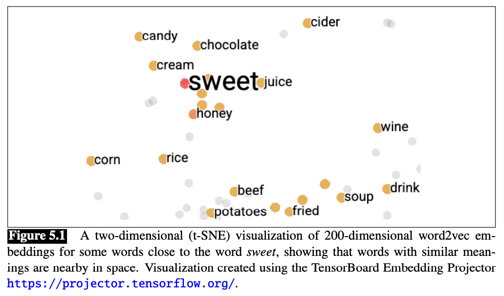

Gambar 5.1 menunjukkan visualisasi *embeddings* yang dipelajari oleh algoritma *word2vec*, memperlihatkan lokasi kata-kata terpilih (tetangga dari "*sweet*") yang diproyeksikan turun dari ruang 200-dimensi ke ruang 2-dimensi. Perhatikan bahwa tetangga terdekat dari *sweet* adalah kata-kata yang terkait secara semantik seperti *honey*, *candy*, *juice*, *chocolate*. Gagasan bahwa kata-kata yang serupa bertetangga dalam ruang berdimensi tinggi menawarkan kekuatan yang sangat besar bagi *language models* dan aplikasi *NLP* lainnya. Sebagai contoh, pengklasifikasi sentimen (*sentiment classifiers*) pada Bab 4 bergantung pada kata-kata yang sama yang muncul dalam himpunan data latih dan uji. Namun dengan merepresentasikan kata sebagai *embeddings*, sebuah pengklasifikasi dapat menetapkan sentimen selama ia melihat beberapa kata dengan makna yang serupa. Dan seperti yang akan kita lihat, model *vector semantics* seperti yang ditunjukkan pada Gambar 5.1 dapat dipelajari secara otomatis dari teks tanpa pengawasan (*without supervision*).

Dalam bab ini kita akan mulai dengan model *embeddings* pedagogis yang sederhana di mana makna sebuah kata didefinisikan oleh sebuah vektor dengan hitungan kata-kata di dekatnya. Kami memperkenalkan model ini sebagai cara yang membantu untuk memahami konsep vektor dan apa artinya bagi sebuah vektor untuk menjadi representasi makna kata, namun varian yang lebih canggih seperti model *tf-idf* yang akan kami perkenalkan di Bab 11 adalah metode penting yang harus Anda pahami. Kita akan melihat bahwa metode ini menghasilkan vektor yang sangat panjang yang bersifat *sparse*, yaitu sebagian besar berisi nol (karena sebagian besar kata tidak pernah muncul dalam konteks kata lain). Kami kemudian akan memperkenalkan keluarga model *word2vec* untuk menyusun vektor yang pendek dan *dense* (padat) yang memiliki properti semantik yang bahkan lebih berguna.

Kami juga akan memperkenalkan *cosine*, cara standar untuk menggunakan *embeddings* guna menghitung *semantic similarity* (keserupaan semantik), antara dua kata, dua kalimat, atau dua dokumen, yang merupakan perangkat penting dalam aplikasi praktis.

### 5.3 - Simple count-based embeddings

Mari kita perkenalkan cara pertama untuk menghitung word vector embeddings. Model vektor makna paling sederhana ini didasarkan pada co-occurrence matrix, sebuah cara untuk merepresentasikan seberapa sering kata-kata muncul bersamaan (co-occur). Kita akan mendefinisikan jenis khusus dari co-occurrence matrix, yakni word-context matrix, di mana setiap baris dalam matriks merepresentasikan sebuah kata dalam kosakata dan setiap kolom merepresentasikan seberapa sering kata lain dalam kosakata muncul di dekatnya. Matriks ini dengan demikian memiliki dimensionalitas sebagai berikut:

```
Dimensi Matriks = |V| × |V|

Keterangan:
- |V| : Ukuran kosakata (vocabulary size), yaitu jumlah total kata unik dalam korpus.
- Baris : Merepresentasikan kata target.
- Kolom : Merepresentasikan kata konteks.
- Sel (i, j) : Mencatat jumlah berapa kali kata baris ke-i dan kata kolom ke-j muncul bersamaan di dekatnya.
```

Apa yang kita maksud dengan 'di dekatnya' (nearby)? Kita dapat mengimplementasikan berbagai metode, namun mari kita mulai dengan metode yang sangat sederhana: sebuah context window di sekitar kata tersebut, katakanlah 4 kata ke kiri dan 4 kata ke kanan. Jika kita melakukan itu, setiap sel akan merepresentasikan jumlah berapa kali (dalam suatu korpus pelatihan) kata kolom muncul dalam window $\pm 4$ kata di sekitar kata baris.

Mari kita lihat bagaimana ini bekerja untuk 4 kata: cherry, strawberry, digital, dan information. Untuk setiap kata, kami mengambil satu contoh tunggal dari korpus, dan kami menampilkan window $\pm 4$ kata dari contoh tersebut:

... is traditionally followed by cherry pie, a traditional dessert ...

... often mixed, such as strawberry rhubarb pie. Apple pie ...

... computer peripherals and personal digital assistants. These devices usually ...

... a computer. This includes information available on the internet ...

Jika kita kemudian mengambil setiap kemunculan dari setiap kata dalam korpus besar dan menghitung kata-kata konteks di sekitarnya, kita mendapatkan word-context co-occurrence matrix. Word-context co-occurrence matrix yang lengkap sangatlah besar, karena untuk setiap kata dalam kosakata (mengingat $|V|$) kita harus menghitung seberapa sering kata tersebut muncul dengan setiap kata lain dalam kosakata, sehingga dimensionalitasnya adalah $|V| \times |V|$. Oleh karena itu, mari kita sketsakan prosesnya dalam skala yang lebih kecil. Bayangkan kita hanya akan melihat 4 kata tersebut, dan hanya mempertimbangkan 3 kata konteks berikut: a, computer, dan pie. Lebih jauh lagi, mari asumsikan kita hanya menghitung kemunculan dalam korpus mini di atas.

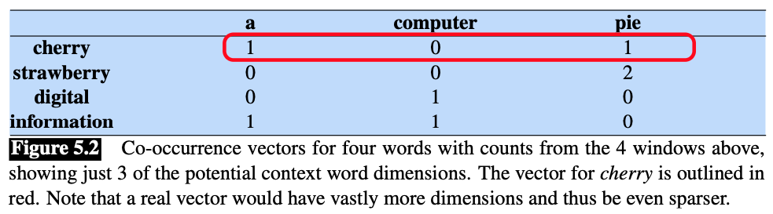

Jadi, sebelum melihat Gambar 5.2, hitunglah secara manual jumlah hitungan untuk 3 kata konteks ini bagi keempat kata cherry, strawberry, digital, dan information.

Semoga hitungan Anda cocok dengan apa yang ditunjukkan pada Gambar 5.2, sehingga setiap sel merepresentasikan jumlah berapa kali kata tertentu (didefinisikan oleh baris) muncul dalam konteks tertentu (didefinisikan oleh kolom kata).

Setiap baris, kemudian, adalah sebuah vektor yang merepresentasikan sebuah kata. Untuk mengulas kembali aljabar linier dasar, sebuah vektor, pada intinya, hanyalah sebuah daftar atau larik angka.

Contoh Representasi Vektor:
v_cherry = [1, 0, 1]
v_information = [1, 1, 0]

Keterangan:
- v_cherry : Vektor untuk kata "cherry" (baris pertama pada Gambar 5.2).
- v_information : Vektor untuk kata "information" (baris keempat).
- Elemen : Angka dalam kurung siku merepresentasikan hitungan frekuensi kemunculan bersama konteks tertentu.

Sebuah vector space (ruang vektor) adalah sekumpulan vektor, dan dikarakterisasi oleh dimensinya. Vektor-vektor dalam vector space 3-dimensi memiliki satu elemen untuk setiap dimensi ruang tersebut. Kita akan secara longgar menyebut vektor dalam ruang 3-dimensi sebagai vektor 3-dimensi, dengan satu elemen di sepanjang setiap dimensi. Dalam contoh di Gambar 5.2, kami telah memilih untuk membuat vektor dokumen berdimensi 3, hanya agar muat di halaman; dalam term-document matrices yang nyata, vektor dokumen akan memiliki dimensionalitas $|V|$, yakni ukuran kosakata.

Urutan angka dalam sebuah vector space mengindikasikan dimensi berbeda di mana dokumen bervariasi. Dimensi ketiga untuk semua vektor ini berkorespondensi dengan jumlah berapa kali pie muncul dalam konteks. Dimensi kedua untuk semuanya berkorespondensi dengan jumlah berapa kali kata computer muncul. Perhatikan bahwa vektor untuk information dan digital memiliki nilai yang sama (1) untuk dimensi "computer" ini.

Pada kenyataannya, kita tidak menghitung word vectors pada satu context window tunggal. Alih-alih, kita menghitungnya pada keseluruhan korpus. Mari kita lihat seperti apa rupa hitungan yang sebenarnya.

Mari kita lihat beberapa vektor yang dihitung dengan cara ini. Gambar 5.3 menunjukkan himpunan bagian dari word-word co-occurrence matrix untuk keempat kata ini, di mana, sekali lagi karena mustahil untuk memvisualisasikan seluruh $|V|$ kata konteks yang mungkin pada halaman buku teks ini, kami menampilkan himpunan bagian dari 6 dimensi, dengan hitungan yang dikomputasi dari korpus Wikipedia [Wikipedia Corpus, Davies, 2015].

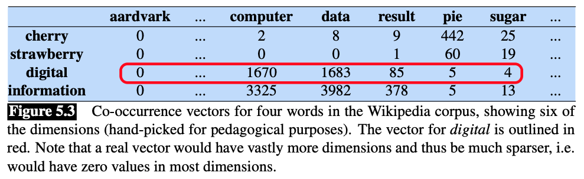

Perhatikan pada Gambar 5.3 bahwa dua kata cherry dan strawberry lebih mirip satu sama lain (baik pie maupun sugar cenderung muncul dalam window mereka) dibandingkan dengan kata lain seperti digital; sebaliknya, digital dan information lebih mirip satu sama lain daripada, katakanlah, dengan strawberry.

Kita dapat menganggap vektor untuk sebuah dokumen sebagai titik dalam ruang berdimensi $|V|$; dengan demikian dokumen-dokumen dalam Gambar 5.3 adalah titik-titik dalam ruang 3-dimensi. Gambar 5.4 menunjukkan visualisasi spasial.

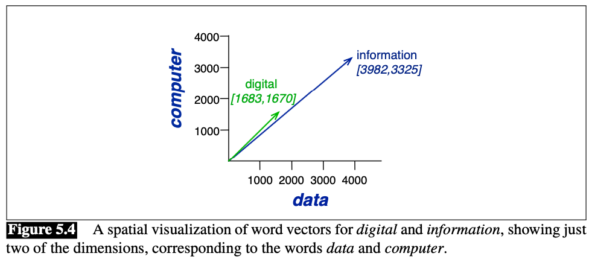

Perhatikan bahwa $|V|$, dimensionalitas vektor, umumnya adalah ukuran kosakata, sering kali antara 10.000 dan 50.000 kata (menggunakan kata-kata yang paling sering muncul dalam korpus pelatihan; mempertahankan kata-kata setelah sekitar 50.000 yang paling sering umumnya tidak membantu). Karena sebagian besar angka ini adalah nol, ini adalah representasi sparse vector; terdapat algoritma yang efisien untuk penyimpanan dan komputasi dengan sparse matrices.

Dimungkinkan juga untuk menerapkan berbagai jenis fungsi pembobotan (weighting functions) pada hitungan dalam sel-sel ini. Pembobotan yang paling populer adalah tf-idf, yang akan kami perkenalkan di Bab 11, namun secara historis terdapat berbagai variasi pembobotan lainnya.
Sekarang setelah kita memiliki beberapa intuisi, mari kita beralih untuk memeriksa rincian penghitungan word similarity.


### 5.4 - Cosine for measuring similarity

Untuk mengukur keserupaan (similarity) antara dua kata target $v$ dan $w$, kita memerlukan sebuah metrik yang mengambil dua vektor (dengan dimensionalitas yang sama, baik keduanya dengan kata sebagai dimensi, sehingga panjangnya $|V|$, atau keduanya dengan dokumen sebagai dimensi, dengan panjang $|D|$) dan memberikan ukuran keserupaannya. Sejauh ini, metrik keserupaan yang paling umum adalah cosine dari sudut di antara vektor-vektor tersebut.

Cosine tersebut—seperti kebanyakan ukuran untuk vector similarity yang digunakan dalam NLP—didasarkan pada operator dot product dari aljabar linier, yang juga disebut inner product:

Rumus 5.7 (Dot Product):

$$\text{dot product}(\mathbf{v}, \mathbf{w}) = \mathbf{v} \cdot \mathbf{w} = \sum_{i=1}^{N} v_i w_i = v_1 w_1 + v_2 w_2 + ... + v_N w_N$$

Keterangan Rumus:

$\mathbf{v} \cdot \mathbf{w}$: Hasil dot product antara vektor $v$ dan $w$.

$N$: Jumlah dimensi vektor (dimensionalitas).

$v_i$ dan $w_i$: Nilai komponen vektor pada dimensi ke-$i$.

Cara membacanya: Dot product adalah jumlah dari perkalian elemen-elemen yang bersesuaian pada kedua vektor.

Dot product bertindak sebagai metrik keserupaan karena nilainya cenderung tinggi justru ketika kedua vektor memiliki nilai yang besar pada dimensi yang sama. Secara alternatif, vektor yang memiliki nilai nol pada dimensi yang berbeda—orthogonal vectors—akan memiliki dot product bernilai 0, yang merepresentasikan ketidakserupaan yang kuat.

Namun, raw dot product ini memiliki masalah sebagai metrik keserupaan: ia memihak pada vektor yang panjang. Panjang vektor didefinisikan sebagai:

$$|\mathbf{v}| = \sqrt{\sum_{i=1}^{N} v_i^2}$$

Dot product bernilai lebih tinggi jika sebuah vektor lebih panjang, dengan nilai yang lebih tinggi pada setiap dimensi. Kata-kata yang lebih sering muncul (frequent) memiliki vektor yang lebih panjang, karena kata-kata tersebut cenderung muncul bersamaan (co-occur) dengan lebih banyak kata dan memiliki nilai co-occurrence yang lebih tinggi dengan masing-masing kata tersebut. Dengan demikian, raw dot product akan lebih tinggi untuk kata-kata yang sering muncul. Namun, ini adalah sebuah masalah; kita menginginkan metrik keserupaan yang memberi tahu kita seberapa mirip dua kata terlepas dari frekuensinya.

Kita memodifikasi dot product untuk melakukan normalisasi terhadap panjang vektor dengan membagi dot product dengan panjang dari masing-masing kedua vektor tersebut. Normalized dot product ini ternyata sama dengan cosine sudut di antara kedua vektor, mengikuti definisi dot product antara dua vektor $a$ dan $b$:

Rumus 5.9 (Hubungan Dot Product dan Cosine):

$$\mathbf{a} \cdot \mathbf{b} = |\mathbf{a}| |\mathbf{b}| \cos \theta$$

$$\frac{\mathbf{a} \cdot \mathbf{b}}{|\mathbf{a}| |\mathbf{b}|} = \cos \theta$$

Dengan demikian, metrik cosine similarity antara dua vektor $v$ dan $w$ dapat dihitung sebagai:

Rumus 5.10 (Cosine Similarity):

$$\text{cosine}(\mathbf{v}, \mathbf{w}) = \frac{\mathbf{v} \cdot \mathbf{w}}{|\mathbf{v}| |\mathbf{w}|} = \frac{\sum_{i=1}^{N} v_i w_i}{\sqrt{\sum_{i=1}^{N} v_i^2} \sqrt{\sum_{i=1}^{N} w_i^2}}$$

Keterangan Rumus:

Pembilang ($\mathbf{v} \cdot \mathbf{w}$): Dot product dari vektor $v$ dan $w$.

Penyebut ($|\mathbf{v}| |\mathbf{w}|$): Perkalian antara panjang (norma) vektor $v$ dan panjang vektor $w$.

Fungsi: Menghasilkan nilai antara -1 hingga 1 (atau 0 hingga 1 untuk frekuensi positif) yang menunjukkan kemiripan arah kedua vektor, ternormalisasi dari panjangnya.

Untuk beberapa aplikasi, kita melakukan pra-normalisasi (pre-normalize) setiap vektor, dengan membaginya dengan panjangnya, menciptakan unit vector dengan panjang 1. Dengan demikian, kita dapat menghitung unit vector dari $a$ dengan membaginya dengan $|a|$. Untuk unit vectors, dot product sama dengan cosine.

Nilai cosine berkisar dari 1 untuk vektor yang menunjuk ke arah yang sama, melewati 0 untuk orthogonal vectors, hingga -1 untuk vektor yang menunjuk ke arah yang berlawanan. Namun, karena nilai frekuensi mentah (raw frequency) bersifat non-negatif, cosine untuk vektor-vektor ini berkisar dari 0–1.

Mari kita lihat bagaimana cosine menghitung manakah di antara kata cherry atau digital yang lebih dekat maknanya dengan information, hanya dengan menggunakan hitungan mentah dari tabel yang dipersingkat berikut:

|  | pie | data | computer |
| --- | --- | --- | --- |
| **cherry** | 442 | 8 | 2 |
| **digital** | 5 | 1683 | 1670 |
| **information** | 5 | 3982 | 3325 |

Perhitungan:

$$\cos(\text{cherry}, \text{information}) = \frac{442 \times 5 + 8 \times 3982 + 2 \times 3325}{\sqrt{442^2 + 8^2 + 2^2} \sqrt{5^2 + 3982^2 + 3325^2}} = .018$$

$$\cos(\text{digital}, \text{information}) = \frac{5 \times 5 + 1683 \times 3982 + 1670 \times 3325}{\sqrt{5^2 + 1683^2 + 1670^2} \sqrt{5^2 + 3982^2 + 3325^2}} = .996$$

Model memutuskan bahwa information jauh lebih dekat dengan digital daripada dengan cherry, sebuah hasil yang tampak masuk akal. Gbr. 5.5 menunjukkan visualisasinya.

Cosine similarity dapat digunakan untuk mengestimasi word similarity, untuk tugas-tugas seperti menemukan parafrasa kata, melacak perubahan dalam makna kata, atau secara otomatis menemukan makna kata dalam korpus yang berbeda. Sebagai contoh, kita dapat menemukan 10 kata yang paling mirip dengan kata target $w$ apa pun dengan menghitung cosine antara $w$ dan masing-masing dari $|V|-1$ kata lainnya, mengurutkannya, dan melihat 10 kata teratas.

### 5.5 - Word2vec
Pada bagian-bagian sebelumnya kita telah melihat cara merepresentasikan sebuah kata sebagai vektor panjang yang sparse (jarang) dengan dimensi yang berkorespondensi dengan kata-kata dalam kosakata. Sekarang kami memperkenalkan representasi kata yang lebih kuat: embeddings, vektor dense (padat) yang pendek. Berbeda dengan vektor yang telah kita lihat sejauh ini, embeddings berukuran pendek, dengan jumlah dimensi $d$ (baca: de) berkisar antara 50-1000, alih-alih ukuran kosakata $|V|$ (baca: mutlak ve) yang jauh lebih besar. Dimensi-dimensi $d$ (baca: de) ini tidak memiliki interpretasi yang jelas. Dan vektor-vektor tersebut bersifat dense: alih-alih entri vektor bersifat sparse, yang sebagian besar berupa hitungan nol atau fungsi hitungan, nilai-nilainya akan berupa bilangan bernilai riil (real-valued numbers) yang bisa negatif.

Ternyata vektor dense bekerja lebih baik dalam setiap tugas NLP dibandingkan vektor sparse. Meskipun kami tidak sepenuhnya memahami semua alasannya, kami memiliki beberapa intuisi. Merepresentasikan kata sebagai vektor dense 300-dimensi mengharuskan pengklasifikasi (classifiers) kita untuk mempelajari bobot yang jauh lebih sedikit dibandingkan jika kita merepresentasikan kata sebagai vektor 50.000-dimensi, dan ruang parameter yang lebih kecil kemungkinan membantu dalam generalisasi dan menghindari overfitting. Vektor dense mungkin juga melakukan pekerjaan yang lebih baik dalam menangkap sinonimi (synonymy). Sebagai contoh, dalam representasi vektor sparse, dimensi untuk sinonim seperti car dan automobile adalah berbeda dan tidak berhubungan; vektor sparse dengan demikian mungkin gagal menangkap keserupaan antara kata dengan car sebagai tetangga dan kata dengan automobile sebagai tetangga.

Pada bagian ini kami memperkenalkan satu metode untuk menghitung embeddings: skip-gram with negative sampling, yang terkadang disebut SGNS. Algoritma skip-gram adalah salah satu dari dua algoritma dalam paket perangkat lunak yang disebut word2vec, sehingga terkadang algoritma ini secara longgar disebut sebagai word2vec [word2vec, Mikolov et al, 2013]. Metode word2vec cepat, efisien untuk dilatih, dan tersedia secara mudah secara daring dengan kode dan pretrained embeddings. Embeddings word2vec adalah static embeddings, yang berarti metode tersebut mempelajari satu embedding tetap untuk setiap kata dalam kosakata. Di Bab 9 kami akan memperkenalkan metode untuk mempelajari dynamic contextual embeddings seperti keluarga representasi BERT yang populer, di mana vektor untuk setiap kata berbeda dalam konteks yang berbeda.

Intuisi dari word2vec adalah bahwa alih-alih menghitung seberapa sering setiap kata konteks $c$ (baca: ce) muncul di dekat, katakanlah, apricot, kita justru akan melatih pengklasifikasi pada tugas prediksi biner: "Apakah kata $c$ (baca: ce) kemungkinan muncul di dekat apricot?" Kita sebenarnya tidak peduli dengan tugas prediksi ini; alih-alih, kita akan mengambil bobot pengklasifikasi yang telah dipelajari sebagai word embeddings.

Intuisi revolusioner di sini adalah bahwa kita dapat menggunakan teks berjalan (running text) begitu saja sebagai data pelatihan yang diawasi secara implisit (implicitly supervised training data) untuk pengklasifikasi semacam itu; sebuah kata $c$ (baca: ce) yang muncul di dekat kata target apricot bertindak sebagai 'jawaban benar' emas (gold 'correct answer') untuk pertanyaan "Apakah kata $c$ (baca: ce) kemungkinan muncul di dekat apricot?" Metode ini, yang sering disebut self-supervision, menghindari kebutuhan akan segala jenis sinyal supervisi yang dilabeli secara manual (hand-labeled). Gagasan ini pertama kali diusulkan dalam tugas neural language modeling, ketika [Neural Probabilistic Language Model, Bengio et al, 2003] dan [NLP (almost) from Scratch, Collobert et al, 2011] menunjukkan bahwa sebuah neural language model (sebuah neural network yang belajar untuk memprediksi kata berikutnya dari kata-kata sebelumnya) dapat menggunakan kata berikutnya dalam teks berjalan begitu saja sebagai sinyal supervisinya, dan dapat digunakan untuk mempelajari representasi embedding bagi setiap kata sebagai bagian dari pengerjaan tugas prediksi ini.

Kita akan melihat cara mengerjakan neural networks di bab berikutnya, namun word2vec adalah model yang jauh lebih sederhana daripada neural network language model, dalam dua hal. Pertama, word2vec menyederhanakan tugasnya (menjadikannya klasifikasi biner alih-alih prediksi kata). Kedua, word2vec menyederhanakan arsitekturnya (melatih pengklasifikasi logistic regression alih-alih multi-layer neural network dengan hidden layers yang menuntut algoritma pelatihan yang lebih canggih). Intuisi dari skip-gram adalah:

1. Perlakukan kata target dan kata konteks yang bertetangga sebagai contoh positif.

2. Sampel kata-kata lain secara acak dalam leksikon untuk mendapatkan sampel negatif.

3. Gunakan logistic regression untuk melatih pengklasifikasi guna membedakan kedua kasus tersebut.

4. Gunakan bobot yang telah dipelajari sebagai embeddings.

#### 5.5.1 - The classifier

Mari kita mulai dengan mempertimbangkan tugas klasifikasi, dan kemudian beralih ke cara pelatihannya. Bayangkan sebuah kalimat seperti berikut, dengan kata target apricot, dan asumsikan kita menggunakan window (jendela) $\pm 2$ kata konteks:

... lemon, a [tablespoon of apricot jam,

$c_1$ $c_2$ $w$ $c_3$ $c_4$

a] pinch ...

Tujuan kita adalah melatih pengklasifikasi sedemikian rupa sehingga, bila diberikan sebuah tuple $(w, c)$ (baca: tuple w, c) yang terdiri dari kata target $w$ (baca: w) yang dipasangkan dengan kandidat kata konteks $c$ (baca: c) (misalnya (apricot, jam), atau mungkin (apricot, aardvark)), pengklasifikasi tersebut akan mengembalikan probabilitas bahwa $c$ adalah kata konteks yang nyata (benar untuk jam, salah untuk aardvark):

$$P(+|w,c) \quad (5.11)$$

(baca: P—probabilitas—plus bila diketahui w dan c)

Probabilitas bahwa kata $c$ bukan merupakan kata konteks nyata bagi $w$ hanyalah 1 dikurangi Pers. 5.11:

$$P(-|w,c) = 1 - P(+|w,c) \quad (5.12)$$

(baca: P minus bila diketahui w dan c sama dengan satu dikurangi P plus bila diketahui w dan c)

Bagaimana pengklasifikasi menghitung probabilitas $P$? Intuisi dari model skip-gram adalah mendasarkan probabilitas ini pada embedding similarity (keserupaan embedding): sebuah kata kemungkinan besar muncul di dekat target jika vektor embedding-nya serupa dengan embedding target. Untuk menghitung keserupaan antara dense embeddings ini, kita bergantung pada intuisi bahwa dua vektor adalah serupa jika keduanya memiliki dot product yang tinggi (bagaimanapun juga, cosine hanyalah dot product yang dinormalisasi). Dengan kata lain:

$$\text{Similarity}(w,c) \approx c \cdot w \quad (5.13)$$

(baca: Similarity w dan c kira-kira sama dengan c dot w)

Dot product $c \cdot w$ bukanlah sebuah probabilitas, melainkan hanya sebuah angka yang berkisar dari $-\infty$ hingga $\infty$ (karena elemen-elemen dalam embeddings word2vec bisa bernilai negatif, dot product pun bisa bernilai negatif). Untuk mengubah dot product menjadi probabilitas, kita akan menggunakan fungsi logistic atau sigmoid $\sigma(x)$ (baca: sigma x), inti mendasar dari logistic regression:

$$\sigma(x) = \frac{1}{1 + \exp(-x)} \quad (5.14)$$

(baca: sigma x sama dengan satu per satu ditambah eksponensial min x)

Kita memodelkan probabilitas bahwa kata $c$ adalah kata konteks nyata untuk kata target $w$ sebagai:

$$P(+|w,c) = \sigma(c \cdot w) = \frac{1}{1 + \exp(-c \cdot w)} \quad (5.15)$$

(baca: P plus bila diketahui w, c sama dengan sigma c dot w sama dengan satu per satu ditambah eksponensial min c dot w)

Fungsi sigmoid mengembalikan angka antara 0 dan 1, namun untuk menjadikannya sebuah probabilitas, kita juga memerlukan total probabilitas dari dua kejadian yang mungkin ($c$ adalah kata konteks, dan $c$ bukan kata konteks) agar berjumlah 1. Dengan demikian, kita mengestimasi probabilitas bahwa kata $c$ bukan merupakan kata konteks nyata bagi $w$ sebagai:

$$P(-|w,c) = 1 - P(+|w,c) = \sigma(-c \cdot w) = \frac{1}{1 + \exp(c \cdot w)} \quad (5.16)$$

(baca: P minus bila diketahui w, c sama dengan satu dikurangi P plus bila diketahui w, c sama dengan sigma min c dot w sama dengan satu per satu ditambah eksponensial c dot w)

Persamaan 5.15 memberi kita probabilitas untuk satu kata, namun terdapat banyak kata konteks di dalam window. Skip-gram membuat asumsi penyederhanaan bahwa semua kata konteks bersifat independen, yang memungkinkan kita untuk sekadar mengalikan probabilitasnya:

$$P(+|w,c_{1:L}) = \prod_{i=1}^{L} \sigma(c_i \cdot w) \quad (5.17)$$

(baca: P plus bila diketahui w dan c satu sampai L sama dengan perkalian beruntun dari i sama dengan satu sampai L dari sigma c sub i dot w)

$$\log P(+|w,c_{1:L}) = \sum_{i=1}^{L} \log \sigma(c_i \cdot w) \quad (5.18)$$

(baca: logaritma P plus bila diketahui w dan c satu sampai L sama dengan sigma—jumlah dari i sama dengan satu sampai L dari logaritma sigma c sub i dot w)

Singkatnya, skip-gram melatih pengklasifikasi probabilistik yang, bila diberikan kata target uji $w$ dan context window-nya sepanjang $L$ kata $c_{1:L}$ (baca: c satu sampai L), menetapkan probabilitas berdasarkan seberapa mirip context window ini dengan kata target. Probabilitas tersebut didasarkan pada penerapan fungsi logistic (sigmoid) pada dot product dari embeddings kata target dengan setiap kata konteks. Untuk menghitung probabilitas ini, kita hanya membutuhkan embeddings untuk setiap kata target dan kata konteks dalam kosakata.

Gbr. 5.6 menunjukkan intuisi parameter yang akan kita perlukan. Skip-gram sebenarnya menyimpan dua embeddings untuk setiap kata, satu untuk kata sebagai target, dan satu untuk kata yang dianggap sebagai konteks. Dengan demikian, parameter yang perlu kita pelajari adalah dua matriks $W$ dan $C$, masing-masing berisi satu embedding untuk setiap $|V|$ (baca: mutlak V—ukuran kosakata) kata dalam kosakata $V$. Mari kita beralih untuk mempelajari embeddings ini (yang merupakan tujuan sebenarnya dari pelatihan pengklasifikasi ini sejak awal).

Catatan: Pada prinsipnya matriks target dan matriks konteks dapat menggunakan kosakata yang berbeda, namun kami akan menyederhanakannya dengan mengasumsikan satu kosakata bersama $V$.

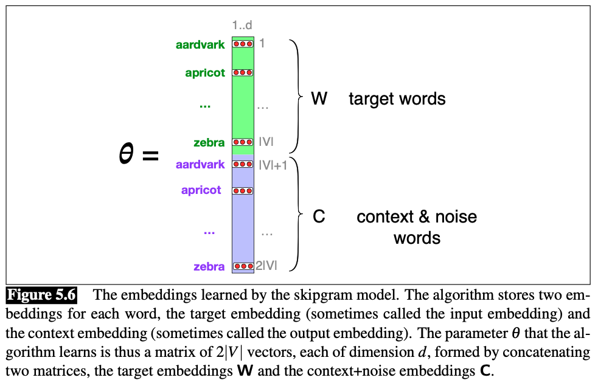


Gambar 5.6 Embeddings yang dipelajari oleh model skip-gram. Algoritma ini menyimpan dua embeddings untuk setiap kata, yakni target embedding (terkadang disebut input embedding) dan context embedding (terkadang disebut output embedding). Parameter $\theta$ (baca: theta) yang dipelajari algoritma dengan demikian adalah matriks dari $2|V|$ vektor, masing-masing berdimensi $d$, yang dibentuk dengan menggabungkan (concatenating) dua matriks, yakni target embeddings $W$ dan context+noise embeddings $C$.

#### 5.5.2 - Learning skip-gram embeddings

Algoritma pembelajaran untuk skip-gram embeddings menerima input berupa korpus teks, dan ukuran kosakata $N$ (baca: en) yang dipilih. Ia memulainya dengan menetapkan vektor embedding acak untuk setiap dari $N$ kata kosakata, dan kemudian melanjutkan untuk secara iteratif menggeser embedding setiap kata $w$ (baca: we) agar lebih menyerupai embedding kata-kata yang muncul di dekatnya dalam teks, dan kurang menyerupai embedding kata-kata yang tidak muncul di dekatnya. Mari kita mulai dengan mempertimbangkan satu potong data pelatihan:

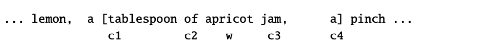

Contoh ini memiliki kata target $w$ (baca: we) (apricot), dan 4 kata konteks dalam window $L= \pm 2$ (baca: el sama dengan plus minus dua), yang menghasilkan 4 instansi pelatihan positif (di sebelah kiri bawah):

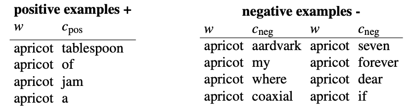

Untuk melatih pengklasifikasi biner, kita juga memerlukan contoh negatif. Faktanya skip-gram with negative sampling (SGNS) menggunakan lebih banyak contoh negatif daripada contoh positif (dengan rasio di antara keduanya ditetapkan oleh parameter $k$ (baca: ka)). Jadi untuk setiap instansi pelatihan ($w, c_{pos}$) (baca: w koma c pos) ini, kita akan membuat $k$ sampel negatif, masing-masing terdiri dari target $w$ ditambah sebuah 'kata derau' (noise word) $c_{neg}$ (baca: c neg). Kata derau adalah kata acak dari leksikon, yang dibatasi agar tidak menjadi kata target $w$. Tabel tepat di atas menunjukkan pengaturan di mana $k= 2$, jadi kita akan memiliki 2 contoh negatif dalam himpunan pelatihan negatif—untuk setiap contoh positif $w, c_{pos}$.

Kata-kata derau dipilih berdasarkan weighted unigram probability (probabilitas unigram terbobot) $p_\alpha (w)$ (baca: p sub alfa dari w), di mana $\alpha$ (baca: alfa) adalah sebuah bobot. Jika kita melakukan pengambilan sampel berdasarkan probabilitas tak terbobot $P(w)$, itu berarti bahwa dengan probabilitas unigram $P(\text{“the”})$ kita akan memilih kata the sebagai kata derau, dengan probabilitas unigram $P(\text{“aardvark”})$ kita akan memilih aardvark, dan seterusnya. Namun dalam praktiknya, umum untuk menetapkan $\alpha = 0.75$, yaitu menggunakan pembobotan $P^{3/4} (w)$:

$$P_\alpha (w) = \frac{\text{count}(w)^\alpha}{\sum_{w'} \text{count}(w')^\alpha} \quad (5.19)$$

(baca: P sub alfa dari w sama dengan count w pangkat alfa dibagi jumlah dari w aksen dari count w aksen pangkat alfa)

Menetapkan $\alpha = .75$ memberikan kinerja yang lebih baik karena memberikan probabilitas yang sedikit lebih tinggi pada kata-kata derau yang jarang (rare): untuk kata-kata jarang, $P_\alpha (w) > P(w)$. Untuk mengilustrasikan intuisi ini, mungkin membantu untuk mengerjakan probabilitas bagi sebuah contoh dengan $\alpha = .75$ dan dua peristiwa, $P(a) = 0.99$ dan $P(b) = 0.01$:

$$P_\alpha (a) = \frac{.99^{.75}}{.99^{.75} + .01^{.75}} = 0.97$$

$$P_\alpha (b) = \frac{.01^{.75}}{.99^{.75} + .01^{.75}} = 0.03 \quad (5.20)$$

Dengan demikian menggunakan $\alpha = .75$ meningkatkan probabilitas peristiwa jarang $b$ dari 0.01 menjadi 0.03.

Diberikan himpunan instansi pelatihan positif dan negatif, serta himpunan awal embeddings, tujuan algoritma pembelajaran adalah untuk menyesuaikan embeddings tersebut guna:

Memaksimalkan keserupaan pasangan kata target, kata konteks ($w, c_{pos}$) yang diambil dari contoh positif.

Meminimalkan keserupaan pasangan ($w, c_{neg}$) dari contoh negatif.

Jika kita mempertimbangkan satu pasangan kata/konteks ($w, c_{pos}$) dengan $k$ kata derau-nya $c_{neg1}...c_{negk}$, kita dapat mengekspresikan kedua tujuan ini sebagai fungsi kerugian (loss function) $L$ berikut untuk diminimalkan (karenanya ada tanda $-$); di sini suku pertama mengekspresikan bahwa kita ingin pengklasifikasi menetapkan probabilitas tinggi pada kata konteks nyata $c_{pos}$ sebagai tetangga, dan suku kedua mengekspresikan bahwa kita ingin menetapkan probabilitas tinggi pada setiap kata derau $c_{negi}$ sebagai bukan tetangga, semuanya dikalikan karena kita mengasumsikan independensi:

$$L(w, c_{pos}, c_{neg*}) = - \log \left( P(+|w, c_{pos}) \prod_{i=1}^{k} P(-|w, c_{negi}) \right)$$

$$= - \left[ \log P(+|w, c_{pos}) + \sum_{i=1}^{k} \log P(-|w, c_{negi}) \right]$$

$$= - \left[ \log P(+|w, c_{pos}) + \sum_{i=1}^{k} \log (1 - P(+|w, c_{negi})) \right]$$

$$= - \left[ \log \sigma(c_{pos} \cdot w) + \sum_{i=1}^{k} \log \sigma(-c_{negi} \cdot w) \right] \quad (5.21)$$

(baca: L dari w, c pos, c neg bintang sama dengan min kurung siku log sigma c pos dot w ditambah jumlah dari i sama dengan satu sampai k dari log sigma min c neg sub i dot w tutup kurung siku)

Yaitu, kita ingin memaksimalkan dot product kata tersebut dengan kata-kata konteks aktual, dan meminimalkan dot product kata tersebut dengan $k$ kata bukan-tetangga yang disampel secara negatif.

Kita meminimalkan fungsi kerugian ini menggunakan stochastic gradient descent. Gbr. 5.7 menunjukkan intuisi satu langkah pembelajaran.

Untuk mendapatkan gradien, kita perlu mengambil turunan Pers. 5.21 terhadap embeddings yang berbeda. Ternyata turunannya adalah sebagai berikut (kami meninggalkan pembuktiannya sebagai latihan di akhir bab):

$$\frac{\partial L}{\partial c_{pos}} = [\sigma(c_{pos} \cdot w) - 1]w \quad (5.22)$$

(baca: parsial L terhadap parsial c pos sama dengan kurung siku sigma c pos dot w dikurangi satu kali w)

$$\frac{\partial L}{\partial c_{negi}} = [\sigma(c_{negi} \cdot w)]w \quad (5.23)$$

(baca: parsial L terhadap parsial c neg sub i sama dengan kurung siku sigma c neg sub i dot w kali w)

$$\frac{\partial L}{\partial w} = [\sigma(c_{pos} \cdot w) - 1]c_{pos} + \sum_{i=1}^{k} [\sigma(c_{negi} \cdot w)]c_{negi} \quad (5.24)$$

(baca: parsial L terhadap parsial w sama dengan kurung siku sigma c pos dot w dikurangi satu kali c pos ditambah jumlah dari i sama dengan satu sampai k dari kurung siku sigma c neg sub i dot w kali c neg sub i)

Persamaan pembaruan yang berjalan dari langkah waktu $t$ ke $t + 1$ dalam stochastic gradient descent dengan demikian adalah:

$$c_{pos}^{t+1} = c_{pos}^t - \eta[\sigma(c_{pos}^t \cdot w^t) - 1]w^t \quad (5.25)$$

(baca: c pos pangkat t plus satu sama dengan c pos pangkat t dikurangi eta kali kurung siku sigma c pos pangkat t dot w pangkat t dikurangi satu kali w pangkat t)

$$c_{negi}^{t+1} = c_{negi}^t - \eta[\sigma(c_{negi}^t \cdot w^t)]w^t \quad (5.26)$$

(baca: c neg sub i pangkat t plus satu sama dengan c neg sub i pangkat t dikurangi eta kali kurung siku sigma c neg sub i pangkat t dot w pangkat t kali w pangkat t)

$$w^{t+1} = w^t - \eta \left( [\sigma(c_{pos}^t \cdot w^t) - 1]c_{pos}^t + \sum_{i=1}^{k} [\sigma(c_{negi}^t \cdot w^t)]c_{negi}^t \right) \quad (5.27)$$

(baca: w pangkat t plus satu sama dengan w pangkat t dikurangi eta kali kurung buka kurung siku sigma c pos pangkat t dot w pangkat t dikurangi satu kali c pos pangkat t ditambah jumlah dari i sama dengan satu sampai k dari kurung siku sigma c neg sub i pangkat t dot w pangkat t kali c neg sub i pangkat t kurung tutup)

Sama seperti dalam logistic regression, maka, algoritma pembelajaran dimulai dengan matriks $W$ dan $C$ yang diinisialisasi secara acak, dan kemudian berjalan melalui korpus pelatihan menggunakan gradient descent untuk memindahkan $W$ dan $C$ sedemikian rupa untuk meminimalkan kerugian dalam Pers. 5.21 dengan melakukan pembaruan dalam (Pers. 5.25)-(Pers. 5.27).

Ingat kembali bahwa model skip-gram mempelajari dua embeddings terpisah untuk setiap kata $i$: target embedding $w_i$ dan context embedding $c_i$, yang disimpan dalam dua matriks, target matrix $W$ dan context matrix $C$. Umumnya kita menjumlahkan saja keduanya, merepresentasikan kata $i$ dengan vektor $w_i + c_i$. Secara alternatif kita dapat membuang matriks $C$ dan hanya merepresentasikan setiap kata $i$ dengan vektor $w_i$.

Seperti halnya metode berbasis hitungan sederhana seperti tf-idf, ukuran context window memengaruhi kinerja skip-gram embeddings, dan eksperimen sering kali menyetel parameter ukuran context window pada devset.

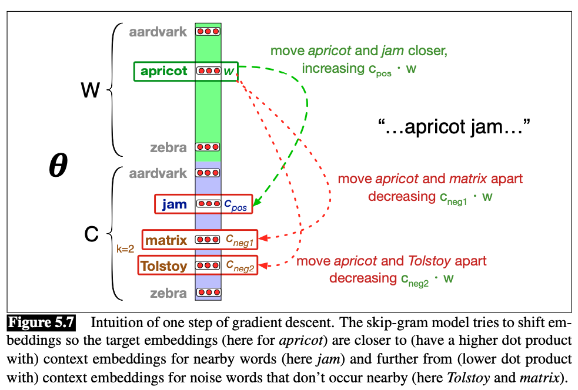

Gambar 5.7 Intuisi satu langkah gradient descent. Model skip-gram mencoba menggeser embeddings agar target embeddings (di sini untuk apricot) lebih dekat dengan (memiliki dot product lebih tinggi dengan) context embeddings untuk kata-kata di dekatnya (di sini jam) dan lebih jauh dari (dot product lebih rendah dengan) context embeddings untuk kata-kata derau yang tidak muncul di dekatnya (di sini Tolstoy dan matrix).

#### 5.5.3 - Other kinds of static embeddings

Terdapat banyak jenis *static embeddings*. Sebuah ekstensi dari *word2vec*, *fasttext* [*Enriching Word Vectors*, Bojanowski et al, 2017], menangani masalah pada *word2vec* sebagaimana yang telah kami sajikan sejauh ini: model ini tidak memiliki cara yang baik untuk menangani kata-kata yang tidak diketahui (*unknown words*)—kata-kata yang muncul dalam korpus uji tetapi tidak terlihat dalam korpus pelatihan. Masalah terkait adalah kelangkaan kata (*word sparsity*), seperti dalam bahasa dengan morfologi yang kaya, di mana beberapa dari banyak bentuk untuk setiap kata benda dan kata kerja mungkin hanya muncul secara jarang. *Fasttext* menangani masalah-masalah ini dengan menggunakan model *subword*, yang merepresentasikan setiap kata sebagai dirinya sendiri ditambah dengan *bag of constituent n-grams* (kantung n-gram penyusun), dengan simbol batas khusus `<` dan `>` yang ditambahkan pada setiap kata. Sebagai contoh, dengan $n = 3$ (baca: en sama dengan tiga) kata *where* akan direpresentasikan oleh urutan `<where>` ditambah *character n-grams* (n-gram karakter):

`<wh, whe, her, ere, re>`

Kemudian sebuah *skipgram embedding* dipelajari untuk setiap *constituent n-gram*, dan kata *where* direpresentasikan oleh jumlah dari semua *embeddings* dari *n-gram* penyusunnya. Kata-kata yang tidak diketahui kemudian dapat direpresentasikan hanya dengan jumlah dari *constituent n-grams* tersebut.

Sebuah pustaka *open-source* *fasttext*, termasuk *pretrained embeddings* untuk 157 bahasa, tersedia di [https://fasttext.cc](https://fasttext.cc).

Model *static embedding* lain yang digunakan secara sangat luas adalah *GloVe* [*GloVe*, Pennington et al, 2014], singkatan dari *Global Vectors*, karena model ini didasarkan pada penangkapan statistik korpus global. *GloVe* didasarkan pada rasio probabilitas dari *word-word co-occurrence matrix*.

Ternyata *dense embeddings* seperti *word2vec* sebenarnya memiliki hubungan matematis yang elegan dengan *count-based embeddings*, di mana *word2vec* dapat dipandang sebagai secara implisit mengoptimalkan fungsi dari *count matrix* dengan pembobotan (*PPMI*) tertentu [*Neural Word Embedding as Implicit Matrix Factorization*, Levy dan Goldberg, 2014].

### 5.6 - Visualizing Embeddings

Memvisualisasikan *embeddings* merupakan tujuan penting dalam membantu memahami, menerapkan, dan meningkatkan model-model makna kata ini. Namun, bagaimana kita dapat memvisualisasikan sebuah (sebagai contoh) vektor 100-dimensi? Cara paling sederhana untuk memvisualisasikan makna sebuah kata $w$ (baca: we) yang ter-*embedded* dalam sebuah ruang adalah dengan mendaftar kata-kata yang paling serupa dengan $w$ (baca: we) dengan mengurutkan vektor untuk semua kata dalam kosakata berdasarkan *cosine*-nya dengan vektor untuk $w$ (baca: we). Sebagai contoh, 7 kata terdekat dengan *frog* menggunakan sekumpulan *embeddings* tertentu yang dihitung dengan algoritma *GloVe* adalah: *frogs*, *toad*, *litoria*, *leptodactylidae*, *rana*, *lizard*, dan *eleutherodactylus* [*GloVe*, Pennington et al, 2014].

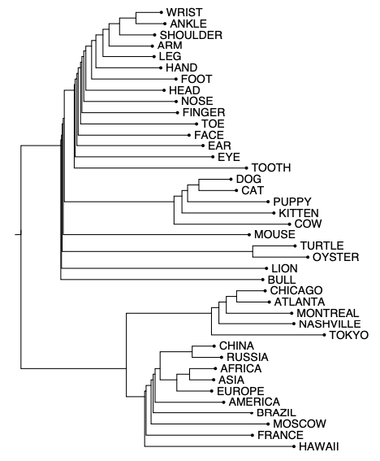

Metode visualisasi lainnya adalah menggunakan algoritma *clustering* untuk menunjukkan representasi hierarkis mengenai kata-kata mana yang serupa dengan yang lain dalam *embedding space*. Gambar tanpa keterangan di sebelah kiri menggunakan *hierarchical clustering* dari beberapa vektor *embedding* untuk kata benda sebagai metode visualisasi [*COALS*, Rohde et al, 2006].

Akan tetapi, metode visualisasi yang mungkin paling umum adalah memproyeksikan 100 dimensi dari sebuah kata menjadi 2 dimensi. Gbr. 5.1 memperlihatkan salah satu visualisasi tersebut, demikian pula Gbr. 5.9, dengan menggunakan metode proyeksi yang disebut *t-SNE* [*t-SNE*, van der Maaten dan Hinton, 2008].

### 5.7 - Semantic properties of embeddings

Pada bagian ini kami meringkas secara singkat beberapa properti semantik embeddings yang telah dipelajari.

Different types of similarity or association (Berbagai jenis keserupaan atau asosiasi): Satu parameter model vector semantic yang relevan baik bagi vektor sparse PPMI maupun vektor dense word2vec adalah ukuran context window (jendela konteks) yang digunakan untuk mengumpulkan hitungan. Ini umumnya antara 1 dan 10 kata di setiap sisi kata target (untuk total konteks 2-20 kata). Pilihan tersebut bergantung pada tujuan representasi. Context windows yang lebih pendek cenderung mengarah pada representasi yang sedikit lebih sintaksis, karena informasi berasal dari kata-kata yang berada tepat di dekatnya. Ketika vektor dihitung dari context windows yang pendek, kata-kata yang paling mirip dengan kata target $w$ (baca: we) cenderung merupakan kata-kata yang serupa secara semantik dengan parts of speech (kelas kata) yang sama. Ketika vektor dihitung dari context windows yang panjang, kata-kata dengan cosine tertinggi terhadap kata target $w$ (baca: we) cenderung merupakan kata-kata yang terkait secara topik namun tidak serupa.

Sebagai contoh [Dependency-Based Word Embeddings, Levy dan Goldberg, 2014] menunjukkan bahwa menggunakan skip-gram dengan window $\pm 2$ (baca: plus minus dua), kata-kata yang paling mirip dengan kata Hogwarts (dari seri Harry Potter) adalah nama-nama sekolah fiksi lainnya: Sunnydale (dari Buffy the Vampire Slayer) atau Evernight (dari seri vampir). Dengan window $\pm 5$ (baca: plus minus lima), kata-kata yang paling mirip dengan Hogwarts adalah kata-kata lain yang terkait secara topik dengan seri Harry Potter: Dumbledore, Malfoy, dan half-blood.

Sering kali juga berguna untuk membedakan dua jenis keserupaan atau asosiasi antar kata [Information Retrieval, Schütze dan Pedersen, 1993]. Dua kata memiliki first-order co-occurrence (kemunculan bersama orde pertama)—terkadang disebut syntagmatic association (asosiasi sintagmatik)—jika mereka biasanya berada di dekat satu sama lain. Dengan demikian wrote adalah asosiasi orde pertama dari book atau poem. Dua kata memiliki second-order co-occurrence (kemunculan bersama orde kedua)—terkadang disebut paradigmatic association (asosiasi paradigmatik)—jika mereka memiliki tetangga yang serupa. Dengan demikian wrote adalah asosiasi orde kedua dari kata-kata seperti said atau remarked.

Analogy/Relational Similarity (Analogi/Keserupaan Relasional): Properti semantik lain dari embeddings adalah kemampuannya untuk menangkap makna relasional. Dalam sebuah vector space model kognisi awal yang penting, [Parallelogram Model, Rumelhart dan Abrahamson, 1973] mengusulkan parallelogram model (model jajar genjang) untuk memecahkan masalah analogi sederhana dalam bentuk $a$ terhadap $b$ seperti $a^*$ terhadap apa?. Dalam masalah seperti itu, sistem diberikan masalah seperti $apple:tree::grape:?$ (baca: apple banding tree sama dengan grape banding tanya), yaitu, apple terhadap tree sebagaimana grape terhadap ____, dan harus mengisi kata vine. Dalam parallelogram model, yang diilustrasikan dalam Gbr. 5.8, vektor dari kata apple ke kata tree ($=\vec{tree} - \vec{apple}$) (baca: sama dengan vektor tree dikurangi vektor apple) ditambahkan ke vektor untuk grape ($\vec{grape}$) (baca: vektor grape); kata terdekat ke titik tersebut dikembalikan.

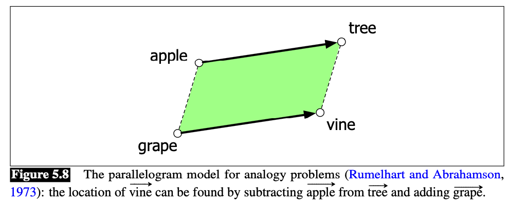

Dalam karya awal dengan sparse embeddings, para sarjana menunjukkan bahwa sparse vector models makna dapat memecahkan masalah analogi semacam itu [Latent Relational Analysis, Turney dan Littman, 2005], namun metode jajar genjang menerima perhatian yang lebih modern karena keberhasilannya dengan vektor word2vec atau GloVe [word2vec, Mikolov et al, 2013], [Linguistic Regularities, Levy dan Goldberg, 2014], [GloVe, Pennington et al, 2014]. Sebagai contoh, hasil ekspresi $\vec{king} - \vec{man} + \vec{woman}$ (baca: vektor king dikurangi vektor man ditambah vektor woman) adalah sebuah vektor yang dekat dengan $\vec{queen}$ (baca: vektor queen). Demikian pula, $\vec{Paris} - \vec{France} + \vec{Italy}$ (baca: vektor Paris dikurangi vektor France ditambah vektor Italy) menghasilkan sebuah vektor yang dekat dengan $\vec{Rome}$ (baca: vektor Rome). Dengan demikian model embedding tampaknya mengekstraksi representasi hubungan seperti MALE-FEMALE, atau CAPITAL-CITY-OF, atau bahkan COMPARATIVE/SUPERLATIVE, seperti yang ditunjukkan pada Gbr. 5.9 dari GloVe.

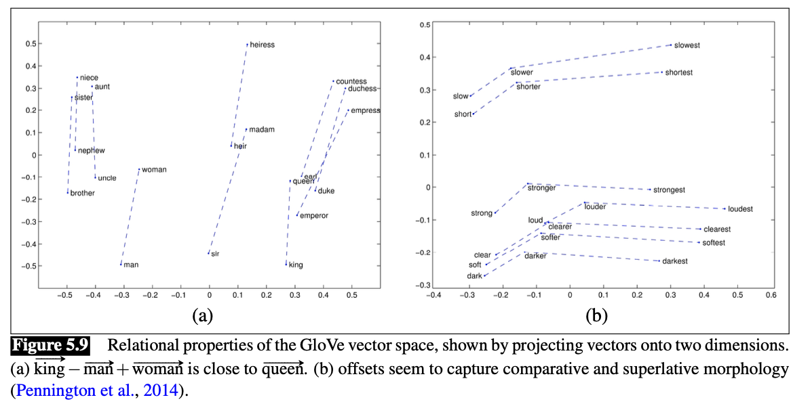

Untuk masalah $a : b :: a^* : b^*$ (baca: a banding b sama dengan a bintang banding b bintang), yang berarti algoritma diberikan vektor $a$, $b$, dan $a^*$ serta harus menemukan $b^*$, metode jajar genjangnya adalah:

$$\hat{b}^* = \operatorname*{argmin}_x \text{distance}(x, b - a + a^*) \quad (5.28)$$

(baca: b topipengestimasi bintang sama dengan argumen minimum dari x untuk fungsi jarak x koma b dikurangi a ditambah a bintang)

dengan beberapa fungsi jarak (distance function), seperti Euclidean distance.

Terdapat beberapa peringatan (caveats). Sebagai contoh, nilai terdekat yang dikembalikan oleh algoritma jajar genjang dalam ruang embedding word2vec atau GloVe biasanya bukanlah $b^*$ pada kenyataannya, melainkan salah satu dari 3 kata input atau varian morfologisnya (yaitu, $cherry:red :: potato:x$ mengembalikan potato atau potatoes alih-alih brown), jadi kata-kata ini harus dikecualikan secara eksplisit. Lebih jauh lagi, meskipun ruang embedding berkinerja baik jika tugas melibatkan kata-kata yang sering muncul, jarak yang kecil, dan hubungan tertentu (seperti menghubungkan negara dengan ibu kotanya atau kata kerja/kata benda dengan bentuk infleksinya), metode jajar genjang dengan embeddings tidak bekerja sebaik itu untuk hubungan lain [Issues in evaluating semantic spaces, Linzen, 2016], [Analogy-based detection, Gladkova et al, 2016], [The word analogy testing, Schluter, 2018], [Understanding Undesirable Word Embedding Associations, Ethayarajh et al, 2019], dan memang [Parallelograms, Peterson et al, 2020] berpendapat bahwa metode jajar genjang secara umum terlalu sederhana untuk memodelkan proses kognitif manusia dalam membentuk analogi semacam ini.

### 5.7.1 - Embeddings and Historical Semantics

Embeddings juga dapat menjadi perangkat yang berguna untuk mempelajari bagaimana makna berubah seiring waktu, dengan menghitung beberapa embedding spaces, masing-masing dari teks yang ditulis pada periode waktu tertentu. Sebagai contoh, Gbr. 5.10 memperlihatkan visualisasi perubahan makna dalam kata-kata bahasa Inggris selama dua abad terakhir, yang dihitung dengan membangun embedding spaces terpisah untuk setiap dekade dari korpus historis seperti Google n-grams [Syntactic Annotations, Lin et al, 2012] dan Corpus of Historical American English [COHA, Davies, 2012].

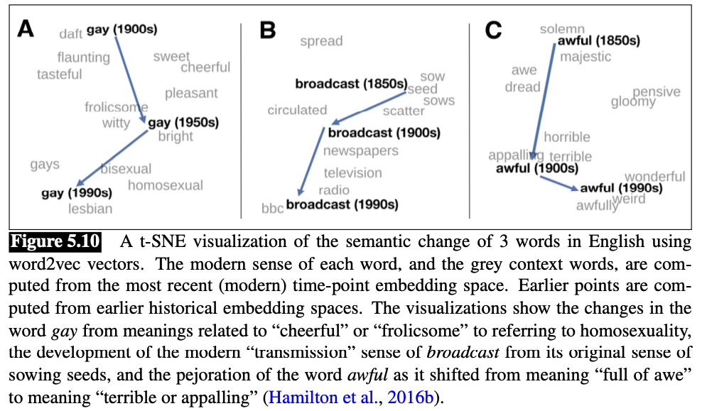

Gambar 5.10 Visualisasi t-SNE dari perubahan semantik 3 kata dalam bahasa Inggris menggunakan vektor SGNS word2vec. Sense modern dari setiap kata, dan kata-kata konteks berwarna abu-abu, dihitung dari embedding space titik waktu terkini (modern). Titik-titik yang lebih awal dihitung dari embedding spaces historis yang lebih lampau. Visualisasi tersebut memperlihatkan perubahan pada kata gay dari makna yang berkaitan dengan "cheerful" (ceria) atau "frolicsome" (riang) menjadi merujuk pada homoseksualitas, perkembangan sense modern "transmission" dari broadcast dari sense aslinya yakni menabur benih, dan pejorasi kata awful saat ia bergeser dari makna "full of awe" (penuh kekaguman) menjadi bermakna "terrible atau appalling" (mengerikan) [Diachronic Word Embeddings, Hamilton et al, 2016].


### 5.8 - Bias and Embeddings

Selain kemampuannya untuk mempelajari makna kata dari teks, embeddings, sayangnya, juga mereproduksi bias implisit dan stereotip yang tersembunyi (latent) dalam teks tersebut. Sebagaimana yang baru saja ditunjukkan oleh bagian sebelumnya, embeddings dapat memodelkan relational similarity secara kasar: 'queen' sebagai kata terdekat dengan 'king' - 'man' + 'woman' menyiratkan analogi $man:woman::king:queen$ (baca: man banding woman sama dengan king banding queen). Namun analogi embedding yang sama ini juga menunjukkan stereotip gender. Sebagai contoh [Man is to Computer Programmer, Bolukbasi et al, 2016] menemukan bahwa pekerjaan terdekat dengan 'computer programmer' - 'man' + 'woman' dalam embeddings word2vec yang dilatih pada teks berita adalah 'homemaker', dan bahwa embeddings tersebut secara serupa menyarankan analogi 'father' terhadap 'doctor' sebagaimana 'mother' terhadap 'nurse'. Hal ini dapat mengakibatkan apa yang disebut oleh [The Trouble with Bias, Crawford, 2017] dan [Language (Technology) is Power, Blodgett et al, 2020] sebagai allocational harm, ketika sebuah sistem mengalokasikan sumber daya (pekerjaan atau kredit) secara tidak adil kepada kelompok yang berbeda. Sebagai contoh, algoritma yang menggunakan embeddings sebagai bagian dari pencarian untuk mempekerjakan calon pemrogram atau dokter mungkin dengan demikian secara keliru menurunkan bobot (downweight) dokumen dengan nama wanita.

Ternyata embeddings tidak hanya mencerminkan statistik inputnya, tetapi juga memperkuat bias (amplify bias); istilah bergender menjadi lebih bergender dalam embedding space dibandingkan dalam statistik teks input [Men Also Like Shopping, Zhao et al, 2017], [Understanding Undesirable Word Embedding Associations, Ethayarajh et al, 2019], [Mitigating Gender Bias, Jia et al, 2020], dan bias menjadi lebih dibesar-besarkan daripada dalam statistik ketenagakerjaan aktual [Word Embeddings Quantify 100 Years of Gender and Ethnic Stereotypes, Garg et al, 2018].

Embeddings juga menyandikan asosiasi implisit yang merupakan properti dari penalaran manusia. Implicit Association Test [Measuring Individual Differences, Greenwald et al, 1998] mengukur asosiasi orang antara konsep (seperti 'bunga' atau 'serangga') dan atribut (seperti 'menyenangkan' dan 'tidak menyenangkan') dengan mengukur perbedaan latensi saat mereka melabeli kata-kata dalam berbagai kategori. Menggunakan metode tersebut, orang-orang di Amerika Serikat telah terbukti mengasosiasikan nama-nama Afrika-Amerika dengan kata-kata yang tidak menyenangkan (lebih daripada nama-nama Eropa-Amerika), nama laki-laki lebih dengan matematika dan nama perempuan dengan seni, dan nama orang tua dengan kata-kata yang tidak menyenangkan [Measuring Individual Differences, Greenwald et al, 1998], [Harvesting Implicit Group Attitudes, Nosek et al, 2002], [Math = Male, Me = Female, Nosek et al, 2002]. [Semantics derived automatically, Caliskan et al, 2017] mereplikasi semua temuan asosiasi implisit ini menggunakan vektor GloVe dan cosine similarity alih-alih latensi manusia. Sebagai contoh, nama-nama Afrika-Amerika seperti 'Leroy' dan 'Shaniqua' memiliki cosine GloVe yang lebih tinggi dengan kata-kata yang tidak menyenangkan sementara nama-nama Eropa-Amerika ('Brad', 'Greg', 'Courtney') memiliki cosine yang lebih tinggi dengan kata-kata yang menyenangkan. Masalah-masalah dengan embeddings ini adalah contoh dari representational harm [The Trouble with Bias, Crawford, 2017], [Language (Technology) is Power, Blodgett et al, 2020], yang merupakan bahaya yang disebabkan oleh sistem yang merendahkan atau bahkan mengabaikan kelompok sosial tertentu. Algoritma sadar-embedding apa pun yang memanfaatkan sentimen kata dengan demikian dapat memperburuk bias terhadap orang Afrika-Amerika.

Penelitian terbaru berfokus pada cara-cara untuk mencoba menghapus jenis bias ini, misalnya dengan mengembangkan transformasi ruang embedding yang menghapus stereotip gender namun mempertahankan gender definisional [Man is to Computer Programmer, Bolukbasi et al, 2016], [Men Also Like Shopping, Zhao et al, 2017] atau mengubah prosedur pelatihan [Learning Gender-Neutral Word Embeddings, Zhao et al, 2018]. Namun, meskipun jenis debiasing ini dapat mengurangi bias dalam embeddings, hal tersebut tidak menghilangkannya [Lipstick on a Pig, Gonen dan Goldberg, 2019], dan ini tetap menjadi masalah terbuka.

Embeddings historis juga sedang digunakan untuk mengukur bias di masa lalu. [Word Embeddings Quantify 100 Years of Gender and Ethnic Stereotypes, Garg et al, 2018] menggunakan embeddings dari teks historis untuk mengukur asosiasi antara embeddings untuk pekerjaan dan embeddings untuk nama dari berbagai etnis atau gender (sebagai contoh cosine similarity relatif nama perempuan versus laki-laki terhadap kata pekerjaan seperti 'librarian' atau 'carpenter') sepanjang abad ke-20. Mereka menemukan bahwa cosine berkorelasi dengan persentase historis empiris perempuan atau kelompok etnis dalam pekerjaan-pekerjaan tersebut. Embeddings historis juga mereplikasi survei lama mengenai stereotip etnis; kecenderungan partisipan eksperimental pada tahun 1933 untuk mengasosiasikan kata sifat seperti 'industrious' atau 'superstitious' dengan, misalnya, etnis Tionghoa, berkorelasi dengan cosine antara nama belakang Tionghoa dan kata sifat tersebut menggunakan embeddings yang dilatih pada teks tahun 1930-an. Mereka juga mampu mendokumentasikan bias gender historis, seperti fakta bahwa embeddings untuk kata sifat yang terkait dengan kompetensi ('smart', 'wise', 'thoughtful', 'resourceful') memiliki cosine yang lebih tinggi dengan kata laki-laki daripada perempuan, dan menunjukkan bahwa bias ini telah perlahan menurun sejak tahun 1960. Kami akan kembali membahas pertanyaan mengenai peran bias dalam natural language processing ini di bab-bab selanjutnya.


### 5.9 - Evaluating Vector Models

Metrik evaluasi terpenting untuk model vektor adalah evaluasi ekstrinsik (extrinsic evaluation) pada tugas-tugas terapan, yaitu, menggunakan vektor dalam sebuah tugas Natural Language Processing (NLP) dan melihat apakah hal ini meningkatkan kinerja dibandingkan dengan model lainnya.  Meskipun demikian, memiliki evaluasi intrinsik (intrinsic evaluations) juga merupakan hal yang berguna. Metrik yang paling umum adalah menguji kinerjanya pada tugas keserupaan (similarity), dengan menghitung korelasi antara skor keserupaan kata dari sebuah algoritma dan peringkat keserupaan kata yang diberikan oleh manusia.

WordSim-353 [WordSim-353, Finkelstein et al, 2002] adalah sekumpulan peringkat dari 0 hingga 10 yang umum digunakan untuk 353 pasangan kata benda; sebagai contoh (plane, car) memiliki skor rata-rata 5,77. SimLex-999 [SimLex-999, Hill et al, 2015] adalah dataset yang lebih kompleks yang mengkuantifikasi keserupaan (similarity)—seperti (cup, mug)—alih-alih keterkaitan (relatedness)—seperti (cup, coffee)—serta mencakup pasangan kata sifat, kata benda, dan kata kerja yang konkret maupun abstrak.  Dataset TOEFL adalah sekumpulan 80 pertanyaan, masing-masing terdiri dari satu kata target dengan 4 pilihan kata tambahan; tugasnya adalah memilih mana sinonim yang tepat, seperti dalam contoh: Levied memiliki makna yang paling dekat dengan: imposed, believed, requested, correlated [LSA, Landauer dan Dumais, 1997]. Semua dataset ini menyajikan kata-kata tanpa konteks.

Tugas keserupaan intrinsik yang mencakup konteks sedikit lebih realistis. Dataset Stanford Contextual Word Similarity (SCWS) [SCWS, Huang et al, 2012] dan dataset Word-in-Context (WiC) [WiC, Pilehvar dan Camacho-Collados, 2019] menawarkan skenario evaluasi yang lebih kaya. SCWS memberikan penilaian manusia pada 2.003 pasangan kata dalam konteks kalimatnya, sementara WiC memberikan kata-kata target dalam dua konteks kalimat yang berada dalam makna (senses) yang sama atau berbeda; lihat Lampiran G. Tugas keserupaan tekstual semantik (semantic textual similarity) [SemEval STS, Agirre et al, 2012], [SemEval STS, Agirre et al, 2015] mengevaluasi kinerja algoritma keserupaan tingkat kalimat, yang terdiri dari sekumpulan pasangan kalimat, di mana setiap pasangan memiliki skor keserupaan yang dilabeli oleh manusia.

Tugas lain yang digunakan untuk evaluasi adalah tugas analogi (analogy task), yang dibahas pada halaman 112, di mana sistem harus memecahkan masalah dalam bentuk $a$ berbanding $b$ sebagaimana $a^*$ berbanding $b^*$ (baca: a banding b sama dengan a bintang banding b bintang), jika diberikan $a$, $b$, dan $a^*$ serta harus menemukan $b^*$ [Latent Relational Analysis, Turney dan Littman, 2005].  Sejumlah himpunan tuples telah dibuat untuk tugas ini [word2vec, Mikolov et al, 2013], [word2vec, Mikolov et al, 2013], [BATS, Gladkova et al, 2016], yang mencakup morfologi (city:cities::child:children), hubungan leksikografis (leg:table::spout:teapot), dan hubungan ensiklopedia (Beijing:China::Dublin:Ireland), beberapa di antaranya diambil dari dataset SemEval-2012 Task 2 yang terdiri dari 79 hubungan yang berbeda [SemEval-2012 Task 2, Jurgens et al, 2012].

Semua algoritma embedding mengalami variabilitas inheren (inherent variability). Sebagai contoh, karena keacakan dalam inisialisasi dan random negative sampling, algoritma seperti word2vec dapat menghasilkan keluaran yang berbeda bahkan dari dataset yang sama, dan dokumen individu dalam sebuah koleksi dapat sangat memengaruhi embeddings yang dihasilkan [Embedding Variability, Tian et al, 2016], [Embedding Reliability, Hellrich dan Hahn, 2016], [Bootstrapped Embeddings, Antoniak dan Mimno, 2018]. Oleh karena itu, ketika embeddings digunakan untuk mempelajari asosiasi kata dalam korpus tertentu, praktik terbaik adalah melatih beberapa embeddings dengan bootstrap sampling pada dokumen dan merata-ratakan hasilnya [Bootstrapped Embeddings, Antoniak dan Mimno, 2018].

### 5.10 - Summary

Dalam vector semantics, sebuah kata dimodelkan sebagai vektor—sebuah titik dalam ruang berdimensi tinggi, yang juga disebut sebagai embedding. Dalam bab ini kami berfokus pada static embeddings, di mana setiap kata dipetakan ke embedding yang tetap.

Model vector semantic terbagi menjadi dua kelas: sparse (jarang) dan dense (padat). Dalam model sparse, setiap dimensi berkorespondensi dengan sebuah kata dalam kosakata $V$ (baca: ve), dan sel-sel merupakan fungsi dari hitungan kemunculan bersama (co-occurrence counts). Matriks word-context atau term-term memiliki satu baris untuk setiap kata (target) dalam kosakata dan satu kolom untuk setiap istilah konteks dalam kosakata.

Model vektor dense biasanya memiliki dimensionalitas 50–1000. Algoritma word2vec seperti skip-gram adalah cara populer untuk menghitung dense embeddings. Skip-gram melatih pengklasifikasi logistic regression untuk menghitung probabilitas bahwa dua kata 'kemungkinan muncul berdekatan dalam teks'. Probabilitas ini dihitung dari dot product antara embeddings untuk kedua kata tersebut.

Skip-gram menggunakan stochastic gradient descent untuk melatih pengklasifikasi tersebut, dengan mempelajari embeddings yang memiliki dot product tinggi dengan embeddings kata-kata yang muncul berdekatan dan dot product rendah dengan kata-kata derau (noise words).

Algoritma embedding penting lainnya mencakup GloVe, sebuah metode yang didasarkan pada rasio probabilitas kemunculan bersama kata.

Baik menggunakan vektor sparse maupun dense, keserupaan kata dan dokumen dihitung oleh beberapa fungsi dot product antar vektor. Cosine dari dua vektor—sebuah normalized dot product—adalah metrik yang paling populer untuk hal tersebut.


### 5.11 - Historical Notes
Gagasan mengenai vector semantics muncul dari penelitian pada tahun 1950-an di tiga bidang yang berbeda: linguistik, psikologi, dan ilmu komputer, yang masing-masing berkontribusi pada aspek mendasar dari model tersebut.

Gagasan bahwa makna berkaitan dengan distribusi kata dalam konteks tersebar luas dalam teori linguistik tahun 1950-an, di kalangan penganut aliran distribusionalis (distributionalists) seperti Zellig Harris, Martin Joos, dan J. R. Firth, serta para ahli semiotika (semioticians) seperti Thomas Sebeok. Sebagaimana dinyatakan oleh [Description of Language Design, Joos, 1950],

"makna" linguis dari sebuah morfem... menurut definisinya adalah himpunan probabilitas bersyarat dari kemunculannya dalam konteks dengan semua morfem lainnya.

Gagasan bahwa makna sebuah kata mungkin dimodelkan sebagai titik dalam semantic space (ruang semantik) multidimensi berasal dari para psikolog seperti Charles E. Osgood, yang telah mempelajari bagaimana orang merespons makna kata dengan menetapkan nilai di sepanjang skala seperti happy/sad (senang/sedih) atau hard/soft (keras/lunak).  [The Measurement of Meaning, Osgood et al, 1957] mengusulkan bahwa makna sebuah kata secara umum dapat dimodelkan sebagai titik dalam Euclidean space multidimensi, dan bahwa keserupaan makna antara dua kata dapat dimodelkan sebagai jarak antara titik-titik ini dalam ruang tersebut.

Sumber intelektual terakhir pada tahun 1950-an dan awal 1960-an adalah bidang yang saat itu disebut mechanical indexing, yang sekarang dikenal sebagai information retrieval (temu kembali informasi). Dalam apa yang kemudian dikenal sebagai vector space model untuk information retrieval [The SMART Retrieval System, Salton, 1971], [Synonymy and Semantic Classification, Sparck Jones, 1986], para peneliti mendemonstrasikan cara-cara baru untuk mendefinisikan makna kata dalam bentuk vektor [Vector Space Measures, Switzer, 1965], dan menyempurnakan metode untuk keserupaan kata berdasarkan ukuran asosiasi statistik antar kata seperti mutual information [The Interpretation of Word Associations, Giuliano, 1965] dan idf [A Statistical Interpretation of Term Specificity, Sparck Jones, 1972], serta menunjukkan bahwa makna dokumen dapat direpresentasikan dalam vector spaces yang sama yang digunakan untuk kata-kata. Sekitar waktu yang sama, [L'analyse Factorielle, Cordier, 1965] menunjukkan bahwa factor analysis dari probabilitas asosiasi kata dapat digunakan untuk membentuk representasi vektor dense dari kata-kata.

Beberapa landasan filosofis dari cara berpikir distribusional berasal dari tulisan-tulisan akhir filsuf Wittgenstein, yang skeptis terhadap kemungkinan membangun teori definisi makna formal yang lengkap untuk setiap kata. Wittgenstein justru menyarankan bahwa "makna sebuah kata adalah penggunaannya dalam bahasa" [Philosophical Investigations, Wittgenstein, 1953]. Artinya, alih-alih menggunakan bahasa logika tertentu untuk mendefinisikan setiap kata, atau mengacu pada denotasi atau nilai kebenaran (truth values), gagasan Wittgenstein adalah bahwa kita harus mendefinisikan sebuah kata berdasarkan bagaimana kata itu digunakan oleh orang-orang dalam berbicara dan memahami dalam interaksi sehari-hari mereka, yang dengan demikian memberikan gambaran awal bagi pergerakan menuju model embodied dan experiential dalam linguistik dan NLP [Indexical understanding of instructions, Glenberg dan Robertson, 2000], [Word meaning in minds and machines, Lake dan Murphy, 2021], [Experience Grounds Language, Bisk et al, 2020], [Climbing towards NLU, Bender dan Koller, 2020].

Yang berhubungan lebih jauh adalah gagasan mendefinisikan kata dengan vektor fitur diskrit (vector of discrete features), yang berakar setidaknya sejauh masa Descartes dan Leibniz [Semantics, Wierzbicka, 1992], [Semantics: Primes and Universals, Wierzbicka, 1996]. Pada pertengahan abad ke-20, dimulai dengan karya Hjelmslev [Prolegomena, Hjelmslev, 1969] (awalnya 1943) dan diperjelas dalam model awal tata bahasa generatif (generative grammar) [Semantic Theory, Katz dan Fodor, 1963], muncul gagasan untuk merepresentasikan makna dengan fitur semantik (semantic features), simbol yang merepresentasikan semacam makna primitif. Sebagai contoh, kata-kata seperti hen (ayam betina), rooster (ayam jantan), atau chick (anak ayam), memiliki kesamaan (semuanya mendeskripsikan ayam) dan perbedaan (usia dan jenis kelaminnya), yang dapat direpresentasikan sebagai:

hen: +female, +chicken, +adult (baca: plus female, plus chicken, plus adult)

rooster: -female, +chicken, +adult (baca: min female, plus chicken, plus adult)

chick: +chicken, -adult (baca: plus chicken, min adult)

Dimensi yang digunakan oleh model vektor makna untuk mendefinisikan kata, bagaimanapun, hanya berhubungan secara abstrak dengan gagasan mengenai sejumlah kecil dimensi tetap yang dibuat secara manual ini. Meskipun demikian, terdapat beberapa upaya untuk menunjukkan bahwa dimensi tertentu dari model embedding memang berkontribusi pada aspek komposisional makna tertentu seperti semantic features awal ini.

Penggunaan vektor dense untuk memodelkan makna kata, dan memang istilah embedding, tumbuh dari model latent semantic indexing (LSI) [LSI, Deerwester et al, 1988] yang disusun ulang sebagai LSA (latent semantic analysis) [LSA, Deerwester et al, 1990]. Dalam LSA, singular value decomposition—SVD—diterapkan pada term-document matrix (setiap sel dibobotkan dengan log frekuensi dan dinormalisasi dengan entropi), dan kemudian 300 dimensi pertama digunakan sebagai LSA embedding. Singular Value Decomposition (SVD) adalah metode untuk menemukan dimensi terpenting dari sebuah dataset, dimensi-dimensi di mana data paling bervariasi. LSA kemudian dengan cepat diterapkan secara luas: sebagai model kognitif [LSA, Landauer dan Dumais, 1997], dan untuk tugas-tugas seperti pemeriksaan ejaan [Spell Checking, Jones dan Martin, 1997], language modeling [LSA LM, Bellegarda, 1997], [LSA LM, Coccaro dan Jurafsky, 1998], [LSA LM, Bellegarda, 2000], induksi morfologi [Morphology Induction, Schone dan Jurafsky, 2000], [Morphology Induction, Schone dan Jurafsky, 2001], ekspresi multi-kata (MWEs) [MWE Induction, Schone dan Jurafsky, 2001], dan penilaian esai [Essay Grading, Rehder et al, 1998]. Model terkait dikembangkan secara simultan dan diterapkan pada word sense disambiguation oleh Schütze [WSD, Schütze, 1992].

LSA juga mengarah pada penggunaan paling awal dari embeddings untuk merepresentasikan kata dalam pengklasifikasi probabilistik, dalam logistic regression document router dari [Document Router, Schütze et al, 1995]. Gagasan SVD pada term-term matrix (alih-alih term-document matrix) sebagai model makna untuk NLP diusulkan segera setelah LSA oleh [WSD, Schütze, 1992]. Schütze menerapkan embeddings low-rank (97-dimensi) yang dihasilkan oleh SVD pada tugas word sense disambiguation, menganalisis ruang semantik yang dihasilkan, dan juga menyarankan teknik yang memungkinkan seperti membuang dimensi orde tinggi. Lihat [Ambiguity Resolution, Schütze, 1997].

Sejumlah model matriks alternatif mengikuti karya awal SVD ini, termasuk Probabilistic Latent Semantic Indexing (PLSI) [PLSI, Hofmann, 1999], Latent Dirichlet Allocation (LDA) [LDA, Blei et al, 2003], dan Non-negative Matrix Factorization (NMF) [NMF, Lee dan Seung, 1999].

Komunitas LSA tampaknya pertama kali menggunakan kata "embedding" dalam [LSA, Landauer et al, 1997], dalam varian makna matematisnya sebagai pemetaan dari satu ruang atau struktur matematika ke ruang atau struktur lainnya. Dalam LSA, word embedding tampaknya mendeskripsikan pemetaan dari ruang vektor hitungan sparse ke ruang laten vektor dense SVD. Meskipun kata tersebut dengan demikian awalnya bermakna pemetaan dari satu ruang ke ruang lain, kata tersebut telah bergeser secara metonimik untuk bermakna vektor dense yang dihasilkan dalam ruang laten tersebut, dan dalam pengertian inilah kita saat ini menggunakan kata tersebut.

Pada dekade berikutnya, [Neural LM, Bengio et al, 2003] dan [Neural LM, Bengio et al, 2006] menunjukkan bahwa neural language models juga dapat digunakan untuk mengembangkan embeddings sebagai bagian dari tugas prediksi kata. [SENN, Collobert dan Weston, 2007], [SENN, Collobert dan Weston, 2008], dan [NLP from Scratch, Collobert et al, 2011] kemudian mendemonstrasikan bahwa embeddings dapat digunakan untuk merepresentasikan makna kata bagi sejumlah tugas NLP. [Word Representations, Turian et al, 2010] membandingkan nilai dari berbagai jenis embeddings untuk tugas NLP yang berbeda. [RNN LM, Mikolov et al, 2011] menunjukkan bahwa recurrent neural nets dapat digunakan sebagai language models. Gagasan menyederhanakan hidden layer dari neural net language models ini untuk menciptakan algoritma skip-gram (dan juga CBOW) diusulkan oleh [Word2Vec, Mikolov et al, 2013]. Algoritma pelatihan negative sampling diusulkan dalam [Word2Vec, Mikolov et al, 2013]. Terdapat banyak survei mengenai static embeddings dan parameternya [Semantic Representations, Bullinaria dan Levy, 2007], [Semantic Representations, Bullinaria dan Levy, 2012], [Distributional Semantics, Lapesa dan Evert, 2014], [Distributional Semantics, Kiela dan Clark, 2014], [Distributional Similarity, Levy et al, 2015].

Lihat [IIR, Manning et al, 2008] dan Bab 11 untuk pemahaman yang lebih mendalam mengenai peran vektor dalam information retrieval, termasuk cara membandingkan kueri dengan dokumen, detail lebih lanjut mengenai tf-idf, dan masalah penskalaan ke datasets yang sangat besar. Lihat [Word2vec Tutorial, Kim, 2019] untuk tutorial yang jelas dan komprehensif mengenai word2vec. [Lexical Semantics, Cruse, 2004] adalah teks linguistik pengantar yang berguna mengenai lexical semantics.

### 5.12 - Exercises

## 6 - Neural Networks

*Neural networks* adalah perangkat komputasi fundamental untuk pemrosesan bahasa, dan merupakan perangkat yang sangat tua. Mereka disebut "neural" karena asal-usulnya terletak pada *McCulloch-Pitts neuron* [*McCulloch-Pitts neuron*, McCulloch dan Pitts, 1943], sebuah model sederhana dari neuron biologis sebagai sejenis elemen komputasi yang dapat dideskripsikan dalam istilah logika proposisional. Namun, penggunaan modern dalam pemrosesan bahasa tidak lagi mengacu pada inspirasi biologis awal ini.

Alih-alih, sebuah *neural network* modern adalah jaringan unit-unit komputasi kecil, yang masing-masing mengambil vektor nilai input dan menghasilkan nilai output tunggal. Dalam bab ini kami memperkenalkan *neural net* yang diterapkan pada klasifikasi. Arsitektur yang kami perkenalkan disebut *feedforward network* [arti: jaringan di mana informasi mengalir ke satu arah, ke depan, dari input ke output] karena komputasi berjalan secara iteratif dari satu lapisan unit ke lapisan berikutnya. Penggunaan *neural nets* modern sering disebut *deep learning*, karena jaringan modern sering kali bersifat *deep* (memiliki banyak lapisan).

*Neural networks* berbagi banyak matematika yang sama dengan *logistic regression*. Namun, *neural networks* adalah pengklasifikasi yang lebih kuat daripada *logistic regression*, dan memang sebuah *neural network* minimal (secara teknis yang memiliki satu '*hidden layer*' [arti: lapisan tersembunyi di antara lapisan input dan output]) dapat ditunjukkan mampu mempelajari fungsi apa pun.

Pengklasifikasi *neural net* berbeda dari *logistic regression* dalam cara lain. Dengan *logistic regression*, kami menerapkan pengklasifikasi regresi pada banyak tugas yang berbeda dengan mengembangkan berbagai jenis *feature templates* yang kaya berdasarkan pengetahuan domain. Saat bekerja dengan *neural networks*, lebih umum untuk menghindari sebagian besar penggunaan fitur yang diturunkan secara manual (*hand-derived*), dan alih-alih membangun *neural networks* yang mengambil token mentah (*raw tokens*) sebagai input dan belajar untuk menginduksi fitur sebagai bagian dari proses belajar untuk mengklasifikasi. Kita telah melihat contoh *representation learning* semacam ini untuk *embeddings* di Bab 5, dan kita akan melihat banyak contoh setelah kita mulai mempelajari *deep transformers networks*. *Nets* yang sangat dalam sangat baik dalam *representation learning*. Oleh karena itu, *deep neural nets* adalah alat yang tepat untuk tugas-tugas yang menawarkan data yang cukup untuk mempelajari fitur secara otomatis.

Dalam bab ini kami akan memperkenalkan *feedforward networks* sebagai pengklasifikasi, pertama dengan fitur yang dibuat secara manual (*hand-built*), dan kemudian menggunakan *embeddings* yang kita pelajari di Bab 5. Pada bab-bab selanjutnya kami akan memperkenalkan banyak jenis model *neural* lainnya, yang paling penting adalah *transformer* dan *attention*, (Bab 8), tetapi juga *recurrent neural networks* (Bab 13) dan *convolutional neural networks* (Bab 15). Dan pada bab berikutnya kami akan memperkenalkan paradigma *neural large language models*.

### 6.1 - Units
Blok bangunan dari sebuah neural network adalah unit komputasi tunggal. Sebuah unit mengambil sekumpulan bilangan bernilai riil (real valued numbers) sebagai input, melakukan sejumlah komputasi pada bilangan-bilangan tersebut, dan menghasilkan sebuah output.

Pada intinya, sebuah neural unit mengambil jumlah terbobot (weighted sum) dari input-inputnya, dengan satu suku tambahan dalam penjumlahan tersebut yang disebut suku bias (bias term). Diberikan sekumpulan input $x_1...x_n$, sebuah unit memiliki sekumpulan bobot (weights) yang berkorespondensi $w_1...w_n$ dan sebuah bias $b$, sehingga jumlah terbobot $z$ dapat direpresentasikan sebagai:

$$z = b + \sum_i w_i x_i \quad (6.1)$$

(baca: ze sama dengan be—bias ditambah jumlah dari i dari we sub-i—bobot dikali eks sub-i—input)

Sering kali lebih mudah untuk menyatakan jumlah terbobot ini menggunakan notasi vektor; ingat kembali dari aljabar linier bahwa sebuah vektor, pada intinya, hanyalah sebuah daftar atau larik angka. Oleh karena itu, kita akan membicarakan $z$ dalam istilah vektor bobot $w$, bias skalar $b$, dan vektor input $x$, dan kita akan mengganti penjumlahan tersebut dengan dot product yang praktis:

$$z = w \cdot x + b \quad (6.2)$$

(baca: ze sama dengan we—vektor bobot dot eks—vektor input ditambah be—bias)

Sebagaimana didefinisikan dalam Pers. 6.2, $z$ hanyalah bilangan bernilai riil.

Akhirnya, alih-alih menggunakan $z$, sebuah fungsi linier dari $x$, sebagai output, neural units menerapkan fungsi non-linier $f$ pada $z$. Kami akan menyebut output dari fungsi ini sebagai activation value (nilai aktivasi) untuk unit tersebut, $a$. Karena kita hanya memodelkan satu unit tunggal, aktivasi untuk node tersebut pada kenyataannya adalah output akhir dari jaringan, yang secara umum akan kita sebut $y$. Jadi nilai $y$ didefinisikan sebagai:

$$y = a = f(z)$$

(baca: ye sama dengan a sama dengan ef dari ze)

Kita akan membahas tiga fungsi non-linier $f$ yang populer di bawah ini (sigmoid, tanh, dan rectified linear unit atau ReLU) namun secara pedagogis lebih mudah untuk memulai dengan fungsi sigmoid karena kita telah melihatnya di Bab 4:

$$y = \sigma(z) = \frac{1}{1 + e^{-z}} \quad (6.3)$$

(baca: ye sama dengan sigma ze sama dengan satu per satu ditambah e pangkat min ze)

Sigmoid (ditunjukkan pada Gbr. 6.1) memiliki sejumlah keunggulan; ia memetakan output ke dalam rentang (0,1), yang berguna dalam menekan outliers [arti: data pencilan/ekstrim] menuju 0 atau 1. Dan fungsi ini bersifat differentiable (dapat diturunkan), yang seperti kita lihat di Bagian 4.15 akan berguna untuk pembelajaran.

Gambar 6.1 Fungsi sigmoid mengambil nilai riil dan memetakannya ke rentang (0,1). Fungsi ini hampir linier di sekitar 0 tetapi nilai-nilai outlier ditekan menuju 0 atau 1.
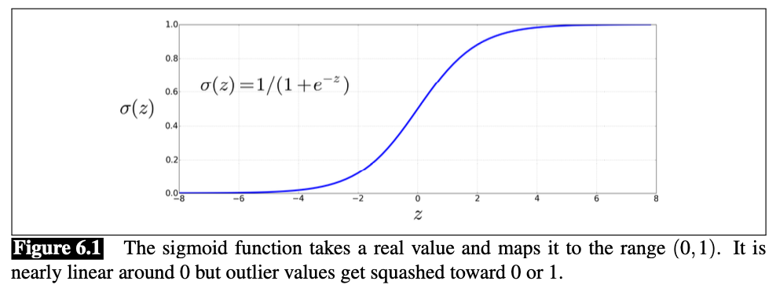


Mensubstitusikan Pers. 6.2 ke dalam Pers. 6.3 memberikan kita output dari sebuah neural unit:

$$y = \sigma(w \cdot x + b) = \frac{1}{1 + \exp(-(w \cdot x + b))} \quad (6.4)$$

(baca: ye sama dengan sigma dari we dot eks ditambah be sama dengan satu per satu ditambah eksponensial dari min we dot eks ditambah be)

Gbr. 6.2 menunjukkan skema akhir dari neural unit dasar. Dalam contoh ini unit tersebut mengambil 3 nilai input $x_1, x_2$, dan $x_3$, dan menghitung jumlah terbobot, mengalikan setiap nilai dengan sebuah bobot (masing-masing $w_1, w_2$, dan $w_3$), menambahkannya ke suku bias $b$, dan kemudian melewatkan jumlah yang dihasilkan melalui fungsi sigmoid untuk menghasilkan angka antara 0 dan 1.

Gambar 6.2 Sebuah neural unit, yang mengambil 3 input $x_1, x_2$, dan $x_3$ (dan sebuah bias $b$ yang kita representasikan sebagai bobot untuk input yang dikunci pada nilai +1) dan menghasilkan output $y$. Kami menyertakan beberapa variabel perantara yang memudahkan: output dari penjumlahan, $z$, dan output dari sigmoid, $a$. Dalam kasus ini output unit $y$ sama dengan $a$, namun dalam jaringan yang lebih dalam (deeper networks) kita akan mencadangkan $y$ untuk mengartikan output akhir dari keseluruhan jaringan, membiarkan $a$ sebagai aktivasi node individu.
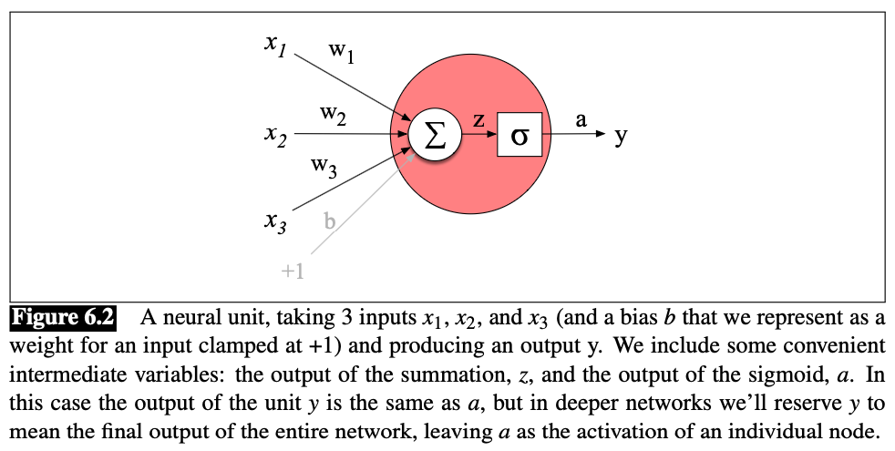


Mari kita telusuri sebuah contoh hanya untuk mendapatkan intuisi. Mari kita misalkan kita memiliki unit dengan vektor bobot dan bias berikut:

$w = [0.2, 0.3, 0.9]$

$b = 0.5$

Apa yang akan dilakukan unit ini dengan vektor input berikut:

$x = [0.5, 0.6, 0.1]$

Output $y$ yang dihasilkan adalah:

$$y = \sigma(w \cdot x + b) = \frac{1}{1 + e^{-(w \cdot x + b)}}$$

$$= \frac{1}{1 + e^{-(0.5 \times 0.2 + 0.6 \times 0.3 + 0.1 \times 0.9 + 0.5)}}$$

$$= \frac{1}{1 + e^{-0.87}}$$

$$= 0.70$$

Dalam praktiknya, sigmoid tidak umum digunakan sebagai activation function [arti: fungsi yang menentukan output neuron]. Fungsi yang sangat mirip namun hampir selalu lebih baik adalah fungsi tanh yang ditunjukkan pada Gbr. 6.3a; tanh adalah varian dari sigmoid yang berkisar dari -1 hingga +1:

$$y = \tanh(z) = \frac{e^z - e^{-z}}{e^z + e^{-z}} \quad (6.5)$$

(baca: ye sama dengan tanh ze sama dengan e pangkat ze dikurangi e pangkat min ze per e pangkat ze ditambah e pangkat min ze)

Activation function yang paling sederhana, dan mungkin yang paling umum digunakan, adalah rectified linear unit, yang juga disebut ReLU, yang ditunjukkan pada Gbr. 6.3b. Ini sama persis dengan $z$ ketika $z$ positif, dan 0 jika sebaliknya:

$$y = \text{ReLU}(z) = \max(z, 0) \quad (6.6)$$

(baca: ye sama dengan ReLU ze sama dengan maksimum dari ze koma nol)

Activation functions ini memiliki properti berbeda yang membuatnya berguna untuk aplikasi bahasa atau arsitektur jaringan yang berbeda. Sebagai contoh, fungsi tanh memiliki properti bagus yakni dapat diturunkan secara halus (smoothly differentiable) dan memetakan nilai-nilai outlier menuju rata-rata (mean). Fungsi rectifier, di sisi lain, memiliki properti bagus yang dihasilkan dari sifatnya yang sangat dekat dengan linier. Dalam fungsi sigmoid atau tanh, nilai $z$ yang sangat tinggi menghasilkan nilai $y$ yang saturated [arti: jenuh], yaitu, sangat dekat dengan 1, dan memiliki turunan yang sangat dekat dengan 0. Turunan nol menyebabkan masalah dalam pembelajaran, karena seperti yang akan kita lihat di Bagian 6.6, kita akan melatih jaringan dengan mempropagasikan sinyal kesalahan secara mundur (propagating an error signal backwards), mengalikan gradien (turunan parsial) dari setiap lapisan jaringan; gradien yang hampir 0 menyebabkan sinyal kesalahan menjadi semakin kecil hingga terlalu kecil untuk digunakan dalam pelatihan, sebuah masalah yang disebut vanishing gradient problem [arti: masalah gradien yang menghilang]. Rectifiers tidak memiliki masalah ini, karena turunan ReLU untuk nilai $z$ yang tinggi adalah 1, alih-alih sangat dekat dengan 0.

Gambar 6.3 Activation functions tanh dan ReLU.
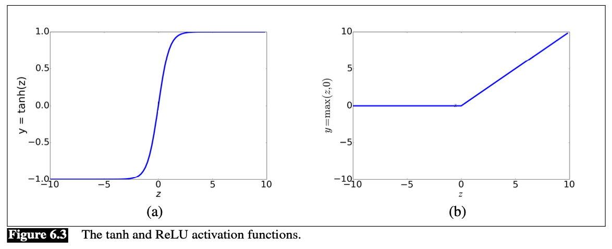

### 6.2 - The XOR problem

Pada awal sejarah neural networks, disadari bahwa kekuatan neural networks, seperti halnya neuron riil yang menginspirasinya, berasal dari penggabungan unit-unit ini menjadi jaringan yang lebih besar.

Salah satu demonstrasi paling cerdas mengenai kebutuhan akan multi-layer networks (jaringan berlapis banyak) adalah pembuktian oleh [Perceptrons, Minsky dan Papert, 1969] bahwa satu neural unit tunggal tidak dapat menghitung beberapa fungsi logika yang sangat sederhana dari inputnya. Pertimbangkan tugas menghitung fungsi logika dasar dari dua input, seperti AND, OR, dan XOR. Sebagai pengingat, berikut adalah tabel kebenaran (truth tables) untuk fungsi-fungsi tersebut:

| $x_1$ | $x_2$ | *AND* $y$  | *OR* $y$  | *XOR* $y$  |
| --- | --- | --- | --- | --- |
| 0 | 0 | 0 | 0 | 0 |
| 0 | 1 | 0 | 1 | 1 |
| 1 | 0 | 0 | 1 | 1 |
| 1 | 1 | 1 | 1 | 0 |

Contoh ini pertama kali ditunjukkan untuk perceptron [arti: algoritma pembelajaran mesin terawasi untuk pengklasifikasi biner], yang merupakan neural unit yang sangat sederhana yang memiliki output biner dan memiliki fungsi tangga (step function) yang sangat sederhana sebagai fungsi aktivasi non-liniernya. Output $y$ (baca: ye) dari sebuah perceptron adalah 0 atau 1, dan dihitung sebagai berikut (menggunakan bobot $w$ (baca: we), input $x$ (baca: eks), dan bias $b$ (baca: be) yang sama seperti pada Pers. 6.2):

$$y = \begin{cases} 0, & \text{if } w \cdot x + b \leq 0 \\ 1, & \text{if } w \cdot x + b > 0 \end{cases} \quad (6.7)$$

(baca: ye sama dengan nol jika we dot eks ditambah be kurang dari sama dengan nol; satu jika we dot eks ditambah be lebih besar dari nol)

Sangat mudah untuk membangun sebuah perceptron yang dapat menghitung fungsi logika AND dan OR dari input binernya; Gbr. 6.4 menunjukkan bobot yang diperlukan.

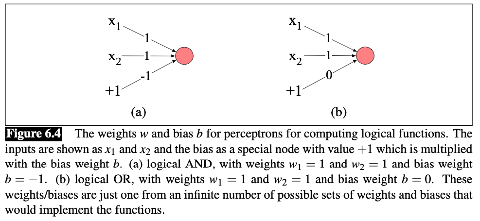

Gambar 6.4 Bobot $w$ dan bias $b$ untuk perceptrons guna menghitung fungsi logika. Input ditunjukkan sebagai $x_1$ dan $x_2$ dan bias sebagai node khusus dengan nilai +1 yang dikalikan dengan bobot bias $b$. (a) logika AND, dengan bobot $w_1 = 1$ dan $w_2 = 1$ serta bobot bias $b = -1$. (b) logika OR, dengan bobot $w_1 = 1$ dan $w_2 = 1$ serta bobot bias $b = 0$. Bobot/bias ini hanyalah satu dari jumlah tak terbatas kemungkinan himpunan bobot dan bias yang akan mengimplementasikan fungsi-fungsi tersebut.

Namun, ternyata tidak mungkin untuk membangun sebuah perceptron guna menghitung logika XOR! (Layak meluangkan waktu sejenak untuk mencobanya!)

Intuisi di balik hasil penting ini bergantung pada pemahaman bahwa sebuah perceptron adalah linear classifier [arti: pengklasifikasi linier]. Untuk input dua dimensi $x_1$ dan $x_2$, persamaan perceptron, $w_1x_1 + w_2x_2 + b = 0$ (baca: we satu eks satu ditambah we dua eks dua ditambah be sama dengan nol) adalah persamaan sebuah garis. (Kita dapat melihat ini dengan menempatkannya dalam format linier standar: $x_2 = (-w_1/w_2)x_1 + (-b/w_2)$ (baca: eks dua sama dengan min we satu per we dua kali eks satu ditambah min be per we dua).) Garis ini bertindak sebagai decision boundary [arti: batas keputusan] dalam ruang dua dimensi di mana output 0 ditetapkan untuk semua input yang terletak di satu sisi garis, dan output 1 untuk semua titik input yang terletak di sisi lain garis. Jika kita memiliki lebih dari 2 input, decision boundary menjadi hyperplane [arti: subruang dengan dimensi satu kurang dari ruang lingkung] alih-alih sebuah garis, namun gagasannya sama, memisahkan ruang menjadi dua kategori.

Gbr. 6.5 menunjukkan kemungkinan input logika (00, 01, 10, dan 11) dan garis yang ditarik oleh satu kemungkinan himpunan parameter untuk pengklasifikasi AND dan OR. Perhatikan bahwa sama sekali tidak ada cara untuk menarik garis yang memisahkan kasus positif XOR (01 dan 10) dari kasus negatif (00 dan 11). Kita mengatakan bahwa XOR bukanlah fungsi yang linearly separable [arti: dapat dipisahkan secara linier]. Tentu saja kita dapat menarik batas dengan kurva, atau fungsi lainnya, namun tidak dengan satu garis tunggal.

#### 6.2.1 - The solution: neural networks

Meskipun fungsi XOR tidak dapat dihitung oleh perceptron [arti: algoritma pembelajaran mesin terawasi untuk pengklasifikasi biner] tunggal, fungsi ini dapat dihitung oleh layered network [arti: jaringan berlapis] dari unit perceptron. Alih-alih melihat ini dengan jaringan perceptron sederhana, mari kita lihat cara menghitung XOR menggunakan dua lapisan unit berbasis ReLU mengikuti [referensi: Deep Learning, Goodfellow et al, 2016]. Gbr. 6.6 menunjukkan gambar dengan input yang sedang diproses oleh dua lapisan neural units. Lapisan tengah (disebut $h$ [baca: ha]) memiliki dua unit, dan lapisan output (disebut $y$ [baca: ye]) memiliki satu unit. Sekumpulan bobot dan bias ditampilkan yang memungkinkan jaringan untuk menghitung fungsi XOR dengan benar.

Mari kita telusuri apa yang terjadi dengan input $x = [0, 0]$ [baca: eks sama dengan nol koma nol]. Jika kita mengalikan setiap nilai input dengan bobot yang sesuai, menjumlahkan, dan kemudian menambahkan bias $b$ [baca: be], kita mendapatkan vektor $[0, -1]$ [baca: nol koma min satu], dan kita kemudian menerapkan rectified linear transformation [arti: transformasi linier yang direaktifikasi] untuk memberikan output lapisan $h$ [baca: ha] sebagai $[0, 0]$ [baca: nol koma nol]. Sekarang kita sekali lagi mengalikan dengan bobot, menjumlahkan, dan menambahkan bias (0 dalam kasus ini) yang menghasilkan nilai 0. Pembaca harus mengerjakan perhitungan dari 3 pasangan input yang mungkin tersisa untuk melihat bahwa nilai $y$ [baca: ye] yang dihasilkan adalah 1 untuk input $[0, 1]$ [baca: nol koma satu] dan $[1, 0]$ [baca: satu koma nol] serta 0 untuk $[0, 0]$ [baca: nol koma nol] dan $[1, 1]$ [baca: satu koma satu].

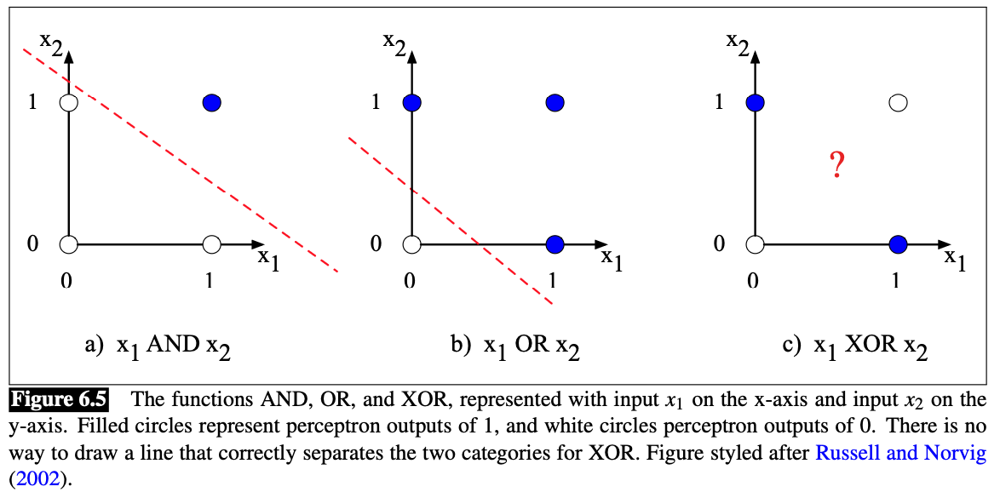
Gambar 6.5 Fungsi AND, OR, dan XOR, direpresentasikan dengan input $x_1$ [baca: eks satu] pada sumbu-x dan input $x_2$ [baca: eks dua] pada sumbu-y. Lingkaran terisi merepresentasikan output perceptron bernilai 1, dan lingkaran putih merepresentasikan output perceptron bernilai 0. Tidak ada cara untuk menarik garis yang memisahkan kedua kategori untuk XOR dengan benar. Gambar digayakan menurut [referensi: AIMA, Russell dan Norvig, 2002].

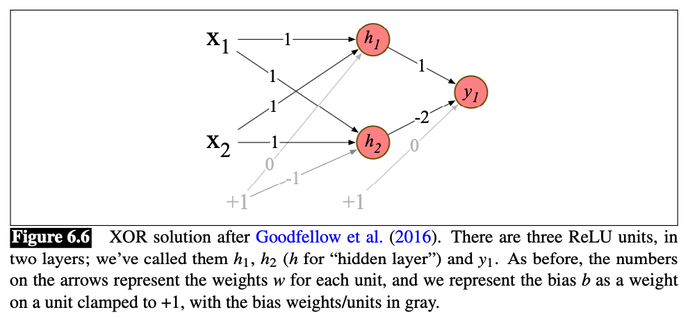
Gambar 6.6 Solusi XOR menurut [referensi: Deep Learning, Goodfellow et al, 2016]. Terdapat tiga unit ReLU, dalam dua lapisan; kami menyebutnya $h_1, h_2$ [baca: ha satu koma ha dua] ($h$ untuk "hidden layer" [arti: lapisan tersembunyi]) dan $y_1$ [baca: ye satu]. Seperti sebelumnya, angka pada panah merepresentasikan bobot $w$ [baca: we] untuk setiap unit, dan kami merepresentasikan bias $b$ [baca: be] sebagai bobot pada unit yang dikunci ke +1, dengan bobot/unit bias berwarna abu-abu.

Juga instruktif untuk melihat hasil perantara, yakni output dari dua hidden nodes [arti: simpul tersembunyi] $h_1$ dan $h_2$ [baca: ha satu dan ha dua]. Kami menunjukkan pada paragraf sebelumnya bahwa vektor $h$ [baca: ha] untuk input $x = [0, 0]$ [baca: eks sama dengan nol koma nol] adalah $[0, 0]$ [baca: nol koma nol]. Gbr. 6.7b menunjukkan nilai lapisan $h$ [baca: ha] untuk keempat input. Perhatikan bahwa hidden representations [arti: representasi tersembunyi] dari dua titik input $x = [0, 1]$ [baca: eks sama dengan nol koma satu] dan $x = [1, 0]$ [baca: eks sama dengan satu koma nol] (dua kasus dengan output XOR = 1) digabungkan menjadi satu titik tunggal $h = [1, 0]$ [baca: ha sama dengan satu koma nol]. Penggabungan ini memudahkan untuk memisahkan kasus positif dan negatif XOR secara linier (linearly separate). Dengan kata lain, kita dapat memandang hidden layer jaringan sebagai pembentuk representasi input.

Dalam contoh ini kita hanya menetapkan (stipulated) bobot pada Gbr. 6.6. Namun untuk contoh nyata, bobot bagi neural networks dipelajari secara otomatis menggunakan algoritma error backpropagation [arti: perambatan balik kesalahan] yang akan diperkenalkan di Bagian 6.6. Itu berarti hidden layers akan belajar untuk membentuk representasi yang berguna. Intuisi ini, bahwa neural networks dapat secara otomatis mempelajari representasi input yang berguna, adalah salah satu keunggulan utamanya, dan salah satu yang akan kita kembali bahas berulang kali di bab-bab selanjutnya.

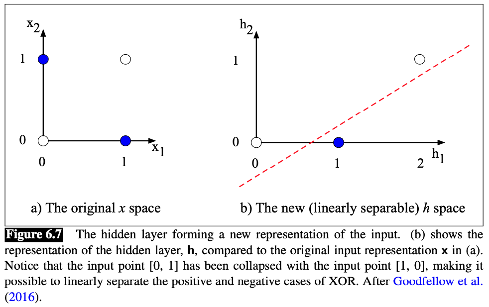
Gambar 6.7 Hidden layer membentuk representasi baru dari input. (b) menunjukkan representasi hidden layer, $h$ [baca: ha], dibandingkan dengan representasi input asli $x$ [baca: eks] di (a). Perhatikan bahwa titik input $[0, 1]$ [baca: nol koma satu] telah dikolaps (collapsed) dengan titik input $[1, 0]$ [baca: satu koma nol], yang memungkinkannya untuk memisahkan kasus positif dan negatif XOR secara linier. Menurut [referensi: Deep Learning, Goodfellow et al, 2016].

### 6.3 - Feedforward Neural Networks
Mari sekarang kita telusuri penyajian yang sedikit lebih formal mengenai jenis neural network yang paling sederhana, yaitu feedforward network [arti: jaringan di mana informasi mengalir ke satu arah, ke depan]. Feedforward network adalah jaringan multilayer di mana unit-unit terhubung tanpa siklus; output dari unit-unit di setiap lapisan diteruskan ke unit-unit di lapisan berikutnya yang lebih tinggi, dan tidak ada output yang diteruskan kembali ke lapisan yang lebih rendah. (Di Bab 13 kita akan memperkenalkan jaringan dengan siklus, yang disebut recurrent neural networks).

Karena alasan historis, jaringan multilayer, terutama feedforward networks, terkadang disebut multi-layer perceptrons (atau MLPs); ini adalah kesalahan penamaan teknis (technical misnomer), karena unit-unit dalam jaringan multilayer modern bukanlah perceptrons (perceptrons memiliki step-function sederhana sebagai fungsi aktivasinya, namun jaringan modern terdiri dari unit-unit dengan berbagai jenis non-linieritas seperti ReLUs dan sigmoids), namun pada titik tertentu nama itu melekat.

Feedforward networks sederhana memiliki tiga jenis nodes: input units, hidden units, dan output units.

Gbr. 6.8 menunjukkan gambarnya. Lapisan input $x$ [baca: eks] adalah vektor nilai skalar sederhana seperti yang kita lihat pada Gbr. 6.2.

Inti dari neural network adalah hidden layer $h$ [baca: ha] yang terbentuk dari hidden units $h_i$ [baca: ha sub-i], yang masing-masing merupakan neural unit seperti yang dideskripsikan di Bagian 6.1, yang mengambil jumlah terbobot dari input-inputnya dan kemudian menerapkan non-linieritas. Dalam arsitektur standar, setiap lapisan fully-connected [arti: terhubung sepenuhnya], yang berarti bahwa setiap unit di setiap lapisan mengambil output dari semua unit di lapisan sebelumnya sebagai input, dan terdapat tautan di antara setiap pasangan unit dari dua lapisan yang berdekatan. Dengan demikian setiap hidden unit menjumlahkan seluruh input units.

Ingat kembali bahwa satu hidden unit tunggal memiliki parameter berupa vektor bobot dan bias. Kami merepresentasikan parameter untuk seluruh hidden layer dengan menggabungkan vektor bobot dan bias untuk setiap unit $i$ [baca: i] menjadi satu matriks bobot tunggal $W$ [baca: we besar] dan satu vektor bias tunggal $b$ [baca: be] untuk seluruh lapisan (lihat Gbr. 6.8). Setiap elemen $W_{ji}$ [baca: we sub-ji] dari matriks bobot $W$ merepresentasikan bobot koneksi dari input unit ke-$i$ $x_i$ [baca: eks sub-i] ke hidden unit ke-$j$ $h_j$ [baca: ha sub-j].

Keuntungan menggunakan satu matriks $W$ tunggal untuk bobot seluruh lapisan adalah bahwa sekarang komputasi hidden layer untuk feedforward network dapat dilakukan dengan sangat efisien menggunakan operasi matriks sederhana. Faktanya, komputasi tersebut hanya memiliki tiga langkah: mengalikan matriks bobot dengan vektor input $x$, menambahkan vektor bias $b$, dan menerapkan fungsi aktivasi $g$ (seperti fungsi aktivasi sigmoid, tanh, atau ReLU yang didefinisikan di atas).

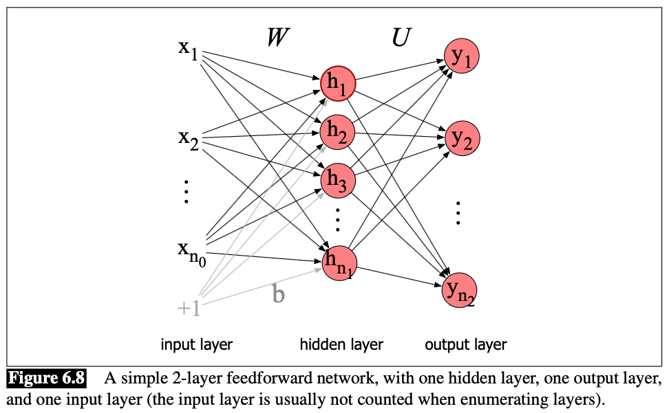
Gambar 6.8 Sebuah feedforward network 2-lapis sederhana, dengan satu hidden layer, satu output layer, dan satu input layer (input layer biasanya tidak dihitung saat menghitung jumlah lapisan).

Output dari hidden layer, vektor $h$ [baca: ha], dengan demikian adalah sebagai berikut (untuk contoh ini kita akan menggunakan fungsi sigmoid $\sigma$ [baca: sigma] sebagai fungsi aktivasi kita):

$$h = \sigma(Wx + b) \quad (6.8)$$

(baca: ha sama dengan sigma dari we besar kali eks ditambah be)

Perhatikan bahwa kita menerapkan fungsi $\sigma$ di sini pada sebuah vektor, sementara di Pers. 6.3 fungsi itu diterapkan pada sebuah skalar. Dengan demikian, kita membiarkan $\sigma(\cdot)$, dan memang fungsi aktivasi apa pun $g(\cdot)$, untuk diterapkan pada vektor secara elemen-per-elemen (element-wise), jadi $g[z_1, z_2, z_3] = [g(z_1), g(z_2), g(z_3)]$.

Mari perkenalkan beberapa konstanta untuk merepresentasikan dimensionalitas vektor dan matriks ini. Kita akan menyebut input layer sebagai lapisan 0 dari jaringan, dan memiliki $n_0$ [baca: en nol] yang merepresentasikan jumlah input, jadi $x$ adalah vektor bilangan riil berdimensi $n_0$, atau lebih formalnya $x \in \mathbb{R}^{n_0}$ [baca: eks anggota dari himpunan bilangan riil berdimensi en nol], sebuah vektor kolom dengan dimensionalitas $[n_0 \times 1]$. Mari sebut hidden layer sebagai lapisan 1 dan output layer sebagai lapisan 2. Hidden layer memiliki dimensionalitas $n_1$ [baca: en satu], jadi $h \in \mathbb{R}^{n_1}$ [baca: ha anggota dari himpunan bilangan riil berdimensi en satu] dan juga $b \in \mathbb{R}^{n_1}$ [baca: be anggota dari himpunan bilangan riil berdimensi en satu] (karena setiap hidden unit dapat mengambil nilai bias yang berbeda). Dan matriks bobot $W$ memiliki dimensionalitas $W \in \mathbb{R}^{n_1 \times n_0}$ [baca: we besar anggota dari himpunan bilangan riil berdimensi en satu kali en nol], yaitu $[n_1 \times n_0]$.

Luangkan waktu sejenak untuk meyakinkan diri Anda bahwa perkalian matriks dalam Pers. 6.8 akan menghitung nilai setiap $h_j$ [baca: ha sub-j] sebagai $\sigma(\sum_{i=1}^{n_0} W_{ji}x_i + b_j)$ [baca: sigma dari jumlah dari i sama dengan satu sampai en nol dari we sub-ji kali eks sub-i ditambah be sub-j].

Seperti yang kita lihat di Bagian 6.2, nilai $h$ yang dihasilkan (untuk hidden tetapi juga untuk hipotesis) membentuk representasi input. Peran output layer adalah mengambil representasi baru $h$ ini dan menghitung output akhir. Output ini bisa berupa bilangan bernilai riil, namun dalam banyak kasus tujuan jaringan adalah membuat semacam keputusan klasifikasi, jadi kita akan berfokus pada kasus klasifikasi.

Jika kita melakukan tugas biner seperti klasifikasi sentimen, kita mungkin memiliki output node tunggal, dan nilai skalarnya $y$ [baca: ye] adalah probabilitas sentimen positif versus negatif. Jika kita melakukan klasifikasi multinomial, seperti menetapkan tag part-of-speech, kita mungkin memiliki satu output node untuk setiap potensi part-of-speech, yang nilai output-nya adalah probabilitas part-of-speech tersebut, dan nilai semua output nodes harus berjumlah satu. Output layer dengan demikian adalah vektor $y$ yang memberikan distribusi probabilitas di seluruh output nodes.

Mari kita lihat bagaimana ini terjadi. Seperti hidden layer, output layer memiliki matriks bobot (mari kita sebut $U$ [baca: u besar]), namun beberapa model tidak menyertakan vektor bias $b$ di output layer, jadi kita akan menyederhanakan dengan menghilangkan vektor bias dalam contoh ini. Matriks bobot dikalikan dengan vektor inputnya ($h$) untuk menghasilkan output perantara $z$:

$z = Uh$ [baca: ze sama dengan u besar kali ha]

Ada $n_2$ [baca: en dua] output nodes, jadi $z \in \mathbb{R}^{n_2}$ [baca: ze anggota dari himpunan bilangan riil berdimensi en dua], matriks bobot $U$ memiliki dimensionalitas $U \in \mathbb{R}^{n_2 \times n_1}$ [baca: u besar anggota dari himpunan bilangan riil berdimensi en dua kali en satu], dan elemen $U_{ij}$ [baca: u besar sub-ij] adalah bobot dari unit $j$ di hidden layer ke unit $i$ di output layer.

Namun, $z$ tidak bisa menjadi output pengklasifikasi, karena $z$ adalah vektor bilangan bernilai riil, sedangkan yang kita butuhkan untuk klasifikasi adalah vektor probabilitas. Ada fungsi yang mudah untuk menormalisasi vektor nilai riil, yang kami maksud adalah mengubahnya menjadi vektor yang menyandikan distribusi probabilitas (semua angka terletak antara 0 dan 1 dan berjumlah 1): fungsi softmax yang kita lihat di halaman 79 Bab 4. Secara lebih umum untuk vektor $z$ apa pun dengan dimensionalitas $d$, softmax didefinisikan sebagai:

$$\text{softmax}(z_i) = \frac{\exp(z_i)}{\sum_{j=1}^{d} \exp(z_j)} \quad 1 \leq i \leq d \quad (6.9)$$

(baca: softmax dari ze sub-i sama dengan eksponensial ze sub-i per jumlah dari j sama dengan satu sampai d dari eksponensial ze sub-j, untuk satu kurang dari sama dengan i kurang dari sama dengan d)

Jadi sebagai contoh diberikan vektor

$$z = [0.6, 1.1, -1.5, 1.2, 3.2, -1.1], \quad (6.10)$$

fungsi softmax akan menormalisasikannya menjadi distribusi probabilitas (ditampilkan dibulatkan):

$$\text{softmax}(z) = [0.055, 0.090, 0.0067, 0.10, 0.74, 0.010] \quad (6.11)$$

Anda mungkin ingat bahwa kita menggunakan softmax untuk membuat distribusi probabilitas dari vektor bilangan bernilai riil (dihitung dari penjumlahan bobot kali fitur) dalam versi multinomial dari logistic regression di Bab 4.

Itu berarti kita dapat menganggap pengklasifikasi neural network dengan satu hidden layer sebagai membangun vektor $h$ yang merupakan representasi hidden layer dari input, dan kemudian menjalankan multinomial logistic regression standar pada fitur-fitur yang dikembangkan jaringan di dalam $h$. Sebaliknya, di Bab 4 fitur-fiturnya sebagian besar dirancang secara manual melalui feature templates [arti: templat fitur]. Jadi sebuah neural network mirip dengan multinomial logistic regression, tetapi (a) dengan banyak lapisan, karena deep neural network seperti lapisan demi lapisan pengklasifikasi logistic regression; (b) dengan lapisan-lapisan perantara tersebut memiliki banyak kemungkinan fungsi aktivasi (tanh, ReLU, sigmoid) alih-alih hanya sigmoid (meskipun kami akan terus menggunakan $\sigma$ demi kenyamanan untuk mengartikan fungsi aktivasi apa pun); (c) alih-alih membentuk fitur dengan feature templates, lapisan-lapisan jaringan sebelumnya menginduksi representasi fitur itu sendiri.

Berikut adalah persamaan akhir untuk feedforward network dengan satu hidden layer tunggal, yang mengambil vektor input $x$, mengeluarkan distribusi probabilitas $y$, dan diparameterisasi oleh matriks bobot $W$ dan $U$ serta vektor bias $b$:

$$h = \sigma(Wx + b)$$

$$z = Uh$$

$$y = \text{softmax}(z) \quad (6.12)$$

Dan sekadar untuk mengingat bentuk dari semua variabel kita, $x \in \mathbb{R}^{n_0}$, $h \in \mathbb{R}^{n_1}$, $b \in \mathbb{R}^{n_1}$, $W \in \mathbb{R}^{n_1 \times n_0}$, $U \in \mathbb{R}^{n_2 \times n_1}$, dan vektor output $y \in \mathbb{R}^{n_2}$. Kami akan menyebut jaringan ini sebagai jaringan 2-lapis (secara tradisional kita tidak menghitung input layer saat memberi nomor lapisan, tetapi menghitung output layer). Jadi dengan terminologi ini logistic regression adalah jaringan 1-lapis.

#### 6.3.1 - More details on feedforward networks
Mari sekarang kita tetapkan beberapa notasi untuk mempermudah pembahasan mengenai jaringan yang lebih dalam (deeper networks) dengan kedalaman lebih dari 2. Kita akan menggunakan superscripts [arti: teks yang ditulis lebih kecil dan sedikit di atas garis teks normal] dalam kurung siku untuk mengartikan nomor lapisan, dimulai dari 0 untuk lapisan input. Jadi $W^{[1]}$ [baca: we superskrip satu] akan berarti matriks bobot untuk hidden layer (pertama), dan $b^{[1]}$ [baca: be superskrip satu] akan berarti vektor bias untuk hidden layer (pertama). $n_j$ [baca: en sub-je] akan berarti jumlah unit pada lapisan $j$. Kita akan menggunakan $g(\cdot)$ [baca: ge dari ...] untuk mewakili fungsi aktivasi, yang cenderung berupa ReLU atau tanh untuk lapisan perantara dan softmax untuk lapisan output. Kita akan menggunakan $a^{[i]}$ [baca: a superskrip i] untuk mengartikan output dari lapisan $i$, dan $z^{[i]}$ [baca: ze superskrip i] untuk mengartikan kombinasi dari output lapisan sebelumnya, bobot, dan bias $W^{[i]}a^{[i-1]} + b^{[i]}$ [baca: we superskrip i kali a superskrip i min satu ditambah be superskrip i]. Lapisan ke-0 adalah untuk input, jadi kita akan menyebut input $x$ secara lebih umum sebagai $a^{[0]}$ [baca: a superskrip nol].

Dengan demikian kita dapat merepresentasikan ulang jaringan 2-lapis kita dari Pers. 6.12 sebagai berikut:

$$z^{[1]} = W^{[1]}a^{[0]} + b^{[1]}$$

$$a^{[1]} = g^{[1]}(z^{[1]})$$

$$z^{[2]} = W^{[2]}a^{[1]} + b^{[2]}$$

$$a^{[2]} = g^{[2]}(z^{[2]})$$

$$\hat{y} = a^{[2]} \quad (6.13)$$

[baca: ze satu sama dengan we satu a nol tambah be satu; a satu sama dengan ge satu dari ze satu; ze dua sama dengan we dua a satu tambah be dua; a dua sama dengan ge dua dari ze dua; ye topi sama dengan a dua]

Perhatikan bahwa dengan notasi ini, persamaan untuk komputasi yang dilakukan pada setiap lapisan adalah sama. Algoritma untuk menghitung langkah maju (forward step) dalam feedforward network [arti: jaringan saraf tiruan di mana koneksi antar node tidak membentuk siklus] n-lapis, jika diberikan vektor input $a^{[0]}$, dengan demikian hanyalah:

$$\text{for } i \text{ in } 1,...,n$$

$$z^{[i]} = W^{[i]} a^{[i-1]} + b^{[i]}$$

$$a^{[i]} = g^{[i]}(z^{[i]})$$

$$\hat{y} = a^{[n]}$$

Sering kali berguna untuk memiliki nama bagi himpunan aktivasi akhir tepat sebelum softmax terakhir. Jadi berapa pun banyak lapisan yang kita miliki, kita umumnya akan menyebut nilai yang belum dinormalisasi dalam vektor akhir $z^{[n]}$, vektor skor tepat sebelum softmax terakhir, sebagai logits (lihat Pers. 4.7).

The need for non-linear activation functions (Kebutuhan akan fungsi aktivasi non-linier)

Salah satu alasan kita menggunakan fungsi aktivasi non-linier untuk setiap lapisan dalam neural network adalah bahwa jika kita tidak melakukannya, jaringan yang dihasilkan akan persis setara dengan jaringan satu lapis. Mari kita lihat mengapa hal ini benar. Bayangkan dua lapisan pertama dari jaringan semacam itu yang terdiri dari lapisan-lapisan linier murni:

$$z^{[1]} = W^{[1]}x + b^{[1]}$$

$$z^{[2]} = W^{[2]}z^{[1]} + b^{[2]}$$

Kita dapat menulis ulang fungsi yang sedang dihitung oleh jaringan tersebut sebagai:

$$z^{[2]} = W^{[2]}z^{[1]} + b^{[2]}$$

$$= W^{[2]}(W^{[1]}x + b^{[1]}) + b^{[2]}$$

$$= W^{[2]}W^{[1]}x + W^{[2]}b^{[1]} + b^{[2]}$$

$$= W'x + b' \quad (6.14)$$

[baca: ze dua sama dengan we dua ze satu tambah be dua; sama dengan we dua kali we satu eks tambah be satu tambah be dua; sama dengan we dua we satu eks tambah we dua be satu tambah be dua; sama dengan we aksen eks tambah be aksen]

Hal ini dapat digeneralisasi untuk jumlah lapisan berapa pun. Jadi tanpa fungsi aktivasi non-linier, jaringan multilayer hanyalah varian notasi dari jaringan satu lapis dengan himpunan bobot yang berbeda, dan kita kehilangan semua kekuatan representasional dari jaringan multilayer.

Replacing the bias unit (Mengganti unit bias)

Dalam mendeskripsikan jaringan, kita terkadang akan menggunakan notasi yang sedikit disederhanakan yang merepresentasikan fungsi yang persis sama tanpa merujuk pada node bias $b$ secara eksplisit. Alih-alih, kita menambahkan dummy node [arti: simpul tiruan/pelengkap] $a_0$ ke setiap lapisan yang nilainya akan selalu 1. Dengan demikian lapisan 0, lapisan input, akan memiliki dummy node $a_0^{[0]} = 1$, lapisan 1 akan memiliki $a_0^{[1]} = 1$, dan seterusnya. Dummy node ini masih memiliki bobot terkait, dan bobot itu merepresentasikan nilai bias $b$. Sebagai contoh, alih-alih persamaan seperti

$$h = \sigma(Wx + b) \quad (6.15)$$

kita akan menggunakan:

$$h = \sigma(Wx) \quad (6.16)$$

Namun sekarang alih-alih vektor $x$ kita memiliki $n_0$ nilai: $x = x_1, ..., x_{n_0}$, vektor tersebut akan memiliki $n_0 + 1$ nilai, dengan nilai dummy ke-0 baru $x_0 = 1$: $x = x_0, ..., x_{n_0}$. Dan alih-alih menghitung setiap $h_j$ sebagai berikut:

$$h_j = \sigma \left( \sum_{i=1}^{n_0} W_{ji} x_i + b_j \right), \quad (6.17)$$

kita justru akan menggunakan:

$$h_j = \sigma \left( \sum_{i=0}^{n_0} W_{ji} x_i \right), \quad (6.18)$$

di mana nilai $W_{j0}$ menggantikan apa yang tadinya adalah $b_j$. Gbr. 6.9 menunjukkan visualisasinya.

Kami akan terus menampilkan bias sebagai $b$ ketika kami membahas algoritma pembelajaran di Bagian 6.6, namun ke depannya dalam buku ini, untuk sebagian besar gambar dan beberapa persamaan kami akan menggunakan notasi yang disederhanakan ini tanpa suku bias eksplisit.

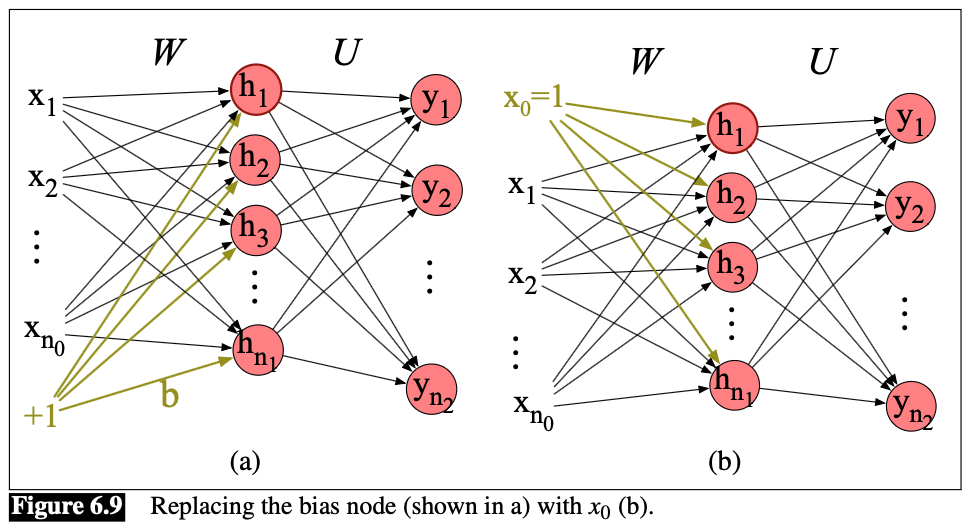
Gambar 6.9 Mengganti bias node (ditunjukkan di a) dengan $x_0$ [baca: eks nol] (b).

### 6.4 - Feedforward networks for NLP: Classification

Mari kita lihat cara menerapkan feedforward networks [arti: jaringan saraf tiruan di mana informasi mengalir ke satu arah, ke depan] pada tugas klasifikasi NLP. Dalam praktiknya, feedforward networks sederhana bukanlah cara kita melakukan klasifikasi teks; untuk aplikasi nyata kita akan menggunakan arsitektur yang lebih canggih seperti transformers BERT dari Bab 9. Meskipun demikian, melihat pengklasifikasi teks feedforward network akan memungkinkan kita memperkenalkan gagasan-gagasan kunci yang akan memainkan peran di sepanjang sisa buku ini, termasuk gagasan mengenai embedding matrix, representation pooling [arti: penyatuan representasi], dan representation learning [arti: pembelajaran representasi].

Namun sebelum memperkenalkan gagasan-gagasan ini, mari kita mulai dengan sebuah pengklasifikasi dengan hanya membuat perubahan minimal dari pengklasifikasi sentimen yang kita lihat di Bab 4. Seperti pengklasifikasi tersebut, kita akan mengambil fitur yang dibuat secara manual (hand-built features), melewatkannya melalui pengklasifikasi, dan menghasilkan probabilitas kelas. Satu-satunya perbedaan adalah bahwa kita akan menggunakan neural network alih-alih logistic regression sebagai pengklasifikasinya.

#### 6.4.1 - Neural net classifiers with hand-built features (Pengklasifikasi neural net dengan fitur yang dibuat secara manual)

Mari kita mulai dengan pengklasifikasi sentimen 2-lapis sederhana dengan mengambil pengklasifikasi logistic regression kita dari Bab 4, yang berkorespondensi dengan jaringan 1-lapis, dan hanya menambahkan satu hidden layer [arti: lapisan tersembunyi]. Elemen input $x_i$ [baca: eks sub-i] bisa berupa fitur skalar seperti yang ada di Gbr. 4.2, mis., $x_1 = \text{count}(\text{words} \in \text{doc})$ [baca: eks satu sama dengan hitungan kata dalam dokumen], $x_2 = \text{count}(\text{positive lexicon words} \in \text{doc})$ [baca: eks dua sama dengan hitungan kata leksikon positif dalam dokumen], $x_3 = 1$ jika “no” $\in \text{doc}$, dan seterusnya, untuk total $d$ [baca: de] fitur. Dan output layer $\hat{y}$ [baca: ye topi] dapat memiliki dua nodes (masing-masing satu untuk positif dan negatif), atau 3 nodes (positif, negatif, netral), yang dalam hal ini $\hat{y}_1$ [baca: ye topi satu] akan menjadi estimasi probabilitas sentimen positif, $\hat{y}_2$ [baca: ye topi dua] probabilitas negatif, dan $\hat{y}_3$ [baca: ye topi tiga] probabilitas netral. Persamaan yang dihasilkan akan persis seperti apa yang kita lihat di atas untuk jaringan 2-lapis (seperti biasa, kami akan terus menggunakan $\sigma$ [baca: sigma] untuk mewakili non-linieritas apa pun, baik sigmoid, ReLU, atau lainnya).

$$x = [x_1, x_2, ... x_d] \quad (\text{setiap } x_i \text{ adalah fitur yang dirancang secara manual})$$

[baca: eks sama dengan eks satu koma eks dua sampai eks de]

$$h = \sigma(Wx + b)$$

[baca: ha sama dengan sigma dari we besar eks ditambah be]

$$z = Uh$$

[baca: ze sama dengan u besar ha]

$$\hat{y} = \text{softmax}(z) \quad (6.19)$$

[baca: ye topi sama dengan softmax dari ze]

Gbr. 6.10 menunjukkan sketsa arsitektur ini. Seperti yang kami sebutkan sebelumnya, menambahkan hidden layer ini ke pengklasifikasi logistic regression kita memungkinkan jaringan untuk merepresentasikan interaksi non-linier antar fitur. Hal ini saja mungkin memberi kita pengklasifikasi sentimen yang lebih baik.

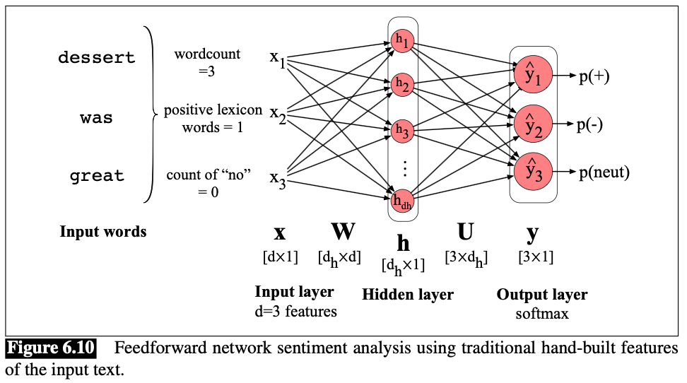
Gambar 6.10 Analisis sentimen feedforward network menggunakan fitur teks input tradisional yang dibuat secara manual (hand-built).

#### 6.4.2 - Vectorizing for parallelizing inference (Vektorisasi untuk memparalelkan inferensi)

Sementara Pers. 6.19 menunjukkan cara mengklasifikasikan satu contoh tunggal $x$ [baca: eks], dalam praktiknya kita ingin mengklasifikasikan seluruh himpunan uji yang terdiri dari $m$ [baca: em] contoh secara efisien. Kita melakukan ini dengan memvektorisasi prosesnya, persis seperti yang kita lihat pada logistic regression; alih-alih menggunakan for-loops untuk menelusuri setiap contoh, kita akan menggunakan perkalian matriks untuk melakukan seluruh komputasi dari seluruh himpunan uji sekaligus. Pertama, kita memadatkan semua vektor fitur input untuk setiap input $x$ [baca: eks] ke dalam satu matriks input tunggal $X$ [baca: eks besar], dengan setiap baris $i$ [baca: i] merupakan vektor baris yang terdiri dari fitur-fitur untuk contoh input $x^{(i)}$ [baca: eks superskrip i] (yaitu, vektor $x^{(i)}$). Jika dimensionalitas vektor fitur input kita adalah $d$ [baca: de], $X$ [baca: eks besar] akan menjadi matriks berbentuk $[m \times d]$ [baca: em kali de].

Karena kita sekarang memodelkan setiap input sebagai vektor baris alih-alih vektor kolom, kita juga perlu memodifikasi sedikit Pers. 6.19. $X$ [baca: eks besar] berbentuk $[m \times d]$ [baca: em kali de] dan $W$ [baca: we besar] berbentuk $[d_h \times d]$ [baca: de sub-ha kali de], jadi kita akan menyusun ulang cara kita mengalikan $X$ dan $W$ serta men-transpose [arti: memutar matriks dengan menukar baris dan kolom] $W$ agar mereka dapat dikalikan dengan benar untuk menghasilkan matriks $H$ [baca: ha besar] berbentuk $[m \times d_h]$ [baca: em kali de sub-ha].

Vektor bias $b$ [baca: be] dari Pers. 6.19 yang berbentuk $[1 \times d_h]$ [baca: satu kali de sub-ha] sekarang harus direplikasi ke dalam matriks berbentuk $[m \times d_h]$ [baca: em kali de sub-ha]. Kita perlu menyusun ulang langkah berikutnya secara serupa dan men-transpose $U$ [baca: u besar]. Terakhir, matriks output kita $\hat{Y}$ [baca: ye topi besar] akan berbentuk $[m \times 3]$ [baca: em kali tiga] (atau secara lebih umum $[m \times d_o]$ [baca: em kali de sub-o], di mana $d_o$ adalah jumlah kelas output), dengan setiap baris $i$ dari matriks output $\hat{Y}$ terdiri dari vektor output $\hat{y}^{(i)}$ [baca: ye topi superskrip i]. Berikut adalah persamaan akhir untuk menghitung distribusi kelas output bagi seluruh himpunan uji:

$$H = \sigma(XW + b)$$

[baca: ha besar sama dengan sigma dari eks besar we besar ditambah be]

$$Z = HU$$

[baca: ze besar sama dengan ha besar u besar]

$$\hat{Y} = \text{softmax}(Z) \quad (6.20)$$

[baca: ye topi besar sama dengan softmax dari ze besar]

Dalam buku ini, kita terkadang akan melihat pengurutan seperti $WX + b$ [baca: we besar eks besar ditambah be] dan terkadang $XW + b$ [baca: eks besar we besar ditambah be]. Itulah mengapa selalu penting untuk sangat menyadari bentuk matriks bobot Anda yang berpartisipasi dalam persamaan apa pun yang diberikan.

### 6.5 - Embeddings as the input to neural net classifiers

Meskipun fitur yang dibuat secara manual (hand-built features) merupakan cara tradisional untuk merancang pengklasifikasi, sebagian besar aplikasi neural networks untuk NLP tidak menggunakan fitur rekayasa manusia yang dibuat secara manual sebagai input. Alih-alih, kami memanfaatkan kemampuan deep learning untuk mempelajari fitur dari data dengan merepresentasikan token sebagai embeddings. Untuk bagian ini, kami akan merepresentasikan setiap token dengan embeddings word2vec atau GloVe statisnya, yang cara penghitungannya telah kami lihat di Bab 5. Dengan static embedding [arti: penyematan statis], yang kami maksud adalah bahwa setiap token direpresentasikan oleh vektor tetap yang kami latih sekali, dan kemudian cukup dimasukkan ke dalam kamus besar. Ketika kami ingin merujuk pada token tersebut, kami mengambil embedding-nya dari kamus.

Namun, ketika kami menerapkan model neural pada tugas language modeling (seperti yang akan kita lihat di Bab 8), situasinya menjadi lebih kompleks, dan kami akan menggunakan jenis embedding yang lebih kuat yang disebut contextual embedding [arti: penyematan kontekstual]. Contextual embeddings berbeda untuk setiap kali sebuah kata muncul dalam konteks yang berbeda. Lebih jauh lagi, kami akan membuat jaringan mempelajari embeddings ini sebagai bagian dari tugas prediksi kata.

Jadi mari kita jelajahi ranah klasifikasi teks di atas, namun dengan menggunakan static embeddings sebagai fitur, alih-alih fitur yang dirancang secara manual. Mari berfokus pada tahap inferensi, di mana kami telah mempelajari embeddings untuk semua token input. Sebuah embedding adalah vektor berdimensi $d$ [baca: de] yang merepresentasikan token input. Kamus static embeddings tempat kami menyimpan embeddings ini adalah embedding matrix $E$ [baca: e besar]. Setiap baris dari embedding matrix merepresentasikan setiap token dari kosakata $V$ [baca: ve besar] sebagai vektor (baris) dengan dimensionalitas $d$ [baca: de]. Karena $E$ [baca: e besar] memiliki satu baris untuk masing-masing dari $|V|$ [baca: mutlak ve] token dalam kosakata, $E$ [baca: e besar] memiliki bentuk $[|V| \times d]$ [baca: mutlak ve kali de]. Embedding matrix $E$ [baca: e besar] ini memainkan peran setiap kali kami menggunakan embeddings sebagai input untuk sistem neural NLP, termasuk dalam large language models berbasis transformer yang akan kami perkenalkan pada bab-bab berikutnya.

Diberikan untaian token input seperti dessert was great, pertama-tama kami mengubah token-token tersebut menjadi indeks kosakata (ini dibuat ketika kami pertama kali mentokenisasi input menggunakan BPE atau SentencePiece). Jadi representasi dari dessert was great mungkin berupa $w = [3, 9824, 226]$ [baca: we sama dengan tiga koma sembilan ribu delapan ratus dua puluh empat koma dua ratus dua puluh enam]. Selanjutnya kami menggunakan pengindeksan untuk memilih baris yang sesuai dari $E$ [baca: e besar] (baris 3, baris 9824, baris 226).

Cara lain untuk memikirkan tentang pemilihan token embeddings dari embedding matrix adalah dengan merepresentasikan token input sebagai one-hot vectors [arti: vektor yang hanya memiliki satu elemen bernilai 1 dan elemen lainnya 0] berbentuk $[1 \times |V|]$ [baca: satu kali mutlak ve], yaitu, dengan satu dimensi untuk setiap kata dalam kosakata. Ingat kembali bahwa dalam sebuah one-hot vector semua elemennya adalah 0 kecuali satu, elemen yang dimensinya adalah indeks kata dalam kosakata, yang memiliki nilai 1. Jadi jika kata "dessert" memiliki indeks 3 dalam kosakata, $x_3 = 1$ [baca: eks tiga sama dengan satu], dan $x_i = 0 \quad \forall i \neq 3$ [baca: eks i sama dengan nol untuk setiap i tidak sama dengan tiga], seperti yang ditunjukkan di sini:

$$[0 \quad 0 \quad 1 \quad 0 \quad 0 \quad 0 \quad 0 \quad ... \quad 0 \quad 0 \quad 0 \quad 0]$$

$$1 \quad 2 \quad 3 \quad 4 \quad 5 \quad 6 \quad 7 \quad ... \quad ... \quad |V|$$

Mengalikan dengan one-hot vector yang hanya memiliki satu elemen bukan-nol $x_i = 1$ [baca: eks i sama dengan satu] hanya menyeleksi vektor baris yang relevan untuk kata $i$ [baca: i], yang menghasilkan embedding untuk kata $i$ [baca: i], sebagaimana digambarkan dalam Gbr. 6.11.

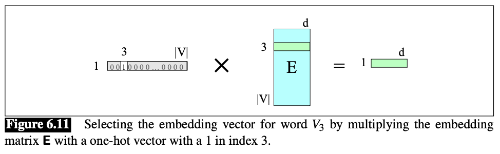
Gambar 6.11 Memilih vektor embedding untuk kata $V_3$ [baca: ve tiga] dengan mengalikan embedding matrix $E$ [baca: e besar] dengan one-hot vector yang memiliki angka 1 di indeks 3.

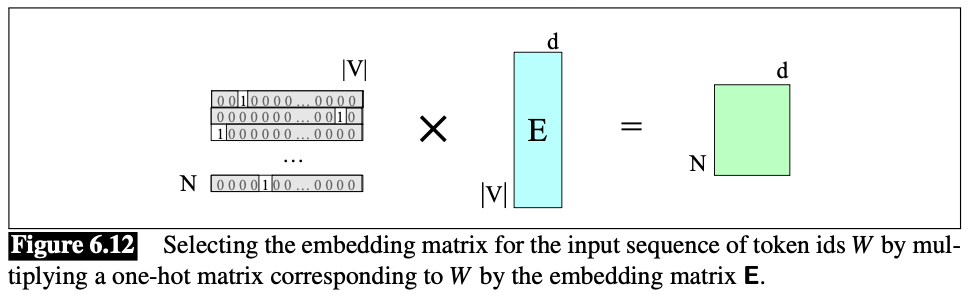
Gambar 6.12 Memilih embedding matrix untuk urutan input token ids $W$ [baca: we besar] dengan mengalikan one-hot matrix yang berkorespondensi dengan $W$ [baca: we besar] dengan embedding matrix $E$ [baca: e besar].

Kami sekarang perlu mengklasifikasikan input dari $N$ [baca: en besar] embeddings $[1 \times d]$ [baca: satu kali de], yang merepresentasikan window [arti: jendela konteks] sepanjang $N$ [baca: en besar] token, ke dalam satu kelas tunggal (seperti positif atau negatif).

Terdapat dua cara umum untuk meneruskan embeddings ke pengklasifikasi: concatenation [arti: penggabungan] dan pooling [arti: penyatuan/pengumpulan]. Pertama, kami dapat mengambil input berbentuk $[N \times d]$ [baca: en kali de] ini dan membentuk ulang (reshape) dengan menggabungkan (concatenating) semua vektor input menjadi satu vektor yang sangat panjang berbentuk $[1 \times dN]$ [baca: satu kali de en]. Kemudian kami meneruskan input ini ke pengklasifikasi kami dan membiarkannya membuat keputusan. Ini memberi kami banyak informasi, dengan konsekuensi penggunaan jaringan yang cukup besar. Kedua, kami dapat melakukan pooling pada $N$ [baca: en besar] embeddings menjadi satu embedding tunggal dan kemudian meneruskan pooled embedding tunggal tersebut ke pengklasifikasi. Pooling memberi kami informasi yang lebih sedikit daripada yang akan ada di semua embeddings asli, namun memiliki keuntungan karena berukuran kecil dan efisien serta sangat berguna dalam tugas-tugas di mana kami tidak terlalu peduli dengan urutan kata asli. Mari berikan contoh masing-masing: pooling untuk tugas sentimen, dan concatenation untuk tugas language modeling.

Pooling input embeddings for sentiment (Menyatukan embeddings input untuk sentimen)

Jadi mari kita mulai dengan melihat bagaimana pooling [arti: penyatuan/pengumpulan] dapat bekerja untuk tugas klasifikasi sentimen. Intuisi dari pooling adalah bahwa untuk sentimen, posisi pasti dari input (apakah suatu kata seperti great adalah kata pertama? kata kedua?) kurang penting dibandingkan identitas kata itu sendiri.

Fungsi pooling adalah cara untuk mengubah sekumpulan embeddings menjadi satu embedding tunggal. Sebagai contoh, untuk teks dengan $N$ [baca: en besar] kata/token input $w_1, ..., w_N$ [baca: we satu sampai we en besar], kita ingin mengubah $N$ [baca: en besar] row embeddings [arti: penyematan baris] $e(w_1), ..., e(w_N)$ [baca: e dari we satu sampai e dari we en besar] (masing-masing berdimensi $d$ [baca: de]) menjadi satu embedding tunggal yang juga berdimensi $d$ [baca: de].

Terdapat berbagai cara untuk melakukan pooling. Yang paling sederhana adalah mean-pooling: mengambil rata-rata dengan menjumlahkan embeddings dan kemudian membaginya dengan $N$ [baca: en besar]:

$$x_{\text{mean}} = \frac{1}{N} \sum_{i=1}^{N} e(w_i) \quad (6.21)$$

[baca: eks mean sama dengan satu per en besar kali jumlah dari i sama dengan satu sampai en besar dari e we sub-i]

Berikut adalah persamaan untuk pengklasifikasi ini dengan asumsi mean pooling:

$$x = \text{mean}(e(w_1), e(w_2), ..., e(w_n))$$

[baca: eks sama dengan mean dari e we satu koma e we dua sampai e we en]

$$h = \sigma(xW + b)$$

[baca: ha sama dengan sigma dari eks we besar ditambah be]

$$z = hU$$

[baca: ze sama dengan ha u besar]

$$\hat{y} = \text{softmax}(z) \quad (6.22)$$

[baca: ye topi sama dengan softmax dari ze]

Arsitekturnya disketsakan dalam Gbr. 6.13, di mana kami juga memberikan bentuk untuk semua matriks yang relevan.

Terdapat banyak opsi lain untuk pooling, seperti max-pooling, yang mana untuk setiap dimensi kita mengambil nilai maksimum secara elemen-per-elemen (element-wise) dari semua input. Element-wise max dari sekumpulan $N$ [baca: en besar] vektor adalah vektor baru yang elemen ke-$k$ [baca: ka]-nya adalah maksimum dari elemen ke-$k$ [baca: ka] dari semua $N$ [baca: en besar] vektor tersebut.

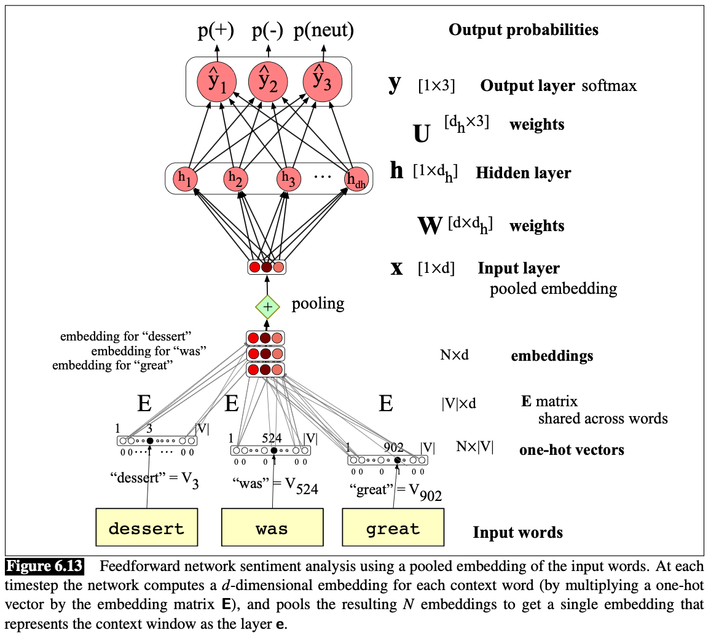
Gambar 6.13 Analisis sentimen feedforward network menggunakan pooled embedding [arti: penyematan yang disatukan] dari kata-kata input. Pada setiap langkah waktu, jaringan menghitung embedding d-dimensi untuk setiap kata konteks (dengan mengalikan one-hot vector dengan embedding matrix $E$ [baca: e besar]), dan menyatukan (pools) $N$ [baca: en besar] embeddings yang dihasilkan untuk mendapatkan satu embedding tunggal yang merepresentasikan context window sebagai lapisan $e$ [baca: e].

Concatenating input embeddings for language modeling (Menggabungkan embeddings input untuk pemodelan bahasa)

Untuk analisis sentimen, kita telah melihat cara menghasilkan vektor output dengan probabilitas pada tiga kelas: positif, negatif, atau netral, jika diberikan input berupa window [arti: jendela konteks] sepanjang $N$ [baca: en besar] token input, dengan terlebih dahulu menyatukan (pooling) token embeddings tersebut menjadi satu vektor embedding tunggal.

Sekarang mari pertimbangkan language modeling [arti: pemodelan bahasa]: memprediksi kata-kata mendatang dari kata-kata sebelumnya. Dalam tugas ini kita diberikan window yang sama sepanjang $N$ [baca: en besar] token input, namun tugas kita sekarang adalah memprediksi token berikutnya yang harus mengikuti window tersebut. Kita akan membuat sketsa feedforward neural language model sederhana, dengan mengacu pada algoritma yang pertama kali diperkenalkan oleh [referensi: Neural Probabilistic Language Model, Bengio et al, 2003]. Feedforward language model memperkenalkan banyak konsep penting dari large language modeling [arti: pemodelan bahasa besar] yang akan kita kembali bahas di Bab 7 dan Bab 8.

Neural language models memiliki banyak keunggulan dibandingkan n-gram language models dari Bab 3. Neural language models dapat menangani riwayat yang jauh lebih panjang, dapat melakukan generalisasi dengan lebih baik pada konteks kata-kata yang serupa, dan jauh lebih akurat dalam prediksi kata. Di sisi lain, neural net language models lebih lambat, lebih kompleks, membutuhkan energi yang sangat besar untuk dilatih, dan kurang dapat diinterpretasikan (less interpretable) dibandingkan model n-gram, sehingga untuk beberapa tugas yang lebih kecil, model bahasa n-gram masih merupakan alat yang tepat.

Sebuah feedforward neural language model adalah feedforward network yang mengambil representasi dari sejumlah kata sebelumnya ($w_{t-1}, w_{t-2}$ [baca: we sub te min satu koma we sub te min dua], dst.) sebagai input pada waktu $t$ [baca: te], dan mengeluarkan distribusi probabilitas pada kemungkinan kata-kata berikutnya. Dengan demikian—seperti n-gram LM—feedforward neural LM mengaproksimasi probabilitas sebuah kata jika diberikan seluruh konteks sebelumnya $P(w_t | w_{1:t-1})$ [baca: pe dari we sub te dengan syarat we satu sampai te min satu] dengan melakukan aproksimasi berdasarkan $N-1$ [baca: en besar min satu] kata sebelumnya:

$$P(w_t | w_1, ..., w_{t-1}) \approx P(w_t | w_{t-N+1}, ..., w_{t-1}) \quad (6.23)$$

[baca: pe dari we sub te dengan syarat we satu sampai we sub te min satu kira-kira sama dengan pe dari we sub te dengan syarat we sub te min en besar plus satu sampai we sub te min satu]

Dalam contoh berikut kita akan menggunakan contoh 4-gram, jadi kita akan menunjukkan neural net untuk mengestimasi probabilitas $P(w_t = i | w_{t-3}, w_{t-2}, w_{t-1})$ [baca: pe dari we sub te sama dengan i dengan syarat we sub te min tiga koma we sub te min dua koma we sub te min satu].

Neural language models merepresentasikan kata-kata dalam konteks sebelumnya ini dengan embeddings-nya, alih-alih hanya dengan identitas katanya sebagaimana digunakan dalam model bahasa n-gram. Menggunakan embeddings memungkinkan neural language models untuk melakukan generalisasi dengan lebih baik pada data yang belum pernah dilihat (unseen data). Sebagai contoh, misalkan kita pernah melihat kalimat ini dalam pelatihan:

I have to make sure that the cat gets fed.

tetapi belum pernah melihat kata-kata "gets fed" setelah kata "dog". Himpunan uji kita memiliki awalan "I forgot to make sure that the dog gets". Apa kata berikutnya? Model bahasa n-gram akan memprediksi "fed" setelah "that the cat gets", tetapi tidak setelah "that the dog gets". Namun neural LM, yang mengetahui bahwa "cat" dan "dog" memiliki embeddings yang serupa, akan mampu melakukan generalisasi dari konteks "cat" untuk menetapkan probabilitas yang cukup tinggi pada "fed" bahkan setelah melihat "dog".

Tugas prediksi ini memerlukan vektor output yang mengekspresikan $|V|$ [baca: mutlak ve] probabilitas: satu nilai probabilitas untuk setiap kemungkinan token berikutnya. Kita mungkin memiliki kosakata antara 60.000 hingga 300.000 token, jadi vektor output untuk tugas language modeling jauh lebih panjang daripada 3. Perbedaan lain untuk language modeling adalah bahwa alih-alih melakukan pooling pada embeddings dari $N$ [baca: en besar] token input untuk membuat satu embedding tunggal, kita menggabungkan (concatenate) input-input tersebut menjadi satu vektor input yang sangat panjang. Untuk memprediksi token berikutnya, akan membantu untuk mengetahui setiap token yang mendahului dan urutan keberadaannya.

Gbr. 6.14 menunjukkan tugas language modeling, yang disketsakan dengan context window yang sangat pendek $N=3$ [baca: en besar sama dengan tiga] hanya agar muat di halaman. Ketiga vektor embedding ini digabungkan (concatenated) untuk menghasilkan $e$ [baca: e], lapisan embedding. Ini dikalikan dengan matriks bobot $W$ [baca: we besar] untuk menghasilkan hidden layer, dan matriks bobot lain $U$ [baca: u besar] untuk menghasilkan output layer yang softmax-nya memberikan distribusi probabilitas pada kata-kata. Sebagai contoh $y_{42}$ [baca: ye empat puluh dua], nilai dari output node 42, adalah probabilitas kata berikutnya $w_t$ [baca: we sub te] menjadi $V_{42}$ [baca: ve empat puluh dua], kata kosakata dengan indeks 42 (yang merupakan kata 'fish' dalam contoh kita).

Persamaan untuk feedforward neural language model sederhana dengan ukuran window 3, jika diberikan vektor input one-hot untuk setiap kata konteks input, adalah:

$$e = [Ex_{t-3}; Ex_{t-2}; Ex_{t-1}]$$

[baca: e sama dengan e besar eks sub te min tiga gabung e besar eks sub te min dua gabung e besar eks sub te min satu]

$$h = \sigma(We + b)$$

[baca: ha sama dengan sigma dari we besar e ditambah be]

$$z = Uh$$

[baca: ze sama dengan u besar ha]

$$\hat{y} = \text{softmax}(z) \quad (6.24)$$

[baca: ye topi sama dengan softmax dari ze]

Perhatikan bahwa kita menggunakan titik koma untuk mengartikan penggabungan (concatenation) vektor, jadi kita membentuk lapisan embedding $e$ [baca: e] dengan menggabungkan 3 embeddings untuk ketiga vektor konteks.

Kita akan kembali membahas gagasan penggunaan neural networks untuk melakukan language modeling ini di Bab 7 dan Bab 8 ketika kita memperkenalkan transformer language models.

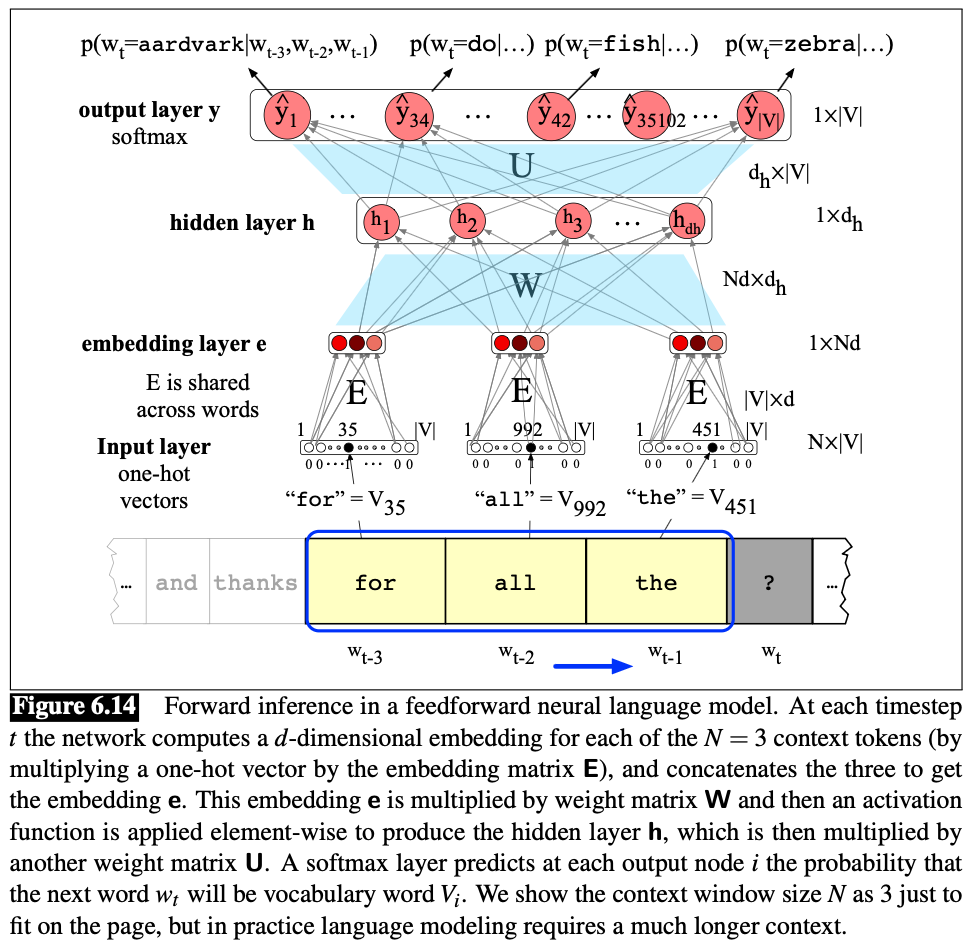
Gambar 6.14 Inferensi maju (forward inference) dalam feedforward neural language model. Pada setiap langkah waktu $t$ [baca: te], jaringan menghitung embedding d-dimensi untuk masing-masing dari $N=3$ [baca: en besar sama dengan tiga] token konteks (dengan mengalikan one-hot vector dengan embedding matrix $E$ [baca: e besar]), dan menggabungkan ketiganya untuk mendapatkan embedding $e$ [baca: e]. Embedding $e$ [baca: e] ini dikalikan dengan matriks bobot $W$ [baca: we besar] dan kemudian fungsi aktivasi diterapkan secara elemen-per-elemen untuk menghasilkan hidden layer $h$ [baca: ha], yang kemudian dikalikan dengan matriks bobot lain $U$ [baca: u besar]. Lapisan softmax memprediksi pada setiap output node $i$ [baca: i] probabilitas bahwa kata berikutnya $w_t$ [baca: we sub te] adalah kata kosakata $V_i$ [baca: ve sub i]. Kami menunjukkan ukuran context window $N$ [baca: en besar] sebagai 3 hanya agar muat di halaman, namun dalam praktiknya language modeling memerlukan konteks yang jauh lebih panjang.

### 6.6 - Training Neural Nets

Sebuah feedforward neural net [arti: jaringan saraf umpan maju] adalah contoh dari supervised machine learning di mana kita mengetahui output yang benar $y$ [baca: ye] untuk setiap observasi $x$ [baca: eks]. Apa yang dihasilkan sistem, melalui Pers. 6.13, adalah $\hat{y}$ [baca: ye topi], estimasi sistem terhadap $y$ [baca: ye] yang sebenarnya. Tujuan dari prosedur pelatihan adalah untuk mempelajari parameter $W^{[i]}$ [baca: we superskrip i] dan $b^{[i]}$ [baca: be superskrip i] untuk setiap lapisan $i$ [baca: i] yang membuat $\hat{y}$ [baca: ye topi] untuk setiap observasi pelatihan sedekat mungkin dengan $y$ [baca: ye] yang sebenarnya.

Secara umum, kami melakukan semua ini dengan mengacu pada metode yang kami perkenalkan di Bab 4 untuk logistic regression, sehingga pembaca harus merasa nyaman dengan bab tersebut sebelum melanjutkan. Kami akan mengeksplorasi algoritma ini pada jaringan generik sederhana alih-alih jaringan yang dirancang untuk sentimen atau language modeling.

Pertama, kita akan memerlukan sebuah loss function [arti: fungsi kerugian] yang memodelkan jarak antara output sistem dan gold output [arti: output acuan/standar emas], dan umum untuk menggunakan loss function yang digunakan untuk logistic regression, yakni cross-entropy loss.

Kedua, untuk menemukan parameter yang meminimalkan loss function ini, kami akan menggunakan algoritma optimasi gradient descent [arti: penurunan gradien] yang diperkenalkan di Bab 4.

Ketiga, gradient descent mengharuskan pengetahuan akan gradien dari loss function, vektor yang berisi turunan parsial dari loss function terhadap masing-masing parameter. Dalam logistic regression, untuk setiap observasi kita dapat secara langsung menghitung turunan dari loss function terhadap $w$ [baca: we] atau $b$ [baca: be] individu. Namun untuk neural networks, dengan jutaan parameter di banyak lapisan, jauh lebih sulit untuk melihat cara menghitung turunan parsial dari bobot tertentu di lapisan 1 ketika kerugian (loss) terlampir pada lapisan yang jauh lebih akhir. Bagaimana kita membagikan kerugian (partial out the loss) ke seluruh lapisan perantara tersebut? Jawabannya adalah algoritma yang disebut error backpropagation [arti: perambatan balik kesalahan] atau backward differentiation.

#### 6.6.1 - Loss function (Fungsi kerugian)

Cross-entropy loss yang digunakan dalam neural networks adalah sama dengan yang kita lihat untuk logistic regression. Jika neural network digunakan sebagai pengklasifikasi biner, dengan sigmoid pada lapisan akhir, loss function-nya adalah logistic regression loss yang sama yang kita lihat di Pers. 4.19:

$$L_{CE} (\hat{y}, y) = -\log p(y|x) = -[y \log \hat{y} + (1-y) \log(1-\hat{y})] \quad (6.25)$$

[baca: el sub ce dari ye topi koma ye sama dengan min log pe dari ye dengan syarat eks sama dengan min kurung siku ye log ye topi tambah satu min ye log satu min ye topi]

Jika kita menggunakan jaringan untuk mengklasifikasikan ke dalam 3 kelas atau lebih, loss function-nya persis sama dengan kerugian untuk multinomial regression yang kita lihat di Bab 4 pada halaman 82. Mari kita rangkum penjelasannya secara singkat di sini demi kenyamanan. Pertama, ketika kita memiliki lebih dari 2 kelas, kita perlu merepresentasikan baik $y$ [baca: ye] maupun $\hat{y}$ [baca: ye topi] sebagai vektor. Mari asumsikan kita melakukan hard classification, di mana hanya satu kelas yang benar. Label yang benar $y$ [baca: ye] kemudian adalah vektor dengan $K$ [baca: ka] elemen, masing-masing berkorespondensi dengan sebuah kelas, dengan $y_c = 1$ [baca: ye sub ce sama dengan satu] jika kelas yang benar adalah $c$ [baca: ce], dengan semua elemen $y$ [baca: ye] lainnya bernilai 0. Ingat kembali bahwa vektor seperti ini, dengan satu nilai sama dengan 1 dan sisanya 0, disebut one-hot vector. Dan pengklasifikasi kita akan menghasilkan vektor estimasi dengan $K$ [baca: ka] elemen $\hat{y}$ [baca: ye topi], yang setiap elemen $\hat{y}_k$ [baca: ye topi sub ka]-nya merepresentasikan probabilitas estimasi $p(y_k = 1|x)$ [baca: pe dari ye sub ka sama dengan satu dengan syarat eks].

Loss function untuk satu contoh tunggal $x$ [baca: eks] adalah jumlah negatif dari log $K$ [baca: ka] kelas output, masing-masing dibobotkan oleh probabilitasnya $y_k$ [baca: ye sub ka]:

$$- \sum_{k=1}^{K} y_k \log \hat{y}_k \quad (6.26)$$

[baca: min jumlah dari ka sama dengan satu sampai ka besar dari ye sub ka log ye topi sub ka]

Kita dapat menyederhanakan persamaan ini lebih lanjut; mari pertama-tama tulis ulang persamaan menggunakan fungsi $\mathbb{1}\{\}$ [baca: fungsi indikator satu] yang mengevaluasi ke 1 jika kondisi dalam kurung benar dan ke 0 jika sebaliknya. Ini membuat lebih jelas bahwa suku-suku dalam penjumlahan di Pers. 6.26 akan bernilai 0 kecuali untuk suku yang berkorespondensi dengan kelas yang benar di mana $y_k = 1$ [baca: ye sub ka sama dengan satu]:

$$\sum_{k=1}^{K} \mathbb{1}\{y_k = 1\} \log \hat{y}_k$$

[baca: jumlah dari ka sama dengan satu sampai ka besar dari indikator ye sub ka sama dengan satu log ye topi sub ka]

Dengan kata lain, cross-entropy loss hanyalah log negatif dari probabilitas output yang berkorespondensi dengan kelas yang benar, dan oleh karena itu kita juga menyebutnya negative log likelihood loss:

$$L_{CE} (\hat{y}, y) = -\log \hat{y}_c \quad (\text{di mana } c \text{ adalah kelas yang benar}) \quad (6.27)$$

[baca: el sub ce dari ye topi koma ye sama dengan min log ye topi sub ce]

Dengan memasukkan rumus softmax dari Pers. 6.9, dan dengan $K$ [baca: ka] sebagai jumlah kelas:

$$L_{CE} (\hat{y}, y) = -\log \frac{\exp(z_c)}{\sum_{j=1}^{K} \exp(z_j)} \quad (\text{di mana } c \text{ adalah kelas yang benar}) \quad (6.28)$$

[baca: el sub ce dari ye topi koma ye sama dengan min log eksponensial ze sub ce per jumlah dari je sama dengan satu sampai ka besar dari eksponensial ze sub je]

Mari kita pikirkan tentang probabilitas log negatif sebagai loss function. Pengklasifikasi yang sempurna akan menetapkan probabilitas 1 untuk kelas yang benar $i$ [baca: i] dan probabilitas 0 untuk semua kelas yang salah. Itu berarti semakin tinggi $p(\hat{y}_i)$ [baca: pe dari ye topi sub i] (semakin dekat ke 1), semakin baik pengklasifikasi tersebut; semakin rendah $p(\hat{y}_i)$ [baca: pe dari ye topi sub i] (semakin dekat ke 0), semakin buruk pengklasifikasi tersebut. Log negatif dari probabilitas ini adalah metrik kerugian yang indah karena berkisar dari 0 (log negatif dari 1, tidak ada kerugian) hingga tak hingga (log negatif dari 0, kerugian tak hingga). Loss function ini juga memastikan bahwa ketika probabilitas jawaban yang benar dimaksimalkan, probabilitas semua jawaban yang salah diminimalkan; karena semuanya berjumlah satu, setiap kenaikan dalam probabilitas jawaban yang benar terjadi dengan mengorbankan jawaban yang salah.

Jumlah kelas $K$ [baca: ka] dari vektor output $\hat{y}$ [baca: ye topi] bisa kecil atau besar. Mungkin tugas kita adalah sentimen 3-arah, dan kemudian kelasnya mungkin positif, negatif, dan netral. Atau jika tugas kita adalah menentukan part of speech [arti: kelas kata] dari sebuah kata (yaitu, apakah itu kata benda atau kata kerja atau kata sifat, dll.), maka $K$ [baca: ka] adalah himpunan parts of speech yang mungkin dalam tagset kita (yang mana terdapat 17 dalam tagset yang akan kita definisikan di Bab 17). Dan jika tugas kita adalah language modeling, dan pengklasifikasi kita mencoba memprediksi kata mana yang berikutnya, maka himpunan kelas kita adalah himpunan kata, yang mungkin berjumlah 50.000 atau 100.000.

#### 6.6.2 - Computing the Gradient (Menghitung Gradien)

Bagaimana kita menghitung gradien dari loss function [arti: fungsi kerugian] ini? Menghitung gradien memerlukan turunan parsial dari loss function terhadap setiap parameter. Untuk jaringan dengan satu lapisan bobot dan output sigmoid (yang merupakan logistic regression), kita cukup menggunakan turunan dari loss yang kita gunakan untuk logistic regression pada Pers. 6.29 (dan diturunkan di Bagian 4.15):

$$\frac{\partial L_{CE}(\hat{y}, y)}{\partial w_j} = (\hat{y}-y) x_j = (\sigma(w \cdot x + b) - y) x_j \quad (6.29)$$

[baca: turunan parsial el sub ce dari ye topi koma ye terhadap we sub je sama dengan ye topi min ye kali eks sub je sama dengan sigma dari we dot eks tambah be dikurangi ye kali eks sub je]

Atau untuk jaringan dengan satu lapisan bobot dan output softmax (= multinomial logistic regression), kita dapat menggunakan turunan dari softmax loss dari Pers. 4.41, yang ditunjukkan untuk bobot tertentu $w_k$ [baca: we sub ka] dan input $x_i$ [baca: eks sub i]:

$$\frac{\partial L_{CE}(\hat{y}, y)}{\partial w_{k,i}} = -(y_k - \hat{y}_k) x_i$$

$$= -(y_k - p(y_k = 1|x)) x_i$$

$$= -\left( y_k - \frac{\exp(w_k \cdot x + b_k)}{\sum_{j=1}^{K} \exp(w_j \cdot x + b_j)} \right) x_i \quad (6.30)$$

[baca: turunan parsial el sub ce dari ye topi koma ye terhadap we sub ka koma i sama dengan min ye sub ka min ye topi sub ka kali eks sub i sama dengan min ye sub ka min pe dari ye sub ka sama dengan satu dengan syarat eks kali eks sub i sama dengan min kurung buka ye sub ka min eksponensial we sub ka dot eks tambah be sub ka per jumlah dari je sama dengan satu sampai ka besar dari eksponensial we sub je dot eks tambah be sub je kurung tutup kali eks sub i]

Namun turunan-turunan ini hanya memberikan pembaruan yang benar untuk satu lapisan bobot: lapisan terakhir! Untuk deep networks [arti: jaringan dalam], menghitung gradien untuk setiap bobot jauh lebih kompleks, karena kita menghitung turunan terhadap parameter bobot yang muncul jauh di belakang pada lapisan-lapisan paling awal jaringan, meskipun loss hanya dihitung di bagian paling akhir jaringan.

Solusi untuk menghitung gradien ini adalah algoritma yang disebut error backpropagation [arti: perambatan balik kesalahan] atau backprop [referensi: Learning representations by back-propagating errors, Rumelhart et al, 1986]. Meskipun backprop ditemukan khusus untuk neural networks, ternyata ini sama dengan prosedur yang lebih umum yang disebut backward differentiation, yang bergantung pada gagasan computation graphs [arti: grafik komputasi]. Mari kita lihat cara kerjanya di subbagian berikutnya.

#### 6.6.3 - Computation Graphs (Grafik Komputasi)

Sebuah computation graph adalah representasi proses penghitungan ekspresi matematika, di mana komputasi dipecah menjadi operasi-operasi terpisah, yang masing-masing dimodelkan sebagai node dalam grafik.

Pertimbangkan penghitungan fungsi $L(a,b,c) = c(a + 2b)$ [baca: el dari a koma be koma ce sama dengan ce kali a tambah dua be]. Jika kita membuat setiap operasi penjumlahan dan perkalian komponen menjadi eksplisit, dan menambahkan nama ($d$ [baca: de] dan $e$ [baca: e]) untuk output perantara, rangkaian komputasi yang dihasilkan adalah:

$$d = 2 * b$$

$$e = a + d$$

$$L = c * e$$

Kita sekarang dapat merepresentasikan ini sebagai grafik, dengan nodes untuk setiap operasi, dan directed edges [arti: tepi berarah] yang menunjukkan output dari setiap operasi sebagai input untuk operasi berikutnya, seperti pada Gbr. 6.15. Penggunaan computation graphs yang paling sederhana adalah untuk menghitung nilai fungsi dengan beberapa input yang diberikan. Dalam gambar tersebut, kita mengasumsikan input $a = 3$, $b = 1$, $c = -2$, dan kita telah menunjukkan hasil dari forward pass [arti: laju maju] untuk menghitung hasil $L(3, 1, -2) = -10$. Dalam forward pass dari computation graph, kita menerapkan setiap operasi dari kiri ke kanan, meneruskan output dari setiap komputasi sebagai input ke node berikutnya.

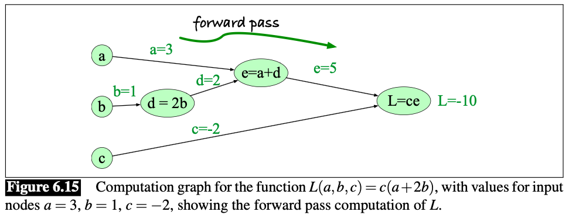
Gambar 6.15 Computation graph untuk fungsi $L(a,b,c) = c(a+2b)$ [baca: el dari a koma be koma ce sama dengan ce kali a tambah dua be], dengan nilai untuk input nodes $a = 3$, $b = 1$, $c = -2$, menunjukkan komputasi forward pass dari $L$.

#### 6.6.4 - Backward differentiation on computation graphs (Diferensiasi mundur pada grafik komputasi)

Pentingnya computation graph berasal dari backward pass [arti: laju mundur], yang digunakan untuk menghitung turunan yang akan kita butuhkan untuk pembaruan bobot. Dalam contoh ini tujuan kita adalah menghitung turunan fungsi output $L$ terhadap setiap variabel input, yaitu, $\frac{\partial L}{\partial a}$, $\frac{\partial L}{\partial b}$, dan $\frac{\partial L}{\partial c}$ [baca: parsial el per parsial a, parsial el per parsial be, dan parsial el per parsial ce]. Turunan $\frac{\partial L}{\partial a}$ [baca: parsial el per parsial a] memberi tahu kita seberapa besar perubahan kecil pada $a$ memengaruhi $L$.

Backwards differentiation memanfaatkan chain rule [arti: aturan rantai] dalam kalkulus, jadi mari kita ingatkan diri kita tentang hal itu. Misalkan kita menghitung turunan dari fungsi komposit $f(x) = u(v(x))$ [baca: ef eks sama dengan u dari ve eks]. Turunan dari $f(x)$ adalah turunan dari $u(x)$ terhadap $v(x)$ dikalikan turunan dari $v(x)$ terhadap $x$:

$$\frac{df}{dx} = \frac{du}{dv} \cdot \frac{dv}{dx} \quad (6.31)$$

[baca: de ef per de eks sama dengan de u per de ve kali de ve per de eks]

Chain rule berlaku untuk lebih dari dua fungsi. Jika menghitung turunan dari fungsi komposit $f(x) = u(v(w(x)))$ [baca: ef eks sama dengan u dari ve dari we eks], turunan dari $f(x)$ adalah:

$$\frac{df}{dx} = \frac{du}{dv} \cdot \frac{dv}{dw} \cdot \frac{dw}{dx} \quad (6.32)$$

[baca: de ef per de eks sama dengan de u per de ve kali de ve per de we kali de we per de eks]

Intuisi dari backward differentiation adalah meneruskan gradien kembali dari final node ke semua nodes dalam grafik. Gbr. 6.16 menunjukkan bagian dari komputasi mundur pada satu node $e$. Setiap node mengambil upstream gradient [arti: gradien hulu] yang diteruskan dari parent node-nya di sebelah kanan, dan untuk setiap inputnya menghitung local gradient (gradien output-nya terhadap input-nya), dan menggunakan chain rule untuk mengalikan keduanya guna menghitung downstream gradient [arti: gradien hilir] untuk diteruskan ke node sebelumnya.

Mari sekarang hitung 3 turunan yang kita butuhkan. Karena dalam computation graph $L = ce$, kita dapat secara langsung menghitung turunan $\frac{\partial L}{\partial c}$ [baca: parsial el per parsial ce]:

$$\frac{\partial L}{\partial c} = e \quad (6.33)$$

Untuk dua lainnya, kita perlu menggunakan chain rule:

$$\frac{\partial L}{\partial a} = \frac{\partial L}{\partial e} \frac{\partial e}{\partial a}$$

$$\frac{\partial L}{\partial b} = \frac{\partial L}{\partial e} \frac{\partial e}{\partial d} \frac{\partial d}{\partial b} \quad (6.34)$$

Pers. 6.34 dan Pers. 6.33 dengan demikian memerlukan lima turunan perantara: $\frac{\partial L}{\partial e}$, $\frac{\partial L}{\partial c}$, $\frac{\partial e}{\partial a}$, $\frac{\partial e}{\partial d}$, dan $\frac{\partial d}{\partial b}$ [baca: parsial el per parsial e, parsial el per parsial ce, parsial e per parsial a, parsial e per parsial de, dan parsial de per parsial be], yang adalah sebagai berikut (memanfaatkan fakta bahwa turunan dari penjumlahan adalah jumlah dari turunan-turunannya):

$$L = ce : \frac{\partial L}{\partial e} = c, \quad \frac{\partial L}{\partial c} = e$$

$$e = a + d : \frac{\partial e}{\partial a} = 1, \quad \frac{\partial e}{\partial d} = 1$$

$$d = 2b : \frac{\partial d}{\partial b} = 2$$

Dalam backward pass, kita menghitung setiap parsial ini di sepanjang setiap tepi grafik dari kanan ke kiri, menggunakan chain rule persis seperti yang kita lakukan di atas. Dengan demikian kita mulai dengan menghitung downstream gradients dari node $L$, yaitu $\frac{\partial L}{\partial e}$ dan $\frac{\partial L}{\partial c}$. Untuk node $e$, kita kemudian mengalikan upstream gradient $\frac{\partial L}{\partial e}$ ini dengan local gradient (gradien output terhadap input), $\frac{\partial e}{\partial d}$ untuk mendapatkan output yang kita kirim kembali ke node $d$: $\frac{\partial L}{\partial d}$. Dan seterusnya, sampai kita telah menganotasi grafik sepenuhnya hingga ke semua variabel input. Forward pass dengan mudahnya sudah menghitung nilai-nilai variabel perantara maju yang kita butuhkan (seperti $d$ dan $e$) untuk menghitung turunan-turunan ini. Gbr. 6.17 menunjukkan backward pass-nya.

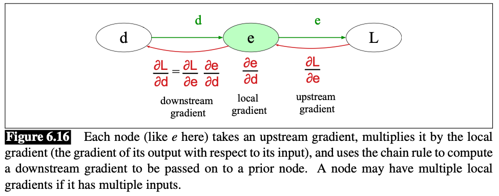
Gambar 6.16 Setiap node (seperti $e$ di sini) mengambil upstream gradient $\frac{\partial L}{\partial e}$, mengalikannya dengan local gradient (gradien output-nya terhadap input-nya), dan menggunakan chain rule untuk menghitung downstream gradient untuk diteruskan ke node sebelumnya. Sebuah node dapat memiliki beberapa local gradients jika ia memiliki beberapa input.

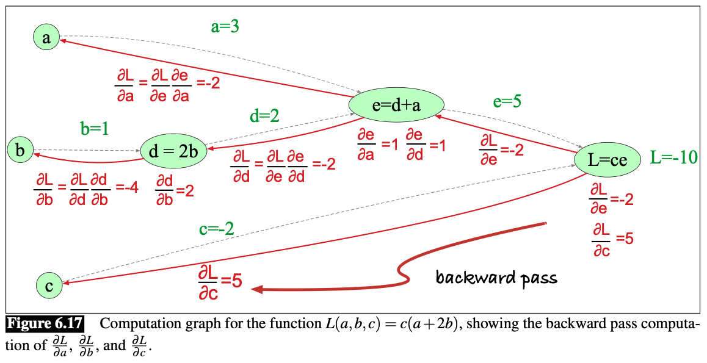
Gambar 6.17 Computation graph untuk fungsi $L(a,b,c) = c(a + 2b)$, menunjukkan komputasi backward pass dari $\frac{\partial L}{\partial a}$, $\frac{\partial L}{\partial b}$, dan $\frac{\partial L}{\partial c}$.

**Backward differentiation for a neural network (Diferensiasi mundur untuk jaringan saraf)**

Tentu saja computation graphs [arti: grafik komputasi] untuk neural networks nyata jauh lebih kompleks. Gbr. 6.18 menunjukkan contoh computation graph untuk neural network 2-lapis dengan $n_0 = 2$ [baca: en nol sama dengan dua], $n_1 = 2$ [baca: en satu sama dengan dua], dan $n_2 = 1$ [baca: en dua sama dengan satu], dengan asumsi klasifikasi biner dan karenanya menggunakan output unit sigmoid demi kesederhanaan. Fungsi yang dihitung oleh computation graph tersebut adalah:

$$z^{[1]} = W^{[1]}x + b^{[1]}$$

$$a^{[1]} = \text{ReLU}(z^{[1]})$$

$$z^{[2]} = W^{[2]}a^{[1]} + b^{[2]}$$

$$a^{[2]} = \sigma(z^{[2]})$$

$$\hat{y} = a^{[2]} \quad (6.35)$$

[baca: ze superskrip satu sama dengan we superskrip satu eks tambah be superskrip satu; a superskrip satu sama dengan ReLU dari ze superskrip satu; ze superskrip dua sama dengan we superskrip dua a superskrip satu tambah be superskrip dua; a superskrip dua sama dengan sigma dari ze superskrip dua; ye topi sama dengan a superskrip dua]

Untuk backward pass [arti: laju mundur], kita juga perlu menghitung loss $L$ [baca: el]. Loss function untuk output sigmoid biner dari Pers. 6.25 adalah:

$$L_{CE} (\hat{y}, y) = -[y \log \hat{y} + (1-y) \log(1-\hat{y})] \quad (6.36)$$

[baca: el sub ce dari ye topi koma ye sama dengan min kurung siku ye log ye topi tambah satu min ye log satu min ye topi]

Output kita $\hat{y} = a^{[2]}$ [baca: ye topi sama dengan a superskrip dua], jadi kita dapat menyusun ulang ini sebagai:

$$L_{CE} (a^{[2]}, y) = - [y \log a^{[2]} + (1-y) \log(1-a^{[2]})] \quad (6.37)$$

[baca: el sub ce dari a superskrip dua koma ye sama dengan min kurung siku ye log a superskrip dua tambah satu min ye log satu min a superskrip dua]

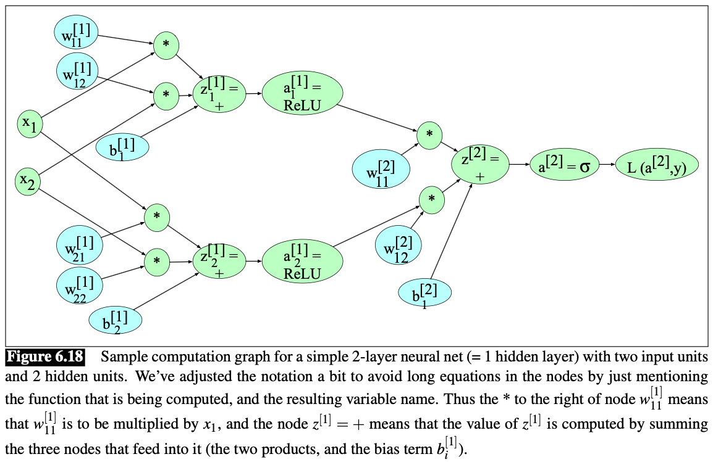
Gambar 6.18 Contoh computation graph untuk neural net 2-lapis sederhana (= 1 hidden layer) dengan dua input units dan 2 hidden units. Kami telah menyesuaikan notasinya sedikit untuk menghindari persamaan yang panjang dalam node dengan hanya menyebutkan fungsi yang sedang dihitung, dan nama variabel yang dihasilkan. Dengan demikian tanda * di sebelah kanan node $w_{11}^{[1]}$ [baca: we satu satu superskrip satu] berarti bahwa $w_{11}^{[1]}$ harus dikalikan dengan $x_1$ [baca: eks satu], dan node $z_i^{[1]} = +$ [baca: ze sub i superskrip satu sama dengan plus] berarti bahwa nilai $z_i^{[1]}$ dihitung dengan menjumlahkan tiga node yang mengumpan ke dalamnya (dua hasil kali, dan suku bias $b_i^{[1]}$ [baca: be sub i superskrip satu]).

Bobot yang perlu diperbarui (bobot yang turunan parsial loss function-nya perlu kita ketahui) ditunjukkan dengan warna teal (hijau kebiruan). Untuk melakukan backward pass, kita perlu mengetahui turunan dari semua fungsi dalam grafik. Kita sudah melihat di Bagian 4.15 turunan dari sigmoid $\sigma$ [baca: sigma]:

$$\frac{d\sigma(z)}{dz} = \sigma(z)(1-\sigma(z)) \quad (6.38)$$

[baca: de sigma ze per de ze sama dengan sigma ze kali satu min sigma ze]

Kita juga akan membutuhkan turunan dari setiap fungsi aktivasi lainnya. Turunan dari tanh adalah:

$$\frac{d \tanh(z)}{dz} = 1 - \tanh^2(z) \quad (6.39)$$

[baca: de tanh ze per de ze sama dengan satu min tanh kuadrat ze]

Turunan dari ReLU adalah:

$$\frac{d \text{ReLU}(z)}{dz} = \begin{cases} 0 & \text{for } z < 0 \\ 1 & \text{for } z \ge 0 \end{cases} \quad (6.40)$$

[baca: de ReLU ze per de ze sama dengan nol untuk ze kurang dari nol; satu untuk ze lebih besar dari sama dengan nol]

Kami akan memberikan awal komputasinya, menghitung turunan loss function $L$ [baca: el] terhadap $z$ [baca: ze], atau $\frac{\partial L}{\partial z}$ [baca: parsial el per parsial ze] (dan meninggalkan sisa komputasi sebagai latihan bagi pembaca). Berdasarkan chain rule [arti: aturan rantai]:

$$\frac{\partial L}{\partial z} = \frac{\partial L}{\partial a^{[2]}} \frac{\partial a^{[2]}}{\partial z} \quad (6.41)$$

[baca: parsial el per parsial ze sama dengan parsial el per parsial a superskrip dua kali parsial a superskrip dua per parsial ze]

Jadi mari kita hitung $\frac{\partial L}{\partial a^{[2]}}$ [baca: parsial el per parsial a superskrip dua] terlebih dahulu, dengan mengambil turunan dari Pers. 6.37, yang diulang di sini:

$$L_{CE} (a^{[2]}, y) = - [y \log a^{[2]} + (1-y) \log(1-a^{[2]})]$$

$$\frac{\partial L}{\partial a^{[2]}} = - \left[ y \frac{\partial \log(a^{[2]})}{\partial a^{[2]}} + (1-y) \frac{\partial \log(1-a^{[2]})}{\partial a^{[2]}} \right]$$

$$= - \left[ y \frac{1}{a^{[2]}} + (1-y) \frac{1}{1-a^{[2]}} (-1) \right]$$

$$= - \frac{y}{a^{[2]}} + \frac{1-y}{1-a^{[2]}} \quad (6.42)$$

Selanjutnya, berdasarkan turunan dari sigmoid:

$$\frac{\partial a^{[2]}}{\partial z} = \frac{\partial L}{\partial a^{[2]}} \frac{\partial a^{[2]}}{\partial z}$$

$$= \left( -\frac{y}{a^{[2]}} + \frac{1-y}{1-a^{[2]}} \right) a^{[2]}(1-a^{[2]})$$

$$= a^{[2]} - y \quad (6.43)$$

Melanjutkan komputasi mundur gradien (berikutnya dengan meneruskan gradien melewati $b_1^{[2]}$ [baca: be satu superskrip dua] dan dua node perkalian, dan seterusnya, kembali ke semua node berwarna teal), ditinggalkan sebagai latihan bagi pembaca.

#### 6.6.5 - More details on learning (Detail lebih lanjut tentang pembelajaran)

Optimasi dalam neural networks adalah masalah non-convex optimization [arti: optimasi non-cembung], yang lebih kompleks daripada untuk logistic regression, dan karena alasan itu dan alasan lainnya, terdapat banyak praktik terbaik untuk pembelajaran yang sukses.

Untuk logistic regression, kita dapat menginisialisasi gradient descent dengan semua bobot dan bias bernilai 0. Sebaliknya, dalam neural networks, kita perlu menginisialisasi bobot dengan angka acak yang kecil. Juga bermanfaat untuk menormalisasi nilai input agar memiliki mean [arti: rata-rata] 0 dan variance [arti: varians] satuan.

Berbagai bentuk regularization [arti: teknik untuk mencegah overfitting] digunakan untuk mencegah overfitting. Salah satu yang terpenting adalah dropout: secara acak menjatuhkan (dropping) beberapa unit dan koneksinya dari jaringan selama pelatihan [referensi: Dropout, Hinton et al, 2012], [referensi: Dropout, Srivastava et al, 2014]. Pada setiap iterasi pelatihan (setiap kali kita memperbarui parameter, yaitu setiap mini-batch jika kita menggunakan mini-batch gradient descent), kita berulang kali memilih probabilitas $p$ [baca: pe] dan untuk setiap unit kita mengganti output-nya dengan nol dengan probabilitas $p$ [baca: pe] (dan menormalisasi ulang sisa output dari lapisan tersebut).

Penyetelan hyperparameters juga penting. Parameter dari neural network adalah bobot $W$ [baca: we besar] dan bias $b$ [baca: be]; hal-hal tersebut dipelajari oleh gradient descent. Hyperparameters adalah hal-hal yang dipilih oleh perancang algoritma; nilai optimal disetel pada devset alih-alih melalui pembelajaran gradient descent pada himpunan pelatihan. Hyperparameters mencakup learning rate $\eta$ [baca: eta], ukuran mini-batch, arsitektur model (jumlah lapisan, jumlah hidden nodes per lapisan, pilihan fungsi aktivasi), cara melakukan regularisasi, dan seterusnya. Gradient descent itu sendiri juga memiliki banyak varian arsitektur seperti Adam [referensi: Adam, Kingma dan Ba, 2015].

Terakhir, sebagian besar neural networks modern dibangun menggunakan formalisme computation graph yang membuatnya mudah dan alami untuk melakukan komputasi gradien dan paralelisasi pada GPUs (Graphic Processing Units) berbasis vektor. PyTorch [referensi: PyTorch, Paszke et al, 2017] dan TensorFlow [referensi: TensorFlow, Abadi et al, 2015] adalah dua yang paling populer. Pembaca yang berminat disarankan untuk membaca buku teks neural network untuk detail lebih lanjut; beberapa saran ada di akhir bab ini.

### 6.7 - Summary (Ringkasan)

* Neural networks dibangun dari neural units. Awalnya terinspirasi oleh neuron biologis, neural networks kini merupakan perangkat komputasi abstrak alih-alih model biologis.

* Setiap neural unit mengalikan nilai input dengan vektor bobot, menambahkan bias, dan kemudian menerapkan fungsi aktivasi non-linier seperti sigmoid, tanh, atau rectified linear unit.

* Dalam feedforward network yang fully-connected [arti: terhubung sepenuhnya], setiap unit di lapisan $i$ [baca: i] terhubung ke setiap unit di lapisan $i + 1$, dan tidak ada siklus.

* Kekuatan neural networks berasal dari kemampuan lapisan awal untuk mempelajari representasi yang dapat dimanfaatkan oleh lapisan berikutnya dalam jaringan.

* Neural networks dilatih oleh algoritma optimasi seperti gradient descent.

* Error backpropagation, diferensiasi mundur pada computation graph, digunakan untuk menghitung gradien loss function untuk sebuah jaringan.

* Neural language models menggunakan neural network sebagai pengklasifikasi probabilistik, untuk menghitung probabilitas kata berikutnya jika diberikan $n$ [baca: en] kata sebelumnya.

* Neural language models dapat menggunakan pretrained embeddings [arti: penyematan yang telah dilatih sebelumnya], atau dapat mempelajari embeddings dari awal dalam proses language modeling.

### 6.8 - Historical Notes (Catatan Sejarah)

Asal-usul neural networks terletak pada McCulloch-Pitts neuron tahun 1940-an [referensi: McCulloch-Pitts, McCulloch dan Pitts, 1943], sebuah model sederhana dari neuron biologis sebagai sejenis elemen komputasi yang dapat dideskripsikan dalam istilah logika proposisional. Menjelang akhir 1950-an dan awal 1960-an, sejumlah laboratorium (termasuk Frank Rosenblatt di Cornell dan Bernard Widrow di Stanford) mengembangkan penelitian mengenai neural networks; fase ini menyaksikan pengembangan perceptron [referensi: Perceptron, Rosenblatt, 1958], dan transformasi ambang batas (threshold) menjadi bias, sebuah notasi yang masih kita gunakan [referensi: Adaline, Widrow dan Hoff, 1960].

Bidang neural networks mengalami kemunduran setelah ditunjukkan bahwa satu unit perceptron tunggal tidak mampu memodelkan fungsi sesederhana XOR [referensi: Perceptrons, Minsky dan Papert, 1969]. Meskipun sejumlah kecil pekerjaan terus berlanjut selama dua dekade berikutnya, kebangkitan utama bagi bidang ini baru terjadi pada tahun 1980-an, ketika alat praktis untuk membangun jaringan yang lebih dalam seperti error backpropagation menjadi tersebar luas [referensi: Backprop, Rumelhart et al, 1986]. Selama tahun 1980-an, berbagai macam arsitektur neural network dan yang terkait dikembangkan, khususnya untuk aplikasi dalam psikologi dan sains kognitif [referensi: PDP, Rumelhart dan McClelland, 1986], [referensi: TRACE, McClelland dan Elman, 1986], [referensi: PDP, Rumelhart dan McClelland, 1986], [referensi: Finding Structure, Elman, 1990], yang mana istilah connectionist atau parallel distributed processing sering digunakan [referensi: Connectionist, Feldman dan Ballard, 1982], [referensi: Connectionist, Smolensky, 1988]. Banyak prinsip dan teknik yang dikembangkan pada periode ini menjadi dasar bagi pekerjaan modern, termasuk gagasan distributed representations [arti: representasi terdistribusi] [referensi: Distributed Representations, Hinton, 1986], recurrent networks [referensi: Finding Structure, Elman, 1990], dan penggunaan tensors untuk komposisionalitas [referensi: Tensor Product, Smolensky, 1990].

Menjelang tahun 1990-an, neural networks yang lebih besar mulai diterapkan pada banyak tugas pemrosesan bahasa praktis juga, seperti pengenalan tulisan tangan [referensi: Handwritten Digit Recognition, LeCun et al, 1989] dan pengenalan ucapan [referensi: Continuous Speech Recognition, Morgan dan Bourlard, 1990]. Menjelang awal tahun 2000-an, peningkatan dalam perangkat keras komputer serta kemajuan dalam teknik optimasi dan pelatihan memungkinkan untuk melatih jaringan yang bahkan lebih besar dan lebih dalam, yang mengarah pada istilah modern deep learning [referensi: Deep Belief Nets, Hinton et al, 2006], [referensi: Greedy Layer-Wise, Bengio et al, 2007]. Kami membahas sejarah terkait lainnya di Bab 13 dan Bab 15.

Terdapat sejumlah buku yang sangat baik mengenai neural networks, termasuk [referensi: Deep Learning, Goodfellow et al, 2016] dan [referensi: Neural Networks, Nielsen, 2015].

## 7 - Large Language Models
Literatur fantastik dipenuhi dengan benda-benda mati yang secara ajaib dianugerahi kemampuan berbicara. Mulai dari patung Pygmalion karya Ovid hingga kisah Mary Shelley tentang Frankenstein, kita terus-menerus menciptakan ulang cerita tentang menciptakan sesuatu dan kemudian berbincang dengannya.

Legenda mengatakan bahwa setelah menyelesaikan patung Musa-nya, Michelangelo menganggapnya begitu hidup sehingga ia menepuk lutut patung itu dan memerintahkannya untuk berbicara. Mungkin hal ini tidak mengherankan. Bahasa adalah tanda kemanusiaan dan kesadaran (*sentience*). Percakapan adalah arena fundamental bahasa, jenis bahasa pertama yang kita pelajari sebagai anak-anak, dan jenis bahasa yang kita lakukan terus-menerus, baik saat kita mengajar atau belajar, memesan makan siang, atau berbicara dengan keluarga atau teman kita.

Bab ini memperkenalkan *Large Language Model*, atau *LLM*, sebuah agen komputasi yang dapat berinteraksi secara percakapan dengan manusia. Fakta bahwa *LLM* dirancang untuk interaksi dengan manusia memiliki implikasi kuat terhadap desain dan penggunaannya.

Banyak dari implikasi ini sudah menjadi jelas dalam sistem komputasi dari 60 tahun yang lalu, *ELIZA* [referensi: *ELIZA*, Weizenbaum, 1966]. *ELIZA*, yang dirancang untuk mensimulasikan seorang psikolog Rogerian, mengilustrasikan sejumlah masalah penting dengan *chatbots*. Sebagai contoh, orang-orang menjadi terlibat secara emosional secara mendalam dan melakukan percakapan yang sangat pribadi, bahkan sampai meminta Weizenbaum meninggalkan ruangan saat mereka sedang mengetik. Masalah keterlibatan emosional dan privasi ini berarti kita perlu berpikir hati-hati tentang bagaimana kita menyebarkan model bahasa dan mempertimbangkan dampaknya terhadap orang-orang yang berinteraksi dengannya.

Dalam bab ini kita mulai dengan memperkenalkan prinsip-prinsip komputasi *LLM*; kita akan membahas implementasinya dalam arsitektur *transformer* pada bab berikutnya. Gagasan baru utama yang memungkinkan *LLM* adalah gagasan *pretraining* [arti: pelatihan awal], jadi mari kita mulai dengan memikirkan gagasan belajar dari teks, cara dasar *LLM* dilatih.

Kita tahu bahwa penutur fasih suatu bahasa membawa sejumlah besar pengetahuan saat pemahaman dan produksi. Pengetahuan ini terwujud dalam banyak bentuk, mungkin yang paling jelas dalam kosakata, representasi kaya yang kita miliki tentang kata-kata serta makna dan penggunaannya. Hal ini menjadikan kosakata sebagai lensa yang berguna untuk mengeksplorasi akuisisi pengetahuan dari teks, baik oleh manusia maupun mesin.

Estimasi ukuran kosakata orang dewasa sangat bervariasi baik di dalam maupun antar bahasa. Sebagai contoh, estimasi ukuran kosakata penutur dewasa muda bahasa Inggris Amerika berkisar antara 30.000 hingga 100.000 tergantung pada sumber daya yang digunakan untuk membuat estimasi dan definisi tentang apa artinya mengetahui sebuah kata. Konsekuensi sederhana dari fakta-fakta ini adalah bahwa anak-anak harus belajar sekitar 7 hingga 10 kata sehari, setiap hari, untuk mencapai tingkat kosakata yang diamati pada saat mereka berusia 20 tahun. Dan memang estimasi empiris pertumbuhan kosakata di akhir sekolah dasar hingga sekolah menengah atas konsisten dengan tingkat ini. Bagaimana anak-anak mencapai tingkat pertumbuhan kosakata ini? Penelitian menunjukkan bahwa sebagian besar akuisisi pengetahuan ini terjadi sebagai produk sampingan dari membaca. Membaca adalah proses pemrosesan kontekstual yang kaya; kita tidak mempelajari kata-kata satu per satu secara terisolasi. Faktanya, pada beberapa titik selama pembelajaran, tingkat pertumbuhan kosakata melebihi tingkat di mana kata-kata baru muncul bagi pembelajar! Itu menunjukkan bahwa setiap kali kita membaca sebuah kata, kita juga memperkuat pemahaman kita tentang kata-kata lain yang diasosiasikan dengannya.

Fakta-fakta semacam itu konsisten dengan hipotesis distribusional (*distributional hypothesis*) Bab 5, yang mengusulkan bahwa beberapa aspek makna dapat dipelajari semata-mata dari teks yang kita temui sepanjang hidup kita, berdasarkan asosiasi kompleks kata-kata dengan kata-kata yang muncul bersamaan (*co-occur*) dengannya (dan dengan kata-kata yang muncul bersama kata-kata tersebut). Hipotesis distribusional menyarankan baik bahwa kita dapat memperoleh jumlah pengetahuan yang luar biasa dari teks, maupun bahwa pengetahuan ini dapat digunakan lama setelah akuisisi awalnya. Tentu saja, *grounding* [arti: pengankeran/pijakan] dari interaksi dunia nyata atau modalitas lain dapat membantu membangun model yang bahkan lebih kuat, tetapi teks saja sudah sangat berguna.

Apa yang membuat revolusi *NLP* modern menjadi mungkin adalah bahwa *large language models* dapat mempelajari semua pengetahuan bahasa, konteks, dan dunia ini hanya dengan diajarkan untuk memprediksi kata berikutnya, lagi dan lagi, berdasarkan konteks, dalam korpus teks yang (sangat) besar. Dalam bab ini dan bab berikutnya kita memformalkan gagasan ini yang akan kita sebut *pretraining*—mempelajari pengetahuan tentang bahasa dan dunia dari memprediksi token secara iteratif dalam jumlah teks yang sangat besar—dan menyebut model terlatih yang dihasilkan sebagai *large language models*. *Large language models* menunjukkan kinerja luar biasa pada tugas-tugas bahasa alami karena pengetahuan yang mereka pelajari dalam *pretraining*.

Apa yang dapat dipelajari model bahasa dari prediksi kata? Pertimbangkan contoh-contoh di bawah ini. Jenis pengetahuan apa yang menurut Anda mungkin diambil model dari belajar memprediksi kata apa yang mengisi garis bawah (jawaban yang benar ditunjukkan dengan warna biru)? Pikirkan hal ini untuk setiap contoh sebelum Anda membaca paragraf berikutnya:

* With roses, dahlias, and peonies, I was surrounded by **flowers**
* The room wasn’t just big it was **enormous**
* The square root of 4 is **2**
* The author of “A Room of One’s Own” is **Virginia Woolf**
* The professor said that **he**

Dari kalimat pertama, sebuah model dapat mempelajari fakta-fakta ontologis seperti bahwa mawar, dahlia, dan peony semuanya adalah jenis bunga. Dari kalimat kedua, model dapat mempelajari bahwa "*enormous*" berarti sesuatu pada skala yang sama dengan besar tetapi lebih jauh di sepanjang skala tersebut. Dari kalimat ketiga, sistem dapat belajar matematika, sementara dari kalimat ke-4 fakta tentang dunia dan penulis sejarah. Terakhir, kalimat terakhir, jika sebuah model terpapar pada kalimat-kalimat seperti itu secara berulang-ulang, ia mungkin belajar untuk mengasosiasikan profesor hanya dengan kata ganti laki-laki, atau jenis asosiasi lain yang mungkin menyebabkan model bertindak tidak adil terhadap orang yang berbeda.

Apa itu *large language model*? Seperti yang kita lihat kembali di Bab 3, *language model* hanyalah sistem komputasi yang dapat memprediksi kata berikutnya dari kata-kata sebelumnya. Artinya, diberikan konteks atau awalan (*prefix*) kata-kata, *language model* menetapkan distribusi probabilitas pada kemungkinan kata-kata berikutnya. Gbr. 7.1 membuat sketsa gagasan ini.

**Gambar 7.1** Sebuah *large language model* adalah *neural network* yang mengambil input berupa konteks atau awalan, dan mengeluarkan distribusi pada kemungkinan kata-kata berikutnya.

Tentu saja kita sudah pernah melihat *language models*! Kita melihat *n-gram language models* di Bab 3 dan secara singkat menyinggung *feedforward network* yang diterapkan pada *language modeling* di Bab 6. Sebuah *large language model* hanyalah versi yang (jauh) lebih besar dari model-model ini. Sebagai contoh, di Bab 3 kita memperkenalkan *bigram* dan *trigram language models* yang dapat memprediksi kata-kata dari kata sebelumnya atau segelintir kata. Sebaliknya, *large language models* dapat memprediksi kata-kata yang diberikan konteks ribuan atau bahkan puluhan ribu kata!

Intuisi fundamental dari *language models* adalah bahwa model yang dapat memprediksi teks (menetapkan distribusi pada kata-kata berikutnya) juga dapat digunakan untuk menghasilkan teks dengan melakukan *sampling* [arti: pengambilan sampel] dari distribusi tersebut. Ingat kembali dari Bab 3 bahwa *sampling* berarti memilih sebuah kata dari suatu distribusi.

**Gambar 7.2** Mengubah model prediktif yang memberikan distribusi probabilitas pada kata-kata berikutnya menjadi model generatif dengan melakukan *sampling* berulang kali dari distribusi tersebut. Hasilnya adalah *language model* kiri-ke-kanan (juga disebut *autoregressive*). Saat setiap token dihasilkan, token tersebut ditambahkan ke konteks sebagai awalan untuk menghasilkan token berikutnya.

Gbr. 7.2 menunjukkan contoh yang sama dari Gbr. 7.1, di mana *language model* diberi awalan teks dan menghasilkan kemungkinan penyelesaian. Model memilih kata *all*, menambahkannya ke konteks, menggunakan konteks yang diperbarui untuk mendapatkan distribusi prediktif baru, dan kemudian memilih *the* dari distribusi tersebut dan menghasilkannya, dan seterusnya. Perhatikan bahwa model mengkondisikan (*conditioning*) pada konteks pemicu (*priming context*) dan *output*-nya sendiri yang dihasilkan kemudian.

Jenis pengaturan di mana kita secara iteratif memprediksi dan menghasilkan kata-kata dari kiri-ke-kanan dari kata-kata sebelumnya ini sering disebut *causal* atau *autoregressive language models*. (Kita akan memperkenalkan model *non-autoregressive* alternatif, seperti *BERT* dan *masked language models* lain yang memprediksi kata-kata menggunakan informasi dari kiri dan kanan, di Bab 9.)

Gagasan menggunakan model komputasi untuk menghasilkan teks, serta kode, ucapan, dan gambar ini, merupakan area baru yang penting yang disebut *generative AI* [arti: AI generatif]. Menerapkan *LLM* untuk menghasilkan teks telah memperluas cakupan *NLP* secara luas, yang secara historis lebih berfokus pada algoritma untuk *parsing* [arti: penguraian] atau memahami teks daripada menghasilkannya.

Di sisa bab ini, kita akan melihat bahwa hampir semua tugas *NLP* dapat dimodelkan sebagai prediksi kata dalam *large language model*, jika kita memikirkannya dengan cara yang benar, dan kita akan memotivasi serta memperkenalkan gagasan *prompting* pada *language models*. Kita akan memperkenalkan algoritma spesifik untuk menghasilkan teks dari *language model*, seperti *greedy decoding* dan *sampling*. Kita akan memperkenalkan detail *pretraining*, cara *language models* dilatih sendiri (*self-trained*) dengan diajarkan secara iteratif untuk menebak kata berikutnya dalam teks dari kata-kata sebelumnya. Kita akan membuat sketsa dua tahap lain dari pelatihan *language model*: *instruction tuning* (juga disebut *supervised finetuning* atau *SFT*), dan *alignment* [arti: penyelarasan], konsep-konsep yang akan kita bahas kembali di Bab 10. Dan kita akan melihat bagaimana mengevaluasi model-model ini. Namun, mari kita mulai dengan berbicara tentang berbagai jenis *language models*.

### 7.1 Three architectures for language models

Arsitektur yang kami sketsakan di atas untuk model bahasa *left-to-right* [arti: kiri-ke-kanan] atau *autoregressive* [arti: autoregresif], yang merupakan arsitektur model bahasa yang akan kami definisikan dalam bab ini, sebenarnya hanyalah satu dari tiga arsitektur *LM* yang umum.

Tiga arsitektur tersebut adalah *encoder*, *decoder*, dan *encoder-decoder*. Gbr. 7.3 memberikan gambaran skematis dari ketiganya.

**Gambar 7.3** Tiga arsitektur untuk *language models*: *decoders*, *encoders*, dan *encoder-decoders*. Panah-panah membuat sketsa aliran informasi dalam ketiga arsitektur tersebut. *Decoders* mengambil token sebagai input dan menghasilkan token sebagai *output*. *Encoders* mengambil token sebagai input dan menghasilkan *encoding* (representasi vektor dari setiap token) sebagai *output*. *Encoder-decoders* mengambil token sebagai input dan menghasilkan serangkaian token sebagai *output*.

*Decoder* adalah arsitektur yang telah kami perkenalkan di atas. Ia mengambil serangkaian token sebagai input, dan secara iteratif menghasilkan token *output* satu per satu. *Decoder* adalah arsitektur yang digunakan untuk membuat *large language models* seperti *GPT*, *Claude*, *Llama*, dan *Mistral*. Aliran informasi dalam *decoders* berjalan *left-to-right*, yang berarti bahwa model memprediksi kata berikutnya hanya dari kata-kata sebelumnya. *Decoders* adalah *generative models* [arti: model generatif], yang berarti bahwa, jika diberikan token input, mereka menghasilkan token *output* baru (*novel*). Kami akan membahas *decoders* di sisa bab ini dan di Bab 8.

*Encoder* mengambil urutan token sebagai input dan mengeluarkan representasi vektor untuk setiap token. *Encoders* biasanya merupakan *masked language models* [arti: model bahasa bertopeng], yang berarti mereka dilatih dengan menutupi (*masking out*) sebuah kata, dan belajar untuk memprediksinya dengan melihat kata-kata di sekitarnya di kedua sisi. *Masked language models* seperti *BERT*, *RoBERTA*, dan lainnya dalam keluarga *BERT* adalah model *encoder*. Model *encoder* bukanlah *generative models*; mereka tidak digunakan untuk menghasilkan teks. Alih-alih, model *encoder* sering digunakan untuk membuat pengklasifikasi (*classifiers*), sebagai contoh di mana inputnya adalah teks dan *output*-nya adalah label, misalnya untuk sentimen atau topik atau kelas lainnya. Ini dilakukan dengan *finetuning* [arti: penyetelan halus] mereka (melatihnya pada data terawasi). Kami akan memperkenalkan model *encoder* di Bab 9.

*Encoder-decoder* mengambil urutan token sebagai input dan mengeluarkan serangkaian token. Apa yang membuatnya berbeda dari model *decoder-only*, adalah bahwa *encoder-decoder* memiliki hubungan yang jauh lebih longgar antara token input dan token *output*, dan mereka digunakan untuk memetakan antara jenis token yang berbeda. Yaitu, dalam *encoder-decoder*, token *output* mungkin berasal dari *token-set* yang sangat berbeda atau merupakan urutan yang jauh lebih panjang atau lebih pendek daripada urutan token input. Sebagai contoh arsitektur *encoder-decoder* digunakan untuk *machine translation* [arti: penerjemahan mesin], di mana token input berada dalam satu bahasa dan token *output* (mungkin lebih banyak atau lebih sedikit) berada dalam bahasa lain. Arsitektur *encoder-decoder* juga digunakan untuk *speech recognition* [arti: pengenalan ucapan], di mana inputnya adalah token yang merepresentasikan ucapan, dan *output*-nya adalah token yang merepresentasikan teks. Kami akan memperkenalkan arsitektur *encoder-decoder* untuk *machine translation* di Bab 12, dan untuk *speech recognition* di Bab 15.

Ketiga arsitektur ini dapat dibangun dari berbagai jenis *neural networks*. Jenis jaringan yang paling banyak digunakan saat ini adalah *transformer* yang akan kami perkenalkan di Bab 8. Dalam sebuah *transformer*, setiap token input diproses oleh kolom lapisan *transformer*, setiap lapisan terdiri dari serangkaian jenis *subnetworks* yang berbeda. Di Bab 13 kami akan memperkenalkan arsitektur sebelumnya yang masih relevan, *LSTM* [arti: Long Short-Term Memory], sejenis *recurrent neural network*. Dan terdapat banyak arsitektur yang lebih baru seperti *state space models*.

Kami akan berfokus pada *transformers* untuk sebagian besar buku ini, namun untuk tujuan bab ini, kami akan mendeskripsikan *decoder* *LLM* dengan cara yang *architecture-agnostic* [arti: tidak bergantung pada arsitektur tertentu], memperlakukan jaringan ini sebagai *black box* [arti: kotak hitam]. Input ke *black box* ini adalah urutan token, dan *output* dari kotak tersebut adalah distribusi token yang dapat kami ambil sampelnya (*sample*). Dan kami akan mendeskripsikan mekanisme *architecture-agnostic* untuk pembelajaran dan *decoding*.

### 7.2 - Conditional Generation of Text: The Intuition

Conditional Generation of Text: The Intuition (Pembangkitan Teks Bersyarat: Intuisi)

Sebuah intuisi mendasar yang mendasari language models [arti: model bahasa] adalah bahwa hampir semua hal yang ingin kita lakukan dengan bahasa dapat dimodelkan sebagai conditional generation of text [arti: pembangkitan teks bersyarat]. (Yang kami maksud adalah decoder language models, yang akan kami bahas pada bab ini dan bab selanjutnya).

Conditional generation adalah tugas membangkitkan teks yang dikondisikan pada sebuah teks input. Yaitu, kita memberikan LLM sebuah teks input, sebuah prompt, dan kemudian meminta LLM terus membangkitkan teks token demi token, dikondisikan pada prompt dan token yang dibangkitkan selanjutnya. Kita membangkitkan dari sebuah model dengan terlebih dahulu menghitung probabilitas token berikutnya $w_i$ [baca: we sub i] dari konteks sebelumnya: $P(w_i|w_{<i})$ [baca: pe dari we sub i dengan syarat we sub kurang dari i] dan kemudian melakukan sampling [arti: pengambilan sampel] dari distribusi tersebut untuk membangkitkan sebuah token.

Kami akan berbicara di bagian mendatang mengenai semua detailnya, namun di bagian ini tujuan kami hanyalah untuk membangun intuisi. Bagaimana sekadar menghitung probabilitas token berikutnya dapat membantu LLM melakukan segala macam tugas terkait bahasa yang berbeda?

Bayangkan kita ingin melakukan tugas klasifikasi (classification tasks) seperti sentiment analysis [arti: analisis sentimen]. Kita dapat memperlakukan ini sebagai conditional generation dengan memberikan konteks seperti berikut kepada language model:

The sentiment of the sentence “I like Jackie Chan” is:

dan membandingkan probabilitas bersyarat dari token pengikut “positive” dan token pengikut “negative” untuk melihat mana yang lebih tinggi. Yaitu, seperti yang disketsakan dalam Gbr. 7.4, kita membandingkan kedua probabilitas ini:

$P(\text{“positive”}|\text{“The sentiment of the sentence ‘I like Jackie Chan’ is:”})$

[baca: pe dari positive dengan syarat The sentiment of the sentence I like Jackie Chan is]

$P(\text{“negative”}|\text{“The sentiment of the sentence ‘I like Jackie Chan’ is:”})$

[baca: pe dari negative dengan syarat The sentiment of the sentence I like Jackie Chan is]

Jika token “positive” lebih mungkin (probabel), kita dapat mengatakan sentimen kalimat tersebut positif, sebaliknya jika token “negative” lebih mungkin kita mengatakan sentimennya negatif.

Gambar 7.4 Menghitung probabilitas token positive dan negative yang muncul setelah awalan (prefix) ini.

Intuisi yang sama ini dapat membantu kita melakukan tugas seperti question answering [arti: tanya jawab], di mana sistem diberikan pertanyaan dan harus memberikan jawaban tekstual. Kita dapat menganggap tugas question answering sebagai prediksi token dengan memberikan language model sebuah pertanyaan dan token seperti A: yang menyarankan bahwa sebuah jawaban harus muncul berikutnya, seperti ini:

Q: Who wrote the book “The Origin of Species”? A:

Sekali lagi, kita dapat meminta language model untuk menghitung distribusi probabilitas pada kemungkinan token berikutnya jika diberikan awalan (prefix) ini, dengan menghitung probabilitas berikut:

$P(w|Q: \text{Who wrote the book “The Origin of Species”? A:})$

[baca: pe dari we dengan syarat Q Who wrote the book The Origin of Species A]

dan melihat token $w$ [baca: we] mana yang memiliki probabilitas tinggi. Seperti yang disarankan Gbr. 7.5, kita mungkin berharap untuk melihat bahwa Charles sangat mungkin, dan kemudian jika kita memilih Charles dan menambahkannya ke awalan kita serta menghitung probabilitas pada token dengan awalan ini:

$P(w|Q: \text{Who wrote the book “The Origin of Species”? A: Charles})$

[baca: pe dari we dengan syarat Q Who wrote the book The Origin of Species A Charles]

kita sekarang mungkin melihat bahwa Darwin adalah token yang paling mungkin, dan memilihnya.

### 7.3 - Prompting

Gagasan sederhana tentang *conditional generation* [arti: pembangkitan bersyarat] ini sudah sangat kuat, namun menjadi lebih kuat lagi ketika *language models* [arti: model bahasa] dilatih secara khusus untuk menjawab pertanyaan dan mengikuti instruksi. Pelatihan tambahan ini disebut *instruction-tuning* [arti: penyetelan instruksi]. Dalam *instruction-tuning*, kita mengambil *base language model* [arti: model bahasa dasar] yang telah dilatih untuk memprediksi kata-kata, dan melanjutkan pelatihannya pada *dataset* khusus instruksi bersama dengan respons yang sesuai untuk masing-masing instruksi. *Dataset* tersebut memiliki banyak contoh pertanyaan beserta jawabannya, perintah beserta responsnya, dan contoh lain tentang cara melakukan percakapan. Kita akan membahas detail *instruction-tuning* di Bab 10.

**Gambar 7.5** Menjawab pertanyaan dengan menghitung probabilitas token-token setelah awalan (*prefix*) yang menyatakan pertanyaan tersebut; dalam contoh ini token yang benar *Charles* memiliki probabilitas tertinggi.

*Language models* yang telah melalui *instruction-tuned* sangat baik dalam mengikuti instruksi dan menjawab pertanyaan serta melakukan percakapan, dan dapat diberi *prompt*. Sebuah *prompt* adalah untaian teks yang diberikan pengguna kepada *language model* untuk membuat model melakukan sesuatu yang berguna. Dalam *prompting*, untaian *prompt* pengguna diteruskan ke *language model*, yang secara iteratif membangkitkan token-token yang dikondisikan pada *prompt* tersebut. Proses menemukan *prompts* yang efektif untuk suatu tugas dikenal sebagai *prompt engineering* [arti: rekayasa prompt].

Seperti disarankan di atas ketika kita memperkenalkan *conditional generation*, sebuah *prompt* dapat berupa pertanyaan (seperti “Apa itu *transformer network*?”), mungkin dalam format terstruktur (seperti “Q: Apa itu *transformer network*? A:”). Sebuah *prompt* juga dapat berupa instruksi (seperti “Terjemahkan kalimat berikut ke dalam bahasa Hindi: ‘Cincang bawang putih sampai halus’”).

*Prompts* yang lebih eksplisit yang menentukan himpunan jawaban yang mungkin akan mengarah pada kinerja yang lebih baik. Sebagai contoh, berikut adalah templat *prompt* untuk melakukan analisis sentimen yang menentukan jawaban potensial sebelumnya:

A prompt consisting of a review plus an incomplete statement
**Human**: Do you think that “input” has negative or positive sentiment?
**Choices**:
(P) Positive
(N) Negative
**Assistant**: I believe the best answer is: (

*Prompt* ini menggunakan sejumlah karakteristik *prompting* yang lebih canggih. Ia menentukan dua pilihan yang diperbolehkan (P) dan (N), dan mengakhiri *prompt* dengan kurung buka yang sangat menyarankan jawabannya akan berupa (P) atau (N). Perhatikan bahwa ia juga menentukan peran *language model* sebagai asisten.

Menyertakan beberapa contoh berlabel dalam *prompt* juga dapat meningkatkan kinerja. Kami menyebut contoh-contoh seperti itu sebagai *demonstrations* [arti: demonstrasi]. Tugas *prompting* dengan contoh terkadang disebut *few-shot prompting*, yang dikontraskan dengan *zero-shot prompting* yang berarti instruksi yang tidak menyertakan contoh berlabel. Sebagai contoh Gbr. 7.6

Example of demonstrations in a computer science question from the MMLU dataset described in Section 7.6
The following are multiple choice questions about high school computer science.
Let x = 1. What is x << 3 in Python 3?
(A) 1 (B) 3 (C) 8 (D) 16
Answer: C
Which is the largest asymptotically?
(A) O(1) (B) O(n) (C) O(n^2) (D) O(log(n))
Answer: C
What is the output of the statement “a” + “ab” in Python 3?
(A) Error (B) aab (C) ab (D) a ab
Answer:

**Gambar 7.6** Contoh *2-shot prompt* dari *MMLU* yang menguji ilmu komputer sekolah menengah. (Jawaban yang benar adalah (B)).

*Demonstrations* umumnya diambil dari himpunan pelatihan berlabel. Mereka dapat dipilih secara manual, atau pemilihan *demonstrations* dapat dioptimalkan dengan menggunakan pengoptimal seperti *DSPy* [referensi: *DSPy*, Khattab et al, 2024] untuk secara otomatis memilih himpunan *demonstrations* yang paling meningkatkan kinerja tugas dari *prompt* pada himpunan pengembangan (*dev set*). Jumlah *demonstrations* tidak perlu besar; lebih banyak contoh tampaknya memberikan hasil yang semakin berkurang (*diminishing returns*), dan terlalu banyak contoh tampaknya menyebabkan model menjadi *overfit* [arti: terlalu pas/menghafal] terhadap contoh-contoh yang persis tersebut. Manfaat utama dari *demonstrations* tampaknya lebih untuk mendemonstrasikan tugas dan format *output* daripada mendemonstrasikan jawaban yang benar untuk pertanyaan tertentu. Faktanya, *demonstrations* yang memiliki jawaban salah pun masih dapat meningkatkan sistem [referensi: *Rethinking the Role of Demonstrations*, Min et al, 2022], [referensi: *Do Prompts Need to Be Correct?*, Webson dan Pavlick, 2022].

*Prompts* adalah cara untuk membuat *language models* membangkitkan teks, namun *prompts* juga dapat dipandang sebagai *learning signal* [arti: sinyal pembelajaran]. Ini terutama jelas ketika sebuah *prompt* memiliki *demonstrations*, karena *demonstrations* dapat membantu *language models* belajar untuk melakukan tugas baru (*novel tasks*) dari contoh-contoh tugas baru ini. Jenis pembelajaran ini berbeda dari metode *pretraining* untuk menetapkan bobot *language model* melalui metode *gradient descent* yang akan kami jelaskan di bawah. Bobot model tidak diperbarui oleh *prompting*; apa yang berubah hanyalah konteks dan aktivasi dalam jaringan.

Oleh karena itu, kami menyebut jenis pembelajaran yang terjadi selama *prompting* sebagai *in-context learning* [arti: pembelajaran dalam konteks]—pembelajaran yang meningkatkan kinerja model atau mengurangi kerugian tertentu tetapi tidak melibatkan pembaruan berbasis gradien pada parameter dasar model.

*Large language models* umumnya memiliki *system prompt* [arti: prompt sistem], sebuah *prompt* teks tunggal yang merupakan instruksi pertama bagi *language model*, dan yang mendefinisikan tugas atau peran bagi *LM*, serta menetapkan nada dan konteks keseluruhan. *System prompt* secara diam-diam ditambahkan di depan (*prepended*) teks pengguna apa pun. Jadi sebagai contoh *system prompt* minimal yang membuat percakapan asisten *multi-turn* [arti: banyak giliran] mungkin seperti berikut ini termasuk beberapa *metatokens* [arti: token khusus yang bukan bagian dari teks biasa] khusus: `<system>You are a helpful and knowledgeable assistant. Answer concisely and correctly.`

Jadi jika seorang pengguna ingin mengetahui ibu kota Prancis, teks aktual yang digunakan sebagai konteks *language model* untuk *conditional generation* adalah:
`<system> You are a helpful and knowledgeable assistant. Answer concisely and correctly. <user> What is the capital of France?`

Fakta bahwa *language models* modern memiliki konteks yang begitu panjang (puluhan ribu token) membuat mereka sangat kuat untuk *conditional generation*, karena mereka dapat melihat kembali begitu jauh ke dalam teks *prompting*. Itu berarti *system prompts*, dan *prompts* secara umum, bisa sangat panjang.

Sebagai contoh *system prompt* lengkap untuk satu *language model*, *Anthropic’s Claude Opus*, panjangnya 1700 kata dan mencakup kalimat-kalimat seperti berikut:

* Claude should give concise responses to very simple questions, but provide thorough responses to complex and open-ended questions.
* Claude is able to explain difficult concepts or ideas clearly.
* It can also illustrate its explanations with examples, thought experiments, or metaphors.
* Claude does not provide information that could be used to make chemical or biological or nuclear weapons
* For more casual, emotional, empathetic, or advice-driven conversations, Claude keeps its tone natural, warm, and empathetic
* Claude cares about people’s well-being and avoids encouraging or facilitating self-destructive behavior
* If Claude provides bullet points in its response, it should use markdown, and each bullet point should be at least 1-2 sentences long unless the human requests otherwise

Juga dimungkinkan untuk membuat *system prompts* untuk tugas lain, seperti *prompt* berikut untuk membuat pemeriksa tata bahasa umum [referensi: *System Prompts*, Anthropic, 2025]:
*Your task is to take the text provided and rewrite it into a clear, grammatically correct version while preserving the original meaning as closely as possible. Correct any spelling mistakes, punctuation errors, verb tense issues, word choice problems, and other grammatical mistakes.*

Setiap pengguna kemudian dapat membuat *prompt* agar sistem memperbaiki tata bahasa dari potongan teks tertentu.

Dalam semua kasus ini, *system prompt* ditambahkan di depan *prompts* atau kueri pengguna apa pun, dan seluruh untaian diambil sebagai konteks untuk *conditional generation* oleh *language model*.

### 7.4 - Generation and Sampling (Pembangkitan dan Pengambilan Sampel)

Token mana yang harus dibangkitkan oleh language model pada setiap langkah?

Pembangkitan bergantung pada probabilitas setiap token, jadi mari kita ingatkan diri kita dari mana distribusi probabilitas ini berasal. Jaringan internal untuk language models (baik transformers atau alternatif seperti LSTMs atau state space models) menghasilkan skor yang disebut logits (bilangan bernilai riil) untuk setiap token dalam kosakata. Vektor skor $u$ [baca: u] ini kemudian dinormalisasi oleh softmax menjadi distribusi probabilitas yang sah, persis seperti yang kita lihat untuk logistic regression di Bab 4. Jadi jika kita memiliki logit vector $u$ [baca: u] berbentuk $[1 \times |V|]$ [baca: satu kali mutlak ve] yang memberikan skor untuk setiap kemungkinan token berikutnya, kita dapat meneruskannya melalui softmax untuk mendapatkan vektor $y$ [baca: ye], juga berbentuk $[1 \times |V|]$ [baca: satu kali mutlak ve], yang menetapkan probabilitas untuk setiap token dalam kosakata, seperti ditunjukkan dalam persamaan berikut:

$$y = \text{softmax}(u) \quad (7.1)$$

[baca: ye sama dengan softmax dari u]

Gbr. 7.7 menunjukkan contoh di mana softmax dihitung untuk tujuan pedagogis pada kosakata yang disederhanakan yang hanya terdiri dari 4 kata.

Gambar 7.7 Mengambil logit vector $u$ [baca: u] dan menggunakan softmax untuk membuat probability vector $y$ [baca: ye].

Sekarang diberikan distribusi probabilitas pada token-token ini, kita perlu memilih satu token untuk dibangkitkan. Tugas memilih token untuk dibangkitkan berdasarkan probabilitas model sering disebut decoding. Seperti yang kami sebutkan di atas, decoding dari language model dengan cara left-to-right [arti: kiri-ke-kanan] (atau right-to-left untuk bahasa seperti bahasa Arab di mana kita membaca dari kanan ke kiri), dan dengan demikian berulang kali memilih token berikutnya yang dikondisikan pada pilihan kita sebelumnya disebut causal atau autoregressive generation [arti: pembangkitan kausal atau autoregresif].

Catatan: Secara teknis model autoregressive memprediksi nilai pada waktu $t$ [baca: te] berdasarkan fungsi linier dari nilai-nilai pada waktu $t-1, t-2$ [baca: te min satu, te min dua], dan seterusnya. Meskipun language models tidak linier (karena, seperti yang akan kita lihat, mereka memiliki banyak lapisan non-linieritas), kami secara longgar merujuk teknik pembangkitan ini sebagai autoregressive karena token yang dibangkitkan pada setiap langkah waktu dikondisikan pada token yang dipilih oleh jaringan dari langkah sebelumnya. Seperti yang akan kita lihat, alternatif seperti masked language models dari Bab 9 bersifat non-causal karena mereka dapat memprediksi token berdasarkan token masa lalu dan masa depan.

#### 7.4.1 - Greedy decoding (Decoding Serakah)

Cara paling sederhana untuk membangkitkan token adalah dengan selalu membangkitkan token yang paling mungkin (most likely) berdasarkan konteks, yang disebut greedy decoding. Algoritma greedy [arti: serakah] adalah algoritma yang membuat pilihan yang optimal secara lokal, terlepas dari apakah itu akan menjadi pilihan terbaik dengan melihat ke belakang (hindsight). Jadi dalam greedy decoding, pada setiap langkah waktu dalam pembangkitan, kita mengubah logits menjadi distribusi probabilitas pada token dan kemudian kita memilih sebagai output $w_t$ [baca: we sub te] token dalam kosakata yang memiliki probabilitas tertinggi (argmax):

$$\hat{w}_t = \text{argmax}_{w \in V} P(w|w_{<t}) \quad (7.2)$$

[baca: we topi sub te sama dengan argumen maksimum dari we anggota ve untuk pe dari we dengan syarat we sub kurang dari te]

Gbr. 7.8 menunjukkan bahwa dalam contoh kita, model memilih untuk membangkitkan all.

Gambar 7.8 Greedy decoding: pilih kata dengan probabilitas tertinggi.

Namun dalam praktiknya, kita tidak menggunakan greedy decoding dengan large language models. Masalah utama dengan greedy decoding adalah karena token yang dipilihnya (menurut definisi) sangat mudah diprediksi, teks yang dihasilkan bersifat generik dan sering kali cukup repetitif. Memang, greedy decoding begitu mudah diprediksi sehingga bersifat deterministik; jika konteksnya identik, dan model probabilistiknya sama, greedy decoding akan selalu menghasilkan untaian yang persis sama.

Kita akan melihat di Bab 12 bahwa ekstensi untuk greedy decoding yang disebut beam search bekerja dengan baik dalam tugas-tugas seperti machine translation, yang sangat terbatasi di mana kita selalu membangkitkan teks dalam satu bahasa yang dikondisikan pada teks yang sangat spesifik dalam bahasa lain.

Namun dalam sebagian besar tugas lainnya, orang lebih menyukai teks yang telah dibangkitkan dengan metode sampling yang memperkenalkan sedikit lebih banyak keragaman ke dalam hasil pembangkitan (generations).

#### 7.4.2 - Random sampling (Pengambilan Sampel Acak)

Dengan demikian metode paling umum untuk decoding dalam large language models melibatkan sampling. Ingat kembali dari Bab 3 bahwa sampling dari suatu distribusi berarti memilih titik acak sesuai dengan kemungkinannya (likelihood). Jadi sampling dari language model—yang merepresentasikan distribusi pada token pengikut—berarti memilih token berikutnya untuk dibangkitkan sesuai dengan probabilitasnya yang ditetapkan oleh model. Dengan demikian kita lebih mungkin membangkitkan token yang menurut model memiliki probabilitas tinggi dan kurang mungkin membangkitkan token yang menurut model memiliki probabilitas rendah.

Yaitu, kita secara acak memilih token untuk dibangkitkan sesuai dengan probabilitasnya dalam konteks sebagaimana didefinisikan oleh model, membangkitkannya, dan melakukan iterasi. Kita dapat memikirkan ini seperti melempar dadu dan memilih token sesuai dengan probabilitas yang dihasilkan, seperti yang kita lihat di Bab 3. Model semacam itu tentu saja lebih mungkin membangkitkan token dengan probabilitas tertinggi, persis seperti algoritma greedy, tetapi ia juga bisa membangkitkan token apa pun, hanya saja dengan peluang lebih kecil. Namun secara umum kita lebih mungkin membangkitkan token yang menurut model memiliki probabilitas tinggi dalam konteks tersebut dan kurang mungkin membangkitkan token yang menurut model memiliki probabilitas rendah.

Sampling dari language models pertama kali disarankan sangat awal oleh [referensi: Mathematical Theory of Communication, Shannon, 1948] dan [referensi: Verbal context and the recall of meaningful material, Miller dan Selfridge, 1950], dan kita melihat kembali di Bab 3 halaman 49 cara membangkitkan teks dari unigram language model dengan secara berulang melakukan sampling acak token sesuai dengan probabilitasnya sampai kita mencapai panjang yang telah ditentukan sebelumnya atau memilih token akhir kalimat (end-of-sentence token).

Untuk membangkitkan teks dari large language model, kita hanya akan menggeneralisasi model ini sedikit: pada setiap langkah kita akan melakukan sampling token sesuai dengan probabilitasnya yang dikondisikan pada pilihan kita sebelumnya, dan kita akan menggunakan large language model sebagai model probabilitas yang memberi tahu kita probabilitas ini.

Algoritma ini disebut random sampling, atau random multinomial sampling (karena kita melakukan sampling dari distribusi multinomial di seluruh kata). Kita dapat memformalkan random sampling sebagai berikut: kita membangkitkan urutan token $\{w_1, w_2, ..., w_N\}$ sampai kita mencapai token akhir urutan (end-of-sequence token), menggunakan $x \sim p(x)$ [baca: eks berdistribusi pe eks] untuk mengartikan ‘pilih $x$ [baca: eks] dengan melakukan sampling dari distribusi $p(x)$ [baca: pe eks]’:

$i \leftarrow 1$ [baca: i diberi nilai satu]

$w_i \sim p(w)$ [baca: we sub i berdistribusi pe we]

while $w_i != \text{EOS}$ [baca: selama we sub i tidak sama dengan EOS]

$i \leftarrow i + 1$ [baca: i diberi nilai i tambah satu]

$w_i \sim p(w_i | w_{<i})$ [baca: we sub i berdistribusi pe we sub i dengan syarat we sub kurang dari i]

Gambar 7.9 Random multinomial sampling: kita secara acak memilih kata sesuai dengan probabilitasnya.

Sayangnya, ternyata random sampling juga tidak bekerja dengan baik. Masalahnya adalah meskipun random sampling sebagian besar akan membangkitkan token yang masuk akal dan berprobabilitas tinggi, terdapat banyak token ganjil berprobabilitas rendah di ekor (tail) distribusi, dan meskipun masing-masing berprobabilitas rendah, jika Anda menjumlahkan semua token jarang (rare tokens), mereka membentuk porsi distribusi yang cukup besar sehingga mereka cukup sering dipilih yang mengakibatkan pembangkitan kalimat aneh.

Dengan kata lain, greedy decoding terlalu membosankan, dan random sampling terlalu acak. Kita membutuhkan sesuatu yang tidak secara serakah (greedily) memilih pilihan teratas setiap saat, tetapi tidak menyimpang terlalu jauh ke dalam kejadian berprobabilitas sangat rendah.

Terdapat tiga metode sampling standar yang memodifikasi random sampling untuk mengatasi masalah ini. Kami akan menjelaskan yang paling umum, temperature sampling di sini, dan berbicara tentang dua lainnya (top-k dan top-p) di bab berikutnya.

#### 7.4.3 - Temperature sampling (Pengambilan Sampel Temperatur)

Gagasan dari temperature sampling adalah membentuk ulang (reshape) distribusi probabilitas untuk meningkatkan probabilitas token berprobabilitas tinggi dan menurunkan probabilitas token berprobabilitas rendah. Hasilnya adalah kita kurang mungkin membangkitkan token berprobabilitas sangat rendah, dan lebih mungkin membangkitkan token yang berprobabilitas lebih tinggi.

Kami mengimplementasikan intuisi ini dengan hanya membagi logit dengan parameter temperatur $\tau$ [baca: tau] sebelum meneruskannya melalui softmax. Dalam low-temperature sampling [arti: pengambilan sampel temperatur rendah], $\tau \in (0, 1]$ [baca: tau anggota himpunan nol sampai satu].

Dengan demikian alih-alih menghitung distribusi probabilitas pada kosakata secara langsung dari logit seperti berikut (diulang dari Pers. 7.1):

$$y = \text{softmax}(u) \quad (7.3)$$

kita sebaliknya membagi logits terlebih dahulu dengan $\tau$ [baca: tau], menghitung vektor probabilitas $y$ [baca: ye] sebagai

$$y = \text{softmax}(u/\tau) \quad (7.4)$$

[baca: ye sama dengan softmax dari u per tau]

Yaitu, biasanya kita mengonversi dari logits ke softmax seperti ditunjukkan pada Gbr. 7.10(a). Namun ketika kita menggunakan parameter temperatur kita terlebih dahulu menskalakan logit seperti pada Gbr. 7.10(b).

Gambar 7.10 (a): Normal softmax tanpa penskalaan temperatur (b) Menambahkan penskalaan temperatur ke softmax dengan terlebih dahulu membagi dengan parameter temperatur $\tau$ [baca: tau].

Mengapa membagi dengan $\tau$ [baca: tau] meningkatkan elemen berprobabilitas tinggi dan menurunkan elemen berprobabilitas rendah dalam vektor pada item kosakata? Ketika $\tau$ [baca: tau] adalah 1, kita melakukan normal softmax, dan jadi ketika $\tau$ [baca: tau] mendekati 1 distribusi tidak banyak berubah. Namun semakin rendah $\tau$ [baca: tau], semakin besar skor yang diteruskan ke softmax (karena membagi dengan pecahan yang lebih kecil $\tau \leq 1$ [baca: tau kurang dari sama dengan satu] menghasilkan setiap skor menjadi lebih besar).

Ingat kembali bahwa salah satu properti berguna dari softmax adalah ia cenderung mendorong nilai tinggi menuju 1 dan nilai rendah menuju 0. Dengan demikian ketika angka yang lebih besar diteruskan ke softmax hasilnya adalah distribusi dengan peningkatan probabilitas token yang paling berprobabilitas tinggi dan penurunan probabilitas token berprobabilitas rendah, membuat distribusi lebih serakah (greedy). Dan saat $\tau$ [baca: tau] mendekati 0, membagi dengan $\tau$ [baca: tau] berarti probabilitas kata yang paling mungkin mendekati 1, yang menghasilkan greedy decoding.

Intuisi untuk temperature sampling berasal dari termodinamika, di mana sistem pada suhu tinggi sangat fleksibel dan dapat mengeksplorasi banyak kemungkinan keadaan (states), sementara sistem pada suhu yang lebih rendah cenderung mengeksplorasi subset keadaan berenergi lebih rendah (lebih baik). Dalam low-temperature sampling, kita secara halus meningkatkan probabilitas token yang paling mungkin dan menurunkan probabilitas token yang jarang.

Gbr. 7.11 menunjukkan contoh skematis yang sekali lagi disederhanakan untuk memiliki kosakata dengan hanya 4 token (all, the, your, that), dan menunjukkan bagaimana nilai temperatur yang berbeda memengaruhi probabilitas yang dihitung dari logits awal. $\tau = 1$ [baca: tau sama dengan satu] adalah normal softmax, dan kita dapat melihat bagaimana menetapkan $\tau = 0.5$ [baca: tau sama dengan nol koma lima] meningkatkan probabilitas kandidat teratas dari .45 menjadi .59. Menetapkan $\tau = 0.1$ [baca: tau sama dengan nol koma satu] meningkatkan probabilitas kandidat teratas menjadi .95, membawa kita mendekati greedy decoding.

Kita juga dapat melihat di Gbr. 7.11 beberapa opsi lain untuk situasi di mana kita mungkin ingin meratakan distribusi probabilitas kata alih-alih membuatnya serakah. Temperature sampling dapat membantu situasi ini juga, dalam hal ini high-temperature sampling [arti: pengambilan sampel temperatur tinggi], yang mana kita menggunakan $\tau > 1$ [baca: tau lebih besar dari satu].

### 7.5 - Training Large Language Models (Melatih Model Bahasa Besar)

Bagaimana kita mempelajari sebuah language model? Apa algoritmanya dan data apa yang kita latih?

Language models dilatih dalam tiga tahap, seperti yang ditunjukkan pada Gbr. 7.12:

pretraining [arti: pelatihan awal]: Pada tahap pertama ini, model dilatih untuk memprediksi kata berikutnya secara bertahap dalam korpus teks yang sangat besar. Model menggunakan cross-entropy loss [arti: kerugian lintas-entropi], yang terkadang disebut language modeling loss, dan kerugian tersebut di-backpropagated [arti: dirambatkan balik] di seluruh jaringan. Data pelatihan biasanya didasarkan pada pembersihan bagian-bagian web. Hasilnya adalah model yang sangat baik dalam memprediksi kata-kata dan dapat membangkitkan teks.

instruction tuning [arti: penyetelan instruksi], juga disebut supervised finetuning atau SFT: Pada tahap kedua, model dilatih, lagi-lagi dengan cross-entropy loss untuk mengikuti instruksi, misalnya untuk menjawab pertanyaan, memberikan ringkasan, menulis kode, menerjemahkan kalimat, dan seterusnya. Model melakukan ini dengan dilatih pada korpus khusus dengan banyak teks yang berisi instruksi dan respons yang benar terhadap instruksi tersebut.

alignment [arti: penyelarasan], juga disebut preference alignment [arti: penyelarasan preferensi]. Pada tahap akhir ini, model dilatih untuk membuatnya semaksimal mungkin membantu dan tidak berbahaya (less harmful). Di sini model diberikan data preferensi, yang terdiri dari konteks diikuti oleh dua kelanjutan potensial, yang diberi label (biasanya oleh manusia) sebagai kelanjutan yang 'diterima' vs. 'ditolak'. Model kemudian dilatih, dengan reinforcement learning [arti: pembelajaran penguatan] atau algoritma berbasis penghargaan (reward) lainnya, untuk menghasilkan kelanjutan yang diterima dan bukan kelanjutan yang ditolak.

Kami akan memperkenalkan pretraining selanjutnya, tetapi kami akan menyimpan instruction tuning dan preference alignment untuk Bab 10.

Gambar 7.11 Melihat bagaimana nilai $\tau$ [baca: tau] yang berbeda mengubah probabilitas yang dihasilkan dari logits awal dalam temperature sampling. Dalam contoh sederhana ini, hanya ada 4 token dalam kosakata.

#### 7.5.1 - Self-supervised training algorithm for pretraining (Algoritma pelatihan swa-terawasi untuk pretraining)

Intuisi pretraining large language models adalah gagasan yang sama tentang self-training atau self-supervision yang kita lihat di Bab 5 untuk mempelajari representasi kata seperti word2vec. Dalam self-training untuk language modeling, kita mengambil korpus teks sebagai materi pelatihan dan pada setiap langkah waktu $t$ [baca: te] meminta model untuk memprediksi kata berikutnya. Pada awalnya model akan berkinerja buruk pada tugas ini, tetapi karena dalam setiap kasus kita mengetahui jawaban yang benar (itu adalah kata berikutnya dalam korpus!) seiring waktu model akan menjadi semakin baik dalam memprediksi kata berikutnya yang benar. Kita menyebut model seperti itu self-supervised [arti: swa-terawasi] karena kita tidak perlu menambahkan label emas (gold labels) khusus ke data; urutan kata alami adalah pengawasannya sendiri! Kita cukup melatih model untuk meminimalkan kesalahan dalam memprediksi kata berikutnya yang sebenarnya dalam urutan pelatihan.

Gambar 7.12 Tiga tahap pelatihan large language models: pretraining, instruction tuning, dan preference alignment.

Dalam praktiknya, melatih language model berarti menetapkan parameter arsitektur yang mendasarinya. Transformer yang akan kami perkenalkan di bab berikutnya memiliki berbagai matriks bobot untuk komponen feedforward dan attention-nya. Seperti arsitektur neural lainnya, mereka akan dilatih oleh error backpropagation dengan gradient descent. Jadi yang kita butuhkan hanyalah loss function untuk diminimalkan dan diteruskan kembali melalui jaringan. Loss function yang kita gunakan untuk language modeling adalah cross-entropy loss function yang sekarang telah kita lihat dua kali, di Bab 4 dan Bab 6.

Ingat kembali bahwa cross-entropy loss mengukur perbedaan antara distribusi probabilitas yang diprediksi dan distribusi yang benar. Distribusi probabilitas berada di atas kosakata token, membuat kerugiannya menjadi:

$$L_{CE} (\hat{y}_t, y_t) = -\sum_{w \in V} y_t[w] \log \hat{y}_t[w] \quad (7.5)$$

[baca: el sub ce dari ye topi sub te koma ye sub te sama dengan min jumlah dari we anggota ve dari ye sub te we log ye topi sub te we]

Dalam kasus language modeling, distribusi yang benar $y_t$ [baca: ye sub te] berasal dari pengetahuan tentang kata berikutnya. Ini direpresentasikan sebagai one-hot vector yang sesuai dengan kosakata di mana entri untuk kata berikutnya yang sebenarnya adalah 1, dan semua entri lainnya adalah 0. Dengan demikian, cross-entropy loss untuk language modeling ditentukan oleh probabilitas yang ditetapkan model untuk token berikutnya yang benar (semua token lain dikalikan dengan nol oleh suku pertama dalam Pers. 7.5).

Jadi tanpa mengurangi keumuman kita dapat mengatakan bahwa pada waktu $t$ [baca: te], cross-entropy loss dalam Pers. 7.5 dapat disederhanakan sebagai probabilitas log negatif yang ditetapkan model untuk kata berikutnya dalam urutan pelatihan, $-\log p(w_{t+1})$ [baca: min log pe dari we sub te plus satu], atau lebih formalnya, menggunakan $\hat{y}$ [baca: ye topi] untuk mengartikan vektor probabilitas token estimasi dari language model:

$$L_{CE} (\hat{y}_t, y_t) = -\log \hat{y}_t[w_{t+1}] \quad (7.6)$$

[baca: el sub ce dari ye topi sub te koma ye sub te sama dengan min log ye topi sub te we sub te plus satu]

Dengan demikian pada setiap posisi kata $t$ [baca: te] dari input, model mengambil urutan token yang benar $w_{1:t}$ [baca: we satu sampai te] sebagai input, dan menggunakannya untuk menghitung distribusi probabilitas pada kemungkinan token berikutnya sehingga dapat menghitung loss model untuk token berikutnya $w_{t+1}$ [baca: we sub te plus satu]. Kemudian kita pindah ke kata berikutnya, kita mengabaikan apa yang diprediksi model untuk kata berikutnya dan alih-alih menggunakan urutan token yang benar $w_{1:t+1}$ [baca: we satu sampai te plus satu] agar model mengestimasi probabilitas token $w_{t+2}$ [baca: we sub te plus dua]. Gagasan bahwa kita selalu memberi model urutan riwayat yang benar untuk memprediksi kata berikutnya (alih-alih memberikan model tebakan terbaiknya dari langkah waktu sebelumnya) disebut teacher forcing.

Gbr. 7.13 mengilustrasikan pendekatan pelatihan umum. Pada setiap langkah, diberikan semua token sebelumnya, language model menghasilkan distribusi output pada seluruh kosakata. Selama pelatihan, probabilitas yang ditetapkan untuk kata yang benar digunakan untuk menghitung cross-entropy loss untuk setiap item dalam urutan. Loss untuk setiap batch adalah rata-rata cross-entropy loss di seluruh urutan probabilitas log negatif, atau lebih formalnya:

$$L_{CE} (\text{batch of length } T) = \frac{1}{T} \sum_{t=1}^{T} -\log \hat{y}_t[w_{t+1}] \quad (7.7)$$

[baca: el sub ce dari batch sepanjang te besar sama dengan satu per te besar kali jumlah dari te sama dengan satu sampai te besar dari min log ye topi sub te we sub te plus satu]

Bobot dalam jaringan kemudian disesuaikan untuk meminimalkan rata-rata cross-entropy loss ini di seluruh batch melalui gradient descent (Gbr. 4.5), menggunakan error backpropagation pada computation graph untuk menghitung gradien. Pelatihan menyesuaikan semua bobot jaringan. Untuk model transformer yang akan kami perkenalkan di bab berikutnya, bobot-bobot ini mencakup embedding matrix $E$ [baca: e besar] yang berisi embeddings untuk setiap kata. Dengan demikian embeddings akan dipelajari agar menjadi yang paling berhasil dalam memprediksi kata-kata mendatang.

Gambar 7.13 Melatih LLM. Pada setiap posisi token, model meneruskan $\hat{y}$ [baca: ye topi], estimasi probabilitasnya untuk semua kemungkinan kata berikutnya. Log negatif dari estimasi probabilitas model untuk token yang benar digunakan sebagai loss, yang kemudian di-backpropagated melalui model untuk melatih semua bobot, termasuk embeddings. Losses dirata-ratakan di seluruh token dalam satu batch.

Detail lebih lanjut dari pelatihan tentu saja bergantung pada arsitektur jaringan spesifik yang digunakan untuk mengimplementasikan model; kita akan melihat detail lebih lanjut khususnya untuk model transformer di bab berikutnya.

#### 7.5.2 - Pretraining corpora for large language models (Korpora pretraining untuk model bahasa besar)

Large language models terutama dilatih pada teks yang diambil (scraped) dari web, ditambah dengan data yang dikurasi dengan lebih hati-hati. Karena korpora pelatihan ini sangat besar, mereka kemungkinan mengandung banyak contoh alami yang dapat membantu tugas NLP, seperti pasangan pertanyaan dan jawaban (misalnya dari daftar FAQ), terjemahan kalimat antar berbagai bahasa, dokumen beserta ringkasannya, dan seterusnya.

Teks web biasanya diambil dari korpora halaman web yang dirayapi secara otomatis (automatically-crawled) seperti common crawl, serangkaian snapshot dari seluruh web yang diproduksi oleh nirlaba Common Crawl (https://commoncrawl.org/) yang masing-masing memiliki miliaran halaman web. Berbagai versi data common crawl ada, seperti Colossal Clean Crawled Corpus (C4; [referensi: T5, Raffel et al, 2020]), sebuah korpus berisi 156 miliar token bahasa Inggris yang disaring dengan berbagai cara (dihapus duplikatnya, menghapus bahasa non-alami seperti kode, kalimat dengan kata-kata ofensif dari daftar blokir). Korpus C4 ini tampaknya sebagian besar terdiri dari dokumen teks paten, Wikipedia, dan situs berita [referensi: C4 Analysis, Dodge et al, 2021].

Wikipedia memainkan peran dalam banyak pelatihan language model, begitu juga korpora buku. The Pile [referensi: The Pile, Gao et al, 2020] adalah korpus teks bahasa Inggris 825 GB yang dibangun dengan kode yang dirilis secara publik, berisi lagi-lagi sejumlah besar teks yang diambil dari web serta buku dan Wikipedia; Gbr. 7.14 menunjukkan komposisinya. Dolma adalah korpus terbuka bahasa Inggris yang lebih besar, dibuat dengan alat publik, berisi tiga triliun token, yang juga terdiri dari teks web, makalah akademik, kode, buku, materi ensiklopedis, dan media sosial [referensi: Dolma, Soldaini et al, 2024].

Gambar 7.14 Korpus The Pile, menunjukkan ukuran komponen yang berbeda, diberi kode warna sebagai akademik (artikel dari PubMed dan ArXiv, paten dari USPTA); internet (webtext termasuk subset dari common crawl serta Wikipedia), prosa (korpus buku yang besar), dialog (termasuk subtitle film dan data obrolan), dan lain-lain (misc.). Gambar dari [referensi: The Pile, Gao et al, 2020].

Filtering for quality and safety (Penyaringan untuk kualitas dan keamanan)

Data pretraining yang diambil dari web disaring baik untuk kualitas maupun keamanan. Penyaring kualitas adalah pengklasifikasi yang menetapkan skor untuk setiap dokumen. Kualitas tentu saja subjektif, jadi penyaring kualitas yang berbeda dilatih dengan cara yang berbeda, tetapi sering kali untuk menghargai korpora referensi berkualitas tinggi seperti Wikipedia, buku, dan situs web tertentu dan untuk menghindari situs web dengan banyak PII (Personal Identifiable Information) [arti: informasi pribadi yang dapat diidentifikasi] atau konten dewasa. Penyaring juga menghapus teks boilerplate [arti: teks standar yang digunakan berulang kali] yang sangat sering muncul di web. Jenis penyaringan kualitas lainnya adalah deduplikasi, yang dapat dilakukan pada berbagai tingkatan, sehingga menghapus dokumen duplikat, halaman web duplikat, atau teks duplikat. Penyaringan kualitas umumnya meningkatkan kinerja language model [referensi: Data Filtering, Longpre et al, 2024], [referensi: Llama 3, Llama Team, 2024].

Penyaringan keamanan lagi-lagi merupakan keputusan subjektif, dan sering kali mencakup deteksi toksisitas berdasarkan menjalankan pengklasifikasi toksisitas yang sudah jadi (off-the-shelf). Ini dapat memberikan hasil yang beragam. Salah satu masalahnya adalah bahwa pengklasifikasi toksisitas saat ini secara keliru menandai data non-toksik jika data tersebut dihasilkan oleh penutur dialek minoritas seperti African American English [referensi: Detoxifying Language Models, Xu et al, 2021]. Masalah lainnya adalah bahwa model yang dilatih pada data yang disaring toksisitasnya, meskipun agak kurang toksik, juga lebih buruk dalam mendeteksi toksisitas itu sendiri [referensi: Data Filtering, Longpre et al, 2024]. Masalah-masalah ini membuat pertanyaan tentang cara melakukan penyaringan keamanan yang lebih baik menjadi masalah terbuka yang penting.

Menggunakan datasets besar yang diambil dari web untuk melatih language models menimbulkan pertanyaan etis dan hukum:

Copyright (Hak Cipta): Banyak teks dalam datasets besar ini (seperti koleksi buku fiksi dan non-fiksi) memiliki hak cipta. Di beberapa negara, seperti Amerika Serikat, doktrin penggunaan wajar (fair use) mungkin mengizinkan konten berhak cipta digunakan untuk penggunaan transformatif, tetapi tidak jelas apakah itu tetap berlaku jika language models digunakan untuk menghasilkan teks yang bersaing dengan pasar untuk teks tempat mereka dilatih [referensi: Foundation Models, Henderson et al, 2023].

Data consent (Persetujuan Data): Pemilik situs web dapat menunjukkan bahwa mereka tidak ingin situs mereka dirayapi oleh perayap web (web crawlers) (baik melalui file robots.txt, atau melalui Ketentuan Layanan). Baru-baru ini terjadi peningkatan tajam dalam jumlah situs web yang telah menunjukkan bahwa mereka tidak ingin pembuat large language model merayapi situs mereka untuk data pelatihan [referensi: Consent in the Age of AI, Longpre et al, 2024]. Karena tidak jelas status hukum apa yang dimiliki indikasi ini di berbagai negara, atau apakah pembatasan ini berlaku surut, efek apa yang akan ditimbulkan hal ini pada datasets pretraining besar tidaklah jelas.

Privacy (Privasi): Web datasets besar juga memiliki masalah privasi karena berisi informasi pribadi seperti nomor telepon dan alamat email. Meskipun penyaring digunakan untuk mencoba menghapus situs web yang kemungkinan berisi banyak informasi pribadi, penyaringan semacam itu tidaklah cukup. Kami akan kembali ke pertanyaan privasi di Bagian 7.7.

Skew (Kemencengan): Data pelatihan juga secara tidak proporsional dihasilkan oleh penulis dari AS dan dari negara-negara maju, yang kemungkinan memencengkan hasil pembangkitan ke arah perspektif atau topik kelompok ini saja.

#### 7.5.3 - Finetuning (Penyetelan Halus)

Meskipun data pretraining yang sangat besar untuk large language models mencakup teks dari banyak domain, kita mungkin ingin menerapkannya di domain atau tugas baru yang tidak muncul secara memadai dalam data pretraining. Sebagai contoh, kita mungkin menginginkan language model yang dikhususkan untuk teks hukum atau medis. Atau kita mungkin memiliki multilingual language model yang mengetahui banyak bahasa tetapi mungkin mendapat manfaat dari lebih banyak data dalam bahasa tertentu yang kita minati.

Dalam kasus seperti itu, kita cukup melanjutkan pelatihan model pada data yang relevan dari domain atau bahasa baru tersebut [referensi: Don't Stop Pretraining, Gururangan et al, 2020]. Proses mengambil model yang sudah dilatih sepenuhnya (fully pretrained) dan menjalankan lintasan pelatihan tambahan menggunakan cross-entropy loss pada beberapa data baru ini disebut finetuning. Kata “finetuning” berarti proses mengambil model yang sudah dilatih (pretrained) dan mengadaptasi lebih lanjut sebagian atau seluruh parameternya ke beberapa data baru. Selama beberapa bab berikutnya, kita akan melihat sejumlah cara berbeda penggunaan kata ‘finetuning’, berdasarkan parameter mana sebenarnya yang diperbarui. Metode yang kami jelaskan di sini, di mana kami hanya terus melatih, seolah-olah data baru berada di akhir data pretraining kami, juga dapat disebut continued pretraining [arti: pretraining lanjutan]. Gbr. 7.15 membuat sketsa paradigmanya.

Gambar 7.15 Pretraining dan finetuning. Model yang sudah dilatih (pre-trained) dapat di-finetuned ke domain atau dataset tertentu. Terdapat banyak cara berbeda untuk melakukan finetune, tergantung pada parameter mana sebenarnya yang diperbarui dari data finetuning: semua parameter, sebagian parameter, atau hanya parameter dari sirkuit tambahan tertentu, seperti yang akan kita lihat di bab-bab mendatang.

### 7.6 - Mengevaluasi Large Language Models

Kita dapat mengevaluasi language models [arti: model bahasa] berdasarkan akurasi (seberapa baik mereka memprediksi teks yang belum pernah dilihat, seberapa baik mereka melakukan tugas seperti menjawab pertanyaan atau menerjemahkan teks), atau berdasarkan faktor lain seperti seberapa cepat mereka dapat dijalankan, seberapa banyak energi yang mereka gunakan, atau seberapa adil mereka. Kita akan mengeksplorasi semua ini di tiga bagian berikutnya.

#### 7.6.1 - Perplexity

Seperti yang pertama kali kita lihat di Bab 3, salah satu cara untuk mengevaluasi language models adalah dengan mengukur seberapa baik mereka memprediksi teks yang belum pernah dilihat. Sebuah language model yang lebih baik akan lebih unggul dalam memprediksi kata-kata mendatang, sehingga ia akan kurang terkejut oleh (yakni, menetapkan probabilitas yang lebih tinggi pada) setiap kata ketika kata tersebut muncul di himpunan uji (test set).

Jika kita ingin mengetahui mana dari dua language models yang merupakan model yang lebih baik untuk suatu teks, kita cukup melihat mana yang menetapkan probabilitas yang lebih tinggi, atau dalam praktiknya, karena kita sebagian besar berurusan dengan probabilitas dalam ruang log (log space), kita melihat mana yang menetapkan log likelihood [arti: logaritma dari kemungkinan] yang lebih tinggi.

Kita telah berbicara tentang memprediksi satu kata pada satu waktu, menghitung probabilitas token berikutnya $w_i$ [baca: we sub i] dari konteks sebelumnya: $P(w_i|w_{<i})$ [baca: pe dari we sub i dengan syarat we sub kurang dari i]. Namun tentu saja seperti yang kita lihat di Bab 3, chain rule [arti: aturan rantai] memungkinkan kita untuk berpindah antara menghitung probabilitas token berikutnya dan menghitung probabilitas keseluruhan teks:

$$P(w_{1:n}) = P(w_1)P(w_2|w_1)P(w_3|w_{1:2})...P(w_n|w_{1:n-1}) = \prod_{i=1}^{n} P(w_i|w_{<i}) \quad (7.8)$$

[baca: pe dari we satu sampai en sama dengan pe dari we satu kali pe dari we dua dengan syarat we satu kali pe dari we tiga dengan syarat we satu sampai dua dan seterusnya sampai pe dari we sub en dengan syarat we satu sampai en min satu sama dengan perkalian beruntun dari i sama dengan satu sampai en untuk pe dari we sub i dengan syarat we sub kurang dari i]

Kita dapat menghitung probabilitas teks hanya dengan mengalikan probabilitas bersyarat untuk setiap token dalam teks tersebut. Log likelihood teks yang dihasilkan adalah metrik yang berguna untuk membandingkan seberapa baik dua language models pada teks tersebut:

$$\text{log likelihood}(w_{1:n}) = \sum_{i=1}^{n} \log P(w_i|w_{<i}) \quad (7.9)$$

[baca: log likelihood dari we satu sampai en sama dengan jumlah dari i sama dengan satu sampai en untuk logaritma pe dari we sub i dengan syarat we sub kurang dari i]

Namun, kita sering menggunakan metrik lain selain log likelihood untuk mengevaluasi language models. Alasannya adalah bahwa probabilitas suatu himpunan uji (atau urutan apa pun) bergantung pada jumlah kata atau token di dalamnya. Faktanya, probabilitas himpunan uji menjadi semakin kecil seiring dengan semakin panjangnya teks; hal ini jelas dari chain rule, karena jika kita mengalikan lebih banyak probabilitas, dan setiap probabilitas menurut definisi kurang dari satu, hasil kalinya akan menjadi semakin kecil. Jadi, berguna untuk memiliki metrik yang bersifat per-token, dinormalisasi berdasarkan panjangnya, sehingga kita dapat membandingkan berbagai teks dengan panjang yang berbeda.

Sebuah fungsi probabilitas yang disebut perplexity [arti: tingkat kebingungan model terhadap data] adalah salah satu metrik yang dinormalisasi panjangnya tersebut. Ingat kembali dari halaman 46 bahwa perplexity dari model $\theta$ [baca: theta] pada himpunan uji yang belum pernah dilihat adalah probabilitas invers yang ditetapkan $\theta$ [baca: theta] ke himpunan uji (satu per probabilitas himpunan uji), dinormalisasi dengan panjang himpunan uji dalam token. Untuk himpunan uji berisi $n$ [baca: en] token $w_{1:n}$ [baca: we satu sampai en], perplexity-nya adalah

$$\text{Perplexity}_{\theta}(w_{1:n}) = P_{\theta}(w_{1:n})^{-\frac{1}{n}} = \sqrt[n]{\frac{1}{P_{\theta}(w_{1:n})}} \quad (7.10)$$

[baca: perplexity sub theta dari we satu sampai en sama dengan pe sub theta dari we satu sampai en pangkat min satu per en sama dengan akar pangkat en dari satu per pe sub theta dari we satu sampai en]

Untuk memvisualisasikan bagaimana perplexity dapat dihitung sebagai fungsi dari probabilitas yang dihitung LM untuk setiap kata baru, kita dapat menggunakan chain rule untuk menjabarkan komputasi probabilitas himpunan uji:

$$\text{Perplexity}_{\theta}(w_{1:n}) = \sqrt[n]{\prod_{i=1}^{n} \frac{1}{P_{\theta}(w_i|w_{<i})}} \quad (7.11)$$

[baca: perplexity sub theta dari we satu sampai en sama dengan akar pangkat en dari perkalian beruntun i sama dengan satu sampai en untuk satu per pe sub theta dari we sub i dengan syarat we sub kurang dari i]

Perhatikan bahwa karena adanya inversi dalam Pers. 7.10, semakin tinggi probabilitas urutan kata, semakin rendah perplexity-nya. Dengan demikian semakin rendah perplexity sebuah model pada data, semakin baik model tersebut. Meminimalkan perplexity setara dengan memaksimalkan probabilitas himpunan uji menurut language model. Mengapa perplexity menggunakan probabilitas invers? Inversi tersebut muncul dari definisi asli perplexity dari laju cross-entropy dalam teori informasi; bagi mereka yang tertarik, penjelasannya ada di Bagian 3.7. Sementara itu, kita hanya perlu mengingat bahwa perplexity memiliki hubungan berbanding terbalik dengan probabilitas.

Satu peringatan: karena perplexity bergantung pada jumlah token $n$ [baca: en] dalam sebuah teks, ia sangat sensitif terhadap perbedaan dalam algoritma tokenisasi. Itu berarti sulit untuk secara persis membandingkan perplexities yang dihasilkan oleh dua language models jika mereka memiliki tokenizers yang sangat berbeda. Karena alasan ini perplexity paling baik digunakan ketika membandingkan language models yang menggunakan tokenizer yang sama.

#### 7.6.2 - Downstream tasks: Reasoning and world knowledge (Tugas Hilir: Penalaran dan pengetahuan dunia)

Perplexity mengukur satu jenis akurasi: akurasi dalam memprediksi kata. Namun terdapat jenis akurasi lainnya. Untuk setiap downstream tasks [arti: tugas hilir] di mana kita ingin menerapkan language model kita, seperti question answering [arti: tanya jawab], machine translation [arti: penerjemahan mesin], atau penalaran (reasoning), kita dapat mengukur akurasi pada tugas-tugas tersebut. Kita akan memiliki diskusi lebih lanjut mengenai evaluasi spesifik-tugas ini di bab-bab mendatang; machine translation di Bab 12, information retrieval [arti: temu kembali informasi] di Bab 11, dan speech recognition [arti: pengenalan ucapan] di Bab 15.

Di sini kita secara singkat memperkenalkan satu metrik semacam itu: mekanisme untuk mengukur akurasi dalam menjawab pertanyaan, berfokus pada pertanyaan pilihan ganda. Dataset ini adalah MMLU (Massive Multitask Language Understanding), dataset yang umum digunakan yang berisi 15.908 pertanyaan pengetahuan dan penalaran di 57 bidang termasuk kedokteran, matematika, ilmu komputer, hukum, dan lainnya. Akurasi dalam menjawab pertanyaan pilihan ganda ini dapat menjadi proksi yang berguna untuk kemampuan model dalam menalar, serta pengetahuan faktualnya.

Sebagai contoh, berikut adalah pertanyaan MMLU dari domain mikroekonomi:

MMLU microeconomics example

One of the reasons that the government discourages and regulates monopolies is that

(A) producer surplus is lost and consumer surplus is gained.

(B) monopoly prices ensure productive efficiency but cost society allocative efficiency.

(C) monopoly firms do not engage in significant research and development.

(D) consumer surplus is lost with higher prices and lower levels of output.

Gbr. 7.16 menunjukkan cara MMLU mengubah pertanyaan-pertanyaan ini menjadi pengujian prompted dari language model, dalam kasus ini menunjukkan contoh prompt dengan 2 demonstrations [arti: contoh demonstrasi dalam prompt].

MMLU mathematics prompt

The following are multiple choice questions about high school mathematics.

How many numbers are in the list 25, 26, ..., 100?

(A) 75 (B) 76 (C) 22 (D) 23

Answer: B

Compute $i + i^2 + i^3 + \dots + i^{258} + i^{259}$.

(A) -1 (B) 1 (C) i (D) -i

Answer: A

If 4 daps = 7 yaps, and 5 yaps = 3 baps, how many daps equal 42 baps?

(A) 28 (B) 21 (C) 40 (D) 30

Answer:

Gambar 7.16 Contoh 2-shot prompt dari MMLU yang menguji matematika sekolah menengah. (Jawaban yang benar adalah (C))

Namun, menjadikan kinerja pada MMLU sebagai metrik untuk kualitas language model memiliki satu masalah, yang juga berlaku untuk semua evaluasi berbasis dataset publik. Masalah tersebut adalah data contamination [arti: kontaminasi data]. Data contamination terjadi ketika sebagian dari dataset yang kita gunakan untuk pengujian (himpunan uji jenis apa pun) masuk ke dalam himpunan pelatihan (training set) kita. Sebagai contoh, karena large language models dilatih pada web, dan MMLU ada di web, model mungkin saja menggabungkan beberapa pertanyaan MMLU ke dalam pelatihannya. Jika pertanyaan-pertanyaan tersebut digunakan untuk evaluasi, metrik tersebut akan melebih-lebihkan (overstate) kinerja language model. Salah satu cara untuk memitigasi data contamination adalah dengan menyediakan secara publik data pelatihan yang persis digunakan untuk melatih model, atau setidaknya melaporkan tumpang tindih (overlap) pelatihan dengan himpunan uji tertentu [referensi: Data Contamination, Zhang et al, 2025].

#### 7.6.3 - Other factors for evaluating language models (Faktor lain untuk mengevaluasi language models)

Akurasi bukanlah satu-satunya hal yang kita pedulikan dalam mengevaluasi model [referensi: Show Your Work, Dodge et al, 2019], [referensi: Utility is in the Eye of the User, Ethayarajh dan Jurafsky, 2020]. Sebagai contoh, kita sering peduli tentang seberapa besar sebuah model, dan berapa lama waktu yang dibutuhkan untuk melatih atau melakukan inferensi. Kita sering memiliki batasan waktu atau memori, karena GPUs [arti: Unit Pemrosesan Grafis] tempat kita menjalankan model memiliki ukuran memori yang tetap. Model besar juga menggunakan lebih banyak energi, dan kita lebih memilih model yang menggunakan lebih sedikit energi, baik untuk mengurangi dampak lingkungan dari model maupun untuk mengurangi biaya finansial dalam membangun atau menyebarkannya. Kita dapat menargetkan evaluasi kita pada faktor-faktor ini dengan mengukur kinerja yang dinormalisasi pada anggaran komputasi atau memori tertentu. Kita juga dapat secara langsung mengukur penggunaan energi model kita dalam kWh atau dalam kilogram emisi $CO_2$ [baca: ce o dua] yang dihasilkan [referensi: Energy and Policy Considerations, Strubell et al, 2019], [referensi: Towards the Systematic Reporting of the Energy and Carbon Footprints, Henderson et al, 2020], [referensi: HELM, Liang et al, 2023].


Fitur lain yang dapat diukur oleh evaluasi language model adalah fairness [arti: keadilan]. Kita tahu bahwa language models memiliki bias, menunjukkan stereotip gender dan rasial, atau penurunan kinerja untuk bahasa dari atau tentang kelompok demografis tertentu. Terdapat tolok ukur (benchmarks) evaluasi language model yang mengukur kekuatan bias-bias ini, seperti StereoSet [referensi: StereoSet, Nadeem et al, 2021], RealToxicityPrompts [referensi: RealToxicityPrompts, Gehman et al, 2020], dan BBQ [referensi: BBQ, Parrish et al, 2022] di antara banyak lainnya. Kita juga menginginkan language models yang kinerjanya sama adilnya bagi kelompok yang berbeda. Sebagai contoh, kita dapat memilih evaluasi yang adil dalam pengertian Rawlsian dengan memaksimalkan kesejahteraan kelompok yang paling tidak beruntung [referensi: Justice as Fairness, Rawls, 2001], [referensi: Fairness Without Demographics, Hashimoto et al, 2018], [referensi: Distributionally Robust Neural Networks, Sagawa et al, 2020].

Terakhir, terdapat banyak jenis papan peringkat (leaderboards) seperti Dynabench [referensi: Dynabench, Kiela et al, 2021] dan protokol evaluasi umum seperti HELM [referensi: HELM, Liang et al, 2023]; kita akan kembali ke hal-hal ini di bab-bab selanjutnya ketika kita memperkenalkan metrik evaluasi untuk tugas-tugas spesifik seperti question answering dan information retrieval.

### 7.7 - Ethical and Safety Issues with Language Models (Masalah Etika dan Keamanan pada Model Bahasa)

Para humanis telah memikirkan masalah etika dan keamanan yang melekat pada penciptaan agen buatan (*artificial agents*) sejak jauh sebelum kita memiliki *large language models* [arti: model bahasa besar]. Anda mungkin pernah membaca novel Frankenstein karya Mary Shelley tahun 1818, namun jika belum, Anda harus membacanya. Dalam buku tersebut, yang ditulisnya saat remaja, Shelley mendeskripsikan keangkuhan (*hubris*) dan kebutaan etika seorang ilmuwan yang menciptakan manusia buatan tanpa mempertimbangkan prinsip-prinsip etika dasar. Gambar di bawah menunjukkan Shelley sebagaimana dilukis oleh Richard Rothwell satu dekade kemudian pada usia 30 tahun.

!

*Large language models* dapat menjadi tidak aman dalam banyak hal. Sebagai contoh, *LLMs* rentan mengatakan hal-hal yang salah, sebuah masalah yang disebut *hallucination* [arti: halusinasi]. *Language models* dilatih untuk membangkitkan teks yang dapat diprediksi dan koheren, namun algoritma pelatihan yang telah kita lihat sejauh ini tidak memiliki cara apa pun untuk memastikan bahwa teks yang dibangkitkan itu benar atau nyata. Hal ini menyebabkan masalah besar bagi aplikasi apa pun di mana fakta menjadi hal yang penting! Gejala terkait adalah bahwa *language models* dapat menyarankan tindakan yang tidak aman, misalnya secara langsung menyarankan pengguna untuk melakukan hal-hal berbahaya atau ilegal seperti melukai diri sendiri atau orang lain. Jika pengguna mencari informasi dari *language models* dalam situasi kritis-keselamatan (*safety-critical*) seperti meminta saran medis, atau dalam situasi darurat, atau ketika menunjukkan niat untuk melukai diri sendiri, saran yang salah dapat berbahaya dan bahkan mengancam jiwa. Sekali lagi, masalah ini sudah ada sebelum adanya *large language models*. Sebagai contoh [referensi: *Patient and Consumer Safety Risks When Using Conversational Assistants*, Bickmore et al, 2018] memberikan masalah medis kepada partisipan untuk diajukan ke tiga sistem dialog komersial pra-*LLM* (Siri, Alexa, Google Assistant) dan meminta mereka untuk menentukan tindakan yang harus diambil berdasarkan respons sistem; banyak dari tindakan yang diusulkan, jika benar-benar diambil, akan mengarah pada cedera atau kematian. Kita akan kembali ke masalah halusinasi dan faktualitas (*factuality*) di Bab 11 di mana kita memperkenalkan metode mitigasi yang diusulkan seperti *retrieval augmented generation* [arti: pembangkitan yang diperkaya penelusuran], dan Bab 10 di mana kita membahas penyetelan keamanan (*safety tuning*) dan penyelarasan (*alignment*).

*Language models* juga bersifat penjilat (*sycophantic*), secara berlebihan menyetujui atau menyanjung pengguna. Ketika pengguna mengatakan sesuatu yang secara faktual salah, *language models* sering kali menyetujuinya alih-alih mengoreksinya, sebuah masalah yang jelas untuk aplikasi di bidang pendidikan dan perawatan kesehatan. *Language models* dapat memperkuat delusi, dan sikap patuh (*obsequiousness*) serta sanjungan mereka dapat menyebabkan pengguna memiliki pandangan yang menyimpang (*distorted*) tentang diri mereka sendiri dan dunia serta peningkatan perilaku antisosial [referensi: *Sycophancy in Large Language Models*, Cheng et al, 2025].

*Language models* juga dapat membahayakan pengguna dengan menyerang mereka secara verbal, atau menciptakan *representational harms* [arti: kerugian representasional] [referensi: *Language (Technology) is Power*, Blodgett et al, 2020] misalnya dengan menghasilkan stereotip yang kasar atau berbahaya [referensi: *Marked Personas*, Cheng et al, 2023] dan sikap negatif [referensi: *Language Models are Few-Shot Learners*, Brown et al, 2020]; [referensi: *The Woman Worked as a Babysitter*, Sheng et al, 2019] yang merendahkan kelompok orang tertentu; baik kekerasan (*abuse*) maupun stereotip dapat menyebabkan kerugian psikologis bagi pengguna. [referensi: *RealToxicityPrompts*, Gehman et al, 2020] menunjukkan bahwa *prompts* yang sepenuhnya non-toksik pun dapat memicu *large language models* untuk mengeluarkan ujaran kebencian (*hate speech*) dan melecehkan penggunanya. [referensi: *Does Gender Matter?*, Liu et al, 2020] menguji bagaimana sistem merespons pasangan giliran pengguna yang disimulasikan yang identik kecuali dalam penyebutan gender atau ras yang berbeda. Mereka menemukan, sebagai contoh, bahwa perubahan sederhana seperti menggunakan kata '*she*' alih-alih '*he*' dalam sebuah kalimat menyebabkan sistem merespons secara lebih ofensif dan dengan sentimen yang lebih negatif. [referensi: *Dialect Prejudice in Language Models*, Hofmann et al, 2024] menemukan bahwa *LLMs* cenderung mendiskriminasi orang hanya karena mereka menggunakan dialek tertentu seperti *African-American English* [arti: Bahasa Inggris Afrika-Amerika]. Sekali lagi, masalah-masalah ini sudah ada sebelum *large language models*. Chatbot *Tay* milik Microsoft tahun 2016, misalnya, dinonaktifkan secara *offline* 16 jam setelah ditayangkan, ketika chatbot itu mulai memposting pesan dengan hinaan rasial, teori konspirasi, dan serangan pribadi terhadap penggunanya. *Tay* telah mempelajari bias dan tindakan ini dari data pelatihannya, termasuk dari pengguna yang tampaknya dengan sengaja mengajari sistem tersebut untuk mengulang bahasa semacam ini [referensi: *Tay*, Neff dan Nagy, 2016].

Masalah etika dan keamanan penting lainnya adalah privasi. Privasi telah menjadi perhatian sejak awal mula komputasi ketika Weizenbaum merancang chatbot *ELIZA* sebagai eksperimen dalam terapi komputasi [referensi: *ELIZA*, Weizenbaum, 1966]. Pertama, orang-orang menjadi terlibat secara emosional secara mendalam dan melakukan percakapan yang sangat pribadi dengan chatbot *ELIZA*, bahkan sampai meminta Weizenbaum untuk meninggalkan ruangan saat mereka sedang mengetik. Ketika Weizenbaum menyarankan bahwa ia mungkin ingin menyimpan percakapan *ELIZA* tersebut, orang-orang segera menunjukkan bahwa hal ini akan melanggar privasi orang.

Pengguna kemungkinan juga akan memberikan informasi yang cukup pribadi kepada *large language models*, dan memang kasus penggunaan *LLM* saat ini yang paling umum adalah untuk saran dan dukungan pribadi [referensi: *Personal AI*, Zao-Sanders, 2025]. Dan semakin mirip manusia suatu sistem, semakin besar kemungkinan pengguna mengungkapkan informasi pribadi, namun semakin kecil kemungkinannya untuk mengkhawatirkan bahaya dari pengungkapan ini [referensi: *Privacy Concerns in Chatbot Interactions*, Ischen et al, 2019]. Kami membahas di atas bahwa data *pretraining* [arti: pelatihan awal] juga kemungkinan memiliki informasi pribadi seperti nomor telepon dan alamat. Ini bermasalah karena *large language models* dapat membocorkan informasi dari data pelatihannya. Yaitu, seorang musuh (*adversary*) dapat mengekstraksi teks data pelatihan dari *language model* seperti nama, nomor telepon, dan alamat seseorang [referensi: *Ethical Challenges in Data-Driven Dialogue Systems*, Henderson et al, 2017], [referensi: *Extracting Training Data from Large Language Models*, Carlini et al, 2021]. Hal ini menjadi semakin bermasalah ketika *large language models* dilatih pada *datasets* pribadi yang sangat sensitif seperti rekam medis elektronik.

Masalah keamanan terkait adalah ketergantungan emosional. [referensi: *The Media Equation*, Reeves dan Nass, 1996] menunjukkan bahwa orang cenderung memberikan karakteristik manusia ke komputer dan berinteraksi dengannya dengan cara yang khas dari interaksi manusia-manusia. Mereka menginterpretasikan sebuah ujaran dengan cara yang sama seperti jika ujaran itu diucapkan oleh manusia, (walaupun mereka sadar bahwa mereka sedang berbicara dengan komputer). Dengan demikian *LLMs* telah memiliki pengaruh signifikan terhadap keadaan kognitif dan emosional orang, yang mengarah pada masalah seperti ketergantungan emosional pada *LLMs*. Masalah-masalah ini (keterlibatan emosional dan privasi) berarti kita perlu memikirkan secara hati-hati mengenai dampak *LLMs* pada orang-orang yang berinteraksi dengannya.

Selain kemampuannya untuk membahayakan penggunanya dengan cara-cara ini, *LLMs* sendiri dapat melakukan aktivitas berbahaya tambahan, terutama karena paradigma berbasis agen memungkinkan *language models* untuk berinteraksi langsung dengan dunia nyata.

*Language models* juga dapat digunakan oleh aktor jahat untuk membangkitkan teks guna penipuan, *phishing* [arti: pengelabuan], propaganda, kampanye disinformasi, atau aktivitas yang merugikan secara sosial lainnya [referensi: *Language Models are Few-Shot Learners*, Brown et al, 2020]. [referensi: *The Radicalization Risks of GPT-3 and Advanced Neural Language Models*, McGuffie dan Newhouse, 2020] menunjukkan bagaimana *large language models* membangkitkan teks yang meniru ekstremis *online*, dengan risiko memperkuat gerakan ekstremis dan upaya mereka untuk meradikalisasi serta merekrut.

Dan tentu saja kita sudah melihat di Bagian 7.5.2 bahwa banyak masalah pada *LLM* berakar dari penggunaan korpora *pretraining* yang diambil dari web, termasuk bahaya persetujuan data, potensi pelanggaran hak cipta, serta bias dalam data pelatihan yang dapat diperkuat oleh *language models*, seperti yang kita lihat pada model *embedding* di Bab 5.

Menemukan cara untuk memitigasi semua masalah etika keamanan ini merupakan area penelitian penting saat ini di *NLP*. Salah satu langkah penting adalah dengan cermat menganalisis data yang digunakan untuk men-*pretrain* *large language models* sebagai cara untuk memahami masalah keamanan dari toksisitas, diskriminasi, privasi, dan penggunaan wajar (*fair use*), yang membuatnya sangat penting bagi *language models* untuk menyertakan lembar data (*datasheets*) (halaman 18) atau kartu model (*model cards*) (halaman 90) yang memberikan informasi lengkap yang dapat direplikasi mengenai korpora yang digunakan untuk melatihnya. Model *open-source* [arti: sumber terbuka] dapat menentukan data pelatihannya yang persis. Terdapat area penelitian aktif dalam memitigasi masalah kekerasan dan toksisitas, seperti mendeteksi dan merespons konteks toksik dengan tepat [referensi: *Toxic Comment Classification*, Wolf et al, 2017], [referensi: *Queens are Powerful too*, Dinan et al, 2020], [referensi: *Recipes for Safety in Open-domain Chatbots*, Xu et al, 2020].

*Value sensitive design* [arti: desain yang peka terhadap nilai]—mempertimbangkan secara hati-hati kemungkinan bahaya sebelumnya [referensi: *Value Sensitive Design*, Friedman et al, 2017], [referensi: *Value Sensitive Design*, Friedman dan Hendry, 2019]—juga penting; [referensi: *Anticipating Safety Issues*, Dinan et al, 2021] memberikan sejumlah saran untuk praktik terbaik dalam desain sistem. Sebagai contoh mendapatkan *informed consent* [arti: persetujuan berdasarkan informasi] dari partisipan, apakah mereka digunakan untuk pelatihan, atau apakah mereka berinteraksi dengan *LLM* yang telah disebarkan (*deployed*), adalah hal yang penting. Karena mempelajari properti interaksional dari *LLMs* ini melibatkan partisipan manusia, peneliti juga menangani masalah-masalah ini dengan *Institutional Review Boards* (*IRB*) [arti: Dewan Peninjau Institusional] di institusi mereka, yang membantu melindungi keamanan partisipan eksperimen.

### 7.8 - Summary (Ringkasan)

Bab ini telah memperkenalkan *large language model* [arti: model bahasa besar]. Berikut adalah ringkasan poin-poin utama yang telah kita bahas:

* Sebuah *large language model* adalah sistem yang dapat memprediksi kata berikutnya untuk kata-kata sebelumnya dengan diberikan sebuah konteks atau awalan (*prefix*) kata-kata, dan menggunakan prediksi ini untuk membangkitkan teks secara bersyarat (*conditionally generate text*).
* Terdapat tiga arsitektur utama untuk *language models*: *encoder*, *decoder*, dan *encoder-decoder*. *Large language models* terkenal yang digunakan untuk membangkitkan teks semuanya adalah model *decoder*; kita akan mendeskripsikan *encoders* di Bab 9 dan *encoder-decoders* di Bab 12.
* Banyak tugas *NLP*—seperti *question answering* [arti: tanya jawab] dan *sentiment analysis* [arti: analisis sentimen]—dapat diubah menjadi tugas prediksi kata dan diselesaikan dengan *large language models*.
* Kita menginstruksikan *language models* melalui sebuah *prompt*, sebuah untaian teks yang diberikan pengguna kepada *language model* untuk membuat model melakukan sesuatu yang berguna dengan secara iteratif membangkitkan token-token yang dikondisikan pada *prompt* tersebut.
* Proses menemukan *prompts* yang efektif untuk suatu tugas dikenal sebagai *prompt engineering* [arti: rekayasa prompt].
* Pemilihan kata mana yang akan dibangkitkan dalam *large language models* dilakukan melalui *sampling* [arti: pengambilan sampel] dari distribusi kemungkinan kata berikutnya.
* Pendekatan *sampling* yang umum adalah *temperature sampling* [arti: pengambilan sampel temperatur], yang berada di antara *greedy decoding* [arti: selalu membangkitkan kata yang paling mungkin] dan *random sampling* [arti: membangkitkan kata acak sesuai dengan probabilitasnya].
* *Temperature sampling* meningkatkan probabilitas kata-kata berprobabilitas tinggi, menurunkan probabilitas kata-kata berprobabilitas rendah, dan kemudian melakukan *sampling* dari distribusi baru ini.
* *Large language models* di-*pretrained* [arti: dilatih awal] untuk memprediksi kata-kata pada *datasets* yang terdiri dari ratusan miliar kata yang umumnya diambil dari web.
* *Datasets* ini perlu disaring kualitasnya.
* Algoritma *pretraining* bergantung pada *cross-entropy loss* [arti: kerugian lintas-entropi]: meminimalkan probabilitas log negatif dari kata berikutnya yang sebenarnya.
* *Language models* dievaluasi berdasarkan *perplexity* [arti: tingkat kebingungan model], melalui evaluasi akurasi pada proksi untuk tugas-tugas hilir (*downstream tasks*), seperti *dataset* *question-answering* *MMLU*, dan melalui metrik untuk faktor lain seperti *fairness* [arti: keadilan] dan penggunaan energi.
* *Language models* memiliki banyak masalah etika dan keamanan termasuk *hallucinations* [arti: halusinasi], instruksi yang tidak aman, bias, stereotip, misinformasi dan propaganda, serta pelanggaran privasi dan hak cipta.

### 7.9 - Historical Notes (Catatan Sejarah)

Seperti yang telah kita bahas di Bab 3, *language models* paling awal adalah *n-gram language models* yang dikembangkan (kira-kira secara bersamaan dan independen) oleh Fred Jelinek dan rekan-rekannya di *IBM Thomas J. Watson Research Center*, dan James Baker di *CMU*. Jelinek dan tim *IBM*-lah yang pertama kali menciptakan istilah *language model* yang berarti model tentang cara jenis properti linguistik apa pun (tata bahasa, semantik, wacana, karakteristik pembicara), memengaruhi probabilitas urutan kata [referensi: *Design of a Linguistic Statistical Decoder*, Jelinek et al, 1975]. Mereka mengontraskan *language model* dengan *acoustic model* [arti: model akustik] yang menangkap karakteristik akustik/fonetik dari urutan bunyi (*phone sequences*).

*N-gram language models* sangat luas digunakan selama 40 tahun berikutnya, melintasi berbagai macam tugas *NLP* seperti *speech recognition* [arti: pengenalan ucapan] dan *machine translation* [arti: penerjemahan mesin], sering kali sebagai salah satu dari beberapa komponen model. Konteks untuk model *n-gram* ini tumbuh semakin panjang, dengan model *5-gram* digunakan cukup umum oleh perangkat *LM* yang sangat efisien [referensi: *SRILM*, Stolcke, 2002], [referensi: *KenLM*, Heafield, 2011].

Akar dari *neural large language model* [arti: model bahasa besar berbasis jaringan saraf] terletak di banyak tempat. Salah satunya adalah penerapan pada tahun 1990-an, sekali lagi di kelompok Jelinek di *IBM Research*, dari pengklasifikasi diskriminatif (*discriminative classifiers*) ke *language models*. Roni Rosenfeld dalam disertasinya [referensi: *Adaptive Statistical Language Modeling*, Rosenfeld, 1992] pertama kali menerapkan *logistic regression* (di bawah nama *maximum entropy* atau model *maxent*) ke *language modeling* di laboratorium *IBM* tersebut, dan menerbitkan versi yang lebih terbentuk utuh dalam [referensi: *A maximum entropy approach to adaptive statistical language modeling*, Rosenfeld, 1996]. Modelnya mengintegrasikan berbagai jenis informasi dalam prediktor *logistic regression*, termasuk informasi *n-gram* bersama dengan fitur lain dari konteks, termasuk *n-grams* yang berjarak jauh dan pasangan kata terkait yang disebut *trigger pairs* [arti: pasangan pemicu]. Model Rosenfeld mengawali *modern language models* dengan menjadi prediktor kata statistik yang dilatih dengan cara *self-supervised* [arti: swa-terawasi] hanya dengan belajar memprediksi kata-kata mendatang dalam sebuah korpus.

Yang lainnya adalah penggunaan pertama dari *pretrained embeddings* [arti: penyematan yang telah dilatih awal] untuk memodelkan makna kata dalam model *LSA/LSI* [referensi: *Indexing by Latent Semantic Analysis*, Deerwester et al, 1988]. Ingat kembali dari bagian sejarah Bab 5 bahwa dalam *LSA* (*latent semantic analysis*) [arti: analisis semantik laten] sebuah matriks istilah-dokumen dilatih pada sebuah korpus dan kemudian dekomposisi nilai singular (*singular value decomposition*) diterapkan dan 300 dimensi pertama digunakan sebagai *vector embedding* untuk merepresentasikan kata. Adalah [referensi: *A Solution to Plato's Problem*, Landauer et al, 1997] yang pertama kali menggunakan kata "*embedding*". Selain pengembangan gagasan *pretraining* dan *embeddings* mereka, komunitas *LSA* juga mengembangkan cara-cara untuk menggabungkan *LSA embeddings* dengan *n-grams* dalam *integrated language model* [arti: model bahasa terintegrasi] [referensi: *A Multispace Competing Word Model*, Bellegarda, 1997], [referensi: *Integration of Latent Semantic Information*, Coccaro dan Jurafsky, 1998].

Dalam serangkaian makalah yang sangat berpengaruh yang mengembangkan gagasan *neural language models*, [referensi: *A Neural Probabilistic Language Model*, Bengio et al, 2000]; [referensi: *A Neural Probabilistic Language Model*, Bengio et al, 2003]; [referensi: *Neural Probabilistic Language Models*, Bengio et al, 2006], Yoshua Bengio dan rekan-rekan mengambil ide-ide sentral dari kedua lini pekerjaan *self-supervised language modeling* ini (prediktor kata yang dilatih secara diskriminatif, dan *pretrained embeddings*). Seperti model *maxent* milik Rosenfeld, model Bengio menggunakan kata berikutnya dalam teks yang berjalan sebagai sinyal pengawasannya (*supervision signal*). Seperti model *LSA*, model Bengio mempelajari sebuah *embedding*, namun tidak seperti model *LSA*, hal ini dilakukan sebagai bagian dari proses *language modeling*. Model [referensi: *A Neural Probabilistic Language Model*, Bengio et al, 2003] adalah sebuah *neural language model*: sebuah *neural network* yang belajar untuk memprediksi kata berikutnya dari kata-kata sebelumnya, dan melakukannya melalui pembelajaran *embeddings* sebagai bagian dari proses prediksi.

*Neural language model* diperluas dengan berbagai cara selama bertahun-tahun, mungkin yang paling penting dalam bentuk *RNN language model* dari [referensi: *Recurrent neural network based language model*, Mikolov et al, 2010] dan [referensi: *Extensions of recurrent neural network language model*, Mikolov et al, 2011]. *RNN language model* mungkin adalah *neural model* pertama yang cukup akurat untuk melampaui kinerja *traditional 5-gram language model*.

Segera setelahnya, [referensi: *Efficient Estimation of Word Representations*, Mikolov et al, 2013] dan [referensi: *Distributed Representations of Words*, Mikolov et al, 2013] mengusulkan untuk menyederhanakan *hidden layer* [arti: lapisan tersembunyi] dari *neural net language models* ini untuk menciptakan *pretrained word2vec word embeddings*.

Model *static embedding* [arti: penyematan statis] seperti *LSA* dan *word2vec* menginstansiasi model *pretraining* tertentu: sebuah representasi dilatih pada *pretraining dataset*, dan kemudian representasi tersebut dapat digunakan dalam tugas-tugas selanjutnya. [referensi: *Semi-supervised Sequence Learning*, Dai dan Le, 2015] dan [referensi: *Deep contextualized word representations*, Peters et al, 2018] membingkai ulang gagasan ini dengan mengusulkan model yang di-*pretrained* menggunakan *language model objective* [arti: tujuan model bahasa], dan kemudian model identik tersebut dapat dibekukan (*frozen*) dan secara langsung diterapkan untuk *language modeling* atau di-*finetuned* lebih lanjut masih menggunakan *language model objective*. Sebagai contoh, *ELMo* menggunakan *biLSTM self-supervised* pada *pretrained dataset* yang besar menggunakan *language model objective*, kemudian di-*finetuned* pada *domain-specific dataset*, dan kemudian membekukan bobotnya dan menambahkan *task-specific heads*. Karya *ELMo* secara khusus berpengaruh dan kemunculannya mungkin merupakan momen ketika menjadi jelas bagi komunitas bahwa *language models* dapat digunakan sebagai solusi umum untuk masalah *NLP*.

*Transformers* pertama kali diterapkan sebagai *encoder-decoders* [referensi: *Attention Is All You Need*, Vaswani et al, 2017] dan kemudian untuk *masked language modeling* [referensi: *BERT*, Devlin et al, 2019] (seperti yang akan kita lihat di Bab 12 dan Bab 9). [referensi: *Language Models are Unsupervised Multitask Learners*, Radford et al, 2019] kemudian menunjukkan bahwa *transformer-based autoregressive language model* *GPT2* dapat melakukan secara *zero-shot* pada banyak tugas *NLP* seperti peringkasan (*summarization*) dan *question answering*.

Teknologi yang digunakan untuk *language models* juga dapat diterapkan pada domain dan tugas lain, seperti visi, ucapan, dan genetika. Istilah *foundation model* [arti: model fondasi] terkadang digunakan sebagai istilah yang lebih umum untuk penggunaan teknologi *large language model* melintasi domain dan area ini, ketika elemen yang kita komputasi belum tentu berupa kata-kata. [referensi: *On the Opportunities and Risks of Foundation Models*, Bommasani et al, 2021] adalah survei luas yang membuat sketsa peluang dan risiko dari *foundation models*, dengan perhatian khusus pada *large language models*.

## 8 - Transformers

Dalam bab ini kami memperkenalkan transformer, arsitektur standar untuk membangun large language models [arti: model bahasa besar]. Seperti yang kita bahas pada bab sebelumnya, large language models berbasis transformer telah sepenuhnya mengubah bidang pemrosesan ucapan dan bahasa. Memang, setiap bab berikutnya dalam buku teks ini akan memanfaatkannya. Seperti bab sebelumnya, untuk bab ini kami akan berfokus pada penggunaan transformers untuk memodelkan language modeling left-to-right [arti: kiri-ke-kanan] (terkadang disebut kausal atau autoregresif), di mana kita diberikan urutan token input dan memprediksi token output satu per satu dengan mengondisikannya pada konteks sebelumnya.

Gambar 8.1 Sebuah transformer decoder untuk language modeling, menunjukkan residual stream [arti: aliran residual] untuk memproses satu token input. Satu token tunggal di-embedded [arti: disematkan] dan diteruskan ke depan dalam jaringan, dengan komponen feedforward dan attention [arti: perhatian] menambahkan informasi. Lapisan multihead attention mengambil input (tidak ditunjukkan secara detail) dari aliran token yang berdekatan. Dengan demikian ini adalah satu kolom dari autoregressive transformer language model, yang mengambil token input dan mengeluarkan distribusi pada token berikutnya.

Gbr. 8.1 mensketsakan arsitektur transformer yang mengikuti satu token tunggal saat ia diteruskan ke atas melalui lapisan-lapisan jaringan. Setiap token pertama-tama diubah menjadi sebuah embedding [arti: penyematan] dari embedding matrix $E$ [baca: e besar]. Ingat kembali dari Bab 6 di Bagian 6.5 bahwa $E$ [baca: e besar] adalah lapisan linier yang memetakan ID token ke vector embedding yang merepresentasikan token tersebut. Setiap token dalam kosakata memiliki representasi embedding awal dalam $E$ [baca: e besar].

Transformers juga memiliki mekanisme khusus untuk menyandikan (encoding) posisi/indeks token dalam untaian input, yang cukup ditambahkan ke embedding. Embedding yang dihasilkan merepresentasikan baik kata maupun posisinya, dan kemudian diteruskan melalui sekumpulan $N$ [baca: en besar] blok transformer.

Umum untuk menganggap setiap blok transformer ini sebagai bagian dari aliran (stream) di mana input embedding secara langsung diteruskan ke atas ke output, sambil secara bersamaan diperkaya oleh penerapan berbagai modul pemrosesan: lapisan multi-head attention, jaringan feedforward, dan layer normalization [arti: normalisasi lapisan]. Nilai aliran pada lapisan mana pun adalah jumlah dari embedding asli dan semua output dari semua lapisan dan blok sebelumnya.

Intuisi inti dari transformer, dan komponen yang membedakannya dari lapisan feedforward yang kita lihat di Bab 6, adalah lapisan multi-head attention ini, yang juga disebut lapisan self-attention [arti: perhatian diri]. Attention dapat dianggap sebagai cara untuk membangun representasi kontekstual dari makna sebuah token dengan memperhatikan (attending to) dan mengintegrasikan informasi dari token di sekitarnya, membantu model mempelajari bagaimana token-token saling berhubungan di rentang yang luas. Ia juga dapat dianggap sebagai cara untuk memindahkan informasi dari satu residual stream ke residual stream lainnya, memperkaya aliran pada satu posisi token dengan informasi dari posisi token lain.

Setelah $N$ [baca: en besar] blok transformer, kita mengambil output embedding yang dihasilkan oleh blok transformer terakhir, meneruskannya melalui matriks unembedding linier $U$ [baca: u besar] dan kemudian sebuah softmax di atas kosakata untuk membangkitkan distribusi pada kemungkinan token berikutnya. Dua komponen terakhir ini (matriks unembedding dan softmax) terkadang disebut language modeling head [arti: kepala pemodelan bahasa]. Di sisa bab ini kami akan memperkenalkan attention dan sisa modul-modul ini secara lebih detail.

Gbr. ?? menunjukkan arsitektur transformer yang diterapkan pada context window [arti: jendela konteks] dengan kata-kata So long and thanks for, menunjukkan pada setiap posisi token apa token yang paling mungkin dibangkitkan. Dalam gambar lengkap ini, sekumpulan $N$ [baca: en besar] blok memetakan seluruh context window dari vektor input ($x_1, ..., x_n$ [baca: eks satu sampai eks en]) ke sebuah window dari vektor output ($h_1, ..., h_n$ [baca: ha satu sampai ha en]) dengan panjang yang sama. Sebuah kolom mungkin berisi dari 12 hingga 96 atau lebih blok bertumpuk (stacked blocks). Panah dalam gambar menunjukkan bagaimana informasi dari representasi tersembunyi (hidden representations) token sebelumnya diinkorporasi ke dalam blok transformer.

Language models berbasis transformer itu kompleks, sehingga detailnya akan terungkap sepanjang bab ini dan beberapa bab berikutnya. Bab 7 telah membahas bagaimana language models di-pretrained [arti: dilatih awal], dan bagaimana token dibangkitkan melalui sampling [arti: pengambilan sampel]. Di sisa bab ini kami akan memperkenalkan multi-head attention, sisa dari blok transformer, serta komponen input encoding dan language modeling head dari transformer. Bab 9 memperkenalkan masked language modeling dan keluarga model bidirectional transformer encoder BERT. Bab 10 menunjukkan cara melakukan instruction-tune [arti: penyetelan instruksi] pada language models untuk melakukan tugas-tugas NLP, dan cara menyelaraskan (align) model dengan preferensi manusia. Bab 12 akan memperkenalkan machine translation [arti: penerjemahan mesin] dengan arsitektur encoder-decoder. Dan kita akan melihat aplikasi transformer untuk speech recognition [arti: pengenalan ucapan], serta penggunaan lebih lanjut arsitektur encoder-decoder, di Bab 15.

### 8.1 - Attention (Perhatian)

Ingat kembali dari Bab 5 bahwa untuk word2vec dan static embeddings [arti: penyematan statis] lainnya, representasi makna sebuah kata selalu berupa vektor yang sama terlepas dari konteksnya: kata chicken, sebagai contoh, selalu direpresentasikan oleh vektor tetap yang sama. Jadi sebuah vektor statis untuk kata it mungkin entah bagaimana menyandikan bahwa ini adalah kata ganti yang digunakan untuk hewan dan entitas tak bernyawa. Namun dalam konteks, kata ini memiliki makna yang jauh lebih kaya. Pertimbangkan kata it dalam salah satu dari dua kalimat ini:

(8.1) The chicken didn't cross the road because it was too tired.

(8.2) The chicken didn't cross the road because it was too wide.

Dalam (8.1) it adalah si ayam (yakni, pembaca tahu bahwa ayam itu lelah), sementara dalam (8.2) it adalah jalanan (dan pembaca tahu bahwa jalanan itu lebar). (Kita mengatakan bahwa dalam contoh pertama it corefers [arti: merujuk bersama] dengan ayam, dan di contoh kedua it corefers dengan jalanan; kita akan membahasnya kembali di Bab 23). Yaitu, jika kita ingin menghitung makna kalimat ini, kita memerlukan makna dari it untuk diasosiasikan dengan ayam di kalimat pertama dan diasosiasikan dengan jalanan di kalimat kedua, sensitif terhadap konteks.

Gambar 8.2 Arsitektur sebuah transformer (left-to-right), menunjukkan bagaimana setiap token input disandikan, diteruskan melalui sekumpulan blok transformer bertumpuk, dan kemudian sebuah language model head yang memprediksi token berikutnya. Embeddings pada setiap posisi token dalam residual stream diteruskan ke atas tumpukan, dan panah dalam gambar menunjukkan bagaimana informasi dari hidden representations token sebelumnya juga diinkorporasi.

Lebih jauh lagi, pertimbangkan membaca dari kiri ke kanan layaknya causal language model, memproses kalimat hingga kata it:

(8.3) The chicken didn't cross the road because it

Pada titik ini kita belum tahu akan merujuk pada apa kata it pada akhirnya! Jadi representasi it pada titik ini mungkin memiliki aspek baik ayam maupun jalanan karena pembaca sedang mencoba menebak apa yang terjadi selanjutnya.

Fakta bahwa kata-kata memiliki hubungan linguistik yang kaya dengan kata-kata lain yang mungkin berjarak jauh meresapi bahasa. Pertimbangkan dua contoh lagi:

(8.4) The keys to the cabinet are on the table.

(8.5) I walked along the pond, and noticed one of the trees along the bank.

Dalam (8.4), frasa The keys adalah subjek kalimat, dan dalam bahasa Inggris serta banyak bahasa lainnya, harus setuju (agree) dalam jumlah tata bahasa (grammatical number) dengan kata kerja are; dalam kasus ini keduanya berbentuk jamak (plural). Dalam bahasa Inggris kita tidak dapat menggunakan kata kerja tunggal (singular) seperti is dengan subjek jamak seperti keys (kita akan membahas kesesuaian (agreement) lebih lanjut di Bab 18). Dalam (8.5), kita tahu bahwa bank merujuk pada sisi kolam atau sungai dan bukan institusi keuangan karena konteksnya, termasuk kata-kata seperti pond. (Kita akan membahas makna kata (word senses) lebih lanjut di Bab 9).

Poin dari semua contoh ini adalah bahwa kata-kata kontekstual yang membantu kita menghitung makna kata-kata dalam konteks dapat berada cukup jauh di dalam kalimat atau paragraf. Transformers dapat membangun representasi kontekstual dari makna kata, contextual embeddings [arti: penyematan kontekstual], dengan mengintegrasikan makna dari kata-kata kontekstual yang membantu ini. Dalam sebuah transformer, lapis demi lapis, kita membangun representasi kontekstual yang semakin kaya tentang makna dari token input. Pada setiap lapisan, kita menghitung representasi sebuah token $i$ [baca: i] dengan menggabungkan informasi tentang $i$ [baca: i] dari lapisan sebelumnya dengan informasi tentang token di sekitarnya untuk menghasilkan representasi terkontekstualisasi (contextualized representation) untuk setiap kata di setiap posisi.

Attention adalah mekanisme dalam transformer yang menimbang dan menggabungkan representasi dari token lain yang tepat dalam konteks dari lapisan $k$ [baca: ka] untuk membangun representasi bagi token di lapisan $k+1$ [baca: ka plus satu].

Gambar 8.3 Distribusi bobot self-attention $\alpha$ [baca: alfa] yang merupakan bagian dari komputasi representasi untuk kata it pada lapisan $k+1$ [baca: ka plus satu]. Dalam menghitung representasi untuk it, kita memberikan perhatian (attend) secara berbeda pada berbagai kata pada lapisan $k$ [baca: ka], dengan corak yang lebih gelap menunjukkan nilai self-attention yang lebih tinggi. Perhatikan bahwa transformer memberikan perhatian tinggi pada kolom yang berkorespondensi dengan token chicken dan road, hasil yang masuk akal, karena pada titik di mana it muncul, ia dapat secara masuk akal merujuk pada chicken atau road, dan oleh karena itu kita ingin representasi untuk it memanfaatkan representasi untuk kata-kata sebelumnya ini. Gambar diadaptasi dari [referensi: Attention, Uszkoreit, 2017].

Gbr. 8.3 menunjukkan contoh skematis yang disederhanakan dari sebuah transformer [referensi: Attention, Uszkoreit, 2017]. Gambar tersebut mendeskripsikan situasi ketika token saat ini adalah it dan kita perlu menghitung representasi kontekstual untuk token ini pada lapisan $k+1$ [baca: ka plus satu] dari transformer, dengan memanfaatkan representasi (dari lapisan $k$ [baca: ka]) dari setiap token sebelumnya. Gambar tersebut menggunakan warna untuk merepresentasikan distribusi attention pada kata-kata kontekstual: token chicken dan road keduanya memiliki bobot attention yang tinggi, yang berarti bahwa saat kita menghitung representasi untuk it, kita akan sangat memanfaatkan representasi untuk chicken dan road. Hal ini akan berguna dalam membangun representasi akhir untuk it, karena it pada akhirnya akan merujuk (coreferring) dengan chicken atau road.

Mari kita beralih ke bagaimana distribusi attention ini direpresentasikan dan dihitung.

Attention more formally (Attention secara lebih formal)

Seperti yang telah kami katakan, komputasi attention [arti: perhatian] adalah cara untuk menghitung representasi vektor untuk sebuah token pada lapisan tertentu dari sebuah transformer, dengan secara selektif memperhatikan (attending to) dan mengintegrasikan informasi dari token sebelumnya pada lapisan sebelumnya. Attention mengambil representasi input $x_i$ [baca: eks sub i] yang berkorespondensi dengan token input pada posisi $i$ [baca: i], dan context window [arti: jendela konteks] dari input sebelumnya $x_1..x_{i-1}$ [baca: eks satu sampai eks sub i min satu], dan menghasilkan output $a_i$ [baca: a sub i].

Dalam causal [arti: kausal], left-to-right language models [arti: model bahasa kiri-ke-kanan], konteksnya adalah kata mana pun sebelumnya. Yaitu, saat memproses $x_i$ [baca: eks sub i], model memiliki akses ke $x_i$ [baca: eks sub i] serta representasi dari semua token sebelumnya dalam context window (context windows terdiri dari ribuan token) tetapi tidak ada token setelah $i$ [baca: i]. (Sebaliknya, di Bab 9 kita akan menggeneralisasi attention sehingga ia juga dapat melihat ke depan (look ahead) pada kata-kata mendatang.)

Gbr. 8.4 mengilustrasikan aliran informasi ini di seluruh lapisan causal self-attention, di mana komputasi attention yang sama ini terjadi secara paralel pada setiap posisi token $i$ [baca: i]. Dengan demikian lapisan self-attention memetakan urutan input ($x_1, ..., x_n$ [baca: eks satu sampai eks en]) ke urutan output dengan panjang yang sama ($a_1, ..., a_n$ [baca: a satu sampai a en]).

Gambar 8.4 Aliran informasi dalam causal self-attention. Saat memproses setiap input $x_i$ [baca: eks sub i], model memberikan perhatian pada semua input hingga, dan termasuk $x_i$ [baca: eks sub i].

#### 8.1.1 - Simplified version of attention (Versi attention yang disederhanakan)

Pada intinya, attention sebenarnya hanyalah jumlah terbobot (weighted sum) dari vektor-vektor konteks, dengan banyak komplikasi yang ditambahkan pada bagaimana bobot dihitung dan apa yang dijumlahkan. Untuk tujuan pedagogis mari kita pertama-tama mendeskripsikan intuisi attention yang disederhanakan, di mana output attention $a_i$ [baca: a sub i] pada posisi token $i$ [baca: i] hanyalah jumlah terbobot dari semua representasi $x_j$ [baca: eks sub j], untuk semua $j \leq i$ [baca: j kurang dari sama dengan i]; kita akan menggunakan $\alpha_{ij}$ [baca: alfa sub ij] untuk mengartikan seberapa banyak $x_j$ [baca: eks sub j] harus berkontribusi pada $a_i$ [baca: a sub i]:

$$\text{Simplified version: } a_i = \sum_{j \leq i} \alpha_{ij} x_j \quad (8.6)$$

[baca: a sub i sama dengan jumlah untuk j kurang dari sama dengan i dari alfa sub ij kali eks sub j]

Setiap $\alpha_{ij}$ [baca: alfa sub ij] adalah skalar yang digunakan untuk menimbang nilai input $x_j$ [baca: eks sub j] ketika menjumlahkan input-input untuk menghitung $a_i$ [baca: a sub i]. Bagaimana kita akan menghitung pembobotan $\alpha$ [baca: alfa] ini? Dalam attention kita menimbang setiap embedding [arti: penyematan] sebelumnya secara proporsional dengan seberapa miripnya dengan token saat ini $i$ [baca: i]. Jadi output dari attention adalah jumlah dari embeddings token sebelumnya yang dibobotkan oleh kesamaannya dengan token embedding saat ini. Kita menghitung skor kesamaan melalui dot product [arti: produk titik], yang memetakan dua vektor menjadi nilai skalar mulai dari $-\infty$ hingga $\infty$ [baca: min tak terhingga hingga tak terhingga]. Semakin besar skornya, semakin mirip vektor-vektor yang sedang dibandingkan. Kita akan menormalisasi skor-skor ini dengan sebuah softmax untuk menciptakan vektor bobot $\alpha_{ij}, j \leq i$ [baca: alfa sub ij, untuk j kurang dari sama dengan i].

$$\text{Simplified Version: score}(x_i, x_j) = x_i \cdot x_j \quad (8.7)$$

[baca: skor dari eks sub i koma eks sub j sama dengan eks sub i dot eks sub j]

$$\alpha_{ij} = \text{softmax}(\text{score}(x_i, x_j)) \quad \forall j \leq i \quad (8.8)$$

[baca: alfa sub ij sama dengan softmax dari skor eks sub i koma eks sub j untuk setiap j kurang dari sama dengan i]

Dengan demikian dalam Gbr. 8.4 kita menghitung $a_3$ [baca: a tiga] dengan menghitung tiga skor: $x_3 \cdot x_1$, $x_3 \cdot x_2$ dan $x_3 \cdot x_3$ [baca: eks tiga dot eks satu, eks tiga dot eks dua dan eks tiga dot eks tiga], menormalisasinya dengan softmax, dan menggunakan probabilitas yang dihasilkan sebagai bobot yang mengindikasikan masing-masing relevansi proporsionalnya terhadap posisi saat ini $i$ [baca: i]. Tentu saja, bobot softmax kemungkinan akan paling tinggi untuk $x_i$ [baca: eks sub i], karena $x_i$ [baca: eks sub i] sangat mirip dengan dirinya sendiri, menghasilkan dot product yang tinggi. Namun kata-kata konteks lainnya mungkin juga mirip dengan $i$ [baca: i], dan softmax juga akan menetapkan beberapa bobot pada kata-kata tersebut. Kemudian kita menggunakan bobot ini sebagai nilai $\alpha$ [baca: alfa] dalam Pers. 8.6 untuk menghitung jumlah terbobot yang merupakan $a_3$ [baca: a tiga] kita.

Attention yang disederhanakan dalam persamaan 8.6 – 8.8 mendemonstrasikan pendekatan berbasis attention untuk menghitung $a_i$ [baca: a sub i]: membandingkan $x_i$ [baca: eks sub i] dengan vektor-vektor sebelumnya, menormalisasi skor-skor tersebut menjadi distribusi probabilitas yang digunakan untuk membobotkan jumlah dari vektor-vektor sebelumnya. Namun sekarang kita siap untuk menghapus penyederhanaan tersebut.

**A single attention head using query, key, and value matrices** (Sebuah kepala attention tunggal menggunakan matriks query, key, dan value)

Sekarang kita telah melihat intuisi sederhana tentang attention, mari kita perkenalkan attention head [arti: kepala perhatian] yang sebenarnya, versi attention yang digunakan dalam transformers. (Kata head sering digunakan dalam transformers untuk merujuk pada lapisan terstruktur spesifik). Attention head memungkinkan kita untuk secara jelas merepresentasikan tiga peran berbeda yang dimainkan setiap input embedding selama jalannya proses attention:

Sebagai elemen saat ini yang sedang dibandingkan dengan input-input sebelumnya. Kita akan menyebut peran ini sebagai query [arti: kueri/pertanyaan].

Dalam perannya sebagai input sebelumnya yang sedang dibandingkan dengan elemen saat ini untuk menentukan bobot kesamaan. Kita akan menyebut peran ini sebagai key [arti: kunci].

Dan terakhir, sebagai value [arti: nilai] dari elemen sebelumnya yang dibobotkan dan dijumlahkan untuk menghitung output bagi elemen saat ini.

Untuk menangkap ketiga peran berbeda ini, transformers memperkenalkan matriks bobot $W^Q, W^K$, dan $W^V$ [baca: we superskrip ki, we superskrip ka, dan we superskrip ve]. Bobot-bobot ini akan memproyeksikan setiap vektor input $x_i$ [baca: eks sub i] menjadi representasi perannya sebagai query, key, atau value:

$$q_i = x_i W^Q; \quad k_i = x_i W^K; \quad v_i = x_i W^V \quad (8.9)$$

[baca: ki sub i sama dengan eks sub i we superskrip ki; ka sub i sama dengan eks sub i we superskrip ka; ve sub i sama dengan eks sub i we superskrip ve]

Diberikan proyeksi-proyeksi ini, ketika kita menghitung kesamaan dari elemen saat ini $x_i$ [baca: eks sub i] dengan beberapa elemen sebelumnya $x_j$ [baca: eks sub j], kita akan menggunakan dot product antara vektor query elemen saat ini $q_i$ [baca: ki sub i] dan vektor key elemen sebelumnya $k_j$ [baca: ka sub j]. Selanjutnya, hasil dari dot product dapat berupa nilai (positif atau negatif) yang sangat besar, dan mengeksponensialkan nilai yang besar dapat menyebabkan masalah numerik dan hilangnya gradien selama pelatihan. Untuk menghindari hal ini, kita menskalakan dot product dengan sebuah faktor yang terkait dengan ukuran embeddings, dengan membaginya dengan akar kuadrat dari dimensionalitas vektor query dan key ($d_k$ [baca: de sub ka]). Dengan demikian kita mengganti Pers. 8.7 yang disederhanakan dengan Pers. 8.11. Komputasi softmax selanjutnya yang menghasilkan $\alpha_{ij}$ [baca: alfa sub ij] tetap sama, namun komputasi output untuk $\text{head}_i$ [baca: head sub i] sekarang didasarkan pada jumlah terbobot di atas vektor-vektor value $v$ [baca: ve] (Pers. 8.13).

Berikut adalah sekumpulan persamaan akhir untuk menghitung self-attention untuk satu vektor output self-attention tunggal $a_i$ [baca: a sub i] dari satu vektor input tunggal $x_i$ [baca: eks sub i]. Versi attention ini menghitung $a_i$ [baca: a sub i] dengan menjumlahkan nilai-nilai dari elemen-elemen sebelumnya, yang masing-masing dibobotkan oleh kesamaan dari key-nya dengan query dari elemen saat ini:

$$q_i = x_i W^Q; \quad k_j = x_j W^K; \quad v_j = x_j W^V \quad (8.10)$$

$$\text{score}(x_i, x_j) = \frac{q_i \cdot k_j}{\sqrt{d_k}} \quad (8.11)$$

[baca: skor dari eks sub i koma eks sub j sama dengan ki sub i dot ka sub j per akar dari de sub ka]

$$\alpha_{ij} = \text{softmax}(\text{score}(x_i, x_j)) \quad \forall j \leq i \quad (8.12)$$

$$\text{head}_i = \sum_{j \leq i} \alpha_{ij} v_j \quad (8.13)$$

[baca: head sub i sama dengan jumlah untuk j kurang dari sama dengan i dari alfa sub ij kali ve sub j]

$$a_i = \text{head}_i W^O \quad (8.14)$$

[baca: a sub i sama dengan head sub i we superskrip o]

Kami mengilustrasikan hal ini dalam Gbr. 8.5 untuk kasus menghitung nilai dari output ketiga $a_3$ [baca: a tiga] dalam sebuah urutan.

Perhatikan bahwa kami juga telah memperkenalkan satu matriks lagi, $W^O$ [baca: we superskrip o], yang dikalikan di sebelah kiri (left-multiplied) oleh attention head. Hal ini diperlukan untuk membentuk ulang (reshape) output dari head. Input ke attention $x_i$ [baca: eks sub i] dan output dari attention $a_i$ [baca: a sub i] keduanya memiliki dimensionalitas yang sama $[1 \times d]$ [baca: satu kali de]. Kita sering menyebut $d$ [baca: de] sebagai model dimensionality [arti: dimensionalitas model], dan memang seperti yang akan kita bahas di

Gambar 8.5 Menghitung nilai $a_3$ [baca: a tiga], elemen ketiga dari sebuah urutan menggunakan causal (left-to-right) self-attention.

Bagian 8.2 output $h_i$ [baca: ha sub i] dari setiap blok transformer, serta vektor-vektor perantara di dalam blok transformer juga memiliki dimensionalitas yang sama $[1 \times d]$ [baca: satu kali de]. Memiliki segala sesuatu dengan dimensionalitas yang sama membuat transformer sangat modular.

Jadi mari kita bicara mengenai bentuk (shapes). Bagaimana kita beralih dari $[1 \times d]$ [baca: satu kali de] di input menjadi $[1 \times d]$ [baca: satu kali de] di output? Mari kita lihat semua bentuk internalnya. Kita akan memiliki dimensi $d_k$ [baca: de sub ka] untuk vektor query dan key. Vektor query dan vektor key keduanya berdimensionalitas $[1 \times d_k]$ [baca: satu kali de sub ka], sehingga kita dapat mengambil dot product-nya $q_i \cdot k_j$ [baca: ki sub i dot ka sub j] untuk menghasilkan sebuah skalar. Kita akan memiliki dimensi terpisah $d_v$ [baca: de sub ve] untuk vektor value. Matriks transformasi $W^Q$ [baca: we superskrip ki] berbentuk $[d \times d_k]$ [baca: de kali de sub ka], $W^K$ [baca: we superskrip ka] adalah $[d \times d_k]$ [baca: de kali de sub ka], dan $W^V$ [baca: we superskrip ve] adalah $[d \times d_v]$ [baca: de kali de sub ve]. Jadi output dari $\text{head}_i$ [baca: head sub i] dalam persamaan Pers. 8.13 berbentuk $[1 \times d_v]$ [baca: satu kali de sub ve]. Untuk mendapatkan bentuk output yang diinginkan $[1 \times d]$ [baca: satu kali de], kita perlu membentuk ulang head output, dan karenanya $W^O$ [baca: we superskrip o] berbentuk $[d_v \times d]$ [baca: de sub ve kali de]. Dalam karya transformer aslinya [referensi: Attention Is All You Need, Vaswani et al, 2017], $d$ [baca: de] adalah 512, $d_k$ [baca: de sub ka] dan $d_v$ [baca: de sub ve] keduanya adalah 64.

**Multi-head Attention** (Perhatian multi-kepala) Persamaan 8.11-8.13 mendeskripsikan satu attention head tunggal. Namun sebenarnya, transformers menggunakan beberapa attention heads. Intuisinya adalah bahwa setiap head mungkin memperhatikan konteks untuk tujuan yang berbeda: heads mungkin dispesialisasikan untuk merepresentasikan hubungan linguistik yang berbeda antara elemen konteks dan token saat ini, atau untuk mencari jenis pola tertentu dalam konteks.

Jadi dalam multi-head attention kita memiliki $A$ [baca: a besar] attention heads terpisah yang berada di lapisan paralel pada kedalaman yang sama dalam sebuah model, masing-masing dengan kumpulan parameternya sendiri yang memungkinkan head tersebut memodelkan berbagai aspek dari hubungan di antara input-input. Dengan demikian setiap head $i$ [baca: i] dalam lapisan self-attention memiliki matriks query, key, dan value-nya sendiri: $W_i^Q$, $W_i^K$, dan $W_i^V$ [baca: we sub i superskrip ki, we sub i superskrip ka, dan we sub i superskrip ve]. Ini digunakan untuk memproyeksikan input menjadi query, key, dan value embeddings yang terpisah untuk setiap head.

Ketika menggunakan beberapa heads, model dimension $d$ [baca: de] masih digunakan untuk input dan output, query dan key embeddings memiliki dimensionalitas $d_k$ [baca: de sub ka], dan value embeddings berdimensionalitas $d_v$ [baca: de sub ve] (sekali lagi, dalam makalah transformer asli $d_k = d_v = 64$ [baca: de sub ka sama dengan de sub ve sama dengan enam puluh empat], $A = 8$ [baca: a besar sama dengan delapan], dan $d = 512$ [baca: de sama dengan lima ratus dua belas]). Dengan demikian untuk setiap head $i$ [baca: i], kita memiliki lapisan bobot $W_i^Q$ berbentuk $[d \times d_k]$, $W_i^K$ berbentuk $[d \times d_k]$, dan $W_i^V$ berbentuk $[d \times d_v]$.

Di bawah ini adalah persamaan untuk attention yang diperbanyak dengan beberapa heads; Gbr. 8.6 menunjukkan intuisinya.

$$q_i^c = x_i W_c^Q; \quad k_j^c = x_j W_c^K; \quad v_j^c = x_j W_c^V; \quad \forall c \quad 1 \leq c \leq A \quad (8.15)$$

[baca: ki sub i superskrip ce sama dengan eks sub i we sub ce superskrip ki; ka sub j superskrip ce sama dengan eks sub j we sub ce superskrip ka; ve sub j superskrip ce sama dengan eks sub j we sub ce superskrip ve; untuk setiap ce dari satu kurang dari sama dengan ce kurang dari sama dengan a besar]

$$\text{score}_c(x_i, x_j) = \frac{q_i^c \cdot k_j^c}{\sqrt{d_k}} \quad (8.16)$$

[baca: skor sub ce dari eks sub i koma eks sub j sama dengan ki sub i superskrip ce dot ka sub j superskrip ce per akar de sub ka]

$$\alpha_{ij}^c = \text{softmax}(\text{score}_c(x_i, x_j)) \quad \forall j \leq i \quad (8.17)$$

$$\text{head}_i^c = \sum_{j \leq i} \alpha_{ij}^c v_j^c \quad (8.18)$$

[baca: head sub i superskrip ce sama dengan jumlah untuk j kurang dari sama dengan i dari alfa sub ij superskrip ce kali ve sub j superskrip ce]

$$a_i = (\text{head}_1 \oplus \text{head}_2 ... \oplus \text{head}_A) W^O \quad (8.19)$$

[baca: a sub i sama dengan penggabungan head satu, head dua sampai head a besar dikali we superskrip o]

$$\text{MultiHeadAttention}(x_i, [x_1, \cdot\cdot\cdot, x_{i-1}]) = a_i \quad (8.20)$$

Perhatikan dalam Pers. 8.20 bahwa $\text{MultiHeadAttention}$ adalah fungsi dari input saat ini $x_i$ [baca: eks sub i], serta semua input lainnya. Untuk causal atau left-to-right attention yang kita gunakan dalam bab ini, input lainnya hanya berada di sebelah kiri, namun kita juga akan melihat versi attention di Bab 9 di mana attention merupakan fungsi dari token di sebelah kanan juga. Kita akan kembali ke gagasan tentang causal inputs dalam Pers. 8.34 ketika kita memperkenalkan gagasan mengenai menutupi (masking) konteks kanan.

Output dari setiap $A$ [baca: a besar] heads berbentuk $[1 \times d_v]$ [baca: satu kali de sub ve], dan karenanya output dari lapisan multi-head dengan $A$ [baca: a besar] heads terdiri dari $A$ [baca: a besar] vektor yang berbentuk $[1 \times d_v]$ [baca: satu kali de sub ve]. Vektor-vektor ini digabungkan (concatenated) untuk menghasilkan sebuah output tunggal dengan dimensionalitas $[1 \times A d_v]$ [baca: satu kali a besar de sub ve]. Kemudian kita menggunakan satu lagi proyeksi linier $W^O \in \mathbb{R}^{A d_v \times d}$ [baca: we superskrip o anggota himpunan bilangan riil berdimensi a besar de sub ve kali de] untuk membentuknya ulang (reshape), menghasilkan vektor multi-head attention $a_i$ [baca: a sub i] dengan bentuk output yang benar $[1 \times d]$ [baca: satu kali de] pada setiap input $i$ [baca: i].

### 8.2 - Transformer Blocks (Blok-blok Transformer)

Komputasi self-attention [arti: perhatian diri] terletak pada inti dari apa yang disebut blok transformer, yang, selain lapisan self-attention, mencakup tiga jenis lapisan lainnya: (1) lapisan feedforward [arti: umpan maju], (2) residual connections [arti: koneksi residual], dan (3) normalizing layers [arti: lapisan normalisasi] (secara bahasa sehari-hari disebut "layer norm").

Gbr. 8.7 mengilustrasikan sebuah blok transformer, membuat sketsa cara umum dalam memikirkan blok tersebut yang disebut residual stream [arti: aliran residual] [referensi: A Mathematical Framework for Transformer Circuits, Elhage et al, 2021]. Dalam sudut pandang residual stream, kita mempertimbangkan pemrosesan sebuah token individu $i$ [baca: i] melalui blok transformer sebagai satu aliran tunggal representasi berdimensi $d$ [baca: de] untuk posisi token $i$ [baca: i]. Residual stream ini dimulai dengan vektor input asli, dan berbagai komponen membaca inputnya dari residual stream serta menambahkan output-nya kembali ke dalam aliran tersebut.

Input di bagian bawah aliran adalah sebuah embedding [arti: penyematan] untuk sebuah token, yang memiliki dimensionalitas $d$ [baca: de]. Embedding awal ini diteruskan ke atas (melalui residual connections), dan secara bertahap ditambahkan oleh komponen lain dari transformer: lapisan attention [arti: perhatian] yang telah kita lihat, dan lapisan feedforward yang akan kita perkenalkan. Sebelum lapisan attention dan feedforward terdapat komputasi yang disebut layer norm.

Dengan demikian, vektor awal diteruskan melalui layer norm dan lapisan attention, dan hasilnya ditambahkan kembali ke dalam aliran, dalam kasus ini ke vektor input asli $x_i$ [baca: eks sub i]. Dan kemudian vektor yang dijumlahkan ini kembali diteruskan melalui layer norm lain dan lapisan feedforward, dan output dari keduanya ditambahkan kembali ke dalam residual, dan kita akan menggunakan $h_i$ [baca: ha sub i] untuk merujuk pada output yang dihasilkan dari blok transformer untuk token $i$ [baca: i].

Gambar 8.6 Komputasi multi-head attention untuk input $x_i$ [baca: eks sub i], yang menghasilkan output $a_i$ [baca: a sub i]. Sebuah lapisan multi-head attention memiliki $A$ [baca: a besar] heads, masing-masing dengan matriks bobot query, key, dan value-nya sendiri. Dalam gambar ini, kami menunjukkan $A=4$ [baca: a besar sama dengan empat], nilai yang lebih kecil daripada yang biasanya digunakan, hanya agar muat di halaman. Output dari masing-masing heads berbentuk $[1 \times d_v]$ [baca: satu kali de sub ve] dan digabungkan (concatenated) lalu diproyeksikan ke ruang yang berbeda oleh matriks $W^O$ [baca: we superskrip o]. Biasanya dimensionalitas $d_v$ [baca: de sub ve] dari heads diatur sedemikian rupa sehingga $d_v = d/A$ [baca: de sub ve sama dengan de per a besar], dengan hasil bahwa $W^O$ [baca: we superskrip o] adalah matriks persegi berbentuk $[A d_v \times d] = [d \times d]$ [baca: a besar de sub ve kali de sama dengan de kali de], biasanya berukuran sama. Kemudian diproyeksikan ke $d$ [baca: de], sehingga menghasilkan output dengan ukuran yang sama dengan input.

Gambar 8.7 Arsitektur sebuah blok transformer yang menunjukkan residual stream, memperlihatkan bagaimana sebagian besar informasi mengalir ke atas melalui residual stream, dan hanya modul attention yang sensitif terhadap informasi dari aliran lain pada posisi token sebelumnya. Dalam gambar ini dan di sepanjang bab ini, kami menggunakan versi arsitektur prenorm, di mana layer norms terjadi sebelum lapisan attention dan feedforward alih-alih sesudahnya.

Kita telah melihat lapisan attention, jadi mari sekarang perkenalkan komputasi feedforward dan layer norm dalam konteks memproses satu input tunggal $x_i$ [baca: eks sub i] pada posisi token $i$ [baca: i].

**Feedforward layer (Lapisan feedforward)** Lapisan feedforward adalah jaringan 2-lapis yang terhubung sepenuhnya (fully-connected), yakni, satu lapisan tersembunyi (hidden layer), dua matriks bobot, seperti yang diperkenalkan di Bab 6. Bobotnya sama untuk setiap posisi token $i$ [baca: i], tetapi berbeda dari lapisan ke lapisan. Adalah hal yang umum untuk membuat dimensionalitas $d_{ff}$ [baca: de sub ef ef] dari hidden layer jaringan feedforward lebih besar daripada dimensionalitas model $d$ [baca: de]. (Sebagai contoh dalam model transformer asli, $d = 512$ dan $d_{ff} = 2048$.)

$$\text{FFN}(x_i) = \text{ReLU}(x_i W_1 + b_1) W_2 + b_2 \quad (8.21)$$

[baca: ef ef en dari eks sub i sama dengan ReLU dari eks sub i we satu tambah be satu dikali we dua tambah be dua]

**Layer Norm (Norma Lapisan)** Pada dua tahap dalam blok transformer, kita menormalisasi vektor [referensi: Layer Normalization, Ba et al, 2016]. Proses ini, yang disebut layer norm (kependekan dari layer normalization), adalah satu dari banyak bentuk normalisasi yang dapat digunakan untuk meningkatkan kinerja pelatihan dalam deep neural networks [arti: jaringan saraf dalam] dengan menjaga nilai-nilai dari suatu hidden layer berada dalam rentang yang memfasilitasi pelatihan berbasis gradien.

Layer norm adalah variasi dari z-score dari statistika, yang diterapkan pada satu vektor tunggal dalam hidden layer. Artinya, istilah layer norm sedikit membingungkan; layer norm tidak diterapkan pada seluruh lapisan transformer, melainkan hanya pada vektor embedding dari satu token tunggal. Dengan demikian input ke layer norm adalah sebuah vektor tunggal dengan dimensionalitas $d$ [baca: de] dan output-nya adalah vektor yang dinormalisasi tersebut, yang lagi-lagi berdimensionalitas $d$ [baca: de]. Langkah pertama dalam layer normalization adalah menghitung rata-rata (mean), $\mu$ [baca: miu], dan simpangan baku (standard deviation), $\sigma$ [baca: sigma], atas elemen-elemen dari vektor yang akan dinormalisasi. Diberikan vektor embedding $x$ [baca: eks] dengan dimensionalitas $d$ [baca: de], nilai-nilai ini dihitung sebagai berikut.

$$\mu = \frac{1}{d} \sum_{i=1}^{d} x_i \quad (8.22)$$

[baca: miu sama dengan satu per de kali jumlah dari i sama dengan satu sampai de dari eks sub i]

$$\sigma = \sqrt{\frac{1}{d} \sum_{i=1}^{d} (x_i - \mu)^2} \quad (8.23)$$

[baca: sigma sama dengan akar dari satu per de kali jumlah dari i sama dengan satu sampai de untuk eks sub i dikurangi miu dikuadratkan]

Diberikan nilai-nilai ini, komponen-komponen vektor dinormalisasi dengan mengurangi rata-rata dari masing-masing komponen dan membaginya dengan simpangan baku. Hasil dari komputasi ini adalah vektor baru dengan rata-rata nol dan simpangan baku satu.

$$\hat{x} = \frac{(x - \mu)}{\sigma} \quad (8.24)$$

[baca: eks topi sama dengan eks dikurangi miu per sigma]

Terakhir, dalam implementasi standar layer normalization, dua parameter yang dapat dipelajari (learnable parameters), $\gamma$ [baca: gamma] dan $\beta$ [baca: beta], yang merepresentasikan nilai penguatan (gain) dan offset, diperkenalkan.

$$\text{LayerNorm}(x) = \gamma \frac{(x - \mu)}{\sigma} + \beta \quad (8.25)$$

[baca: LayerNorm dari eks sama dengan gamma dikali eks dikurangi miu per sigma ditambah beta]

**Putting it all together (Menyatukan semuanya)** Fungsi yang dihitung oleh sebuah blok transformer dapat diekspresikan dengan memecahnya menjadi satu persamaan untuk setiap komputasi komponen, menggunakan $t$ [baca: te] (berbentuk $[1 \times d]$ [baca: satu kali de]) sebagai singkatan dari transformer dan superscripts [arti: superskrip/tulisan di atas] untuk membatasi (demarcate) setiap komputasi di dalam blok tersebut:

$$t_i^1 = \text{LayerNorm}(x_i) \quad (8.26)$$

[baca: te sub i superskrip satu sama dengan LayerNorm dari eks sub i]

$$t_i^2 = \text{MultiHeadAttention}(t_i^1, t_1^1, \dots, t_N^1) \quad (8.27)$$

[baca: te sub i superskrip dua sama dengan MultiHeadAttention dari te sub i superskrip satu, te sub satu superskrip satu, sampai te sub en superskrip satu]

$$t_i^3 = t_i^2 + x_i \quad (8.28)$$

[baca: te sub i superskrip tiga sama dengan te sub i superskrip dua ditambah eks sub i]

$$t_i^4 = \text{LayerNorm}(t_i^3) \quad (8.29)$$

[baca: te sub i superskrip empat sama dengan LayerNorm dari te sub i superskrip tiga]

$$t_i^5 = \text{FFN}(t_i^4) \quad (8.30)$$

[baca: te sub i superskrip lima sama dengan ef ef en dari te sub i superskrip empat]

$$h_i = t_i^5 + t_i^3 \quad (8.31)$$

[baca: ha sub i sama dengan te sub i superskrip lima ditambah te sub i superskrip tiga]

Perhatikan bahwa satu-satunya komponen yang mengambil informasi input dari token lain (dari residual streams lain) adalah multi-head attention, yang (seperti yang kita lihat dari Pers. 8.27) melihat semua token yang berdekatan dalam konteks tersebut. Namun, output dari attention kemudian ditambahkan ke dalam aliran embedding token ini. Faktanya, [referensi: A Mathematical Framework for Transformer Circuits, Elhage et al, 2021] menunjukkan bahwa kita dapat memandang attention heads secara harfiah memindahkan informasi dari residual stream token yang berdekatan ke aliran saat ini. Oleh karena itu, ruang embedding berdimensi tinggi pada setiap posisi berisi informasi tentang token saat ini dan tentang token-token yang berdekatan, meskipun dalam subruang yang berbeda dari ruang vektor tersebut. Gbr. 8.8 menunjukkan visualisasi dari pergerakan ini. Oleh karena itu, kita menyebut fungsi attention sebagai komponen pencampur token (token-mixing) dari arsitektur ini, karena ia mencampur informasi dari aliran token yang berdekatan ke dalam aliran saat ini.

Gambar 8.8 Sebuah attention head dapat memindahkan informasi dari residual stream token A ke dalam residual stream token B.

Yang terpenting, dimensi input dan output dari blok-blok transformer dicocokkan sehingga mereka dapat ditumpuk (stacked). Setiap vektor token $x_i$ [baca: eks sub i] pada input ke blok memiliki dimensionalitas $d$ [baca: de], dan output $h_i$ [baca: ha sub i] juga memiliki dimensionalitas $d$ [baca: de]. Transformers untuk large language models menumpuk banyak blok-blok ini, mulai dari 12 lapisan (digunakan untuk model bahasa T5 atau GPT-3-small) hingga 96 lapisan (digunakan untuk GPT-3 large), hingga lebih banyak lagi untuk model-model yang lebih baru. Kita akan kembali ke masalah penumpukan ini sebentar lagi.

Persamaan 8.26 dan seterusnya hanyalah persamaan untuk satu blok transformer tunggal, namun metafora residual stream mengalir melalui semua lapisan transformer, dari blok transformer pertama hingga ke-12, dalam sebuah transformer 12-lapis. Pada blok-blok transformer awal, residual stream merepresentasikan token saat ini. Pada blok-blok transformer tertinggi, residual stream biasanya merepresentasikan token berikutnya, karena pada bagian paling akhir aliran tersebut dilatih untuk memprediksi token berikutnya.

Setelah kita menumpuk banyak blok, ada satu persyaratan lagi: di bagian paling akhir dari blok transformer terakhir (tertinggi), terdapat satu layer norm tambahan tunggal yang dijalankan pada $h_i$ [baca: ha sub i] terakhir dari setiap aliran token (tepat di bawah lapisan language model head yang akan kita definisikan sebentar lagi). (Catatan: Perhatikan bahwa kami menggunakan arsitektur transformer yang paling umum saat ini, yang disebut arsitektur prenorm. Definisi asli dari transformer dalam [referensi: Attention Is All You Need, Vaswani et al, 2017] menggunakan arsitektur alternatif yang disebut postnorm transformer di mana layer norm terjadi setelah lapisan attention dan FFN; ternyata memindahkan layer norm ke sebelumnya bekerja lebih baik, namun membutuhkan satu lapisan tambahan ini di bagian akhir.)

### 8.3 - Parallelizing computation using a single matrix X (Memparalelkan komputasi menggunakan satu matriks tunggal X)

Deskripsi tentang multi-head attention dan sisa dari blok transformer ini diambil dari sudut pandang komputasi satu output tunggal pada satu langkah waktu $i$ [baca: i] dalam satu residual stream tunggal. Namun seperti yang kami tunjukkan sebelumnya, komputasi attention yang dilakukan untuk setiap token guna menghitung $a_i$ [baca: a sub i] bersifat independen dari komputasi untuk setiap token lainnya, dan hal itu juga berlaku untuk semua komputasi dalam blok transformer yang menghitung $h_i$ [baca: ha sub i] dari input $x_i$ [baca: eks sub i]. Itu berarti kita dapat dengan mudah memparalelkan seluruh komputasi, memanfaatkan rutinitas perkalian matriks yang efisien.

Kita melakukan ini dengan mengemas input embeddings untuk $N$ [baca: en besar] token dari urutan input ke dalam sebuah matriks tunggal $X$ [baca: eks besar] berukuran $[N \times d]$ [baca: en besar kali de]. Setiap baris dari $X$ [baca: eks besar] adalah embedding dari satu token input. Transformers untuk large language models umumnya memiliki panjang input $N$ [baca: en besar] dari 1K hingga 32K; konteks yang jauh lebih panjang sebesar 128K atau bahkan hingga jutaan token juga dapat dicapai dengan perubahan arsitektural seperti mekanisme long-context [arti: konteks panjang] khusus yang tidak kami bahas di sini. Jadi untuk vanilla transformers [arti: transformer standar/dasar], kita dapat menganggap $X$ [baca: eks besar] memiliki antara 1K dan 32K baris, yang masing-masing berdimensionalitas embedding $d$ [baca: de] (model dimension).

Parallelizing attention (Memparalelkan attention) Mari kita lihat ini terlebih dahulu untuk satu attention head tunggal dan kemudian beralih ke beberapa heads, lalu menambahkan sisa komponen dalam blok transformer. Untuk satu head, kita mengalikan $X$ [baca: eks besar] dengan matriks query, key, dan value $W^Q$ berbentuk $[d \times d_k]$, $W^K$ berbentuk $[d \times d_k]$, dan $W^V$ berbentuk $[d \times d_v]$ [baca: we superskrip ki berukuran de kali de sub ka, we superskrip ka berukuran de kali de sub ka, dan we superskrip ve berukuran de kali de sub ve], untuk menghasilkan matriks $Q$ [baca: ki besar] berbentuk $[N \times d_k]$ [baca: en besar kali de sub ka], $K$ [baca: ka besar] berbentuk $[N \times d_k]$ [baca: en besar kali de sub ka], dan $V$ [baca: ve besar] berbentuk $[N \times d_v]$ [baca: en besar kali de sub ve], yang berisi semua vektor key, query, dan value:

$$Q = XW^Q; \quad K = XW^K; \quad V = XW^V \quad (8.32)$$

[baca: ki besar sama dengan eks besar we superskrip ki; ka besar sama dengan eks besar we superskrip ka; ve besar sama dengan eks besar we superskrip ve]

Diberikan matriks-matriks ini, kita dapat menghitung semua perbandingan query-key yang diperlukan secara bersamaan dengan mengalikan $Q$ dan $K$ [baca: ki besar dan ka besar] dalam satu perkalian matriks tunggal. Hasil kalinya berbentuk $N \times N$ [baca: en besar kali en besar], divisualisasikan pada Gbr. 8.9.

Gambar 8.9 Matriks $QK$ [baca: ki besar ka besar] berukuran $N \times N$ [baca: en besar kali en besar] yang menunjukkan bagaimana ia menghitung semua perbandingan $q_i \cdot k_j$ [baca: ki sub i dot ka sub j] dalam sebuah kelipatan matriks tunggal.

Setelah kita memiliki matriks $QK$ [baca: ki besar ka besar] ini, kita dapat dengan sangat efisien menskalakan skor-skor ini, mengambil softmax, dan kemudian mengalikan hasilnya dengan $V$ [baca: ve besar] yang menghasilkan sebuah matriks berbentuk $N \times d$ [baca: en besar kali de]: sebuah representasi vector embedding untuk setiap token dalam input. Kita telah mereduksi seluruh langkah self-attention untuk seluruh urutan $N$ [baca: en besar] token bagi satu head menjadi komputasi berikut:

$$\text{head} = \text{softmax} \left( \text{mask} \left( \frac{QK^T}{\sqrt{d_k}} \right) \right) V \quad (8.33)$$

[baca: head sama dengan softmax dari mask dari ki besar ka besar transpos per akar dari de sub ka dikali ve besar]

$$A = \text{head } W^O \quad (8.34)$$

[baca: a besar sama dengan head we superskrip o]

Masking out the future (Menutupi masa depan) Anda mungkin telah memperhatikan bahwa kami memperkenalkan fungsi mask dalam Pers. 8.34 di atas. Hal ini karena komputasi self-attention seperti yang telah kami deskripsikan memiliki masalah: kalkulasi $QK$ [baca: ki besar ka besar] menghasilkan skor untuk setiap nilai query terhadap setiap nilai key, termasuk yang mengikuti query tersebut. Hal ini tidak tepat dalam pengaturan language modeling: menebak kata berikutnya cukup sederhana jika Anda sudah mengetahuinya! Untuk memperbaikinya, elemen-elemen di bagian segitiga atas (upper-triangular portion) dari matriks diatur ke $-\infty$ [baca: min tak terhingga], yang akan diubah menjadi nol oleh softmax, sehingga menghilangkan pengetahuan apa pun tentang kata-kata yang mengikutinya dalam urutan. Praktiknya hal ini dilakukan dengan menambahkan matriks mask $M$ [baca: em besar] di mana $M_{ij} = -\infty \quad \forall j > i$ [baca: em sub ij sama dengan min tak terhingga untuk setiap j lebih besar dari i] (yaitu untuk bagian segitiga atas) dan $M_{ij} = 0$ jika sebaliknya. Gbr. 8.10 menunjukkan matriks $QK$ yang telah di-masked (masked QK matrix). (kita akan melihat di Bab 9 cara memanfaatkan kata-kata di masa depan untuk tugas-tugas yang membutuhkannya).

Gambar 8.10 Matriks $QK$ berukuran $N \times N$ yang menunjukkan nilai $q_i \cdot k_j$, dengan bagian segitiga atas dari matriks perbandingan dinolkan (diatur ke $-\infty$, yang akan diubah menjadi nol oleh softmax).

Gbr. 8.11 menunjukkan skema dari semua komputasi untuk sebuah attention head tunggal yang diparalelkan dalam bentuk matriks.

Gambar 8.11 Skema komputasi attention untuk sebuah attention head tunggal secara paralel. Baris pertama menunjukkan komputasi matriks $Q, K$, dan $V$. Baris kedua menunjukkan komputasi $QK^T$, proses masking (komputasi softmax dan normalisasi berdasarkan dimensionalitas tidak ditampilkan) dan kemudian jumlah terbobot dari vektor-vektor value untuk mendapatkan vektor attention akhir.

Gbr. 8.9 dan Gbr. 8.10 juga memperjelas bahwa attention bersifat kuadratik (quadratic) terhadap panjang input, karena pada setiap lapisan kita perlu menghitung dot products di antara setiap pasangan token dalam input. Hal ini membuatnya mahal untuk menghitung attention pada dokumen yang sangat panjang (seperti seluruh novel). Meskipun demikian, large language models modern berhasil menggunakan konteks yang cukup panjang, yakni ribuan atau puluhan ribu token.

Parallelizing multi-head attention (Memparalelkan multi-head attention) Dalam multi-head attention, seperti halnya self-attention, input dan output memiliki dimensi model $d$, key dan query embeddings memiliki dimensionalitas $d_k$, dan value embeddings berdimensionalitas $d_v$ (sekali lagi, dalam makalah transformer asli $d_k = d_v = 64, A = 8$, dan $d = 512$). Dengan demikian untuk setiap head $c$ [baca: ce], kita memiliki lapisan bobot $W_c^Q$ berbentuk $[d \times d_k]$, $W_c^K$ berbentuk $[d \times d_k]$, dan $W_c^V$ berbentuk $[d \times d_v]$, dan ini dikalikan dengan input yang dikemas ke dalam $X$ untuk menghasilkan $Q$ berbentuk $[N \times d_k]$, $K$ berbentuk $[N \times d_k]$, dan $V$ berbentuk $[N \times d_v]$. Output dari masing-masing $A$ heads berbentuk $[N \times d_v]$, dan karenanya output dari lapisan multi-head dengan $A$ heads terdiri dari $A$ matriks berbentuk $[N \times d_v]$. Untuk memanfaatkan matriks-matriks ini dalam pemrosesan lebih lanjut, mereka digabungkan (concatenated) untuk menghasilkan sebuah output tunggal dengan dimensionalitas $[N \times Ad_v]$. Terakhir, kita menggunakan proyeksi linier akhir $W^O$ berbentuk $[Ad_v \times d]$, yang membentuknya kembali menjadi dimensi output asli untuk setiap token. Mengalikan matriks output $[N \times Ad_v]$ yang digabungkan dengan $W^O$ berbentuk $[Ad_v \times d]$ menghasilkan output self-attention $A$ berbentuk $[N \times d]$.

$$Q^i = XW_i^Q; \quad K^i = XW_i^K; \quad V^i = XW_i^V \quad (8.35)$$

[baca: ki besar superskrip i sama dengan eks besar we sub i superskrip ki; ka besar superskrip i sama dengan eks besar we sub i superskrip ka; ve besar superskrip i sama dengan eks besar we sub i superskrip ve]

$$\text{head}_i = \text{SelfAttention}(Q^i, K^i, V^i) = \text{softmax} \left( \text{mask} \left( \frac{Q^i (K^i)^T}{\sqrt{d_k}} \right) \right) V^i \quad (8.36)$$

$$\text{MultiHeadAttention}(X) = (\text{head}_1 \oplus \text{head}_2 ... \oplus \text{head}_A) W^O \quad (8.37)$$

Putting it all together with the parallel input matrix X (Menyatukan semuanya dengan matriks input paralel X) Fungsi yang dihitung secara paralel oleh satu seluruh lapisan dari $N$ blok transformer—setiap blok di atas salah satu dari $N$ token input—dapat dinyatakan sebagai:

$$O = X + \text{MultiHeadAttention}(\text{LayerNorm}(X)) \quad (8.38)$$

[baca: o besar sama dengan eks besar ditambah MultiHeadAttention dari LayerNorm eks besar]

$$H = O + \text{FFN}(\text{LayerNorm}(O)) \quad (8.39)$$

[baca: ha besar sama dengan o besar ditambah FFN dari LayerNorm o besar]

Perhatikan bahwa dalam Pers. 8.38 kita menggunakan $X$ untuk mengartikan input ke lapisan tersebut, dari mana pun asalnya. Untuk lapisan pertama, seperti yang akan kita lihat di bagian selanjutnya, input tersebut adalah initial word + positional embedding vectors [arti: kata awal + vektor penyematan posisional] yang telah kita deskripsikan sebagai $X$. Namun untuk lapisan $k$ [baca: ka] berikutnya, inputnya adalah output dari lapisan sebelumnya $H_{k-1}$ [baca: ha besar sub ka min satu]. Kita juga dapat memecah komputasi yang dilakukan dalam lapisan transformer, menunjukkan satu persamaan untuk setiap komputasi komponen. Kita akan menggunakan $T$ (berbentuk $[N \times d]$) sebagai singkatan dari transformer dan superscripts untuk membatasi setiap komputasi di dalam blok tersebut, dan sekali lagi menggunakan $X$ untuk mengartikan input ke blok dari lapisan sebelumnya atau initial embedding:

$$T^1 = \text{LayerNorm}(X) \quad (8.40)$$

$$T^2 = \text{MultiHeadAttention}(T^1) \quad (8.41)$$

$$T^3 = T^2 + X \quad (8.42)$$

$$T^4 = \text{LayerNorm}(T^3) \quad (8.43)$$

$$T^5 = \text{FFN}(T^4) \quad (8.44)$$

$$H = T^5 + T^3 \quad (8.45)$$

Di sini ketika kita menggunakan notasi seperti $\text{FFN}(T^3)$ kita bermaksud bahwa FFN yang sama diterapkan secara paralel ke masing-masing dari $N$ vektor embedding dalam window tersebut. Demikian pula, masing-masing dari $N$ token di-normed (normed) secara paralel dalam LayerNorm. Yang terpenting, dimensi input dan output dari blok transformer dicocokkan sehingga mereka dapat ditumpuk. Karena setiap token $x_i$ pada input ke blok direpresentasikan oleh embedding berdimensionalitas $[1 \times d]$, itu berarti input $X$ dan output $H$ keduanya berbentuk $[N \times d]$.

### 8.4 - The input: embeddings for token and position (Input: penyematan untuk token dan posisi)

Mari kita bahas dari mana input $X$ [baca: eks besar] berasal. Diberikan sebuah urutan dari $N$ [baca: en besar] token ($N$ [baca: en besar] adalah panjang konteks dalam token), matriks $X$ [baca: eks besar] yang berbentuk $[N \times d]$ [baca: en besar kali de] memiliki sebuah embedding [arti: penyematan] untuk setiap kata dalam konteks tersebut. Transformer melakukan hal ini dengan menghitung dua embeddings secara terpisah: input token embedding [arti: penyematan token input], dan input positional embedding [arti: penyematan posisional input].

Sebuah token embedding, yang diperkenalkan pada Bab 6, adalah sebuah vektor berdimensi $d$ [baca: de] yang akan menjadi representasi awal kita untuk token input. (Seiring kita meneruskan vektor ke atas melalui lapisan-lapisan transformer dalam residual stream [arti: aliran residual], representasi embedding ini akan berubah dan berkembang, menginkorporasi konteks dan memainkan peran yang berbeda bergantung pada jenis language model [arti: model bahasa] yang sedang kita bangun.) Himpunan embeddings awal disimpan dalam embedding matrix $E$ [baca: e besar], yang memiliki sebuah baris untuk setiap $|V|$ [baca: mutlak ve] token dalam kosakata. (Sebagai pengingat bahwa $V$ [baca: ve besar] di sini bermakna kosakata token, $V$ [baca: ve besar] ini tidak berkaitan dengan vektor value [arti: nilai].) Dengan demikian setiap kata adalah sebuah vektor baris berdimensi $d$ [baca: de], dan $E$ [baca: e besar] memiliki bentuk $[|V| \times d]$ [baca: mutlak ve kali de].

Diberikan sebuah untaian token input seperti Thanks for all the, pertama-tama kita mengubah token-token tersebut menjadi indeks kosakata (ini dibuat saat kita pertama kali melakukan tokenisasi pada input menggunakan BPE atau SentencePiece). Jadi representasi dari thanks for all the mungkin adalah $w = [5, 4000, 10532, 2224]$ [baca: we sama dengan lima koma empat ribu koma sepuluh ribu lima ratus tiga puluh dua koma dua ribu dua ratus dua puluh empat]. Selanjutnya kita menggunakan pengindeksan untuk memilih baris-baris yang berkorespondensi dari $E$ [baca: e besar], (baris 5, baris 4000, baris 10532, baris 2224).

Cara lain untuk memikirkan tentang pemilihan token embeddings dari embedding matrix adalah dengan merepresentasikan token-token sebagai one-hot vectors [arti: vektor yang hanya memiliki satu elemen bernilai 1 dan elemen lainnya 0] yang berbentuk $[1 \times |V|]$ [baca: satu kali mutlak ve], yakni, dengan satu dimensi untuk setiap kata di dalam kosakata. Ingat kembali bahwa dalam sebuah one-hot vector semua elemen bernilai 0 kecuali satu, elemen yang dimensinya adalah indeks kata di dalam kosakata, yang memiliki nilai 1. Jadi jika kata "thanks" memiliki indeks 5 di dalam kosakata, $x_5 = 1$ [baca: eks sub lima sama dengan satu], dan $x_i = 0 \quad \forall i \neq 5$ [baca: eks sub i sama dengan nol untuk setiap i tidak sama dengan lima], seperti yang ditunjukkan di sini:

$$[0 \quad 0 \quad 0 \quad 0 \quad 1 \quad 0 \quad 0 \quad \dots \quad 0 \quad 0 \quad 0 \quad 0]$$

$$1 \quad 2 \quad 3 \quad 4 \quad 5 \quad 6 \quad 7 \quad \dots \quad \dots \quad |V|$$

Mengalikan dengan sebuah one-hot vector yang hanya memiliki satu elemen bukan-nol $x_i = 1$ [baca: eks sub i sama dengan satu] secara sederhana menyeleksi vektor baris yang relevan untuk kata $i$ [baca: i], yang menghasilkan embedding untuk kata $i$ [baca: i], seperti yang digambarkan pada Gbr. 8.12.

Gambar 8.12 Menyeleksi vektor embedding untuk kata $V_5$ [baca: ve sub lima] dengan mengalikan embedding matrix $E$ [baca: e besar] dengan sebuah one-hot vector yang memiliki angka 1 di indeks 5.

Kita dapat memperluas gagasan ini untuk merepresentasikan seluruh urutan token sebagai sebuah matriks one-hot vectors, satu untuk setiap dari $N$ [baca: en besar] posisi di dalam context window transformer, seperti yang ditunjukkan pada Gbr. 8.13.

Gambar 8.13 Menyeleksi embedding matrix untuk urutan input dari token ids $W$ [baca: we besar] dengan mengalikan one-hot matrix yang berkorespondensi dengan $W$ [baca: we besar] dengan embedding matrix $E$ [baca: e besar].

Token embeddings ini tidak bergantung pada posisi (position-dependent). Untuk merepresentasikan posisi setiap token di dalam urutan, kita menggabungkan token embeddings ini dengan positional embeddings spesifik untuk setiap posisi dalam sebuah urutan input.

Dari mana kita mendapatkan positional embeddings ini? Metode paling sederhana, yang disebut absolute position [arti: posisi absolut], adalah dengan memulai dengan embeddings yang diinisialisasi secara acak yang berkorespondensi dengan setiap posisi input yang mungkin hingga suatu panjang maksimum tertentu. Sebagai contoh, sama seperti kita memiliki embedding untuk kata fish, kita akan memiliki embedding untuk posisi 3. Seperti halnya word embeddings [arti: penyematan kata], positional embeddings ini dipelajari bersama dengan parameter lainnya selama pelatihan. Kita dapat menyimpannya di dalam sebuah matriks $E_{pos}$ [baca: e sub pos] yang berbentuk $[N \times d]$ [baca: en besar kali de].

Untuk menghasilkan sebuah input embedding yang menangkap informasi posisional, kita cukup menambahkan word embedding untuk setiap input ke positional embedding yang berkorespondensi dengannya. Masing-masing token embedding dan position embedding berukuran $[1 \times d]$ [baca: satu kali de], sehingga jumlahnya juga $[1 \times d]$ [baca: satu kali de]. Embedding baru ini berfungsi sebagai input untuk pemrosesan lebih lanjut. Gbr. 8.14 menunjukkan gagasan tersebut.

Gambar 8.14 Cara sederhana untuk memodelkan posisi: menambahkan embedding dari posisi absolut ke token embedding untuk menghasilkan embedding baru dengan dimensionalitas yang sama.

Representasi akhir dari input tersebut, yakni matriks $X$ [baca: eks besar], adalah sebuah matriks $[N \times d]$ [baca: en besar kali de] yang mana setiap baris $i$ [baca: i] adalah representasi dari token ke-$i$ [baca: i] di dalam input, yang dihitung dengan menambahkan $E[id(i)]$ [baca: e besar dari i de dari i]—embedding dari ID token yang muncul pada posisi $i$ [baca: i]—, ke $P[i]$ [baca: pe besar dari i], positional embedding dari posisi $i$ [baca: i].

Masalah potensial dengan pendekatan position embedding sederhana ini adalah bahwa akan terdapat banyak contoh pelatihan untuk posisi-posisi awal di dalam input kita dan secara proporsional lebih sedikit di batas panjang terluar. Embeddings yang disebutkan belakangan ini mungkin dilatih dengan buruk dan mungkin tidak dapat digeneralisasi dengan baik selama pengujian. Sebuah alternatif adalah memilih fungsi statis yang memetakan input bilangan bulat (integer) ke vektor bernilai riil dengan cara yang menangani urutan dengan panjang arbitrer secara lebih baik. Kombinasi fungsi sinus dan kosinus dengan frekuensi yang berbeda digunakan dalam karya transformer aslinya. Sinusoidal position embeddings [arti: penyematan posisi sinusoidal] juga dapat membantu dalam menangkap hubungan yang melekat di antara posisi-posisi, seperti fakta bahwa posisi 4 di dalam input lebih erat kaitannya dengan posisi 5 daripada dengan posisi 17.

Gaya metode positional embedding yang lebih kompleks memperluas gagasan tentang menangkap hubungan ini lebih jauh lagi untuk secara langsung merepresentasikan relative position [arti: posisi relatif] alih-alih absolute position [arti: posisi absolut], yang sering kali diimplementasikan dalam mekanisme attention pada setiap lapisan alih-alih ditambahkan satu kali pada input awal.

### 8.5 - The Language Modeling Head (Kepala Pemodelan Bahasa)

Komponen terakhir dari transformer yang harus kami perkenalkan adalah language modeling head [arti: sirkuit saraf tambahan di bagian atas model untuk tugas pemodelan bahasa]. Di sini kami menggunakan kata head [arti: kepala] untuk merujuk pada sirkuit neural tambahan yang kami tambahkan di atas arsitektur transformer dasar ketika kami menerapkan model transformer yang telah melalui proses pretrained [arti: dilatih awal] pada berbagai tugas. Language modeling head adalah sirkuit yang kita butuhkan untuk melakukan language modeling.

Ingat kembali bahwa language models, mulai dari model n-gram sederhana di Bab 3 hingga feedforward dan RNN language models di Bab 6 dan Bab 13, adalah prediktor kata. Dengan diberikan sebuah konteks kata-kata, mereka menetapkan probabilitas untuk setiap kemungkinan kata berikutnya. Sebagai contoh, jika konteks sebelumnya adalah "Thanks for all the" dan kita ingin mengetahui seberapa besar kemungkinan kata berikutnya adalah "fish", kita akan menghitung:

$$P(\text{fish}|\text{Thanks for all the})$$

[baca: pe dari fish dengan syarat Thanks for all the]

Language models memberi kita kemampuan untuk menetapkan probabilitas bersyarat (conditional probability) semacam itu ke setiap kemungkinan kata berikutnya, memberikan kita sebuah distribusi di seluruh kosakata. N-gram language models dari Bab 3 menghitung probabilitas sebuah kata berdasarkan jumlah kemunculannya bersama dengan $n-1$ [baca: en min satu] kata sebelumnya. Dengan demikian, konteksnya berukuran $n-1$ [baca: en min satu]. Untuk transformer language models, konteksnya adalah ukuran dari context window [arti: jendela konteks] dari transformer, yang bisa sangat besar, seperti 32K token untuk model besar (dan konteks yang jauh lebih besar hingga jutaan kata dimungkinkan dengan arsitektur long-context khusus).

Tugas dari language modeling head adalah mengambil output dari lapisan transformer akhir dari token terakhir $N$ [baca: en besar] dan menggunakannya untuk memprediksi kata mendatang pada posisi $N+1$ [baca: en besar plus satu]. Gbr. 8.15 menunjukkan cara menyelesaikan tugas ini, mengambil output dari token terakhir di lapisan terakhir (output embedding berdimensi $d$ [baca: de] dengan bentuk $[1 \times d]$ [baca: satu kali de]) dan menghasilkan distribusi probabilitas pada kata-kata (di mana kita akan memilih salah satu untuk dibangkitkan).

Gambar 8.15 The language modeling head: sirkuit di bagian atas transformer yang memetakan dari output embedding untuk token $N$ [baca: en besar] dari lapisan transformer terakhir ($h_N^L$ [baca: ha sub en superskrip el]) ke distribusi probabilitas pada kata-kata dalam kosakata $V$ [baca: ve besar].

Modul pertama pada Gbr. 8.15 adalah linear layer [arti: lapisan linier], yang tugasnya adalah memproyeksikan dari output $h_N^L$ [baca: ha sub en superskrip el], yang merepresentasikan output token embedding pada posisi $N$ [baca: en besar] dari blok akhir $L$ [baca: el besar], (sehingga berbentuk $[1 \times d]$ [baca: satu kali de]) ke logit vector [arti: vektor logit], atau vektor skor, yang akan memiliki satu skor tunggal untuk masing-masing dari $|V|$ [baca: mutlak ve] kemungkinan kata dalam kosakata $V$ [baca: ve besar]. Oleh karena itu, logit vector $u$ [baca: u] memiliki dimensionalitas $[1 \times |V|]$ [baca: satu kali mutlak ve].

Linear layer ini dapat dipelajari, namun lebih umumnya kita mengikat (tie) matriks ini dengan (transpos dari) embedding matrix $E$ [baca: e besar]. Ingat kembali bahwa dalam weight tying [arti: pengikatan bobot], kita menggunakan bobot yang sama untuk dua matriks yang berbeda di dalam model. Dengan demikian, pada tahap input dari transformer, embedding matrix (berbentuk $[|V| \times d]$ [baca: mutlak ve kali de]) digunakan untuk memetakan dari one-hot vector [arti: vektor dengan satu nilai satu dan sisanya nol] pada kosakata (berbentuk $[1 \times |V|]$ [baca: satu kali mutlak ve]) menjadi sebuah embedding (berbentuk $[1 \times d]$ [baca: satu kali de]). Kemudian pada language model head, $E^T$ [baca: e besar transpos], transpos dari embedding matrix (berbentuk $[d \times |V|]$ [baca: de kali mutlak ve]) digunakan untuk memetakan kembali dari sebuah embedding (berbentuk $[1 \times d]$ [baca: satu kali de]) menjadi sebuah vektor pada kosakata (berbentuk $[1 \times |V|]$ [baca: satu kali mutlak ve]). Dalam proses pembelajaran, $E$ [baca: e besar] akan dioptimalkan untuk menjadi baik dalam melakukan kedua pemetaan ini. Oleh karena itu, kita terkadang menyebut transpos $E^T$ [baca: e besar transpos] sebagai unembedding layer [arti: lapisan pembalikan penyematan] karena lapisan ini melakukan pemetaan terbalik tersebut.

Sebuah lapisan softmax mengubah logits $u$ [baca: u] menjadi probabilitas $y$ [baca: ye] pada kosakata.

$$u = h_N^L E^T \quad (8.46)$$

[baca: u sama dengan ha sub en superskrip el dikali e besar transpos]

$$y = \text{softmax}(u) \quad (8.47)$$

[baca: ye sama dengan softmax dari u]

Kita dapat menggunakan probabilitas ini untuk melakukan hal-hal seperti membantu menetapkan probabilitas ke teks tertentu. Namun penggunaan yang paling penting adalah untuk membangkitkan teks, yang kita lakukan dengan melakukan sampling [arti: pengambilan sampel] kata dari probabilitas-probabilitas $y$ [baca: ye] ini. Kita mungkin mengambil sampel kata dengan probabilitas tertinggi (greedy decoding [arti: dekode serakah]), atau menggunakan salah satu metode sampling lainnya dari Bagian 7.4 atau Bagian 8.6.

Dalam kedua kasus tersebut, apa pun entri $y_k$ [baca: ye sub ka] yang kita pilih dari vektor probabilitas $y$ [baca: ye], kita membangkitkan kata yang memiliki indeks $k$ [baca: ka] tersebut.

Gbr. 8.16 menunjukkan keseluruhan arsitektur bertumpuk (stacked architecture) untuk satu token $i$ [baca: i]. Perhatikan bahwa input untuk setiap lapisan transformer $x_i^\ell$ [baca: eks sub i superskrip el] adalah sama dengan output dari lapisan sebelumnya $h_i^{\ell-1}$ [baca: ha sub i superskrip el min satu].

Catatan terminologis sebelum kita menyimpulkan: Anda terkadang akan melihat transformer yang digunakan untuk jenis causal language model searah (unidirectional) ini disebut sebagai decoder-only model [arti: model yang hanya terdiri dari dekoder]. Hal ini karena model ini kira-kira merupakan setengah dari encoder-decoder model [arti: model pembuat kode-pendekode] untuk transformers yang akan kita lihat cara menerapkannya pada machine translation [arti: penerjemahan mesin] di Bab 12. (Membingungkannya, pengenalan awal dari transformer memiliki arsitektur encoder-decoder, dan baru di kemudian hari paradigma standar untuk causal language model didefinisikan dengan hanya menggunakan bagian decoder dari arsitektur asli ini).

### 8.6 - More on Sampling (Lebih Lanjut mengenai Sampling)

Metode-metode sampling [arti: pengambilan sampel] yang kami perkenalkan di bawah ini masing-masing memiliki parameter yang memungkinkan pertukaran (trading off) antara dua faktor penting dalam generation [arti: pembangkitan]: kualitas dan keragaman (diversity). Metode yang menekankan kata-kata yang paling mungkin (most probable) cenderung menghasilkan generations yang dinilai oleh orang-orang sebagai lebih akurat, lebih koheren, dan lebih faktual, namun juga lebih membosankan dan lebih repetitif. Metode yang memberikan sedikit lebih banyak bobot pada kata-kata dengan probabilitas menengah (middle-probability) cenderung lebih kreatif dan lebih beragam, namun kurang faktual dan lebih mungkin menjadi tidak koheren atau berkualitas rendah.

Gambar 8.16 Sebuah transformer language model (decoder-only [arti: hanya dekoder]), yang menumpuk blok-blok transformer dan memetakan dari token input $w_i$ [baca: we sub i] ke token berikutnya yang diprediksi $w_{i+1}$ [baca: we sub i plus satu].

#### 8.6.1 - Top-k sampling (Sampling Top-k)

Top-k sampling adalah generalisasi sederhana dari greedy decoding [arti: dekode serakah]. Alih-alih memilih satu kata tunggal yang paling mungkin untuk dibangkitkan, pertama-tama kita memotong (truncate) distribusi menjadi $k$ [baca: ka] kata yang paling mungkin (most likely), melakukan normalisasi ulang (renormalize) untuk menghasilkan distribusi probabilitas yang sah, dan kemudian melakukan sampling secara acak dari dalam $k$ [baca: ka] kata tersebut sesuai dengan probabilitasnya yang telah dinormalisasi ulang. Secara lebih formal:

Pilih sebelumnya sejumlah kata $k$ [baca: ka].

Untuk setiap kata dalam kosakata $V$ [baca: ve besar], gunakan language model untuk menghitung kemungkinan (likelihood) dari kata ini dengan diberikan konteks $p(w_t | w_{<t})$ [baca: pe dari we sub te dengan syarat we sub kurang dari te].

Urutkan kata-kata tersebut berdasarkan kemungkinannya, dan buang kata apa pun yang bukan merupakan salah satu dari $k$ [baca: ka] kata yang paling mungkin.

Normalisasi ulang skor dari $k$ [baca: ka] kata tersebut menjadi distribusi probabilitas yang sah.

Lakukan sampling kata secara acak dari dalam sisa $k$ [baca: ka] kata yang paling mungkin tersebut sesuai dengan probabilitasnya.

Ketika $k = 1$ [baca: ka sama dengan satu], top-k sampling identik dengan greedy decoding. Mengatur $k$ [baca: ka] ke angka yang lebih besar dari 1 mengarahkan kita untuk terkadang memilih kata yang belum tentu paling mungkin, namun masih cukup mungkin, dan yang pemilihannya menghasilkan generation teks yang lebih beragam namun tetap dengan kualitas yang cukup tinggi.

#### 8.6.2 - Nucleus or top-p sampling (Sampling Nukleus atau Top-p)

Salah satu masalah pada top-k sampling adalah bahwa $k$ [baca: ka] bernilai tetap (fixed), namun bentuk dari distribusi probabilitas pada kata-kata berbeda dalam konteks yang berbeda. Jika kita menetapkan $k = 10$ [baca: ka sama dengan sepuluh], terkadang 10 kata teratas akan sangat mungkin dan mencakup sebagian besar massa probabilitas (probability mass), namun di lain waktu distribusi probabilitas akan lebih datar dan 10 kata teratas hanya akan mencakup sebagian kecil dari massa probabilitas.

Sebuah alternatif, yang disebut top-p sampling atau nucleus sampling [referensi: Nucleus Sampling, Holtzman et al, 2020], adalah tidak menyimpan $k$ [baca: ka] kata teratas, melainkan $p$ [baca: pe] persen teratas dari massa probabilitas. Tujuannya sama; untuk memotong distribusi guna membuang kata-kata yang sangat tidak mungkin. Namun dengan mengukur probabilitas alih-alih jumlah kata, harapannya adalah bahwa ukuran tersebut akan lebih tangguh (robust) dalam konteks yang sangat berbeda, secara dinamis menambah dan mengurangi kumpulan kandidat kata.

Diberikan sebuah distribusi $P(w_t | w_{<t})$ [baca: pe besar dari we sub te dengan syarat we sub kurang dari te], kita mengurutkan distribusi tersebut dari yang paling mungkin, dan kemudian kosakata top-p $V(p)$ [baca: ve besar dari pe] adalah himpunan kata terkecil yang sedemikian rupa sehingga

$$P(w|w_{<t}) \ge p \quad (8.48)$$

[baca: pe besar dari we dengan syarat we sub kurang dari te lebih besar dari sama dengan pe]

### 8.7 - Training

Kami telah mendeskripsikan proses pelatihan untuk language models [arti: model bahasa] pada bab sebelumnya. Ingat kembali bahwa large language models dilatih dengan cross-entropy loss [arti: kerugian lintas-entropi], yang juga disebut negative log likelihood loss [arti: kerugian kemungkinan log negatif]. Pada waktu $t$ [baca: te], cross-entropy loss adalah probabilitas log negatif yang ditetapkan model untuk kata berikutnya dalam urutan pelatihan, $-\log p(w_{t+1})$ [baca: min log pe dari we sub te plus satu].

Gbr. 8.17 mengilustrasikan pendekatan pelatihan secara umum.

Pada setiap langkah, dengan diberikan semua kata sebelumnya, lapisan transformer akhir menghasilkan distribusi output di seluruh kosakata. Selama pelatihan, probabilitas yang ditetapkan untuk kata yang benar oleh model digunakan untuk menghitung cross-entropy loss untuk setiap item dalam urutan tersebut. Loss [arti: kerugian] untuk sebuah urutan pelatihan adalah rata-rata cross-entropy loss di seluruh urutan tersebut. Bobot-bobot dalam jaringan disesuaikan untuk meminimalkan rata-rata CE loss [arti: kerugian lintas-entropi] di seluruh urutan pelatihan melalui gradient descent [arti: penurunan gradien].

Dengan transformers, setiap item pelatihan dapat diproses secara paralel karena output untuk setiap elemen dalam urutan dihitung secara terpisah.

Model-model besar umumnya dilatih dengan mengisi full context window [arti: jendela konteks penuh] (sebagai contoh 4096 token untuk GPT4 atau 8192 untuk Llama 3) dengan teks. Jika dokumen lebih pendek dari ini, beberapa dokumen dikemas ke dalam window [arti: jendela konteks] tersebut dengan end-of-text token [arti: token penanda akhir teks] khusus di antara dokumen-dokumen tersebut. Ukuran batch untuk gradient descent biasanya cukup besar (model GPT-3 terbesar menggunakan ukuran batch sebesar 3,2 juta token).

Gambar 8.17 Melatih sebuah transformer sebagai language model.

### 8.8 - Dealing with Scale (Menangani Skala)

Large language models [arti: model bahasa besar] itu besar. Sebagai contoh, model Llama 3.1 405B Instruct dari Meta memiliki 405 miliar parameter (ia memiliki $L=126$ [baca: el besar sama dengan seratus dua puluh enam] lapisan, dimensionalitas model $d=16.384$ [baca: de sama dengan enam belas ribu tiga ratus delapan puluh empat], dan $A=128$ [baca: a besar sama dengan seratus dua puluh delapan] attention heads [arti: kepala perhatian]) dan dilatih pada 15,6 terabyte token teks menggunakan kosakata 128K token [referensi: Llama 3, Llama Team, 2024]. Jadi terdapat banyak penelitian mengenai pemahaman tentang bagaimana LLMs berskala (scale), dan terutama bagaimana mengimplementasikannya dengan sumber daya yang terbatas. Dalam beberapa bagian berikutnya, kita akan membahas cara memikirkan skala (konsep scaling laws [arti: hukum penskalaan]), dan teknik-teknik penting agar language models dapat bekerja secara efisien, seperti KV cache dan parameter-efficient fine tuning (PEFT) [arti: penyetelan halus efisien-parameter].

#### 8.8.1 - Scaling laws (Hukum Penskalaan)

Kinerja large language models telah terbukti terutama ditentukan oleh 3 faktor: ukuran model (jumlah parameter tanpa menghitung embeddings [arti: penyematan]), ukuran himpunan data (jumlah data pelatihan), dan jumlah komputasi yang digunakan untuk pelatihan. Artinya, kita dapat meningkatkan model dengan menambahkan parameter (menambahkan lebih banyak lapisan atau memiliki konteks yang lebih luas atau keduanya), dengan melatih pada lebih banyak data, atau dengan melatih untuk lebih banyak iterasi. Hubungan antara faktor-faktor ini dan kinerja dikenal sebagai scaling laws. Secara garis besar, kinerja large language model (loss [arti: kerugian]) berskala sebagai hukum pangkat (power-law) dengan masing-masing dari ketiga properti pelatihan model ini.

Sebagai contoh, [referensi: Scaling Laws for Neural Language Models, Kaplan et al, 2020] menemukan tiga hubungan berikut untuk loss $L$ [baca: el] sebagai fungsi dari jumlah parameter non-embedding $N$ [baca: en besar], ukuran himpunan data $D$ [baca: de besar], dan anggaran komputasi $C$ [baca: ce besar], untuk model-model yang dilatih dengan parameter, himpunan data, atau anggaran komputasi yang terbatas, jika dalam setiap kasus dua properti lainnya dipertahankan konstan:

$$L(N) = \left(\frac{N_c}{N}\right)^{\alpha_N} \quad (8.49)$$

[baca: el dari en besar sama dengan en sub ce per en besar dipangkatkan alfa sub en besar]

$$L(D) = \left(\frac{D_c}{D}\right)^{\alpha_D} \quad (8.50)$$

[baca: el dari de besar sama dengan de sub ce per de besar dipangkatkan alfa sub de besar]

$$L(C) = \left(\frac{C_c}{C}\right)^{\alpha_C} \quad (8.51)$$

[baca: el dari ce besar sama dengan ce sub ce per ce besar dipangkatkan alfa sub ce besar]

Jumlah parameter (non-embedding) $N$ [baca: en besar] secara kasar dapat dihitung sebagai berikut (mengabaikan biases, dan dengan $d$ [baca: de] sebagai dimensionalitas input dan output model, $d_{\text{attn}}$ [baca: de sub attn] sebagai ukuran lapisan self-attention, dan $d_{\text{ff}}$ [baca: de sub ef ef] sebagai ukuran lapisan feedforward):

$$N \approx 2 \cdot d \cdot n_{\text{layer}}(2 \cdot d_{\text{attn}} + d_{\text{ff}})$$

[baca: en besar kira-kira sama dengan dua kali de kali en sub layer dikali dua kali de sub attn ditambah de sub ef ef]

$$\approx 12 \cdot n_{\text{layer}} \cdot d^2 \quad (8.52)$$

[baca: kira-kira sama dengan dua belas kali en sub layer kali de kuadrat]

(mengasumsikan $d_{\text{attn}} = d_{\text{ff}}/4 = d$ [baca: de sub attn sama dengan de sub ef ef per empat sama dengan de])

Dengan demikian GPT-3, dengan $n = 96$ [baca: en sama dengan sembilan puluh enam] lapisan dan dimensionalitas $d = 12288$ [baca: de sama dengan dua belas ribu dua ratus delapan puluh delapan], memiliki $12 \times 96 \times 12288^2 \approx 175$ miliar parameter [baca: dua belas kali sembilan puluh enam kali dua belas ribu dua ratus delapan puluh delapan kuadrat kira-kira sama dengan seratus tujuh puluh lima miliar parameter].

Nilai-nilai dari $N_c, D_c, C_c, \alpha_N, \alpha_D,$ dan $\alpha_C$ [baca: en sub ce, de sub ce, ce sub ce, alfa sub en besar, alfa sub de besar, dan alfa sub ce besar] bergantung pada arsitektur transformer yang persis, tokenisasi, dan ukuran kosakata, sehingga alih-alih pada semua nilai yang presisi, scaling laws berfokus pada hubungannya dengan loss. (Untuk eksperimen awal dalam [referensi: Scaling Laws for Neural Language Models, Kaplan et al, 2020] nilai presisinya adalah $\alpha_N = 0.076, N_c = 8.8 \times 10^{13}$ (parameter), $\alpha_D = 0.095, D_c = 5.4 \times 10^{13}$ (token), $\alpha_C = 0.050, C_c = 3.1 \times 10^8$ (petaflop-days)).

Scaling laws dapat berguna dalam memutuskan bagaimana cara melatih model untuk suatu kinerja tertentu, misalnya dengan melihat kurva pelatihan di awal, atau kinerja dengan jumlah data yang lebih sedikit, untuk memprediksi berapa loss-nya jika kita menambahkan lebih banyak data atau memperbesar ukuran model. Aspek lain dari scaling laws juga dapat memberi tahu kita seberapa banyak data yang perlu kita tambahkan saat meningkatkan skala model.

#### 8.8.2 - KV Cache

Kita telah melihat di Gbr. 8.11 dan pada Pers. 8.34 (diulang di bawah) bagaimana vektor attention dapat dengan sangat efisien dihitung secara paralel untuk pelatihan, melalui dua perkalian matriks:

$$A = \text{softmax} \left(\frac{QK^T}{\sqrt{d_k}}\right) V \quad (8.53)$$

[baca: a besar sama dengan softmax dari ki besar ka besar transpos per akar dari de sub ka dikali ve besar]

Sayangnya kita tidak dapat melakukan komputasi efisien yang sama persis dalam inferensi seperti dalam pelatihan. Hal itu karena pada saat inferensi, kita secara iteratif membangkitkan token berikutnya satu per satu. Untuk token baru yang baru saja kita bangkitkan, sebut saja $x_i$ [baca: eks sub i], kita perlu menghitung query, key, dan values-nya dengan masing-masing mengalikannya dengan $W^Q, W^K$, dan $W^V$ [baca: we superskrip ki, we superskrip ka, dan we superskrip ve]. Namun akan membuang-buang waktu komputasi untuk menghitung ulang vektor key dan value untuk semua token sebelumnya $x_{<i}$ [baca: eks sub kurang dari i]; pada langkah-langkah sebelumnya kita telah menghitung vektor key dan value ini! Jadi alih-alih menghitung ulang ini, setiap kali kita menghitung vektor key dan value, kita menyimpannya dalam memori di dalam KV cache, dan kemudian kita dapat mengambilnya dari cache saat kita membutuhkannya. Gbr. 8.18 memodifikasi Gbr. 8.11 untuk menunjukkan komputasi yang terjadi untuk satu token baru tunggal, menunjukkan nilai mana yang dapat kita ambil dari cache alih-alih dihitung ulang.

Gambar 8.18 Bagian-bagian dari komputasi attention (diekstrak dari Gbr. 8.11) menunjukkan, dengan warna hitam, vektor-vektor yang dapat disimpan di dalam cache alih-alih dihitung ulang saat menghitung skor attention untuk token ke-4.

#### 8.8.3 - Parameter Efficient Fine Tuning (Penyetelan Halus Efisien-Parameter)

Seperti yang telah kami sebutkan di atas, sangat umum untuk mengambil sebuah language model dan memberinya lebih banyak informasi tentang domain baru dengan melakukan finetuning (melanjutkan melatihnya untuk memprediksi kata-kata mendatang) pada beberapa data tambahan.

Fine-tuning bisa sangat sulit dengan large language models yang sangat besar, karena terdapat sejumlah besar parameter yang harus dilatih; setiap lintasan dari batch gradient descent harus melakukan backpropagate [arti: perambatan balik] melalui banyak sekali lapisan yang sangat besar. Hal ini membuat finetuning language models yang sangat besar menjadi sangat mahal dalam hal daya pemrosesan, memori, dan waktu.

Oleh karena alasan ini, terdapat metode alternatif yang memungkinkan model untuk di-finetune tanpa mengubah seluruh parameter. Metode semacam itu disebut parameter-efficient fine tuning atau terkadang PEFT, karena kita secara efisien menyeleksi sebuah subset parameter untuk diperbarui saat melakukan finetuning. Sebagai contoh, kita membekukan (freeze) sebagian parameter (tidak mengubahnya), dan hanya memperbarui subset parameter tertentu saja.

Di sini kami mendeskripsikan satu model semacam itu, yang disebut LoRA, untuk Low-Rank Adaptation [arti: adaptasi peringkat-rendah]. Intuisi dari LoRA adalah bahwa transformers memiliki banyak dense layers [arti: lapisan padat] yang melakukan perkalian matriks (sebagai contoh lapisan $W^Q, W^K, W^V, W^O$ dalam komputasi attention). Alih-alih memperbarui lapisan-lapisan ini selama finetuning, dengan LoRA kita membekukan lapisan-lapisan ini dan sebaliknya memperbarui aproksimasi low-rank yang memiliki lebih sedikit parameter.

Pertimbangkan sebuah matriks $W$ [baca: we besar] dengan dimensionalitas $[k \times d]$ [baca: ka kali de] yang perlu diperbarui selama finetuning melalui gradient descent. Biasanya matriks ini akan mendapatkan pembaruan $\Delta W$ [baca: delta we] dengan dimensionalitas $[k \times d]$ [baca: ka kali de], untuk memperbarui $k \times d$ [baca: ka kali de] parameter setelah gradient descent. Dalam LoRA, kita membekukan $W$ [baca: we besar] dan sebagai gantinya memperbarui sebuah dekomposisi low-rank dari $W$ [baca: we besar]. Kita membuat dua matriks $A$ dan $B$ [baca: a besar dan be besar], di mana $A$ berukuran $[k \times r]$ [baca: ka kali er] dan $B$ berukuran $[r \times d]$ [baca: er kali de], dan kita memilih $r$ [baca: er] untuk menjadi cukup kecil, $r \ll \min(d, k)$ [baca: er jauh lebih kecil dari minimum de koma ka]. Selama finetuning kita memperbarui $A$ dan $B$ [baca: a besar dan be besar] alih-alih $W$ [baca: we besar]. Yaitu, kita mengganti $W + \Delta W$ [baca: we besar ditambah delta we] dengan $W + AB$ [baca: we besar ditambah a besar be besar]. Gbr. 8.19 menunjukkan intuisinya.

Untuk mengganti forward pass $h = xW$ [baca: ha sama dengan eks we besar], forward pass yang baru sebagai gantinya adalah:

$$h = xW + xAB \quad (8.54)$$

[baca: ha sama dengan eks we besar ditambah eks a besar be besar]

LoRA memiliki sejumlah keunggulan. Ia secara dramatis mengurangi persyaratan perangkat keras, karena gradien tidak perlu dihitung untuk sebagian besar parameter. Pembaruan bobot dapat secara sederhana ditambahkan ke dalam bobot yang telah pretrained, karena $AB$ [baca: a besar be besar] berukuran sama dengan $W$ [baca: we besar]). Itu berarti ia tidak menambahkan waktu apa pun selama inferensi. Dan itu juga berarti dimungkinkan untuk membangun modul LoRA untuk berbagai domain yang berbeda dan cukup menukar mereka masuk dan keluar dengan menambahkannya ke atau menguranginya dari $W$ [baca: we besar].

Dalam versi aslinya, LoRA diterapkan hanya pada matriks-matriks dalam komputasi attention (lapisan $W^Q, W^K, W^V,$ dan $W^O$). Banyak varian LoRA yang ada.

Gambar 8.19 Intuisi dari LoRA. Kita membekukan $W$ [baca: we besar] pada nilai-nilai yang telah pretrained, dan sebaliknya melakukan fine-tune dengan melatih sepasang matriks $A$ dan $B$ [baca: a besar dan be besar], memperbaruinya alih-alih $W$ [baca: we besar], dan hanya menjumlahkan $W$ [baca: we besar] dan $AB$ [baca: a besar be besar] yang telah diperbarui.

### 8.9 - Interpreting the Transformer

Bagaimana sebuah transformer-based language model [arti: model bahasa berbasis transformer] berhasil melakukan tugas-tugas bahasa dengan sangat baik? Subbidang interpretability [arti: kemampuan interpretasi], terkadang disebut mechanistic interpretability [arti: kemampuan interpretasi mekanistik], berfokus pada cara-cara untuk memahami secara mekanistik apa yang terjadi di dalam transformer. Dalam dua subbagian berikutnya kita membahas dua aspek yang dipelajari dengan baik dari kemampuan interpretasi transformer.

#### 8.9.1 - In-Context Learning and Induction Heads (Pembelajaran Dalam-Konteks dan Kepala Induksi)

Sebagai cara untuk membuat model melakukan apa yang kita inginkan, kita dapat menganggap prompting pada dasarnya berbeda dari pretraining [arti: pelatihan awal]. Belajar melalui pretraining berarti memperbarui parameter model dengan menggunakan gradient descent [arti: penurunan gradien] menurut fungsi kerugian (loss function) tertentu. Namun, prompting dengan demonstrations [arti: demonstrasi/contoh] dapat mengajarkan model untuk melakukan tugas baru. Model tersebut mempelajari sesuatu mengenai tugas dari demonstrasi-demonstrasi tersebut saat ia memproses prompt.

Bahkan tanpa demonstrasi, kita dapat memikirkan proses prompting sebagai sejenis pembelajaran. Sebagai contoh, semakin jauh sebuah model berada di dalam suatu prompt, semakin baik pula model tersebut cenderung memprediksi token-token yang akan datang. Informasi dalam konteks membantu memberikan model kekuatan prediktif yang lebih besar.

Istilah in-context learning [arti: pembelajaran dalam-konteks] pertama kali diusulkan oleh [referensi: Language Models are Few-Shot Learners, Brown et al, 2020] dalam pengenalan mereka terhadap sistem GPT3, untuk merujuk pada salah satu dari jenis pembelajaran ini yang dilakukan language models dari prompts mereka. In-context learning berarti language models belajar melakukan tugas baru, memprediksi token dengan lebih baik, atau secara umum mengurangi kerugiannya selama forward-pass [arti: laju maju] pada saat inferensi, tanpa pembaruan berbasis gradien apa pun pada parameter model.

Bagaimana in-context learning bekerja? Walaupun kita tidak tahu pasti, ada beberapa gagasan yang menarik. Salah satu hipotesis didasarkan pada gagasan induction heads [arti: kepala induksi] [referensi: A Mathematical Framework for Transformer Circuits, Elhage et al, 2021]; [referensi: In-context Learning and Induction Heads, Olsson et al, 2022]. Induction heads adalah nama untuk sebuah sirkuit, yang merupakan semacam komponen abstrak dari sebuah jaringan. Sirkuit induction head adalah bagian dari komputasi attention [arti: perhatian] di dalam transformers, ditemukan dengan melihat model bahasa mini yang hanya memiliki 1-2 attention heads.

Fungsi induction head adalah untuk memprediksi urutan yang berulang. Sebagai contoh jika ia melihat pola $A \ B \ ... A$ [baca: a be sampai a] dalam urutan input, ia memprediksi bahwa $B$ [baca: be] akan mengikuti, menginstansiasi aturan penyelesaian pola $A \ B \ ... A \rightarrow B$ [baca: a be sampai a menuju be]. Ia melakukan ini dengan memiliki komponen prefix matching [arti: pencocokan awalan] dari komputasi attention yang, ketika melihat token saat ini $A$ [baca: a], mencari kembali ke seluruh konteks untuk menemukan instansi sebelumnya dari $A$ [baca: a]. Jika ia menemukannya, induction head memiliki mekanisme copying [arti: penyalinan] yang "menyalin" token $B$ [baca: be] yang mengikuti $A$ [baca: a] sebelumnya, dengan meningkatkan probabilitas bahwa $B$ [baca: be] akan muncul berikutnya. Gbr. 8.20 menunjukkan sebuah contoh.

Gambar 8.20 Sebuah induction head yang melihat vintage menggunakan mekanisme prefix matching untuk menemukan instansi sebelumnya dari vintage, dan mekanisme copying untuk memprediksi bahwa cars akan muncul lagi. Gambar dari [referensi: Induction Heads, Crosbie dan Shutova, 2022].

[referensi: In-context Learning and Induction Heads, Olsson et al, 2022] mengusulkan bahwa versi kabur (fuzzy) yang digeneralisasi dari aturan penyelesaian pola ini, mengimplementasikan aturan seperti $A^* \ B^* \ ... \ A \rightarrow B$ [baca: a bintang be bintang sampai a menuju be], di mana $A^* \approx A$ [baca: a bintang kira-kira sama dengan a] dan $B^* \approx B$ [baca: be bintang kira-kira sama dengan be] (dengan $\approx$ [baca: kira-kira sama dengan] yang kami maksud adalah keduanya secara semantik serupa dalam suatu cara), mungkin bertanggung jawab atas in-context learning. Bukti yang sugestif untuk hipotesis mereka datang dari [referensi: Induction Heads, Crosbie dan Shutova, 2022], yang menunjukkan bahwa melakukan ablasi (ablating) pada induction heads menyebabkan kinerja in-context learning menurun. Ablasi awalnya adalah istilah medis yang berarti penghilangan sesuatu. Kami menggunakannya dalam studi interpretability NLP sebagai alat untuk menguji efek kausal; jika kita menghilangkan (knock out) suatu penyebab yang dihipotesiskan, kita akan memperkirakan efeknya menghilang. [referensi: Induction Heads, Crosbie dan Shutova, 2022] mengablasi induction heads dengan pertama-tama menemukan attention heads yang berkinerja sebagai induction heads pada urutan input acak, dan kemudian menolkan (membuat menjadi nol) output dari heads ini dengan mengatur suku-suku tertentu dari matriks output $W^O$ [baca: we superskrip o] menjadi nol. Memang mereka menemukan bahwa model yang diablasi jauh lebih buruk pada in-context learning: mereka memiliki kinerja yang jauh lebih buruk dalam belajar dari demonstrasi di dalam prompts.

#### 8.9.2 - Logit Lens (Lensa Logit)

Alat interpretasi lain yang berguna, logit lens [arti: lensa logit] [referensi: Logit Lens, Nostalgebraist, 2020], menawarkan sebuah cara untuk memvisualisasikan apa yang mungkin direpresentasikan oleh lapisan internal transformer. Gagasannya adalah kita mengambil vektor apa pun dari lapisan mana pun di transformer dan, berpura-pura bahwa vektor itu adalah embedding sebelum yang terakhir (prefinal), cukup mengalikannya dengan lapisan unembedding untuk mendapatkan logits, dan menghitung sebuah softmax untuk melihat distribusi pada kata-kata yang mungkin direpresentasikan oleh vektor tersebut. Ini dapat menjadi jendela yang berguna ke dalam representasi internal model. Karena jaringan tidak dilatih untuk membuat representasi internal berfungsi dengan cara ini, logit lens tidak selalu bekerja dengan sempurna, namun hal ini masih bisa menjadi trik yang berguna untuk membantu kita memvisualisasikan lapisan internal sebuah transformer.

### 8.10 - Summary (Ringkasan)

Bab ini telah memperkenalkan transformer dan komponen-komponennya untuk tugas language modeling [arti: pemodelan bahasa] yang diperkenalkan pada bab sebelumnya. Berikut adalah ringkasan poin-poin utama yang telah kita bahas:

Transformers adalah jaringan non-recurrent [arti: tidak berulang] yang didasarkan pada multi-head attention [arti: perhatian multi-kepala], sejenis self-attention [arti: perhatian diri]. Komputasi multi-head attention mengambil vektor input $x_i$ [baca: eks sub i] dan memetakannya ke output $a_i$ [baca: a sub i] dengan menambahkan vektor-vektor dari token sebelumnya, yang dibobotkan berdasarkan seberapa relevannya vektor-vektor tersebut untuk pemrosesan kata saat ini.

Sebuah blok transformer terdiri dari residual stream [arti: aliran residual] di mana input dari lapisan sebelumnya diteruskan ke atas ke lapisan berikutnya, dengan output dari berbagai komponen berbeda ditambahkan ke dalamnya. Komponen-komponen ini mencakup lapisan multi-head attention yang diikuti oleh lapisan feedforward [arti: umpan maju], yang masing-masing didahului oleh layer normalizations [arti: normalisasi lapisan]. Blok-blok transformer ditumpuk untuk membuat jaringan yang lebih dalam dan lebih kuat.

Input ke sebuah transformer dihitung dengan menambahkan sebuah embedding [arti: penyematan] (yang dihitung dengan embedding matrix) ke sebuah positional encoding [arti: penyandian posisional] yang merepresentasikan posisi sekuensial dari token tersebut di dalam window [arti: jendela].

Language models dapat dibangun dari tumpukan blok-blok transformer, dengan language model head [arti: kepala model bahasa] di bagian atas, yang menerapkan unembedding matrix [arti: matriks pembalikan penyematan] ke output $H$ [baca: ha besar] dari lapisan teratas untuk membangkitkan logits, yang kemudian diteruskan melalui sebuah softmax untuk membangkitkan probabilitas kata.

Language models berbasis transformer memiliki context window yang lebar (200 ribu token atau bahkan lebih untuk model-model yang sangat besar dengan mekanisme khusus) yang memungkinkannya untuk menarik sejumlah besar konteks guna memprediksi kata-kata mendatang.

Terdapat berbagai trik komputasi untuk membuat large language models menjadi lebih efisien, seperti KV cache dan parameter-efficient finetuning [arti: penyetelan halus efisien-parameter].

### 8.11 - Historical Notes (Catatan Sejarah)

Transformer [referensi: Transformer, Vaswani et al, 2017] dikembangkan dengan menarik dari dua garis penelitian sebelumnya: self-attention dan memory networks [arti: jaringan memori].

Encoder-decoder attention, gagasan untuk menggunakan pembobotan halus (soft weighting) pada penyandian (encodings) kata-kata input untuk menginformasikan sebuah generative decoder (lihat Bab 12) dikembangkan oleh [referensi: RNN Sequence Generation, Graves, 2013] dalam konteks pembangkitan tulisan tangan, dan [referensi: Attention MT, Bahdanau et al, 2015] untuk MT (Machine Translation). Gagasan ini diperluas ke self-attention dengan membuang kebutuhan akan urutan penyandian dan pendekodean yang terpisah dan sebaliknya melihat attention sebagai cara untuk membobotkan token-token dalam mengumpulkan informasi yang diteruskan dari lapisan yang lebih rendah ke lapisan yang lebih tinggi [referensi: Attention-based Word Embeddings, Ling et al, 2015], [referensi: LSTMN, Cheng et al, 2016], [referensi: Inner-Attention, Liu et al, 2016].

Aspek lain dari transformer, termasuk terminologi key [arti: kunci], query [arti: kueri], dan value [arti: nilai], berasal dari memory networks, sebuah mekanisme untuk menambahkan memori baca-tulis eksternal ke dalam jaringan, dengan menggunakan embedding dari sebuah query untuk mencocokkan keys yang merepresentasikan konten dalam memori asosiatif [referensi: End-To-End Memory Networks, Sukhbaatar et al, 2015], [referensi: Memory Networks, Weston et al, 2015], [referensi: Neural Turing Machines, Graves et al, 2014].

LEBIH BANYAK SEJARAH AKAN DITENTUKAN PADA DRAF BERIKUTNYA.


## 9 - Masked Language Models (Model Bahasa Bertopeng)

Pada dua bab sebelumnya, kita telah memperkenalkan transformer dan melihat cara melakukan pretrain [arti: melatih awal] pada transformer language model [arti: model bahasa transformer] sebagai causal [arti: kausal] atau left-to-right language model [arti: model bahasa kiri-ke-kanan]. Dalam bab ini, kita akan memperkenalkan paradigma kedua untuk pretrained language models, yakni bidirectional transformer encoder [arti: pembuat kode transformer dua arah], dan versi yang paling banyak digunakan, model BERT [referensi: BERT, Devlin et al, 2019]. Model ini dilatih melalui masked language modeling [arti: pemodelan bahasa bertopeng], di mana alih-alih memprediksi kata berikutnya, kita menutupi (mask) sebuah kata di tengah dan meminta model untuk menebak kata tersebut dengan diberikan kata-kata di kedua sisinya. Dengan demikian, metode ini memungkinkan model untuk melihat konteks kanan dan kiri.

Kita juga telah memperkenalkan finetuning [arti: penyetelan halus] pada bab sebelumnya. Di sini kita mendeskripsikan jenis finetuning baru, di mana kita mengambil jaringan transformer yang dipelajari oleh pretrained models ini, menambahkan neural net classifier [arti: pengklasifikasi jaringan saraf] setelah lapisan teratas dari jaringan, dan melatihnya pada beberapa data berlabel tambahan untuk melakukan tugas hilir (downstream task) tertentu seperti named entity tagging [arti: penandaan entitas bernama] atau natural language inference [arti: inferensi bahasa alami]. Seperti sebelumnya, intuisinya adalah bahwa fase pretraining mempelajari sebuah language model yang menginstansiasi representasi makna kata yang kaya, yang dengan demikian memungkinkan model untuk lebih mudah mempelajari ('di-finetuned terhadap') persyaratan dari tugas pemahaman bahasa hilir. Aspek dari paradigma pretrain-finetune ini adalah instansi dari apa yang disebut transfer learning [arti: pembelajaran transfer] dalam machine learning [arti: pembelajaran mesin]: metode memperoleh pengetahuan dari satu tugas atau domain, dan kemudian menerapkannya (mentransfernya) untuk menyelesaikan tugas baru.

Gagasan kedua yang kita perkenalkan dalam bab ini adalah gagasan tentang contextual embeddings [arti: penyematan kontekstual]: representasi untuk kata-kata dalam konteks. Metode-metode dari Bab 5 seperti word2vec atau GloVe mempelajari satu vector embedding tunggal untuk setiap kata unik $w$ [baca: we] dalam kosakata. Sebaliknya, dengan contextual embeddings, seperti yang dipelajari oleh masked language models semacam BERT, setiap kata $w$ [baca: we] akan direpresentasikan oleh vektor yang berbeda setiap kali kata tersebut muncul dalam konteks yang berbeda. Meskipun causal language models dari Bab 8 juga menggunakan contextual embeddings, embeddings yang diciptakan oleh masked language models tampaknya berfungsi sangat baik sebagai representasi.

### 9.1 - Bidirectional Transformer Encoders (Pembuat Kode Transformer Dua Arah)

Mari kita mulai dengan memperkenalkan bidirectional transformer encoder yang mendasari model-model seperti BERT dan keturunannya seperti RoBERTa [referensi: RoBERTa, Liu et al, 2019] atau SpanBERT [referensi: SpanBERT, Joshi et al, 2020]. Di Bab 7, kita telah memperkenalkan gagasan left-to-right language models yang dapat diterapkan pada masalah pembangkitan kontekstual autoregresif seperti question answering [arti: tanya jawab] atau peringkasan (summarization), dan di Bab 8 kita telah melihat cara mengimplementasikan language models dengan causal (left-to-right) transformers. Namun sifat left-to-right dari model-model ini juga merupakan sebuah batasan, karena ada tugas-tugas yang mana akan berguna, ketika memproses sebuah token, untuk dapat mengintip token-token di masa depan (peek at future tokens). Hal ini terutama berlaku untuk tugas pelabelan urutan (sequence labeling) di mana kita ingin menandai setiap token dengan sebuah label, seperti tugas named entity tagging yang akan kita perkenalkan di Bagian 9.5, atau tugas-tugas seperti part-of-speech tagging [arti: penandaan kelas kata] atau parsing [arti: penguraian] yang muncul di bab-bab selanjutnya.

Bidirectional encoders yang kita perkenalkan di sini adalah jenis makhluk yang berbeda dari causal models. Causal models dari Bab 8 adalah model generatif, yang dirancang untuk dengan mudah membangkitkan token berikutnya dalam sebuah urutan. Namun, fokus dari bidirectional encoders sebaliknya adalah pada menghitung representasi terkontekstualisasi dari token-token input. Bidirectional encoders menggunakan self-attention [arti: perhatian diri] untuk memetakan urutan input embeddings ($x_1, ..., x_n$ [baca: eks satu sampai eks en]) ke urutan output embeddings dengan panjang yang sama ($h_1, ..., h_n$ [baca: ha satu sampai ha en]), di mana vektor-vektor output telah dikontekstualisasikan menggunakan informasi dari seluruh urutan input. Output embeddings ini adalah representasi terkontekstualisasi dari setiap token input yang berguna di berbagai rentang aplikasi di mana kita perlu melakukan klasifikasi atau keputusan berdasarkan token dalam konteks tersebut.

Ingat bahwa kita mengatakan model-model dari Bab 8 terkadang disebut decoder-only [arti: hanya dekoder], karena model tersebut berkorespondensi dengan bagian decoder dari model encoder-decoder yang akan kita perkenalkan di Bab 12. Sebaliknya, masked language models dari bab ini terkadang disebut encoder-only [arti: hanya pembuat kode], karena model tersebut menghasilkan penyandian (encoding) untuk setiap token input tetapi umumnya tidak digunakan untuk menghasilkan teks berjalan (running text) melalui decoding/sampling. Itu adalah poin penting: masked language models tidak digunakan untuk pembangkitan (generation). Sebaliknya, model tersebut umumnya digunakan untuk tugas-tugas interpretatif.

#### 9.1.1 - The architecture for bidirectional masked models (Arsitektur untuk model bertopeng dua arah)

Mari kita bahas arsitektur keseluruhannya terlebih dahulu. Bidirectional transformer-based language models berbeda dalam dua hal dari causal transformers di bab-bab sebelumnya. Yang pertama adalah bahwa fungsi attention tidak bersifat kausal; attention untuk sebuah token $i$ [baca: i] dapat melihat token-token berikutnya $i+1$ [baca: i plus satu] dan seterusnya. Yang kedua adalah bahwa pelatihannya sedikit berbeda karena kita memprediksi sesuatu di tengah-tengah teks kita alih-alih di bagian akhir. Kita akan membahas yang pertama di sini dan yang kedua di bagian selanjutnya.

Gbr. 9.1a, yang direproduksi di sini dari Bab 8, menunjukkan aliran informasi dalam pendekatan left-to-right dari Bab 8. Komputasi attention pada setiap token didasarkan pada token-token input sebelumnya (dan saat ini), mengabaikan informasi yang berpotensi berguna yang terletak di sebelah kanan token yang sedang dipertimbangkan. Bidirectional encoders mengatasi keterbatasan ini dengan memungkinkan mekanisme attention untuk menjangkau seluruh input, seperti yang ditunjukkan pada Gbr. 9.1b.

Gambar 9.1 (a) Causal transformer dari Bab 8, menyoroti komputasi attention pada token 3. Nilai attention pada setiap token dihitung hanya menggunakan informasi yang terlihat sebelumnya dalam konteks. (b) Aliran informasi dalam model bidirectional attention. Dalam memproses setiap token, model memperhatikan (attends to) semua input, baik sebelum maupun sesudah input saat ini. Jadi attention untuk token 3 dapat memanfaatkan informasi dari token-token berikutnya.

Implementasinya sangat sederhana! Kita cukup menghapus langkah attention masking yang kita perkenalkan pada Pers. 8.34. Ingat kembali dari Bab 8 bahwa kita harus menutupi (mask) matriks $QK$ [baca: ki ka] untuk causal transformers sehingga attention tidak dapat melihat token-token di masa depan (diulang dari Pers. 8.34 untuk satu attention head tunggal):

$$\text{head} = \text{softmax} \left( \text{mask} \left( \frac{QK^T}{\sqrt{d_k}} \right) \right) V \quad (9.1)$$

[baca: head sama dengan softmax dari mask ki ka transpos per akar de sub ka dikali ve]

Gambar 9.2 Matriks $QK$ [baca: ki ka] berukuran $N \times N$ [baca: en kali en] yang menunjukkan nilai-nilai $q_i \cdot k_j$ [baca: ki sub i dot ka sub j]. (a) menunjukkan bagian segitiga atas dari matriks perbandingan yang dinolkan (diatur ke $-\infty$ [baca: min tak terhingga], yang akan diubah menjadi nol oleh softmax), sedangkan (b) menunjukkan versi yang tidak ditutupi (unmasked).

Gbr. 9.2 menunjukkan versi $QK$ [baca: ki ka] yang ditutupi (masked) dan versi yang tidak ditutupi. Untuk bidirectional attention, kita menggunakan versi yang tidak ditutupi dari Gbr. 9.2b. Dengan demikian komputasi attention untuk bidirectional attention sama persis dengan Pers. 9.1 tetapi dengan mask dihapus:

$$\text{head} = \text{softmax} \left( \frac{QK^T}{\sqrt{d_k}} \right) V \quad (9.2)$$

[baca: head sama dengan softmax dari ki ka transpos per akar de sub ka dikali ve]

Selain itu, komputasi attention identik dengan apa yang kita lihat di Bab 8, begitu pula dengan arsitektur blok transformer (lapisan feedforward, layer norm, dan seterusnya). Seperti di Bab 8, input juga berupa serangkaian token subkata, yang biasanya dihitung oleh salah satu dari 3 algoritma tokenisasi populer (termasuk algoritma BPE yang sudah kita lihat di Bab 2 dan dua lainnya, algoritma WordPiece dan algoritma SentencePiece Unigram LM). Itu berarti setiap kalimat input pertama-tama harus ditokenisasi, dan semua pemrosesan selanjutnya terjadi pada token subkata alih-alih kata. Hal ini akan membutuhkan, seperti yang akan kita lihat di bagian ketiga dari buku teks ini, bahwa untuk beberapa tugas NLP yang membutuhkan gagasan tentang kata (seperti parsing), kita sesekali perlu memetakan kembali subkata menjadi kata.

Untuk membuatnya lebih konkret, model bidirectional transformer encoder khusus bahasa Inggris asli, BERT [referensi: BERT, Devlin et al, 2019], terdiri dari berikut ini:

Kosakata subkata khusus bahasa Inggris yang terdiri dari 30.000 token yang dibangkitkan menggunakan algoritma WordPiece [referensi: Japanese and Korean Voice Search, Schuster dan Nakajima, 2012].

Input context window $N=512$ [baca: en sama dengan lima ratus dua belas] token, dan dimensionalitas model $d=768$ [baca: de sama dengan tujuh ratus enam puluh delapan].

Jadi $X$ [baca: eks], input ke model, berbentuk $[N \times d] = [512 \times 768]$ [baca: en kali de sama dengan lima ratus dua belas kali tujuh ratus enam puluh delapan].

$L=12$ [baca: el sama dengan dua belas] lapisan blok transformer, masing-masing dengan $A=12$ [baca: a sama dengan dua belas] lapisan multihead attention (bidirectional).

Model yang dihasilkan memiliki sekitar 100 juta parameter.

Model XLM-RoBERTa multibahasa yang lebih besar, yang dilatih pada 100 bahasa, memiliki

Kosakata subkata multibahasa dengan 250.000 token yang dibangkitkan menggunakan algoritma SentencePiece Unigram LM [referensi: SentencePiece, Kudo dan Richardson, 2018].

Input context window $N=512$ [baca: en sama dengan lima ratus dua belas] token, dan dimensionalitas model $d=1024$ [baca: de sama dengan seribu dua puluh empat], karenanya $X$ [baca: eks], input ke model, berbentuk $[N \times d] = [512 \times 1024]$ [baca: en kali de sama dengan lima ratus dua belas kali seribu dua puluh empat].

$L=24$ [baca: el sama dengan dua puluh empat] lapisan blok transformer, masing-masing dengan $A=16$ [baca: a sama dengan enam belas] lapisan multihead attention.

Model yang dihasilkan memiliki sekitar 550 juta parameter.

Perhatikan bahwa 550 juta parameter tergolong relatif kecil untuk ukuran large language models (Llama 3 memiliki 405 miliar parameter, jadi 3 kali lipat lebih besar). Memang, masked language models cenderung jauh lebih kecil daripada causal language models.

### 9.2 - Training Bidirectional Encoders (Melatih Pembuat Kode Dua Arah)

Kita telah melatih causal transformer language models [arti: model bahasa transformer kausal] di Bab 8 dengan membuat mereka secara iteratif memprediksi kata berikutnya dalam sebuah teks. Namun, menghilangkan causal mask [arti: topeng kausal] dalam attention [arti: perhatian] membuat tugas language modeling tebak-kata-berikutnya menjadi sepele—jawabannya langsung tersedia dari konteks—sehingga kita membutuhkan skema pelatihan baru.

Alih-alih mencoba memprediksi kata berikutnya, model belajar melakukan tugas mengisi-bagian-yang-kosong (fill-in-the-blank), yang secara teknis disebut tugas cloze [referensi: Cloze Procedure, Taylor, 1953]. Untuk melihat hal ini, mari kita kembali ke contoh motivasi dari Bab 3. Alih-alih memprediksi kata-kata apa yang mungkin muncul selanjutnya dalam contoh ini:

The water of Walden Pond is so beautifully

kita diminta untuk memprediksi item yang hilang jika diberikan sisa kalimatnya.

The _______ of Walden Pond is so beautifully ...

Yaitu, diberikan urutan input dengan satu atau beberapa elemen yang hilang, tugas pembelajarannya adalah memprediksi elemen-elemen yang hilang tersebut. Lebih tepatnya, selama pelatihan, model dihilangkan dari satu atau beberapa token dari urutan input dan harus membangkitkan distribusi probabilitas pada kosakata untuk setiap item yang hilang. Kita kemudian menggunakan cross-entropy loss [arti: kerugian lintas-entropi] dari setiap prediksi model untuk mendorong proses pembelajaran.

Pendekatan ini dapat digeneralisasi ke salah satu dari berbagai metode yang merusak (corrupt) input pelatihan dan kemudian meminta model untuk memulihkan input aslinya. Contoh jenis manipulasi yang telah digunakan meliputi masks [arti: topeng/penutup], substitusi, pengurutan ulang, penghapusan, dan penyisipan di luar teks pelatihan (extraneous insertions). Nama umum untuk jenis pelatihan ini disebut denoising [arti: penghilangan derau]: kita merusak (menambahkan derau/noise ke) input dengan suatu cara (dengan menutupi sebuah kata, atau memasukkan kata yang salah) dan tujuan dari sistem adalah untuk menghilangkan derau tersebut.

#### 9.2.1 - Masking Words (Menutupi Kata)

Mari kita deskripsikan pendekatan Masked Language Modeling (MLM) [arti: Pemodelan Bahasa Bertopeng] untuk melatih bidirectional encoders [referensi: BERT, Devlin et al, 2019]. Sama seperti metode pelatihan language model yang sudah kita lihat, MLM menggunakan teks yang tidak dianotasi dari korpus besar. Dalam pelatihan MLM, model disajikan dengan serangkaian kalimat dari korpus pelatihan di mana persentase tertentu dari token-token (15% pada model BERT) telah dipilih secara acak untuk dimanipulasi oleh prosedur penutupan (masking). Diberikan kalimat input lunch was delicious dan asumsikan kita secara acak memilih token ke-3 delicious untuk dimanipulasi,

80% dari waktu: Token tersebut diganti dengan token kosakata khusus bernama [MASK], misalnya lunch was delicious $\rightarrow$ lunch was [MASK].

10% dari waktu: Token tersebut diganti dengan token lain, yang disampel secara acak dari kosakata berdasarkan probabilitas unigram token. misalnya lunch was delicious $\rightarrow$ lunch was gasp.

10% dari waktu: token tersebut dibiarkan tidak berubah. misalnya lunch was delicious $\rightarrow$ lunch was delicious.

Kita kemudian melatih model untuk menebak token yang benar untuk token-token yang dimanipulasi tersebut. Mengapa ada tiga kemungkinan manipulasi? Menambahkan token [MASK] menciptakan ketidaksesuaian (mismatch) antara pretraining [arti: pelatihan awal] dan finetuning hilir atau inferensi, karena ketika kita menggunakan model MLM untuk melakukan tugas hilir, kita tidak menggunakan token [MASK] apa pun. Jika kita hanya mengganti token dengan [MASK], model mungkin hanya memprediksi token saat ia melihat [MASK], namun kita ingin model mencoba untuk selalu memprediksi token input.

Untuk melatih model membuat prediksi, urutan input asli ditokenisasi menggunakan model subkata dan token-token disampel untuk dimanipulasi. Word embeddings [arti: penyematan kata] untuk semua token dalam input diambil dari matriks embedding $E$ [baca: e besar] dan digabungkan dengan positional embeddings [arti: penyematan posisional] untuk membentuk input ke transformer, diteruskan melalui tumpukan blok bidirectional transformer, dan kemudian language modeling head [arti: kepala pemodelan bahasa]. Tujuan pelatihan MLM adalah untuk memprediksi input asli untuk setiap token yang ditutupi (masked tokens) dan cross-entropy loss dari prediksi-prediksi ini mendorong proses pelatihan untuk semua parameter di dalam model. Yaitu, semua token input berperan dalam proses self-attention, tetapi hanya token yang disampel yang digunakan untuk pembelajaran.

Gambar 9.3 Pelatihan masked language model. Dalam contoh ini, tiga token input dipilih, dua di antaranya ditutupi dan yang ketiga diganti dengan kata yang tidak berhubungan. Probabilitas yang ditetapkan oleh model untuk ketiga item ini digunakan sebagai training loss [arti: kerugian pelatihan]. 5 token lainnya tidak berperan dalam training loss.

Gbr. 9.3 mengilustrasikan pendekatan ini dengan contoh sederhana. Di sini, long, thanks, dan the telah disampel dari urutan pelatihan, dengan dua yang pertama ditutupi dan the diganti dengan token yang disampel secara acak apricot. Embeddings yang dihasilkan diteruskan melalui tumpukan blok bidirectional transformer. Ingat kembali dari Bagian 8.5 di Bab 8 bahwa untuk menghasilkan distribusi probabilitas pada kosakata untuk setiap masked tokens, language modeling head mengambil vektor output $h_i^L$ [baca: ha sub i superskrip el] dari lapisan transformer akhir $L$ [baca: el besar] untuk setiap token $i$ [baca: i] yang ditutupi, mengalikannya dengan unembedding layer [arti: lapisan pembalikan penyematan] $E^T$ [baca: e besar transpos] untuk menghasilkan logits $u$ [baca: u], dan kemudian menggunakan softmax untuk mengubah logits menjadi probabilitas $y$ [baca: ye] pada kosakata:

$$u_i = h_i^L E^T \quad (9.3)$$

[baca: u sub i sama dengan ha sub i superskrip el dikali e besar transpos]

$$y_i = \text{softmax}(u_i) \quad (9.4)$$

[baca: ye sub i sama dengan softmax dari u sub i]

Dengan distribusi probabilitas yang diprediksi untuk setiap item yang ditutupi, kita dapat menggunakan cross-entropy untuk menghitung loss untuk setiap item yang ditutupi—probabilitas log negatif yang ditetapkan untuk kata yang ditutupi (masked word) sebenarnya, seperti yang ditunjukkan pada Gbr. 9.3. Lebih formalnya, untuk vektor token input tertentu dalam sebuah kalimat atau batch $x$ [baca: eks], biarkan himpunan token yang ditutupi menjadi $M$ [baca: em besar], versi kalimat tersebut dengan beberapa token diganti oleh topeng (masks) menjadi $x_{\text{mask}}$ [baca: eks sub mask], dan urutan vektor output menjadi $h$ [baca: ha]. Untuk token input tertentu $x_i$ [baca: eks sub i], seperti kata long pada Gbr. 9.3, loss-nya adalah probabilitas dari kata yang benar long, diberikan $x_{\text{mask}}$ [baca: eks sub mask] (sebagaimana dirangkum dalam satu vektor output tunggal $h_i^L$ [baca: ha sub i superskrip el]):

$$L_{MLM}(x_i) = -\log P(x_i | h_i^L)$$

[baca: el sub MLM dari eks sub i sama dengan min log pe dari eks sub i dengan syarat ha sub i superskrip el]

Gradien yang membentuk dasar untuk pembaruan bobot didasarkan pada average loss [arti: kerugian rata-rata] di atas learning items [arti: item pembelajaran] yang disampel dari satu urutan pelatihan tunggal (atau batch dari urutan-urutan).

$$L_{MLM} = -\frac{1}{|M|} \sum_{i \in M} \log P(x_i | h_i^L)$$

[baca: el sub MLM sama dengan min satu per mutlak em besar kali jumlah dari i anggota em besar dari log pe dari eks sub i dengan syarat ha sub i superskrip el]

Perhatikan bahwa hanya token-token di dalam $M$ [baca: em besar] yang berperan dalam pembelajaran; kata-kata lainnya tidak berperan dalam loss function [arti: fungsi kerugian], jadi dalam artian tersebut BERT dan keturunannya tidak efisien; hanya 15% dari sampel input dalam data pelatihan yang sebenarnya digunakan untuk melatih bobot. (Catatan: ELECTRA, anggota keluarga BERT lainnya, menggunakan semua contoh untuk pelatihan [referensi: ELECTRA, Clark et al, 2020]).

#### 9.2.2 - Next Sentence Prediction (Prediksi Kalimat Berikutnya)

Fokus pembelajaran berbasis mask (mask-based learning) adalah pada memprediksi kata-kata dari konteks sekitarnya dengan tujuan menghasilkan representasi tingkat-kata (word-level representations) yang efektif. Namun, kelas aplikasi yang penting melibatkan penentuan hubungan antara pasangan-pasangan kalimat. Ini mencakup tugas-tugas seperti paraphrase detection [arti: deteksi parafrasa] (mendeteksi jika dua kalimat memiliki makna yang mirip), entailment [arti: entailment/keterikatan] (mendeteksi apakah makna dari dua kalimat saling mengikuti atau bertentangan) atau discourse coherence [arti: koherensi wacana] (memutuskan apakah dua kalimat yang berdekatan membentuk wacana yang koheren).

Untuk menangkap jenis pengetahuan yang dibutuhkan untuk aplikasi-aplikasi seperti ini, beberapa model dalam keluarga BERT menyertakan tujuan pembelajaran (learning objective) kedua yang disebut Next Sentence Prediction (NSP). Dalam tugas ini, model disajikan dengan pasangan kalimat dan diminta untuk memprediksi apakah setiap pasangan terdiri dari pasangan aktual dari kalimat yang berdekatan dari korpus pelatihan atau sepasang kalimat yang tidak berhubungan. Pada BERT, 50% dari pasangan pelatihan terdiri dari pasangan positif, dan pada 50% lainnya kalimat kedua dari sebuah pasangan dipilih secara acak dari tempat lain di dalam korpus. NSP loss didasarkan pada seberapa baik model dapat membedakan pasangan yang benar (true pairs) dari pasangan acak.

Untuk memfasilitasi pelatihan NSP, BERT memperkenalkan dua token khusus ke representasi input (token-token yang akan terbukti berguna untuk finetuning juga). Setelah menokenisasi input dengan model subkata, token [CLS] ditambahkan di awal (prepended) pada pasangan kalimat input, dan token [SEP] ditempatkan di antara kalimat dan setelah token akhir dari kalimat kedua. Sebenarnya ada dua token khusus lagi, token 'First Segment' [arti: Segmen Pertama], dan token 'Second Segment' [arti: Segmen Kedua]. Token-token ini ditambahkan pada tahap input ke word dan positional embeddings. Artinya, setiap token dari input $X$ [baca: eks besar] sebenarnya dibentuk dengan menjumlahkan 3 embeddings: word, position, dan first/second segment embeddings.

Selama pelatihan, vektor output $h_{\text{CLS}}^L$ [baca: ha sub CLS superskrip el] dari lapisan akhir yang diasosiasikan dengan token [CLS] merepresentasikan next sentence prediction. Seperti pada tujuan MLM, kita menambahkan head khusus, dalam kasus ini sebuah NSP head, yang terdiri dari sekumpulan bobot klasifikasi yang dipelajari $W_{\text{NSP}} \in \mathbb{R}^{d \times 2}$ [baca: we sub NSP anggota himpunan bilangan riil berdimensi de kali dua] yang menghasilkan prediksi dua-kelas dari vektor [CLS] mentah $h_{\text{CLS}}^L$ [baca: ha sub CLS superskrip el]:

$$y_i = \text{softmax}(h_{\text{CLS}}^L W_{\text{NSP}})$$

[baca: ye sub i sama dengan softmax dari ha sub CLS superskrip el dikali we sub NSP]

Cross entropy digunakan untuk menghitung NSP loss untuk setiap pasangan kalimat yang disajikan ke model. Gbr. 9.4 mengilustrasikan keseluruhan pengaturan pelatihan NSP. Dalam BERT, NSP loss digunakan bersamaan dengan tujuan pelatihan MLM untuk membentuk final loss [arti: kerugian akhir].

Gambar 9.4 Contoh perhitungan NSP loss.

#### 9.2.3 - Training Regimes (Rezim Pelatihan)

BERT dan transformer-based language models awal lainnya dilatih dengan sekitar 3,3 miliar kata (kombinasi dari Wikipedia bahasa Inggris dan korpus teks buku yang disebut BooksCorpus [referensi: Aligning Books and Movies, Zhu et al, 2015] yang tidak lagi digunakan karena alasan kekayaan intelektual). Masked language models modern saat ini dilatih pada himpunan data teks web yang jauh lebih besar, disaring sedikit, dan ditambah dengan data berkualitas lebih tinggi seperti Wikipedia, sama seperti yang kami bahas untuk causal large language models di Bab 8. Model-model multibahasa (multilingual) serupa menggunakan teks web (webtext) dan Wikipedia multibahasa. Sebagai contoh, model XLM-R dilatih dengan sekitar 300 miliar token dalam 100 bahasa, diambil dari web melalui Common Crawl (https://commoncrawl.org/).

Untuk melatih model BERT asli, pasangan segmen teks dipilih dari korpus pelatihan menurut skema next sentence prediction 50/50. Pasangan-pasangan disampel sehingga panjang gabungannya kurang dari input 512 token. Token-token di dalam pasangan kalimat ini kemudian ditutupi (masked) menggunakan pendekatan MLM dengan gabungan loss dari tujuan MLM dan NSP yang digunakan untuk final loss. Karena final loss ini di-backpropagated [arti: dirambatkan balik] melalui keseluruhan transformer, embeddings pada setiap lapisan transformer akan mempelajari representasi yang berguna untuk memprediksi kata dari tetangganya. Karena token [CLS] adalah input langsung ke NSP classifier, representasi yang dipelajarinya akan cenderung mengandung informasi tentang urutan tersebut secara keseluruhan. Diperlukan sekitar 40 lintasan (epochs) di atas data pelatihan agar model tersebut dapat konvergen.

Beberapa model, seperti model RoBERTa, mengabaikan (drop) tujuan next sentence prediction, dan oleh karena itu sedikit mengubah rezim pelatihan. Alih-alih menyampel pasangan kalimat, inputnya hanyalah serangkaian kalimat yang berdekatan (contiguous), yang masih diawali dengan token [CLS] khusus. Jika dokumen habis sebelum 512 token tercapai, token pemisah (separator token) tambahan ditambahkan, dan kalimat dari dokumen berikutnya dikemas masuk, hingga kita mencapai total 512 token. Biasanya ukuran batch yang besar digunakan, antara 8K dan 32K token.

Model multibahasa memiliki keputusan tambahan yang harus dibuat: data apa yang digunakan untuk membangun kosakata? Ingat kembali bahwa semua language models menggunakan tokenisasi subkata (BPE atau SentencePiece Unigram LM adalah dua algoritma yang paling umum). Teks apa yang harus digunakan untuk mempelajari tokenisasi multibahasa ini, mengingat lebih mudah untuk mendapatkan jauh lebih banyak teks dalam beberapa bahasa daripada yang lain? Satu opsi adalah dengan membuat dataset pembelajaran-kosakata ini dengan menyampel kalimat-kalimat dari data pelatihan kita (mungkin teks web dari Common Crawl), secara acak. Dalam kasus tersebut kita akan memilih banyak kalimat dari bahasa yang memiliki banyak representasi web seperti bahasa Inggris, dan token-token akan condong ke token bahasa Inggris yang langka alih-alih membuat token yang sering muncul (frequent tokens) dari bahasa dengan data yang lebih sedikit. Sebaliknya, hal yang umum dilakukan adalah membagi data pelatihan menjadi subkorpora dari $N$ [baca: en besar] bahasa yang berbeda, menghitung jumlah kalimat $n_i$ [baca: en sub i] dari setiap bahasa $i$ [baca: i], dan menyesuaikan kembali probabilitas ini untuk menaikkan bobot (upweight) probabilitas dari bahasa yang kurang terepresentasi [referensi: Cross-lingual Language Model Pretraining, Lample dan Conneau, 2019]. Probabilitas baru untuk memilih sebuah kalimat dari setiap $N$ [baca: en besar] bahasa (yang mana frekuensi sebelumnya adalah $n_i$ [baca: en sub i]) adalah $\{q_i\}_{i=1...N}$ [baca: himpunan ki sub i untuk i sama dengan satu sampai en besar], di mana:

$$q_i = \frac{p_i^\alpha}{\sum_{j=1}^{N} p_j^\alpha} \quad \text{with} \quad p_i = \frac{n_i}{\sum_{k=1}^{N} n_k} \quad (9.5)$$

[baca: ki sub i sama dengan pe sub i dipangkatkan alfa per jumlah untuk j sama dengan satu sampai en besar dari pe sub j dipangkatkan alfa dengan pe sub i sama dengan en sub i per jumlah untuk ka sama dengan satu sampai en besar dari en sub ka]

Ingat kembali dari Pers. 5.19 di Bab 5 bahwa nilai $\alpha$ [baca: alfa] antara 0 dan 1 akan memberikan bobot yang lebih tinggi ke sampel dengan probabilitas yang lebih rendah. [referensi: Unsupervised Cross-lingual Representation Learning, Conneau et al, 2020] menunjukkan bahwa $\alpha = 0.3$ [baca: alfa sama dengan nol koma tiga] bekerja dengan baik untuk memberikan bahasa yang langka lebih banyak inklusi ke dalam tokenisasi, yang secara keseluruhan menghasilkan kinerja multibahasa yang lebih baik.

Hasil dari proses pretraining ini terdiri dari baik word embeddings yang dipelajari, maupun semua parameter bidirectional encoder yang digunakan untuk menghasilkan contextual embeddings untuk input-input baru (novel inputs).

Untuk banyak tujuan, model multibahasa yang di-pretrained lebih praktis daripada model monolingual, karena ia menghindari kebutuhan untuk membangun banyak (seratus!) model monolingual yang terpisah. Dan model multibahasa dapat meningkatkan kinerja pada bahasa dengan sumber daya rendah (low-resourced) dengan memanfaatkan informasi linguistik dari bahasa yang mirip di dalam data pelatihan yang kebetulan memiliki lebih banyak sumber daya. Meskipun demikian, ketika jumlah bahasa bertambah menjadi sangat besar, model multibahasa menunjukkan apa yang disebut kutukan kemultibahasaan (curse of multilinguality) [referensi: Unsupervised Cross-lingual Representation Learning, Conneau et al, 2020]: kinerja pada setiap bahasa menurun dibandingkan dengan model yang dilatih pada lebih sedikit bahasa. Masalah lain dengan model multibahasa adalah bahwa model tersebut 'memiliki logat' ('have an accent'): struktur tata bahasa dalam bahasa bersumber daya tinggi (sering kali bahasa Inggris) merembes (bleed) ke bahasa bersumber daya lebih rendah; jumlah besar bahasa Inggris dalam pelatihan membuat representasi model untuk bahasa bersumber daya rendah menjadi sedikit lebih mirip bahasa Inggris [referensi: Multilingual BERT has an accent, Papadimitriou et al, 2023].

### 9.3 - Contextual Embeddings (Penyematan Kontekstual)

Diberikan sebuah pretrained language model [arti: model bahasa yang dilatih awal] dan sebuah kalimat input baru, kita dapat memandang urutan dari output model sebagai pembentuk contextual embeddings [arti: penyematan kontekstual] untuk setiap token dalam input. Contextual embeddings ini adalah vektor-vektor yang merepresentasikan beberapa aspek makna dari sebuah token dalam konteks, dan dapat digunakan untuk tugas apa pun yang membutuhkan makna token atau kata. Lebih formalnya, diberikan urutan token input $x_1, ..., x_n$ [baca: eks satu sampai eks en], kita dapat menggunakan vektor output $h_i^L$ [baca: ha sub i superskrip el] dari lapisan akhir $L$ [baca: el besar] model sebagai representasi makna dari token $x_i$ [baca: eks sub i] dalam konteks kalimat $x_1, ..., x_n$ [baca: eks satu sampai eks en]. Atau alih-alih hanya menggunakan vektor $h_i^L$ [baca: ha sub i superskrip el] dari lapisan akhir model, adalah hal yang umum untuk menghitung representasi bagi $x_i$ [baca: eks sub i] dengan merata-ratakan token output $h_i$ [baca: ha sub i] dari masing-masing empat lapisan terakhir model, yaitu, $h_i^L, h_i^{L-1}, h_i^{L-2},$ dan $h_i^{L-3}$ [baca: ha sub i superskrip el, ha sub i superskrip el min satu, ha sub i superskrip el min dua, dan ha sub i superskrip el min tiga].

Gambar 9.5 Output dari model bergaya-BERT adalah sebuah vektor contextual embedding $h_i^L$ [baca: ha sub i superskrip el] untuk setiap token input $x_i$ [baca: eks sub i].

Sama seperti kita menggunakan static embeddings [arti: penyematan statis] seperti word2vec di Bab 5 untuk merepresentasikan makna kata, kita dapat menggunakan contextual embeddings sebagai representasi makna kata dalam konteks untuk tugas apa pun yang mungkin membutuhkan model makna kata. Jika static embeddings merepresentasikan makna dari tipe kata (word types) (entri kosakata), contextual embeddings merepresentasikan makna dari instansi kata (word instances): instansi dari tipe kata tertentu dalam konteks tertentu. Dengan demikian, jika word2vec memiliki satu vektor tunggal untuk setiap tipe kata, contextual embeddings menyediakan satu vektor tunggal untuk setiap instansi dari tipe kata tersebut dalam konteks kalimatnya. Oleh karena itu, contextual embeddings dapat digunakan untuk tugas-tugas seperti mengukur kesamaan semantik dari dua kata dalam konteks, dan berguna dalam tugas-tugas linguistik yang membutuhkan model makna kata.

#### 9.3.1 - Contextual Embeddings and Word Sense (Contextual Embeddings dan Makna Kata)

Kata-kata bersifat ambigu (ambiguous): kata yang sama dapat digunakan untuk mengartikan hal yang berbeda. Di Bab 5 kita telah melihat bahwa kata "mouse" dapat berarti (1) hewan pengerat kecil, atau (2) perangkat yang dioperasikan dengan tangan untuk mengontrol kursor. Kata "bank" dapat berarti: (1) institusi keuangan atau (2) gundukan tanah yang miring. Kita mengatakan bahwa kata 'mouse' atau 'bank' bersifat polisemi (polysemous) (dari bahasa Yunani 'many senses' [arti: banyak makna], poly- 'banyak' + sema, 'tanda, markah'). (Catatan: Kata polisemi itu sendiri ambigu; Anda mungkin melihatnya digunakan dengan cara yang berbeda, untuk merujuk hanya pada kasus di mana makna sebuah kata berhubungan dengan cara yang terstruktur tertentu, dan mencadangkan kata homonimi (homonymy) untuk mengartikan ambiguitas makna tanpa adanya hubungan antara makna-maknanya [referensi: Polysemy, Haber dan Poesio, 2020]. Di sini kita akan menggunakan 'polisemi' untuk mengartikan segala jenis ambiguitas makna, dan 'polisemi terstruktur' (structured polysemy) untuk polisemi dengan relasi makna).

Makna (sense atau word sense) adalah representasi diskrit dari satu aspek makna sebuah kata. Kita dapat merepresentasikan setiap makna dengan sebuah superskrip: bank$^1$ dan bank$^2$, mouse$^1$ dan mouse$^2$ [baca: bank superskrip satu dan bank superskrip dua, mouse superskrip satu dan mouse superskrip dua]. Makna-makna ini dapat ditemukan terdaftar dalam tesaurus (thesauruses atau thesauri) online seperti WordNet [referensi: WordNet, Fellbaum, 1998], yang memiliki dataset dalam banyak bahasa yang mendaftar makna-makna dari banyak kata. Dalam konteks, mudah untuk melihat perbedaan maknanya:

mouse$^1$ : .... a mouse controlling a computer system in 1968.

mouse$^2$ : .... a quiet animal like a mouse

bank$^1$ : ...a bank can hold the investments in a custodial account ...

bank$^2$ : ...as agriculture burgeons on the east bank, the river ...


Fakta bahwa konteks meng-disambiguasi makna dari mouse dan bank di atas juga dapat divisualisasikan secara geometris. Gbr. 9.6 menunjukkan proyeksi dua dimensi dari banyak instansi dari BERT embeddings dari kata die dalam bahasa Inggris dan Jerman. Setiap titik dalam grafik merepresentasikan penggunaan die dalam satu kalimat input. Kita dapat dengan jelas melihat setidaknya dua makna bahasa Inggris yang berbeda dari die (bentuk tunggal dari dice [arti: dadu] dan kata kerja to die [arti: mati], serta artikel bahasa Jerman [arti: the/itu]), dalam ruang BERT embedding.


Gambar 9.6 Setiap titik biru menunjukkan BERT contextual embedding untuk kata die dari berbagai kalimat berbeda dalam bahasa Inggris dan Jerman, diproyeksikan ke dalam dua dimensi dengan algoritma UMAP. Makna bahasa Jerman dan Inggris serta berbagai makna bahasa Inggris yang berbeda jatuh ke dalam klaster yang berbeda. Beberapa titik sampel ditunjukkan beserta kalimat kontekstual asalnya. Gambar dari [referensi: Visualizing Word Senses, Coenen et al, 2019].

Dengan demikian, meskipun tesaurus seperti WordNet memberikan daftar makna yang diskrit, embeddings (baik statis maupun kontekstual) menawarkan model makna dimensi tinggi yang kontinu yang, meskipun dapat diklasterkan, tidak membelah menjadi makna-makna yang sepenuhnya diskrit.

Word Sense Disambiguation (Disambiguasi Makna Kata)

Tugas menyeleksi makna yang benar untuk sebuah kata disebut word sense disambiguation [arti: disambiguasi makna kata], atau WSD. Algoritma WSD mengambil sebagai input sebuah kata dalam konteks dan sebuah inventaris tetap dari potensi makna kata (seperti yang ada di WordNet) dan mengeluarkan makna kata yang benar dalam konteks tersebut. Gbr. 9.7 membuat sketsa tugas tersebut.

Gambar 9.7 Tugas all-words WSD, memetakan dari kata input ($x$ [baca: eks]) ke makna WordNet ($y$ [baca: ye]). Gambar terinspirasi oleh [referensi: Knowledge-based WSD, Chaplot dan Salakhutdinov, 2018].

WSD dapat menjadi alat analitik yang berguna untuk analisis teks dalam humaniora dan ilmu sosial, dan makna kata dapat berperan dalam kemampuan interpretasi model untuk representasi kata. Makna kata juga memiliki sifat distribusional yang menarik. Sebagai contoh, sebuah kata sering digunakan dengan makna yang kira-kira sama di sepanjang suatu wacana, sebuah observasi yang disebut aturan one sense per discourse [arti: satu makna per wacana] [referensi: One Sense Per Discourse, Gale et al, 1992].

Algoritma WSD dengan kinerja terbaik adalah algoritma 1-nearest-neighbor [arti: 1-tetangga-terdekat] sederhana menggunakan contextual word embeddings, yang digagas oleh [referensi: Context2vec, Melamud et al, 2016] dan [referensi: Deep contextualized word representations, Peters et al, 2018]. Pada waktu pelatihan, kita meneruskan setiap kalimat di dalam suatu dataset berlabel-makna (sense-labeled dataset) (seperti dataset SemCore atau SenseEval di berbagai bahasa) melalui suatu contextual embedding (misalnya, BERT) yang menghasilkan contextual embedding untuk setiap token berlabel. (Ada berbagai cara untuk menghitung contextual embedding $v_i$ [baca: ve sub i] untuk token $i$ [baca: i]; untuk BERT adalah hal yang umum untuk melakukan pooling beberapa lapisan dengan menjumlahkan representasi vektor $i$ [baca: i] dari empat lapisan BERT terakhir). Kemudian untuk setiap makna $s$ [baca: es] dari kata apa pun di dalam korpus, untuk setiap $n$ [baca: en] token dari makna tersebut, kita merata-ratakan $n$ [baca: en] representasi kontekstual $v_i$ [baca: ve sub i] milik mereka untuk menghasilkan sebuah contextual sense embedding $v_s$ [baca: ve sub es] untuk $s$ [baca: es]:

$$v_s = \frac{1}{n} \sum_{i} v_i \quad \forall v_i \in \text{tokens}(s) \quad (9.6)$$

[baca: ve sub es sama dengan satu per en kali jumlah ve sub i untuk setiap ve sub i anggota dari token dari es]

Pada waktu pengujian, diberikan sebuah token dari kata target $t$ [baca: te] dalam konteks, kita menghitung contextual embedding-nya $t$ [baca: te] dan menyeleksi makna tetangga terdekatnya dari himpunan pelatihan, yakni, makna yang mana sense embedding-nya memiliki cosine [arti: kosinus] tertinggi dengan $t$ [baca: te]:

$$\text{sense}(t) = \text{argmax}_{s \in \text{senses}(t)} \text{cosine}(t, v_s) \quad (9.7)$$

[baca: sense dari te sama dengan argumen maksimum es anggota himpunan sense dari te untuk nilai kosinus dari te koma ve sub es]

Gbr. 9.8 mengilustrasikan model tersebut.

Gambar 9.8 Algoritma nearest-neighbor untuk WSD. Berwarna hijau adalah contextual embeddings yang dihitung sebelumnya untuk setiap makna dari setiap kata; di sini kami hanya menunjukkan beberapa makna untuk find. Sebuah contextual embedding dihitung untuk kata target found, dan kemudian makna tetangga terdekatnya (dalam kasus ini $find_v^9$ [baca: find sub ve superskrip sembilan]) dipilih. Gambar terinspirasi oleh [referensi: Language Modelling Makes Sense, Loureiro dan Jorge, 2019].

#### 9.3.2 - Contextual Embeddings and Word Similarity (Contextual Embeddings dan Kesamaan Kata)

Di Bab 5 kita telah memperkenalkan gagasan bahwa kita dapat mengukur kesamaan dua kata dengan mempertimbangkan seberapa dekat mereka secara geometris, dengan menggunakan cosine sebagai fungsi kesamaan. Gagasan mengenai kesamaan makna juga jelas secara geometris di dalam klaster makna pada Gbr. 9.6; representasi dari sebuah kata yang memiliki makna tertentu di dalam suatu konteks lebih dekat ke instansi-instansi lain dari makna yang sama dari kata tersebut. Dengan demikian kita sering mengukur kesamaan antara dua instansi dari dua kata di dalam konteks (atau dua instansi dari kata yang sama di dalam dua konteks yang berbeda) dengan menggunakan cosine di antara contextual embeddings mereka.

Biasanya beberapa transformasi ke embeddings diperlukan sebelum menghitung cosine. Ini karena contextual embeddings (baik dari masked language models maupun dari autoregressive ones) memiliki sifat bahwa vektor untuk semua kata sangatlah mirip. Jika kita melihat embeddings dari lapisan akhir BERT atau model lainnya, embeddings untuk instansi dari dua kata mana pun yang dipilih secara acak akan memiliki cosines yang sangat tinggi yang bisa cukup dekat dengan 1, yang berarti semua vektor kata cenderung menunjuk ke arah yang sama. Sifat dari vektor-vektor dalam suatu sistem yang semuanya cenderung menunjuk ke arah yang sama dikenal sebagai anisotropy [arti: anisotropi]. [referensi: How Contextual are Contextualized Word Representations?, Ethayarajh, 2019] mendefinisikan anisotropi suatu model sebagai kesamaan cosine yang diharapkan (expected cosine similarity) dari pasangan kata mana pun dalam sebuah korpus. Kata 'isotropy' berarti keseragaman di segala arah, sehingga dalam model yang isotropis, kumpulan vektor harus menunjuk ke segala arah dan cosine yang diharapkan antara sepasang embeddings acak akan menjadi nol. [referensi: All Bark and No Bite, Timkey dan van Schijndel, 2021] menunjukkan bahwa salah satu penyebab anisotropi adalah bahwa ukuran cosine didominasi oleh sejumlah kecil dimensi dari contextual embedding yang nilainya sangat berbeda dari yang lain: dimensi nakal (rogue dimensions) ini memiliki magnitudo yang sangat besar dan varians yang sangat tinggi.

[referensi: All Bark and No Bite, Timkey dan van Schijndel, 2021] menunjukkan bahwa kita dapat membuat embeddings menjadi lebih isotropis dengan melakukan standardisasi (z-scoring) pada vektor-vektor tersebut, yakni, mengurangi dengan rata-rata dan membagi dengan varians. Diberikan sebuah himpunan $C$ [baca: ce besar] dari semua embeddings dalam sebuah korpus, yang masing-masing dengan dimensionalitas $d$ [baca: de] (yakni, $x \in \mathbb{R}^d$ [baca: eks anggota himpunan bilangan riil berdimensi de]), vektor rata-rata $\mu \in \mathbb{R}^d$ [baca: miu anggota himpunan bilangan riil berdimensi de] adalah:

$$\mu = \frac{1}{|C|} \sum_{x \in C} x \quad (9.8)$$

[baca: miu sama dengan satu per mutlak ce besar kali jumlah eks anggota ce besar dari eks]

Simpangan baku pada setiap dimensi $\sigma \in \mathbb{R}^d$ [baca: sigma anggota himpunan bilangan riil berdimensi de] adalah:

$$\sigma = \sqrt{\frac{1}{|C|} \sum_{x \in C} (x - \mu)^2} \quad (9.9)$$

[baca: sigma sama dengan akar dari satu per mutlak ce besar kali jumlah eks anggota ce besar dari eks dikurangi miu dikuadratkan]

Kemudian setiap vektor kata $x$ [baca: eks] diganti dengan versi yang terstandardisasi $z$ [baca: ze]:

$$z = \frac{x - \mu}{\sigma} \quad (9.10)$$

[baca: ze sama dengan eks dikurangi miu per sigma]

Satu masalah dengan cosine yang tidak diselesaikan oleh standardisasi adalah bahwa cosine cenderung meremehkan (underestimate) penilaian manusia terhadap kesamaan makna kata untuk kata-kata yang sangat sering muncul [referensi: Problems with Cosine, Zhou et al, 2022].

### 9.4 - Fine-Tuning for Classification (Penyetelan Halus untuk Klasifikasi)

Kekuatan pretrained language models [arti: model bahasa yang dilatih awal] terletak pada kemampuannya untuk mengekstraksi generalisasi dari sejumlah besar teks—generalisasi yang berguna untuk berbagai macam aplikasi hilir (downstream applications). Terdapat dua cara untuk memanfaatkan generalisasi tersebut secara praktis guna menyelesaikan tugas-tugas hilir. Cara yang paling umum adalah menggunakan bahasa alami untuk mem-prompt model, menempatkannya dalam suatu keadaan di mana ia secara kontekstual membangkitkan apa yang kita inginkan.

Di bagian ini kita mengeksplorasi cara alternatif untuk menggunakan pretrained language models untuk aplikasi hilir: versi paradigma finetuning [arti: penyetelan halus] dari Bab 7. Dalam jenis finetuning yang digunakan untuk masked language models [arti: model bahasa bertopeng], kita menambahkan sirkuit spesifik-aplikasi (application-specific circuitry) (sering disebut special head [arti: kepala khusus]) di atas pretrained models, mengambil output mereka sebagai inputnya. Proses finetuning terdiri dari penggunaan data berlabel tentang aplikasi tersebut untuk melatih parameter-parameter tambahan spesifik-aplikasi ini. Biasanya, pelatihan ini akan membekukan (freeze) atau hanya melakukan penyesuaian minimal pada parameter-parameter pretrained language model.

Bagian-bagian berikut memperkenalkan metode finetuning untuk jenis aplikasi yang paling umum: klasifikasi urutan (sequence classification), klasifikasi pasangan-kalimat (sentence-pair classification), dan pelabelan urutan (sequence labeling).

#### 9.4.1 - Sequence Classification (Klasifikasi Urutan)

Tugas sequence classification adalah mengklasifikasikan keseluruhan urutan teks dengan satu label tunggal. Serangkaian tugas ini umumnya disebut klasifikasi teks (text classification), seperti sentiment analysis [arti: analisis sentimen] atau deteksi spam [arti: pesan sampah/tidak diinginkan] (Lampiran K) di mana kita mengklasifikasikan teks ke dalam dua atau tiga kelas (seperti positif atau negatif), serta tugas klasifikasi dengan sejumlah besar kategori, seperti klasifikasi topik tingkat-dokumen.

Untuk sequence classification, kita merepresentasikan keseluruhan input yang akan diklasifikasikan oleh satu vektor tunggal. Kita dapat merepresentasikan sebuah urutan dalam berbagai cara. Salah satu caranya adalah dengan mengambil jumlah atau rata-rata dari vektor output terakhir dari setiap token dalam urutan tersebut. Untuk BERT, kita sebaliknya menambahkan token unik baru ke dalam kosakata yang disebut [CLS], dan menambahkannya di awal (prepended) semua urutan input, baik selama pretraining [arti: pelatihan awal] maupun penyandian (encoding). Vektor output di lapisan akhir model untuk input [CLS] merepresentasikan keseluruhan urutan input dan berfungsi sebagai input ke classifier head [arti: kepala pengklasifikasi], yaitu sebuah pengklasifikasi logistic regression atau neural network yang membuat keputusan yang relevan.

Sebagai contoh, mari kita kembali ke masalah sentiment classification. Melakukan finetuning pada pengklasifikasi untuk aplikasi ini melibatkan pembelajaran sekumpulan bobot, $W_C$ [baca: we sub ce], untuk memetakan vektor output dari token [CLS]—$h_{\text{CLS}}^L$ [baca: ha sub CLS superskrip el]—ke serangkaian skor atas kelas-kelas sentimen yang mungkin. Mengasumsikan tugas klasifikasi sentimen tiga-arah (positif, negatif, netral) dan dimensionalitas $d$ [baca: de] sebagai dimensi model, $W_C$ [baca: we sub ce] akan berukuran $[d \times 3]$ [baca: de kali tiga]. Untuk mengklasifikasikan sebuah dokumen, kita meneruskan teks input melalui pretrained language model untuk menghasilkan $h_{\text{CLS}}^L$ [baca: ha sub CLS superskrip el], mengalikannya dengan $W_C$ [baca: we sub ce], dan meneruskan vektor hasilnya melalui sebuah softmax.

$$y = \text{softmax}(h_{\text{CLS}}^L W_C) \quad (9.11)$$

[baca: ye sama dengan softmax dari ha sub CLS superskrip el dikali we sub ce]

Melakukan finetuning pada nilai-nilai di dalam $W_C$ [baca: we sub ce] memerlukan data pelatihan terawasi (supervised training data) yang terdiri dari urutan input yang diberi label dengan kelas sentimen yang sesuai. Pelatihan berlangsung dengan cara biasa; cross-entropy loss [arti: kerugian lintas-entropi] antara output softmax dan jawaban yang benar digunakan untuk mendorong pembelajaran yang menghasilkan $W_C$ [baca: we sub ce].

Loss ini dapat digunakan tidak hanya untuk mempelajari bobot pengklasifikasi, tetapi juga untuk memperbarui bobot pada pretrained language model itu sendiri. Dalam praktiknya, kinerja klasifikasi yang wajar biasanya dicapai dengan hanya perubahan minimal pada parameter language model, sering kali terbatas pada pembaruan di atas beberapa lapisan akhir dari transformer. Gbr. 9.9 mengilustrasikan pendekatan keseluruhan untuk sequence classification ini.

Gambar 9.9 Sequence classification dengan bidirectional transformer encoder [arti: pembuat kode transformer dua arah]. Vektor output untuk token [CLS] berfungsi sebagai input ke pengklasifikasi sederhana.

#### 9.4.2 - Sequence-Pair Classification (Klasifikasi Pasangan-Urutan)

Seperti disebutkan di Bagian 9.2.2, jenis masalah yang penting melibatkan klasifikasi pasangan urutan input. Aplikasi praktis yang masuk ke dalam kelas ini meliputi paraphrase detection [arti: deteksi parafrasa] (apakah kedua kalimat tersebut merupakan parafrasa satu sama lain?), logical entailment [arti: entailment/keterikatan logis] (apakah kalimat A secara logis meng-entail kalimat B?), dan discourse coherence [arti: koherensi wacana] (seberapa koheren kalimat B sebagai kelanjutan dari kalimat A?).

Melakukan fine-tuning aplikasi untuk salah satu dari tugas-tugas ini berlanjut persis seperti saat pretraining menggunakan tujuan NSP. Selama finetuning, pasangan kalimat berlabel dari himpunan supervised finetuning disajikan ke model, dan dijalankan melalui semua lapisan model untuk menghasilkan output $h$ [baca: ha] untuk setiap token input. Seperti pada sequence classification, vektor output yang diasosiasikan dengan token [CLS] yang ditambahkan di awal merepresentasikan pandangan model terhadap pasangan input. Dan seperti pada pelatihan NSP, kedua input dipisahkan oleh token [SEP]. Untuk melakukan klasifikasi, vektor [CLS] dikalikan dengan sekumpulan bobot klasifikasi yang dipelajari dan diteruskan melalui sebuah softmax untuk membangkitkan prediksi label, yang kemudian digunakan untuk memperbarui bobot.

Sebagai contoh, mari kita pertimbangkan tugas klasifikasi entailment dengan dataset Multi-Genre Natural Language Inference (MultiNLI) [referensi: MultiNLI, Williams et al, 2018]. Dalam tugas natural language inference atau NLI [arti: inferensi bahasa alami], yang juga disebut recognizing textual entailment [arti: mengenali entailment tekstual], sebuah model disajikan dengan sepasang kalimat dan harus mengklasifikasikan hubungan antara makna keduanya. Sebagai contoh dalam korpus MultiNLI, pasangan kalimat diberi salah satu dari 3 label: entails [arti: meng-entail/berakibat pada], contradicts [arti: bertentangan], dan neutral [arti: netral]. Label-label ini mendeskripsikan hubungan antara makna kalimat pertama (premise [arti: premis]) dan makna kalimat kedua (hypothesis [arti: hipotesis]). Berikut adalah contoh representatif dari setiap kelas dari korpus tersebut:

Neutral (Netral)

a: Jon walked back to the town to the smithy. (Jon berjalan kembali ke kota menuju bengkel pandai besi.)

b: Jon traveled back to his hometown. (Jon bepergian kembali ke kampung halamannya.)

Contradicts (Bertentangan)

a: Tourist Information offices can be very helpful. (Kantor Informasi Turis bisa sangat membantu.)

b: Tourist Information offices are never of any help. (Kantor Informasi Turis tidak pernah memberikan bantuan apa pun.)

Entails (Meng-entail)

a: I'm confused. (Saya bingung.)

b: Not all of it is very clear to me. (Tidak semuanya sangat jelas bagi saya.)

Hubungan contradicts berarti bahwa premis bertentangan dengan hipotesis; entails berarti bahwa premis meng-entail hipotesis; neutral berarti bahwa tidak ada satupun yang selalu benar. Makna dari label-label ini lebih longgar daripada logical entailment atau kontradiksi yang ketat yang mengindikasikan bahwa manusia biasa yang membaca kalimat-kalimat tersebut kemungkinan besar akan menginterpretasikan maknanya dengan cara ini.

Untuk melakukan finetune pada pengklasifikasi untuk tugas MultiNLI, kita meneruskan pasangan premis/hipotesis melalui sebuah bidirectional encoder seperti yang dideskripsikan di atas dan menggunakan vektor output untuk token [CLS] sebagai input ke classification head [arti: kepala klasifikasi]. Sama seperti sequence classification biasa, head ini memberikan input ke pengklasifikasi tiga-arah yang dapat dilatih pada korpus pelatihan MultiNLI.

### 9.5 - Fine-Tuning for Sequence Labeling: Named Entity Recognition (Penyetelan Halus untuk Pelabelan Urutan: Pengenalan Entitas Bernama)

Dalam sequence labeling [arti: pelabelan urutan], tugas jaringan adalah menetapkan sebuah label yang dipilih dari serangkaian label tetap berukuran kecil pada setiap token dalam urutan. Salah satu tugas sequence labeling yang paling umum adalah named entity recognition [arti: pengenalan entitas bernama].

#### 9.5.1 - Named Entities (Entitas Bernama)

Sebuah named entity [arti: entitas bernama], secara kasar, adalah apa pun yang dapat dirujuk dengan nama diri (proper name): seseorang, lokasi, organisasi. Tugas dari named entity recognition (NER) adalah untuk menemukan rentang teks yang merupakan nama diri dan menandai jenis entitas tersebut. Empat penanda (tags) entitas adalah yang paling umum: PER (orang), LOC (lokasi), ORG (organisasi), atau GPE (entitas geo-politik). Namun, istilah named entity umumnya diperluas untuk mencakup hal-hal yang pada dasarnya bukanlah entitas, termasuk ekspresi temporal seperti tanggal dan waktu, dan bahkan ekspresi numerik seperti harga. Berikut adalah contoh dari output sebuah penanda (tagger) NER:

Citing high fuel prices, [ORG United Airlines] said [TIME Friday] it has increased fares by [MONEY $6] per round trip on flights to some cities also served by lower-cost carriers. [ORG American Airlines], a unit of [ORG AMR Corp.], immediately matched the move, spokesman [PER Tim Wagner] said. [ORG United], a unit of [ORG UAL Corp.], said the increase took effect [TIME Thursday] and applies to most routes where it competes against discount carriers, such as [LOC Chicago] to [LOC Dallas] and [LOC Denver] to [LOC San Francisco].


Teks tersebut berisi 13 sebutan (mentions) entitas bernama termasuk 5 organisasi, 4 lokasi, 2 waktu, 1 orang, dan 1 sebutan uang. Gbr. 9.10 menunjukkan jenis-jenis entitas bernama generik yang khas. Banyak aplikasi juga akan perlu menggunakan jenis entitas spesifik seperti protein, gen, produk komersial, atau karya seni.

Gambar 9.10 Daftar jenis-jenis entitas bernama generik beserta jenis entitas yang dirujuknya.

Named entity recognition adalah langkah yang berguna dalam berbagai tugas pemrosesan bahasa alami, termasuk menautkan teks ke informasi di sumber pengetahuan terstruktur seperti Wikipedia, mengukur sentimen atau sikap terhadap entitas tertentu dalam teks, atau bahkan sebagai bagian dari menganonimkan teks untuk privasi. Tugas NER ini sulit karena ambiguitas dalam menyegmentasi rentang NER, memikirkan token mana yang merupakan entitas dan mana yang bukan, karena sebagian besar kata dalam sebuah teks tidak akan menjadi entitas bernama. Kesulitan lain disebabkan oleh ambiguitas tipe (type ambiguity). Sebutan Washington dapat merujuk pada seseorang, tim olahraga, kota, atau pemerintah AS, seperti yang kita lihat pada Gbr. 9.11.

Gambar 9.11 Contoh-contoh ambiguitas tipe dalam penggunaan nama Washington.

#### 9.5.2 - BIO Tagging (Penandaan BIO)

Satu pendekatan standar untuk sequence labeling bagi masalah pengenalan-rentang (span-recognition) seperti NER adalah BIO tagging [referensi: Text Chunking using Transformation-Based Learning, Ramshaw dan Marcus, 1995]. Ini adalah metode yang memungkinkan kita untuk memperlakukan NER seperti tugas sequence labeling kata-demi-kata, melalui penanda (tags) yang menangkap baik batas maupun jenis entitas bernama tersebut. Pertimbangkan kalimat berikut:

[PER Jane Villanueva ] of [ORG United] , a unit of [ORG United Airlines Holding] , said the fare applies to the [LOC Chicago ] route.

Gbr. 9.12 menunjukkan kutipan yang sama yang direpresentasikan dengan BIO tagging, serta variannya yang disebut IO tagging dan BIOES tagging. Dalam BIO tagging, kita melabeli token apa pun yang mengawali rentang yang diinginkan (span of interest) dengan label B, token-token yang muncul di dalam sebuah rentang ditandai dengan I, dan token apa pun di luar rentang mana pun yang diinginkan dilabeli O. Meskipun hanya ada satu penanda O, kita akan memiliki penanda B dan I yang berbeda untuk setiap kelas entitas bernama. Dengan demikian jumlah penanda adalah $2n+1$, di mana $n$ adalah jumlah tipe entitas. BIO tagging dapat merepresentasikan informasi yang sama persis dengan notasi dalam kurung (bracketed notation), tetapi memiliki keuntungan bahwa kita dapat merepresentasikan tugas tersebut dengan cara pemodelan urutan sederhana yang sama seperti penandaan kelas kata (part-of-speech tagging): menetapkan satu label tunggal $y_i$ [baca: ye sub i] ke setiap kata input $x_i$ [baca: eks sub i]:

Kami juga telah menunjukkan dua skema penandaan varian: IO tagging, yang kehilangan sejumlah informasi dengan mengeliminasi penanda B, dan BIOES tagging, yang menambahkan penanda akhir E untuk akhir dari sebuah rentang, dan penanda rentang S untuk rentang yang hanya terdiri dari satu kata.

Gambar 9.12 NER sebagai model urutan, menunjukkan penandaan IO, BIO, dan BIOES.

#### 9.5.3 - Sequence Labeling (Pelabelan Urutan)

Dalam sequence labeling, kita meneruskan vektor output akhir yang berkorespondensi dengan setiap token input ke sebuah pengklasifikasi (classifier) yang menghasilkan distribusi softmax pada kemungkinan serangkaian penanda (tags). Untuk pengklasifikasi lapisan feedforward tunggal, sekumpulan bobot yang akan dipelajari adalah $W_K$ [baca: we sub ka] berukuran $[d \times k]$ [baca: de kali ka], di mana $k$ [baca: ka] adalah jumlah penanda yang mungkin untuk tugas tersebut. Pendekatan serakah (greedy approach), di mana penanda argmax untuk setiap token diambil sebagai jawaban yang mungkin, dapat digunakan untuk menghasilkan urutan penanda output akhir. Gbr. 9.13 mengilustrasikan contoh pendekatan ini, di mana $y_i$ [baca: ye sub i] adalah sebuah vektor probabilitas pada penanda, dan $k$ [baca: ka] mengindeks penanda-penanda tersebut.

$$y_i = \text{softmax}(h_i^L W_K) \quad (9.12)$$

[baca: ye sub i sama dengan softmax dari ha sub i superskrip el dikali we sub ka]

$$t_i = \text{argmax}_k(y_i) \quad (9.13)$$

[baca: te sub i sama dengan argumen maksimum terhadap ka dari ye sub i]

Sebagai alternatif, distribusi pada label yang disediakan oleh softmax untuk setiap token input dapat diteruskan ke lapisan conditional random field (CRF) yang dapat mempertimbangkan transisi tingkat-penanda global (lihat Bab 17 tentang CRFs).

Gambar 9.13 Sequence labeling untuk named entity recognition dengan bidirectional transformer encoder. Vektor output untuk setiap token input diteruskan ke pengklasifikasi $k$-arah (k-way classifier) sederhana.

Tokenization and NER (Tokenisasi dan NER)

Perhatikan bahwa data pelatihan terawasi untuk NER biasanya dalam bentuk penanda BIO yang diasosiasikan dengan teks yang disegmentasi pada tingkat kata. Sebagai contoh, kalimat berikut yang berisi dua entitas bernama:

[LOC Mt. Sanitas ] is in [LOC Sunshine Canyon] .

akan memiliki sekumpulan penanda BIO per kata berikut ini.

(9.14)

Mt. : B-LOC

Sanitas : I-LOC

is : O

in : O

Sunshine : B-LOC

Canyon : I-LOC.

. : O

Sayangnya, urutan dari token WordPiece untuk kalimat ini tidak selaras secara langsung dengan penanda BIO di dalam anotasinya:

'Mt', '.', 'San', '##itas', 'is', 'in', 'Sunshine', 'Canyon' '.'

Untuk menangani ketidakselarasan (misalignment) ini, kita membutuhkan cara untuk menetapkan penanda BIO ke token subkata selama pelatihan dan cara yang berkorespondensi untuk memulihkan penanda tingkat-kata dari subkata selama proses dekode (decoding). Untuk pelatihan, kita dapat dengan mudah menetapkan penanda standar emas (gold-standard tag) yang diasosiasikan dengan setiap kata ke semua token subkata yang diturunkan darinya.

Untuk proses dekode, pendekatan paling sederhana adalah menggunakan penanda argmax BIO yang diasosiasikan dengan token subkata pertama dari sebuah kata. Dengan demikian, di dalam contoh kita, penanda BIO yang ditetapkan pada "Mt" akan ditetapkan pada "Mt." dan penanda yang ditetapkan pada "San" akan ditetapkan pada "Sanitas", yang secara efektif mengabaikan informasi pada penanda yang ditetapkan pada "." dan "##itas". Pendekatan yang lebih kompleks menggabungkan distribusi probabilitas penanda di seluruh subkata dalam upaya untuk menemukan penanda tingkat-kata yang optimal.

#### 9.5.4 - Evaluating Named Entity Recognition (Mengevaluasi Pengenalan Entitas Bernama)

Pengenal entitas bernama dievaluasi dengan recall [arti: perolehan], precision [arti: presisi], dan ukuran $F_1$ [baca: ef satu]. Ingat kembali bahwa recall adalah rasio jumlah respons yang dilabeli dengan benar terhadap total yang seharusnya dilabeli; precision adalah rasio jumlah respons yang dilabeli dengan benar terhadap total yang dilabeli; dan ukuran $F_1$ adalah rata-rata harmonik (harmonic mean) dari keduanya.

Untuk mengetahui apakah perbedaan antara skor $F_1$ dari dua sistem NER merupakan perbedaan yang signifikan, kita menggunakan uji paired bootstrap [arti: bootstrap berpasangan], atau uji pengacakan (randomization test) serupa (Bagian 4.11).

Untuk penandaan entitas bernama, entitas itu sendiri, alih-alih kata, yang menjadi unit respons. Dengan demikian pada contoh di Gbr. 9.12, dua entitas Jane Villanueva dan United Airlines Holding serta non-entitas yang dibahas akan masing-masing dihitung sebagai satu respons tunggal.

Fakta bahwa penandaan entitas bernama memiliki komponen segmentasi yang tidak hadir dalam tugas-tugas seperti kategorisasi teks atau penandaan kelas kata (part-of-speech tagging) menyebabkan beberapa masalah pada evaluasi. Sebagai contoh, sebuah sistem yang melabeli Jane tetapi bukan Jane Villanueva sebagai seseorang akan menyebabkan dua kesalahan, sebuah positif palsu (false positive) untuk O dan negatif palsu (false negative) untuk I-PER. Selain itu, menggunakan entitas sebagai unit respons tetapi kata sebagai unit pelatihan berarti ada ketidaksesuaian antara kondisi pelatihan dan pengujian.

## 10 - Post-training: Instruction Tuning, Alignment, and Test-Time Compute

## 11 - Retrieval-based Models

## 12 - Machine Translation

## 13 - RNNs and LSTMs

## 14 - Phonetics and Speech Feature Extraction

## 15 - Automatic Speech Recognition

## 16 - Text-to-Speech

# Annotating Linguistic Structure

## 17 - Sequence Labeling for Parts of Speech and Named Entities

## 18 - Context-Free Grammars and Constituency Parsing

## 19 - Dependency Parsing

## 20 - Information Extraction: Relations, Events, and Time

## 21 - Semantic Role Labeling

## 22 - Lexicons for Sentiment, Affect, and Connotation

## 23 - Coreference Resolution and Entity Linking

## 24 - Discourse Coherence

## 25 - Conversation and its Structure

## Bibliography

## Subject Index
