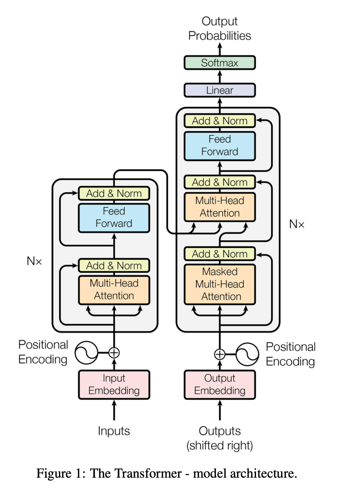
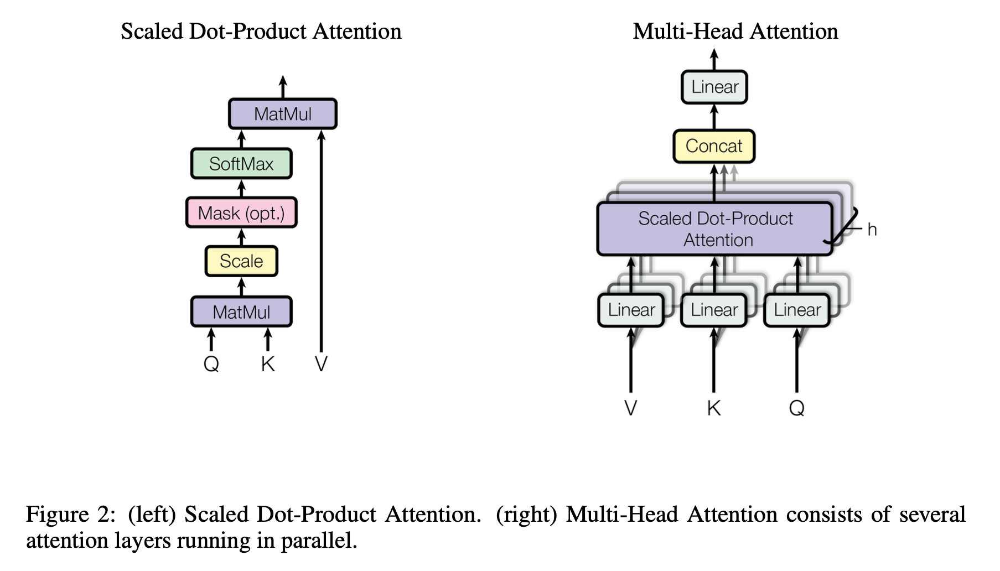
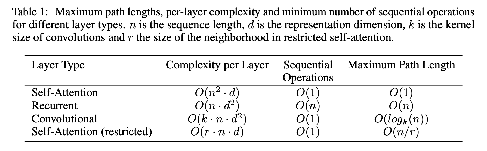
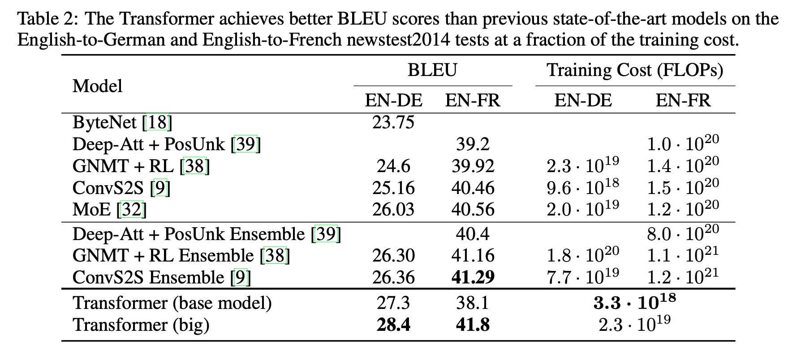
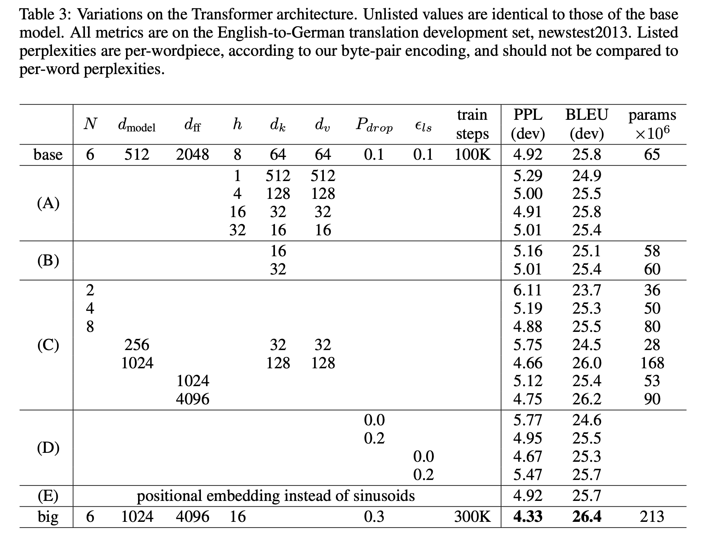
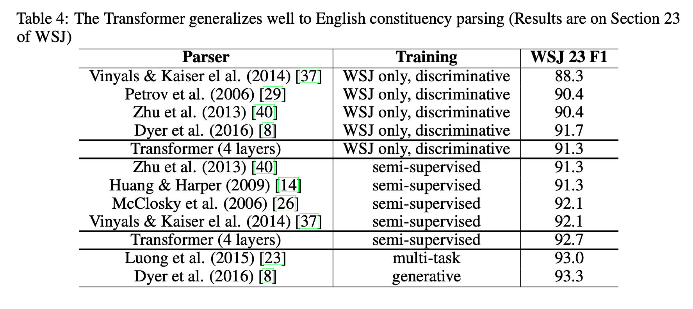

# Transformer: Attention is all you need !

## Abstract
Model transduksi sekuens (*sequence transduction*) yang dominan didasarkan pada jaringan saraf rekuren (*recurrent neural networks*) atau konvensional (*convolutional neural networks*) kompleks yang mencakup sebuah enkoder (*encoder*) dan dekoder (*decoder*). Model-model dengan performa terbaik juga menghubungkan enkoder dan dekoder melalui mekanisme atensi (*attention mechanism*). Kami mengusulkan sebuah arsitektur jaringan baru yang sederhana, [*Transformer*, Vaswani et al, 2017], yang didasarkan sepenuhnya pada mekanisme atensi, dengan menanggalkan elemen rekurensi (*recurrence*) dan konvolusi (*convolutions*) secara keseluruhan. Eksperimen pada dua tugas penerjemahan mesin menunjukkan bahwa model ini memiliki kualitas yang lebih unggul, sekaligus lebih bersifat paralel (*parallelizable*) dan membutuhkan waktu pelatihan yang jauh lebih singkat. Model kami mencapai skor 28,4 BLEU pada tugas penerjemahan bahasa Inggris-ke-Jerman WMT 2014, melampaui hasil terbaik yang ada—termasuk model ansambel (*ensembles*)—dengan peningkatan lebih dari 2 BLEU. Pada tugas penerjemahan bahasa Inggris-ke-Prancis WMT 2014, model kami menetapkan standar baru (*state-of-the-art*) untuk model tunggal dengan skor BLEU sebesar 41,8 setelah melalui pelatihan selama 3,5 hari pada delapan GPU, yang hanya merupakan sebagian kecil dari biaya pelatihan model-model terbaik dalam literatur. Kami menunjukkan bahwa [*Transformer*, Vaswani et al, 2017] mampu melakukan generalisasi dengan baik pada tugas-tugas lain melalui keberhasilan aplikasinya pada penguraian konstituensi (*constituency parsing*—proses analisis struktur sintaksis kalimat) bahasa Inggris, baik dengan data pelatihan yang besar maupun terbatas.

## 1 - Introduction

Jaringan saraf rekuren (recurrent neural networks), khususnya jaringan saraf long short-term memory [LSTM, Hochreiter & Schmidhuber, 1997] dan gated recurrent [GRU, Chung et al, 2014] , telah memantapkan diri secara kokoh sebagai pendekatan standar mutakhir (state of the art) dalam pemodelan sekuens dan masalah transduksi, seperti pemodelan bahasa dan penerjemahan mesin [Sutskever et al, 2014, Bahdanau et al, 2014, Cho et al, 2014]. Berbagai upaya sejak saat itu terus berlanjut untuk memperluas batasan model bahasa rekuren dan arsitektur enkoder-dekoder [GNMT, Wu et al, 2016], [Effective Attention, Luong et al, 2015], [Language Modeling, Jozefowicz et al, 2016].

Model rekuren biasanya memfaktorkan komputasi di sepanjang posisi simbol dari sekuens input dan output. Dengan menyelaraskan posisi-posisi tersebut ke dalam langkah-langkah waktu komputasi, model ini menghasilkan rangkaian status tersembunyi (hidden states) $h_{t}$ sebagai fungsi dari status tersembunyi sebelumnya $h_{t-1}$ dan input untuk posisi $t$. Sifat sekuensial yang inheren ini menghalangi paralelisasi dalam contoh pelatihan, yang menjadi krusial pada panjang sekuens yang lebih besar, mengingat keterbatasan memori membatasi pengelompokan (batching) antar contoh. Penelitian terbaru telah mencapai peningkatan signifikan dalam efisiensi komputasi melalui trik faktorisasi [Factorization Tricks, Kuchaiev & Ginsburg, 2017] dan komputasi kondisional [MoE, Shazeer et al, 2017] , sembari turut meningkatkan performa model pada kasus terakhir. Namun demikian, batasan mendasar dari komputasi sekuensial tetap ada.

Mekanisme atensi (attention mechanisms) telah menjadi bagian integral dari model pemodelan sekuens dan transduksi yang mumpuni dalam berbagai tugas, yang memungkinkan pemodelan dependensi tanpa memedulikan jaraknya dalam sekuens input atau output [Bahdanau et al, 2014, Structured Attention, Kim et al, 2017]. Akan tetapi, kecuali dalam beberapa kasus [Decomposable Attention, Parikh et al, 2016] , mekanisme atensi tersebut umumnya digunakan bersamaan dengan jaringan rekuren.

Dalam karya ini, kami mengusulkan Transformer, sebuah arsitektur model yang menghindari rekurensi dan sebaliknya mengandalkan sepenuhnya pada mekanisme atensi untuk menarik dependensi global antara input dan output. Transformer memungkinkan paralelisasi yang jauh lebih besar secara signifikan dan dapat mencapai standar mutakhir (state of the art) baru dalam kualitas penerjemahan setelah dilatih hanya selama dua belas jam pada delapan GPU P100.

## 2 - Background

Tujuan untuk mengurangi komputasi sekuensial juga membentuk landasan bagi [Extended Neural GPU, Kaiser & Bengio, 2016], [ByteNet, Kalchbrenner et al, 2016], dan [ConvS2S, Gehring et al, 2017], yang semuanya menggunakan jaringan saraf konvolusi (convolutional neural networks) sebagai blok pembangun dasar, dengan menghitung representasi tersembunyi secara paralel untuk seluruh posisi input dan output. Dalam model-model tersebut, jumlah operasi yang diperlukan untuk menghubungkan sinyal dari dua posisi input atau output sembarang bertumbuh seiring dengan jarak antar posisi, yakni secara linear untuk [ConvS2S, Gehring et al, 2017] dan secara logaritmik untuk [ByteNet, Kalchbrenner et al, 2016]. Hal ini mempersulit proses pembelajaran dependensi antara posisi-posisi yang berjauhan [Long-term Dependencies, Hochreiter et al, 2001].

Dalam [Transformer, Vaswani et al, 2017], kendala ini direduksi menjadi jumlah operasi yang konstan, meskipun dengan konsekuensi penurunan resolusi efektif akibat perataan (averaging) posisi-posisi yang berbobot atensi, sebuah efek yang kami tanggulangi dengan Multi-Head Attention sebagaimana dijelaskan dalam bagian 3.2.

Self-attention, yang terkadang disebut intra-attention, merupakan mekanisme atensi yang menghubungkan posisi-posisi berbeda dari satu sekuens tunggal guna menghitung representasi dari sekuens tersebut. Self-attention telah berhasil digunakan dalam berbagai tugas, termasuk pemahaman bacaan (reading comprehension), peringkasan abstraktif (abstractive summarization), implikasi tekstual (textual entailment), dan pembelajaran representasi kalimat yang bersifat independen terhadap tugas [LSTM-networks, Cheng et al, 2016], [Decomposable Attention, Parikh et al, 2016], [Abstractive Summarization, Paulus et al, 2017], [Self-attentive Sentence Embedding, Lin et al, 2017].

Jaringan memori end-to-end [End-to-end memory networks, Sukhbaatar et al, 2015] didasarkan pada mekanisme atensi rekuren alih-alih rekurensi yang selaras dengan sekuens (sequence-aligned recurrence), dan telah terbukti menunjukkan performa yang baik pada tugas menjawab pertanyaan bahasa sederhana serta tugas pemodelan bahasa.

Sejauh pengetahuan kami, bagaimanapun juga, [Transformer, Vaswani et al, 2017] adalah model transduksi pertama yang mengandalkan sepenuhnya pada self-attention untuk menghitung representasi input dan outputnya tanpa menggunakan RNN yang selaras dengan sekuens atau konvolusi. Pada bagian-bagian berikut, kami akan mendeskripsikan [Transformer, Vaswani et al, 2017], memberikan motivasi di balik penggunaan self-attention, serta mendiskusikan keunggulannya dibandingkan model-model seperti [Neural GPUs, Kaiser & Sutskever, 2016], [ByteNet, Kalchbrenner et al, 2016], dan [ConvS2S, Gehring et al, 2017].

## 3 - Model Architecture

Sebagian besar model transduksi sekuens saraf (neural sequence transduction) yang kompetitif memiliki struktur enkoder-dekoder [RNN Encoder-Decoder, Cho et al, 2014], [Neural Machine Translation, Bahdanau et al, 2014], [Sequence to Sequence Learning, Sutskever et al, 2014]. Di sini, enkoder memetakan sekuens input dari representasi simbol $(x_1,...,x_n)$ ke sebuah sekuens representasi kontinu $z = (z_1,...,z_n)$. Berdasarkan $z$, dekoder kemudian menghasilkan sekuens output $(y_1,...,y_m)$ dari simbol-simbol yang diproses satu per satu. Pada setiap langkah, model ini bersifat auto-regresif [Generating Sequences, Graves, 2013], yang mengonsumsi simbol-simbol yang dihasilkan sebelumnya sebagai input tambahan saat menghasilkan simbol berikutnya. Transformer mengikuti arsitektur umum ini dengan menggunakan self-attention bertumpuk serta lapisan terhubung sepenuhnya (fully connected) secara titik demi titik (point-wise) baik untuk enkoder maupun dekoder, yang masing-masing ditunjukkan pada bagian kiri dan kanan Gambar 1.

### Figure 1. The Transformer - model architecture

## 3.1 - Encoder and Decoder Stacks

*Enkoder*: Enkoder terdiri dari tumpukan $N = 6$ lapisan identik. Setiap lapisan memiliki dua sub-lapisan. Sub-lapisan pertama adalah mekanisme multi-head self-attention, dan yang kedua adalah jaringan saraf maju (feed-forward network) sederhana yang terhubung sepenuhnya secara titik demi titik. Kami menerapkan koneksi residu [Deep Residual Learning, He et al, 2016] di sekitar masing-masing dari kedua sub-lapisan tersebut, yang diikuti oleh normalisasi lapisan (layer normalization) [Layer Normalization, Ba et al, 2016]. Dengan demikian, output dari setiap sub-lapisan adalah 

$$LayerNorm(x + Sublayer(x))$$

di mana $Sublayer(x)$ merupakan fungsi yang diimplementasikan oleh sub-lapisan itu sendiri. Untuk memfasilitasi koneksi residu ini, semua sub-lapisan dalam model, serta lapisan penyematan (embedding layers), menghasilkan output dengan dimensi $d_{model} = 512$.

*Dekoder*: Dekoder juga terdiri dari tumpukan $N = 6$ lapisan identik. Selain dua sub-lapisan yang ada pada setiap lapisan enkoder, dekoder menyisipkan sub-lapisan ketiga yang menjalankan multi-head attention terhadap output dari tumpukan enkoder. Serupa dengan enkoder, kami menerapkan koneksi residu di sekitar setiap sub-lapisan, diikuti oleh normalisasi lapisan. Kami juga memodifikasi sub-lapisan self-attention pada tumpukan dekoder untuk mencegah posisi-posisi tertentu agar tidak memperhatikan (attending) posisi-posisi setelahnya. Mekanisme masking ini, dikombinasikan dengan fakta bahwa penyematan output digeser satu posisi, memastikan bahwa prediksi untuk posisi $i$ hanya dapat bergantung pada output yang telah diketahui pada posisi yang kurang dari $i$.

## 3.2 - Attention

Fungsi atensi dapat dideskripsikan sebagai pemetaan sebuah query (permintaan) dan sekumpulan pasangan key-value (kunci-nilai) ke sebuah output, di mana query, key, value, dan output semuanya merupakan vektor. Output dihitung sebagai jumlah bobot dari nilai-nilai (weighted sum of the values), di mana bobot yang diberikan pada setiap value dihitung oleh fungsi kompatibilitas antara query dengan key yang bersesuaian.

### Figure 2 - Scaled Dot-Product Attention and Multi-Head Attention

## 3.2.1 - Scaled Dot-Product Attention

Kami menyebut mekanisme atensi khusus kami sebagai Scaled Dot-Product Attention (Gambar 2). Inputnya terdiri dari queries (permintaan) dan keys (kunci) berdimensi $d_k$, serta values (nilai) berdimensi $d_v$. Kami menghitung hasil kali titik (dot products) dari query dengan seluruh keys, membagi setiap hasil tersebut dengan $\sqrt{d_k}$, dan menerapkan fungsi softmax untuk mendapatkan bobot pada values.

Dalam praktiknya, kami menghitung fungsi atensi pada sekumpulan queries secara simultan, yang dikemas bersama ke dalam sebuah matriks $Q$. Keys dan values juga dikemas bersama ke dalam matriks $K$ dan $V$. Kami menghitung matriks output sebagai berikut:

$$Attention(Q,K,V) = \text{softmax}\left( \frac{QK^T}{\sqrt{d_k}} \right)V \quad (1)$$

Dua fungsi atensi yang paling umum digunakan adalah additive attention [Neural Machine Translation, Bahdanau et al, 2014] dan dot-product (multiplicative) attention. Dot-product attention identik dengan algoritma kami, kecuali untuk faktor penskalaan $\frac{1}{\sqrt{d_k}}$. Additive attention menghitung fungsi kompatibilitas menggunakan jaringan saraf maju (feed-forward network) dengan satu lapisan tersembunyi. Meskipun keduanya memiliki kompleksitas teoretis yang serupa, dot-product attention jauh lebih cepat dan lebih efisien ruang dalam praktiknya, karena dapat diimplementasikan menggunakan kode perkalian matriks yang sangat teroptimasi.

Meskipun untuk nilai $d_k$ yang kecil kedua mekanisme tersebut menunjukkan performa yang serupa, additive attention mengungguli dot product attention tanpa penskalaan untuk nilai $d_k$ yang lebih besar [Massive Exploration, Britz et al, 2017]. Kami menduga bahwa untuk nilai $d_k$ yang besar, besaran hasil kali titik meningkat secara signifikan, sehingga mendorong fungsi softmax ke wilayah di mana ia memiliki gradien yang sangat kecil. Untuk menanggulangi efek ini, kami menskalakan hasil kali titik tersebut dengan $\frac{1}{\sqrt{d_k}}$.

## 3.2.2 - Multi-Head Attention

Alih-alih menjalankan fungsi atensi tunggal dengan keys, values, dan queries berdimensi $d_{model}$, kami menemukan bahwa memproyeksikan queries, keys, dan values secara linear sebanyak $h$ kali dengan proyeksi linear berbeda yang dipelajari ke dimensi $d_k$, $d_k$, dan $d_v$ memberikan hasil yang lebih menguntungkan. Pada setiap versi proyeksi dari queries, keys, dan values ini, kami kemudian menjalankan fungsi atensi secara paralel, sehingga menghasilkan nilai output berdimensi $d_v$. Hasil-hasil ini dikatenasi (concatenated) dan sekali lagi diproyeksikan, menghasilkan nilai akhir sebagaimana digambarkan pada Gambar 2.

Multi-head attention memungkinkan model untuk secara bersama-sama memperhatikan informasi dari subruang representasi (representation subspaces) yang berbeda pada posisi yang berbeda pula. Dengan kepala atensi (attention head) tunggal, proses perataan (averaging) menghalangi hal ini.

$$MultiHead(Q,K,V) = Concat(head_1,...,head_h)W^O$$

di mana $head_i = Attention(QW_i^Q, KW_i^K, VW_i^V)$

Di mana proyeksi-proyeksi tersebut merupakan matriks parameter $W_i^Q \in \mathbb{R}^{d_{model} \times d_k}$, $W_i^K \in \mathbb{R}^{d_{model} \times d_k}$, $W_i^V \in \mathbb{R}^{d_{model} \times d_v}$ dan $W^O \in \mathbb{R}^{hd_v \times d_{model}}$.

Dalam karya ini [Transformer, Vaswani et al, 2017], kami menggunakan $h = 8$ lapisan atensi paralel, atau heads. Untuk setiap lapisan tersebut, kami menggunakan $d_k = d_v = d_{model}/h = 64$. Karena dimensi setiap head telah dikurangi, total biaya komputasi yang dihasilkan serupa dengan single-head attention dengan dimensi penuh.

## 3.2.3 - Applications of Attention in our Model

Transformer menggunakan multi-head attention dalam tiga cara yang berbeda:
* Dalam lapisan-lapisan "encoder-decoder attention", kueri (queries) berasal dari lapisan dekoder sebelumnya, sedangkan kunci memori (memory keys) dan nilai (values) berasal dari keluaran enkoder. Hal ini memungkinkan setiap posisi dalam dekoder untuk memperhatikan (attend over) seluruh posisi dalam sekuens input. Mekanisme ini meniru mekanisme atensi enkoder-dekoder tipikal dalam model sekuens-ke-sekuens (sequence-to-sequence) seperti [GNMT, Wu et al, 2016], [Bahdanau Attention, Bahdanau et al, 2014], dan [ConvS2S, Gehring et al, 2017].
* Enkoder mengandung lapisan-lapisan self-attention. Dalam sebuah lapisan self-attention, seluruh kunci (keys), nilai (values), dan kueri (queries) berasal dari tempat yang sama, yang dalam kasus ini adalah keluaran dari lapisan sebelumnya dalam enkoder. Setiap posisi dalam enkoder dapat memperhatikan seluruh posisi pada lapisan enkoder sebelumnya.
* Serupa dengan hal tersebut, lapisan-lapisan self-attention dalam dekoder memungkinkan setiap posisi dalam dekoder untuk memperhatikan seluruh posisi dalam dekoder hingga dan termasuk posisi tersebut. Kita perlu mencegah aliran informasi ke arah kiri dalam dekoder untuk mempertahankan properti auto-regresif. Kami mengimplementasikan hal ini di dalam scaled dot-product attention dengan meniadakan (masking out) — yakni menetapkan ke $-\infty$ — seluruh nilai pada input softmax yang bersesuaian dengan koneksi ilegal. Silakan merujuk pada Gambar 2.

## 3.3 - Position-wise Feed-Forward Networks

Selain sub-lapisan atensi, setiap lapisan dalam enkoder dan dekoder kami mengandung jaringan saraf maju (feed-forward network) terhubung sepenuhnya, yang diterapkan pada setiap posisi secara terpisah dan identik. Jaringan ini terdiri dari dua transformasi linear dengan aktivasi ReLU di antaranya.

$$FFN(x) = \max(0, xW_1 + b_1)W_2 + b_2 \quad (2) \text{ [cite: 149, 150]}$$

Meskipun transformasi linear tersebut sama di berbagai posisi yang berbeda, mereka menggunakan parameter yang berbeda dari satu lapisan ke lapisan lainnya. Cara lain untuk mendeskripsikan hal ini adalah sebagai dua konvolusi dengan ukuran kernel 1. Dimensi input dan output adalah $d_{model} = 512$, dan lapisan internal memiliki dimensi $d_{ff} = 2048$.

## 3.4 - Embeddings and Softmax

Serupa dengan model transduksi sekuens saraf lainnya, kami menggunakan penyematan terpelajar (learned embeddings) untuk mengubah token input dan token output menjadi vektor berdimensi $d_{model}$. Kami juga menggunakan transformasi linear terpelajar dan fungsi softmax yang lazim digunakan untuk mengubah keluaran dekoder menjadi probabilitas prediksi token berikutnya. Dalam model kami, kami berbagi matriks bobot yang sama di antara kedua lapisan penyematan dan transformasi linear pra-softmax, serupa dengan [Output Embedding, Press & Wolf, 2016]. Dalam lapisan-lapisan penyematan, kami mengalikan bobot tersebut dengan $\sqrt{d_{model}}$.

### Table 1

Tabel 1: Panjang lintasan maksimum, kompleksitas per lapisan, dan jumlah minimum operasi sekuensial untuk berbagai tipe lapisan. $n$ adalah panjang sekuens, $d$ adalah dimensi representasi, $k$ adalah ukuran kernel konvolusi, dan $r$ adalah ukuran lingkungan dalam restricted self-attention.

## 3.5 - Positional Encoding

Karena model kami tidak mengandung rekurensi maupun konvolusi, agar model dapat memanfaatkan urutan sekuens, kita harus menyuntikkan informasi mengenai posisi relatif atau absolut dari token dalam sekuens tersebut. Untuk tujuan ini, kami menambahkan "pengodean posisi" (positional encodings) pada penyematan input di bagian bawah tumpukan enkoder dan dekoder. Pengodean posisi memiliki dimensi $d_{model}$ yang sama dengan penyematan, sehingga keduanya dapat dijumlahkan. Terdapat banyak pilihan pengodean posisi, baik yang dipelajari (learned) maupun yang tetap (fixed) [ConvS2S, Gehring et al, 2017].

Dalam karya ini, kami menggunakan fungsi sinus dan kosinus dengan frekuensi yang berbeda:

$$PE_{(pos,2i)} = \sin(pos/10000^{2i/d_{model}})$$

$$PE_{(pos,2i+1)} = \cos(pos/10000^{2i/d_{model}})$$

di mana $pos$ adalah posisi dan $i$ adalah dimensi. Artinya, setiap dimensi dari pengodean posisi bersesuaian dengan sinusoid. Panjang gelombangnya membentuk progresi geometris dari $2\pi$ hingga $10000 \cdot 2\pi$. Kami memilih fungsi ini karena kami berhipotesis bahwa hal tersebut akan memungkinkan model untuk mempelajari atensi berdasarkan posisi relatif dengan mudah, karena untuk setiap offset tetap $k$, $PE_{pos+k}$ dapat direpresentasikan sebagai fungsi linear dari $PE_{pos}$.

Kami juga bereksperimen dengan menggunakan penyematan posisi terpelajar (learned positional embeddings) [ConvS2S, Gehring et al, 2017] sebagai pengganti, dan menemukan bahwa kedua versi menghasilkan hasil yang hampir identik (lihat Tabel 3 baris (E)). Kami memilih versi sinusoidal karena hal tersebut mungkin memungkinkan model untuk melakukan ekstrapolasi ke panjang sekuens yang lebih lama daripada yang ditemui selama pelatihan.

## 4 - Why Self-Attention

Pada bagian ini, kami membandingkan berbagai aspek lapisan self-attention dengan lapisan rekuren dan konvolusional yang umum digunakan untuk memetakan satu sekuens representasi simbol dengan panjang variabel $(x_1, \dots, x_n)$ ke sekuens lain dengan panjang yang sama $(z_1, \dots, z_n)$, dengan $x_i, z_i \in \mathbb{R}^d$, seperti lapisan tersembunyi dalam enkoder atau dekoder transduksi sekuens tipikal. Dalam memotivasi penggunaan self-attention, kami mempertimbangkan tiga kriteria utama (desiderata).

Pertama adalah total kompleksitas komputasi per lapisan. Kedua adalah jumlah komputasi yang dapat diparalelkan, yang diukur dengan jumlah minimum operasi sekuensial yang diperlukan.

Ketiga adalah panjang lintasan antara dependensi jarak jauh dalam jaringan. Mempelajari dependensi jarak jauh merupakan tantangan utama dalam banyak tugas transduksi sekuens. Salah satu faktor kunci yang memengaruhi kemampuan untuk mempelajari dependensi tersebut adalah panjang lintasan yang harus ditempuh oleh sinyal maju dan mundur dalam jaringan. Semakin pendek lintasan antara kombinasi posisi apa pun dalam sekuens input dan output, semakin mudah untuk mempelajari dependensi jarak jauh [Long-term Dependencies, Hochreiter et al, 2001]. Oleh karena itu, kami juga membandingkan panjang lintasan maksimum antara dua posisi input dan output mana pun dalam jaringan yang terdiri dari berbagai tipe lapisan yang berbeda.

Sebagaimana dicatat dalam Tabel 1, lapisan self-attention menghubungkan semua posisi dengan jumlah operasi eksekusi sekuensial yang konstan, sedangkan lapisan rekuren memerlukan $O(n)$ operasi sekuensial. Dalam hal kompleksitas komputasi, lapisan self-attention lebih cepat daripada lapisan rekuren ketika panjang sekuens $n$ lebih kecil daripada dimensi representasi $d$, yang merupakan kasus paling umum dalam representasi kalimat yang digunakan oleh model standar mutakhir dalam penerjemahan mesin, seperti representasi word-piece [GNMT, Wu et al, 2016] dan byte-pair [Subword Units, Sennrich et al, 2015]. Untuk meningkatkan performa komputasi pada tugas-tugas yang melibatkan sekuens yang sangat panjang, self-attention dapat dibatasi untuk hanya mempertimbangkan lingkungan berukuran $r$ dalam sekuens input yang berpusat di sekitar posisi output masing-masing. Hal ini akan meningkatkan panjang lintasan maksimum menjadi $O(n/r)$. Kami berencana untuk menyelidiki pendekatan ini lebih lanjut dalam pekerjaan di masa depan.

Satu lapisan konvolusional dengan lebar kernel $k < n$ tidak menghubungkan semua pasangan posisi input dan output. Melakukan hal tersebut memerlukan tumpukan $O(n/k)$ lapisan konvolusional dalam kasus kernel kontinu, atau $O(\log_k(n))$ dalam kasus konvolusi terdilasi (dilated convolutions) [ByteNet, Kalchbrenner et al, 2017], yang meningkatkan panjang lintasan terlama antara dua posisi mana pun dalam jaringan. Lapisan konvolusional umumnya lebih mahal daripada lapisan rekuren, dengan faktor $k$. Namun, konvolusi terpisah (separable convolutions) [Xception, Chollet, 2016] menurunkan kompleksitas secara signifikan menjadi $O(k \cdot n \cdot d + n \cdot d^2)$. Bahkan dengan $k = n$, kompleksitas konvolusi terpisah setara dengan kombinasi lapisan self-attention dan lapisan feed-forward titik demi titik, yang merupakan pendekatan yang kami ambil dalam model kami.

Sebagai manfaat sampingan, self-attention dapat menghasilkan model yang lebih dapat diinterpretasikan (interpretable). Kami memeriksa distribusi atensi dari model kami serta menyajikan dan mendiskusikan contoh-contohnya dalam lampiran. Tidak hanya setiap kepala atensi (attention heads) secara jelas belajar untuk melakukan tugas yang berbeda, banyak di antaranya tampak menunjukkan perilaku yang berkaitan dengan struktur sintaksis dan semantik kalimat.

## 5 - Training

Bagian ini mendeskripsikan rezim pelatihan untuk model kami.

## 5.1 - Training Data and Batching
Kami melakukan pelatihan pada dataset standar Inggris-Jerman WMT 2014 yang terdiri dari sekitar 4,5 juta pasangan kalimat. Kalimat-kalimat tersebut dikodekan menggunakan byte-pair encoding [Massive Exploration, Britz et al, 2017], yang memiliki kosakata sumber-target bersama sebanyak kurang lebih 37.000 token. Untuk Inggris-Prancis, kami menggunakan dataset Inggris-Prancis WMT 2014 yang jauh lebih besar, yang terdiri dari 36 juta kalimat dan membagi token ke dalam kosakata word-piece sebanyak 32.000 [GNMT, Wu et al, 2016]. Pasangan kalimat dikelompokkan bersama berdasarkan perkiraan panjang sekuens. Setiap batch pelatihan berisi sekumpulan pasangan kalimat yang mencakup kurang lebih 25.000 token sumber dan 25.000 token target.

## 5.2 - Hardware and Schedule
Kami melatih model kami pada satu mesin dengan 8 GPU NVIDIA P100. Untuk model dasar kami yang menggunakan hiperparameter yang dideskripsikan di seluruh makalah ini, setiap langkah pelatihan memakan waktu sekitar 0,4 detik. Kami melatih model dasar selama total 100.000 langkah atau 12 jam. Untuk model besar (big models) kami (yang dideskripsikan pada baris bawah Tabel 3), waktu per langkah adalah 1,0 detik. Model besar dilatih selama 300.000 langkah (3,5 hari).

## 5.3 - Optimizer

Kami menggunakan pengoptimasi Adam [Adam, Kingma & Ba, 2015] dengan $\beta_{1} = 0,9$, $\beta_{2} = 0,98$, dan $\epsilon = 10^{-9}$. Kami memvariasikan laju pembelajaran (learning rate) selama masa pelatihan, sesuai dengan formula:

$$lrate = d_{model}^{-0,5} \cdot \min(step\_num^{-0,5}, step\_num \cdot warmup\_steps^{-1,5}) \quad (3)$$

Hal ini bersesuaian dengan peningkatan laju pembelajaran secara linear untuk $warmup\_steps$ langkah pelatihan pertama, dan penurunannya setelah itu secara proporsional terhadap akar kuadrat terbalik dari nomor langkah. Kami menggunakan $warmup\_steps = 4000$.

## 5.4 - Regularization

Kami menerapkan tiga jenis regularisasi selama pelatihan:
* Residual Dropout: Kami menerapkan dropout [Dropout, Srivastava et al, 2014] pada output dari setiap sub-lapisan, sebelum ditambahkan ke input sub-lapisan dan dinormalisasi. Selain itu, kami menerapkan dropout pada jumlah penyematan (embeddings) dan pengodean posisi dalam tumpukan enkoder maupun dekoder. Untuk model dasar, kami menggunakan laju $P_{drop} = 0,1$.
* Label Smoothing: Selama pelatihan, kami menerapkan label smoothing dengan nilai $\epsilon_{ls} = 0,1$ [Inception, Szegedy et al, 2016]. Hal ini memperburuk perplexity, karena model belajar untuk menjadi lebih tidak yakin, namun meningkatkan akurasi dan skor BLEU.

### Table 2

Tabel 2: Transformer mencapai skor BLEU yang lebih baik daripada model standar mutakhir sebelumnya pada pengujian newstest2014 Inggris-ke-Jerman dan Inggris-ke-Prancis dengan sebagian kecil dari biaya pelatihan.
## 6 - Results

## 6.1 - Machine Translation

Pada tugas penerjemahan Inggris-ke-Jerman WMT 2014, model Transformer besar (Transformer (big) dalam Tabel 2) melampaui model-model terbaik yang dilaporkan sebelumnya (termasuk model ansambel) dengan margin lebih dari 2,0 BLEU, sehingga menetapkan standar mutakhir (state-of-the-art) baru dengan skor BLEU sebesar 28,4. Konfigurasi model ini tercantum pada baris bawah Tabel 3. Pelatihan memakan waktu selama 3,5 hari pada delapan GPU P100. Bahkan model dasar kami melampaui semua model dan ansambel yang telah dipublikasikan sebelumnya, dengan biaya pelatihan yang hanya merupakan sebagian kecil dari biaya model kompetitif mana pun.

Pada tugas penerjemahan Inggris-ke-Prancis WMT 2014, model besar kami mencapai skor BLEU sebesar 41,0, mengungguli semua model tunggal yang dipublikasikan sebelumnya, dengan biaya pelatihan kurang dari seperempat dari model standar mutakhir sebelumnya. Model Transformer (big) yang dilatih untuk Inggris-ke-Prancis menggunakan laju dropout $P_{drop} = 0,1$, alih-alih 0,3.

Untuk model dasar, kami menggunakan model tunggal yang diperoleh dengan merata-ratakan 5 titik henti (checkpoints) terakhir, yang ditulis pada interval 10 menit. Untuk model besar, kami merata-ratakan 20 titik henti terakhir. Kami menggunakan pencarian berkas (beam search) dengan ukuran berkas (beam size) 4 dan penalti panjang $\alpha = 0,6$ [GNMT, Wu et al, 2016]. Hiperparameter ini dipilih setelah melakukan eksperimen pada set pengembangan (development set). Kami menetapkan panjang output maksimum selama inferensi menjadi panjang input + 50, namun menghentikan proses lebih awal jika memungkinkan [GNMT, Wu et al, 2016].

Tabel 2 merangkum hasil kami dan membandingkan kualitas penerjemahan serta biaya pelatihan kami dengan arsitektur model lain dari literatur. Kami mengestimasi jumlah operasi titik-mengambang (floating point operations) yang digunakan untuk melatih sebuah model dengan mengalikan waktu pelatihan, jumlah GPU yang digunakan, dan estimasi kapasitas titik-mengambang presisi tunggal (single-precision) yang berkelanjutan dari setiap GPU (Kami menggunakan nilai 2,8, 3,7, 6,0, dan 9,5 TFLOPS masing-masing untuk K80, K40, M40, dan P100).

## 6.2 - Model Variations

Untuk mengevaluasi pentingnya berbagai komponen dari Transformer, kami memvariasikan model dasar kami dengan cara yang berbeda, mengukur perubahan performa pada penerjemahan Inggris-ke-Jerman pada set pengembangan, newstest2013. Kami menggunakan beam search sebagaimana dijelaskan pada bagian sebelumnya, namun tanpa perataan titik henti (checkpoint averaging). Kami menyajikan hasil ini dalam Tabel 3.

Dalam Tabel 3 baris (A), kami memvariasikan jumlah kepala atensi (attention heads) serta dimensi kunci (key) dan nilai (value) atensi, dengan menjaga jumlah komputasi tetap konstan, sebagaimana dijelaskan dalam Bagian 3.2.2. Meskipun atensi kepala-tunggal (single-head attention) memiliki hasil 0,9 BLEU lebih buruk daripada pengaturan terbaik, kualitas juga menurun jika terdapat terlalu banyak kepala.

Dalam Tabel 3 baris (B), kami mengamati bahwa pengurangan ukuran kunci atensi $d_k$ merusak kualitas model. Hal ini menunjukkan bahwa penentuan kompatibilitas tidaklah mudah dan fungsi kompatibilitas yang lebih canggih daripada hasil kali titik (dot product) mungkin bermanfaat. Kami lebih lanjut mengamati dalam baris (C) dan (D) bahwa, sebagaimana telah diperkirakan, model yang lebih besar memberikan hasil lebih baik, dan dropout sangat membantu dalam menghindari penyesuaian berlebih (over-fitting). Dalam baris (E), kami mengganti pengodean posisi sinusoidal kami dengan penyematan posisi terpelajar (learned positional embeddings) [ConvS2S, Gehring et al, 2017], dan mengamati hasil yang hampir identik dengan model dasar.

### Table 3

Tabel 3: Variasi pada arsitektur Transformer. Nilai-nilai yang tidak terdaftar identik dengan model dasar. Semua metrik dihitung pada set pengembangan penerjemahan Inggris-ke-Jerman, newstest2013. Perplexity yang tercantum adalah per-potongan kata (per-wordpiece), sesuai dengan pengodean byte-pair kami, dan tidak boleh dibandingkan dengan perplexity per-kata (per-word).

## 6.3 - English Constituency Parsing

Untuk mengevaluasi apakah Transformer dapat digeneralisasi ke tugas-tugas lain, kami melakukan eksperimen pada penguraian konstituensi (constituency parsing) bahasa Inggris. Tugas ini menyajikan tantangan spesifik: output tunduk pada batasan struktural yang kuat dan secara signifikan lebih panjang daripada input. Lebih lanjut, model sekuens-ke-sekuens (sequence-to-sequence) RNN belum mampu mencapai hasil standar mutakhir (state-of-the-art) dalam rezim data terbatas (small-data regimes) [Grammar as a Foreign Language, Vinyals et al, 2015].

Kami melatih Transformer 4-lapisan dengan $d_{model} = 1024$ pada bagian Wall Street Journal (WSJ) dari Penn Treebank [Penn Treebank, Marcus et al, 1993], yang terdiri dari sekitar 40 ribu kalimat pelatihan. Kami juga melatihnya dalam pengaturan semi-terawasi (semi-supervised setting), menggunakan korpus high-confidence dan BerkeleyParser yang lebih besar dengan perkiraan 17 juta kalimat [Grammar as a Foreign Language, Vinyals et al, 2015]. Kami menggunakan kosakata sebanyak 16 ribu token untuk pengaturan khusus WSJ dan kosakata 32 ribu token untuk pengaturan semi-terawasi.

Kami hanya melakukan sejumlah kecil eksperimen untuk memilih dropout, baik pada atensi maupun residu (bagian 5.4), laju pembelajaran, dan ukuran berkas (beam size) pada set pengembangan Seksi 22; semua parameter lainnya tetap tidak berubah dari model penerjemahan dasar Inggris-ke-Jerman. Selama inferensi, kami meningkatkan panjang output maksimum menjadi panjang input + 300. Kami menggunakan ukuran berkas 21 dan $\alpha = 0,3$ baik untuk pengaturan khusus WSJ maupun semi-terawasi.

Hasil kami pada Tabel 4 menunjukkan bahwa meskipun tanpa penalaan khusus-tugas (task-specific tuning), model kami memberikan performa yang sangat baik, menghasilkan hasil yang lebih baik daripada semua model yang dilaporkan sebelumnya, kecuali [Recurrent Neural Network Grammars, Dyer et al, 2016]. Berbeda dengan model sekuens-ke-sekuens RNN [Grammar as a Foreign Language, Vinyals et al, 2015], Transformer mengungguli [BerkeleyParser, Petrov et al, 2006] bahkan ketika hanya dilatih pada set pelatihan WSJ yang berjumlah 40 ribu kalimat.

### Table 4

Tabel 4: Transformer melakukan generalisasi dengan baik pada penguraian konstituensi (English constituency parsing) (Hasil pada Seksi 23 WSJ)

## 7 - Conclusion

Dalam karya ini, kami mempresentasikan Transformer, model transduksi sekuens pertama yang sepenuhnya didasarkan pada atensi, menggantikan lapisan rekuren yang paling umum digunakan dalam arsitektur enkoder-dekoder dengan atensi-diri multi-kepala (multi-headed self-attention).

Untuk tugas-tugas penerjemahan, Transformer dapat dilatih secara signifikan lebih cepat daripada arsitektur yang didasarkan pada lapisan rekuren atau konvolusional. Pada tugas penerjemahan Inggris-ke-Jerman WMT 2014 dan Inggris-ke-Prancis WMT 2014, kami mencapai standar mutakhir (state-of-the-art) yang baru. Pada tugas yang pertama, model terbaik kami bahkan mengungguli semua model ansambel yang dilaporkan sebelumnya.

Kami sangat antusias dengan masa depan model berbasis atensi dan berencana untuk menerapkannya pada tugas-tugas lain. Kami berencana untuk memperluas Transformer ke masalah yang melibatkan modalitas input dan output selain teks, serta menyelidiki mekanisme atensi lokal yang terbatas untuk menangani input dan output besar secara efisien seperti gambar, audio, dan video. Menjadikan proses generasi kurang sekuensial adalah tujuan penelitian kami yang lain. Kode yang kami gunakan untuk melatih dan mengevaluasi model kami tersedia di https://github.com/tensorflow/tensor2tensor.

## Acknowledgements

Kami berterima kasih kepada Nal Kalchbrenner dan Stephan Gouws atas komentar, koreksi, dan inspirasi mereka yang berharga.

## References

[ ]

[1] [Layer Normalization, Layer Normalization, Jimmy Lei Ba et al, 2016]. 

[2] [Neural Machine Translation, Neural Machine Translation by Jointly Learning to Align and Translate, Dzmitry Bahdanau et al, 2014]. 

[3] [Massive Exploration, Massive Exploration of Neural Machine Translation Architectures, Denny Britz et al, 2017]. 

[4] [LSTM-networks, Long Short-term Memory-networks for Machine Reading, Jianpeng Cheng et al, 2016]. 

[5] [RNN Encoder-Decoder, Learning Phrase Representations Using RNN Encoder-Decoder for Statistical Machine Translation, Kyunghyun Cho et al, 2014]. 

[6] [Xception, Xception: Deep Learning with Depthwise Separable Convolutions, Francois Chollet, 2016]. 

[7] [GRU, Empirical Evaluation of Gated Recurrent Neural Networks on Sequence Modeling, Junyoung Chung et al, 2014]. 

[8] [RNNG, Recurrent Neural Network Grammars, Chris Dyer et al, 2016]. 

[9] [ConvS2S, Convolutional Sequence to Sequence Learning, Jonas Gehring et al, 2017]. 

[10] [Generating Sequences, Generating Sequences with Recurrent Neural Networks, Alex Graves, 2013]. 

[11] [ResNet, Deep Residual Learning for Image Recognition, Kaiming He et al, 2016]. 

[12] [Long-term Dependencies, Gradient Flow in Recurrent Nets: The Difficulty of Learning Long-term Dependencies, Sepp Hochreiter et al, 2001]. 

[13] [LSTM, Long Short-term Memory, Sepp Hochreiter et al, 1997]. 

[14] [Self-training PCFG, Self-training PCFG Grammars with Latent Annotations Across Languages, Zhongqiang Huang et al, 2009]. 

[15] [Language Modeling, Exploring the Limits of Language Modeling, Rafal Jozefowicz et al, 2016]. 

[16] [Active Memory, Can Active Memory Replace Attention?, Łukasz Kaiser et al, 2016]. 

[17] [Neural GPUs, Neural GPUs Learn Algorithms, Łukasz Kaiser et al, 2016]. 

[18] [ByteNet, Neural Machine Translation in Linear Time, Nal Kalchbrenner et al, 2017]. 

[19] [Structured Attention, Structured Attention Networks, Yoon Kim et al, 2017]. 

[20] [Adam, Adam: A Method for Stochastic Optimization, Diederik Kingma et al, 2015]. 

[21] [Factorization Tricks, Factorization Tricks for LSTM Networks, Oleksii Kuchaiev et al, 2017]. 

[22] [Self-attentive Sentence Embedding, A Structured Self-attentive Sentence Embedding, Zhouhan Lin et al, 2017]. 

[23] [Multi-task Seq2Seq, Multi-task Sequence to Sequence Learning, Minh-Thang Luong et al, 2015]. 

[24] [Effective Attention, Effective Approaches to Attention-based Neural Machine Translation, Minh-Thang Luong et al, 2015]. 

[25] [Penn Treebank, Building a Large Annotated Corpus of English: The Penn Treebank, Mitchell P Marcus et al, 1993]. 

[26] [Effective Self-training, Effective Self-training for Parsing, David McClosky et al, 2006]. 

[27] [Decomposable Attention, A Decomposable Attention Model, Ankur Parikh et al, 2016]. 

[28] [Abstractive Summarization, A Deep Reinforced Model for Abstractive Summarization, Romain Paulus et al, 2017]. 

[29] [BerkeleyParser, Learning Accurate, Compact, and Interpretable Tree Annotation, Slav Petrov et al, 2006]. 

[30] [Output Embedding, Using the Output Embedding to Improve Language Models, Ofir Press et al, 2016]. 

[31] [Subword Units, Neural Machine Translation of Rare Words with Subword Units, Rico Sennrich et al, 2015]. 

[32] [MoE, Outrageously Large Neural Networks: The Sparsely-gated Mixture-of-experts Layer, Noam Shazeer et al, 2017]. 

[33] [Dropout, Dropout: A Simple Way to Prevent Neural Networks from Overfitting, Nitish Srivastava et al, 2014]. 

[34] [End-to-end Memory Networks, End-to-end Memory Networks, Sainbayar Sukhbaatar et al, 2015]. 

[35] [Sequence to Sequence Learning, Sequence to Sequence Learning with Neural Networks, Ilya Sutskever et al, 2014]. 

[36] [Inception, Rethinking the Inception Architecture for Computer Vision, Christian Szegedy et al, 2015]. 

[37] [Grammar as a Foreign Language, Grammar as a Foreign Language, Oriol Vinyals et al, 2015]. 

[38] [GNMT, Google’s Neural Machine Translation System: Bridging the Gap between Human and Machine Translation, Yonghui Wu et al, 2016]. 

[39] [Deep Recurrent Models, Deep Recurrent Models with Fast-forward Connections for Neural Machine Translation, Jie Zhou et al, 2016]. 

[40] [Fast and Accurate Parsing, Fast and Accurate Shift-reduce Constituent Parsing, Muhua Zhu et al, 2013].